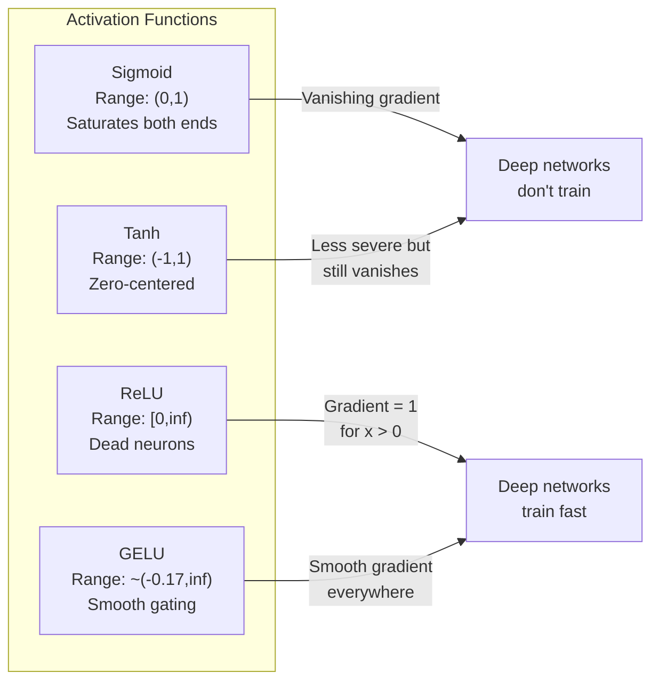
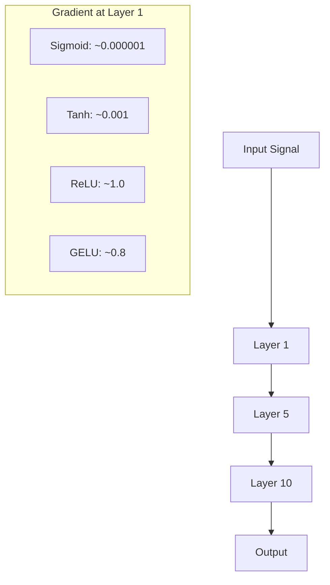
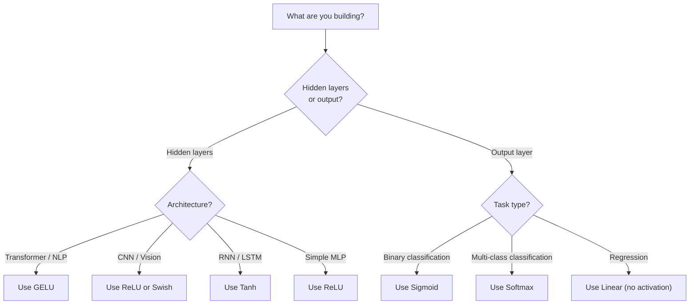

# Funciones de activación

> Sin la no linealidad, tu red de 100 capas es un multiplicador de matriz elegante.

**Type:** Build
**Languages:** Python
**Prerequisites:** Lesson 03.03 (Backpropagation)
**Time:** ~75 minutes

## Objetivos de aprendizaje

- Implementar sigmoide, tanh, ReLU, Leaky ReLU, GELU, Swish y softmax con sus derivados desde cero
- Diagnóstico del problema de gradiente desapareciente midiendo magnitudes de activación a través de 10+ capas con diferentes activaciones
- Detectar neuronas muertas en una red ReLU y explicar por qué GELU evita este modo de falla
- Seleccione la función de activación correcta para una arquitectura dada (transformador, CNN, RNN, capa de salida)

## El problema

Estacle dos transformaciones lineales: y = W2 ((W1x + b1) + b2. Expanda: y = W2W1x + W2b1 + b2. Eso es sólo y = Ax + c - una sola transformación lineal. No importa cuántas capas lineales apiles, el resultado se derrumba a una matriz multiplicada. Su red de 100 capas tiene el mismo poder de representación que una sola capa.

Esto no es una curiosidad teórica. Significa que una red lineal profunda literalmente no puede aprender XOR, no puede clasificar un conjunto de datos en espiral, no puede reconocer una cara. Sin funciones de activación, la profundidad es una ilusión.

Las funciones de activación rompen la linealidad. Deforman la salida de cada capa a través de una función no lineal, dando a la red la capacidad de doblar los límites de decisión, aproximar funciones arbitrarias y realmente aprender. Pero escoge la activación equivocada y tus gradientes desaparecen a cero (sigmoides en redes profundas), explotan hasta el infinito (activaciones ilimitadas sin inicialización cuidadosa), o tus neuronas mueren permanentemente (ReLU con grandes sesgos negativos). La elección de la función de activación determina directamente si su red aprende en absoluto.

## El concepto

### Por qué es necesario no linear

La multiplicación de matrices es composible. Multiplicar un vector por la matriz A y luego la matriz B es idéntico a multiplicar por AB. Esto significa que apilar diez capas lineales es matemáticamente equivalente a una capa lineal con una matriz grande. Todos esos parámetros, toda esa profundidad - desperdiciado. Necesitas algo para romper la cadena. Eso es lo que hacen las funciones de activación.

Aquí está la prueba. Una capa lineal calcula f ((x) = Wx + b.

```
Layer 1: h = W1 * x + b1
Layer 2: y = W2 * h + b2
```

Substitución:

```
y = W2 * (W1 * x + b1) + b2
y = (W2 * W1) * x + (W2 * b1 + b2)
y = A * x + c
```

Una capa. Insertar una activación no lineal g() entre las capas:

```
h = g(W1 * x + b1)
y = W2 * h + b2
```

Ahora la sustitución se rompe. W2 * g(W1 * x + b1) + b2 no se puede reducir a una sola transformación lineal. La red puede representar funciones no lineales. Cada capa adicional con una activación agrega capacidad de representación.

### Sigmoides

La función de activación original de las redes neuronales.

```
sigmoid(x) = 1 / (1 + e^(-x))
```

Rango de salida: (0, 1). Listo, diferenciable, mapea cualquier número real a un valor similar a la probabilidad.

El derivado:

```
sigmoid'(x) = sigmoid(x) * (1 - sigmoid(x))
```

El valor máximo de esta derivada es de 0.25, que ocurre en x = 0. En la propagación posterior, los gradientes se multiplican a través de capas. Diez capas de sigmoide significa que el gradiente se multiplica en un máximo de 0.25 diez veces:

```
0.25^10 = 0.000000953674
```

Menos de una millonésima de la señal original. Este es el problema de la desvanecimiento de gradiente. Los gradientes en las primeras capas se vuelven tan pequeños que los pesos apenas se actualizan. La red parece aprender - la pérdida disminuye en las capas posteriores - pero las primeras capas están congeladas. Las redes sigmoides profundas simplemente no entrenan.

Otro problema: las salidas sigmoides son siempre positivas (0 a 1), lo que significa que los gradientes en los pesos son siempre el mismo signo.

### Tanh

La versión centrada de sigmoides.

```
tanh(x) = (e^x - e^(-x)) / (e^x + e^(-x))
```

Rango de salida: (-1, 1). Centrado en cero, lo que elimina el problema del zigzag.

El derivado:

```
tanh'(x) = 1 - tanh(x)^2
```

La derivada máxima es de 1,0 en x = 0 - cuatro veces mejor que sigmoide. Pero el problema de gradiente desapareciente todavía existe. Para grandes entradas positivas o negativas, la derivada se acerca a cero. Diez capas todavía aplastan el gradiente, sólo menos agresivamente.

### La Revolución

Unidad Lineal rectificada. Popularizada para el aprendizaje profundo por Nair y Hinton en 2010 (la función misma data del trabajo de Fukushima de 1969), cambió todo.

```
relu(x) = max(0, x)
```

El rango de salida: [0, infinito). La derivada es trivialmente simple:

```
relu'(x) = 1  if x > 0
            0  if x <= 0
```

No hay gradiente de desaparición para entradas positivas. El gradiente es exactamente 1, pasado directamente. Es por eso que las redes profundas se hicieron viables - ReLU conserva la magnitud del gradiente a través de las capas.

Pero hay un modo de falla: el problema de la neurona muerta. Si la entrada ponderada de una neurona es siempre negativa (debido a un gran sesgo negativo o una desafortunada inicialización de peso), su salida es siempre cero, su gradiente es siempre cero y nunca se actualiza. Está permanentemente muerta. En la práctica, el 10-40% de las neuronas en una red ReLU pueden morir durante el entrenamiento.

### ReLU filtrado

La solución más simple para las neuronas muertas.

```
leaky_relu(x) = x        if x > 0
                alpha * x if x <= 0
```

Donde el alfa es una constante pequeña, típicamente 0.01. El lado negativo tiene una pequeña pendiente en lugar de cero, por lo que las neuronas muertas todavía reciben una señal de gradiente y pueden recuperarse.

### GELU: El defecto moderno

Unidad lineal de error gaussiano. Introducida por Hendrycks y Gimpel en 2016.

```
gelu(x) = x * Phi(x)
```

Cuando Phi ((x) es la función de distribución acumulada de la distribución normal estándar.

```
gelu(x) ~= 0.5 * x * (1 + tanh(sqrt(2/pi) * (x + 0.044715 * x^3)))
```

GELU es suave en todas partes, permite pequeños valores negativos (a diferencia de ReLU que se hace a cero), y tiene una interpretación probabilística: pesa cada entrada por la probabilidad de que sea positiva bajo una distribución gaussiana.

### El precio de la venta

La activación auto-garada descubierta por Ramachandran et al. en 2017 a través de búsqueda automatizada.

```
swish(x) = x * sigmoid(x)
```

Swish es formalmente x * sigmoid (x). Google lo descubrió a través de búsqueda automática en el espacio de funciones de activación -- una red neuronal que diseña partes de redes neuronales.

Como GELU, es suave, no monótono y permite pequeños valores negativos. La diferencia es sutil: Swish utiliza sigmoid para el gateing mientras que GELU utiliza el CDF gaussiano. En la práctica, el rendimiento es casi idéntico. Swish se utiliza en EfficientNet y algunos modelos de visión. GELU domina en los modelos de lenguaje.

### Softmax: La activación de salida

No se utiliza en capas ocultas. Softmax convierte un vector de puntajes crudos (logits) en una distribución de probabilidades.

```
softmax(x_i) = e^(x_i) / sum(e^(x_j) for all j)
```

Cada salida es entre 0 y 1. Todas las salidas suman a 1. Esto la convierte en la activación final estándar para la clasificación de múltiples clases. La logit más grande obtiene la mayor probabilidad, pero a diferencia de argmax, softmax es diferenciable y conserva información sobre la confianza relativa.

### Comparación de formas



### Comparación de flujo gradual



### ¿Cuál activación cuando



```figure
softmax-temperature
```

## Construye el mismo

### Paso 1: Implementar todas las funciones de activación con derivados

Cada función toma una sola float y devuelve una float.

```python
import math

def sigmoid(x):
    x = max(-500, min(500, x))
    return 1.0 / (1.0 + math.exp(-x))

def sigmoid_derivative(x):
    s = sigmoid(x)
    return s * (1 - s)

def tanh_act(x):
    return math.tanh(x)

def tanh_derivative(x):
    t = math.tanh(x)
    return 1 - t * t

def relu(x):
    return max(0.0, x)

def relu_derivative(x):
    return 1.0 if x > 0 else 0.0

def leaky_relu(x, alpha=0.01):
    return x if x > 0 else alpha * x

def leaky_relu_derivative(x, alpha=0.01):
    return 1.0 if x > 0 else alpha

def gelu(x):
    return 0.5 * x * (1 + math.tanh(math.sqrt(2 / math.pi) * (x + 0.044715 * x ** 3)))

def gelu_derivative(x):
    phi = 0.5 * (1 + math.erf(x / math.sqrt(2)))
    pdf = math.exp(-0.5 * x * x) / math.sqrt(2 * math.pi)
    return phi + x * pdf

def swish(x):
    return x * sigmoid(x)

def swish_derivative(x):
    s = sigmoid(x)
    return s + x * s * (1 - s)

def softmax(xs):
    max_x = max(xs)
    exps = [math.exp(x - max_x) for x in xs]
    total = sum(exps)
    return [e / total for e in exps]
```

### Paso 2: Visualiza dónde mueren los gradientes

Calcule el gradiente en 100 puntos de espacio uniforme de -5 a 5. Imprime un histograma de texto que muestre donde el gradiente de cada activación es casi cero.

```python
def gradient_scan(name, derivative_fn, start=-5, end=5, n=100):
    step = (end - start) / n
    near_zero = 0
    healthy = 0
    for i in range(n):
        x = start + i * step
        g = derivative_fn(x)
        if abs(g) < 0.01:
            near_zero += 1
        else:
            healthy += 1
    pct_dead = near_zero / n * 100
    print(f"{name:15s}: {healthy:3d} healthy, {near_zero:3d} near-zero ({pct_dead:.0f}% dead zone)")

gradient_scan("Sigmoid", sigmoid_derivative)
gradient_scan("Tanh", tanh_derivative)
gradient_scan("ReLU", relu_derivative)
gradient_scan("Leaky ReLU", leaky_relu_derivative)
gradient_scan("GELU", gelu_derivative)
gradient_scan("Swish", swish_derivative)
```

### Paso 3: Experimento gradual de desaparición

Pasar una señal hacia adelante a través de N capas usando sigmoide vs ReLU. Medir cómo cambia la magnitud de activación.

```python
import random

def vanishing_gradient_experiment(activation_fn, name, n_layers=10, n_inputs=5):
    random.seed(42)
    values = [random.gauss(0, 1) for _ in range(n_inputs)]

    print(f"\n{name} through {n_layers} layers:")
    for layer in range(n_layers):
        weights = [random.gauss(0, 1) for _ in range(n_inputs)]
        z = sum(w * v for w, v in zip(weights, values))
        activated = activation_fn(z)
        magnitude = abs(activated)
        bar = "#" * int(magnitude * 20)
        print(f"  Layer {layer+1:2d}: magnitude = {magnitude:.6f} {bar}")
        values = [activated] * n_inputs

vanishing_gradient_experiment(sigmoid, "Sigmoid")
vanishing_gradient_experiment(relu, "ReLU")
vanishing_gradient_experiment(gelu, "GELU")
```

### Paso 4: Detector de neuronas muertas

Crear una red ReLU, pasar entradas aleatorias a través de ella, contar cuántas neuronas nunca se disparan.

```python
def dead_neuron_detector(n_inputs=5, hidden_size=20, n_samples=1000):
    random.seed(0)
    weights = [[random.gauss(0, 1) for _ in range(n_inputs)] for _ in range(hidden_size)]
    biases = [random.gauss(0, 1) for _ in range(hidden_size)]

    fire_counts = [0] * hidden_size

    for _ in range(n_samples):
        inputs = [random.gauss(0, 1) for _ in range(n_inputs)]
        for neuron_idx in range(hidden_size):
            z = sum(w * x for w, x in zip(weights[neuron_idx], inputs)) + biases[neuron_idx]
            if relu(z) > 0:
                fire_counts[neuron_idx] += 1

    dead = sum(1 for c in fire_counts if c == 0)
    rarely_fire = sum(1 for c in fire_counts if 0 < c < n_samples * 0.05)
    healthy = hidden_size - dead - rarely_fire

    print(f"\nDead Neuron Report ({hidden_size} neurons, {n_samples} samples):")
    print(f"  Dead (never fired):     {dead}")
    print(f"  Barely alive (<5%):     {rarely_fire}")
    print(f"  Healthy:                {healthy}")
    print(f"  Dead neuron rate:       {dead/hidden_size*100:.1f}%")

    for i, c in enumerate(fire_counts):
        status = "DEAD" if c == 0 else "WEAK" if c < n_samples * 0.05 else "OK"
        bar = "#" * (c * 40 // n_samples)
        print(f"  Neuron {i:2d}: {c:4d}/{n_samples} fires [{status:4s}] {bar}")

dead_neuron_detector()
```

### Paso 5: Comparación de entrenamiento - Sigmoid vs ReLU vs GELU

Entrenar la misma red de dos capas en el conjunto de datos del círculo (puntos dentro de un círculo = clase 1, fuera = clase 0) con tres activaciones diferentes.

```python
def make_circle_data(n=200, seed=42):
    random.seed(seed)
    data = []
    for _ in range(n):
        x = random.uniform(-2, 2)
        y = random.uniform(-2, 2)
        label = 1.0 if x * x + y * y < 1.5 else 0.0
        data.append(([x, y], label))
    return data


class ActivationNetwork:
    def __init__(self, activation_fn, activation_deriv, hidden_size=8, lr=0.1):
        random.seed(0)
        self.act = activation_fn
        self.act_d = activation_deriv
        self.lr = lr
        self.hidden_size = hidden_size

        self.w1 = [[random.gauss(0, 0.5) for _ in range(2)] for _ in range(hidden_size)]
        self.b1 = [0.0] * hidden_size
        self.w2 = [random.gauss(0, 0.5) for _ in range(hidden_size)]
        self.b2 = 0.0

    def forward(self, x):
        self.x = x
        self.z1 = []
        self.h = []
        for i in range(self.hidden_size):
            z = self.w1[i][0] * x[0] + self.w1[i][1] * x[1] + self.b1[i]
            self.z1.append(z)
            self.h.append(self.act(z))

        self.z2 = sum(self.w2[i] * self.h[i] for i in range(self.hidden_size)) + self.b2
        self.out = sigmoid(self.z2)
        return self.out

    def backward(self, target):
        error = self.out - target
        d_out = error * self.out * (1 - self.out)

        for i in range(self.hidden_size):
            d_h = d_out * self.w2[i] * self.act_d(self.z1[i])
            self.w2[i] -= self.lr * d_out * self.h[i]
            for j in range(2):
                self.w1[i][j] -= self.lr * d_h * self.x[j]
            self.b1[i] -= self.lr * d_h
        self.b2 -= self.lr * d_out

    def train(self, data, epochs=200):
        losses = []
        for epoch in range(epochs):
            total_loss = 0
            correct = 0
            for x, y in data:
                pred = self.forward(x)
                self.backward(y)
                total_loss += (pred - y) ** 2
                if (pred >= 0.5) == (y >= 0.5):
                    correct += 1
            avg_loss = total_loss / len(data)
            accuracy = correct / len(data) * 100
            losses.append(avg_loss)
            if epoch % 50 == 0 or epoch == epochs - 1:
                print(f"    Epoch {epoch:3d}: loss={avg_loss:.4f}, accuracy={accuracy:.1f}%")
        return losses


data = make_circle_data()

configs = [
    ("Sigmoid", sigmoid, sigmoid_derivative),
    ("ReLU", relu, relu_derivative),
    ("GELU", gelu, gelu_derivative),
]

results = {}
for name, act_fn, act_d_fn in configs:
    print(f"\n=== Training with {name} ===")
    net = ActivationNetwork(act_fn, act_d_fn, hidden_size=8, lr=0.1)
    losses = net.train(data, epochs=200)
    results[name] = losses

print("\n=== Final Loss Comparison ===")
for name, losses in results.items():
    print(f"  {name:10s}: start={losses[0]:.4f} -> end={losses[-1]:.4f} (improvement: {(1 - losses[-1]/losses[0])*100:.1f}%)")
```

## Usalo

PyTorch proporciona todas estas formas tanto funcionales como módulos:

```python
import torch
import torch.nn as nn
import torch.nn.functional as F

x = torch.randn(4, 10)

relu_out = F.relu(x)
gelu_out = F.gelu(x)
sigmoid_out = torch.sigmoid(x)
swish_out = F.silu(x)

logits = torch.randn(4, 5)
probs = F.softmax(logits, dim=1)

model = nn.Sequential(
    nn.Linear(10, 64),
    nn.GELU(),
    nn.Linear(64, 32),
    nn.GELU(),
    nn.Linear(32, 5),
)
```

Capas ocultas en un transformador: GELU. Capas ocultas en una CNN: ReLU. Capas de salida para clasificación: softmax. Capas de salida para regresión: ninguno (lineal). Capas de salida para probabilidades: sigmoid. Eso es todo. Empieza con estos valores predeterminados. Cambiarlos sólo cuando tienes evidencia.

Los RNNs y LSTMs usan tanh para el estado oculto y sigmoide para las puertas, pero si estás construyendo desde cero hoy, probablemente no estás usando RNNs. Si las neuronas están muriendo en tu red ReLU, cambia a GELU. No busques ReLU filtrado a menos que tengas una razón específica - GELU resuelve el problema de las neuronas muertas y da un mejor flujo de gradiente.

## Envío

Esta lección produce:
- `outputs/prompt-activation-selector.md`-- una solicitud reutilizable que le ayuda a elegir la función de activación correcta para cualquier arquitectura

## Los ejercicios

1. Implemente el Parametric ReLU (PReLU) donde la pendiente negativa alfa es un parámetro de aprendizaje.

2. Realice el experimento de gradiente de desaparición con 50 capas en lugar de 10. Traza la magnitud en cada capa para sigmoide, tanh, ReLU y GELU. ¿En qué capa la señal de cada activación alcanza efectivamente cero?

3. Implemente la unidad lineal exponencial: elu(x) = x si x > 0, alfa * (e^x - 1) si x <= 0. Compara su tasa de neuronas muertas con la ReLU en la misma red.

4. Construye un "monitoreo de salud gradiente" que se ejecute durante el entrenamiento: en cada época, calcula la magnitud promedio de gradiente en cada capa. Imprima una advertencia cuando el gradiente de cualquier capa cae por debajo de 0,001 o excede 100.

5. Modificar la comparación de entrenamiento para utilizar el conjunto de datos XOR de la Lección 01 en lugar de círculos. ¿Cuál activación converge más rápido en XOR? ¿Por qué esto difiere de los resultados del círculo?

## Términos clave

| Term | What people say | What it actually means |
|------|----------------|----------------------|
| Activation function | "The nonlinear part" | A function applied to each neuron's output that breaks linearity, enabling the network to learn nonlinear mappings |
| Vanishing gradient | "Gradients disappear in deep networks" | Gradients shrink exponentially through layers when the activation's derivative is less than 1, making early layers untrainable |
| Exploding gradient | "Gradients blow up" | Gradients grow exponentially through layers when the effective multiplier exceeds 1, causing unstable training |
| Dead neuron | "A neuron that stopped learning" | A ReLU neuron whose input is permanently negative, producing zero output and zero gradient |
| Sigmoid | "Squishes values to 0-1" | The logistic function 1/(1+e^-x), historically important but causes vanishing gradients in deep networks |
| ReLU | "Clips negatives to zero" | max(0, x) -- the activation that made deep learning practical by preserving gradient magnitude |
| GELU | "The transformer activation" | Gaussian Error Linear Unit, a smooth activation that weights inputs by their probability of being positive |
| Swish/SiLU | "Self-gated ReLU" | x * sigmoid(x), discovered through automated search, used in EfficientNet |
| Softmax | "Turns scores into probabilities" | Normalizes a vector of logits into a probability distribution where all values are in (0,1) and sum to 1 |
| Leaky ReLU | "ReLU that doesn't die" | max(alpha*x, x) where alpha is small (0.01), preventing dead neurons by allowing small negative gradients |
| Saturation | "The flat part of sigmoid" | Regions where an activation's derivative approaches zero, blocking gradient flow |
| Logit | "The raw score before softmax" | The unnormalized output of the final layer before applying softmax or sigmoid |

## Leer más

- Nair & Hinton, "Unidades Lineares Rectificadas Mejoran las Máquinas Restricidas de Boltzmann" (2010) -- el documento que introdujo la ReLU y permitió el entrenamiento de redes profundas
- Hendrycks & Gimpel, "Unidades Lineares de Erro Gaussian (GELUs) " (2016) -- introdujo la función de activación que se convirtió en el predeterminado para transformadores
- Ramachandran et al., "Buscar funciones de activación" (2017) -- usó búsqueda automatizada para descubrir Swish, mostrando que el diseño de activación puede ser automatizado
- Glorot & Bengio, "Comprender la dificultad de entrenar redes neuronales de entrada profunda" (2010) -- el documento que diagnosticó los gradientes desaparecientes/explosivos y propuso la inicialización de Xavier
- Bienvenido, Bengio, Courville, "Aprendizaje profundo" Capítulo 6.3 (https://www.deeplearningbook.org/) -- tratamiento riguroso de las unidades ocultas y las funciones de activación
