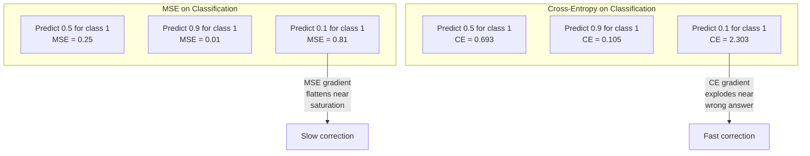
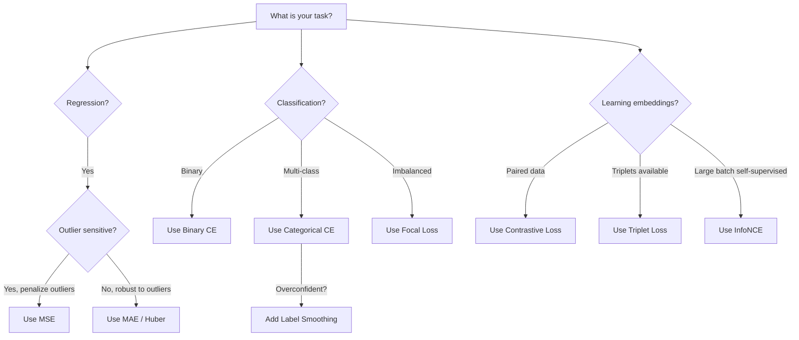
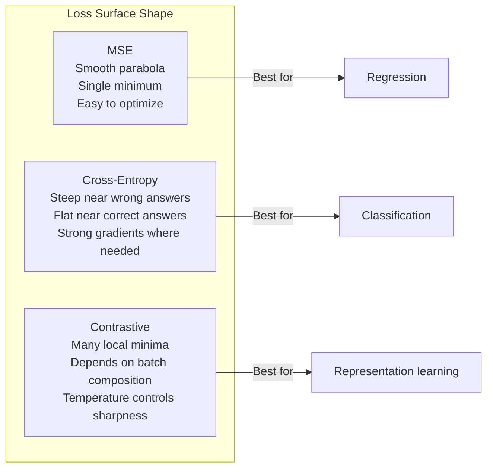

# Funciones perdidas

> La red hace una predicción. La verdad de la base dice lo contrario. ¿Qué tan equivocado es? Ese número es la pérdida. Elige la función de pérdida equivocada y tu modelo optimiza por la cosa equivocada por completo.

**Type:** Build
**Languages:** Python
**Prerequisites:** Lesson 03.04 (Activation Functions)
**Time:** ~75 minutes

## Objetivos de aprendizaje

- Implementar desde cero MSE, entropía cruzada binaria, entropía cruzada categórica y pérdida de contraste (InfoNCE) con sus gradientes
- Explicar por qué el MSE no puede clasificarse mediante la demostración del modo de falla "predección 0.5 para todo"
- Aplicar el suavización de etiqueta a la entropía cruzada y describir cómo evita predicciones demasiado seguras
- Elige la función de pérdida correcta para regresión, clasificación binaria, clasificación multi-clase y incrustación de tareas de aprendizaje

## El problema

Un modelo que minimiza el MSE en un problema de clasificación predice con confianza 0.5 para todo.

La función de pérdida es lo único que su modelo realmente optimiza. No es preciso. No el resultado de la F1. No sea cual sea la métrica que le reportes a tu gerente. El optimizador toma el gradiente de la función de pérdida y ajusta los pesos para hacer que ese número sea menor. Si la función de pérdida no captura lo que te importa, el modelo encontrará la forma matemáticamente más barata de satisfacerlo, y esa forma casi nunca es lo que querías.

Aquí hay un ejemplo concreto. Tienes una tarea de clasificación binaria. Dos clases, dividido 50/50. Uses el MSE como pérdida. El modelo predice 0.5 por cada entrada. El MSE promedio es de 0.25, lo que es el mínimo posible sin aprender nada. El modelo tiene cero capacidad discriminatoria pero técnicamente ha minimizado su función de pérdida. Cambiar a entropía cruzada y el mismo modelo se ve obligado a empujar las predicciones hacia 0 o 1, porque -log(0.5) = 0.693 es una pérdida terrible, mientras que -log(0.99) = 0.01 recompensa con confianza las predicciones correctas. La elección de la función de pérdida es la diferencia entre un modelo que aprende y un modelo que juega la métrica.

En el aprendizaje auto-supervisado, ni siquiera tienes etiquetas. La pérdida de contraste define la señal de aprendizaje por completo: lo que cuenta como similar, lo que cuenta como diferente, y lo duro que el modelo debe separarlos. Si la pérdida de contraste se equivoca y tus incorporaciones colapsan a un solo punto - cada entrada se dirige al mismo vector. Técnicamente pérdida cero. Completamente inútil.

## El concepto

### Erro medio cuadrado (MSE)

El valor predeterminado para la regresión. Calcule la diferencia cuadrada entre predicción y objetivo, promedio sobre todas las muestras.

```
MSE = (1/n) * sum((y_pred - y_true)^2)
```

Por qué la cuadradosidad importa: penaliza los errores grandes cuadráticamente. Un error de 2 cuesta 4 veces más que un error de 1. Un error de 10 cuesta 100 veces. Esto hace que MSE sea sensible a los valores extremos - una sola predicción muy incorrecta domina la pérdida.

Números reales: si su modelo predice los precios de la vivienda y está fuera de $10,000 on most houses but off by $200.000 en una mansión, MSE intentará arreglar agresivamente esa mansión, potencialmente perjudicando el rendimiento en las otras 99 casas.

El gradiente de MSE con respecto a una predicción es:

```
dMSE/dy_pred = (2/n) * (y_pred - y_true)
```

Los errores más grandes obtienen mayores gradientes. Esta es una característica para la regresión (los errores grandes necesitan grandes correcciones) y un error para la clasificación (quieres penalizar las respuestas equivocadas con confianza de manera exponencial, no lineal).

### Perdida de entropía cruzada

La función de pérdida para la clasificación. Enraizada en la teoría de la información, mide la divergencia entre la distribución de probabilidad predicha y la distribución verdadera.

**Binary Cross-Entropy (BCE):**

```
BCE = -(y * log(p) + (1 - y) * log(1 - p))
```

Donde y es la etiqueta verdadera (0 o 1) y p es la probabilidad prevista.

¿Por qué -log(p) funciona: cuando la etiqueta verdadera es 1 y usted predice p = 0.99, la pérdida es -log(0.99) = 0.01. Cuando usted predice p = 0.01, la pérdida es -log(0.01) = 4.6. Esa diferencia de 460x es por qué la entropía cruzada funciona.

El gradiente cuenta la misma historia:

```
dBCE/dp = -(y/p) + (1-y)/(1-p)
```

Cuando y es igual a 1 y p está cerca de cero, el gradiente es -1/p que se acerca al infinito negativo. El modelo recibe una señal enorme para corregir su error. Cuando p está cerca de 1, el gradiente es pequeño. Ya es correcto, nada para corregir.

**Categorical Cross-Entropy:**

Para la clasificación de varias clases con objetivos codificados de un solo tipo.

```
CCE = -sum(y_i * log(p_i))
```

Sólo la clase verdadera contribuye a la pérdida (porque todas las demás y_i son cero). Si hay 10 clases y la clase correcta obtiene probabilidad 0.1 (adivinación aleatoria), la pérdida es -log(0.1) = 2.3.

### Por qué el MSE no clasifica



Los gradientes de MSE se aplanan cuando las predicciones están cerca de 0 o 1 (debido a la saturación sigmoide). Los gradientes de entropía cruzada compensan esto - el -log anula las regiones planas del sigmoide, dando gradientes fuertes exactamente donde más se necesitan.

### Limpiación de etiquetas

Las etiquetas estándar de un solo caliente dicen "esto es 100% clase 3 y 0% todo lo demás". Esa es una afirmación fuerte.

```
smooth_label = (1 - alpha) * one_hot + alpha / num_classes
```

Con alfa = 0,1 y 10 clases: en lugar de [0, 0, 1, 0, ...], el objetivo se convierte en [0, 01, 0.01, 0.91, 0.01, ...]. El modelo se dirige a 0,91 en lugar de 1.0.

Por qué funciona esto: un modelo que intenta emitir exactamente 1.0 a través de una softmax necesita empujar logits hasta el infinito. Esto causa demasiada confianza, daña la generalización y hace que el modelo sea frágil para el cambio de distribución.

### Perdida contrastada

No hay etiquetas, no hay clases, sólo pares de entradas y la pregunta: ¿son similares o diferentes?

**SimCLR-style contrastive loss (NT-Xent / InfoNCE):**

Tomemos una imagen. Creamos dos vistas aumentadas de ella (corte, rotación, nerviosismo de color). Estas son las "paras positivas" - deberían tener embebidas similares. Cada otra imagen en el lote forma una "par negativa" - deberían tener diferentes embebidas.

```
L = -log(exp(sim(z_i, z_j) / tau) / sum(exp(sim(z_i, z_k) / tau)))
```

Cuando sim() es la similitud cosínica, z_i y z_j son el par positivo, la suma es sobre todos los negativos, y tau (temperatura) controla la manera de la distribución.

Números reales: tamaño de lote 256 significa 255 negativos por par positivo. temperatura tau = 0.07 (SimCLR predeterminado). la pérdida parece una máxima suave sobre similitudes - quiere que la similitud del par positivo sea la más alta entre todas las 256 opciones.

**Triplet Loss:**

Toma tres entradas: ancla, positiva (la misma clase), negativa (clase diferente).

```
L = max(0, d(anchor, positive) - d(anchor, negative) + margin)
```

El margen (normalmente 0.2-1.0) impone una brecha mínima entre distancias positivas y negativas. Si el negativo ya está lo suficientemente lejos, la pérdida es cero - sin gradiente, sin actualización. Esto hace que el entrenamiento sea eficiente, pero requiere una minuciosa minería de triplet (escoller negativos duros que estén cerca del anclaje).

### Perdida de foco

Para conjuntos de datos desequilibrados. La entropía cruzada estándar trata todos los ejemplos clasificados correctamente de manera igual.

```
FL = -alpha * (1 - p_t)^gamma * log(p_t)
```

Cuando p_t es la probabilidad prevista de la clase verdadera y gamma controla el enfoque. con gamma = 0, esto es entropía cruzada estándar. con gamma = 2 (el predeterminado):

- Ejemplo fácil (p_t = 0,9): peso = (0,1) ^2 = 0,01.
- Ejemplo duro (p_t = 0,1): peso = (0,9) ^ 2 = 0,81.

La pérdida focal fue introducida por Lin et al. para la detección de objetos, donde el 99% de las regiones candidatas son de fondo (negativos fáciles).

### Árbol de decisión de pérdida de función



### Descenso de la pérdida



```figure
cross-entropy-loss
```

## Construye el mismo

### Paso 1: MSE y su gradiente

```python
def mse(predictions, targets):
    n = len(predictions)
    total = 0.0
    for p, t in zip(predictions, targets):
        total += (p - t) ** 2
    return total / n

def mse_gradient(predictions, targets):
    n = len(predictions)
    grads = []
    for p, t in zip(predictions, targets):
        grads.append(2.0 * (p - t) / n)
    return grads
```

### Paso 2: Entropia de cruce binaria

El problema log(0) es real. Si el modelo predice exactamente 0 para un ejemplo positivo, log(0) = infinito negativo.

```python
import math

def binary_cross_entropy(predictions, targets, eps=1e-15):
    n = len(predictions)
    total = 0.0
    for p, t in zip(predictions, targets):
        p_clipped = max(eps, min(1 - eps, p))
        total += -(t * math.log(p_clipped) + (1 - t) * math.log(1 - p_clipped))
    return total / n

def bce_gradient(predictions, targets, eps=1e-15):
    grads = []
    for p, t in zip(predictions, targets):
        p_clipped = max(eps, min(1 - eps, p))
        grads.append(-(t / p_clipped) + (1 - t) / (1 - p_clipped))
    return grads
```

### Paso 3: Entropía cruzada categórica con Softmax

Softmax convierte los logits en probabilidades y luego calcularemos la entropía cruzada con objetivos calientes.

```python
def softmax(logits):
    max_val = max(logits)
    exps = [math.exp(x - max_val) for x in logits]
    total = sum(exps)
    return [e / total for e in exps]

def categorical_cross_entropy(logits, target_index, eps=1e-15):
    probs = softmax(logits)
    p = max(eps, probs[target_index])
    return -math.log(p)

def cce_gradient(logits, target_index):
    probs = softmax(logits)
    grads = list(probs)
    grads[target_index] -= 1.0
    return grads
```

El gradiente de softmax + entropía cruzada se simplifica maravillosamente: es sólo (probabilidad prevista - 1) para la clase verdadera, y (probabilidad prevista) para todas las otras clases. Esta simplificación elegante no es una coincidencia - es por eso que softmax y entropía cruzada se emparejan.

### Paso 4: Limpiar las etiquetas

```python
def label_smoothed_cce(logits, target_index, num_classes, alpha=0.1, eps=1e-15):
    probs = softmax(logits)
    loss = 0.0
    for i in range(num_classes):
        if i == target_index:
            smooth_target = 1.0 - alpha + alpha / num_classes
        else:
            smooth_target = alpha / num_classes
        p = max(eps, probs[i])
        loss += -smooth_target * math.log(p)
    return loss
```

### Paso 5: Pérdida de contraste (InfoNCE simplificado)

```python
def cosine_similarity(a, b):
    dot = sum(x * y for x, y in zip(a, b))
    norm_a = math.sqrt(sum(x * x for x in a))
    norm_b = math.sqrt(sum(x * x for x in b))
    if norm_a < 1e-10 or norm_b < 1e-10:
        return 0.0
    return dot / (norm_a * norm_b)

def contrastive_loss(anchor, positive, negatives, temperature=0.07):
    sim_pos = cosine_similarity(anchor, positive) / temperature
    sim_negs = [cosine_similarity(anchor, neg) / temperature for neg in negatives]

    max_sim = max(sim_pos, max(sim_negs)) if sim_negs else sim_pos
    exp_pos = math.exp(sim_pos - max_sim)
    exp_negs = [math.exp(s - max_sim) for s in sim_negs]
    total_exp = exp_pos + sum(exp_negs)

    return -math.log(max(1e-15, exp_pos / total_exp))
```

### Paso 6: MSE vs entropía cruzada en la clasificación

Entrenar la misma red desde la lección 04 (conjunto de datos de círculo) con ambas funciones de pérdida.

```python
import random

def sigmoid(x):
    x = max(-500, min(500, x))
    return 1.0 / (1.0 + math.exp(-x))

def make_circle_data(n=200, seed=42):
    random.seed(seed)
    data = []
    for _ in range(n):
        x = random.uniform(-2, 2)
        y = random.uniform(-2, 2)
        label = 1.0 if x * x + y * y < 1.5 else 0.0
        data.append(([x, y], label))
    return data


class LossComparisonNetwork:
    def __init__(self, loss_type="bce", hidden_size=8, lr=0.1):
        random.seed(0)
        self.loss_type = loss_type
        self.lr = lr
        self.hidden_size = hidden_size

        self.w1 = [[random.gauss(0, 0.5) for _ in range(2)] for _ in range(hidden_size)]
        self.b1 = [0.0] * hidden_size
        self.w2 = [random.gauss(0, 0.5) for _ in range(hidden_size)]
        self.b2 = 0.0

    def forward(self, x):
        self.x = x
        self.z1 = []
        self.h = []
        for i in range(self.hidden_size):
            z = self.w1[i][0] * x[0] + self.w1[i][1] * x[1] + self.b1[i]
            self.z1.append(z)
            self.h.append(max(0.0, z))

        self.z2 = sum(self.w2[i] * self.h[i] for i in range(self.hidden_size)) + self.b2
        self.out = sigmoid(self.z2)
        return self.out

    def backward(self, target):
        if self.loss_type == "mse":
            d_loss = 2.0 * (self.out - target)
        else:
            eps = 1e-15
            p = max(eps, min(1 - eps, self.out))
            d_loss = -(target / p) + (1 - target) / (1 - p)

        d_sigmoid = self.out * (1 - self.out)
        d_out = d_loss * d_sigmoid

        for i in range(self.hidden_size):
            d_relu = 1.0 if self.z1[i] > 0 else 0.0
            d_h = d_out * self.w2[i] * d_relu
            self.w2[i] -= self.lr * d_out * self.h[i]
            for j in range(2):
                self.w1[i][j] -= self.lr * d_h * self.x[j]
            self.b1[i] -= self.lr * d_h
        self.b2 -= self.lr * d_out

    def compute_loss(self, pred, target):
        if self.loss_type == "mse":
            return (pred - target) ** 2
        else:
            eps = 1e-15
            p = max(eps, min(1 - eps, pred))
            return -(target * math.log(p) + (1 - target) * math.log(1 - p))

    def train(self, data, epochs=200):
        losses = []
        for epoch in range(epochs):
            total_loss = 0.0
            correct = 0
            for x, y in data:
                pred = self.forward(x)
                self.backward(y)
                total_loss += self.compute_loss(pred, y)
                if (pred >= 0.5) == (y >= 0.5):
                    correct += 1
            avg_loss = total_loss / len(data)
            accuracy = correct / len(data) * 100
            losses.append((avg_loss, accuracy))
            if epoch % 50 == 0 or epoch == epochs - 1:
                print(f"    Epoch {epoch:3d}: loss={avg_loss:.4f}, accuracy={accuracy:.1f}%")
        return losses
```

## Usalo

PyTorch proporciona todas las funciones de pérdida estándar con estabilidad numérica integrada en:

```python
import torch
import torch.nn as nn
import torch.nn.functional as F

predictions = torch.tensor([0.9, 0.1, 0.7], requires_grad=True)
targets = torch.tensor([1.0, 0.0, 1.0])

mse_loss = F.mse_loss(predictions, targets)
bce_loss = F.binary_cross_entropy(predictions, targets)

logits = torch.randn(4, 10)
labels = torch.tensor([3, 7, 1, 9])
ce_loss = F.cross_entropy(logits, labels)
ce_smooth = F.cross_entropy(logits, labels, label_smoothing=0.1)
```

Usar`F.cross_entropy`(no)`F.nll_loss`Además de la máxima de flexibilidad manual). Combina log-softmax y probabilidad de log negativa en una operación numéricamente estable. Aplicar softmax por separado y luego tomar el log es menos estable - se pierde la precisión en la subtracción de grandes exponenciales.

Para el aprendizaje contrastante, la mayoría de los equipos utilizan implementaciones personalizadas o bibliotecas como `lightly`o `pytorch-metric-learning`El bucle central es siempre el mismo: calcular parejas de similitudes, crear la máxima de soft sobre los positivos y negativos, retropropagarse.

## Envío

Esta lección produce:
- `outputs/prompt-loss-function-selector.md`-- una llamada reutilizable para elegir la función de pérdida correcta
- `outputs/prompt-loss-debugger.md`-- una solicitud de diagnóstico para cuando su curva de pérdida se ve mal

## Los ejercicios

1. Implemente pérdida de Huber (perdida L1 suave), que es MSE para errores pequeños y MAE para errores grandes. Entrenar una red de regresión prediciendo y = sin(x) con MSE vs Huber cuando el 5% de los objetivos de entrenamiento tienen ruido aleatorio añadido (outliers). Comparar el error final de la prueba.

2. Añadir pérdida focal al ciclo de entrenamiento de clasificación binaria. Crear un conjunto de datos desequilibrado (90% clase 0, 10% clase 1). Comparar la pérdida focal estándar BCE vs. (gamma=2) en el recuerdo de las clases minorías después de 200 épocas.

3. Implemente pérdida de triplets con minería negativa semihard. Generar datos de incorporación 2D para 5 clases. Para cada ancla, encuentra el negativo más duro que aún está más lejos del positivo (semihard). Compara la convergencia con la selección aleatoria de triplets.

4. Realice la comparación MSE vs entropía cruzada, pero siga las magnitudes de gradiente en cada capa durante el entrenamiento. Trace la norma promedio de gradiente por época. Verifique que la entropía cruzada produce gradientes más grandes en épocas tempranas cuando el modelo es más incierto.

5. Implemente la pérdida de divergencia KL y verifique que la minimización de la KL(true diseño predicho) da los mismos gradientes que la entropía cruzada cuando la distribución verdadera es un-hot.

## Términos clave

| Term | What people say | What it actually means |
|------|----------------|----------------------|
| Loss function | "How wrong the model is" | A differentiable function mapping predictions and targets to a scalar that the optimizer minimizes |
| MSE | "Average squared error" | Mean of squared differences between predictions and targets; penalizes large errors quadratically |
| Cross-entropy | "The classification loss" | Measures divergence between predicted probability distribution and true distribution using -log(p) |
| Binary cross-entropy | "BCE" | Cross-entropy for two classes: -(y*log(p) + (1-y)*log(1-p)) |
| Label smoothing | "Softening the targets" | Replacing hard 0/1 targets with soft values (e.g., 0.1/0.9) to prevent overconfidence and improve generalization |
| Contrastive loss | "Pull together, push apart" | A loss that learns representations by making similar pairs close and dissimilar pairs far in embedding space |
| InfoNCE | "The CLIP/SimCLR loss" | Normalized temperature-scaled cross-entropy over similarity scores; treats contrastive learning as classification |
| Focal loss | "The imbalanced data fix" | Cross-entropy weighted by (1-p_t)^gamma to down-weight easy examples and focus on hard ones |
| Triplet loss | "Anchor-positive-negative" | Pushes anchor closer to positive than negative by at least a margin in embedding space |
| Temperature | "Sharpness knob" | A scalar divisor on logits/similarities that controls how peaked the resulting distribution is; lower = sharper |

## Leer más

- Lin et al., "Pérdida focal para la detección de objetos densos" (2017) -- introdujo pérdida focal para el manejo de desequilibrio de clase extremo en la detección de objetos (RetinaNet)
- Chen et al., "Un Marco Simple para el Aprendizaje Contrastivo de Representaciones Visuales" (SimCLR, 2020) -- definió la moderna línea de aprendizaje contrastivo con pérdida de NT-Xent
- Szegedy et al., "Rethinking the Inception Architecture" (2016) -- introdujo el suavización de etiquetas como una técnica de regularización, ahora estándar en la mayoría de los modelos grandes
- Hinton et al., "Destillación del conocimiento en una red neuronal" (2015) -- destilación del conocimiento utilizando objetivos blandos y divergencia KL, fundamental para la compresión de modelos
