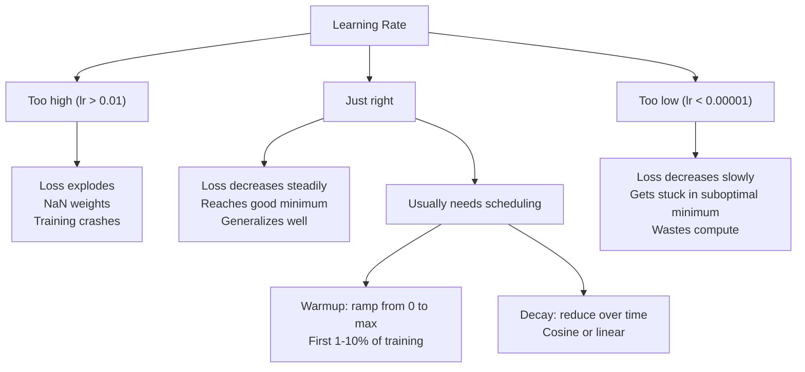
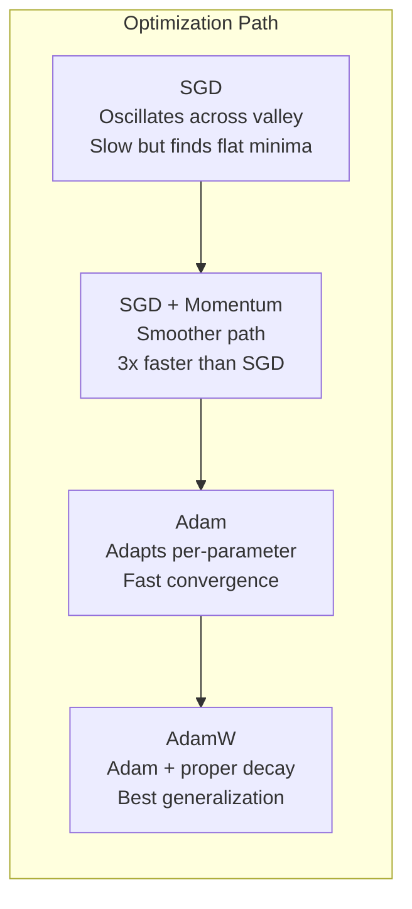
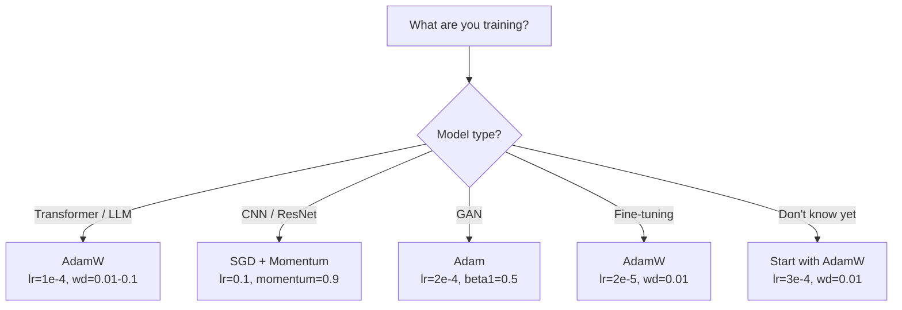

# Optimizadores

> El descenso gradiente te dice en qué dirección moverte no dice nada sobre la distancia o la velocidad SGD es una brújula Adam es GPS con datos de tráfico

**Type:** Build
**Languages:** Python
**Prerequisites:** Lesson 03.05 (Loss Functions)
**Time:** ~75 minutes

## Objetivos de aprendizaje

- Implementar SGD, SGD con impulso, Adam y AdamW optimizadores desde cero en Python
- Explica cómo la corrección de sesgo de Adam compensa las estimaciones de momento initializadas en cero en las primeras etapas de entrenamiento
- Demostrar por qué AdamW produce una mejor generalización que Adam con regularización L2 en la misma tarea
- Seleccione el optimizador y los hiperparámetros predeterminados apropiados para transformadores, CNNs, GANs y ajustes finos

## El problema

¿Sabes que el peso # 4,721 debe disminuir en 0,003 para reducir la pérdida? Pero 0.003 en qué unidades? ¿Escalado por qué? ¿Y deberías mover la misma cantidad en el paso 1 como en el paso 1,000?

El descenso del gradiente de vainilla aplica la misma tasa de aprendizaje a cada parámetro en cada paso: w = w - lr * gradiente. Esto crea tres problemas que hacen que el entrenamiento de las redes neuronales sea doloroso en la práctica.

Primero, la oscilación. El paisaje de pérdidas rara vez tiene la forma de un cuenco liso. Es más como un valle largo y estrecho. El gradiente apunta a través del valle (dirección empinada), no a lo largo de él (dirección poco profunda). El descenso gradual rebota hacia adelante y hacia atrás a través de la dimensión estrecha mientras hace pequeños progresos a lo largo de la útil. Ya han visto esto: la pérdida cae rápidamente después de las mesetas, no porque el modelo convergió sino porque está oscilando.

En segundo lugar, una tasa de aprendizaje para todos los parámetros es incorrecta. Algunos pesos necesitan grandes actualizaciones (están en la etapa inicial, de falta de ajuste). otros necesitan pequeñas actualizaciones (están cerca de su valor óptimo). Una tasa de aprendizaje que funciona para los primeros destruye a los últimos, y viceversa.

Tercero, puntos de silla. En dimensiones altas, el paisaje de pérdida tiene vastas regiones planas donde el gradiente es cerca de cero. SGD de vainilla se arrastra a través de estas a la velocidad del gradiente, que es efectivamente cero. El modelo parece atascado. No está atascado - está en una región plana con descenso útil en el otro lado. Pero SGD no tiene ningún mecanismo para empujar a través.

Adam resuelve las tres. Mantene dos promedios corrientes por parámetro - el gradiente medio (momento, maneja la oscilación) y el gradiente medio cuadrado (taxa adaptativa, maneja diferentes escalas). Combinado con la corrección de sesgo para los primeros pasos, le da un solo optimizador que funciona en el 80% de los problemas con hiperparámetros predeterminados. Esta lección lo construye desde cero para que entiendas exactamente cuándo y por qué falla en el otro 20%.

## El concepto

### Descenso de gradiente estocástico (SGD)

El optimizador más simple: calcular el gradiente en un mini lote y dar un paso en la dirección opuesta.

```
w = w - lr * gradient
```

El "estocástico" significa que se utiliza un subconjunto aleatorio (mini-batch) de datos para estimar el gradiente, en lugar del conjunto completo de datos. Este ruido es realmente útil - ayuda a escapar de mínimos locales agudos. Pero el ruido también causa oscilación.

La tasa de aprendizaje es la única clave. Demasiado alto: la pérdida diverge. Demasiado bajo: el entrenamiento dura para siempre. El valor óptimo depende de la arquitectura, los datos, el tamaño del lote y la etapa actual del entrenamiento. Para SGD de vainilla en las redes modernas, los valores típicos oscilan entre 0,01 y 0,1.

### El impulso

La analogía de rodar a la bola y bajar a la colina es demasiado utilizada pero precisa. En lugar de caminar solo por el gradiente, mantienes una velocidad que se acumula en los gradientes anteriores.

```
m_t = beta * m_{t-1} + gradient
w = w - lr * m_t
```

Beta (normalmente 0.9) controla cuánto historial se debe guardar. con beta = 0.9, el impulso es aproximadamente el promedio de los últimos 10 gradientes (1 / (1 - 0.9) = 10.

Por qué esto fija la oscilación: los gradientes que apuntan en la misma dirección se acumulan. Los gradientes que van en dirección inversa se cancelarán. En ese valle estrecho, el componente "cross" vuelve a marcar cada paso y se amortiguará. El componente "along" se mantiene constante y se amplifica. El resultado es una aceleración suave en la dirección útil.

Números reales: SGD solo en un panorama de pérdidas mal condicionado podría tomar 10.000 pasos. SGD con impulso (beta = 0,9) normalmente toma 3.000-5.000 pasos en el mismo problema.

### RMSProp

El primer método de tasa de aprendizaje adaptativo por parámetro que realmente funcionó. Propuso por Hinton en una conferencia de Coursera (nunca publicado formalmente).

```
s_t = beta * s_{t-1} + (1 - beta) * gradient^2
w = w - lr * gradient / (sqrt(s_t) + epsilon)
```

s_t realiza un seguimiento del promedio de funcionamiento de los gradientes cuadrados. Los parámetros con gradientes consistentemente grandes se dividen por un número grande (taxa de aprendizaje efectiva más pequeña).

Esto resuelve el problema de "una tasa de aprendizaje para todos los parámetros". Un peso que ya ha recibido grandes actualizaciones probablemente esté cerca de su objetivo - ralentiza. Un peso que ha recibido pequeñas actualizaciones podría estar poco entrenado - acelerarlo.

Epsilon (típicamente 1e-8) evita la división por cero cuando un parámetro no ha sido actualizado.

### Adam: Momentum + RMSProp

Adam combina ambas ideas. mantiene dos promedios móviles exponenciales por parámetro:

```
m_t = beta1 * m_{t-1} + (1 - beta1) * gradient        (first moment: mean)
v_t = beta2 * v_{t-1} + (1 - beta2) * gradient^2       (second moment: variance)
```

**Bias correction**En el paso 1, m_1 = (1 - beta1) * gradiente. con beta1 = 0.9, que es 0.1 * gradiente - diez veces demasiado pequeño. el promedio móvil no se ha calentado todavía.

```
m_hat = m_t / (1 - beta1^t)
v_hat = v_t / (1 - beta2^t)
```

En el paso 1 con beta1 = 0,9: m_hat = m_1 / (1 - 0,9) = m_1 / 0.1 = el gradiente real. En el paso 100: (1 - 0,9^100) es aproximadamente 1,0, por lo que la corrección desaparece. La corrección de sesgo importa para los primeros ~10 pasos y es irrelevante después de ~50.

La actualización:

```
w = w - lr * m_hat / (sqrt(v_hat) + epsilon)
```

Los valores predeterminados de Adam: lr = 0.001, beta1 = 0.9, beta2 = 0.999, epsilon = 1e-8. Estos valores predeterminados funcionan para el 80% de los problemas. Cuando no lo hacen, cambie primero lr. Luego beta2.

### La pérdida de peso se hizo bien

La regularización de L2 añade lambda * w^2 a la pérdida. en SGD de vainilla, esto equivale a la desintegración del peso (sustracción de lambda * w del peso en cada paso). en Adam, esta equivalencia se rompe.

La visión de Loshchilov & Hutter: cuando se añade L2 a la pérdida y luego Adam procesa el gradiente, la tasa de aprendizaje adaptativo escala el término de regularización también. Parámetros con gran variación de gradiente obtienen menos regularización. Parámetros con pequeña variación obtienen más. Esto no es lo que quieres - quieres regularización uniforme independientemente de las estadísticas de gradiente.

AdamW corrige esto aplicando la desintegración de peso directamente a los pesos, después de la actualización de Adam:

```
w = w - lr * m_hat / (sqrt(v_hat) + epsilon) - lr * lambda * w
```

El término de desintegración del peso (lr * lambda * w) no se escala por el factor adaptativo de Adam.

Esto parece un detalle menor. No es. AdamW converge a mejores soluciones que la regularización de Adam + L2 en prácticamente todas las tareas. Es el optimizador predeterminado en PyTorch para entrenar transformadores, modelos de difusión y la mayoría de las arquitecturas modernas. BERT, GPT, LLaMA, Diffusión estable - todos entrenados con AdamW.

### La tasa de aprendizaje: el hiperparámetro más importante



Si ajustes un hiperparámetro, ajusta la tasa de aprendizaje. Un cambio de 10 veces en la tasa de aprendizaje importa más que cualquier decisión arquitectónica que hagas.

- SGD: lr = 0,01 a 0,1
- Adam/AdamW: lr = 1e-4 a 3e-4
- Modelos pre-entrenados para ajuste fino: lr = 1e-5 a 5e-5
- Calentamiento de la tasa de aprendizaje: rampa lineal durante el 1-10% de los primeros pasos

### Comparación optimizadora



### Cuando cada optimizador gana



```figure
optimizer-trajectory
```

## Construye el mismo

### Paso 1: SGD de vainilla

```python
class SGD:
    def __init__(self, lr=0.01):
        self.lr = lr

    def step(self, params, grads):
        for i in range(len(params)):
            params[i] -= self.lr * grads[i]
```

### Paso 2: SGD con Momentum

```python
class SGDMomentum:
    def __init__(self, lr=0.01, beta=0.9):
        self.lr = lr
        self.beta = beta
        self.velocities = None

    def step(self, params, grads):
        if self.velocities is None:
            self.velocities = [0.0] * len(params)
        for i in range(len(params)):
            self.velocities[i] = self.beta * self.velocities[i] + grads[i]
            params[i] -= self.lr * self.velocities[i]
```

### Paso 3: Adán

```python
import math

class Adam:
    def __init__(self, lr=0.001, beta1=0.9, beta2=0.999, epsilon=1e-8):
        self.lr = lr
        self.beta1 = beta1
        self.beta2 = beta2
        self.epsilon = epsilon
        self.m = None
        self.v = None
        self.t = 0

    def step(self, params, grads):
        if self.m is None:
            self.m = [0.0] * len(params)
            self.v = [0.0] * len(params)

        self.t += 1

        for i in range(len(params)):
            self.m[i] = self.beta1 * self.m[i] + (1 - self.beta1) * grads[i]
            self.v[i] = self.beta2 * self.v[i] + (1 - self.beta2) * grads[i] ** 2

            m_hat = self.m[i] / (1 - self.beta1 ** self.t)
            v_hat = self.v[i] / (1 - self.beta2 ** self.t)

            params[i] -= self.lr * m_hat / (math.sqrt(v_hat) + self.epsilon)
```

### Paso 4: AdamW

```python
class AdamW:
    def __init__(self, lr=0.001, beta1=0.9, beta2=0.999, epsilon=1e-8, weight_decay=0.01):
        self.lr = lr
        self.beta1 = beta1
        self.beta2 = beta2
        self.epsilon = epsilon
        self.weight_decay = weight_decay
        self.m = None
        self.v = None
        self.t = 0

    def step(self, params, grads):
        if self.m is None:
            self.m = [0.0] * len(params)
            self.v = [0.0] * len(params)

        self.t += 1

        for i in range(len(params)):
            self.m[i] = self.beta1 * self.m[i] + (1 - self.beta1) * grads[i]
            self.v[i] = self.beta2 * self.v[i] + (1 - self.beta2) * grads[i] ** 2

            m_hat = self.m[i] / (1 - self.beta1 ** self.t)
            v_hat = self.v[i] / (1 - self.beta2 ** self.t)

            params[i] -= self.lr * m_hat / (math.sqrt(v_hat) + self.epsilon)
            params[i] -= self.lr * self.weight_decay * params[i]
```

### Paso 5: Comparación de la formación

Entrenar la misma red de dos capas en el conjunto de datos del círculo de la lección 05 con los cuatro optimizadores.

```python
import random

def sigmoid(x):
    x = max(-500, min(500, x))
    return 1.0 / (1.0 + math.exp(-x))

def make_circle_data(n=200, seed=42):
    random.seed(seed)
    data = []
    for _ in range(n):
        x = random.uniform(-2, 2)
        y = random.uniform(-2, 2)
        label = 1.0 if x * x + y * y < 1.5 else 0.0
        data.append(([x, y], label))
    return data


class OptimizerTestNetwork:
    def __init__(self, optimizer, hidden_size=8):
        random.seed(0)
        self.hidden_size = hidden_size
        self.optimizer = optimizer

        self.w1 = [[random.gauss(0, 0.5) for _ in range(2)] for _ in range(hidden_size)]
        self.b1 = [0.0] * hidden_size
        self.w2 = [random.gauss(0, 0.5) for _ in range(hidden_size)]
        self.b2 = 0.0

    def get_params(self):
        params = []
        for row in self.w1:
            params.extend(row)
        params.extend(self.b1)
        params.extend(self.w2)
        params.append(self.b2)
        return params

    def set_params(self, params):
        idx = 0
        for i in range(self.hidden_size):
            for j in range(2):
                self.w1[i][j] = params[idx]
                idx += 1
        for i in range(self.hidden_size):
            self.b1[i] = params[idx]
            idx += 1
        for i in range(self.hidden_size):
            self.w2[i] = params[idx]
            idx += 1
        self.b2 = params[idx]

    def forward(self, x):
        self.x = x
        self.z1 = []
        self.h = []
        for i in range(self.hidden_size):
            z = self.w1[i][0] * x[0] + self.w1[i][1] * x[1] + self.b1[i]
            self.z1.append(z)
            self.h.append(max(0.0, z))

        self.z2 = sum(self.w2[i] * self.h[i] for i in range(self.hidden_size)) + self.b2
        self.out = sigmoid(self.z2)
        return self.out

    def compute_grads(self, target):
        eps = 1e-15
        p = max(eps, min(1 - eps, self.out))
        d_loss = -(target / p) + (1 - target) / (1 - p)
        d_sigmoid = self.out * (1 - self.out)
        d_out = d_loss * d_sigmoid

        grads = [0.0] * (self.hidden_size * 2 + self.hidden_size + self.hidden_size + 1)
        idx = 0
        for i in range(self.hidden_size):
            d_relu = 1.0 if self.z1[i] > 0 else 0.0
            d_h = d_out * self.w2[i] * d_relu
            grads[idx] = d_h * self.x[0]
            grads[idx + 1] = d_h * self.x[1]
            idx += 2

        for i in range(self.hidden_size):
            d_relu = 1.0 if self.z1[i] > 0 else 0.0
            grads[idx] = d_out * self.w2[i] * d_relu
            idx += 1

        for i in range(self.hidden_size):
            grads[idx] = d_out * self.h[i]
            idx += 1

        grads[idx] = d_out
        return grads

    def train(self, data, epochs=300):
        losses = []
        for epoch in range(epochs):
            total_loss = 0.0
            correct = 0
            for x, y in data:
                pred = self.forward(x)
                grads = self.compute_grads(y)
                params = self.get_params()
                self.optimizer.step(params, grads)
                self.set_params(params)

                eps = 1e-15
                p = max(eps, min(1 - eps, pred))
                total_loss += -(y * math.log(p) + (1 - y) * math.log(1 - p))
                if (pred >= 0.5) == (y >= 0.5):
                    correct += 1
            avg_loss = total_loss / len(data)
            accuracy = correct / len(data) * 100
            losses.append((avg_loss, accuracy))
            if epoch % 75 == 0 or epoch == epochs - 1:
                print(f"    Epoch {epoch:3d}: loss={avg_loss:.4f}, accuracy={accuracy:.1f}%")
        return losses
```

## Usalo

Los optimizadores PyTorch manejan grupos de parámetros, recortes de gradientes y programación de velocidad de aprendizaje:

```python
import torch
import torch.optim as optim

model = torch.nn.Sequential(
    torch.nn.Linear(784, 256),
    torch.nn.ReLU(),
    torch.nn.Linear(256, 10),
)

optimizer = optim.AdamW(model.parameters(), lr=3e-4, weight_decay=0.01)

scheduler = optim.lr_scheduler.CosineAnnealingLR(optimizer, T_max=100)

for epoch in range(100):
    optimizer.zero_grad()
    output = model(torch.randn(32, 784))
    loss = torch.nn.functional.cross_entropy(output, torch.randint(0, 10, (32,)))
    loss.backward()
    torch.nn.utils.clip_grad_norm_(model.parameters(), max_norm=1.0)
    optimizer.step()
    scheduler.step()
```

El patrón es siempre: zero_grad, forward, loss, backward, (clip), step, (schedule). Memoriza este orden.

Para los CNN, muchos profesionales todavía prefieren SGD + impulso (lr=0.1, impulso=0.9, peso_descaso=1e-4) con un cronograma de paso o cosino. SGD encuentra mínimos más planos, que a menudo se generalizan mejor. Para transformadores y LLM, AdamW con calentamiento + descaso cosino es el estándar universal. No luches contra el consenso sin una razón medida.

## Envío

Esta lección produce:
- `outputs/prompt-optimizer-selector.md`-- una decisión rápida para elegir el optimizador adecuado y la tasa de aprendizaje para cualquier arquitectura

## Los ejercicios

1. Implemente el impulso de Nesterov, donde se calcula el gradiente en la posición "lookahead" (w - lr * beta * v) en lugar de la posición actual.

2. Implemente un horario de calentamiento de la tasa de aprendizaje: rampa lineal de 0 a max_lr durante el primer 10% de los pasos de entrenamiento, luego desintegración cosina a 0. Entrenamiento con Adam + calentamiento vs Adam sin calentamiento. Medir cuántas épocas se necesitan para alcanzar la precisión del 90% en el conjunto de datos del círculo.

3. Seguir el ritmo de aprendizaje efectivo para cada parámetro durante el entrenamiento de Adam. La tasa efectiva es lr * m_hat / (sqrt(v_hat) + eps).

4. Implemente el recorte de gradientes (clip por norma global). Establezca la norma de gradiente máximo a 1.0. Entrenar con y sin recorte utilizando una tasa de aprendizaje alta (lr=0.01 para Adam). Cuente cuántas carreras divergen (la pérdida va a NaN) con y sin recorte de más de 10 semillas aleatorias.

5. Comparar Adam vs. AdamW en una red con pesos grandes. Iniciar todos los pesos a valores aleatorios en [-5, 5] (mucho más grande que normal). Entrenar durante 200 épocas con peso_decay=0.1.

## Términos clave

| Term | What people say | What it actually means |
|------|----------------|----------------------|
| Learning rate | "Step size" | The scalar multiplier on the gradient update; the single most impactful hyperparameter in training |
| SGD | "Basic gradient descent" | Stochastic gradient descent: update weights by subtracting lr * gradient, computed on a mini-batch |
| Momentum | "Rolling ball analogy" | Exponential moving average of past gradients; dampens oscillation and accelerates consistent directions |
| RMSProp | "Adaptive learning rate" | Divides each parameter's gradient by the running RMS of its recent gradients; equalizes learning rates |
| Adam | "The default optimizer" | Combines momentum (first moment) and RMSProp (second moment) with bias correction for the initial steps |
| AdamW | "Adam done right" | Adam with decoupled weight decay; applies regularization directly to weights rather than through the gradient |
| Bias correction | "Warmup for running averages" | Dividing by (1 - beta^t) to compensate for the zero-initialization of Adam's moment estimates |
| Weight decay | "Shrink the weights" | Subtracting a fraction of the weight value at each step; a regularizer that penalizes large weights |
| Learning rate schedule | "Changing lr over time" | A function that adjusts the learning rate during training; warmup + cosine decay is the modern default |
| Gradient clipping | "Capping the gradient norm" | Scaling down the gradient vector when its norm exceeds a threshold; prevents exploding gradient updates |

## Leer más

- Kingma & Ba, "Adam: Un método para la optimización estocástica" (2014) -- el original artículo de Adam con análisis de convergencia y la derivación de corrección de sesgo
- Loshchilov & Hutter, "Regularización de la desintegración del peso descoplada" (2017) -- demostró que la regularización de L2 y la desintegración del peso no son equivalentes en Adam, y propuso AdamW
- Smith, "Tas de aprendizaje cíclico para redes neuronales de entrenamiento" (2017) -- introdujo la prueba de rango LR y los horarios cíclicos que eliminan la necesidad de ajustar una tasa de aprendizaje fija
- Ruder, "Una visión general de los algoritmos de optimización de descenso gradual" (2016) - la mejor encuesta única de todas las variantes de optimizador, con comparaciones e intuiciones claras
