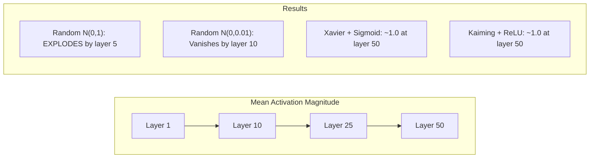
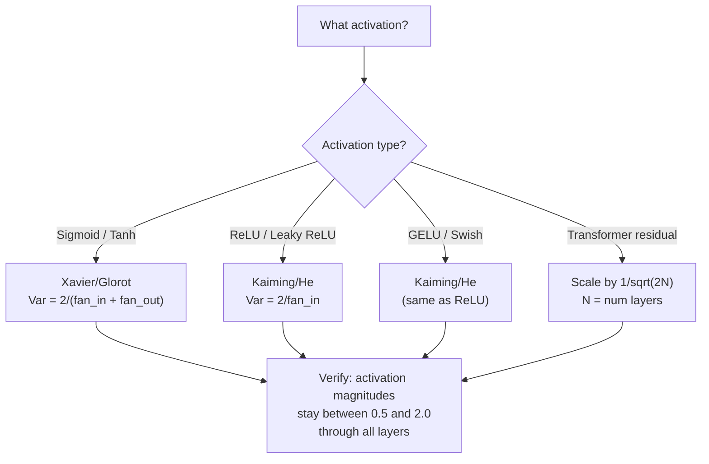

# Iniciación del peso y estabilidad de la formación

> Iniciar mal y el entrenamiento nunca comienza. Iniciar bien y 50 capas entrenan tan suavemente como 3.

**Type:** Build
**Languages:** Python
**Prerequisites:** Lesson 03.04 (Activation Functions), Lesson 03.07 (Regularization)
**Time:** ~90 minutes

## Objetivos de aprendizaje

- Implemente las estrategias de inicialización cero, aleatoria, Xavier/Glorot y Kaiming/He y mide su efecto en las magnitudes de activación a través de 50 capas
- Derivar por qué Xavier init utiliza Var(w) = 2/(fan_in + fan_out) y Kaiming utiliza Var(w) = 2/fan_in
- Demostrar el problema de simetría con inicialización cero y explicar por qué la escala aleatoria por sí sola es insuficiente
- Aparezca la estrategia de inicialización correcta con la función de activación: Xavier para sigmoid/tanh, Kaiming para ReLU/GELU

## El problema

Inicializamos todos los pesos a cero. Nada aprende. Cada neurona calcula la misma función, recibe el mismo gradiente y actualiza de manera idéntica. Después de 10.000 épocas, tu capa oculta de 512 neuronas sigue siendo 512 copias de la misma neurona. Pagaste por 512 parámetros y obtuviste 1.

Inicializan demasiado grandes. Las activaciones explotan a través de la red. En la capa 10, los valores alcanzan 1e15.

Inicialas aleatoriamente desde una distribución normal estándar. Funciona para 3 capas. A 50 capas, la señal se desploma a cero o detona hasta el infinito dependiendo de si la escala aleatoria era ligeramente demasiado pequeña o ligeramente demasiado grande. El límite entre "trabaja" y "rompió" es delgado como una navaja.

La inicialización de peso es la decisión más subestimada en el aprendizaje profundo. La arquitectura recibe documentos. Los optimizadores obtienen publicaciones en blogs. La inicialización obtiene una nota a pie de página. Pero si se equivocan y nada más importa, tu red está muerta antes de que comience el entrenamiento.

## El concepto

### El problema de la simetría

Cada neurona en una capa tiene la misma estructura: multiplica las entradas por pesos, agrega sesgo, aplica activación. Si todos los pesos comienzan en el mismo valor (cero es el caso extremo), cada neurona calcula la misma salida. Durante la retropropagación, cada neurona recibe el mismo gradiente. Durante el paso de actualización, cada neurona cambia por la misma cantidad.

La red tiene cientos de parámetros, pero todos se mueven en un bloqueo. Esto se llama simetría, y la inicialización aleatoria es la forma de romperla. Cada neurona comienza en un punto diferente en el espacio de peso, así que cada uno aprende una característica diferente.

Pero "aleatoriedad" no es suficiente. La *escala* de la aleatoriedad determina si la red se pone en marcha.

### La propagación de la variación a través de capas

Considere una sola capa con entradas fan_in:

```
z = w1*x1 + w2*x2 + ... + w_n*x_n
```

Si cada peso wi se extrae de una distribución con varianza Var(w) y cada entrada xi tiene varianza Var(x), la varianza de salida es:

```
Var(z) = fan_in * Var(w) * Var(x)
```

Si Var(w) = 1 y fan_in = 512, la variación de salida es 512x la variación de entrada. Después de 10 capas: 512^10 = 1.2e27.

Si Var ((w) = 0,001, la variación de salida se reduce en 0,001 * 512 = 0,512 por capa. Después de 10 capas: 0.512^10 = 0,00013. Su señal ha desaparecido.

El objetivo: elegir Var(w) para que Var(z) = Var(x). La magnitud de la señal se mantiene constante a través de las capas.

### Inicialización de Xavier/Glorot

Glorot y Bengio (2010) derivaron la solución para las activaciones sigmoide y tanh.

```
Var(w) = 2 / (fan_in + fan_out)
```

En la práctica, las pesas se extraen de:

```
w ~ Uniform(-limit, limit)  where limit = sqrt(6 / (fan_in + fan_out))
```

o bien:

```
w ~ Normal(0, sqrt(2 / (fan_in + fan_out)))
```

Esto funciona porque sigmoide y tanh son aproximadamente lineales cerca de cero, donde las activaciones inicializadas correctamente viven.

### La inicialización de Kaiming/He

ReLU mata la mitad de las salidas (todo lo negativo se convierte en cero). El fan_in efectivo se reduce a la mitad porque en promedio la mitad de las entradas son cero. Xavier init no tiene en cuenta esto - subestima la varianza necesaria.

He et al. (2015) ajustó la fórmula:

```
Var(w) = 2 / fan_in
```

Los pesos se extraen de:

```
w ~ Normal(0, sqrt(2 / fan_in))
```

El factor de 2 compensa la reducción de la mitad de las activaciones de ReLU. Sin él, la señal se reduce en ~ 0,5x por capa.

### Iniciación del transformador

GPT-2 introdujo un patrón diferente. Las conexiones residuales añaden la salida de cada sub- capa a su entrada:

```
x = x + sublayer(x)
```

Cada adición aumenta la varianza. Con N capas residuales, la varianza crece proporcionalmente a N. GPT-2 escala los pesos de las capas residuales por 1/sqrt(2N), donde N es el número de capas. Esto mantiene la magnitud de señal acumulada estable.

El Llama 3 (405B parámetros, 126 capas) utiliza un esquema similar.

```mermaid
flowchart TD
    subgraph "Zero Init"
        Z1["Layer 1<br/>All weights = 0"] --> Z2["Layer 2<br/>All neurons identical"]
        Z2 --> Z3["Layer 3<br/>Still identical"]
        Z3 --> ZR["Result: 1 effective neuron<br/>regardless of width"]
    end

    subgraph "Xavier Init"
        X1["Layer 1<br/>Var = 2/(fan_in+fan_out)"] --> X2["Layer 2<br/>Signal stable"]
        X2 --> X3["Layer 50<br/>Signal stable"]
        X3 --> XR["Result: Trains with<br/>sigmoid/tanh"]
    end

    subgraph "Kaiming Init"
        K1["Layer 1<br/>Var = 2/fan_in"] --> K2["Layer 2<br/>Signal stable"]
        K2 --> K3["Layer 50<br/>Signal stable"]
        K3 --> KR["Result: Trains with<br/>ReLU/GELU"]
    end
```



### Magnitud de activación a través de 50 capas



### Elegir el corazón correcto



```figure
weight-init-variance
```

## Construye el mismo

### Paso 1: Estrategias de inicialización

Cuatro formas de iniciar una matriz de peso. Cada una devuelve una lista de listas (una matriz 2D) con columnas fan_in y filas fan_out.

```python
import math
import random


def zero_init(fan_in, fan_out):
    return [[0.0 for _ in range(fan_in)] for _ in range(fan_out)]


def random_init(fan_in, fan_out, scale=1.0):
    return [[random.gauss(0, scale) for _ in range(fan_in)] for _ in range(fan_out)]


def xavier_init(fan_in, fan_out):
    std = math.sqrt(2.0 / (fan_in + fan_out))
    return [[random.gauss(0, std) for _ in range(fan_in)] for _ in range(fan_out)]


def kaiming_init(fan_in, fan_out):
    std = math.sqrt(2.0 / fan_in)
    return [[random.gauss(0, std) for _ in range(fan_in)] for _ in range(fan_out)]
```

### Paso 2: Funciones de activación

Necesitamos sigmoid, tanh y ReLU para probar cada estrategia init con su activación prevista.

```python
def sigmoid(x):
    x = max(-500, min(500, x))
    return 1.0 / (1.0 + math.exp(-x))


def tanh_act(x):
    return math.tanh(x)


def relu(x):
    return max(0.0, x)
```

### Paso 3: Pasar hacia adelante a través de 50 capas

Pasar datos aleatorios a través de una red profunda y medir la magnitud media de activación en cada capa.

```python
def forward_deep(init_fn, activation_fn, n_layers=50, width=64, n_samples=100):
    random.seed(42)
    layer_magnitudes = []

    inputs = [[random.gauss(0, 1) for _ in range(width)] for _ in range(n_samples)]

    for layer_idx in range(n_layers):
        weights = init_fn(width, width)
        biases = [0.0] * width

        new_inputs = []
        for sample in inputs:
            output = []
            for neuron_idx in range(width):
                z = sum(weights[neuron_idx][j] * sample[j] for j in range(width)) + biases[neuron_idx]
                output.append(activation_fn(z))
            new_inputs.append(output)
        inputs = new_inputs

        magnitudes = []
        for sample in inputs:
            magnitudes.append(sum(abs(v) for v in sample) / width)
        mean_mag = sum(magnitudes) / len(magnitudes)
        layer_magnitudes.append(mean_mag)

    return layer_magnitudes
```

### Paso 4: El experimento

Ejecutar todas las combinaciones: cero init, aleatorio N(0,1), aleatorio N(0,0.01), Xavier con sigmoide, Xavier con tanh, Kaiming con ReLU. Imprimir la magnitud en capas clave.

```python
def run_experiment():
    configs = [
        ("Zero init + Sigmoid", lambda fi, fo: zero_init(fi, fo), sigmoid),
        ("Random N(0,1) + ReLU", lambda fi, fo: random_init(fi, fo, 1.0), relu),
        ("Random N(0,0.01) + ReLU", lambda fi, fo: random_init(fi, fo, 0.01), relu),
        ("Xavier + Sigmoid", xavier_init, sigmoid),
        ("Xavier + Tanh", xavier_init, tanh_act),
        ("Kaiming + ReLU", kaiming_init, relu),
    ]

    print(f"{'Strategy':<30} {'L1':>10} {'L5':>10} {'L10':>10} {'L25':>10} {'L50':>10}")
    print("-" * 80)

    for name, init_fn, act_fn in configs:
        mags = forward_deep(init_fn, act_fn)
        row = f"{name:<30}"
        for idx in [0, 4, 9, 24, 49]:
            val = mags[idx]
            if val > 1e6:
                row += f" {'EXPLODED':>10}"
            elif val < 1e-6:
                row += f" {'VANISHED':>10}"
            else:
                row += f" {val:>10.4f}"
        print(row)
```

### Paso 5: demostración de simetría

Muestre que el init cero produce neuronas idénticas.

```python
def symmetry_demo():
    random.seed(42)
    weights = zero_init(2, 4)
    biases = [0.0] * 4

    inputs = [0.5, -0.3]
    outputs = []
    for neuron_idx in range(4):
        z = sum(weights[neuron_idx][j] * inputs[j] for j in range(2)) + biases[neuron_idx]
        outputs.append(sigmoid(z))

    print("\nSymmetry Demo (4 neurons, zero init):")
    for i, out in enumerate(outputs):
        print(f"  Neuron {i}: output = {out:.6f}")
    all_same = all(abs(outputs[i] - outputs[0]) < 1e-10 for i in range(len(outputs)))
    print(f"  All identical: {all_same}")
    print(f"  Effective parameters: 1 (not {len(weights) * len(weights[0])})")
```

### Paso 6: Informe de magnitud capa por capa

Imprima un gráfico de barras visuales de magnitudes de activación a través de 50 capas.

```python
def magnitude_report(name, magnitudes):
    print(f"\n{name}:")
    for i, mag in enumerate(magnitudes):
        if i % 5 == 0 or i == len(magnitudes) - 1:
            if mag > 1e6:
                bar = "X" * 50 + " EXPLODED"
            elif mag < 1e-6:
                bar = "." + " VANISHED"
            else:
                bar_len = min(50, max(1, int(mag * 10)))
                bar = "#" * bar_len
            print(f"  Layer {i+1:3d}: {bar} ({mag:.6f})")
```

## Usalo

PyTorch proporciona estas funciones incorporadas:

```python
import torch
import torch.nn as nn

layer = nn.Linear(512, 256)

nn.init.xavier_uniform_(layer.weight)
nn.init.xavier_normal_(layer.weight)

nn.init.kaiming_uniform_(layer.weight, nonlinearity='relu')
nn.init.kaiming_normal_(layer.weight, nonlinearity='relu')

nn.init.zeros_(layer.bias)
```

Cuando llames .`nn.Linear(512, 256)`PyTorch es el sistema de inicialización de Kaiming por defecto. por eso la mayoría de las redes simples "solo funcionan" - PyTorch ya hizo la elección correcta. pero cuando construyes arquitecturas personalizadas o vas más profundo que 20 capas, necesitas entender lo que está sucediendo y potencialmente anula el defecto.

Para transformadores, los modelos HuggingFace suelen manejar la inicialización en sus `_init_weights`La implementación de GPT-2 escala las proyecciones residuales por 1/sqrt ((N). Si estás construyendo un transformador desde cero, necesitas añadir esto tú mismo.

## Envío

Esta lección produce:
- `outputs/prompt-init-strategy.md`-- un mensaje que diagnostica los problemas de inicialización del peso y recomienda la estrategia correcta

## Los ejercicios

1. Añadir inicialización LeCun (Var = 1/fan_in, diseñado para la activación SELU). ejecutar el experimento de 50 capas con LeCun init + tanh y comparar con Xavier + tanh.

2. Implemente la escalación residual GPT-2: multiplica la salida de cada capa por 1/sqrt(2*N) antes de agregar a la corriente residual. ejecuta 50 capas con y sin escalación, mide la rapidez con que crece la magnitud residual.

3. Crear una función de "comprobar la salud init" que toma las dimensiones de capas de una red y el tipo de activación, luego recomienda la inicialización correcta y advierte si el init actual causará problemas.

4. ejecutar el experimento con fan_in = 16 vs fan_in = 1024. Xavier y Kaiming se adaptan a fan_in, pero al azar init no. Muestre cómo la brecha entre "trabaja" y "braks" se amplía con capas más grandes.

5. Implemente la inicialización ortogonal (generar una matriz aleatoria, calcular su SVD, usar la matriz ortogonal U). Comparar con Kaiming para redes ReLU en 50 capas.

## Términos clave

| Term | What people say | What it actually means |
|------|----------------|----------------------|
| Weight initialization | "Set starting weights randomly" | The strategy for choosing initial weight values that determines whether a network can train at all |
| Symmetry breaking | "Make neurons different" | Using random initialization to ensure neurons learn distinct features instead of computing identical functions |
| Fan-in | "Number of inputs to a neuron" | The number of incoming connections, which determines how input variance accumulates in the weighted sum |
| Fan-out | "Number of outputs from a neuron" | The number of outgoing connections, relevant for maintaining gradient variance during backpropagation |
| Xavier/Glorot init | "The sigmoid initialization" | Var(w) = 2/(fan_in + fan_out), designed to preserve variance through sigmoid and tanh activations |
| Kaiming/He init | "The ReLU initialization" | Var(w) = 2/fan_in, accounts for ReLU zeroing half the activations |
| Variance propagation | "How signals grow or shrink through layers" | The mathematical analysis of how activation variance changes layer by layer based on weight scale |
| Residual scaling | "GPT-2's init trick" | Scaling residual connection weights by 1/sqrt(2N) to prevent variance growth through N transformer layers |
| Dead network | "Nothing trains" | A network where poor initialization causes all gradients to be zero or all activations to saturate |
| Exploding activations | "Values go to infinity" | When weight variance is too high, causing activation magnitudes to grow exponentially through layers |

## Leer más

- Glorot & Bengio, "Entender la dificultad de entrenar redes neuronales de entrada profunda" (2010) -- el original documento de inicialización de Xavier con análisis de varianza
- He et al., "Delving Deep into Rectifiers" (2015) -- introdujo la inicialización de Kaiming para las redes ReLU
- Radford et al., "Los modelos de lenguaje son aprendices multitarea no supervisados" (2019) -- documento GPT-2 con inicialización de escala residual
- Mishkin & Matas, "Todo lo que necesitas es un buen principio" (2016) -- inicialización de la unidad-varianza secuencial de capas, una alternativa empírica a las fórmulas analíticas
