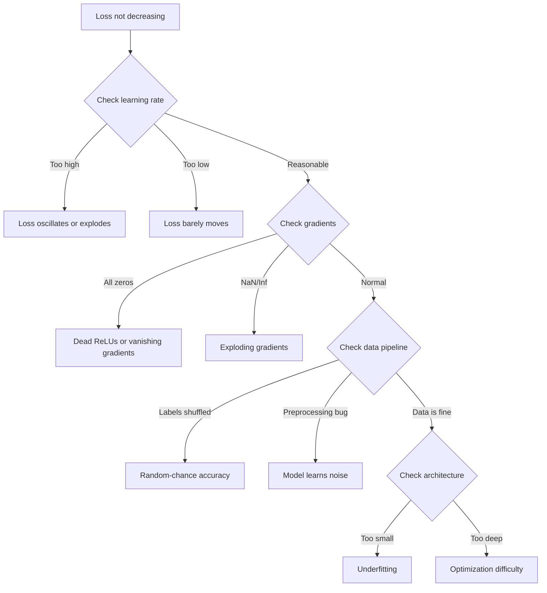
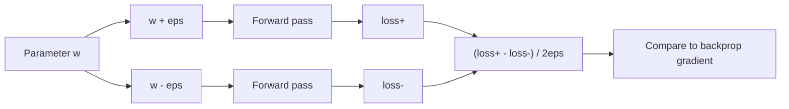
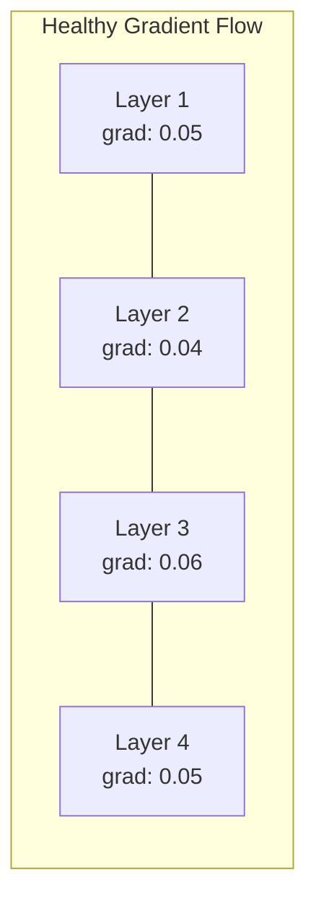
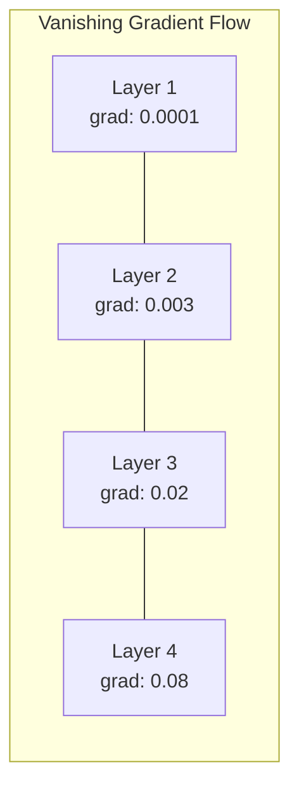
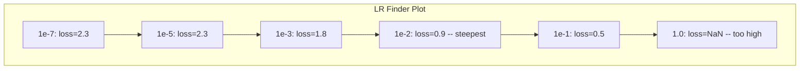

# Desarreglamiento de las redes neuronales

> Tu red se compila. Se ejecutó. Produjo un número. El número es incorrecto y nada se estrelló. Bienvenido al tipo más difícil de depuración - el tipo donde no hay mensaje de error.

**Type:** Build
**Languages:** Python, PyTorch
**Prerequisites:** Phase 03 Lessons 01-10 (especially backpropagation, loss functions, optimizers)
**Time:** ~90 minutes

## Objetivos de aprendizaje

- Diagnóstico de fallas comunes de la red neuronal (pérdida de NaN, curva de pérdida plana, sobreajuste, oscilación) utilizando estrategias de depuración sistemática
- Aplique la técnica de "overfit one batch" para verificar que la arquitectura del modelo y el ciclo de entrenamiento son correctos
- Inspeccionar las magnitudes de los gradientes, las distribuciones de activación y las normas de peso para identificar los problemas de los gradientes que desaparecen/explotan
- Construir una lista de verificación de descomposición que cubra la tubería de datos, la arquitectura del modelo, la función de pérdida, el optimizador y los problemas de tasa de aprendizaje

## El problema

Un software tradicional se estrella cuando está roto. Un puntero nulo lanza una excepción. Una falta de coincidencia de tipo falla en el momento de compilar. Un error de uno por uno produce una salida claramente incorrecta.

Las redes neuronales no te dan ese lujo.

Una red neuronal rota se ejecuta hasta la finalización, imprime un valor de pérdida y saca predicciones. La pérdida podría disminuir. Las predicciones podrían parecer plausibles. Pero el modelo está silenciosamente equivocado: aprender atajos, memorizar ruido o converger a un mínimo local inútil. Los investigadores de Google estiman que el 60-70% del tiempo de depuración de ML se gasta en errores "silenciosos" que no producen errores sino que degradan la calidad del modelo.

La diferencia entre un modelo de trabajo y uno roto es a menudo una sola línea extraviada: una falta `zero_grad()`, una dimensión transpuesta, una tasa de aprendizaje de 10x. La canónica "Recepta para el entrenamiento de redes neuronales" (2019) se abre con esto: "Los errores de red neuronal más comunes son errores que no se estrellan".

Esta lección te enseña a encontrar esos insectos.

## El concepto

### La mentalidad que desvía errores

Olvídate de la depuración de impresión y pray. La depuración de redes neuronales requiere un enfoque sistemático porque el bucle de retroalimentación es lento (de minutos a horas por carrera de entrenamiento) y los síntomas son ambigüos (la mala pérdida podría significar 20 cosas diferentes).

La regla de oro:**start simple, add complexity one piece at a time, and verify each piece independently.**



### Síndrome 1: pérdida no disminuye

La formación se ejecuta, las épocas pasan y la pérdida se mantiene plana o oscila salvajemente.

**Wrong learning rate.**Para Adam, comience en 1e-3. Para SGD, comience en 1e-1 o 1e-2. Siempre pruebe 3 tasas de aprendizaje que abarcan 10 veces cada una (por ejemplo, 1e-2, 1e-3, 1e-4) antes de concluir que algo más está mal.

**Dead ReLUs.**Si una neurona ReLU recibe una entrada negativa grande, sale a 0 y su gradiente es 0. Nunca se activa de nuevo. Si mueren suficientes neuronas, la red no puede aprender.

**Vanishing gradients.**En redes profundas con activaciones sigmoides o tanh, los gradientes se reducen exponencialmente a medida que se propagan hacia atrás. Cuando alcanzan la primera capa, son ~0. Las primeras capas dejan de aprender.

**Exploding gradients.**El problema opuesto - los gradientes crecen exponencialmente. común en RNNs y redes muy profundas. la pérdida salta a NaN.`torch.nn.utils.clip_grad_norm_`), disminuir la tasa de aprendizaje o agregar la normalización.

### Síndrome 2: la pérdida disminuye pero el modelo es malo

La pérdida disminuye, la precisión del entrenamiento alcanza el 99%, pero la precisión de las pruebas es del 55% o el modelo produce resultados sin sentido en datos reales.

**Overfitting.**El modelo memoriza datos de entrenamiento en lugar de patrones de aprendizaje. La brecha entre el entrenamiento y la pérdida de validación crece con el tiempo.

**Data leakage.**Los datos de prueba se filtraron en el entrenamiento. La precisión es sospechosamente alta. Causas comunes: mezcla antes de dividir, preprocesamiento con estadísticas del conjunto completo de datos, muestras duplicadas a través de divisiones.

**Label errors.**El modelo aprende el ruido. Corrección: utiliza aprendizaje seguro para encontrar y corregir ejemplos mal etiquetados, o use truncation de pérdida para ignorar muestras de alta pérdida.

### Sintoma 3: NaN o Inf en pérdida

El valor de pérdida se convierte en`nan`o `inf`El entrenamiento está muerto.

**Learning rate too high.**Las actualizaciones de gradiente se sobrepasan hasta el punto de que los pesos explotan.

**log(0) or log(negative).**Computación de pérdidas de entropía cruzada `log(p)`Si su modelo sale exactamente 0 o una probabilidad negativa, el registro explotará.`[eps, 1-eps]`donde`eps=1e-7`¿ Qué ?

**Division by zero.**La normalización de lote se divide por desviación estándar. Un lote con valores constantes tiene std=0.

**Numerical overflow.**Grandes activaciones alimentadas en `exp()`Se puede calcular el valor máximo de la suma de la suma de la suma de la suma de la suma de la suma de la suma de la suma de la suma de la suma de la suma de la suma de la suma de la suma de la suma de la suma de la suma de la suma de la suma de la suma de la suma de la suma de la suma de la suma de la suma de la suma de la suma de la suma de la suma de la suma de la suma de la suma de la suma de la suma de la suma de la suma de la suma de la suma de la suma de la suma de la suma de la suma de la suma de la suma de la suma de la suma de la suma de la suma de la suma de la suma de la suma de la suma de la suma de la suma de la suma de la suma de la suma de la suma de la suma de la suma de la suma de la suma de la suma de la suma de la suma de la suma de la suma de la suma de la suma de la suma de la suma de la suma de la suma de la suma de la suma de la suma de la suma de la suma de la suma de la suma de la suma de la suma de la suma de la suma de la suma de la suma de la suma de la suma de la suma de la suma de la suma de la suma de la suma de la suma de la suma de la suma de la suma de la suma de la suma de la suma de la suma de la suma de la suma de la suma de la suma de la suma de la suma de la suma de la suma de la suma de la suma de la suma de la suma de la suma de la suma de la suma de la suma de la suma de la suma de la suma de la suma de la suma de la suma de la suma de la suma de la suma de la suma de la suma de los dos.

### Técnica 1: Verificación gradual

Comparar los gradientes analíticos (de backprop) con los gradientes numéricos (de diferencias finitas).

Gradiente numérico para el parámetro `w`¿Qué es esto ?

```
grad_numerical = (loss(w + eps) - loss(w - eps)) / (2 * eps)
```

Metrica de acuerdo (diferencia relativa):

```
rel_diff = |grad_analytical - grad_numerical| / max(|grad_analytical|, |grad_numerical|, 1e-8)
```

Si ...`rel_diff < 1e-5`: correcto. si`rel_diff > 1e-3`Es casi seguro que es un insecto.



### Técnica 2: Estadísticas de activación

Monitorear la media y la desviación estándar de las activaciones después de cada capa durante el entrenamiento.

| Health indicator | Mean | Std | Diagnosis |
|-----------------|------|-----|-----------|
| Healthy | ~0 | ~1 | Network is learning normally |
| Saturated | >>0 or <<0 | ~0 | Activations stuck at extreme values |
| Dead | 0 | 0 | Neurons are dead (all zeros) |
| Exploding | >>10 | >>10 | Activations growing without bound |

### Técnica 3: Visualización de flujo gradual

En una red sana, las magnitudes de los gradientes deben ser aproximadamente similares en todas las capas. Si las primeras capas tienen gradientes 1000 veces más pequeños que las posteriores, tienes gradientes que desaparecen.





### Técnica 4: Prueba de sobreajuste en un lote

La técnica de depuración más importante en el aprendizaje profundo.

Tomar un pequeño lote (8-32 muestras). Entrenar en él para más de 100 iteraciones. La pérdida debe ir a casi cero y la precisión de entrenamiento debe alcanzar el 100%.

Este ensayo detecta:
- Funciones de pérdida rotas
- Pases hacia atrás rotos
- Arquitectura demasiado pequeña para representar los datos
- Optimizador no conectado a los parámetros del modelo
- Datos y etiquetas desalineados

Esto toma 30 segundos para correr y ahorra horas de depuración de las carreras de entrenamiento completas.

### Técnica 5: Táctica de detección de tasas de aprendizaje

Leslie Smith (2017) propuso barriendo la tasa de aprendizaje de muy pequeña (1e-7) a muy grande (10) durante una época mientras se registra la pérdida.



El mejor LR en este ejemplo: ~1e-3 (un orden de magnitud antes del punto más empinado).

### Insectos PyTorch comunes

Estos son los insectos que pierden las horas más colectivas en la comunidad PyTorch:

| Bug | Symptom | Fix |
|-----|---------|-----|
| Forgetting `optimizer.zero_grad()` | Gradients accumulate across batches, loss oscillates | Add `optimizer.zero_grad()` before `loss.backward()` |
| Forgetting `model.eval()` at test time | Dropout and batch norm behave differently, test accuracy varies between runs | Add `model.eval()` and `torch.no_grad()` |
| Wrong tensor shapes | Silent broadcasting produces wrong results, no error | Print shapes after every operation during debugging |
| CPU/GPU mismatch | `RuntimeError: expected CUDA tensor` | Use `.to(device)` on model AND data |
| Not detaching tensors | Computation graph grows forever, OOM | Use `.detach()` or `with torch.no_grad()` |
| In-place operations breaking autograd | `RuntimeError: modified by in-place operation` | Replace `x += 1` with `x = x + 1` |
| Data not normalized | Loss stuck at random-chance level | Normalize inputs to mean=0, std=1 |
| Labels as wrong dtype | Cross-entropy expects `Long`, got `Float` | Cast labels: `labels.long()` |

### La mesa de desarreglamiento principal

| Symptom | Likely cause | First thing to try |
|---------|-------------|-------------------|
| Loss stuck at -log(1/num_classes) | Model predicting uniform distribution | Check data pipeline, verify labels match inputs |
| Loss NaN after a few steps | Learning rate too high | Reduce LR by 10x |
| Loss NaN immediately | log(0) or division by zero | Add epsilon to log/division operations |
| Loss oscillating wildly | LR too high or batch size too small | Reduce LR, increase batch size |
| Loss decreasing then plateaus | LR too high for fine-tuning phase | Add LR schedule (cosine or step decay) |
| Training acc high, test acc low | Overfitting | Add dropout, weight decay, more data |
| Training acc = test acc = chance | Model not learning anything | Run overfit-one-batch test |
| Training acc = test acc but both low | Underfitting | Bigger model, more layers, more features |
| Gradients all zero | Dead ReLUs or detached computation graph | Switch to LeakyReLU, check `.requires_grad` |
| Out of memory during training | Batch too large or graph not freed | Reduce batch size, use `torch.no_grad()` for eval |

```figure
learning-curves
```

## Construye el mismo

Un conjunto de herramientas de diagnóstico que monitorea las curvas de activación, gradientes y pérdidas.

### Paso 1: La clase de NetworkDebugger

Se conecta a un modelo PyTorch para registrar estadísticas de activación y gradiente por capa.

```python
import torch
import torch.nn as nn
import math


class NetworkDebugger:
    def __init__(self, model):
        self.model = model
        self.activation_stats = {}
        self.gradient_stats = {}
        self.loss_history = []
        self.lr_losses = []
        self.hooks = []
        self._register_hooks()

    def _register_hooks(self):
        for name, module in self.model.named_modules():
            if isinstance(module, (nn.Linear, nn.Conv2d, nn.ReLU, nn.LeakyReLU)):
                hook = module.register_forward_hook(self._make_activation_hook(name))
                self.hooks.append(hook)
                hook = module.register_full_backward_hook(self._make_gradient_hook(name))
                self.hooks.append(hook)

    def _make_activation_hook(self, name):
        def hook(module, input, output):
            with torch.no_grad():
                out = output.detach().float()
                self.activation_stats[name] = {
                    "mean": out.mean().item(),
                    "std": out.std().item(),
                    "fraction_zero": (out == 0).float().mean().item(),
                    "min": out.min().item(),
                    "max": out.max().item(),
                }
        return hook

    def _make_gradient_hook(self, name):
        def hook(module, grad_input, grad_output):
            if grad_output[0] is not None:
                with torch.no_grad():
                    grad = grad_output[0].detach().float()
                    self.gradient_stats[name] = {
                        "mean": grad.mean().item(),
                        "std": grad.std().item(),
                        "abs_mean": grad.abs().mean().item(),
                        "max": grad.abs().max().item(),
                    }
        return hook

    def record_loss(self, loss_value):
        self.loss_history.append(loss_value)

    def check_loss_health(self):
        if len(self.loss_history) < 2:
            return "NOT_ENOUGH_DATA"
        recent = self.loss_history[-10:]
        if any(math.isnan(v) or math.isinf(v) for v in recent):
            return "NAN_OR_INF"
        if len(self.loss_history) >= 20:
            first_half = sum(self.loss_history[:10]) / 10
            second_half = sum(self.loss_history[-10:]) / 10
            if second_half >= first_half * 0.99:
                return "NOT_DECREASING"
        if len(recent) >= 5:
            diffs = [recent[i+1] - recent[i] for i in range(len(recent)-1)]
            if max(diffs) - min(diffs) > 2 * abs(sum(diffs) / len(diffs)):
                return "OSCILLATING"
        return "HEALTHY"

    def check_activations(self):
        issues = []
        for name, stats in self.activation_stats.items():
            if stats["fraction_zero"] > 0.5:
                issues.append(f"DEAD_NEURONS: {name} has {stats['fraction_zero']:.0%} zero activations")
            if abs(stats["mean"]) > 10:
                issues.append(f"EXPLODING_ACTIVATIONS: {name} mean={stats['mean']:.2f}")
            if stats["std"] < 1e-6:
                issues.append(f"COLLAPSED_ACTIVATIONS: {name} std={stats['std']:.2e}")
        return issues if issues else ["HEALTHY"]

    def check_gradients(self):
        issues = []
        grad_magnitudes = []
        for name, stats in self.gradient_stats.items():
            grad_magnitudes.append((name, stats["abs_mean"]))
            if stats["abs_mean"] < 1e-7:
                issues.append(f"VANISHING_GRADIENT: {name} abs_mean={stats['abs_mean']:.2e}")
            if stats["abs_mean"] > 100:
                issues.append(f"EXPLODING_GRADIENT: {name} abs_mean={stats['abs_mean']:.2e}")
        if len(grad_magnitudes) >= 2:
            first_mag = grad_magnitudes[0][1]
            last_mag = grad_magnitudes[-1][1]
            if last_mag > 0 and first_mag / last_mag > 100:
                issues.append(f"GRADIENT_RATIO: first/last = {first_mag/last_mag:.0f}x (vanishing)")
        return issues if issues else ["HEALTHY"]

    def print_report(self):
        print("\n=== NETWORK DEBUGGER REPORT ===")
        print(f"\nLoss health: {self.check_loss_health()}")
        if self.loss_history:
            print(f"  Last 5 losses: {[f'{v:.4f}' for v in self.loss_history[-5:]]}")
        print("\nActivation diagnostics:")
        for item in self.check_activations():
            print(f"  {item}")
        print("\nGradient diagnostics:")
        for item in self.check_gradients():
            print(f"  {item}")
        print("\nPer-layer activation stats:")
        for name, stats in self.activation_stats.items():
            print(f"  {name}: mean={stats['mean']:.4f} std={stats['std']:.4f} zero={stats['fraction_zero']:.1%}")
        print("\nPer-layer gradient stats:")
        for name, stats in self.gradient_stats.items():
            print(f"  {name}: abs_mean={stats['abs_mean']:.2e} max={stats['max']:.2e}")

    def remove_hooks(self):
        for hook in self.hooks:
            hook.remove()
        self.hooks.clear()
```

### Paso 2: El examen de sobrevaloración en un lote

```python
def overfit_one_batch(model, x_batch, y_batch, criterion, lr=0.01, steps=200):
    optimizer = torch.optim.Adam(model.parameters(), lr=lr)
    model.train()
    print("\n=== OVERFIT ONE BATCH TEST ===")
    print(f"Batch size: {x_batch.shape[0]}, Steps: {steps}")

    for step in range(steps):
        optimizer.zero_grad()
        output = model(x_batch)
        loss = criterion(output, y_batch)
        loss.backward()
        optimizer.step()

        if step % 50 == 0 or step == steps - 1:
            with torch.no_grad():
                preds = (output > 0).float() if output.shape[-1] == 1 else output.argmax(dim=1)
                targets = y_batch if y_batch.dim() == 1 else y_batch.squeeze()
                acc = (preds.squeeze() == targets).float().mean().item()
            print(f"  Step {step:3d} | Loss: {loss.item():.6f} | Accuracy: {acc:.1%}")

    final_loss = loss.item()
    if final_loss > 0.1:
        print(f"\n  FAIL: Loss did not converge ({final_loss:.4f}). Model or training loop is broken.")
        return False
    print(f"\n  PASS: Loss converged to {final_loss:.6f}")
    return True
```

### Paso 3: Talla de aprendizaje

```python
def find_learning_rate(model, x_data, y_data, criterion, start_lr=1e-7, end_lr=10, steps=100):
    import copy
    original_state = copy.deepcopy(model.state_dict())
    optimizer = torch.optim.SGD(model.parameters(), lr=start_lr)
    lr_mult = (end_lr / start_lr) ** (1 / steps)

    model.train()
    results = []
    best_loss = float("inf")
    current_lr = start_lr

    print("\n=== LEARNING RATE FINDER ===")

    for step in range(steps):
        optimizer.zero_grad()
        output = model(x_data)
        loss = criterion(output, y_data)

        if math.isnan(loss.item()) or loss.item() > best_loss * 10:
            break

        best_loss = min(best_loss, loss.item())
        results.append((current_lr, loss.item()))

        loss.backward()
        optimizer.step()

        current_lr *= lr_mult
        for param_group in optimizer.param_groups:
            param_group["lr"] = current_lr

    model.load_state_dict(original_state)

    if len(results) < 10:
        print("  Could not complete LR sweep -- loss diverged too quickly")
        return results

    min_loss_idx = min(range(len(results)), key=lambda i: results[i][1])
    suggested_lr = results[max(0, min_loss_idx - 10)][0]

    print(f"  Swept {len(results)} steps from {start_lr:.0e} to {results[-1][0]:.0e}")
    print(f"  Minimum loss {results[min_loss_idx][1]:.4f} at lr={results[min_loss_idx][0]:.2e}")
    print(f"  Suggested learning rate: {suggested_lr:.2e}")

    return results
```

### Paso 4: Verificación de grado

```python
def _flat_to_multi_index(flat_idx, shape):
    multi_idx = []
    remaining = flat_idx
    for dim in reversed(shape):
        multi_idx.insert(0, remaining % dim)
        remaining //= dim
    return tuple(multi_idx)


def gradient_check(model, x, y, criterion, eps=1e-4):
    model.train()
    x_double = x.double()
    y_double = y.double()
    model_double = model.double()

    print("\n=== GRADIENT CHECK ===")
    overall_max_diff = 0
    checked = 0

    for name, param in model_double.named_parameters():
        if not param.requires_grad:
            continue

        layer_max_diff = 0

        model_double.zero_grad()
        output = model_double(x_double)
        loss = criterion(output, y_double)
        loss.backward()
        analytical_grad = param.grad.clone()

        num_checks = min(5, param.numel())
        for i in range(num_checks):
            idx = _flat_to_multi_index(i, param.shape)
            original = param.data[idx].item()

            param.data[idx] = original + eps
            with torch.no_grad():
                loss_plus = criterion(model_double(x_double), y_double).item()

            param.data[idx] = original - eps
            with torch.no_grad():
                loss_minus = criterion(model_double(x_double), y_double).item()

            param.data[idx] = original

            numerical = (loss_plus - loss_minus) / (2 * eps)
            analytical = analytical_grad[idx].item()

            denom = max(abs(numerical), abs(analytical), 1e-8)
            rel_diff = abs(numerical - analytical) / denom

            layer_max_diff = max(layer_max_diff, rel_diff)
            checked += 1

        overall_max_diff = max(overall_max_diff, layer_max_diff)
        status = "OK" if layer_max_diff < 1e-5 else "MISMATCH"
        print(f"  {name}: max_rel_diff={layer_max_diff:.2e} [{status}]")

    model.float()

    print(f"\n  Checked {checked} parameters")
    if overall_max_diff < 1e-5:
        print("  PASS: Gradients match (rel_diff < 1e-5)")
    elif overall_max_diff < 1e-3:
        print("  WARN: Small differences (1e-5 < rel_diff < 1e-3)")
    else:
        print("  FAIL: Gradient mismatch detected (rel_diff > 1e-3)")
    return overall_max_diff
```

### Paso 5: Redes quebrantadas deliberadamente

Ahora aplica el kit de herramientas a las redes rotas y diagnostica cada una.

```python
def demo_broken_networks():
    torch.manual_seed(42)
    x = torch.randn(64, 10)
    y = (x[:, 0] > 0).long()

    print("\n" + "=" * 60)
    print("BUG 1: Learning rate too high (lr=10)")
    print("=" * 60)
    model1 = nn.Sequential(nn.Linear(10, 32), nn.ReLU(), nn.Linear(32, 2))
    debugger1 = NetworkDebugger(model1)
    optimizer1 = torch.optim.SGD(model1.parameters(), lr=10.0)
    criterion = nn.CrossEntropyLoss()
    for step in range(20):
        optimizer1.zero_grad()
        out = model1(x)
        loss = criterion(out, y)
        debugger1.record_loss(loss.item())
        loss.backward()
        optimizer1.step()
    debugger1.print_report()
    debugger1.remove_hooks()

    print("\n" + "=" * 60)
    print("BUG 2: Dead ReLUs from bad initialization")
    print("=" * 60)
    model2 = nn.Sequential(nn.Linear(10, 32), nn.ReLU(), nn.Linear(32, 32), nn.ReLU(), nn.Linear(32, 2))
    with torch.no_grad():
        for m in model2.modules():
            if isinstance(m, nn.Linear):
                m.weight.fill_(-1.0)
                m.bias.fill_(-5.0)
    debugger2 = NetworkDebugger(model2)
    optimizer2 = torch.optim.Adam(model2.parameters(), lr=1e-3)
    for step in range(50):
        optimizer2.zero_grad()
        out = model2(x)
        loss = criterion(out, y)
        debugger2.record_loss(loss.item())
        loss.backward()
        optimizer2.step()
    debugger2.print_report()
    debugger2.remove_hooks()

    print("\n" + "=" * 60)
    print("BUG 3: Missing zero_grad (gradients accumulate)")
    print("=" * 60)
    model3 = nn.Sequential(nn.Linear(10, 32), nn.ReLU(), nn.Linear(32, 2))
    debugger3 = NetworkDebugger(model3)
    optimizer3 = torch.optim.SGD(model3.parameters(), lr=0.01)
    for step in range(50):
        out = model3(x)
        loss = criterion(out, y)
        debugger3.record_loss(loss.item())
        loss.backward()
        optimizer3.step()
    debugger3.print_report()
    debugger3.remove_hooks()

    print("\n" + "=" * 60)
    print("HEALTHY NETWORK: Correct setup for comparison")
    print("=" * 60)
    model_good = nn.Sequential(nn.Linear(10, 32), nn.ReLU(), nn.Linear(32, 2))
    debugger_good = NetworkDebugger(model_good)
    optimizer_good = torch.optim.Adam(model_good.parameters(), lr=1e-3)
    for step in range(50):
        optimizer_good.zero_grad()
        out = model_good(x)
        loss = criterion(out, y)
        debugger_good.record_loss(loss.item())
        loss.backward()
        optimizer_good.step()
    debugger_good.print_report()
    debugger_good.remove_hooks()

    print("\n" + "=" * 60)
    print("OVERFIT-ONE-BATCH TEST (healthy model)")
    print("=" * 60)
    model_test = nn.Sequential(nn.Linear(10, 32), nn.ReLU(), nn.Linear(32, 2))
    overfit_one_batch(model_test, x[:8], y[:8], criterion)

    print("\n" + "=" * 60)
    print("LEARNING RATE FINDER")
    print("=" * 60)
    model_lr = nn.Sequential(nn.Linear(10, 32), nn.ReLU(), nn.Linear(32, 2))
    find_learning_rate(model_lr, x, y, criterion)

    print("\n" + "=" * 60)
    print("GRADIENT CHECK")
    print("=" * 60)
    model_grad = nn.Sequential(nn.Linear(10, 8), nn.ReLU(), nn.Linear(8, 2))
    gradient_check(model_grad, x[:4], y[:4], criterion)
```

## Usalo

### Herramientas incorporadas de PyTorch

```python
import torch
import torch.nn as nn

model = nn.Sequential(
    nn.Linear(768, 256),
    nn.ReLU(),
    nn.Linear(256, 10),
)

with torch.autograd.detect_anomaly():
    output = model(input_tensor)
    loss = criterion(output, target)
    loss.backward()

for name, param in model.named_parameters():
    if param.grad is not None:
        print(f"{name}: grad_mean={param.grad.abs().mean():.2e}")
```

### Integrar los pesos y los prejuicios

```python
import wandb

wandb.init(project="debug-training")

for epoch in range(100):
    loss = train_one_epoch()
    wandb.log({
        "loss": loss,
        "lr": optimizer.param_groups[0]["lr"],
        "grad_norm": torch.nn.utils.clip_grad_norm_(model.parameters(), float("inf")),
    })

    for name, param in model.named_parameters():
        if param.grad is not None:
            wandb.log({f"grad/{name}": wandb.Histogram(param.grad.cpu().numpy())})
```

### Tensión de la placa

```python
from torch.utils.tensorboard import SummaryWriter

writer = SummaryWriter("runs/debug_experiment")

for epoch in range(100):
    loss = train_one_epoch()
    writer.add_scalar("Loss/train", loss, epoch)

    for name, param in model.named_parameters():
        writer.add_histogram(f"weights/{name}", param, epoch)
        if param.grad is not None:
            writer.add_histogram(f"gradients/{name}", param.grad, epoch)
```

### La lista de control de descomposición (antes de la formación completa)

1. Haga una prueba de un lote y si falla, deténgase.
2. Imprimir resumen del modelo - verificar el número de parámetros es razonable.
3. Ejecutar un solo pase hacia adelante con datos aleatorios - comprobar la forma de salida.
4. Entrenamiento durante 5 épocas - verificar disminuciones de pérdida.
5. Revisa las estadísticas de activación, no hay capas muertas, no hay explosiones.
6. Compruebe el flujo de gradiente, no desaparece, no explota.
7. Verifique la línea de datos, imprima 5 muestras aleatorias con etiquetas.

## Envío

Esta lección produce:
- `outputs/prompt-nn-debugger.md`-- una llamada para diagnosticar fallas en la formación de la red neuronal
- `outputs/skill-debug-checklist.md`-- una lista de control de árbol de decisión para problemas de formación de depuración

Modelos de implementación clave para el depuración:
- Añadir ganchos de monitoreo a los scripts de formación de producción
- Activar el registro y estadísticas de gradientes a W&B o TensorBoard cada N pasos
- Implementar alertas automáticas para pérdida de NaN, neuronas muertas (> 80% cero) o explosión de gradiente
- Siempre ejecute la prueba de overfit-one-batch cuando cambie arquitecturas o tuberías de datos

## Los ejercicios

1. **Add an exploding gradient detector.**Modificar el `NetworkDebugger`Para detectar cuando los gradientes superan un umbral y sugerir automáticamente un valor de recorte de gradientes.

2. **Build a dead neuron resurrector.**Escriba una función que identifique las neuronas ReLU muertas (siempre saliendo 0) y reinicializa sus pesos entrantes con la inicialización de Kaiming. Muestre que esto recupera una red donde >70% de las neuronas están muertas.

3. **Implement the learning rate finder with plotting.**Extenderse`find_learning_rate`para guardar los resultados como un CSV y escribir un guión separado que lea el CSV y muestra la curva LR vs pérdida utilizando matplotlib. Identifique el LR óptimo para ResNet-18 en CIFAR-10.

4. **Create a data pipeline validator.**Escriba una función que compruebe: muestras duplicadas en las divisiones de tren/teste, desequilibrio de distribución de etiquetas (>10:1 ratio), normalización de entrada (media cerca de 0, std cerca de 1), y valores NaN/Inf en los datos.

5. **Debug a real failure.**Tomemos el mini-marco de la Lección 10, introducir un error sutil (por ejemplo, trasponer la matriz de peso hacia atrás), y usar la verificación de gradientes para localizar exactamente qué parámetro tiene gradientes incorrectos.

## Términos clave

| Term | What people say | What it actually means |
|------|----------------|----------------------|
| Silent bug | "It runs but gives bad results" | A bug that produces no error but degrades model quality -- the dominant failure mode in ML |
| Dead ReLU | "The neurons died" | A ReLU neuron whose input is always negative, so it outputs 0 and receives 0 gradient permanently |
| Vanishing gradients | "Early layers stop learning" | Gradients shrink exponentially through layers, making weights in early layers effectively frozen |
| Exploding gradients | "Loss went to NaN" | Gradients grow exponentially through layers, causing weight updates so large they overflow |
| Gradient checking | "Verify backprop is correct" | Comparing analytical gradients from backprop to numerical gradients from finite differences |
| Overfit-one-batch | "The most important debug test" | Training on a single small batch to verify the model CAN learn -- if it cannot, something is fundamentally broken |
| LR finder | "Sweep to find the right learning rate" | Exponentially increasing the learning rate over one epoch and picking the rate just before loss diverges |
| Data leakage | "Test data leaked into training" | When information from the test set contaminates training, producing artificially high accuracy |
| Activation statistics | "Monitor layer health" | Tracking mean, std, and zero-fraction of each layer's output to detect dead, saturated, or exploding neurons |
| Gradient clipping | "Cap the gradient magnitude" | Scaling gradients down when their norm exceeds a threshold, preventing exploding gradient updates |

## Leer más

- Smith, "Tas de aprendizaje cíclico para la formación de redes neuronales" (2017) -- el documento que introduce la prueba de rango de tasa de aprendizaje (LR finder)
- Northcutt et al., "Erros de etiqueta generalizados en los ensayos de prueba desestabilizan los puntos de referencia de aprendizaje automático" (2021) -- demuestra que el 3-6% de las etiquetas en ImageNet, CIFAR-10, y otros puntos de referencia importantes están equivocados
- Zhang et al., "Comprender el aprendizaje profundo requiere de una generalización de repensas" (2017) -- el documento que muestra que las redes neuronales pueden memorizar etiquetas aleatorias, por lo que la prueba de overfit-one-batch funciona
- Documentación de PyTorch sobre `torch.autograd.detect_anomaly`y `torch.autograd.set_detect_anomaly`para la detección de NaN/Inf incorporada
