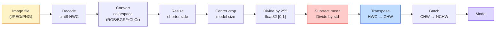
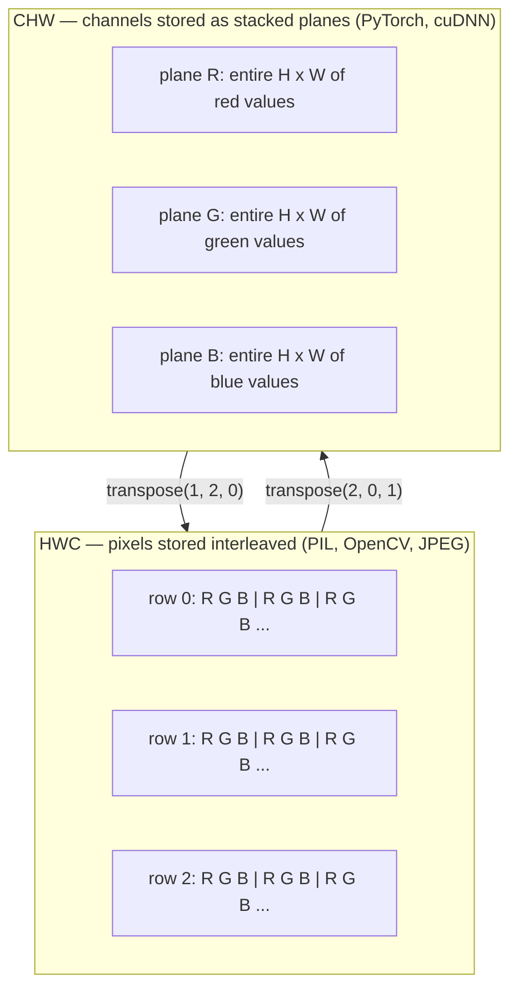

# Fundamentos de la imagen  Pixeles, canales, espacios de color

> Una imagen es un tensor de muestras de luz. Cada modelo de visión que usará comienza con este hecho.

**Type:** Build
**Languages:** Python
**Prerequisites:** Phase 1 Lesson 12 (Tensor Operations), Phase 3 Lesson 11 (Intro to PyTorch)
**Time:** ~45 minutes

## Objetivos de aprendizaje

- Explicar cómo una escena continua se discrete en píxeles y por qué las decisiones de muestreo/cuantización establecen el límite en cada modelo en aguas posteriores
- Leer, recortar e inspeccionar imágenes como matrices NumPy y cambiar fluidamente entre las configuraciones HWC y CHW
- Convertir entre RGB, escala de gris, HSV y YCbCr y justificar por qué existe cada espacio de color
- Aplicar el preprocesamiento a nivel de píxeles (normaliza, estandariza, redimensionar, canaliza primero) exactamente como lo esperan los modelos de visión PyTorch preentrenados

## El problema

Cada artículo que leerás, cada peso pre-entrenado que descargas, cada API de visión que llamas asume un codificación específica de la entrada.`uint8`imagen donde el modelo quiere `float32`y todavía se ejecutará  y producirá basura en silencio. Alimenta BGR a una red entrenada en RGB y la precisión colapsará en diez puntos. Entrega un modelo de canales-última entrada cuando espera canales-primero y la primera capa de conve trata la altura como un canal de características. Nada de esto arroja un error. Simplemente arruina tus métricas y pasas una semana buscando un error que vive en la forma en que cargaste el archivo.

Una convolución no es complicada una vez que se sabe lo que se desliza. La parte difícil es que "una imagen" significa cosas diferentes a una cámara, un decodificador JPEG, PIL, OpenCV, torchvision y un núcleo CUDA. Cada pila tiene su propio orden de eje, rango de byte y convención de canal.

Esta lección fija la base para que el resto de la fase pueda construir sobre ella. Al final sabrá qué es un píxel, por qué hay tres números por píxel en lugar de uno, lo que "normaliza con estadísticas de ImageNet" realmente hace, y cómo moverse entre los dos o tres diseños que cada otra lección en esta fase asumirá.

## El concepto

### La línea de tubería completa de preprocesamiento en un vistazo

Cada sistema de visión de producción es la misma secuencia de transformaciones revertibles. Si se equivoca un paso, el modelo ve una entrada diferente a la que fue entrenado.



Las dos cajas rojas y azules son donde vive el 80% de los fallos silenciosos: falta de estandarización y diseño incorrecto.

### Un píxel es una muestra, no un cuadrado

Un sensor de cámara cuenta los fotones que aterrizan en una red de detectores diminutos. Cada detector integra la luz durante una fracción de segundo y emite un voltaje proporcional a la cantidad de fotones que lo golpean. El sensor luego discretizan ese voltaje en un número entero.

```
Continuous scene                 Sensor grid                     Digital image
(infinite detail)                (H x W detectors)               (H x W integers)

    ~~~~~                        +--+--+--+--+--+                 210 198 180 155 120
   ♪ ♪ y luego de todo, me siento como si fuera un niño ♪
  - - - - - - - - - - - - - - - - - - - - - - - - - - - - - - - - - - - - - - - - - - - - - - - - - - - - - - - - - - - - - - - - - - - - - - - - - - - - - - - - - - - - - - - - - - - - - - - - - - - - - - - - - - - - - - - - - - - - - - - - - - - - - - - - - - - - - - - - - - - - - - - - - - - - - - - - - - - - - - - - - - - - - - - - - - - - - - - - - - - - - - - - - - - - - - - - - - - - - - - - - - - - - - - - - - - - - - - - - - - - - - - - - - - - - - - - - - - - - - - - - - - - - - - - - - - - - - - - - - - - - - - - - - - - - - - - - - - - - - - - - - - - - - - - - - - - - - - - - - - - - - - - - - - - - - - - - - - - - - - - - - - - - - - - - - - - - - - - - - - - - - - - - - - - - - - - - - - - - - - - - - - - - - - - - - - - - - - - - - - - - - - - - - - - - - - - - - - - - - - - - - - - - - - - - - - - - - - - - - - - - - - - - - - - - - - - - - - - - - - - - - - - - - - - - - - - - - - - - - - - - - - - - - - - - - - - - - - - - - - - - - - - - - - - - - - - - - - - - - - - - - - - - - - - - -
   ~~~~~                         |  |  |  |  |  |                 195 185 170 148 112
                                 +--+--+--+--+--+                 188 180 165 145 108
```

En este paso hay dos opciones y se fija el techo en todo lo que baja:

- **Spatial sampling**El número de detectores en cada grado de escena es muy pequeño y los bordes se ponen en punto.
- **Intensity quantization**El sistema de detección de tensión de la imagen de la imagen de la imagen de la imagen de la imagen de la imagen de la imagen de la imagen de la imagen de la imagen de la imagen de la imagen de la imagen de la imagen de la imagen de la imagen de la imagen de la imagen de la imagen de la imagen de la imagen de la imagen de la imagen de la imagen de la imagen de la imagen de la imagen de la imagen de la imagen de la imagen de la imagen de la imagen de la imagen de la imagen de la imagen de la imagen de la imagen de la imagen de la imagen de la imagen de la imagen de la imagen de la imagen de la imagen de la imagen de la imagen de la imagen de la imagen de la imagen de la imagen de la imagen de la imagen de la imagen de la imagen de la imagen de la imagen de la imagen de la imagen de la imagen de la imagen de la imagen de la imagen de la imagen de la imagen de la imagen de la imagen de la imagen de la imagen de la imagen de la imagen de la imagen de la imagen de la imagen de la imagen de la imagen de la imagen de la imagen de la imagen de la imagen de la imagen de la imagen de la imagen de la imagen de la imagen de la imagen de la imagen de la imagen de la imagen de la imagen de la imagen de la imagen de la imagen de la imagen de la imagen de la imagen de la imagen de la imagen de la imagen de la imagen de la imagen de la imagen de la imagen de la imagen de la imagen de la imagen de la imagen de la imagen de la imagen de la imagen de la imagen.

Un píxel no es un cuadrado de color con área. Es una sola medida. Cuando cambias de tamaño o giras, estás repetiendo esa cuadrícula de medición.

### ¿Por qué tres canales?

Un detector cuenta fotones en todo el espectro visible  que es escala de gris. Para obtener color, el sensor cubre la cuadrícula con un mosaico de filtros rojos, verdes y azules. Después de demosaicing, cada ubicación espacial tiene tres enteros: la respuesta del detector filtrado en rojo, filtrado en verde y filtrado en azul cerca.

```
One pixel in memory:

    (R, G, B) = (210, 140, 30)   <- reddish-orange

An H x W RGB image:

    shape (H, W, 3)     stored as   H rows of W pixels of 3 values
                                    each in [0, 255] for uint8
```

Las cámaras de profundidad añaden un canal Z. Los satélites añaden bandas infrarrojas y ultravioletas. Los escáneres médicos a menudo tienen un canal (rayos X, CT) o muchos (hiperspectral).

### Dos convenciones de diseño: HWC y CHW

El mismo tensor, dos ordenes.

```
HWC (height, width, channels)           CHW (channels, height, width)

   W ->                                    H ->
  +-----+-----+-----+                     +-----+-----+
H |R G B|R G B|R G B|                   C |R R R R R R|
| +-----+-----+-----+                   | +-----+-----+
v |R G B|R G B|R G B|                   v |G G G G G G|
  +-----+-----+-----+                     +-----+-----+
                                          |B B B B B B|
                                          +-----+-----+

   PIL, OpenCV, matplotlib,              PyTorch, most deep learning
   almost every image file on disk       frameworks, cuDNN kernels
```

CHW existe porque los núcleos de convolución se deslizan a través de H y W. Mantener el eje del canal primero significa que cada núcleo ve un plano 2D contiguo por canal, que vectoriza limpiamente.

La conversión de una línea que escribirá mil veces:

```
img_chw = img_hwc.transpose(2, 0, 1)      # NumPy
img_chw = img_hwc.permute(2, 0, 1)        # PyTorch tensor
```

Diseño de memoria, visualizado:



### Rango de byte y tipo d

En la actualidad, hay tres convenciones:

| Convention | dtype | Range | Where you see it |
|------------|-------|-------|------------------|
| Raw | `uint8` | [0, 255] | Files on disk, PIL, OpenCV output |
| Normalized | `float32` | [0.0, 1.0] | After `img.astype('float32') / 255` |
| Standardized | `float32` | roughly [-2, +2] | After subtracting mean and dividing by std |

Las redes convolucionales fueron entrenadas en entradas estandarizadas.`mean=[0.485, 0.456, 0.406]`¿ Qué ?`std=[0.229, 0.224, 0.225]`son la media aritmética y la desviación estándar de los tres canales en el conjunto completo de capacitación de ImageNet, calculada en [0, 1] píxeles normalizados.`uint8`En un modelo que espera flotación estandarizada es el único fallo silencioso más común en la visión aplicada.

### Espacios de color y por qué existen

RGB es el formato de captura, pero no siempre es la representación más útil para un modelo.

```
 RGB               HSV                       YCbCr / YUV

 R red             H hue (angle 0-360)       Y luminance (brightness)
 G green           S saturation (0-1)        Cb chroma blue-yellow
 B blue            V value/brightness (0-1)  Cr chroma red-green

 Linear to         Separates color from      Separates brightness from
 sensor output     brightness. Useful for    color. JPEG and most video
                   color thresholding, UI    codecs compress the chroma
                   sliders, simple filters   channels harder because the
                                             human eye is less sensitive
                                             to chroma detail than to Y.
```

Para la mayoría de las cadenas de televisión modernas se alimenta RGB.

- **HSV** código de CV clásico, segmentación basada en el color, balanceo de blanco.
- **YCbCr** lectura de los internos de JPEG, canalizaciones de vídeo, modelos de superresolución que operan solo en Y.
- **Grayscale** OCR, modelos de documentos, cualquier caso en el que el color sea variable de molestia en lugar de señal.

La escala de gris de RGB es una suma ponderada, no una media, porque el ojo humano es más sensible al verde que al rojo o al azul:

```
Y = 0.299 R + 0.587 G + 0.114 B       (ITU-R BT.601, the classic weights)
```

### Ratio de aspecto, redimensionamiento e interpolación

Cada modelo tiene un tamaño de entrada fijo (224x224 para la mayoría de los clasificadores de ImageNet, 384x384 o 512x512 para los detectores modernos).

- **Resize shorter side, then center crop** la receta estándar de ImageNet. Preserva la relación de aspecto, elimina una tira de píxeles de borde.
- **Resize and pad** conserva la relación de aspecto y cada píxel, añade barras negras.
- **Resize directly to target**Es barato, distorsiona la geometría, es bueno para muchas tareas de clasificación.

El método de interpolación decide cómo se calculan los píxeles intermedios cuando la nueva cuadrícula no se alinea con la antigua:

```
Nearest neighbour     fastest, blocky, only choice for masks/labels
Bilinear              fast, smooth, default for most image resizing
Bicubic               slower, sharper on upscaling
Lanczos               slowest, best quality, used for final display
```

Regla de oro: bilinear para entrenamiento, bicubo o lanczos para activos que verá, más cercano para cualquier cosa que contenga ID de clase entera.

```figure
conv-output-size
```

## Construye el mismo

### Paso 1: Construye un tensor de imagen e inspeccione su forma

Comience con una imagen sintética determinista para que el primer laboratorio se ejecute fuera de línea con sólo NumPy. El decodificación de archivos es un límite separado: una vez que un decodificador JPEG o PNG devuelve bytes RGB, cada operación tensor a continuación es la misma.

```python
import numpy as np

def synthetic_rgb(h=128, w=192, seed=0):
    rng = np.random.default_rng(seed)
    yy, xx = np.meshgrid(np.linspace(0, 1, h), np.linspace(0, 1, w), indexing="ij")
    r = (np.sin(xx * 6) * 0.5 + 0.5) * 255
    g = yy * 255
    b = (1 - yy) * xx * 255
    rgb = np.stack([r, g, b], axis=-1) + rng.normal(0, 6, (h, w, 3))
    return np.clip(rgb, 0, 255).astype(np.uint8)

arr = synthetic_rgb()

print(f"type:   {type(arr).__name__}")
print(f"dtype:  {arr.dtype}")
print(f"shape:  {arr.shape}     # (H, W, C)")
print(f"min:    {arr.min()}")
print(f"max:    {arr.max()}")
print(f"pixel at (0, 0): {arr[0, 0]}")
```

Producción esperada: `shape: (H, W, 3)`¿ Qué ?`dtype: uint8`, rango `[0, 255]`Esa es la representación canónica decodificada si los bytes provenían de una cámara, un decodificador de imágenes o de este generador sintético.

### Paso 2: División de canales y reordenamiento de diseño

Saque R, G, B por separado, y luego convierta de HWC a CHW para PyTorch.

```python
R = arr[:, :, 0]
G = arr[:, :, 1]
B = arr[:, :, 2]
print(f"R shape: {R.shape}, mean: {R.mean():.1f}")
print(f"G shape: {G.shape}, mean: {G.mean():.1f}")
print(f"B shape: {B.shape}, mean: {B.mean():.1f}")

arr_chw = arr.transpose(2, 0, 1)
print(f"\nHWC shape: {arr.shape}")
print(f"CHW shape: {arr_chw.shape}")
```

Tres planos a escala de gris, uno por canal. CHW simplemente reordena los ejes; no se requiere estrictamente copia de datos cuando el diseño de memoria lo permite.

### Paso 3: Conversiones de escala gris y HSV

Escala de grises ponderada, luego una manual RGB-HSV.

```python
def rgb_to_grayscale(rgb):
    weights = np.array([0.299, 0.587, 0.114], dtype=np.float32)
    return (rgb.astype(np.float32) @ weights).astype(np.uint8)

def rgb_to_hsv(rgb):
    rgb_f = rgb.astype(np.float32) / 255.0
    r, g, b = rgb_f[..., 0], rgb_f[..., 1], rgb_f[..., 2]
    cmax = np.max(rgb_f, axis=-1)
    cmin = np.min(rgb_f, axis=-1)
    delta = cmax - cmin

    h = np.zeros_like(cmax)
    mask = delta > 0
    argmax = np.argmax(rgb_f, axis=-1)
    rmax = mask & (argmax == 0)
    gmax = mask & (argmax == 1)
    bmax = mask & (argmax == 2)
    h[rmax] = ((g[rmax] - b[rmax]) / delta[rmax]) % 6
    h[gmax] = ((b[gmax] - r[gmax]) / delta[gmax]) + 2
    h[bmax] = ((r[bmax] - g[bmax]) / delta[bmax]) + 4
    h = h * 60.0

    s = np.divide(delta, cmax, out=np.zeros_like(delta), where=cmax > 0)
    v = cmax
    return np.stack([h, s, v], axis=-1)

gray = rgb_to_grayscale(arr)
hsv = rgb_to_hsv(arr)
print(f"gray shape: {gray.shape}, range: [{gray.min()}, {gray.max()}]")
print(f"hsv   shape: {hsv.shape}")
print(f"hue range: [{hsv[..., 0].min():.1f}, {hsv[..., 0].max():.1f}] degrees")
print(f"sat range: [{hsv[..., 1].min():.2f}, {hsv[..., 1].max():.2f}]")
print(f"val range: [{hsv[..., 2].min():.2f}, {hsv[..., 2].max():.2f}]")
```

Hue aparece en grados, saturación y valor en [0, 1].`hsv_full`convención.

### Paso 4: Normaliza, estandariza y invierte

Ir de bytes crudos al tensor exacto que un modelo de ImageNet preentrenado espera, y luego de vuelta.

```python
mean = np.array([0.485, 0.456, 0.406], dtype=np.float32)
std = np.array([0.229, 0.224, 0.225], dtype=np.float32)

def preprocess_imagenet(rgb_uint8):
    x = rgb_uint8.astype(np.float32) / 255.0
    x = (x - mean) / std
    x = x.transpose(2, 0, 1)
    return x

def deprocess_imagenet(chw_float32):
    x = chw_float32.transpose(1, 2, 0)
    x = x * std + mean
    x = np.clip(x * 255.0, 0, 255).astype(np.uint8)
    return x

x = preprocess_imagenet(arr)
print(f"preprocessed shape: {x.shape}     # (C, H, W)")
print(f"preprocessed dtype: {x.dtype}")
print(f"preprocessed mean per channel:  {x.mean(axis=(1, 2)).round(3)}")
print(f"preprocessed std  per channel:  {x.std(axis=(1, 2)).round(3)}")

roundtrip = deprocess_imagenet(x)
max_diff = np.abs(roundtrip.astype(int) - arr.astype(int)).max()
print(f"roundtrip max pixel diff: {max_diff}    # should be 0 or 1")
```

El par de preprocesamiento/desprocesamiento es exactamente lo que cada visión de antorcha `transforms.Normalize`La llamada está bajo el capó.

### Paso 5: Redimensionar desde cero

Las coordenadas de salida de las rodadas vecinas más cercanas a un píxel fuente. La interpolación bilinear encuentra los cuatro píxeles circundantes y los mezcla por distancia. Ambas implementaciones de abajo utilizan coordenadas alineadas con los puntos finales para que los primeros y últimos píxeles fuentes permanezcan fijos.

```python
def resize_coordinates(source_length, target_length):
    if target_length == 1:
        return np.zeros(1, dtype=np.float32)
    return np.linspace(0, source_length - 1, target_length, dtype=np.float32)

def nearest_resize(image, target_height, target_width):
    y = np.rint(resize_coordinates(image.shape[0], target_height)).astype(int)
    x = np.rint(resize_coordinates(image.shape[1], target_width)).astype(int)
    return image[y[:, None], x[None, :]]

def bilinear_resize(image, target_height, target_width):
    y = resize_coordinates(image.shape[0], target_height)
    x = resize_coordinates(image.shape[1], target_width)
    y0 = np.floor(y).astype(int)
    x0 = np.floor(x).astype(int)
    y1 = np.minimum(y0 + 1, image.shape[0] - 1)
    x1 = np.minimum(x0 + 1, image.shape[1] - 1)
    wy = (y - y0)[:, None, None]
    wx = (x - x0)[None, :, None]

    source = image.astype(np.float32)
    top = source[y0[:, None], x0[None, :]] * (1 - wx)
    top += source[y0[:, None], x1[None, :]] * wx
    bottom = source[y1[:, None], x0[None, :]] * (1 - wx)
    bottom += source[y1[:, None], x1[None, :]] * wx
    result = top * (1 - wy) + bottom * wy
    return np.clip(np.rint(result), 0, 255).astype(image.dtype)

target_height = arr.shape[0] * 3
target_width = arr.shape[1] * 3
nearest = nearest_resize(arr, target_height, target_width)
bilinear = bilinear_resize(arr, target_height, target_width)

def local_roughness(x):
    gy = np.diff(x.astype(float), axis=0)
    gx = np.diff(x.astype(float), axis=1)
    return float(np.abs(gy).mean() + np.abs(gx).mean())

for name, out in [("nearest", nearest), ("bilinear", bilinear)]:
    print(f"{name:>8}  shape={out.shape}  roughness={local_roughness(out):6.2f}")
```

El más cercano obtiene más puntuaciones en rugosidad porque mantiene bordes duros. Bilinear es más suave porque cada nuevo píxel mezcla dos posiciones en cada eje. El compañero ejecutable extiende la misma idea separable a cuatro vecinos por eje con un núcleo cúbico Catmull-Rom, luego imprime los tres resultados sin una biblioteca de imágenes.

## Usalo

PyTorch realiza las mismas operaciones en tensores batchados y conscientes del dispositivo. El código de abajo redimensionará el lado más corto, tomará un recorte central, estandarizará cada canal y producirá el tensor NCHW que un modelo preentrenado espera.

```python
import torch
import torch.nn.functional as F

image_hwc = torch.from_numpy(synthetic_rgb(256, 320))
batch = image_hwc.permute(2, 0, 1).unsqueeze(0).float() / 255.0

height, width = batch.shape[-2:]
scale = 256 / min(height, width)
resized_height = round(height * scale)
resized_width = round(width * scale)
batch = F.interpolate(
    batch,
    size=(resized_height, resized_width),
    mode="bilinear",
    align_corners=False,
    antialias=True,
)

top = (resized_height - 224) // 2
left = (resized_width - 224) // 2
batch = batch[:, :, top:top + 224, left:left + 224]

mean = torch.tensor([0.485, 0.456, 0.406]).view(1, 3, 1, 1)
std = torch.tensor([0.229, 0.224, 0.225]).view(1, 3, 1, 1)
batch = (batch - mean) / std

print(f"tensor dtype: {batch.dtype}")
print(f"batched shape: {tuple(batch.shape)}")
print(f"per-channel mean: {batch.mean(dim=(0, 2, 3)).tolist()}")
print(f"per-channel std:  {batch.std(dim=(0, 2, 3)).tolist()}")
```

Cuatro pasos, en este orden exacto: convertir bytes a float y cambiar HWC a NCHW, cambiar el tamaño del lado más corto a 256, tomar un recorte central de 224x224, luego restar la media de ImageNet y dividir por su desviación estándar.

## Envío

Esta lección produce:

- `outputs/prompt-vision-preprocessing-audit.md` una solicitud que convierte cualquier tarjeta modelo o tarjeta de conjunto de datos en una lista de verificación de las invariantes de preprocesamiento exactas que un equipo debe cumplir.
- `outputs/skill-image-tensor-inspector.md` una habilidad que, dada cualquier tensor o matriz en forma de imagen, informa sobre dtype, diseño, rango y si se ve crudo, normalizado o estandarizado.

## Los ejercicios

1. **(Easy)**Crear un RGB 2x2 `uint8`Convierta HWC a CHW y hacia atrás, imprima ambas formas y prueba que el viaje de ida y vuelta conserva todos los valores.
2. **(Medium)**Escriba .`standardize(img, mean, std)`y su inverso que juntos pasan un `roundtrip_max_diff <= 1`Las funciones deben funcionar en una sola imagen en HWC y en un lote en NCHW con la misma llamada.
3. **(Hard)**Tome un tensor estándar de 3 canales ImageNet y ejecutarlo a través de un conv 1x1 que aprende una mezcla ponderada de RGB en un solo canal a escala de gris. Inicializa los pesos a`[0.299, 0.587, 0.114]`, congelarlos, y verificar que la salida coincide con su manual `rgb_to_grayscale`¿Qué otras transformaciones clásicas del espacio color se pueden escribir como 1x1 convolsiones?

## Términos clave

| Term | What people say | What it actually means |
|------|----------------|----------------------|
| Pixel | "A coloured square" | One sample of light intensity at one grid location — three numbers for colour, one for grayscale |
| Channel | "The colour" | One of the parallel spatial grids stacked into an image tensor; last axis in HWC, first in CHW |
| HWC / CHW | "The shape" | Axis orderings for an image tensor; disk and PIL use HWC, PyTorch and cuDNN use CHW |
| Normalize | "Scale the image" | Divide by 255 so pixels live in [0, 1] — necessary but not sufficient |
| Standardize | "Zero-center" | Subtract mean and divide by std per channel so the input distribution matches what the model was trained on |
| Grayscale conversion | "Average the channels" | A weighted sum with coefficients 0.299/0.587/0.114 that matches human luminance perception |
| Interpolation | "How resize picks pixels" | The rule that decides output values when the new grid does not align with the old one — nearest for labels, bilinear for training, bicubic for display |
| Aspect ratio | "Width over height" | The ratio that distinguishes "resize and pad" from "resize and stretch" |

## Leer más

- [Charles Poynton — A Guided Tour of Color Space](https://poynton.ca/PDFs/Guided_tour.pdf) el tratamiento técnico más claro de por qué hay tantos espacios de color y cuándo cada uno importa
- [PyTorch Vision Transforms Docs](https://pytorch.org/vision/stable/transforms.html) la línea completa de transformaciones que realmente se compondrá en la producción
- [How JPEG Works (Colt McAnlis)](https://www.youtube.com/watch?v=F1kYBnY6mwg) una visión de la submuestreo de croma, DCT, y por qué JPEG codifica YCbCr en lugar de RGB
- [ImageNet Preprocessing Conventions (torchvision models)](https://pytorch.org/vision/stable/models.html) la fuente de la verdad para `mean=[0.485, 0.456, 0.406]`Y por qué cada modelo en el zoológico lo espera
