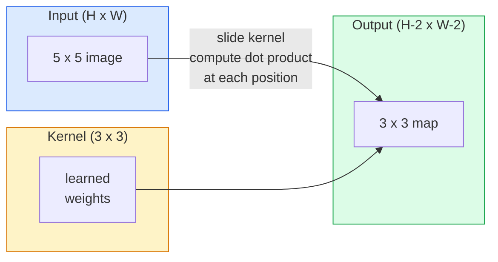
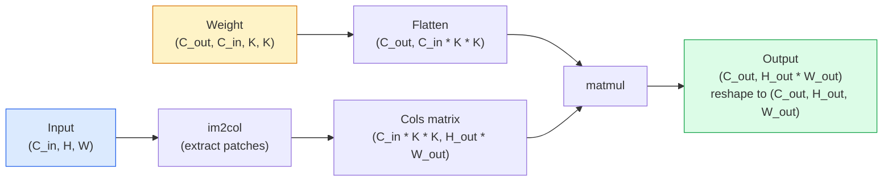

# Convolucciones desde cero

> Una convolución es una pequeña capa densa que deslizas a través de una imagen, compartiendo los mismos pesos en cada ubicación.

**Type:** Build
**Languages:** Python
**Prerequisites:** Phase 3 (Deep Learning Core), Phase 4 Lesson 01 (Image Fundamentals)
**Time:** ~75 minutes

## Objetivos de aprendizaje

- Implementar la convolución 2D desde cero utilizando sólo NumPy, incluyendo la versión en bucle anidado y una vectorizada `im2col`versión
- Computa el tamaño espacial de salida para cualquier combinación de tamaño de entrada, tamaño del núcleo, relleno y paso, y justifica el `(H - K + 2P) / S + 1`fórmula
- Los núcleos de diseño manual (borda, borra, afilada, sobel) y explicar por qué cada uno produce el patrón de activaciones que hace
- Las convulsiones de la pila en un extractor de características y conectar la profundidad de la pila al tamaño del campo receptivo

## El problema

Una capa completamente conectada en una imagen RGB 224x224 necesitaría 224 * 224 * 3 = 150.528 pesos de entrada por neurona. Una sola capa oculta con 1.000 unidades ya es de 150 millones de parámetros antes de que hayas aprendido algo útil. Peor aún, esa capa no tiene idea de que un perro en la parte superior izquierda y un perro en la parte inferior derecha son el mismo patrón. Trata cada posición de píxel como independiente, lo cual es exactamente incorrecto para las imágenes: traducir un gato por tres píxeles no debería obligar a la red a volver a aprender el concepto.

Las dos propiedades que necesita un modelo de imagen son **translation equivariance**(la salida cambia cuando la entrada cambia) y **parameter sharing**Las capas densas no te dan ninguna.

La conversión no fue inventada para el aprendizaje profundo. Es la misma operación que alimenta la compresión JPEG, la borrosidad gaussiana en Photoshop, la detección de borde en la visión industrial y todos los filtros de audio jamás enviados. La razón por la que las CNNs dominaron ImageNet de 2012 a 2020 es que la conversión es el precario correcto para los datos donde los valores cercanos están relacionados y el mismo patrón puede aparecer en cualquier lugar.

## El concepto

### Un núcleo, deslizándose

Una convolución 2D toma una pequeña matriz de peso llamada núcleo (o filtro), se desliza a través de la entrada, y en cada ubicación calcula la suma de productos con elementos.



Un ejemplo concreto 3x3 en una entrada 5x5 (sin relleno, paso 1):

```
Input X (5 x 5):                Kernel W (3 x 3):

  1  2  0  1  2                   1  0 -1
  0  1  3  1  0                   2  0 -2
  2  1  0  2  1                   1  0 -1
  1  0  2  1  3
  2  1  1  0  1

The kernel slides across every valid 3 x 3 window. Output Y is 3 x 3:

 Y[0,0] = sum( W * X[0:3, 0:3] )
 Y[0,1] = sum( W * X[0:3, 1:4] )
 Y[0,2] = sum( W * X[0:3, 2:5] )
 Y[1,0] = sum( W * X[1:4, 0:3] )
 ... and so on
```

Esa fórmula  **shared weights, locality, sliding window**Todo lo demás es contabilidad.

### Formula de tamaño de salida

Dado el tamaño espacial de entrada `H`, tamaño del núcleo `K`, relleno .`P`, paso .`S`¿Qué es esto ?

```
H_out = floor( (H - K + 2P) / S ) + 1
```

Recuerde esto, lo calculará docenas de veces por arquitectura.

| Scenario | H | K | P | S | H_out |
|----------|---|---|---|---|-------|
| Valid conv, no padding | 32 | 3 | 0 | 1 | 30 |
| Same conv (preserves size) | 32 | 3 | 1 | 1 | 32 |
| Downsample by 2 | 32 | 3 | 1 | 2 | 16 |
| Pool 2x2 | 32 | 2 | 0 | 2 | 16 |
| Large receptive field | 32 | 7 | 3 | 2 | 16 |

"El mismo relleno" significa elegir P para que H_out == H cuando S == 1. Para K impar, es P = (K - 1) / 2.

### Padding

Sin relleno, cada convolución reduce el mapa de características. La pila 20 de ellos y su imagen 224x224 se convierte en 184x184, lo que desperdicia el cálculo en la frontera y complica las conexiones residuales que necesitan formas coincidentes.

```
Zero padding (P = 1) on a 5 x 5 input:

  0  0  0  0  0  0  0
  0  1  2  0  1  2  0
  0  0  1  3  1  0  0
  0  2  1  0  2  1  0       Now the kernel can centre on pixel
  0  1  0  2  1  3  0       (0, 0) and still have three rows and
  0  2  1  1  0  1  0       three columns of values to multiply.
  0  0  0  0  0  0  0
```

Modos que se encuentran en la práctica: `zero`(más común), `reflect`(espejo de la margen, evita fronteras duras en modelos generativos), `replicate`(copiar el borde), `circular`(envuelto alrededor, utilizado en problemas toroidales).

### El paso

El paso es el tamaño del paso del diapositivo. `stride=1`es el predeterminado. `stride=2`La red de datos de la red de televisión de la red de televisión de Estados Unidos (CNN) reduce a la mitad las dimensiones espaciales y es la forma clásica de tomar una muestra de la red de televisión de Estados Unidos sin una capa de agrupación separada.

```
Stride 1 on a 5 x 5 input, 3 x 3 kernel:

  starts: (0,0) (0,1) (0,2)        -> output row 0
          (1,0) (1,1) (1,2)        -> output row 1
          (2,0) (2,1) (2,2)        -> output row 2

  Output: 3 x 3

Stride 2 on the same input:

  starts: (0,0) (0,2)              -> output row 0
          (2,0) (2,2)              -> output row 1

  Output: 2 x 2
```

### Cánalles de entrada múltiples

Las imágenes reales tienen tres canales. Una convolución 3x3 en una entrada RGB es en realidad un volumen 3x3x3: una rodaje 3x3 por canal de entrada. En cada posición espacial, se multiplica y suma a través de las tres rodajes y se añade un sesgo.

```
Input:   (C_in,  H,  W)        3 x 5 x 5
Kernel:  (C_in,  K,  K)        3 x 3 x 3 (one kernel)
Output:  (1,     H', W')       2D map

For a layer that produces C_out output channels, you stack C_out kernels:

Weight:  (C_out, C_in, K, K)   e.g. 64 x 3 x 3 x 3
Output:  (C_out, H', W')       64 x 3 x 3

Parameter count: C_out * C_in * K * K + C_out   (the + C_out is biases)
```

Esta última línea es la que se calculará cuando se planea un modelo.`64 * 3 * 3 * 3 + 64 = 1,792`Parámetros.

### El truco de im2col

Los circuitos anidados son fáciles de leer pero lentos. Las GPUs quieren grandes multiplicadores de matriz. El truco: aplanar cada ventana de campo receptivo de la entrada en una columna de una matriz grande, aplanar el núcleo en una fila, y toda la convolución se convierte en una sola matmul.



Cada implementación de conjuntos de producción es una variante de este más trucos de caché-tiling (conv directo, Winograd, FFT con para núcleos grandes).

### Campo de recepción

Una sola conexión 3x3 tiene 9 píxeles de entrada. apilar dos conexiones 3x3 y una neurona en la segunda capa tiene 5x5 píxeles de entrada.

```
RF after L stacked K x K convs (stride 1) = 1 + L * (K - 1)

With strides:   RF grows multiplicatively with stride along each layer.
```

La razón por la que "3x3 todo el camino hacia abajo" funciona (VGG, ResNet, ConvNeXt) es que dos convases 3x3 ven el mismo área de entrada que una conva 5x5 pero con menos parámetros y una no linealidad adicional entre ellos.

```figure
convolution-kernel
```

## Construye el mismo

### Paso 1: Padear una matriz

Comience con la más pequeña primitiva: una función que se empama con ceros alrededor de una matriz H x W.

```python
import numpy as np

def pad2d(x, p):
    if p == 0:
        return x
    h, w = x.shape[-2:]
    out = np.zeros(x.shape[:-2] + (h + 2 * p, w + 2 * p), dtype=x.dtype)
    out[..., p:p + h, p:p + w] = x
    return out

x = np.arange(9).reshape(3, 3)
print(x)
print()
print(pad2d(x, 1))
```

El truco de los ejes de seguimiento .`x.shape[:-2]`significa que la misma función funciona en `(H, W)`¿ Qué ?`(C, H, W)`, o`(N, C, H, W)`sin modificaciones.

### Paso 2: Convolución 2D con bucles anidados

La aplicación de referencia es lenta pero inequívoca.`torch.nn.functional.conv2d`En principio sí.

```python
def conv2d_naive(x, w, b=None, stride=1, padding=0):
    c_in, h, w_in = x.shape
    c_out, c_in_w, kh, kw = w.shape
    assert c_in == c_in_w

    x_pad = pad2d(x, padding)
    h_out = (h + 2 * padding - kh) // stride + 1
    w_out = (w_in + 2 * padding - kw) // stride + 1

    out = np.zeros((c_out, h_out, w_out), dtype=np.float32)
    for oc in range(c_out):
        for i in range(h_out):
            for j in range(w_out):
                hs = i * stride
                ws = j * stride
                patch = x_pad[:, hs:hs + kh, ws:ws + kw]
                out[oc, i, j] = np.sum(patch * w[oc])
        if b is not None:
            out[oc] += b[oc]
    return out
```

Cuatro bucles anidados (canal de salida, fila, columna, más la suma implícita sobre C_in, kh, kw). Esta es la verdad de la tierra que comprobarás contra cada implementación más rápida.

### Paso 3: Verifique con un núcleo diseñado a mano

Construye un núcleo vertical de Sobel, apliquela a una imagen de paso sintético y vea cómo se ilumina el borde vertical.

```python
def synthetic_step_image():
    img = np.zeros((1, 16, 16), dtype=np.float32)
    img[:, :, 8:] = 1.0
    return img

sobel_x = np.array([
    [[-1, 0, 1],
     [-2, 0, 2],
     [-1, 0, 1]]
], dtype=np.float32)[None]

x = synthetic_step_image()
y = conv2d_naive(x, sobel_x, padding=1)
print(y[0].round(1))
```

Espere grandes valores positivos en la columna 7 (aumento de brillo de izquierda a derecha) y ceros en todas partes.

### Paso 4: im2col

Convertir cada ventana del tamaño del núcleo en la entrada en una columna de una matriz.`C_in=3, K=3`, cada columna es de 27 números.

```python
def im2col(x, kh, kw, stride=1, padding=0):
    c_in, h, w = x.shape
    x_pad = pad2d(x, padding)
    h_out = (h + 2 * padding - kh) // stride + 1
    w_out = (w + 2 * padding - kw) // stride + 1

    cols = np.zeros((c_in * kh * kw, h_out * w_out), dtype=x.dtype)
    col = 0
    for i in range(h_out):
        for j in range(w_out):
            hs = i * stride
            ws = j * stride
            patch = x_pad[:, hs:hs + kh, ws:ws + kw]
            cols[:, col] = patch.reshape(-1)
            col += 1
    return cols, h_out, w_out
```

Todavía es un bucle Python, pero ahora el levantamiento pesado será un matmul vectorizado único.

### Paso 5: Conv rápida a través de im2col + matmul

Reemplaza el bucle cuadruplo con una multiplicación de matriz.

```python
def conv2d_im2col(x, w, b=None, stride=1, padding=0):
    c_out, c_in, kh, kw = w.shape
    cols, h_out, w_out = im2col(x, kh, kw, stride, padding)
    w_flat = w.reshape(c_out, -1)
    out = w_flat @ cols
    if b is not None:
        out += b[:, None]
    return out.reshape(c_out, h_out, w_out)
```

Verificación de exactitud: ejecutar ambas implementaciones y comparar.

```python
rng = np.random.default_rng(0)
x = rng.normal(0, 1, (3, 16, 16)).astype(np.float32)
w = rng.normal(0, 1, (8, 3, 3, 3)).astype(np.float32)
b = rng.normal(0, 1, (8,)).astype(np.float32)

y_naive = conv2d_naive(x, w, b, padding=1)
y_im2col = conv2d_im2col(x, w, b, padding=1)

print(f"max abs diff: {np.max(np.abs(y_naive - y_im2col)):.2e}")
```

`max abs diff`Debería estar por aquí .`1e-5` la diferencia es el orden de acumulación de puntos flotantes, no un error.

### Paso 6: Un banco de núcleos diseñados a mano

Cinco filtros que muestran lo que una sola capa de convección puede expresar antes de cualquier entrenamiento.

```python
KERNELS = {
    "identity": np.array([[0, 0, 0], [0, 1, 0], [0, 0, 0]], dtype=np.float32),
    "blur_3x3": np.ones((3, 3), dtype=np.float32) / 9.0,
    "sharpen": np.array([[0, -1, 0], [-1, 5, -1], [0, -1, 0]], dtype=np.float32),
    "sobel_x": np.array([[-1, 0, 1], [-2, 0, 2], [-1, 0, 1]], dtype=np.float32),
    "sobel_y": np.array([[-1, -2, -1], [0, 0, 0], [1, 2, 1]], dtype=np.float32),
}

def apply_kernel(img2d, kernel):
    x = img2d[None].astype(np.float32)
    w = kernel[None, None]
    return conv2d_im2col(x, w, padding=1)[0]
```

Aplicado a cualquier imagen en escala de gris, se suaviza, se afila los bordes, Sobel-x ilumina los bordes verticales, Sobel-y ilumina los bordes horizontales. Estos son exactamente los patrones que la primera capa de convección entrenada en AlexNet y VGG terminó aprendiendo  porque un buen modelo de imagen necesita detectores de bordes y manchas sin importar qué tarea venga después.

## Usalo

El de PyTorch.`nn.Conv2d`En el caso de los sistemas de configuración de la configuración de la configuración, el sistema de configuración de la configuración de la configuración de la configuración de la configuración de la configuración de la configuración de la configuración de la configuración de la configuración de la configuración de la configuración de la configuración de la configuración de la configuración de la configuración de la configuración de la configuración de la configuración de la configuración de la configuración de la configuración de la configuración de la configuración de la configuración de la configuración de la configuración de la configuración de la configuración de la configuración de la configuración de la configuración de la configuración de la configuración de la configuración de la configuración de la configuración de la configuración de la configuración de la configuración de la configuración de la configuración de la configuración de la configuración de la configuración de la configuración de la configuración de la configuración de la configuración de la configuración de la configuración de la configuración de la configuración de la configuración de la configuración de la configuración de la configuración de la configuración de la configuración de la configuración de la configuración de la configuración de la configuración de la configuración de la configuración de la configuración de la configuración de la configuración de la configuración de la configuración de la configuración de la configuración de la configuración de la cuidad de la cuidad de la cuidad de la cuidad de la cuidad de la cuidad de la cuidad de cuidad de cuidad de cuidad de cuidad de cuidad de cuidad de cuidad de cuidad de cuidad de cuidad de cuidad de cuidad de cuidad de cuidad de cuidad de cuidad de cuidad de cuidad de cuidad de cuidad de cuidad de cuidad de cuidad de cuidad de cuidad de cuidad.

```python
import torch
import torch.nn as nn

conv = nn.Conv2d(in_channels=3, out_channels=64, kernel_size=3, stride=1, padding=1)
print(conv)
print(f"weight shape: {tuple(conv.weight.shape)}   # (C_out, C_in, K, K)")
print(f"bias shape:   {tuple(conv.bias.shape)}")
print(f"param count:  {sum(p.numel() for p in conv.parameters())}")

x = torch.randn(8, 3, 224, 224)
y = conv(x)
print(f"\ninput  shape: {tuple(x.shape)}")
print(f"output shape: {tuple(y.shape)}")
```

Cambiar`padding=1`por`padding=0`y la salida cae a 222x222. Swap `stride=1`por`stride=2`y cae a 112x112. la misma fórmula que memorizaste anteriormente.

## Envío

Esta lección produce:

- `outputs/prompt-cnn-architect.md` un prompt que, dado el tamaño de la entrada, el presupuesto de parámetros y el campo receptor objetivo, diseña una pila de `Conv2d`capas con el K/S/P correcto en cada paso.
- `outputs/skill-conv-shape-calculator.md` una habilidad que recorre una capa de especificación de red por capa y devuelve la forma de salida, el campo receptivo y el conteo de parámetros para cada bloque.

## Los ejercicios

1. **(Easy)**Dado una entrada de escala de grises de 128x128 y una pila de `[Conv3x3(s=1,p=1), Conv3x3(s=2,p=1), Conv3x3(s=1,p=1), Conv3x3(s=2,p=1)]`, calcular el tamaño del espacio de salida y el campo receptivo en cada capa a mano.`nn.Sequential`de los vehículos de maniobra.
2. **(Medium)**Extenderse`conv2d_naive`y `conv2d_im2col`para aceptar una`groups`Muéstrenlo.`groups=C_in=C_out`reproduce una convolución de profundidad y que su conteo de parámetros es `C * K * K`en lugar de`C * C * K * K`¿ Qué ?
3. **(Hard)**Implementar el paso hacia atrás de `conv2d_im2col`con la mano: dada la gradiente de la salida, calcular la gradiente de `x`y `w`- Verifique contra`torch.autograd.grad`El truco: el gradiente de im2col es`col2im`, y tiene que acumularse ventanas superpuestas.

## Términos clave

| Term | What people say | What it actually means |
|------|----------------|----------------------|
| Convolution | "Sliding a filter" | A learnable dot product applied at every spatial location with shared weights; mathematically a cross-correlation, but everyone calls it convolution |
| Kernel / filter | "The feature detector" | A small weight tensor of shape (C_in, K, K) whose dot product with a window of input produces one output pixel |
| Stride | "How far you jump" | The step size between consecutive kernel placements; stride 2 halves each spatial dimension |
| Padding | "Zeros on the edges" | Extra values added around the input so the kernel can centre on border pixels; `same` padding keeps output size equal to input size |
| Receptive field | "How much the neuron sees" | The patch of original input that a given output activation depends on, growing with depth and stride |
| im2col | "The GEMM trick" | Rearranging every receptive window into columns so convolution becomes one big matrix multiply — the core of every fast conv kernel |
| Depthwise conv | "One kernel per channel" | A conv with `groups == C_in`, computing each output channel from only its matching input channel; the backbone of MobileNet and ConvNeXt |
| Translation equivariance | "Shift in, shift out" | Property that shifting the input by k pixels shifts the output by k pixels; comes for free with shared weights |

## Leer más

- [A guide to convolution arithmetic for deep learning (Dumoulin & Visin, 2016)](https://arxiv.org/abs/1603.07285) los diagramas definitivos de relleno/capa/dilatación que cada curso copia silenciosamente
- [CS231n: Convolutional Neural Networks for Visual Recognition](https://cs231n.github.io/convolutional-networks/) las notas de la conferencia canónica, incluida la explicación original de im2col
- [The Annotated ConvNet (fast.ai)](https://nbviewer.org/github/fastai/fastbook/blob/master/13_convolutions.ipynb) un cuaderno que pasa de la convolución manual a un clasificador de dígitos entrenado
- [Receptive Field Arithmetic for CNNs (Dang Ha The Hien)](https://distill.pub/2019/computing-receptive-fields/) el explicador interactivo de calidad en papel de los cálculos de campos receptivos
