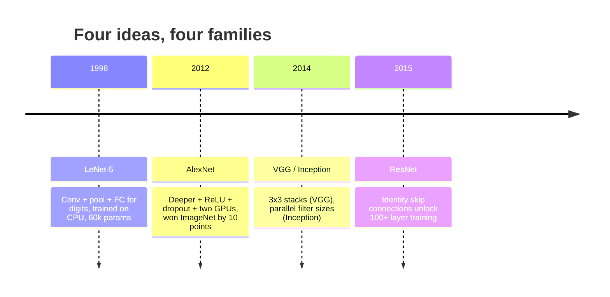
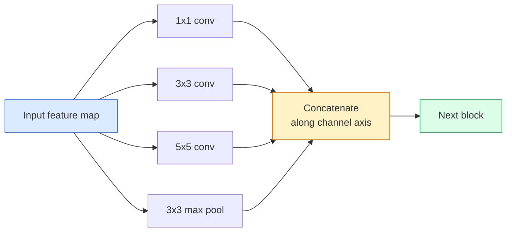
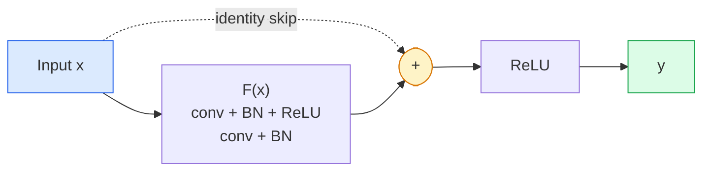

# CNNs  LeNet a ResNet

> Cada gran CNN de los últimos treinta años es la misma receta de no linealidad con una nueva idea.

**Type:** Learn + Build
**Languages:** Python
**Prerequisites:** Phase 3 Lesson 11 (PyTorch), Phase 4 Lesson 01 (Image Fundamentals), Phase 4 Lesson 02 (Convolutions from Scratch)
**Time:** ~75 minutes

## Objetivos de aprendizaje

- Trazar el linaje arquitectónico LeNet-5 -> AlexNet -> VGG -> Inception -> ResNet y indicar la única nueva idea que cada familia contribuyó
- Implemente LeNet-5, un bloque de estilo VGG, y un ResNet BasicBlock en PyTorch, cada uno de menos de 40 líneas
- Explica por qué las conexiones residuales convierten una red de 1.000 capas de inentrainable en el estado de la técnica
- Lea una columna vertebral moderna (ResNet-18, ResNet-50) y predica su forma de salida, campo receptivo y número de parámetros antes de mirar la fuente

## El problema

En 2011, el mejor clasificador de ImageNet obtuvo una precisión del 74% en el top-5. En 2012 AlexNet obtuvo un 85%. En 2015, ResNet obtuvo un puntaje del 96%. No hay nuevos datos. No hay nueva generación de GPU. Las ganancias provinieron de las ideas de arquitectura. Un ingeniero de visión que trabaje tiene que saber de qué papel vino la idea porque cada espina dorsal de producción que envías en 2026 es una recombinación de esas mismas piezas y porque las ideas continúan transferidas: las conexiones agrupadas pasaron de CNN a transformadores, las conexiones residuales pasaron de ResNet a cada LLM existente, la normalización de lotes vive en modelos de difusión.

Estudiar estas redes para poder también te inmunizará contra un error común: buscar el modelo más grande disponible cuando una red del tamaño de LeNet resolvería el problema.

## El concepto

### Las cuatro ideas que cambiaron la visión



Nada más en la visión clásica importaba tanto como estos cuatro saltos.

### LeNet-5 (1998)

El reconocedor de dígitos de Yann LeCun. 60.000 parámetros. Dos bloques de conjuntos, dos capas completamente conectadas, activaciones tanh. Definía la plantilla que hereda cada CNN:

```
input (1, 32, 32)
  conv 5x5 -> (6, 28, 28)
  avg pool 2x2 -> (6, 14, 14)
  conv 5x5 -> (16, 10, 10)
  avg pool 2x2 -> (16, 5, 5)
  flatten -> 400
  dense -> 120
  dense -> 84
  dense -> 10
```

Todo lo que el mundo moderno llama una CNN  convolucras alternadas y muestras de descenso alimentando una pequeña cabeza de clasificador  es LeNet con más capas, canales más grandes y mejores activaciones.

### AlexNet (2012)

Tres cambios que juntos rompieron ImageNet:

1. **ReLU**Los gradientes dejan de desaparecer, el entrenamiento se acelera un factor de seis.
2. **Dropout**La regularización se convierte en una capa, no en un truco.
3. **Depth and width**Cinco capas de concha, tres capas densas, parámetros de 60M, entrenados en dos GPUs con el modelo dividido entre ellos.

La figura 2 del documento muestra todavía la división de la GPU como dos flujos paralelos. Ese paralelismo fue una solución de hardware, no una visión arquitectónica  pero las tres ideas anteriores todavía están en cada modelo que uses.

### VGG (2014)

VGG preguntó: ¿qué pasa si sólo usas 3x3 convolsiones y vas a la profundidad?

```
stack:   conv 3x3 -> conv 3x3 -> pool 2x2
repeat:  16 or 19 conv layers
```

Dos convases 3x3 ven el mismo área de entrada 5x5 que una conva 5x5 pero con menos parámetros (2 * 9 * C^2 = 18C^2 vs 25 * C^2) y un ReLU adicional entre ambos. VGG convirtió esta observación en una arquitectura completa. La simplicidad  un tipo de bloque, repetido  lo convirtió en el punto de referencia para todo lo que vino después.

Costo: 138 millones de parámetros, lento en el entrenamiento, caro en la inferencia.

### Iniciación (2014, mismo año)

La respuesta de Google a "¿qué tamaño de núcleo debería usar?" fue: todos ellos, en paralelo.



Cada rama se especializa en  1x1 para mezclar canales, 3x3 para textura local, 5x5 para patrones más grandes, agrupando para características invariables de cambio  y el concat permite a la capa siguiente elegir cuál rama sea útil.

### El problema de la degradación

En 2015, VGG-19 funcionó y VGG-32 no. La profundidad se suponía que ayudaría, pero después de ~20 capas tanto el entrenamiento como la pérdida de prueba empeoraron. Eso no es sobreajuste. Eso es el optimizador que no encuentra pesos útiles porque los gradientes se reducen multiplicativamente a través de cada capa.

```
Plain deep network:
  y = f_L( f_{L-1}( ... f_1(x) ... ) )

Gradient wrt early layer:
  dL/dW_1 = dL/dy * df_L/df_{L-1} * ... * df_2/df_1 * df_1/dW_1

Each multiplicative term has magnitude roughly (weight magnitude) * (activation gain).
Stack 100 of them with gains < 1 and the gradient is effectively zero.
```

VGG trabajó en 19 capas porque la norma de lote (publicada simultáneamente) mantuvo las activaciones bien escaladas.

### ResNet (2015)

Él, Zhang, Ren, Sun propusieron un cambio que arregló todo:

```
standard block:   y = F(x)
residual block:   y = F(x) + x
```

El `+ x`significa que la capa siempre puede optar por no hacer nada conduciendo.`F(x)`Un ResNet de 1.000 capas es ahora tan malo como una red de 1 capa, porque cada bloque extra tiene una escotilla de escape trivial. Con esa garantía, el optimizador está dispuesto a hacer que cada bloque *ligeramente* útil  y ligeramente útil, apilado 100 veces, es de última generación.



Dos variantes del bloque aparecen en todas partes:

- **BasicBlock**Dos convoyes 3x3, saltar alrededor de ambos.
- **Bottleneck**1x1 abajo, 3x3 medio, 1x1 arriba, saltar alrededor del trío.

Cuando el salto tiene que cruzar una muestra descendente (pasada=2), el camino de identidad se sustituye por un 1x1 paso=2 conv para que coincida con las formas.

### Por qué los residuos son importantes más allá de la visión

La idea no era realmente la clasificación de imágenes. Se trataba de convertir las redes profundas de "cruzar los dedos y esperar que los gradientes sobrevivan" en una herramienta de ingeniería confiable y escalable.

```figure
pooling
```

## Construye el mismo

### Paso 1: LeNet-5

Una LeNet mínima y fiel, activaciones tanh, agrupación media, la única concesión a la modernidad es que usemos`nn.CrossEntropyLoss`abajo en lugar de las conexiones gaussianas originales.

```python
import torch
import torch.nn as nn
import torch.nn.functional as F

class LeNet5(nn.Module):
    def __init__(self, num_classes=10):
        super().__init__()
        self.conv1 = nn.Conv2d(1, 6, kernel_size=5)
        self.conv2 = nn.Conv2d(6, 16, kernel_size=5)
        self.pool = nn.AvgPool2d(2)
        self.fc1 = nn.Linear(16 * 5 * 5, 120)
        self.fc2 = nn.Linear(120, 84)
        self.fc3 = nn.Linear(84, num_classes)

    def forward(self, x):
        x = self.pool(torch.tanh(self.conv1(x)))
        x = self.pool(torch.tanh(self.conv2(x)))
        x = torch.flatten(x, 1)
        x = torch.tanh(self.fc1(x))
        x = torch.tanh(self.fc2(x))
        return self.fc3(x)

net = LeNet5()
x = torch.randn(1, 1, 32, 32)
print(f"output: {net(x).shape}")
print(f"params: {sum(p.numel() for p in net.parameters()):,}")
```

Producción esperada: `output: torch.Size([1, 10])`¿ Qué ?`params: 61,706`Es el clasificador de dígitos que comenzó la visión moderna.

### Paso 2: Bloqueo de VGG

Un bloque reutilizable: dos convases 3x3, ReLU, norma de lote, máxima piscina.

```python
class VGGBlock(nn.Module):
    def __init__(self, in_c, out_c):
        super().__init__()
        self.conv1 = nn.Conv2d(in_c, out_c, kernel_size=3, padding=1)
        self.bn1 = nn.BatchNorm2d(out_c)
        self.conv2 = nn.Conv2d(out_c, out_c, kernel_size=3, padding=1)
        self.bn2 = nn.BatchNorm2d(out_c)
        self.pool = nn.MaxPool2d(2)

    def forward(self, x):
        x = F.relu(self.bn1(self.conv1(x)))
        x = F.relu(self.bn2(self.conv2(x)))
        return self.pool(x)

class MiniVGG(nn.Module):
    def __init__(self, num_classes=10):
        super().__init__()
        self.stack = nn.Sequential(
            VGGBlock(3, 32),
            VGGBlock(32, 64),
            VGGBlock(64, 128),
        )
        self.head = nn.Sequential(
            nn.AdaptiveAvgPool2d(1),
            nn.Flatten(),
            nn.Linear(128, num_classes),
        )

    def forward(self, x):
        return self.head(self.stack(x))

net = MiniVGG()
x = torch.randn(1, 3, 32, 32)
print(f"output: {net(x).shape}")
print(f"params: {sum(p.numel() for p in net.parameters()):,}")
```

Tres bloques VGG en una entrada de tamaño CIFAR, un grupo adaptativo, una capa lineal. ~290k parámetros.

### Paso 3: Un bloqueo básico de ResNet

El bloque de construcción central de ResNet-18 y ResNet-34.

```python
class BasicBlock(nn.Module):
    def __init__(self, in_c, out_c, stride=1):
        super().__init__()
        self.conv1 = nn.Conv2d(in_c, out_c, kernel_size=3, stride=stride, padding=1, bias=False)
        self.bn1 = nn.BatchNorm2d(out_c)
        self.conv2 = nn.Conv2d(out_c, out_c, kernel_size=3, stride=1, padding=1, bias=False)
        self.bn2 = nn.BatchNorm2d(out_c)
        if stride != 1 or in_c != out_c:
            self.shortcut = nn.Sequential(
                nn.Conv2d(in_c, out_c, kernel_size=1, stride=stride, bias=False),
                nn.BatchNorm2d(out_c),
            )
        else:
            self.shortcut = nn.Identity()

    def forward(self, x):
        out = F.relu(self.bn1(self.conv1(x)))
        out = self.bn2(self.conv2(out))
        out = out + self.shortcut(x)
        return F.relu(out)
```

`bias=False`En las capas de convección se encuentra una convención de norma de lote  El parámetro beta de BN ya maneja el sesgo, por lo que llevar un sesgo de convección también es un desperdicio.`shortcut`Sólo necesita un conv real cuando el número de pasos o canales cambia; de lo contrario es una identidad sin operación.

### Paso 4: Una pequeña ResNet

Coloque cuatro grupos de Bloques básicos para obtener una ResNet funcional para entradas del tamaño de CIFAR.

```python
class TinyResNet(nn.Module):
    def __init__(self, num_classes=10):
        super().__init__()
        self.stem = nn.Sequential(
            nn.Conv2d(3, 32, kernel_size=3, stride=1, padding=1, bias=False),
            nn.BatchNorm2d(32),
            nn.ReLU(inplace=True),
        )
        self.layer1 = self._make_group(32, 32, num_blocks=2, stride=1)
        self.layer2 = self._make_group(32, 64, num_blocks=2, stride=2)
        self.layer3 = self._make_group(64, 128, num_blocks=2, stride=2)
        self.layer4 = self._make_group(128, 256, num_blocks=2, stride=2)
        self.head = nn.Sequential(
            nn.AdaptiveAvgPool2d(1),
            nn.Flatten(),
            nn.Linear(256, num_classes),
        )

    def _make_group(self, in_c, out_c, num_blocks, stride):
        blocks = [BasicBlock(in_c, out_c, stride=stride)]
        for _ in range(num_blocks - 1):
            blocks.append(BasicBlock(out_c, out_c, stride=1))
        return nn.Sequential(*blocks)

    def forward(self, x):
        x = self.stem(x)
        x = self.layer1(x)
        x = self.layer2(x)
        x = self.layer3(x)
        x = self.layer4(x)
        return self.head(x)

net = TinyResNet()
x = torch.randn(1, 3, 32, 32)
print(f"output: {net(x).shape}")
print(f"params: {sum(p.numel() for p in net.parameters()):,}")
```

Cuatro grupos de dos bloques cada uno. Paso 2 al comienzo de los grupos 2, 3, 4. El número de canales se duplica en cada muestra descendente. Parámetros de aproximadamente 2,8M. Esa es la receta estándar que escala limpio hasta ResNet-152.

### Paso 5: Comparar la eficiencia entre parámetros y características

Ejecutar la misma entrada a través de las tres redes y comparar los recuentos de parámetros.

```python
def summary(name, net, x):
    y = net(x)
    params = sum(p.numel() for p in net.parameters())
    print(f"{name:12s}  input {tuple(x.shape)} -> output {tuple(y.shape)}  params {params:>10,}")

x = torch.randn(1, 3, 32, 32)
summary("LeNet5",     LeNet5(),       torch.randn(1, 1, 32, 32))
summary("MiniVGG",    MiniVGG(),      x)
summary("TinyResNet", TinyResNet(),   x)
```

Tres modelos, tres épocas, tres órdenes de magnitud en el conteo de parámetros. Para la precisión de CIFAR-10, necesitas aproximadamente: LeNet 60%, MiniVGG 89%, TinyResNet 93% después de unas pocas épocas de entrenamiento.

## Usalo

`torchvision.models`La firma de llamada es idéntica en todas las familias, que es exactamente el punto de la abstracción de la columna vertebral.

```python
from torchvision.models import resnet18, ResNet18_Weights, vgg16, VGG16_Weights

r18 = resnet18(weights=ResNet18_Weights.IMAGENET1K_V1)
r18.eval()

print(f"ResNet-18 params: {sum(p.numel() for p in r18.parameters()):,}")
print(r18.layer1[0])
print()

v16 = vgg16(weights=VGG16_Weights.IMAGENET1K_V1)
v16.eval()
print(f"VGG-16   params: {sum(p.numel() for p in v16.parameters()):,}")
```

ResNet-18 tiene 11.7M parámetros. VGG-16 tiene 138M. Precisión similar a ImageNet top-1 (69.8% vs 71.6%). Las conexiones residuales te compran una victoria de eficiencia de parámetro de 12x. Es por eso que las variantes de ResNet dominaron desde 2016 hasta que ViT llegó en 2021  y todavía dominan las implementaciones del mundo real donde la computación es la restricción.

Para el aprendizaje de transferencia, la receta es siempre la misma: carga preentrenada, congelación de la columna vertebral, reemplazo de la cabeza del clasificador.

```python
for p in r18.parameters():
    p.requires_grad = False
r18.fc = nn.Linear(r18.fc.in_features, 10)
```

Ahora tienes un clasificador CIFAR de 10 clases que hereda las representaciones que ImageNet pagó.

## Envío

Esta lección produce:

- `outputs/prompt-backbone-selector.md` una solicitud que seleccione la familia de CNN adecuada (LeNet/VGG/ResNet/MobileNet/ConvNeXt) para una tarea determinada, el tamaño del conjunto de datos y el presupuesto de cálculo.
- `outputs/skill-residual-block-reviewer.md` una habilidad que lee un módulo PyTorch y señala los errores de omisión de conexión (falta de atajo en el cambio de paso, orden de activación de atajo, colocación BN en relación con la adición).

## Los ejercicios

1. **(Easy)**Cuenta los parámetros a mano para `TinyResNet`capa por capa. Comparar con `sum(p.numel() for p in net.parameters())`¿Dónde se destina la mayor parte del presupuesto de parámetros  convs, BN o la cabeza de clasificación?
2. **(Medium)**Implemente el bloque de cuello de botella (1x1 -> 3x3 -> 1x1 con saltar) y use para construir una red de estilo ResNet-50 para CIFAR.`TinyResNet`¿ Qué ?
3. **(Hard)**Retira la conexión de salto de `BasicBlock`En el caso de las redes de formación de la red de "plain" de 34 bloques y de ResNet de 34 bloques en CIFAR-10 durante 10 épocas cada una.

## Términos clave

| Term | What people say | What it actually means |
|------|----------------|----------------------|
| Backbone | "The model" | The stack of convolutional blocks that produces the feature map fed to the task head |
| Residual connection | "Skip connection" | `y = F(x) + x`; lets the optimiser learn identity by setting F to zero, which makes arbitrary depth trainable |
| BasicBlock | "Two 3x3 convs with a skip" | The ResNet-18/34 building block: conv-BN-ReLU-conv-BN-add-ReLU |
| Bottleneck | "1x1 down, 3x3, 1x1 up" | The ResNet-50/101/152 block; cheap at high channel counts because the 3x3 runs on a reduced width |
| Degradation problem | "Deeper is worse" | Past ~20 plain conv layers, both training and test error increase; solved by residual connections, not by more data |
| Stem | "The first layer" | The initial conv that converts 3-channel input into the base feature width; usually 7x7 stride 2 for ImageNet, 3x3 stride 1 for CIFAR |
| Head | "The classifier" | The layers after the final backbone block: adaptive pool, flatten, linear(s) |
| Transfer learning | "Pretrained weights" | Loading a backbone trained on ImageNet and fine-tuning only the head on your task |

## Leer más

- [Deep Residual Learning for Image Recognition (He et al., 2015)](https://arxiv.org/abs/1512.03385) el documento ResNet; cada cifra vale la pena estudiar
- [Very Deep Convolutional Networks (Simonyan & Zisserman, 2014)](https://arxiv.org/abs/1409.1556) el documento VGG; sigue siendo la mejor referencia para "por qué 3x3"
- [ImageNet Classification with Deep CNNs (Krizhevsky et al., 2012)](https://papers.nips.cc/paper_files/paper/2012/hash/c399862d3b9d6b76c8436e924a68c45b-Abstract.html) AlexNet; el periódico que puso fin a la era de las características artesanales
- [Going Deeper with Convolutions (Szegedy et al., 2014)](https://arxiv.org/abs/1409.4842) La idea de filtro paralelo que todavía aparece en los transformadores de visión
