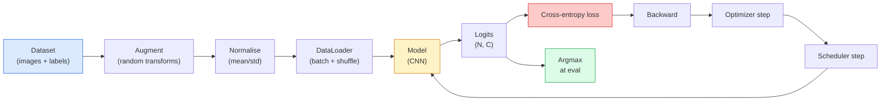

# Clasificación de imágenes

> Un clasificador es una función de píxeles a una distribución de probabilidades en clases.

**Type:** Build
**Languages:** Python
**Prerequisites:** Phase 2 Lesson 09 (Model Evaluation), Phase 3 Lesson 10 (Mini Framework), Phase 4 Lesson 03 (CNNs)
**Time:** ~75 minutes

## Objetivos de aprendizaje

- Construir una línea de clasificación de imágenes de extremo a extremo en el CIFAR-10: conjunto de datos, ampliación, modelo, ciclo de formación, evaluación
- Explicar el papel de cada componente (cargador de datos, pérdida, optimizador, programador, aumento) y predecir cómo se manifiesta la ruptura de cualquiera de ellos en la curva de pérdida
- Implementar mezcla, recorte y suavizamiento de etiquetas desde cero y justificar cuándo cada uno vale la pena añadir
- Leer una matriz de confusión y una tabla de precisión/recall por clase para diagnosticar fallas en los conjuntos de datos y modelos más allá de la precisión agregada

## El problema

Cada tarea de visión que se realiza se reduce a la clasificación de imágenes en algún nivel. La detección clasifica regiones. La segmentación clasifica píxeles. La recuperación se clasifica por similitud con los centros de clase.

La mayoría de los errores de clasificación no están en el modelo. Viven en la línea de la normalización: una normalización rota, un conjunto de capacitación sin cambios, un aumento que distorsiona las etiquetas, una división de validación contaminada por datos de capacitación, una tasa de aprendizaje que discrepa silenciosamente después de la época 30. Una CNN que alcanzara el 93% en CIFAR-10 con una configuración correcta normalmente obtiene un 70-75% con una rotura, y la curva de pérdida parece plausible todo el tiempo.

Esta lección conecta toda la tubería a mano para que cada pieza sea inspectable.`torchvision.datasets`que podría ocultar un insecto.

## El concepto

### El sistema de clasificación



Cada línea en este bucle es donde un insecto puede vivir.`model(x).softmax()`Las adiciones se aplican sólo a las entradas, no a las etiquetas  excepto para la mezcla, que mezcla ambas. `optimizer.zero_grad()`El error de aprendizaje se reduce a una velocidad de aprendizaje muy inestable, y cada uno de estos errores aplanan la curva de aprendizaje sin lanzar un error.

### Entropia cruzada, logits y softmax

Un clasificador produce `C`Los números por imagen llamados logits. Aplicando softmax los convierte en una distribución de probabilidades:

```
softmax(z)_i = exp(z_i) / sum_j exp(z_j)
```

La entropía cruzada mide la probabilidad de registro negativo de la clase correcta:

```
CE(z, y) = -log( softmax(z)_y )
        = -z_y + log( sum_j exp(z_j) )
```

La forma de la mano derecha es la estable numéricamente (log-sum-exp).`nn.CrossEntropyLoss`La aplicación de softmax por primera vez es casi siempre un error  se calcula log(softmax(softmax(z))), una cantidad sin sentido.

### Por qué funciona el aumento

Una CNN tiene un sesgo inductivo para la traducción (de la distribución de peso) pero no tiene una invarianza incorporada a los cultivos, voltapés, nerviosismo de color o oclusión. La única manera de enseñarle esas invariencias es mostrándole píxeles que las ejercen.

```
Original crop:  "dog facing left"
Flip:           "dog facing right"       <- same label, different pixels
Rotate(+15):    "dog, slight tilt"
Colour jitter:  "dog in warmer light"
RandomErasing:  "dog with patch missing"
```

La regla: el aumento debe conservar la etiqueta. El corte y la rotación en un dígito pueden convertir "6" en "9"; para ese conjunto de datos se utilizan rangos de rotación más pequeños y se escogen aumentos que respetan las invariencias específicas de dígitos.

### Mezcla y corte

El aumento ordinario transforma los píxeles pero mantiene las etiquetas unincorporadas. **Mixup**y **cutmix**rompe eso interpolar los dos.

```
Mixup:
  lambda ~ Beta(a, a)
  x = lambda * x_i + (1 - lambda) * x_j
  y = lambda * y_i + (1 - lambda) * y_j

Cutmix:
  paste a random rectangle of x_j into x_i
  y = area-weighted mix of y_i and y_j
```

Por qué ayuda: el modelo deja de memorizar objetivos espinosos y aprende a interpolar entre clases. La pérdida de entrenamiento aumenta, la precisión de las pruebas aumenta. Es la mejor actualización de robustez única más barata para cualquier clasificador.

### Limpiación de etiquetas

Un primo de la confusión.`[0, 0, 1, 0, 0]`, tren contra`[eps/C, eps/C, 1-eps, eps/C, eps/C]`para un pequeño `eps`El modelo de la producción de logits arbitrariamente afilados y mejora la calibración a casi ningún costo.`nn.CrossEntropyLoss(label_smoothing=0.1)`desde PyTorch 1.10.

### Evaluamiento más allá de la precisión

La precisión agregada oculta el desequilibrio. Un clasificador binario de 90-10 que siempre predice la clase mayoritaria obtiene un puntaje del 90%.

- **Per-class accuracy** un número por clase; inmediatamente aparece las categorías con menos resultados.
- **Confusion matrix** C x C cuya fila i col j = el recuento de la clase verdadera i predicho como clase j; la diagonal es correcta, las diagonales fuera de la línea son donde vive el modelo.
- **Top-1 / Top-5** si la clase correcta está en las predicciones de 1 o 5 principales; Top-5 importa para ImageNet porque clases como "Norwich terrier" vs "Norfolk terrier" son genuinamente ambigüas.
- **Calibration (ECE)**¿Se obtiene la predicción de confianza de 0,8 el 80% de las veces? las redes modernas son sistemáticamente demasiado seguras; fija con la escala de temperatura o el suavización de las etiquetas.

```figure
receptive-field
```

## Construye el mismo

### Paso 1: Un conjunto de datos sintéticos deterministas

CIFAR-10 vive en disco. Para hacer que esta lección sea reproducible y rápida construimos un conjunto de datos sintéticos que se parecen a imágenes CIFAR  32x32 RGB con estructura específica de clase que el modelo debe aprender.

```python
import numpy as np
import torch
from torch.utils.data import Dataset


def synthetic_cifar(num_per_class=1000, num_classes=10, seed=0):
    rng = np.random.default_rng(seed)
    X = []
    Y = []
    for c in range(num_classes):
        centre = rng.uniform(0, 1, (3,))
        freq = 2 + c
        for _ in range(num_per_class):
            yy, xx = np.meshgrid(np.linspace(0, 1, 32), np.linspace(0, 1, 32), indexing="ij")
            r = np.sin(xx * freq) * 0.5 + centre[0]
            g = np.cos(yy * freq) * 0.5 + centre[1]
            b = (xx + yy) * 0.5 * centre[2]
            img = np.stack([r, g, b], axis=-1)
            img += rng.normal(0, 0.08, img.shape)
            img = np.clip(img, 0, 1)
            X.append(img.astype(np.float32))
            Y.append(c)
    X = np.stack(X)
    Y = np.array(Y)
    idx = rng.permutation(len(X))
    return X[idx], Y[idx]


class ArrayDataset(Dataset):
    def __init__(self, X, Y, transform=None):
        self.X = X
        self.Y = Y
        self.transform = transform

    def __len__(self):
        return len(self.X)

    def __getitem__(self, i):
        img = self.X[i]
        if self.transform is not None:
            img = self.transform(img)
        img = torch.from_numpy(img).permute(2, 0, 1)
        return img, int(self.Y[i])
```

Cada clase obtiene su propia paleta de colores y patrón de frecuencia, más ruido gaussiano para obligar al modelo a aprender la señal en lugar de memorizar píxeles. Diez clases, mil imágenes cada una, permutadas.

### Paso 2: Normalización y ampliación

Los dos transforman que cada línea de visión tiene.

```python
def standardize(mean, std):
    mean = np.array(mean, dtype=np.float32)
    std = np.array(std, dtype=np.float32)
    def _fn(img):
        return (img - mean) / std
    return _fn


def random_hflip(p=0.5):
    def _fn(img):
        if np.random.random() < p:
            return img[:, ::-1, :].copy()
        return img
    return _fn


def random_crop(pad=4):
    def _fn(img):
        h, w = img.shape[:2]
        padded = np.pad(img, ((pad, pad), (pad, pad), (0, 0)), mode="reflect")
        y = np.random.randint(0, 2 * pad)
        x = np.random.randint(0, 2 * pad)
        return padded[y:y + h, x:x + w, :]
    return _fn


def compose(*fns):
    def _fn(img):
        for fn in fns:
            img = fn(img)
        return img
    return _fn
```

Reflejado-pad antes de cosecha, no cero-pad, porque las fronteras negras son una señal que el modelo aprendería a ignorar de una manera inútil.

### Paso 3: Mezcla

Mezcla dos imágenes y dos etiquetas dentro del paso de entrenamiento. Implementado como un lote de transformación para que viva junto al pase hacia adelante en lugar de dentro del conjunto de datos.

```python
def mixup_batch(x, y, num_classes, alpha=0.2):
    if alpha <= 0:
        return x, torch.nn.functional.one_hot(y, num_classes).float()
    lam = float(np.random.beta(alpha, alpha))
    idx = torch.randperm(x.size(0), device=x.device)
    x_mixed = lam * x + (1 - lam) * x[idx]
    y_onehot = torch.nn.functional.one_hot(y, num_classes).float()
    y_mixed = lam * y_onehot + (1 - lam) * y_onehot[idx]
    return x_mixed, y_mixed


def soft_cross_entropy(logits, soft_targets):
    log_probs = torch.log_softmax(logits, dim=-1)
    return -(soft_targets * log_probs).sum(dim=-1).mean()
```

`soft_cross_entropy`Se reduce a la habitual un-hot caso cuando el objetivo es exactamente un-hot.

### Paso 4: El ciclo de entrenamiento

La receta completa: un paso por los datos, gradientes una vez por lote, cronista paso una vez por época.

```python
import torch
import torch.nn as nn
from torch.utils.data import DataLoader
from torch.optim import SGD
from torch.optim.lr_scheduler import CosineAnnealingLR

def train_one_epoch(model, loader, optimizer, device, num_classes, use_mixup=True):
    model.train()
    total, correct, loss_sum = 0, 0, 0.0
    for x, y in loader:
        x, y = x.to(device), y.to(device)
        if use_mixup:
            x_m, y_soft = mixup_batch(x, y, num_classes)
            logits = model(x_m)
            loss = soft_cross_entropy(logits, y_soft)
        else:
            logits = model(x)
            loss = nn.functional.cross_entropy(logits, y, label_smoothing=0.1)
        optimizer.zero_grad()
        loss.backward()
        optimizer.step()
        loss_sum += loss.item() * x.size(0)
        total += x.size(0)
        # Training accuracy vs the un-mixed labels `y` is only an approximation
        # when mixup is on (the model saw soft targets, not y). Treat it as a
        # rough progress signal; rely on val accuracy for real performance.
        with torch.no_grad():
            pred = logits.argmax(dim=-1)
            correct += (pred == y).sum().item()
    return loss_sum / total, correct / total


@torch.no_grad()
def evaluate(model, loader, device, num_classes):
    model.eval()
    total, correct = 0, 0
    loss_sum = 0.0
    cm = torch.zeros(num_classes, num_classes, dtype=torch.long)
    for x, y in loader:
        x, y = x.to(device), y.to(device)
        logits = model(x)
        loss = nn.functional.cross_entropy(logits, y)
        pred = logits.argmax(dim=-1)
        for t, p in zip(y.cpu(), pred.cpu()):
            cm[t, p] += 1
        loss_sum += loss.item() * x.size(0)
        total += x.size(0)
        correct += (pred == y).sum().item()
    return loss_sum / total, correct / total, cm
```

Cinco invariantes que comprueba cada vez que escribe un ciclo de entrenamiento:

1. `model.train()`antes de la formación, `model.eval()`Antes de la evaluación  se desprende del comportamiento normal y de los lotes.
2. `.zero_grad()`antes de`.backward()`¿ Qué ?
3. `.item()`Cuando se acumulan métricas para que nada mantiene vivo el gráfico de cálculo.
4. `@torch.no_grad()`Durante la evaluación  ahorra memoria y tiempo, previene accidentes sutiles.
5. Argmax contra los logits crudos, no softmax  el mismo resultado, una operación menos.

### Paso 5: Ponlo juntos

Utilice el `TinyResNet`de la lección anterior, entrenar por algunas épocas, evaluar.

```python
from main import synthetic_cifar, ArrayDataset
from main import standardize, random_hflip, random_crop, compose
from main import mixup_batch, soft_cross_entropy
from main import train_one_epoch, evaluate
# TinyResNet comes from the previous lesson (03-cnns-lenet-to-resnet).
# Adjust the import path to wherever you stored the previous lesson's code.
from cnns_lenet_to_resnet import TinyResNet  # example placeholder

X, Y = synthetic_cifar(num_per_class=500)
split = int(0.9 * len(X))
X_train, Y_train = X[:split], Y[:split]
X_val, Y_val = X[split:], Y[split:]

mean = [0.5, 0.5, 0.5]
std = [0.25, 0.25, 0.25]
train_tf = compose(random_hflip(), random_crop(pad=4), standardize(mean, std))
eval_tf = standardize(mean, std)

train_ds = ArrayDataset(X_train, Y_train, transform=train_tf)
val_ds = ArrayDataset(X_val, Y_val, transform=eval_tf)

train_loader = DataLoader(train_ds, batch_size=128, shuffle=True, num_workers=0)
val_loader = DataLoader(val_ds, batch_size=256, shuffle=False, num_workers=0)

device = "cuda" if torch.cuda.is_available() else "cpu"
model = TinyResNet(num_classes=10).to(device)
optimizer = SGD(model.parameters(), lr=0.1, momentum=0.9, weight_decay=5e-4, nesterov=True)
scheduler = CosineAnnealingLR(optimizer, T_max=10)

for epoch in range(10):
    tr_loss, tr_acc = train_one_epoch(model, train_loader, optimizer, device, 10, use_mixup=True)
    va_loss, va_acc, _ = evaluate(model, val_loader, device, 10)
    scheduler.step()
    print(f"epoch {epoch:2d}  lr {scheduler.get_last_lr()[0]:.4f}  "
          f"train {tr_loss:.3f}/{tr_acc:.3f}  val {va_loss:.3f}/{va_acc:.3f}")
```

En el conjunto de datos sintético, esto llega a una precisión de validación casi perfecta dentro de cinco épocas, que es el punto: la tubería es correcta, el modelo puede aprender lo que es aprendizaje.

### Paso 6: Lea la matriz de confusión

La precisión por sí sola nunca te dice dónde está fallando el modelo.

```python
def print_confusion(cm, labels=None):
    c = cm.shape[0]
    labels = labels or [str(i) for i in range(c)]
    print(f"{'':>6}" + "".join(f"{l:>5}" for l in labels))
    for i in range(c):
        row = cm[i].tolist()
        print(f"{labels[i]:>6}" + "".join(f"{v:>5}" for v in row))
    print()
    tp = cm.diag().float()
    fp = cm.sum(dim=0).float() - tp
    fn = cm.sum(dim=1).float() - tp
    prec = tp / (tp + fp).clamp_min(1)
    rec = tp / (tp + fn).clamp_min(1)
    f1 = 2 * prec * rec / (prec + rec).clamp_min(1e-9)
    for i in range(c):
        print(f"{labels[i]:>6}  prec {prec[i]:.3f}  rec {rec[i]:.3f}  f1 {f1[i]:.3f}")

_, _, cm = evaluate(model, val_loader, device, 10)
print_confusion(cm)
```

Las filas son clases verdaderas, las columnas son predicciones. Un grupo de recuentos fuera de diagonales entre las clases 3 y 5 significa que el modelo confunde esas dos y le da un punto de partida para la recopilación de datos dirigidos o un aumento específico de la clase.

## Usalo

`torchvision`En el caso de un CIFAR-10 real, la línea completa es de cuatro líneas más un bucle de entrenamiento.

```python
from torchvision.datasets import CIFAR10
from torchvision.transforms import Compose, RandomCrop, RandomHorizontalFlip, ToTensor, Normalize

mean = (0.4914, 0.4822, 0.4465)
std = (0.2470, 0.2435, 0.2616)
train_tf = Compose([
    RandomCrop(32, padding=4, padding_mode="reflect"),
    RandomHorizontalFlip(),
    ToTensor(),
    Normalize(mean, std),
])
eval_tf = Compose([ToTensor(), Normalize(mean, std)])

train_ds = CIFAR10(root="./data", train=True,  download=True, transform=train_tf)
val_ds   = CIFAR10(root="./data", train=False, download=True, transform=eval_tf)
```

Dos cosas que hay que notar: la media/std es **dataset-specific** computado en el conjunto de capacitación CIFAR-10, no ImageNet  y el reflejo pad es la política de cultivo por defecto de la comunidad.

## Envío

Esta lección produce:

- `outputs/prompt-classifier-pipeline-auditor.md` una solicitud que revisa un guión de entrenamiento para las cinco invariantes anteriores y pone de manifiesto la primera violación.
- `outputs/skill-classification-diagnostics.md` una habilidad que, dada una matriz de confusión y una lista de nombres de clases, resume los fallos por clase y propone la solución única más impactante.

## Los ejercicios

1. **(Easy)**Explique por qué la pérdida de tren con mezcla es mayor pero la precisión de la val es similar o mejor.
2. **(Medium)**Implemente Cutout  cero un cuadrado aleatorio de 8x8 en cada imagen de entrenamiento  y ejecute una ablación vs no aumento, hflip+crop, hflip+crop+cutout, hflip+crop+mixup.
3. **(Hard)**Construir una línea de CIFAR-100 (100 clases, el mismo tamaño de entrada) y reproducir un entrenamiento ResNet-34 ejecutado con una precisión de menos del 1% de la publicada.

## Términos clave

| Term | What people say | What it actually means |
|------|----------------|----------------------|
| Logits | "Raw outputs" | The pre-softmax vector of C numbers per image; cross-entropy expects these, not softmaxed values |
| Cross-entropy | "The loss" | Negative log-probability of the correct class; combines log-softmax and NLL in one stable op |
| DataLoader | "The batcher" | Wraps a dataset with shuffling, batching, and (optional) multi-worker loading; gets blamed for half of training bugs |
| Augmentation | "Random transforms" | Any pixel-level transform at training time that preserves the label; teaches invariances the CNN does not have natively |
| Mixup / Cutmix | "Mix two images" | Blend both inputs and labels so the classifier learns smooth interpolations instead of hard boundaries |
| Label smoothing | "Softer targets" | Replace one-hot with (1-eps, eps/(C-1), ...); improves calibration and slightly boosts accuracy |
| Top-k accuracy | "Top-5" | The correct class is in the k highest-probability predictions; used on datasets with genuinely ambiguous classes |
| Confusion matrix | "Where errors live" | C x C table where entry (i, j) counts images of true class i predicted as j; diagonal is right, off-diagonal tells you what to fix |

## Leer más

- [CS231n: Training Neural Networks](https://cs231n.github.io/neural-networks-3/) todavía el recorrido más claro de la línea de formación en una sola página
- [Bag of Tricks for Image Classification (He et al., 2019)](https://arxiv.org/abs/1812.01187) cada pequeño truco que juntos añade 3-4% a la precisión de ResNet en ImageNet
- [mixup: Beyond Empirical Risk Minimization (Zhang et al., 2017)](https://arxiv.org/abs/1710.09412) el original de la mezcla de documentos; tres páginas de teoría más experimentos convincentes
- [Why temperature scaling matters (Guo et al., 2017)](https://arxiv.org/abs/1706.04599) el papel que demostró que las redes modernas están calibradas erróneamente y se fijó con un parámetro escalar
