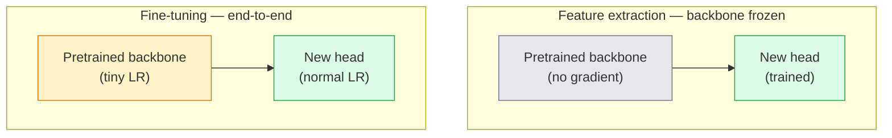

# Transferencia de aprendizaje y ajuste

> Alguien más pasó un millón de horas de GPU enseñando a una red cómo se ven los bordes, texturas y partes de objetos.

**Type:** Build
**Languages:** Python
**Prerequisites:** Phase 4 Lesson 03 (CNNs), Phase 4 Lesson 04 (Image Classification)
**Time:** ~75 minutes

## Objetivos de aprendizaje

- Distingue la extracción de características de la ajuste fino y elija la correcta en función del tamaño del conjunto de datos, la distancia del dominio y el presupuesto de cálculo
- Cargar una columna vertebral preentrenada, reemplazar su cabeza clasificadora y entrenar sólo la cabeza a una línea de base de trabajo en menos de 20 líneas
- Deshielo progresivo de capas con tasas de aprendizaje discriminatorias para que las características genéricas tempranas reciban actualizaciones más pequeñas que las tardías específicas de tareas
- Diagnóstico de los tres fallos comunes: la deriva de características de LR demasiado alto en bloques no congelados, BN estadísticas colapsar en pequeños conjuntos de datos, y el olvido catastrófico

## El problema

El entrenamiento de un ResNet-50 en ImageNet cuesta alrededor de 2.000 horas de GPU. Muy pocos equipos tienen ese presupuesto para cada tarea que envían. Lo que casi todos los equipos realmente envían es una columna vertebral preentrenada con una nueva cabeza entrenada en unos cientos o algunos miles de imágenes específicas de tareas.

Esto no es un atajo. El primer bloque de convección de cualquier CNN entrenado por ImageNet aprende bordes y filtros similares a Gabor. En los próximos bloques se aprenden texturas y motivos simples. Los bloques centrales aprenden partes de objetos. Los bloques finales aprenden combinaciones que comienzan a parecerse a las 1.000 categorías de ImageNet. El primer 90% de esa jerarquía se transfiere casi sin cambios a la imagen médica, la inspección industrial, los datos satelitales y todas las demás tareas de visión  porque la naturaleza tiene un vocabulario limitado de bordes y texturas. El último 10% es lo que realmente entrenas.

Para conseguir la transferencia correcta hay tres errores que te esperan: destruir características pre-entrenadas con una tasa de aprendizaje demasiado alta, dejar que el modelo de información se quede sin información congelada demasiado y dejar que las estadísticas de BatchNorm se deriven hacia un conjunto de datos diminuto del que el resto de la red nunca aprendió.

## El concepto

### Extracción de características frente a ajuste fino

Dos regímenes, elegidos por cuánto confías en las características preentrenadas y cuánto datos tienes.



Reglas de los pulgares:

| Dataset size | Domain distance | Recipe |
|--------------|-----------------|--------|
| < 1k images | close to ImageNet | Freeze backbone, train head only |
| 1k-10k | close | Freeze first 2-3 stages, fine-tune the rest |
| 10k-100k | any | Fine-tune end-to-end with discriminative LR |
| 100k+ | far | Fine-tune everything; consider training from scratch if domain is far enough |

"Closes to ImageNet" significa aproximadamente fotos naturales RGB con contenido similar a objetos. Las tomografías CT médicas, las imágenes satelitales y la microscopía están lejos de ser posibles.

### ¿Por qué el congelamiento funciona en absoluto?

La imagen de la red muestra que CNN aprende que no están especializados en las 1.000 categorías. Se especializan en las estadísticas de las imágenes naturales: bordes en orientaciones específicas, texturas, patrones de contraste, formas primitivas. Esas estadísticas son estables en casi todos los dominios visuales que un ser humano puede nombrar. Es por eso que un modelo entrenado en ImageNet y evaluado en CIFAR-10 con una nueva cabeza lineal (sin ajuste fino de la columna vertebral) alcanza una precisión de más del 80%. La cabeza está aprendiendo cuáles de las características ya aprendidas deben soportar para esta tarea.

### Taxas de aprendizaje discriminatorias

Cuando se descongela, las primeras capas deben entrenar más lentamente que las últimas capas. Las primeras capas codifican características genéricas que se quieren preservar; las últimas capas codifican la estructura específica de tareas que se necesita mover mucho.

```
Typical recipe:

  stage 0 (stem + first group): lr = base_lr / 100    (mostly fixed)
  stage 1:                       lr = base_lr / 10
  stage 2:                       lr = base_lr / 3
  stage 3 (last backbone group): lr = base_lr
  head:                          lr = base_lr  (or slightly higher)
```

En PyTorch esto es sólo una lista de grupos de parámetros pasados al optimizador.

### El problema de la norma de batch

Las capas de BN se mantienen`running_mean`y `running_var`Buffers que se calcularon en ImageNet. Si su tarea tiene una distribución de píxeles diferente  diferentes iluminación, sensor, espacio de colores diferentes  esos buffers están equivocados. Tres opciones en orden de preferencias:

1. **Fine-tune with BN in train mode.**Permítan que BN actualice sus estadísticas de ejecución junto con todo lo demás.
2. **Freeze BN in eval mode.**Mantenga las estadísticas de ImageNet y entrenar sólo los pesos.
3. **Replace BN with GroupNorm.**Elimina el problema de la media móvil por completo. Se utiliza en la detección y segmentación de la columna vertebral donde el tamaño de lote por GPU es pequeño.

Si se equivocan, el silencio aumenta la precisión en 5-15%.

### Diseño de la cabeza

La cabeza de clasificación es de 1-3 capas lineales más un abandono opcional.

```
backbone.fc = nn.Linear(backbone.fc.in_features, num_classes)          # ResNet
backbone.classifier[1] = nn.Linear(..., num_classes)                    # EfficientNet, MobileNet
backbone.heads.head = nn.Linear(..., num_classes)                       # torchvision ViT
```

Para los conjuntos de datos pequeños, una sola capa lineal suele ser suficiente. Agregar una capa oculta (Linear -> ReLU -> Dropout -> Linear) ayuda cuando la distribución de tareas está más lejos de la distribución de entrenamiento de la columna vertebral.

### Desintegración de las capas LR

Una versión más suave de LR discriminativo utilizado en el ajuste fino moderno (BEiT, DINOv2, ViT-B). En lugar de agrupar las capas en etapas, dar a cada capa una LR ligeramente menor que la que está encima de ella:

```
lr_layer_k = base_lr * decay^(L - k)
```

Con descomposición = 0,75 y L = 12 bloques de transformadores, los primeros bloques de trenes en `0.75^11 ≈ 0.04x`Es más importante para los transformeres de tono fino que para las CNN, donde los LR de grupo de escenario suelen ser suficientes.

### Qué evaluar

Las carreras de transferencia de aprendizaje necesitan dos números que no rastrearías en una carrera de rasguño:

- **Pretrained-only accuracy**La exactitud de la cabeza con la columna vertebral congelada.
- **Fine-tuned accuracy** el mismo modelo después de un entrenamiento de extremo a extremo.

Si el ajuste fino es menor que el pre-entrenado, tienes un error de aprendizaje o BN.

```figure
transfer-learning
```

## Construye el mismo

### Paso 1: Cargue una columna vertebral preentrenada y inspeccione

```python
import torch
import torch.nn as nn
from torchvision.models import resnet18, ResNet18_Weights

backbone = resnet18(weights=ResNet18_Weights.IMAGENET1K_V1)
print(backbone)
print()
print("classifier head:", backbone.fc)
print("feature dim:", backbone.fc.in_features)
```

`ResNet18`Tiene cuatro etapas (`layer1..layer4`) más un tallo y un`fc`Cada columna vertebral de clasificación de torchvision tiene una estructura análoga.

### Paso 2: Extracción de características  congelar todo, reemplazar la cabeza

```python
def make_feature_extractor(num_classes=10):
    model = resnet18(weights=ResNet18_Weights.IMAGENET1K_V1)
    for p in model.parameters():
        p.requires_grad = False
    model.fc = nn.Linear(model.fc.in_features, num_classes)
    return model

model = make_feature_extractor(num_classes=10)
trainable = sum(p.numel() for p in model.parameters() if p.requires_grad)
frozen = sum(p.numel() for p in model.parameters() if not p.requires_grad)
print(f"trainable: {trainable:>10,}")
print(f"frozen:    {frozen:>10,}")
```

Sólo .`model.fc`La columna vertebral es un extractor de características congeladas.

### Paso 3: ajuste discriminatorio

Una utilidad que construye grupos de parámetros con tasas de aprendizaje específicas de etapa.

```python
def discriminative_param_groups(model, base_lr=1e-3, decay=0.3):
    stages = [
        ["conv1", "bn1"],
        ["layer1"],
        ["layer2"],
        ["layer3"],
        ["layer4"],
        ["fc"],
    ]
    groups = []
    for i, names in enumerate(stages):
        lr = base_lr * (decay ** (len(stages) - 1 - i))
        params = [p for n, p in model.named_parameters()
                  if any(n.startswith(k) for k in names)]
        if params:
            groups.append({"params": params, "lr": lr, "name": "_".join(names)})
    return groups

model = resnet18(weights=ResNet18_Weights.IMAGENET1K_V1)
model.fc = nn.Linear(model.fc.in_features, 10)
for p in model.parameters():
    p.requires_grad = True

groups = discriminative_param_groups(model)
for g in groups:
    print(f"{g['name']:>10s}  lr={g['lr']:.2e}  params={sum(p.numel() for p in g['params']):>8,}")
```

`decay=0.3`significa que cada etapa de trenes se realiza al 30% de la velocidad del siguiente. `fc`¿ Qué pasa ?`base_lr`¿ Qué ?`layer4`¿ Qué pasa ?`0.3 * base_lr`¿ Qué ?`conv1`¿ Qué pasa ?`0.3^5 * base_lr ≈ 0.00243 * base_lr`Sonido extremo, empíricamente funciona.

### Paso 4: Manejo de lotesNormal

Ayuda a congelar las estadísticas de BN sin congelar sus pesos.

```python
def freeze_bn_stats(model):
    for m in model.modules():
        if isinstance(m, (nn.BatchNorm1d, nn.BatchNorm2d, nn.BatchNorm3d)):
            m.eval()
            for p in m.parameters():
                p.requires_grad = False
    return model
```

Llámenlo después de que se pongan .`model.train()`al comienzo de cada época.`model.train()`El sistema de formación de las capas de formación de las capas de formación de las capas de formación de las capas de formación de las capas de formación de las capas de formación de las capas de formación de las capas de formación de las capas de formación de las capas de formación de las capas de formación de las capas de formación de las capas de formación de las capas de formación de las capas de formación de las capas de formación de las capas de formación de las capas de formación de las capas de formación de las capas de formación de las capas de formación de las capas de formación de las capas de formación de las capas de formación de las capas de formación de las capas de formación de las capas de formación de las capas de formación de las capas de las capas de formación de las capas de formación de las capas de las capas de formación de las capas de las capas de formación de las capas de las capas de formación de las capas de las capas de formación de las capas de las capas de formación de las capas de las capas de las capas de formación de las capas de las capas de las capas de formación de las capas de las capas de las capas de las capas de formación de las capas de las capas de las capas de las capas de formación de las capas de las capas de las capas de las capas de las capas de las capas de las capas de las capas de las capas de las capas de las capas de las capas de las capas de las capas de las capas de las capas de las capas de las capas de las capas de las capas de las capas de las capas de las capas de las capas de las capas de las capas de las capas de las capas de las capas de las capas de las capas de las capas de las capas de las capas de las capas de las capas de las capas de las capas de las capas de las capas de las capas de las capas de las capas de las capas de las capas de las capas de las capas de las capas de las capas de las capas de las capas de las capas

### Paso 5: Un ciclo mínimo de ajuste fino de extremo a extremo

```python
from torch.optim import SGD
from torch.utils.data import DataLoader
from torch.optim.lr_scheduler import CosineAnnealingLR
import torch.nn.functional as F

def fine_tune(model, train_loader, val_loader, device, epochs=5, base_lr=1e-3, freeze_bn=False):
    model = model.to(device)
    groups = discriminative_param_groups(model, base_lr=base_lr)
    optimizer = SGD(groups, momentum=0.9, weight_decay=1e-4, nesterov=True)
    scheduler = CosineAnnealingLR(optimizer, T_max=epochs)

    for epoch in range(epochs):
        model.train()
        if freeze_bn:
            freeze_bn_stats(model)
        tr_loss, tr_correct, tr_total = 0.0, 0, 0
        for x, y in train_loader:
            x, y = x.to(device), y.to(device)
            logits = model(x)
            loss = F.cross_entropy(logits, y, label_smoothing=0.1)
            optimizer.zero_grad()
            loss.backward()
            optimizer.step()
            tr_loss += loss.item() * x.size(0)
            tr_total += x.size(0)
            tr_correct += (logits.argmax(-1) == y).sum().item()
        scheduler.step()

        model.eval()
        va_total, va_correct = 0, 0
        with torch.no_grad():
            for x, y in val_loader:
                x, y = x.to(device), y.to(device)
                pred = model(x).argmax(-1)
                va_total += x.size(0)
                va_correct += (pred == y).sum().item()
        print(f"epoch {epoch}  train {tr_loss/tr_total:.3f}/{tr_correct/tr_total:.3f}  "
              f"val {va_correct/va_total:.3f}")
    return model
```

Se necesitan cinco épocas con la receta anterior de CIFAR-10 `ResNet18-IMAGENET1K_V1`La cabeza sola se situaría en un 86% sin tocar la columna vertebral.

### Paso 6: Descongelamiento progresivo

Un calendario que descongela una etapa por época desde el final hasta el principio.

```python
def progressive_unfreeze_schedule(model):
    stages = ["layer4", "layer3", "layer2", "layer1"]
    yielded = set()

    def start():
        for p in model.parameters():
            p.requires_grad = False
        for p in model.fc.parameters():
            p.requires_grad = True

    def unfreeze(epoch):
        if epoch < len(stages):
            name = stages[epoch]
            yielded.add(name)
            for n, p in model.named_parameters():
                if n.startswith(name):
                    p.requires_grad = True
            return name
        return None

    return start, unfreeze
```

Llamé`start()`Una vez antes de la primera época.`unfreeze(epoch)`Reconstruir el optimizador cada vez que el conjunto de parámetros entrenables cambia, de lo contrario los parámetros congelados todavía retienen momentos almacenados que lo confunden.

## Usalo

Para la mayoría de las tareas reales,`torchvision.models`La maquinaria más pesada sobre la cuestión cuando se encuentran en los problemas que los valores predeterminados de la biblioteca no pueden solucionar.

```python
from torchvision.models import resnet50, ResNet50_Weights

model = resnet50(weights=ResNet50_Weights.IMAGENET1K_V2)
model.fc = nn.Linear(model.fc.in_features, num_classes)
optimizer = torch.optim.AdamW(model.parameters(), lr=1e-4, weight_decay=1e-4)
```

Otras dos incumplimientos de nivel de producción:

- `timm`Naves ~ 800 espinas de visión preentrenadas con una API consistente (`timm.create_model("resnet50", pretrained=True, num_classes=10)`Para cualquier tono fino más allá del zoológico torchvision, es el estándar.
- Para transformadores, `transformers.AutoModelForImageClassification.from_pretrained(name, num_labels=N)`se le da ViT / BEiT / DeiT con la misma semántica de carga que los modelos de texto.

## Envío

Esta lección produce:

- `outputs/prompt-fine-tune-planner.md` un prompt que selecciona la extracción de características vs progresiva vs ajuste fino de extremo a extremo basado en el tamaño del conjunto de datos, la distancia del dominio y el presupuesto de cálculo.
- `outputs/skill-freeze-inspector.md` una habilidad que, dada un modelo PyTorch, informa qué parámetros son entrenables, qué capas de BatchNorm están en modo eval y si el optimizador está realmente alimentándose con los parámetros entrenables.

## Los ejercicios

1. **(Easy)**Entrenamiento a `ResNet18`En el caso de las pruebas de detección de la velocidad de la sonda, el sistema de detección de la velocidad de la sonda puede ser utilizado como una sonda lineal (espina dorsal congelada) y como una sintética completa de la misma serie de datos CIFAR.
2. **(Medium)**Introducir un error a propósito: set `base_lr = 1e-1`En el escenario de la columna vertebral en lugar de la cabeza.`discriminative_param_groups`Registra el LR en el que cada etapa comienza a divergir.
3. **(Hard)**Tomar un conjunto de datos de imágenes médicas (por ejemplo, CheXpert-small, PatchCamelyon o HAM10000) y comparar tres regímenes: (a) la columna vertebral congelada + cabeza lineal preentrenada por ImageNet; (b) la formación de tono fino de extremo a extremo reentrenada por ImageNet; (c) el entrenamiento de rascado.

## Términos clave

| Term | What people say | What it actually means |
|------|----------------|----------------------|
| Feature extraction | "Freeze and train head" | Backbone parameters frozen, only the new classifier head receives gradient |
| Fine-tuning | "Retrain end-to-end" | All parameters trainable, usually with much smaller LR than scratch training |
| Discriminative LR | "Smaller LR for early layers" | Optimizer parameter groups where early-stage LR is a fraction of late-stage LR |
| Layer-wise LR decay | "Smooth LR gradient" | Per-layer LR multiplied by decay^(L - k); common in transformer fine-tunes |
| Catastrophic forgetting | "The model lost ImageNet" | A too-high LR overwrites pretrained features before the new task signal is learnt |
| BN statistics drift | "Running mean is wrong" | BatchNorm running_mean/var computed on a different distribution than the current task, silently hurting accuracy |
| Linear probe | "Frozen backbone + linear head" | Evaluation of pretrained features — accuracy of the best linear classifier on top of the frozen representation |
| Catastrophic collapse | "Everything predicts one class" | Happens when fine-tuning with an LR high enough to destroy features before gradients from the head can stabilise |

## Leer más

- [How transferable are features in deep neural networks? (Yosinski et al., 2014)](https://arxiv.org/abs/1411.1792) el papel que cuantifica la transferencia de características entre capas
- [Universal Language Model Fine-tuning (ULMFiT, Howard & Ruder, 2018)](https://arxiv.org/abs/1801.06146) la receta original de descongelación discriminativa LR / progresiva; las ideas se transfieren directamente a la visión
- [timm documentation](https://huggingface.co/docs/timm) la referencia para las espinas de visión modernas y los defectos precisos de ajuste fino con los que fueron entrenados
- [A Simple Framework for Linear-Probe Evaluation (Kornblith et al., 2019)](https://arxiv.org/abs/1805.08974) por qué importa la precisión de la sonda lineal y cómo reportarla correctamente
