# Detección de objetos  YOLO desde cero

> La detección es la clasificación más regresión, ejecutada en cada posición en un mapa de características, luego limpiada con supresión no máxima.

**Type:** Build
**Languages:** Python
**Prerequisites:** Phase 4 Lesson 03 (CNNs), Phase 4 Lesson 04 (Image Classification), Phase 4 Lesson 05 (Transfer Learning)
**Time:** ~75 minutes

## Objetivos de aprendizaje

- Explica el diseño de la cuadrícula y el anclaje que convierte la detección en un problema de predicción denso y especifique lo que significa cada número en el tensor de salida
- Computación de la intersección entre cajas y implementación de la supresión no máxima desde cero
- Construir una cabeza de estilo YOLO mínima en la parte superior de una columna vertebral preentrenada, incluyendo la clasificación, objetosidad y pérdidas de regresión de caja
- Lea una fila métrica de detección (precision@0.5, recall, mAP@0.5, mAP@0.5:0.95) y elija el botón que girar a continuación

## El problema

La clasificación dice "esta imagen es un perro". La detección dice "hay un perro en píxeles (112, 40, 280, 210), hay un gato en (400, 180, 560, 310), y nada más en el marco". Ese cambio estructural  que predice un número variable de cajas etiquetadas en lugar de una etiqueta por imagen  es de lo que depende todo sistema autónomo, todo producto de vigilancia, cada analizador de diseño de documentos y cada línea de visión de fábrica.

La detección es también donde cada cambio de ingeniería en la visión aparece de una vez. Se quieren cajas que son precisas (cabeza de regresión), se quiere la clase correcta para cada caja (cabeza de clasificación), se quiere que el modelo sabe cuando no hay nada para detectar (puntuación de objetividad), y se quiere exactamente una predicción por objeto real (suppresión no máxima). Si se pierde cualquiera de estos, la tubería o bien se pierde objetos, informa cajas alucinadas, o predice el mismo objeto quince veces en posiciones ligeramente diferentes.

YOLO (You Only Look Once, Redmon et al. 2016) fue el diseño que hizo todo esto en tiempo real haciéndolo con un solo paso hacia adelante de una red de conexión, y las mismas decisiones estructurales siguen siendo la columna vertebral de los detectores modernos (YOLOv8, YOLOv9, YOLO-NAS, RT-DETR).

## El concepto

### Detección como predicción densa

Un clasificador emite números C por imagen. Un detector de estilo YOLO emite.`(S x S x (5 + C))`números por imagen, donde S es el tamaño de la cuadrícula espacial.

```mermaid
flowchart LR
    IMG["Input 416x416 RGB"] --> BB["Backbone<br/>(ResNet, DarkNet, ...)"]
    BB --> FM["Feature map<br/>(C_feat, 13, 13)"]
    FM --> HEAD["Detection head<br/>(1x1 convs)"]
    HEAD --> OUT["Output tensor<br/>(13, 13, B * (5 + C))"]
    OUT --> DEC["Decode<br/>(grid + sigmoid + exp)"]
    DEC --> NMS["Non-max suppression"]
    NMS --> RESULT["Final boxes"]

    style IMG fill:#dbeafe,stroke:#2563eb
    style HEAD fill:#fef3c7,stroke:#d97706
    style NMS fill:#fecaca,stroke:#dc2626
    style RESULT fill:#dcfce7,stroke:#16a34a
```



Cada uno de los `S * S`las células de la cuadrícula predicen `B`Cajas. Para cada caja:

- 4 números describen la geometría: `tx, ty, tw, th`¿ Qué ?
- 1 es el puntaje de objetividad: "¿hay un objeto centrado en esta célula?"
- Los números C son probabilidades de clase.

Total por célula: `B * (5 + C)`. para VOC con `S=13, B=2, C=20`, eso es 50 números por célula.

### ¿Por qué las redes y los anclajes

La regresión simple predijo .`(x, y, w, h)`Para cada objeto como una coordenada absoluta. Eso es difícil para una red conve, porque traducir la imagen no debe traducir todas las predicciones por la misma cantidad  cada objeto está anclado espacialmente. La cuadrícula responde a esto asignando cada cuadro de verdad de base a la celda de la cuadrícula en la que cae su centro; sólo esa celda es responsable de ese objeto.

Los anclajes abordan un segundo problema. Un conv 3x3 no puede regresar fácilmente una caja de 500 píxeles de ancho de una célula de campo receptivo de 16 píxeles.`B`El modelo aprende a elegir el anclaje correcto y empujarlo en lugar de regredir desde la nada.

```
Anchor box priors (example for 416x416 input):

  small:   (30,  60)
  medium:  (75,  170)
  large:   (200, 380)

At each grid cell, every anchor emits (tx, ty, tw, th, obj, c_1, ..., c_C).
```

Los detectores modernos a menudo usan FPN con diferentes conjuntos de anclajes por resolución  pequeños anclajes en mapas de alta resolución superficiales, grandes anclajes en mapas de baja resolución profunda.

### Las predicciones de decodificación

El crudo`tx, ty, tw, th`no son coordenadas de caja; son objetivos de regresión que deben transformarse antes de la traza:

```
centre x  = (sigmoid(tx) + cell_x) * stride
centre y  = (sigmoid(ty) + cell_y) * stride
width     = anchor_w * exp(tw)
height    = anchor_h * exp(th)
```

`sigmoid`mantiene los desplazamientos del centro dentro de la celda. `exp`permite la escala de ancho libremente desde el anclaje sin un giro de señal. `stride`Este paso de decodificación es el mismo en todas las versiones de YOLO desde v2.

### El mismo

Metrica de similitud universal de detección entre dos cajas:

```
IoU(A, B) = area(A intersect B) / area(A union B)
```

IoU = 1 significa idéntico; IoU = 0 significa que no hay superposición. IoU entre la predicción y la caja de verdad fundamental es lo que decide si una predicción cuenta como una verdadera positiva (típicamente IoU >= 0,5).

### Represión no máxima

Una red de conexión entrenada en anclas adyacentes a menudo predice cajas superpuestas para el mismo objeto. NMS mantiene la predicción de mayor confianza y elimina cualquier otra predicción con IoU por encima de un umbral.

```
NMS(boxes, scores, iou_threshold):
    sort boxes by score descending
    keep = []
    while boxes not empty:
        pick the top-scoring box, add to keep
        remove every box with IoU > iou_threshold to the picked box
    return keep
```

El límite típico: 0,45 para la detección de objetos.`soft-NMS`¿ Qué ?`DIoU-NMS`, o aprender la supresión directamente (RT-DETR) pero el propósito estructural es el mismo.

### La pérdida

La pérdida de YOLO es tres pérdidas añadidas con pesas:

```
L = lambda_coord * L_box(pred, target, where obj=1)
  + lambda_obj   * L_obj(pred, 1,     where obj=1)
  + lambda_noobj * L_obj(pred, 0,     where obj=0)
  + lambda_cls   * L_cls(pred, target, where obj=1)
```

Las células sin objetos contribuyen sólo a la pérdida de objetos (enseñar al modelo a permanecer en silencio). `lambda_noobj`Es generalmente pequeño (~0,5) porque la gran mayoría de las células están vacías y de otra manera dominarían la pérdida total.

Las variantes modernas intercambian la pérdida de caja MSE por CIoU / DIoU (que optimizan directamente la UIO), utilizan la pérdida focal para el desequilibrio de clase y equilibran la objetividad con la pérdida focal de calidad.

### Metricas de detección

La precisión no se transfiere a la detección.

- **Precision@IoU=0.5** de las predicciones contadas como positivas, cuántas son realmente correctas.
- **Recall@IoU=0.5**¿Cuántos de los objetos reales encontramos?
- **AP@0.5** área de curva de recopilación de precisión en el umbral de UIO 0,5; un número por clase.
- **mAP@0.5:0.95** promedio de AP sobre los umbrales de UO 0,5, 0,55, ..., 0,95.

Reporte los cuatro. Un detector que es fuerte en mAP@0.5 pero débil en mAP@0.5:0.95 está localizando aproximadamente pero no con fuerza; fija con una mejor pérdida de regresión de caja. Un detector con alta precisión y bajo recuerdo es demasiado conservador; baja el umbral de confianza o aumenta el peso de objetividad.

```figure
object-detection-nms
```

## Construye el mismo

### Paso 1: IU

El caballo de trabajo de toda la lección.`(x1, y1, x2, y2)`el formato.

```python
import numpy as np

def box_iou(boxes_a, boxes_b):
    ax1, ay1, ax2, ay2 = boxes_a[:, 0], boxes_a[:, 1], boxes_a[:, 2], boxes_a[:, 3]
    bx1, by1, bx2, by2 = boxes_b[:, 0], boxes_b[:, 1], boxes_b[:, 2], boxes_b[:, 3]

    inter_x1 = np.maximum(ax1[:, None], bx1[None, :])
    inter_y1 = np.maximum(ay1[:, None], by1[None, :])
    inter_x2 = np.minimum(ax2[:, None], bx2[None, :])
    inter_y2 = np.minimum(ay2[:, None], by2[None, :])

    inter_w = np.clip(inter_x2 - inter_x1, 0, None)
    inter_h = np.clip(inter_y2 - inter_y1, 0, None)
    inter = inter_w * inter_h

    area_a = (ax2 - ax1) * (ay2 - ay1)
    area_b = (bx2 - bx1) * (by2 - by1)
    union = area_a[:, None] + area_b[None, :] - inter
    return inter / np.clip(union, 1e-8, None)
```

Retorna un `(N_a, N_b)`Matrix de IoU en par. Utilice contra una sola caja de verdad de base haciendo que una de las matrices forme`(1, 4)`¿ Qué ?

### Paso 2: Supresión no máxima

```python
def nms(boxes, scores, iou_threshold=0.45):
    order = np.argsort(-scores)
    keep = []
    while len(order) > 0:
        i = order[0]
        keep.append(i)
        if len(order) == 1:
            break
        rest = order[1:]
        ious = box_iou(boxes[[i]], boxes[rest])[0]
        order = rest[ious <= iou_threshold]
    return np.array(keep, dtype=np.int64)
```

Determinista,`O(N log N)`de la especie, y coincide con el comportamiento de `torchvision.ops.nms`en entradas idénticas.

### Paso 3: codificación y decodificación de cajas

Convertir entre las coordenadas de píxeles y el `(tx, ty, tw, th)`objetivos que la red realmente regresa.

```python
def encode(box_xyxy, cell_x, cell_y, stride, anchor_wh):
    x1, y1, x2, y2 = box_xyxy
    cx = 0.5 * (x1 + x2)
    cy = 0.5 * (y1 + y2)
    w = x2 - x1
    h = y2 - y1
    tx = cx / stride - cell_x
    ty = cy / stride - cell_y
    tw = np.log(w / anchor_wh[0] + 1e-8)
    th = np.log(h / anchor_wh[1] + 1e-8)
    return np.array([tx, ty, tw, th])


def decode(tx_ty_tw_th, cell_x, cell_y, stride, anchor_wh):
    tx, ty, tw, th = tx_ty_tw_th
    cx = (sigmoid(tx) + cell_x) * stride
    cy = (sigmoid(ty) + cell_y) * stride
    w = anchor_wh[0] * np.exp(tw)
    h = anchor_wh[1] * np.exp(th)
    return np.array([cx - w / 2, cy - h / 2, cx + w / 2, cy + h / 2])


def sigmoid(x):
    return 1.0 / (1.0 + np.exp(-x))
```

Prueba: codificar una caja y luego decodificar  debe volver a algo muy cerca del original (hasta que la sigmoide inversa no sea perfectamente invertible cuando `tx`no está en el rango possigmoide).

### Paso 4: Una cabeza de YOLO mínima

Una conformación 1x1 en un mapa de características, remodelación a `(B, S, S, num_anchors, 5 + C)`¿ Qué ?

```python
import torch
import torch.nn as nn

class YOLOHead(nn.Module):
    def __init__(self, in_c, num_anchors, num_classes):
        super().__init__()
        self.num_anchors = num_anchors
        self.num_classes = num_classes
        self.conv = nn.Conv2d(in_c, num_anchors * (5 + num_classes), kernel_size=1)

    def forward(self, x):
        n, _, h, w = x.shape
        y = self.conv(x)
        y = y.view(n, self.num_anchors, 5 + self.num_classes, h, w)
        y = y.permute(0, 3, 4, 1, 2).contiguous()
        return y
```

Forma de salida: `(N, H, W, num_anchors, 5 + C)`La última dimensión es válida .`[tx, ty, tw, th, obj, cls_0, ..., cls_{C-1}]`¿ Qué ?

### Paso 5: Asenamiento de la verdad fundamental

Para cada caja de verdad fundamental, decide cuál.`(cell, anchor)`es responsable.

```python
def assign_targets(boxes_xyxy, classes, anchors, stride, grid_size, num_classes):
    num_anchors = len(anchors)
    target = np.zeros((grid_size, grid_size, num_anchors, 5 + num_classes), dtype=np.float32)
    has_obj = np.zeros((grid_size, grid_size, num_anchors), dtype=bool)

    for box, cls in zip(boxes_xyxy, classes):
        x1, y1, x2, y2 = box
        cx, cy = 0.5 * (x1 + x2), 0.5 * (y1 + y2)
        gx, gy = int(cx / stride), int(cy / stride)
        bw, bh = x2 - x1, y2 - y1

        ious = np.array([
            (min(bw, aw) * min(bh, ah)) / (bw * bh + aw * ah - min(bw, aw) * min(bh, ah))
            for aw, ah in anchors
        ])
        best = int(np.argmax(ious))
        aw, ah = anchors[best]

        target[gy, gx, best, 0] = cx / stride - gx
        target[gy, gx, best, 1] = cy / stride - gy
        target[gy, gx, best, 2] = np.log(bw / aw + 1e-8)
        target[gy, gx, best, 3] = np.log(bh / ah + 1e-8)
        target[gy, gx, best, 4] = 1.0
        target[gy, gx, best, 5 + cls] = 1.0
        has_obj[gy, gx, best] = True
    return target, has_obj
```

La selección de anclaje es "mejor forma IoU con la verdad de la tierra"  un proxy barato que coincide con la asignación YOLOv2/v3. v5 y posteriores utilizan estrategias más sofisticadas (ajuste alineado con tareas, k dinámico) que refinan la misma idea.

### Paso 6: Las tres pérdidas

```python
def yolo_loss(pred, target, has_obj, lambda_coord=5.0, lambda_obj=1.0, lambda_noobj=0.5, lambda_cls=1.0):
    has_obj_t = torch.from_numpy(has_obj).bool()
    target_t = torch.from_numpy(target).float()

    # box-regression loss: only on cells with objects
    box_pred = pred[..., :4][has_obj_t]
    box_true = target_t[..., :4][has_obj_t]
    loss_box = torch.nn.functional.mse_loss(box_pred, box_true, reduction="sum")

    # objectness loss
    obj_pred = pred[..., 4]
    obj_true = target_t[..., 4]
    loss_obj_pos = torch.nn.functional.binary_cross_entropy_with_logits(
        obj_pred[has_obj_t], obj_true[has_obj_t], reduction="sum")
    loss_obj_neg = torch.nn.functional.binary_cross_entropy_with_logits(
        obj_pred[~has_obj_t], obj_true[~has_obj_t], reduction="sum")

    # classification loss on cells with objects
    cls_pred = pred[..., 5:][has_obj_t]
    cls_true = target_t[..., 5:][has_obj_t]
    loss_cls = torch.nn.functional.binary_cross_entropy_with_logits(
        cls_pred, cls_true, reduction="sum")

    total = (lambda_coord * loss_box
             + lambda_obj * loss_obj_pos
             + lambda_noobj * loss_obj_neg
             + lambda_cls * loss_cls)
    return total, {"box": loss_box.item(), "obj_pos": loss_obj_pos.item(),
                   "obj_neg": loss_obj_neg.item(), "cls": loss_cls.item()}
```

Cinco hiperparámetros que cada tutorial de YOLO codifica o borra.`lambda_coord=5, lambda_noobj=0.5`refleja el papel original YOLOv1 y sigue funcionando como un defecto razonable.

### Paso 7: Pipeline de interferencia

Decodificar la salida de cabeza en bruto, aplicar sigmoid/exp, umbral de objetividad y NMS.

```python
def postprocess(pred_tensor, anchors, stride, img_size, conf_threshold=0.25, iou_threshold=0.45):
    pred = pred_tensor.detach().cpu().numpy()
    grid_h, grid_w = pred.shape[1], pred.shape[2]
    num_anchors = len(anchors)

    boxes, scores, classes = [], [], []
    for gy in range(grid_h):
        for gx in range(grid_w):
            for a in range(num_anchors):
                tx, ty, tw, th, obj, *cls = pred[0, gy, gx, a]
                score = sigmoid(obj) * sigmoid(np.array(cls)).max()
                if score < conf_threshold:
                    continue
                cls_idx = int(np.argmax(cls))
                cx = (sigmoid(tx) + gx) * stride
                cy = (sigmoid(ty) + gy) * stride
                w = anchors[a][0] * np.exp(tw)
                h = anchors[a][1] * np.exp(th)
                boxes.append([cx - w / 2, cy - h / 2, cx + w / 2, cy + h / 2])
                scores.append(float(score))
                classes.append(cls_idx)

    if not boxes:
        return np.zeros((0, 4)), np.zeros((0,)), np.zeros((0,), dtype=int)
    boxes = np.array(boxes)
    scores = np.array(scores)
    classes = np.array(classes)
    keep = nms(boxes, scores, iou_threshold)
    return boxes[keep], scores[keep], classes[keep]
```

Ese es el camino de evaluación completo: cabeza -> decodificación -> umbral -> NMS.

## Usalo

`torchvision.models.detection`El modelo de carga de un modelo pre-entrenado requiere tres líneas.

```python
import torch
from torchvision.models.detection import fasterrcnn_resnet50_fpn_v2

model = fasterrcnn_resnet50_fpn_v2(weights="DEFAULT")
model.eval()
with torch.no_grad():
    predictions = model([torch.randn(3, 400, 600)])
print(predictions[0].keys())
print(f"boxes:  {predictions[0]['boxes'].shape}")
print(f"scores: {predictions[0]['scores'].shape}")
print(f"labels: {predictions[0]['labels'].shape}")
```

Para las tuberías de inferencia en tiempo real,`ultralytics`(YOLOv8/v9) es la norma: `from ultralytics import YOLO; model = YOLO('yolov8n.pt'); model(img)`. El modelo maneja el decodificación y el NMS internamente y devuelve lo mismo `boxes / scores / labels`triple que construiste arriba.

## Envío

Esta lección produce:

- `outputs/prompt-detection-metric-reader.md` un aviso que gira un `precision, recall, AP, mAP@0.5:0.95`en un diagnóstico de una línea y el siguiente experimento más útil.
- `outputs/skill-anchor-designer.md` una habilidad que, dada una serie de datos de cajas de verdad fundamental, ejecuta k-medios en `(w, h)`y devuelve conjuntos de anclajes por nivel FPN más las estadísticas de cobertura que necesita para elegir el número correcto de anclajes.

## Los ejercicios

1. **(Easy)**Implementación `box_iou`y correr contra .`torchvision.ops.box_iou`Verifique si la diferencia absoluta máxima es inferior.`1e-6`¿ Qué ?
2. **(Medium)**Puerto `yolo_loss`a una versión que utiliza `CIoU`En un conjunto de datos sintéticos de 100 imágenes, muestra que la CIoU converge a un mAP@0.5:0.95 final mejor que la MSE en el mismo número de épocas.
3. **(Hard)**Implemente inferencia a múltiples escalas: alimenta la misma imagen a tres resoluciones a través del modelo, une las predicciones de la caja y ejecuta un solo NMS al final. Mide la inferencia a escala única en un conjunto prolongado.

## Términos clave

| Term | What people say | What it actually means |
|------|----------------|----------------------|
| Anchor | "Box prior" | A pre-defined box shape at each grid cell from which the network predicts deltas instead of absolute coordinates |
| IoU | "Overlap" | Intersection-over-union of two boxes; the universal similarity measure in detection |
| NMS | "Deduplicate" | Greedy algorithm that keeps highest-score predictions and removes overlapping ones above a threshold |
| Objectness | "Is there something here" | Per-anchor, per-cell scalar predicting whether an object is centred in that cell |
| Grid stride | "Downsample factor" | Pixels per grid cell; a 416-px input with a 13-grid head has stride 32 |
| mAP | "Mean average precision" | Average of the area under the precision-recall curve, averaged over classes and (for COCO) IoU thresholds |
| AP@0.5 | "PASCAL VOC AP" | Average precision with IoU threshold 0.5; the lenient version of the metric |
| mAP@0.5:0.95 | "COCO AP" | Average over IoU thresholds 0.5..0.95 step 0.05; the strict version and current community standard |

## Leer más

- [YOLOv1: You Only Look Once (Redmon et al., 2016)](https://arxiv.org/abs/1506.02640) el papel de fundación; cada YOLO desde entonces es un refinamiento de esta estructura
- [YOLOv3 (Redmon & Farhadi, 2018)](https://arxiv.org/abs/1804.02767) el papel que introdujo cabezas de estilo FPN a múltiples escalas; todavía el diagrama más claro
- [Ultralytics YOLOv8 docs](https://docs.ultralytics.com) la referencia de producción actual; cubre los formatos de los conjuntos de datos, los complementos, las recetas de formación
- [The Illustrated Guide to Object Detection (Jonathan Hui)](https://jonathan-hui.medium.com/object-detection-series-24d03a12f904) mejor recorrido en inglés simple por el zoológico de detectores completos; invaluable para entender cómo se relacionan DETR, RetinaNet, FCOS y YOLO
