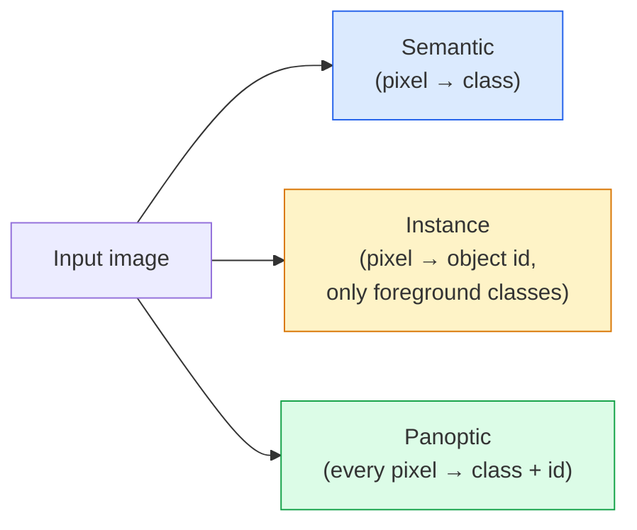
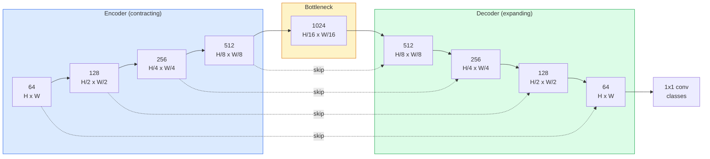

# Segmentación semántica  U-Net

> La segmentación es la clasificación en cada píxel. U-Net hace que funcione emparejando un codificador de muestreo descendente con un decodificador de muestreo ascendente y cableando las conexiones entre ellas.

**Type:** Build
**Languages:** Python
**Prerequisites:** Phase 4 Lesson 03 (CNNs), Phase 4 Lesson 04 (Image Classification)
**Time:** ~75 minutes

## Objetivos de aprendizaje

- Distinguir la segmentación semántica, instancia y panóptica y elegir la tarea correcta para un problema dado
- Construir una U-Net desde cero en PyTorch con bloques de codificación, un cuello de botella, un decodificador con convoluciones transpuestas, y saltar conexiones
- Implementar pixel-wise cross-entropy, pérdida de dados, y la pérdida combinada que es el defecto actual para la segmentación médica e industrial
- Lea las métricas de IoU y Dice por clase y diagnostique si una mala puntuación proviene de un recuerdo de objetos pequeños, precisión de límites o desequilibrio de clase

## El problema

La clasificación da una etiqueta por imagen. La detección da una puesta de cuadros por imagen. La segmentación da una etiqueta por píxel. Para una entrada de tamaño `H x W`, la salida es un tensor de forma `H x W`(semántica) o `H x W x N_instances`Eso son millones de predicciones por imagen, no una sola.

La estructura de la segmentación es la razón por la que impulsa casi todos los productos de visión de predicción densa: imágenes médicas (máscaras tumorales), conducción autónoma (calzada, carril, obstáculo), satélite (huellas de edificios, límites de cultivos), análisis de documentos (zonas de diseño), robótica (regiones agarrables). Ninguna de esas tareas se puede resolver colocando una caja alrededor del objeto; necesitan la silueta exacta.

El problema arquitectónico es simple de decir y no simple de resolver: necesitas la red para ver el contexto global de una imagen (qué tipo de escena es esta) y el detalle de píxel local (que píxel es exactamente carretera vs pavimento) simultáneamente. Una CNN estándar comprime espacialmente para obtener contexto, lo que arroja el detalle. U-Net fue el diseño que obtuvo ambos.

## El concepto

### Semántica vs instancia vs panóptica



- **Semantic**dice "este píxel es carretera, ese píxel es coche". Dos coches uno al lado del otro se derrumban en una sola mancha.
- **Instance**dice "este píxel es el coche #3, ese píxel es el coche #5." Ignora las cosas de fondo ("cosas" = cielo, carretera, césped).
- **Panoptic**unifica ambos: cada píxel obtiene una etiqueta de clase, cada instancia obtiene un ID único, cosas y cosas ambos segmentados.

Esta lección abarca la semántica. La siguiente lección (Máscara R-CNN) abarca la instancia.

### La forma de la red



El codificador reduce a la mitad la resolución espacial cuatro veces y duplica los canales. El decodificador inverte: duplica la resolución espacial cuatro veces y media los canales. Las conexiones de salto concatenan características de codificador coincidentes con características de decodificador en cada resolución. Los mapas finales de 1x1 conv `64 -> num_classes`en plena resolución.

Por qué las conexiones de salto son necesarias: el decodificador ha visto sólo pequeños mapas de características para el momento en que intenta emitir predicciones a nivel de píxeles. Sin los saltos no puede localizar los bordes con precisión porque esa información se comprimió en el codificador.

### Transpuesto vs muestra ascendente bilinear

El decodificador tiene que ampliar las dimensiones espaciales.

- **Transposed convolution**(El artículo`nn.ConvTranspose2d` muestra de aprendizaje. U-Net histórico predeterminado. Puede producir artefactos de tablero de ajedrez si el paso y el tamaño del núcleo no se dividen uniformemente.
- **Bilinear upsample + 3x3 conv** un modelo de montaje liso seguido de un conv. Menos artefactos, menos parámetros, ahora el estándar moderno.

Para una primera U-Net, bilinear es más seguro.

### Entropia cruzada en una cuadrícula de píxeles

Para la segmentación semántica con clases C, la salida del modelo es `(N, C, H, W)`El objetivo es`(N, H, W)`La entropía cruzada es idéntica al caso de clasificación, sólo aplicada en cada posición espacial:

```
Loss = mean over (n, h, w) of -log( softmax(logits[n, :, h, w])[target[n, h, w]] )
```

`F.cross_entropy`PyTorch maneja esta forma de forma nativa.

### La pérdida de dados y por qué la necesitas

La entropía cruzada trata todos los píxeles de manera igual. Eso es incorrecto cuando una clase domina el marco (imagen médica: 99% de fondo, 1% de tumor).

La pérdida de dados resuelve esto optimizando directamente la superposición entre la máscara predicha y la verdadera:

```
Dice(p, y) = 2 * sum(p * y) / (sum(p) + sum(y) + epsilon)
Dice_loss = 1 - Dice
```

donde`p`es el mapa de probabilidad sigmoide/softmax para una clase y `y`La pérdida es cero sólo cuando la superposición es perfecta. Porque está basada en la relación, el desequilibrio de clase es irrelevante.

En la práctica, utilice el **combined loss**¿Qué es esto ?

```
L = L_cross_entropy + lambda * L_dice       (lambda ~ 1)
```

La entropía cruzada da gradientes estables al principio del entrenamiento; Dice centra la cola del entrenamiento en coincidir realmente con la forma de la máscara. Esta combinación es el estándar de imagen médica y difícil de superar en cualquier conjunto de datos desequilibrado de clase.

### Metricas de evaluación

- **Pixel accuracy**% de píxeles predicho correctamente. Baratos. Se rompen en datos desequilibrados por la misma razón que la precisión en la clasificación.
- **IoU per class** intersección entre la unión de cada clase de máscara; promedio entre las clases = mIoU.
- **Dice (F1 on pixels)** similar a IoU; `Dice = 2 * IoU / (1 + IoU)`La imagen médica prefiere los diés, la comunidad de conductores prefiere la IoU; están monótona.
- **Boundary F1** mide la proximidad de los límites previstos a los límites de la realidad del terreno, penalizando incluso pequeños cambios.

La media de la UIE oculta una clase en 15% cuando otras nueve en 85%.

### Compromiso de resolución de entrada

El codificador de U-Net reduce la resolución a la mitad cuatro veces, por lo que la entrada debe ser divisible por 16. Las imágenes médicas son a menudo 512x512 o 1024x1024.`H * W * C_max`, y en 1024x1024 con 1024 canales de cuello de botella el pase hacia adelante ya utiliza gigabytes de VRAM.

Dos soluciones estándar:
1. Tela la entrada  proceso 256x256 azulejos con superposición y costura.
2. Reemplazar el cuello de botella con convulsiones dilatadas que mantienen una resolución espacial más alta pero amplían el campo receptivo (la familia DeepLab).

Para un primer modelo, una entrada de 256x256 con una U-Net de base de 64 canales se transmite cómodamente en 8 GB de VRAM.

```figure
segmentation-flood
```

## Construye el mismo

### Paso 1: Bloqueo de codificación

Dos convases 3x3 con norma de lote y ReLU.

```python
import torch
import torch.nn as nn
import torch.nn.functional as F

class DoubleConv(nn.Module):
    def __init__(self, in_c, out_c):
        super().__init__()
        self.net = nn.Sequential(
            nn.Conv2d(in_c, out_c, kernel_size=3, padding=1, bias=False),
            nn.BatchNorm2d(out_c),
            nn.ReLU(inplace=True),
            nn.Conv2d(out_c, out_c, kernel_size=3, padding=1, bias=False),
            nn.BatchNorm2d(out_c),
            nn.ReLU(inplace=True),
        )

    def forward(self, x):
        return self.net(x)
```

Este bloque se reutiliza en todo.`bias=False`porque la beta de BN maneja el sesgo.

### Paso 2: Bloques hacia abajo y hacia arriba

```python
class Down(nn.Module):
    def __init__(self, in_c, out_c):
        super().__init__()
        self.net = nn.Sequential(
            nn.MaxPool2d(2),
            DoubleConv(in_c, out_c),
        )

    def forward(self, x):
        return self.net(x)


class Up(nn.Module):
    def __init__(self, in_c, out_c):
        super().__init__()
        self.up = nn.Upsample(scale_factor=2, mode="bilinear", align_corners=False)
        self.conv = DoubleConv(in_c, out_c)

    def forward(self, x, skip):
        x = self.up(x)
        if x.shape[-2:] != skip.shape[-2:]:
            x = F.interpolate(x, size=skip.shape[-2:], mode="bilinear", align_corners=False)
        x = torch.cat([skip, x], dim=1)
        return self.conv(x)
```

El control de forma sólo espacial (`shape[-2:]`) maneja entradas cuyas dimensiones no son divisible por 16; una caja fuerte `F.interpolate`La comparación de la forma completa también desencadenaría diferencias en el número de canales, lo que debería ser un error fuerte, no un interpolado silencioso.

### Paso 3: La red de Internet

```python
class UNet(nn.Module):
    def __init__(self, in_channels=3, num_classes=2, base=64):
        super().__init__()
        self.inc = DoubleConv(in_channels, base)
        self.d1 = Down(base, base * 2)
        self.d2 = Down(base * 2, base * 4)
        self.d3 = Down(base * 4, base * 8)
        self.d4 = Down(base * 8, base * 16)
        self.u1 = Up(base * 16 + base * 8, base * 8)
        self.u2 = Up(base * 8 + base * 4, base * 4)
        self.u3 = Up(base * 4 + base * 2, base * 2)
        self.u4 = Up(base * 2 + base, base)
        self.outc = nn.Conv2d(base, num_classes, kernel_size=1)

    def forward(self, x):
        x1 = self.inc(x)
        x2 = self.d1(x1)
        x3 = self.d2(x2)
        x4 = self.d3(x3)
        x5 = self.d4(x4)
        x = self.u1(x5, x4)
        x = self.u2(x, x3)
        x = self.u3(x, x2)
        x = self.u4(x, x1)
        return self.outc(x)

net = UNet(in_channels=3, num_classes=2, base=32)
x = torch.randn(1, 3, 256, 256)
print(f"output: {net(x).shape}")
print(f"params: {sum(p.numel() for p in net.parameters()):,}")
```

Forma de salida `(1, 2, 256, 256)` el mismo tamaño espacial que la entrada, `num_classes`Los canales. unos 7,7M de parámetros en`base=32`¿ Qué ?

### Paso 4: pérdidas

```python
def dice_loss(logits, targets, num_classes, eps=1e-6):
    probs = F.softmax(logits, dim=1)
    targets_one_hot = F.one_hot(targets, num_classes).permute(0, 3, 1, 2).float()
    dims = (0, 2, 3)
    intersection = (probs * targets_one_hot).sum(dim=dims)
    denom = probs.sum(dim=dims) + targets_one_hot.sum(dim=dims)
    dice = (2 * intersection + eps) / (denom + eps)
    return 1 - dice.mean()


def combined_loss(logits, targets, num_classes, lam=1.0):
    ce = F.cross_entropy(logits, targets)
    dc = dice_loss(logits, targets, num_classes)
    return ce + lam * dc, {"ce": ce.item(), "dice": dc.item()}
```

Los dados se calculan por clase y luego se promedian (macro dados).`eps`evita la división por cero en las clases ausentes del lote.

### Paso 5: Metrica de la UIE

```python
@torch.no_grad()
def iou_per_class(logits, targets, num_classes):
    preds = logits.argmax(dim=1)
    ious = torch.zeros(num_classes)
    for c in range(num_classes):
        pred_c = (preds == c)
        true_c = (targets == c)
        inter = (pred_c & true_c).sum().float()
        union = (pred_c | true_c).sum().float()
        ious[c] = (inter / union) if union > 0 else torch.tensor(float("nan"))
    return ious
```

Retorna un vector de longitud C. `nan`Las clases ausentes del lote  no tienen un promedio sobre las que se calculan en mIoU.

### Paso 6: conjunto de datos sintéticos para la verificación de extremo a extremo

Generar formas en fondos de colores para que la red tenga que aprender forma, no color de píxel.

```python
import numpy as np
from torch.utils.data import Dataset, DataLoader

def synthetic_segmentation(num_samples=200, size=64, seed=0):
    rng = np.random.default_rng(seed)
    images = np.zeros((num_samples, size, size, 3), dtype=np.float32)
    masks = np.zeros((num_samples, size, size), dtype=np.int64)
    for i in range(num_samples):
        bg = rng.uniform(0, 1, (3,))
        images[i] = bg
        masks[i] = 0
        num_shapes = rng.integers(1, 4)
        for _ in range(num_shapes):
            cls = int(rng.integers(1, 3))
            color = rng.uniform(0, 1, (3,))
            cx, cy = rng.integers(10, size - 10, size=2)
            r = int(rng.integers(4, 12))
            yy, xx = np.meshgrid(np.arange(size), np.arange(size), indexing="ij")
            if cls == 1:
                mask = (xx - cx) ** 2 + (yy - cy) ** 2 < r ** 2
            else:
                mask = (np.abs(xx - cx) < r) & (np.abs(yy - cy) < r)
            images[i][mask] = color
            masks[i][mask] = cls
        images[i] += rng.normal(0, 0.02, images[i].shape)
        images[i] = np.clip(images[i], 0, 1)
    return images, masks


class SegDataset(Dataset):
    def __init__(self, images, masks):
        self.images = images
        self.masks = masks

    def __len__(self):
        return len(self.images)

    def __getitem__(self, i):
        img = torch.from_numpy(self.images[i]).permute(2, 0, 1).float()
        mask = torch.from_numpy(self.masks[i]).long()
        return img, mask
```

Tres clases: fondo (0), círculos (1), cuadrados (2). La red debe aprender a distinguir la forma.

### Paso 7: Ciclo de entrenamiento

```python
def train_one_epoch(model, loader, optimizer, device, num_classes):
    model.train()
    loss_sum, total = 0.0, 0
    iou_sum = torch.zeros(num_classes)
    for x, y in loader:
        x, y = x.to(device), y.to(device)
        logits = model(x)
        loss, _ = combined_loss(logits, y, num_classes)
        optimizer.zero_grad()
        loss.backward()
        optimizer.step()
        loss_sum += loss.item() * x.size(0)
        total += x.size(0)
        iou_sum += iou_per_class(logits, y, num_classes).nan_to_num(0)
    return loss_sum / total, iou_sum / len(loader)
```

Ejecutar esto durante 10 a 30 épocas en el conjunto de datos sintéticos y ver mIoU subir más allá de 0,9 para las clases de forma.`nan_to_num(0)`trata como cero las clases ausentes de un lote; para la UIE exacta por clase, máscara por presencia y uso `torch.nanmean`en los lotes en el momento de la evaluación en lugar de promediar aquí.

## Usalo

Para la producción, `segmentation_models_pytorch`("smp") envuelve cada arquitectura de segmentación estándar con cualquier visión de torcha o columna vertebral de timm. Tres líneas:

```python
import segmentation_models_pytorch as smp

model = smp.Unet(
    encoder_name="resnet34",
    encoder_weights="imagenet",
    in_channels=3,
    classes=3,
)
```

También vale la pena saber para el trabajo real:
- **DeepLabV3+**sustituye el muestreo de abajo basado en el máximo pool por conectores dilatados para que el cuello de botella mantenga la resolución; límites más rápidos en los datos de satélite y de conducción.
- **SegFormer**el código de conversión de la conexión se sustituye por un transformador jerárquico; SOTA actual en muchos puntos de referencia.
- **Mask2Former**- ¿ Qué ?**OneFormer**unificar la segmentación semántica, instancia y panóptica en una sola arquitectura.

Los tres son reemplazos de entrega en .`smp`o `transformers`con el mismo cargador de datos.

## Envío

Esta lección produce:

- `outputs/prompt-segmentation-task-picker.md` un prompt que escoge entre la segmentación semántica, instancia y panóptica y nombra la arquitectura para una tarea dada.
- `outputs/skill-segmentation-mask-inspector.md` una habilidad que informa sobre la distribución de clases, las estadísticas de máscaras predichas y las clases que son sub-predecidas o borrosas.

## Los ejercicios

1. **(Easy)**Implementación `bce_dice_loss`Para una tarea de segmentación binaria (frontejo vs fondo). Verifique en un conjunto de datos sintético de dos clases que la pérdida combinada converge más rápido que BCE solo cuando el primer plano es del 5% de píxeles.
2. **(Medium)**Reemplazar el `nn.Upsample + conv`bloque superior con un `nn.ConvTranspose2d`En el caso de los datos de la versión transpuesta, observe dónde aparecen los artefactos de tablero de ajedrez.
3. **(Hard)**Tome un conjunto de datos de segmentación real (Pets de Oxford-IIIT, mini split de Cityscapes o un subconjunto médico) y entrenar la U-Net a dentro de 2 puntos de la UU de la red.`smp.Unet`Se debe informar de la UIO por clase y identificar qué clases se benefician más de añadir los dados a la pérdida.

## Términos clave

| Term | What people say | What it actually means |
|------|----------------|----------------------|
| Semantic segmentation | "Label every pixel" | Per-pixel classification into C classes; instances of the same class merge |
| Instance segmentation | "Label every object" | Separates distinct instances of the same class; foreground-only |
| Panoptic segmentation | "Semantic + instance" | Every pixel gets a class; every thing instance also gets a unique id |
| Skip connection | "U-Net bridge" | Concatenation of encoder features into matching-resolution decoder features; preserves high-frequency detail |
| Transposed conv | "Deconvolution" | Learnable upsampling; can produce checkerboard artifacts |
| Dice loss | "Overlap loss" | 1 - 2|A ∩ B| / (|A| + |B|); optimises mask overlap directly and is robust to class imbalance |
| mIoU | "Mean intersection over union" | Average IoU across classes; the community-standard metric for segmentation |
| Boundary F1 | "Boundary accuracy" | F1 score computed on boundary pixels only; matters for precision-critical tasks |

## Leer más

- [U-Net: Convolutional Networks for Biomedical Image Segmentation (Ronneberger et al., 2015)](https://arxiv.org/abs/1505.04597) el papel original; la figura que todos copian está en la página 2
- [Fully Convolutional Networks (Long et al., 2015)](https://arxiv.org/abs/1411.4038) el papel que primero hizo de la segmentación un problema de con-
- [segmentation_models_pytorch](https://github.com/qubvel/segmentation_models.pytorch) la referencia para la segmentación de la producción; cada arquitectura estándar más cada pérdida estándar
- [Lessons learned from training SOTA segmentation (kaggle.com competitions)](https://www.kaggle.com/code/iafoss/carvana-unet-pytorch) una descripción de por qué TTA, pseudoetiquetado y pesos de clase importan en datos reales
