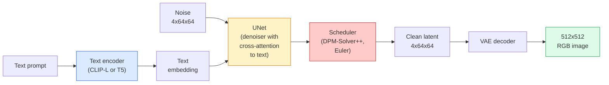

# Difusión estable  Arquitectura y ajuste fino

> La difusión estable es un DDPM que se ejecuta en el espacio latente de un VAE preentrenado, condicionado en texto a través de la atención cruzada, muestrado con un solvente ODE determinista rápido y guiado por una guía libre de clasificador.

**Type:** Learn + Use
**Languages:** Python
**Prerequisites:** Phase 4 Lesson 10 (Diffusion), Phase 7 Lesson 02 (Self-Attention)
**Time:** ~75 minutes

## Objetivos de aprendizaje

- Trazar las cinco piezas de un flujo de difusión estable: VAE, codificador de texto, U-Net, programador, verificador de seguridad y lo que cada uno de ellos realmente hace
- Explica la difusión latente y por qué el entrenamiento en un espacio latente 4x64x64 (en lugar de una imagen 3x512x512) reduce la computación en 48 veces sin pérdida de calidad
- Usar`diffusers`para generar imágenes, ejecutar imágenes a imágenes, pinturas y generación guiada por ControlNet
- Disfusión estable de ajuste fino con LoRA en un pequeño conjunto de datos personalizado y carga el adaptador LoRA a la inferencia

## El problema

El entrenamiento de un DDPM directamente en imágenes RGB 512x512 es caro. Cada paso de entrenamiento se retrocede a través de una red que ve 3x512x512 = 786,432 valores de entrada, y el muestreo toma 50+ pasos hacia adelante a través de esa misma red. En el nivel de calidad de la difusión estable 1.5 (lanzado en 2022), la difusión del espacio de píxeles necesitaría aproximadamente 256 meses de capacitación de GPU y 10-30 segundos por imagen en una GPU de consumo.

El truco que hizo práctico el texto a imagen de peso abierto fue**latent diffusion**(Rombach et al., CVPR 2022). Entrenar un VAE que mapea una imagen 3x512x512 a un tensor latente 4x64x64 y hacia atrás, luego hacer la difusión en ese espacio latente.`(3*512*512)/(4*64*64) = 48x`La muestreo cae de decenas de segundos a menos de dos segundos en la misma GPU.

Casi todos los modelos modernos de generación de imágenes  SDXL, SD3, FLUX, HunyuanDiT, Wan-Video  son modelos de difusión latente con variaciones en el autoencoder, el denoizador (U-Net o DiT) y el acondicionamiento de texto.

## El concepto

### El oleoducto



- **VAE**El codificador convierte la imagen en latencia (utilizada para img2img y entrenamiento).
- **Text encoder** Encoder de texto CLIP (SD 1.x/2.x), CLIP-L + CLIP-G (SDXL) o T5-XXL (SD3/FLUX). Produce una secuencia de embeddings de tokens.
- **U-Net** el denoizador. Tiene capas de atención cruzada que asisten desde los latences hasta el texto incrustado en todos los niveles de resolución.
- **Scheduler** el algoritmo de muestreo (DDIM, Euler, DPM-Solver++).
- **Safety checker** filtro opcional de contenido ilegal en la imagen de salida.

### Orientación sin clasificador (CFG)

Aprende el condicionamiento del texto en blanco `epsilon_theta(x_t, t, c)`por cada pedido .`c`. CFG entrena la misma red con `c`El estudio de la investigación de la CPI ha reducido el 10% de las veces (reemplazado por una incorporación vacía), dando un modelo único que predice tanto el ruido condicional como el no.

```
eps = eps_uncond + w * (eps_cond - eps_uncond)
```

`w`es la escala de orientación. `w=0`es incondicional,`w=1`es simplemente condicional,`w>1`El sistema de distribución de datos de SD es el sistema de distribución de datos de SD.`w=7.5`¿ Qué ?

CFG es la razón por la que el texto a la imagen funciona en la calidad de producción.

### Geometría del espacio latente

La latencia de 4 canales del VAE no es sólo una imagen comprimida. Es un variado donde la aritmética corresponde aproximadamente a las modificaciones semánticas (ingeniería de la rapidez + interpolación ambos viven aquí), y donde la red de difusión U-Net ha sido entrenada para gastar todo su presupuesto de modelado. La decodificación de un latente aleatorio 4x64x64 no produce una imagen de aspecto aleatorio  produce basura, porque solo un submanifold específico de latentes decodifica imágenes válidas.

Dos consecuencias:

1. **Img2img**= codificar la imagen a latente, agregar ruido parcial, ejecutar el denoizador, decodificar. La estructura de la imagen sobrevive porque la codificación es casi invertible; el contenido cambia según el aviso.
2. **Inpainting**= igual que img2img pero el denoizador solo actualiza regiones enmascaradas; las regiones sin enmascarar se mantienen en la latencia codificada.

### La arquitectura de la red U-Net

La SD U-Net es una versión grande de la TinyUNet de la Lección 10 con tres adiciones:

- **Transformer blocks**en cada resolución espacial, que contenga autoatención + atención cruzada al texto incorporado.
- **Time embedding**por medio de MLP en codificación sinusoidal.
- **Skip connections**entre codificador y decodificador en resoluciones coincidentes.

Parámetros totales en SD 1.5: ~860M. SDXL: ~2.6B. FLUX: ~12B. El salto en parámetros se realiza principalmente en capas de atención.

### Ajuste fino de la LORA

El ajuste fino completo de la difusión estable requiere 20+ GB de VRAM y actualiza 860M parámetros. LoRA (Low-Rank Adaptation) mantiene el modelo base congelado e inyecta pequeñas matrices de descomposición de rango en las capas de atención. Un adaptador LoRA para SD es típicamente de 10-50 MB, se emite en 10-60 minutos en una GPU de consumo único y se carga en el tiempo de inferencia como una modificación de entrada.

```
Original: W_q : (d_in, d_out)   frozen
LoRA:     W_q + alpha * (A @ B)   where A : (d_in, r), B : (r, d_out)

r is typically 4-32.
```

LoRA es la forma en que casi todas las comunidades de música se distribuyen.

### Los horarios que verás

- **DDIM** determinista, ~50 pasos, simple.
- **Euler ancestral** Estocástico, 30-50 pasos, muestras ligeramente más creativas.
- **DPM-Solver++ 2M Karras** Determinista, 20 a 30 pasos, por defecto de producción.
- **LCM / TCD / Turbo** modelos de consistencia y variantes destiladas; 1-4 pasos a costa de cierta calidad.

El cambio de calendarios es un cambio de línea en `diffusers`y a veces corrige problemas de muestra sin ninguna reeducación.

```figure
cv3-latent-compression
```

## Construye el mismo

Esta lección utiliza`diffusers`Las piezas que necesitarías para reconstruir (VAE, codificador de texto, U-Net, programador) son temas de sus propias lecciones; aquí el objetivo es fluidez con la API de producción.

### Paso 1: texto a imagen

```python
import torch
from diffusers import StableDiffusionPipeline

pipe = StableDiffusionPipeline.from_pretrained(
    "runwayml/stable-diffusion-v1-5",
    torch_dtype=torch.float16,
).to("cuda")

image = pipe(
    prompt="a dog riding a skateboard in tokyo, studio ghibli style",
    guidance_scale=7.5,
    num_inference_steps=25,
    generator=torch.Generator("cuda").manual_seed(42),
).images[0]
image.save("dog.png")
```

`float16`media la VRAM sin pérdida de calidad visible. `num_inference_steps=25`con las coincidencias de DPM-Solver++ por defecto `num_inference_steps=50`con DDIM.

### Paso 2: Cambiar el cronograma

```python
from diffusers import DPMSolverMultistepScheduler, EulerAncestralDiscreteScheduler

pipe.scheduler = DPMSolverMultistepScheduler.from_config(pipe.scheduler.config)
pipe.scheduler = EulerAncestralDiscreteScheduler.from_config(pipe.scheduler.config)
```

El estado del programador está desconectado de los pesos de U-Net. Puedes entrenar en DDPM y probar con cualquier programador.

### Paso 3: Imagen a imagen

```python
from diffusers import StableDiffusionImg2ImgPipeline
from PIL import Image

img2img = StableDiffusionImg2ImgPipeline.from_pretrained(
    "runwayml/stable-diffusion-v1-5",
    torch_dtype=torch.float16,
).to("cuda")

init_image = Image.open("dog.png").convert("RGB").resize((512, 512))
out = img2img(
    prompt="a dog riding a skateboard, oil painting",
    image=init_image,
    strength=0.6,
    guidance_scale=7.5,
).images[0]
```

`strength`Es la cantidad de ruido que se debe añadir antes de denotar (0,0 = sin cambios, 1,0 = regeneración completa).

### Paso 4: Pintura

```python
from diffusers import StableDiffusionInpaintPipeline

inpaint = StableDiffusionInpaintPipeline.from_pretrained(
    "runwayml/stable-diffusion-inpainting",
    torch_dtype=torch.float16,
).to("cuda")

image = Image.open("dog.png").convert("RGB").resize((512, 512))
mask = Image.open("dog_mask.png").convert("L").resize((512, 512))

out = inpaint(
    prompt="a cat",
    image=image,
    mask_image=mask,
    guidance_scale=7.5,
).images[0]
```

Los píxeles blancos en la máscara son el área para regenerarse.

### Paso 5: Carga de LoRA

```python
pipe.load_lora_weights("sayakpaul/sd-lora-ghibli")
pipe.fuse_lora(lora_scale=0.8)

image = pipe(prompt="a village square in ghibli style").images[0]
```

`lora_scale`control de la fuerza; 0,0 = no efecto, 1,0 = efecto completo. `fuse_lora`El adaptador se coloca en el peso para la velocidad, pero evita el intercambio.`pipe.unfuse_lora()`antes de cargar un adaptador diferente.

### Paso 6: Formación en el sector de la LRA (bozo)

El entrenamiento real de LoRA vive en `peft`o `diffusers.training`El esquema:

```python
# Pseudocode
for step, batch in enumerate(dataloader):
    images, prompts = batch
    latents = vae.encode(images).latent_dist.sample() * 0.18215

    t = torch.randint(0, num_train_timesteps, (batch_size,))
    noise = torch.randn_like(latents)
    noisy_latents = scheduler.add_noise(latents, noise, t)

    text_emb = text_encoder(tokenizer(prompts))

    pred_noise = unet(noisy_latents, t, text_emb)  # LoRA weights injected here

    loss = F.mse_loss(pred_noise, noise)
    loss.backward()
    optimizer.step()
```

Sólo las matrices LoRA reciben gradiente; la base U-Net, VAE y el codificador de texto están congelados.

## Usalo

En la producción, las decisiones que realmente tomas:

- **Model family**: SD 1.5 para la comunidad de código abierto de las canciones finas, SDXL para mayor fidelidad, SD3 / FLUX para el estado de la técnica y estrictos requisitos de licencias.
- **Scheduler**: DPM-Solver++ 2M Karras para 20-30 pasos, LCM-LoRA cuando la latencia es inferior a 1s.
- **Precision**¿ Qué es esto ?`float16`en el 4080/4090, `bfloat16`en la A100 y más recientes, `int8`(por medio de `bitsandbytes`o `compel`) cuando el VRAM está apretado.
- **Conditioning**: trabaja en texto plano; para un control más fuerte, añadir ControlNet (canny, profundidad, pose) en la parte superior de la tubería base.

Para la generación de lotes, `AUTO1111`- ¿ Qué ?`ComfyUI`son las herramientas comunitarias; para las APIs de producción, `diffusers`¿ Qué es eso ?`accelerate`o `optimum-nvidia`con la compilación TensorRT.

## Envío

Esta lección produce:

- `outputs/prompt-sd-pipeline-planner.md` un prompt que escoge SD 1.5 / SDXL / SD3 / FLUX más programador y precisión dado un presupuesto de latencia, objetivo de fidelidad y restricción de licencias.
- `outputs/skill-lora-training-setup.md` una habilidad que escribe una configuración completa de capacitación de LoRA para un conjunto de datos personalizado que incluye títulos, rango, tamaño de lote y tasa de aprendizaje.

## Los ejercicios

1. **(Easy)**Generar el mismo mensaje con `guidance_scale`En el`[1, 3, 5, 7.5, 10, 15]`¿A qué valor de orientación aparecen los artefactos?
2. **(Medium)**Toma cualquier foto real, revisala.`StableDiffusionImg2ImgPipeline`En el`strength`En el`[0.2, 0.4, 0.6, 0.8, 1.0]`¿Qué fuerza conserva la composición mientras cambia el estilo? ¿Por qué 1.0 ignora la entrada por completo?
3. **(Hard)**Entrenar un LoRA en 10-20 imágenes de un solo sujeto (una mascota, un logotipo, un personaje) y generar escenas novedosas con ese sujeto en ellas.

## Términos clave

| Term | What people say | What it actually means |
|------|----------------|----------------------|
| Latent diffusion | "Diffuse in latents" | Run the entire DDPM in the VAE latent space (4x64x64) instead of pixel space (3x512x512); 48x compute saving |
| VAE scale factor | "0.18215" | Constant that rescales the VAE's raw latent to roughly unit variance; hardcoded in every SD pipeline |
| Classifier-free guidance | "CFG" | Mix conditional and unconditional noise predictions; the single most impactful inference knob |
| Scheduler | "Sampler" | The algorithm that turns noise + model predictions into a denoised latent trajectory |
| LoRA | "Low-rank adapter" | Small rank-decomposition matrices that fine-tune attention layers without touching base weights |
| Cross-attention | "Text-image attention" | Attention from latent tokens to text tokens; injects prompt information at every U-Net level |
| ControlNet | "Structure conditioning" | A separately-trained adapter that steers SD with an extra input (canny, depth, pose, segmentation) |
| DPM-Solver++ | "The default scheduler" | Second-order deterministic ODE solver; best quality at low step counts (20-30) in 2026 |

## Leer más

- [High-Resolution Image Synthesis with Latent Diffusion (Rombach et al., 2022)](https://arxiv.org/abs/2112.10752) el papel de difusión estable; incluye toda ablación que justifique el diseño
- [Classifier-Free Diffusion Guidance (Ho & Salimans, 2022)](https://arxiv.org/abs/2207.12598) el papel CFG
- [LoRA: Low-Rank Adaptation of Large Language Models (Hu et al., 2021)](https://arxiv.org/abs/2106.09685) LoRA fue la primera en la PNL; se transfirió a SD sin cambios
- [diffusers documentation](https://huggingface.co/docs/diffusers) la referencia para cada tubería SD/SDXL/SD3/FLUX
