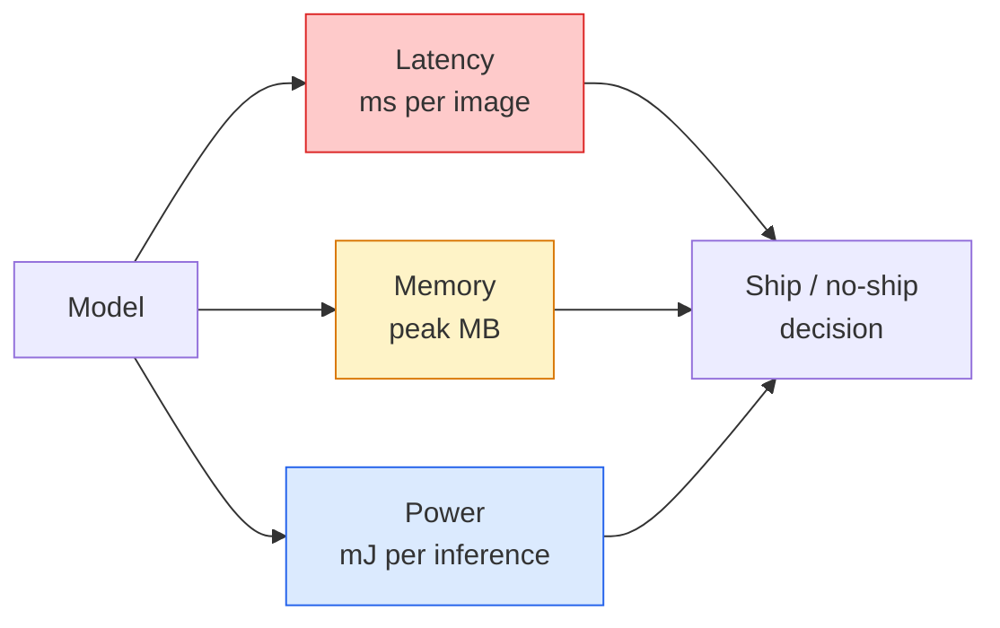

# Visión en tiempo real  Despliegue de borde

> La inferencia de borde es la disciplina de conseguir que un modelo de 90 fps ejecute a 30 fps en un dispositivo con 2 GB de RAM.

**Type:** Learn + Build
**Languages:** Python
**Prerequisites:** Phase 4 Lesson 04 (Image Classification), Phase 10 Lesson 11 (Quantization)
**Time:** ~75 minutes

## Objetivos de aprendizaje

- Medir la latencia de inferencia, la memoria máxima y el rendimiento para cualquier modelo PyTorch, y leer las FLOPs / params / compensación de latencia
- Cuantizar un modelo de visión a INT8 utilizando la cuantificación posterior a la formación de PyTorch y verificar la pérdida de precisión < 1%
- Exportar a ONNX y compilar con ONNX Runtime o TensorRT; nombrar las tres fallas de exportación más comunes y sus correcciones
- Explicar cuándo elegir MobileNetV3, EfficientNet-Lite, ConvNeXt-Tiny o MobileViT para una restricción de borde

## El problema

Un modelo de visión de entrenamiento es un monstruo de punto flotante. 100M parámetros, 10 GFLOPs por pase hacia adelante, 2 GB de VRAM. Ninguno de esos se ajusta a un teléfono, una unidad de infoentretenimiento de un automóvil, una cámara industrial o un dron.

Tres botones hacen la mayor parte del trabajo: la elección del modelo (una arquitectura más pequeña con la misma receta), la cuantificación (INT8 en lugar de FP32) y el tiempo de ejecución de inferencia (ONNX Runtime, TensorRT, Core ML, TFLite).

Esta lección establece primero la disciplina de medición (no se puede optimizar lo que no se puede medir), luego se camina los tres botones.

## El concepto

### Los tres presupuestos



- **Latency**El promedio de sólo p50 esconde el comportamiento de cola que es importante para los sistemas en tiempo real.
- **Peak memory**El objetivo de la OOM es el máximo que el dispositivo pueda ver, no el promedio de estado estacionario.
- **Power / energy**En el caso de los dispositivos de alta velocidad, el tiempo de utilización de la CPU/GPU es de aproximadamente un millón de juegos por inferencia en un dispositivo alimentado por batería.

Una tabla de (modelo, latencia, memoria, precisión) es de la que se toma una decisión de borde.

### Disciplina de medición

Tres reglas que debe seguir cada perfil de borde:

1. **Warm up**El modelo con 5-10 pasos adicionales de maniobra antes de medir.
2. **Synchronise**Cargas de trabajo de GPU con `torch.cuda.synchronize()`Sin esto se mide el despacho del núcleo, no la ejecución del núcleo.
3. **Fix input sizes**La latencia en 224x224 no es la latencia en 512x512.

### FLOPs como un agente

FLOPs (operaciones de puntos flotantes por inferencia) es un proxy barato, independiente del dispositivo para la latencia. Útil para la comparación de arquitectura, engañoso como un reloj de pared absoluto. Un modelo con un 10% más de FLOPs puede ser 2 veces más rápido en la práctica porque utiliza opciones amigables con hardware (convistas profundas compilar bien, grandes convistas 7x7 no).

Regla: utilizar FLOPs para la búsqueda de arquitectura, utilizar latencia en el dispositivo para las decisiones de implementación.

### Cuantificación en un párrafo

Replace los pesos y las activaciones de FP32 con INT8. El tamaño del modelo disminuye 4x, el ancho de banda de memoria disminuye 4x, la computación disminuye 2-4x en el hardware que tiene núcleos INT8 (todo SoC móvil moderno, cada GPU NVIDIA con Tensor Cores).

Tipo de las plantas:

- **Dynamic** Peso cuántico a INT8, activaciones calculadas en FP.
- **Static (post-training)** Peso cuántico + rango de activación de calibración en un conjunto de calibración pequeño.
- **Quantisation-aware training (QAT)** simulación de la cuantificación durante el entrenamiento para que el modelo aprenda a su alrededor.

Para la visión, la cuantificación estática post-entrenamiento proporciona el 95% de los beneficios con el 5% del esfuerzo.

### Alcaza y destilación

- **Pruning** eliminar pesos no importantes (basados en magnitud) o canales (estructurados). Funciona bien en modelos sobreparametrizados; menos útil en arquitecturas ya compactas.
- **Distillation** entrenar a un estudiante pequeño para imitar las logitas de un maestro grande. A menudo recupera la mayor parte de la precisión perdida mediante la reducción del modelo.

### Los tiempos de ejecución de la inferencia

- **PyTorch eager** lento, no para el despliegue.
- **TorchScript** legado.`torch.compile`y la exportación de ONNX.
- **ONNX Runtime**CPU, CUDA, CoreML, TensorRT, OpenVINO todos tienen proveedores ONNX.
- **TensorRT** Compilador de NVIDIA. Mejor latencia en las GPUs de NVIDIA (estación de trabajo y Jetson).
- **Core ML** Tiempo de ejecución de Apple para iOS/macOS. Necesidades `.mlmodel`o `.mlpackage`¿ Qué ?
- **TFLite** El tiempo de ejecución de Google para Android/ARM. Necesidades `.tflite`¿ Qué ?
- **OpenVINO** Tiempo de ejecución de Intel para CPU/VPU. Necesidades `.xml`¿ Qué es eso ?`.bin`¿ Qué ?

En la práctica: exportar PyTorch -> ONNX -> elegir el tiempo de ejecución para el objetivo.

### Selector de arquitectura de borde

| Budget | Model | Why |
|--------|-------|-----|
| < 3M params | MobileNetV3-Small | Compiles everywhere, good baseline |
| 3-10M | EfficientNet-Lite-B0 | Best accuracy per param on TFLite |
| 10-20M | ConvNeXt-Tiny | Best accuracy-per-param, CPU-friendly |
| 20-30M | MobileViT-S or EfficientViT | Transformer with ImageNet accuracy |
| 30-80M | Swin-V2-Tiny | If stack supports window attention |

Cuantice todos estos a INT8 a menos que tenga una razón específica para no hacerlo.

```figure
cnn-param-count
```

## Construye el mismo

### Paso 1: Medir correctamente la latencia

```python
import time
import torch

def measure_latency(model, input_shape, device="cpu", warmup=10, iters=50):
    model = model.to(device).eval()
    x = torch.randn(input_shape, device=device)
    with torch.no_grad():
        for _ in range(warmup):
            model(x)
        if device == "cuda":
            torch.cuda.synchronize()
        times = []
        for _ in range(iters):
            if device == "cuda":
                torch.cuda.synchronize()
            t0 = time.perf_counter()
            model(x)
            if device == "cuda":
                torch.cuda.synchronize()
            times.append((time.perf_counter() - t0) * 1000)
    times.sort()
    return {
        "p50_ms": times[len(times) // 2],
        "p95_ms": times[int(len(times) * 0.95)],
        "p99_ms": times[int(len(times) * 0.99)],
        "mean_ms": sum(times) / len(times),
    }
```

Calentar, sincronizar, usar `time.perf_counter()`- Informar porcentiles, no sólo mediocres.

### Paso 2: Parámetro y recuento de FLOP

```python
def parameter_count(model):
    return sum(p.numel() for p in model.parameters())

def flops_estimate(model, input_shape):
    """
    Rough FLOP count for a conv/linear-only model. For production use `fvcore` or `ptflops`.
    """
    total = 0
    def conv_hook(m, inp, out):
        nonlocal total
        c_out, c_in, kh, kw = m.weight.shape
        h, w = out.shape[-2:]
        total += 2 * c_in * c_out * kh * kw * h * w
    def linear_hook(m, inp, out):
        nonlocal total
        total += 2 * m.in_features * m.out_features
    hooks = []
    for m in model.modules():
        if isinstance(m, torch.nn.Conv2d):
            hooks.append(m.register_forward_hook(conv_hook))
        elif isinstance(m, torch.nn.Linear):
            hooks.append(m.register_forward_hook(linear_hook))
    model.eval()
    with torch.no_grad():
        model(torch.randn(input_shape))
    for h in hooks:
        h.remove()
    return total
```

Para proyectos reales `fvcore.nn.FlopCountAnalysis`o `ptflops`; manejan cada tipo de módulo correctamente.

### Paso 3: Cuantificación estática después del entrenamiento

```python
def quantise_ptq(model, calibration_loader, backend="x86"):
    import torch.ao.quantization as tq
    model = model.eval().cpu()
    model.qconfig = tq.get_default_qconfig(backend)
    tq.prepare(model, inplace=True)
    with torch.no_grad():
        for x, _ in calibration_loader:
            model(x)
    tq.convert(model, inplace=True)
    return model
```

Tres pasos: configurar, preparar (insertar observadores), calibrar con datos reales, convertir (fusión + cuantización).`Conv -> BN -> ReLU`- ¿ Qué ?`ConvBnReLU`), que `torch.ao.quantization.fuse_modules`- ¿Qué?

### Paso 4: Exportación a ONNX

```python
def export_onnx(model, sample_input, path="model.onnx"):
    model = model.eval()
    torch.onnx.export(
        model,
        sample_input,
        path,
        input_names=["input"],
        output_names=["output"],
        dynamic_axes={"input": {0: "batch"}, "output": {0: "batch"}},
        opset_version=17,
    )
    return path
```

`opset_version=17`es el default seguro en 2026. `dynamic_axes`permite ejecutar el modelo ONNX con tamaño de lote arbitrario.

### Paso 5: Indicar y comparar los regímenes

```python
import torch.nn as nn
from torchvision.models import mobilenet_v3_small

def compare_regimes():
    model = mobilenet_v3_small(weights=None, num_classes=10)
    params = parameter_count(model)
    flops = flops_estimate(model, (1, 3, 224, 224))
    lat_fp32 = measure_latency(model, (1, 3, 224, 224), device="cpu")
    print(f"FP32 MobileNetV3-Small: {params:,} params  {flops/1e9:.2f} GFLOPs  "
          f"p50={lat_fp32['p50_ms']:.2f}ms  p95={lat_fp32['p95_ms']:.2f}ms")
```

Ejecutar la misma función para `resnet50`¿ Qué ?`efficientnet_v2_s`, y `convnext_tiny`y tienes la tabla de comparación que necesitas para una decisión de despliegue.

## Usalo

Las pilas de producción convergen en una de las tres vías:

- **Web / serverless**PyTorch -> ONNX -> ONNX Runtime (proveedor de CPU o CUDA).
- **NVIDIA edge (Jetson, GPU server)**PiTorch -> ONNX -> TensorRT. Mejor latencia, mayor esfuerzo de ingeniería.
- **Mobile**PyTorch -> ONNX -> Core ML (iOS) o TFLite (Android). Cuantice antes de exportar.

Para la medición, `torch-tb-profiler`¿ Qué ?`nvprof`- ¿ Qué ?`nsys`, y los instrumentos en macOS dan rupturas capas por capas. `benchmark_app`(OpenVINO) y `trtexec`(TensorRT) dar números independientes de CLI.

## Envío

Esta lección produce:

- `outputs/prompt-edge-deployment-planner.md` un prompt que selecciona la columna vertebral, la estrategia de cuantificación y el tiempo de ejecución dado el dispositivo objetivo y la latencia SLA.
- `outputs/skill-latency-profiler.md` una habilidad que escribe un guión completo de benchmarking de latencia con calentamiento, sincronización, percentiles y seguimiento de memoria.

## Los ejercicios

1. **(Easy)**Medir la latencia p50 para `resnet18`¿ Qué ?`mobilenet_v3_small`¿ Qué ?`efficientnet_v2_s`, y `convnext_tiny`En el punto 224x224 en la CPU, informe la tabla y identifique cuál arquitectura tiene la mejor precisión por ms.
2. **(Medium)**Aplicar la cuantificación estática después del entrenamiento a `mobilenet_v3_small`. Informar pérdida de latencia e exactitud FP32 vs INT8 en un subconjunto de CIFAR-10 o similar.
3. **(Hard)**Exportación `convnext_tiny`En ONNX, hazlo pasar.`onnxruntime`con el `CPUExecutionProvider`, y comparar la latencia con la línea de base de PyTorch ansioso. Identificar la primera capa donde ONNX Runtime es más rápido y explicar por qué.

## Términos clave

| Term | What people say | What it actually means |
|------|----------------|----------------------|
| Latency | "How fast" | Time from input to output; p50/p95/p99 percentiles, not mean |
| FLOPs | "Model size" | Floating-point ops per forward pass; rough proxy for compute cost |
| INT8 quantisation | "8-bit" | Replace FP32 weights/activations with 8-bit integers; ~4x smaller, 2-4x faster |
| PTQ | "Post-training quantisation" | Quantise a trained model without retraining; easy, usually enough |
| QAT | "Quantisation-aware training" | Simulate quantisation during training; best accuracy, requires labelled data |
| ONNX | "The neutral format" | Model exchange format supported by every mainstream inference runtime |
| TensorRT | "NVIDIA compiler" | Compiles ONNX into an optimised engine for NVIDIA GPUs |
| Distillation | "Teacher -> student" | Train a small model to mimic a big model's logits; recovers most lost accuracy |

## Leer más

- [EfficientNet (Tan & Le, 2019)](https://arxiv.org/abs/1905.11946) escalación compuesta para arquitecturas eficientes
- [MobileNetV3 (Howard et al., 2019)](https://arxiv.org/abs/1905.02244) Arquitectura móvil con h-swish y squeeze-excite
- [A Practical Guide to TensorRT Optimization (NVIDIA)](https://developer.nvidia.com/blog/accelerating-model-inference-with-tensorrt-tips-and-best-practices-for-pytorch-users/) Cómo obtener los números de rendimiento en el papel
- [ONNX Runtime docs](https://onnxruntime.ai/docs/) Cuantificación, optimización de gráficos, selección de proveedores
