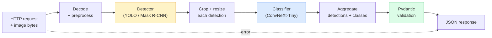

# Construir un oleoducto completo de visión  Capstone

> Un sistema de visión de producción es una cadena de modelos y reglas cosidas con contratos de datos.

**Type:** Build
**Languages:** Python
**Prerequisites:** Phase 4 Lessons 01-15
**Time:** ~120 minutes

## Objetivos de aprendizaje

- Diseñar una línea de visión de producción que detecte objetos, los clasifique y emita JSON estructurado  con cada trayecto de falla manejado
- Conectar un detector (Máscara R-CNN o YOLO), un clasificador (ConvNeXt-Tiny) y un contrato de datos (Pydantic) en un solo servicio
- Marque de referencia de la tubería de extremo a extremo e identifique el primer cuello de botella (generalmente preprocesamiento, luego el detector)
- Envía un servicio FastAPI mínimo que acepta una carga de imágenes, ejecuta la tubería y devuelve las detecciones con clasificaciones

## El problema

Los modelos de visión individuales son útiles; los productos de visión son cadenas de ellos. Una auditoría de estantería minorista es un detector más un clasificador de productos más un pipeline OCR de precios. La conducción autónoma es un detector 2D más un detector 3D más un segmentador más un rastreador más un planificador. Una pre-escreen médica es un segmentador más un clasificador de región más una interfaz de usuario clínica.

El cableado de esas cadenas es la parte que separa un prototipo de ML de un producto. Cada interfaz entre modelos es un nuevo lugar para los errores. Cada transformación de coordenadas, cada normalización, cada tamaño de la máscara es un candidato a fallas silenciosas. Una tubería es tan fuerte como su interfaz más débil.

Esta piedra angular establece el mínimo de tubería viable: detección + clasificación + salida estructurada + una capa de servicio. Todo lo demás en las ranuras de la Fase 4 en este esqueleto: intercambiar Mask R-CNN por YOLOv8, agregar una cabeza OCR, agregar una rama de segmentación, agregar un rastreador. La arquitectura es estable; las piezas son enchufable.

## El concepto

### El oleoducto



Las dos etapas son caras, las otras cinco son donde viven los insectos.

### Contratos de datos con Pydantic

Cada límite modelo se convierte en un objeto tipado, lo que convierte los fallos silenciosos en ruidosos.

```
Detection(
    box: tuple[float, float, float, float],   # (x1, y1, x2, y2), absolute pixels
    score: float,                              # [0, 1]
    class_id: int,                             # from detector's label map
    mask: Optional[list[list[int]]],           # RLE-encoded if present
)

PipelineResult(
    image_id: str,
    detections: list[Detection],
    classifications: list[Classification],
    inference_ms: float,
)
```

Cuando un detector devuelve las cajas en `(cx, cy, w, h)`en lugar de`(x1, y1, x2, y2)`, la validación de Pydantic falla en el límite y se averigua inmediatamente en lugar de depurar un cultivo aguas abajo que en silencio devuelve regiones vacías.

### Donde la latencia va

Tres verdades contienen casi todas las vías:

1. **Preprocessing is often the biggest single block.**Decodificar JPEGs, convertir espacios de color, redimensionar  estos son CPU-ligados y fácil de olvidar.
2. **The detector dominates GPU time.**El 70-90% del tiempo de la GPU está en el pase de detección hacia adelante.
3. **Postprocessing (NMS, RLE encode/decode) is cheap on GPU, expensive on CPU.**Siempre se relaciona con el objetivo real.

Conocer la distribución es lo que convierte la optimización en una lista de prioridades.

### Modo de falla

- **Empty detections** devuelva la lista vacía, no se estrellará.
- **Out-of-bounds boxes** Aglutinar el tamaño de la imagen antes de recortar.
- **Tiny crops** omitir la clasificación para cuadros más pequeños que la entrada mínima del clasificador.
- **Corrupt upload** 400 respuestas con un código de error específico, no 500.
- **Model load failure** fallar en el inicio del servicio, no en la primera solicitud.

Una línea de producción maneja cada uno de estos sin escribir genéricos `try/except`Cada fracaso recibe un código y una respuesta.

### Los grupos

Un servicio de producción sirve a múltiples clientes. La detección de lotes y las clasificaciones de las solicitudes multiplican el rendimiento. La compensación: latencia extra de esperar a que un lote se llene. Configuración típica: recoger solicitudes hasta 20 ms, juntar lotes, procesar, distribuir respuestas. `torchserve`y `triton`Los servicios pequeños con carga predecible lanzan su propio micro-batcher.

```figure
v4-vision-pipeline
```

## Construye el mismo

### Paso 1: Contratos de datos

```python
from pydantic import BaseModel, Field
from typing import List, Optional, Tuple

class Detection(BaseModel):
    box: Tuple[float, float, float, float]
    score: float = Field(ge=0, le=1)
    class_id: int = Field(ge=0)
    mask_rle: Optional[str] = None


class Classification(BaseModel):
    detection_index: int
    class_id: int
    class_name: str
    score: float = Field(ge=0, le=1)


class PipelineResult(BaseModel):
    image_id: str
    detections: List[Detection]
    classifications: List[Classification]
    inference_ms: float
```

Cinco segundos de código ahorran una hora de descomposición en cualquier tubería seria.

### Paso 2: Una clase mínima de tuberías

```python
import time
import numpy as np
import torch
from PIL import Image

class VisionPipeline:
    def __init__(self, detector, classifier, class_names,
                 device="cpu", min_crop=32):
        self.detector = detector.to(device).eval()
        self.classifier = classifier.to(device).eval()
        self.class_names = class_names
        self.device = device
        self.min_crop = min_crop

    def preprocess(self, image):
        """
        image: PIL.Image or np.ndarray (H, W, 3) uint8
        returns: CHW float tensor on device
        """
        if isinstance(image, Image.Image):
            image = np.asarray(image.convert("RGB"))
        tensor = torch.from_numpy(image).permute(2, 0, 1).float() / 255.0
        return tensor.to(self.device)

    @torch.no_grad()
    def detect(self, image_tensor):
        return self.detector([image_tensor])[0]

    @torch.no_grad()
    def classify(self, crops):
        if len(crops) == 0:
            return []
        batch = torch.stack(crops).to(self.device)
        logits = self.classifier(batch)
        probs = logits.softmax(-1)
        scores, cls = probs.max(-1)
        return list(zip(cls.tolist(), scores.tolist()))

    def run(self, image, image_id="anonymous"):
        t0 = time.perf_counter()
        tensor = self.preprocess(image)
        det = self.detect(tensor)

        crops = []
        detections = []
        valid_indices = []
        for i, (box, score, cls) in enumerate(zip(det["boxes"], det["scores"], det["labels"])):
            x1, y1, x2, y2 = [max(0, int(b)) for b in box.tolist()]
            x2 = min(x2, tensor.shape[-1])
            y2 = min(y2, tensor.shape[-2])
            detections.append(Detection(
                box=(x1, y1, x2, y2),
                score=float(score),
                class_id=int(cls),
            ))
            if (x2 - x1) < self.min_crop or (y2 - y1) < self.min_crop:
                continue
            crop = tensor[:, y1:y2, x1:x2]
            crop = torch.nn.functional.interpolate(
                crop.unsqueeze(0),
                size=(224, 224),
                mode="bilinear",
                align_corners=False,
            )[0]
            crops.append(crop)
            valid_indices.append(i)

        class_preds = self.classify(crops)

        classifications = []
        for valid_idx, (cls_id, cls_score) in zip(valid_indices, class_preds):
            classifications.append(Classification(
                detection_index=valid_idx,
                class_id=int(cls_id),
                class_name=self.class_names[cls_id],
                score=float(cls_score),
            ))

        return PipelineResult(
            image_id=image_id,
            detections=detections,
            classifications=classifications,
            inference_ms=(time.perf_counter() - t0) * 1000,
        )
```

Cada interfaz está escrita, cada ruta de falla tiene una decisión específica de manejo.

### Paso 3: Conectar un detector y un clasificador

```python
from torchvision.models.detection import maskrcnn_resnet50_fpn_v2
from torchvision.models import convnext_tiny

# Use ImageNet-pretrained weights for a realistic pipeline without training
detector = maskrcnn_resnet50_fpn_v2(weights="DEFAULT")
classifier = convnext_tiny(weights="DEFAULT")
class_names = [f"imagenet_class_{i}" for i in range(1000)]

pipe = VisionPipeline(detector, classifier, class_names)

# Smoke test with a synthetic image
test_image = (np.random.rand(400, 600, 3) * 255).astype(np.uint8)
result = pipe.run(test_image, image_id="demo")
print(result.model_dump_json(indent=2)[:500])
```

### Paso 4: Servicio de FastAPI

```python
from fastapi import FastAPI, UploadFile, HTTPException
from io import BytesIO

app = FastAPI()
pipe = None  # initialised on startup

@app.on_event("startup")
def load():
    global pipe
    detector = maskrcnn_resnet50_fpn_v2(weights="DEFAULT").eval()
    classifier = convnext_tiny(weights="DEFAULT").eval()
    pipe = VisionPipeline(detector, classifier, class_names=[f"c{i}" for i in range(1000)])

@app.post("/detect")
async def detect_endpoint(file: UploadFile):
    if file.content_type not in {"image/jpeg", "image/png", "image/webp"}:
        raise HTTPException(status_code=400, detail="unsupported image type")
    data = await file.read()
    try:
        img = Image.open(BytesIO(data)).convert("RGB")
    except Exception:
        raise HTTPException(status_code=400, detail="cannot decode image")
    result = pipe.run(img, image_id=file.filename or "upload")
    return result.model_dump()
```

Corra con`uvicorn main:app --host 0.0.0.0 --port 8000`Prueba con`curl -F 'file=@dog.jpg' http://localhost:8000/detect`¿ Qué ?

### Paso 5: Marque de referencia el oleoducto

```python
import time

def benchmark(pipe, num_runs=20, image_size=(400, 600)):
    img = (np.random.rand(*image_size, 3) * 255).astype(np.uint8)
    pipe.run(img)  # warm up

    stages = {"preprocess": [], "detect": [], "classify": [], "total": []}
    for _ in range(num_runs):
        t0 = time.perf_counter()
        tensor = pipe.preprocess(img)
        t1 = time.perf_counter()
        det = pipe.detect(tensor)
        t2 = time.perf_counter()
        crops = []
        for box in det["boxes"]:
            x1, y1, x2, y2 = [max(0, int(b)) for b in box.tolist()]
            x2 = min(x2, tensor.shape[-1])
            y2 = min(y2, tensor.shape[-2])
            if (x2 - x1) >= pipe.min_crop and (y2 - y1) >= pipe.min_crop:
                crop = tensor[:, y1:y2, x1:x2]
                crop = torch.nn.functional.interpolate(
                    crop.unsqueeze(0), size=(224, 224), mode="bilinear", align_corners=False
                )[0]
                crops.append(crop)
        pipe.classify(crops)
        t3 = time.perf_counter()
        stages["preprocess"].append((t1 - t0) * 1000)
        stages["detect"].append((t2 - t1) * 1000)
        stages["classify"].append((t3 - t2) * 1000)
        stages["total"].append((t3 - t0) * 1000)

    for stage, times in stages.items():
        times.sort()
        print(f"{stage:12s}  p50={times[len(times)//2]:7.1f} ms  p95={times[int(len(times)*0.95)]:7.1f} ms")
```

En la CPU, la salida típica es de 20 a 40 ms y en la GPU, la detección es de 20 a 40 ms y el preproceso + clasificar comienza a importar más en términos relativos.

## Usalo

Las plantillas de producción convergen a la misma estructura, más:

- **Model versioning** siempre registrar el nombre del modelo y los pesos hash en la respuesta.
- **Per-request trace IDs** Registre cada momento de cada etapa para cada solicitud para que pueda correlacionar las respuestas lentas con las etapas.
- **Fallback path** si el clasificador se descompone, devuelva las detecciones sin clasificaciones en lugar de no cumplir con toda la solicitud.
- **Safety filters** Los filtros NSFW / PII se ejecutan después de la clasificación, antes de que la respuesta salga del servicio.
- **Batch endpoint** un `/detect_batch`aceptar una lista de URL de imágenes para el procesamiento masivo.

Para la producción de servicio, `torchserve`¿ Qué ?`Triton Inference Server`, y `BentoML`manejar el lote, la versión, las métricas y los controles de salud fuera de la caja.`FastAPI`En el caso de los prototipos y productos a pequeña escala, el producto es directamente compatible.

## Envío

Esta lección produce:

- `outputs/prompt-vision-service-shape-reviewer.md` una solicitud que revisa el código de un servicio de visión para violaciones de la forma de contrato/respuesta y nombra el primer error de ruptura.
- `outputs/skill-pipeline-budget-planner.md` una habilidad que, dada la latencia y el rendimiento objetivo, asigna un presupuesto temporal a cada etapa de la tubería y indica qué etapa se perderá primero su presupuesto.

## Los ejercicios

1. **(Easy)**Ejecutar la línea de 10 imágenes de cualquier conjunto de datos abierto.
2. **(Medium)**Añadir un campo de salida de la máscara a `Detection`Verifique que el JSON se mantiene bajo 1 MB incluso para una imagen de 10 objetos.
3. **(Hard)**Añadir un micro-batcher delante del clasificador: recoger cultivos durante hasta 10 ms, clasificarlos todos en una llamada de GPU, devolver resultados por solicitud. Medir el aumento de rendimiento a 5 solicitudes simultáneas por segundo y la latencia agregada.

## Términos clave

| Term | What people say | What it actually means |
|------|----------------|----------------------|
| Pipeline | "The system" | An ordered chain of preprocessing, inference, and postprocessing steps with a typed interface between each pair |
| Data contract | "The schema" | Pydantic / dataclass definitions that every stage input and output conforms to; catches integration bugs at the boundary |
| Preprocessing | "Before the model" | Decoding, colour conversion, resizing, normalising; usually the biggest CPU time sink |
| Postprocessing | "After the model" | NMS, mask resize, threshold, RLE encode; cheap on GPU, expensive on CPU |
| Microbatcher | "Collect then forward" | Aggregator that waits a fixed window for multiple requests, runs a single batched forward pass |
| Trace ID | "Request id" | Per-request identifier logged at every stage so slow requests can be traced end-to-end |
| Failure code | "Named error" | Specific error code per failure class instead of generic 500; enables client retry logic |
| Health check | "Readiness probe" | Cheap endpoint that reports whether the service can answer; loadbalancers rely on this |

## Leer más

- [Full Stack Deep Learning — Deploying Models](https://fullstackdeeplearning.com/course/2022/lecture-5-deployment/) la visión general canónica del despliegue de ML en la producción
- [BentoML docs](https://docs.bentoml.com) marco de servicio con lotes, versiones y métricas
- [torchserve docs](https://pytorch.org/serve/) La biblioteca oficial de servicio de PyTorch
- [NVIDIA Triton Inference Server](https://developer.nvidia.com/triton-inference-server) servicio de alto rendimiento con soporte de lotes y múltiples modelos
