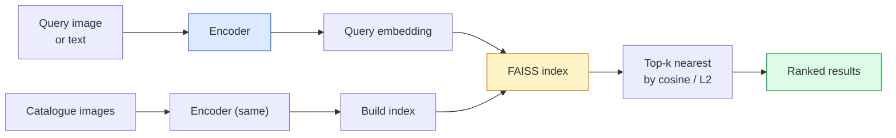

# Recuperación de imágenes y aprendizaje métrico

> Un sistema de recuperación clasifica a los candidatos por la distancia en el espacio de incorporación.

**Type:** Build
**Languages:** Python
**Prerequisites:** Phase 4 Lesson 14 (ViT), Phase 4 Lesson 18 (CLIP)
**Time:** ~45 minutes

## Objetivos de aprendizaje

- Explica las pérdidas de aprendizaje métrico tripartito, contrastivo y basado en proxy y elige la correcta para un conjunto de datos dado
- Implementar correctamente la normalización de L2 y la similitud cosínica y auditar la diferencia entre la extracción de "el mismo artículo" y la "la misma clase"
- Construir un índice FAISS, consultarlo por texto e imagen, y reportar recall@K para un conjunto de consultas retenidas
- Utilice DINOv2, CLIP y SigLIP como columna vertebral de incorporación de venta libre y sepa cuándo gana cada uno

## El problema

La recuperación está en todas partes en la visión de producción: detección de duplicados, búsqueda de imágenes invertidas, búsqueda visual ("encontrar productos similares"), re-identificación de cara, re-ID de persona para vigilancia, coincidencia de nivel de instancia para el comercio electrónico. La pregunta del producto es siempre la misma: "dado esta imagen de consulta, clasifique mi catálogo".

Dos decisiones de diseño dan forma a todo el sistema. La incorporación  qué modelo produce los vectores. El índice  cómo encontrar los vecinos más cercanos a escala. Ambos son productos básicos en 2026 (DINOv2 para la incorporación, FAISS para el índice), lo que eleva la barra: la parte difícil es definir *lo que cuenta como similar* para su aplicación, luego moldear el espacio de incorporación para que coincidan las distancias.

Esa formación es el aprendizaje métrico. Es una disciplina pequeña pero de alto apalancamiento.

## El concepto

### Recuperación en un vistazo



### Las cuatro familias de pérdida

| Loss | Requires | Pros | Cons |
|------|----------|------|------|
| **Contrastive** | (anchor, positive) + negatives | Simple, works with any pair label | Slow to converge without many negatives |
| **Triplet** | (anchor, positive, negative) | Intuitive; direct margin control | Hard-triplet mining is expensive |
| **NT-Xent / InfoNCE** | Pairs + batch-mined negatives | Scales to large batches | Needs big batch or momentum queue |
| **Proxy-based (ProxyNCA)** | Class labels only | Fast, stable, no mining | Can overfit to proxies on small datasets |

Para la mayoría de los casos de uso de producción, comience con una columna vertebral preentrenada y añada una metric-apprenticio de ajuste sólo si las incorporaciones fuera de la plataforma no funcionan bien en su conjunto de pruebas.

### La pérdida de triplet formalmente

```
L = max(0, ||f(a) - f(p)||^2 - ||f(a) - f(n)||^2 + margin)
```

Tirar del anclaje`a`cerca de positivo `p`, empujarlo lejos de negativo `n`, con un `margin`La estructura de tres imágenes se generaliza a cualquier orden de similitud.

En materia de minería: triple fácil (`n`Ya está lejos de`a`La industria de la minería semi-hard (`n`más allá de `p`pero dentro del margen) es la receta de 2016 de FaceNet y todavía domina.

### Similaridad de cosinos vs L2

Dos métricas, dos convenciones:

- **Cosine**Requiere incorporar L2 normalizados.
- **L2**Funciona en embeddings crudos o normalizados, pero generalmente se empareja con L2 normalizado + L2 cuadrado.

Para la mayoría de las redes modernas, las dos son equivalentes: `||a - b||^2 = 2 - 2 cos(a, b)`¿ Cuándo ?`||a|| = ||b|| = 1`Elige la convención que coincida con tu entrenamiento de incorporación; mezclarlas silenciosamente cambia lo que significa "más cercano".

### Recall@K

La métrica de recuperación estándar:

```
recall@K = fraction of queries where at least one correct match is in the top K results
```

Reporte recall@1, @5, @10 lado a lado. Un recall@10 por encima de 0.95 con recall@1 por debajo de 0.5 significa que el espacio de incorporación tiene la estructura correcta pero el ranking es ruidoso  intente un tono fino más largo o un paso de re-ranking.

Para la detección duplicada, la precisión@K es más importante porque cada falso positivo es un error visible por el usuario.

### FAISS en un párrafo

La biblioteca de facto para la búsqueda de vecino más cercano. Tres opciones de índice:

- `IndexFlatIP`- ¿ Qué ?`IndexFlatL2` fuerza bruta, exacta, sin entrenamiento.
- `IndexIVFFlat` partición en células K, buscar sólo las células más cercanas. Aproximado, rápido, necesita datos de entrenamiento.
- `IndexHNSW` basado en gráficos, más rápido para muchas consultas, gran tamaño de índice.

Para 100 mil vectores que probablemente quieras`IndexFlatIP`Por 10M quieres`IndexIVFFlat`. para 100M+ combinados con la cuantificación del producto (`IndexIVFPQ`¿Qué es lo que se hace?

### Recuperación a nivel de instancia frente a nivel de categoría

Dos problemas muy diferentes con el mismo nombre:

- **Category-level** "Encuentra gatos en mi catálogo". Similaridad condicional de clase; los embebidos CLIP / DINOv2 fuera de la plataforma funcionan bien.
- **Instance-level** "Encuentra *este producto exacto* en mi catálogo". Necesita una discriminación de granos entre objetos visualmente similares de la misma clase; las incorporaciones fuera de la plataforma no funcionan bien; ajuste fino con las materias de aprendizaje métrico.

Siempre pregúntale cuál de ellas estás resolviendo antes de elegir un modelo.

```figure
metric-embedding
```

## Construye el mismo

### Paso 1: pérdida de tripleto

```python
import torch
import torch.nn.functional as F

def triplet_loss(anchor, positive, negative, margin=0.2):
    d_ap = F.pairwise_distance(anchor, positive, p=2)
    d_an = F.pairwise_distance(anchor, negative, p=2)
    return F.relu(d_ap - d_an + margin).mean()
```

Funciona en embeddings normalizados o crudos L2.

### Paso 2: Minería semihardida

Dado un lote de embebidos y etiquetas, encontrar el negativo semihardido más difícil para cada ancla.

```python
def semi_hard_negatives(emb, labels, margin=0.2):
    dist = torch.cdist(emb, emb)
    same_class = labels[:, None] == labels[None, :]
    diff_class = ~same_class
    N = emb.size(0)

    positives = dist.clone()
    positives[~same_class] = float("-inf")
    positives.fill_diagonal_(float("-inf"))
    pos_idx = positives.argmax(dim=1)

    semi_hard = dist.clone()
    semi_hard[same_class] = float("inf")
    d_ap = dist[torch.arange(N), pos_idx].unsqueeze(1)
    semi_hard[dist <= d_ap] = float("inf")
    neg_idx = semi_hard.argmin(dim=1)

    fallback_mask = semi_hard[torch.arange(N), neg_idx] == float("inf")
    if fallback_mask.any():
        hardest = dist.clone()
        hardest[same_class] = float("inf")
        neg_idx = torch.where(fallback_mask, hardest.argmin(dim=1), neg_idx)
    return pos_idx, neg_idx
```

Cada ancla obtiene el positivo más duro en su clase y un negativo semiharde que está más lejos del positivo pero dentro del margen.

### Paso 3: Recuerdo@K

```python
def recall_at_k(query_emb, gallery_emb, query_labels, gallery_labels, k=1):
    sim = query_emb @ gallery_emb.T
    _, top_k = sim.topk(k, dim=-1)
    matches = (gallery_labels[top_k] == query_labels[:, None]).any(dim=-1)
    return matches.float().mean().item()
```

Top-k por producto interno en embeddings normalizados L2 es igual a top-k por cosino.

### Paso 4: Reunirlo

```python
import torch
import torch.nn as nn
from torch.optim import Adam

class Encoder(nn.Module):
    def __init__(self, in_dim=128, emb_dim=64):
        super().__init__()
        self.net = nn.Sequential(
            nn.Linear(in_dim, 128), nn.ReLU(),
            nn.Linear(128, emb_dim),
        )

    def forward(self, x):
        return F.normalize(self.net(x), dim=-1)

torch.manual_seed(0)
num_classes = 6
protos = F.normalize(torch.randn(num_classes, 128), dim=-1)

def sample_batch(bs=32):
    labels = torch.randint(0, num_classes, (bs,))
    x = protos[labels] + 0.15 * torch.randn(bs, 128)
    return x, labels

enc = Encoder()
opt = Adam(enc.parameters(), lr=3e-3)

for step in range(200):
    x, y = sample_batch(32)
    emb = enc(x)
    pos_idx, neg_idx = semi_hard_negatives(emb, y)
    loss = triplet_loss(emb, emb[pos_idx], emb[neg_idx])
    opt.zero_grad(); loss.backward(); opt.step()
```

Después de unos cientos de pasos los grupos de incorporación forman un grupo por clase.

## Usalo

Estatuas de producción en 2026:

- **DINOv2 + FAISS** Recuperación visual de propósito general. Funciona fuera de la estantería.
- **CLIP + FAISS** cuando las consultas son mensajes de texto.
- **Fine-tuned DINOv2 + FAISS** Recuperación a nivel de instancia, re-identificación facial, moda, comercio electrónico.
- **Milvus / Weaviate / Qdrant** envases de DB de vectores gestionados alrededor de FAISS o HNSW.

Para la recuperación de instancia SOTA, la receta es: DINOv2 espina dorsal, añadir una cabeza de embebimiento, ajustar a la perfección con un triplet o la pérdida InfoNCE en pares etiquetados con instancia, índice en FAISS.

## Envío

Esta lección produce:

- `outputs/prompt-retrieval-loss-picker.md` una solicitud que selecciona el tripleto / InfoNCE / ProxyNCA para un problema de recuperación determinado.
- `outputs/skill-recall-at-k-runner.md` una habilidad que escribe un arnés de evaluación limpio para recall@K con tren/val/galería y contrato de datos adecuado.

## Los ejercicios

1. **(Easy)**Ejecutar el ejemplo de juguete de arriba. trazar las incrustaciones con PCA antes y después del entrenamiento para ver los seis grupos se forman.
2. **(Medium)**Añadir una implementación de pérdida de ProxyNCA: uno aprendido "proxy" por clase, entropía cruzada estándar en la similitud cosina. Comparar la velocidad de convergencia vs pérdida de triplet en los datos de juguete.
3. **(Hard)**Tome 1.000 imágenes de validación de ImageNet, incrusta con DINOv2 a través de HuggingFace, construya un índice plano de FAISS, y informe recall@{1, 5, 10} contra las mismas imágenes que las consultas (deberían ser 1.0) y contra una división prolongada con las etiquetas de ImageNet como verdad de base.

## Términos clave

| Term | What people say | What it actually means |
|------|----------------|----------------------|
| Metric learning | "Shape the space" | Training an encoder so distances in its output space reflect a target similarity |
| Triplet loss | "Pull and push" | L = max(0, d(a, p) - d(a, n) + margin); the canonical metric-learning loss |
| Semi-hard mining | "Useful negatives" | Negatives further from the anchor than the positive but within margin; empirically the most informative |
| Proxy-based loss | "Class prototypes" | One learned proxy per class; cross-entropy over similarity-to-proxies; no pair mining |
| Recall@K | "Top-K hit rate" | Fraction of queries with at least one correct result in the top K |
| Instance retrieval | "Find this exact thing" | Fine-grained matching; off-the-shelf features usually underperform |
| FAISS | "The NN library" | Facebook's nearest-neighbour library; supports exact and approximate indexes |
| HNSW | "Graph index" | Hierarchical navigable small world; fast approximate NN with small memory overhead |

## Leer más

- [FaceNet: A Unified Embedding for Face Recognition (Schroff et al., 2015)](https://arxiv.org/abs/1503.03832) la pérdida de triplet / papel minero semihardado
- [In Defense of the Triplet Loss for Person Re-Identification (Hermans et al., 2017)](https://arxiv.org/abs/1703.07737) Guía práctica para el ajuste del tripleto
- [FAISS documentation](https://github.com/facebookresearch/faiss/wiki) cada índice, cada compensación
- [SMoT: Metric Learning Taxonomy (Kim et al., 2021)](https://arxiv.org/abs/2010.06927) estudio de las pérdidas modernas y sus conexiones
