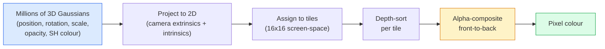

# 3D Gaussian Splatting desde cero

> Una escena es una nube de millones de Gaussians 3D. Cada uno tiene una posición, orientación, escala, opacidad y un color que depende de la dirección de visión.

**Type:** Build
**Languages:** Python
**Prerequisites:** Phase 4 Lesson 13 (3D Vision & NeRF), Phase 1 Lesson 12 (Tensor Operations), Phase 4 Lesson 10 (Diffusion basics optional)
**Time:** ~90 minutes

## Objetivos de aprendizaje

- Explica por qué 3D Gaussian Splatting reemplazó a NeRF como el estándar de producción para la reconstrucción 3D fotorrealista en 2026
- Indique los seis parámetros de Gauss (posición, cuaternón de rotación, escala, opacidad, color de armonía esférica, característica opcional) y cuántos flotadores contribuyen cada uno.
- Implementar un rasterizador de la esplanada Gaussian 2D desde cero usando `alpha`composición, luego mostrar cómo el caso 3D proyecta a la misma bucle
- Usar`nerfstudio`¿ Qué ?`gsplat`, o`SuperSplat`reconstruir una escena de 20 a 50 fotos y exportar a la`KHR_gaussian_splatting`extensión glTF o el OpenUSD 26.03 `UsdVolParticleField3DGaussianSplat`esquema

## El problema

Un NeRF almacena una escena como los pesos de un MLP. Cada píxel renderizado es de cientos de consultas MLP a lo largo de un rayo. El entrenamiento toma horas, el renderizado toma segundos, y los pesos no se pueden editar.

El 3D Gaussian Splatting (Kerbl, Kopanas, Leimkühler, Drettakis, SIGGRAPH 2023) reemplazó todo eso. Una escena es un conjunto explícito de Gaussians 3D. El renderizado es la rasterization de GPU a 100+ fps. El entrenamiento toma minutos. La edición es directa: traduce un subconjunto de Gaussians y has movido la silla. Para 2026, el Grupo Khronos ha ratificado una extensión de glTF para las zonas de Gaussian, OpenUSD 26.03 envía un esquema de zonas de Gaussian, Zillow y Apartments.com hacen que los bienes raíces se convierten en ellos, y la mayoría de los nuevos artículos de investigación sobre reconstrucción 3D son variantes de la idea principal de 3DGS.

El modelo mental es simple, la matemática tiene suficientes partes móviles que la mayoría de las introducciones comienzan en rasterizamiento y pasan por encima de las proyecciones y armónicos esféricos.

## El concepto

### Lo que lleva un gaussiano

Un gaussiano 3D es una mancha parámétrica en el espacio con estos atributos:

```
position         mu         (3,)    centre in world coordinates
rotation         q          (4,)    unit quaternion encoding orientation
scale            s          (3,)    log-scales per axis (exponentiated at render time)
opacity          alpha      (1,)    post-sigmoid opacity [0, 1]
SH coefficients  c_lm       (3 * (L+1)^2,)   view-dependent colour
```

La rotación + escala construye una covarianza 3x3: `Sigma = R S S^T R^T`. Esa es la forma del gaussiano en 3D. Los armónicos esféricos permiten cambiar el color con la dirección de visión  resonancias especulares, brillo sutil, brillo dependiente de la vista  sin almacenar texturas por visión. Con el grado SH 3 obtienes 16 coeficientes por canal de color, 48 flotantes por gaussiano solo para el color.

Una escena típicamente tiene 1-5 millones de Gaussians. Cada almacena aproximadamente 60 flotadores (3 + 4 + 3 + 1 + 48 + misc). Eso es 240 MB para una escena Gaussian de cinco millones de años  mucho más pequeño que la nube de punto equivalente con textura por punto, y un orden de magnitud menor que los pesos MLP de un NeRF re-rendido a alta resolución.

### La racionalización, no la marcha de rayos



Cinco pasos, todos compatibles con la GPU, sin consulta MLP por píxel, un solo RTX 3080 Ti produce 6 millones de espacios a 147 fps.

### El paso de proyección

El Gaussian 3D en posición mundial .`mu`con covarianza 3D `Sigma`proyectos a un Gaussian 2D en posición de pantalla `mu'`con covarianza 2D `Sigma'`¿Qué es esto ?

```
mu' = project(mu)
Sigma' = J W Sigma W^T J^T          (2 x 2)

W = viewing transform (rotation + translation of camera)
J = Jacobian of the perspective projection at mu'
```

La huella de Gaussian 2D es una elipse cuyos ejes son los propios vectores de `Sigma'`Cada píxel dentro de esa elipse recibe la contribución de Gaussian, ponderada por`exp(-0.5 * (p - mu')^T Sigma'^-1 (p - mu'))`¿ Qué ?

### La regla de composición alfa

Para un píxel, los gaussianos que lo cubren se ordenan de frente a frente (o equivalentemente de frente a atrás con fórmula invertida).

```
C_pixel = sum_i alpha_i * T_i * c_i

T_i = prod_{j < i} (1 - alpha_j)       transmittance up to i
alpha_i = opacity_i * exp(-0.5 * d^T Sigma'^-1 d)   local contribution
c_i = eval_SH(SH_i, view_direction)    view-dependent colour
```

Esto es ...**the same equation as NeRF's volumetric render**La identidad es por eso que la calidad de renderización coincide con la de NeRF  ambos están integrando la misma ecuación de campo de radiación.

### ¿Por qué esto es diferenciable?

Cada paso  proyección, asignación de azulejos, composición alfa, evaluación SH  es diferenciable con respecto a los parámetros de Gaussian. Dada una imagen de la verdad de la base, calcular la pérdida de píxeles renderizadas, retroprop a través del rasterizador, actualizar todo `(mu, q, s, alpha, c_lm)`En más de 30.000 iteraciones los gaussianos encuentran sus posiciones, escalas y colores correctos.

### Densificación y poda

Un conjunto fijo de Gaussianos no puede cubrir una escena compleja.

- **Clone**un Gaussian en su posición actual cuando su magnitud de gradiente es alta pero su escala es pequeña  la reconstrucción necesita más detalles aquí.
- **Split**un gaussian a gran escala en dos más pequeños cuando su gradiente es alto  un gaussian grande es demasiado suave para encajar en la región.
- **Prune**Los gaussianos cuya opacidad cae por debajo de un umbral no están contribuyendo.

La densificación se ejecuta en todas las iteraciones N. Una escena generalmente crece de ~100k Gaussians iniciales (seededed from SfM points) a 1-5M al final del entrenamiento.

### Armonías esféricas en un párrafo

El color dependiente de la vista es una función `c(direction)`Las armónicas esféricas son la base de Fourier de la esfera.`L`y usted tiene`(L+1)^2`La evaluación del color para una nueva vista es un producto de puntos entre los coeficientes SH aprendidos y la base evaluada en la dirección de visualización. Grado 0 = un coeficiente = color constante. Grado 3 = 16 coeficientes = suficiente para capturar el sombreamiento lamberciano, especular y reflexión leve.

### La pila de producción de 2026

```
1. Capture         smartphone / DJI drone / handheld scanner
2. SfM / MVS       COLMAP or GLOMAP derives camera poses + sparse points
3. Train 3DGS      nerfstudio / gsplat / inria official / PostShot (~10-30 min on RTX 4090)
4. Edit            SuperSplat / SplatForge (clean floaters, segment)
5. Export          .ply -> glTF KHR_gaussian_splatting or .usd (OpenUSD 26.03)
6. View            Cesium / Unreal / Babylon.js / Three.js / Vision Pro
```

### Variantes 4D y generativas

- **4D Gaussian Splatting** Los gaussianos son funciones del tiempo; utilizados para el video volumétrico (Superman 2026, "Helicóptero" de A$AP Rocky).
- **Generative splats** modelos de texto a plato (Marble by World Labs) que alucinan escenas enteras.
- **3D Gaussian Unscented Transform** Variante de NVIDIA NuRec para la simulación de conducción autónoma.

```figure
cv3-gaussian-splat
```

## Construye el mismo

### Paso 1: Un gaussiano 2D

Primero construimos un rasterizador 2D. La caja 3D se reduce a ella después de la proyección.

```python
import torch
import torch.nn as nn
import torch.nn.functional as F


def eval_2d_gaussian(means, covs, points):
    """
    means:  (G, 2)      centres
    covs:   (G, 2, 2)   covariance matrices
    points: (H, W, 2)   pixel coordinates
    returns: (G, H, W)  density at every pixel for every Gaussian
    """
    G = means.size(0)
    H, W, _ = points.shape
    flat = points.view(-1, 2)
    inv = torch.linalg.inv(covs)
    diff = flat[None, :, :] - means[:, None, :]
    d = torch.einsum("gpi,gij,gpj->gp", diff, inv, diff)
    density = torch.exp(-0.5 * d)
    return density.view(G, H, W)
```

`einsum`¿ hace la forma cuadrática `diff^T Sigma^-1 diff`para cada par (Gaussian, píxeles).

### Paso 2: rasterizador de la descarga en 2D

La profundidad en 2D no tiene sentido, así que usamos un escalar Gaussian para el orden.

```python
def rasterise_2d(means, covs, colours, opacities, depths, image_size):
    """
    means:     (G, 2)
    covs:      (G, 2, 2)
    colours:   (G, 3)
    opacities: (G,)     in [0, 1]
    depths:    (G,)     per-Gaussian scalar used for ordering
    image_size: (H, W)
    returns:   (H, W, 3) rendered image
    """
    H, W = image_size
    yy, xx = torch.meshgrid(
        torch.arange(H, dtype=torch.float32, device=means.device),
        torch.arange(W, dtype=torch.float32, device=means.device),
        indexing="ij",
    )
    points = torch.stack([xx, yy], dim=-1)

    densities = eval_2d_gaussian(means, covs, points)
    alphas = opacities[:, None, None] * densities
    alphas = alphas.clamp(0.0, 0.99)

    order = torch.argsort(depths)
    alphas = alphas[order]
    colours_sorted = colours[order]

    T = torch.ones(H, W, device=means.device)
    out = torch.zeros(H, W, 3, device=means.device)
    for i in range(means.size(0)):
        a = alphas[i]
        out += (T * a)[..., None] * colours_sorted[i][None, None, :]
        T = T * (1.0 - a)
    return out
```

No rápido  una implementación real utiliza núcleos CUDA basados en azulejos  pero exactamente la matemática correcta y completamente diferenciable.

### Paso 3: Una escena de esparcimiento 2D entrenable

```python
class Splats2D(nn.Module):
    def __init__(self, num_splats=128, image_size=64, seed=0):
        super().__init__()
        g = torch.Generator().manual_seed(seed)
        H, W = image_size, image_size
        self.means = nn.Parameter(torch.rand(num_splats, 2, generator=g) * torch.tensor([W, H]))
        self.log_scale = nn.Parameter(torch.ones(num_splats, 2) * math.log(2.0))
        self.rot = nn.Parameter(torch.zeros(num_splats))  # single angle in 2D
        self.colour_logits = nn.Parameter(torch.randn(num_splats, 3, generator=g) * 0.5)
        self.opacity_logit = nn.Parameter(torch.zeros(num_splats))
        self.depth = nn.Parameter(torch.rand(num_splats, generator=g))

    def covs(self):
        s = torch.exp(self.log_scale)
        c, si = torch.cos(self.rot), torch.sin(self.rot)
        R = torch.stack([
            torch.stack([c, -si], dim=-1),
            torch.stack([si, c], dim=-1),
        ], dim=-2)
        S = torch.diag_embed(s ** 2)
        return R @ S @ R.transpose(-1, -2)

    def forward(self, image_size):
        covs = self.covs()
        colours = torch.sigmoid(self.colour_logits)
        opacities = torch.sigmoid(self.opacity_logit)
        return rasterise_2d(self.means, covs, colours, opacities, self.depth, image_size)
```

`log_scale`¿ Qué ?`opacity_logit`, y `colour_logits`Es el patrón estándar para cada implementación 3DGS.

### Paso 4: Ajustar Gaussians 2D a una imagen de objetivo

```python
import math
import numpy as np

def make_target(size=64):
    yy, xx = np.meshgrid(np.arange(size), np.arange(size), indexing="ij")
    img = np.zeros((size, size, 3), dtype=np.float32)
    # Red circle
    mask = (xx - 20) ** 2 + (yy - 20) ** 2 < 10 ** 2
    img[mask] = [1.0, 0.2, 0.2]
    # Blue square
    mask = (np.abs(xx - 45) < 8) & (np.abs(yy - 40) < 8)
    img[mask] = [0.2, 0.3, 1.0]
    return torch.from_numpy(img)


target = make_target(64)
model = Splats2D(num_splats=64, image_size=64)
opt = torch.optim.Adam(model.parameters(), lr=0.05)

for step in range(200):
    pred = model((64, 64))
    loss = F.mse_loss(pred, target)
    opt.zero_grad(); loss.backward(); opt.step()
    if step % 40 == 0:
        print(f"step {step:3d}  mse {loss.item():.4f}")
```

Más de 200 pasos los 64 Gaussianos se establecen en las dos formas.

### Paso 5: De 2D a 3D

La extensión 3D mantiene el mismo bucle.

1. La rotación por Gaussian es un cuaternion en lugar de un ángulo único.
2. La covarianza es`R S S^T R^T`con`R`construido a partir del cuaternion y `S = diag(exp(log_scale))`¿ Qué ?
3. Proyección `(mu, Sigma) -> (mu', Sigma')`utiliza la extrínseca de la cámara y el jacobiano de la proyección de perspectiva en `mu`¿ Qué ?
4. El color se convierte en una expansión esférica-harmónica; evalúalo en la dirección de visión.
5. La clasificación de profundidad es de la cámara real-espacio z en lugar de un escalar aprendido.

Cada ejecución de la producción (`gsplat`¿ Qué ?`inria/gaussian-splatting`¿ Qué ?`nerfstudio`) hace exactamente esto en la GPU con núcleos CUDA basados en azulejos.

### Paso 6: Evaluación de las armónicas esféricas

La base SH hasta el grado 3 tiene 16 términos por canal.

```python
def eval_sh_degree_3(sh_coeffs, dirs):
    """
    sh_coeffs: (..., 16, 3)   last dim is RGB channels
    dirs:      (..., 3)       unit vectors
    returns:   (..., 3)
    """
    C0 = 0.282094791773878
    C1 = 0.488602511902920
    C2 = [1.092548430592079, 1.092548430592079,
          0.315391565252520, 1.092548430592079,
          0.546274215296039]
    x, y, z = dirs[..., 0], dirs[..., 1], dirs[..., 2]
    x2, y2, z2 = x * x, y * y, z * z
    xy, yz, xz = x * y, y * z, x * z

    result = C0 * sh_coeffs[..., 0, :]
    result = result - C1 * y[..., None] * sh_coeffs[..., 1, :]
    result = result + C1 * z[..., None] * sh_coeffs[..., 2, :]
    result = result - C1 * x[..., None] * sh_coeffs[..., 3, :]

    result = result + C2[0] * xy[..., None] * sh_coeffs[..., 4, :]
    result = result + C2[1] * yz[..., None] * sh_coeffs[..., 5, :]
    result = result + C2[2] * (2.0 * z2 - x2 - y2)[..., None] * sh_coeffs[..., 6, :]
    result = result + C2[3] * xz[..., None] * sh_coeffs[..., 7, :]
    result = result + C2[4] * (x2 - y2)[..., None] * sh_coeffs[..., 8, :]

    # degree 3 terms omitted here for brevity; full 16-coefficient version in the code file
    return result
```

Aprendió`sh_coeffs`En el momento de renderizar se evalúa en contra de la dirección de visión actual y se obtiene un RGB de 3 vectores.

## Usalo

Para el trabajo real 3DGS, use `gsplat`(Meta) o `nerfstudio`¿Qué es esto ?

```bash
pip install nerfstudio gsplat
ns-download-data example
ns-train splatfacto --data path/to/data
```

`splatfacto`El entrenador de 3DGS del Nerfstudio toma 10 a 30 minutos en un RTX 4090 para una escena típica.

Opciones de exportación que tengan importancia en 2026:

- `.ply` nube gausí (portátil, archivo más grande).
- `.splat` Formatos cuantificados de PlayCanvas / SuperSplat.
- glTF `KHR_gaussian_splatting` Norma de Cronos, portátil entre espectadores (Feb 2026 RC).
- OpenUSD `UsdVolParticleField3DGaussianSplat` USD-nativo, para las tuberías NVIDIA Omniverse y Vision Pro.

Para escenas 4D / dinámicas, `4DGS`y `Deformable-3DGS`extender la misma maquinaria con medios y opacidades variables en el tiempo.

## Envío

Esta lección produce:

- `outputs/prompt-3dgs-capture-planner.md` una llamada que planifica una sesión de captura (número de fotos, ruta de la cámara, iluminación) para un tipo de escena dado.
- `outputs/skill-3dgs-export-router.md` una habilidad que elija el formato de exportación adecuado (`.ply`- ¿ Qué ?`.splat`/ glTF / USD) dado al espectador o motor en aguas subidas.

## Los ejercicios

1. **(Easy)**Ejecutar el entrenador de 2D en una imagen sintética diferente.`num_splats`En el`[16, 64, 256]`y el gráfico MSE vs paso para cada uno. Identifique el punto de rendimiento decreciente.
2. **(Medium)**Extenda el rasterizador 2D para soportar colores RGB por gaussiano que dependen de un "ángulo de visión" escalar a través de un armónico de grado-2.
3. **(Hard)**Cloning .`nerfstudio`y tren .`splatfacto`En una captura de 20 fotos de cualquier escena que tenga (desk, planta, cara, habitación).`KHR_gaussian_splatting`y abrirlo en un visor (Three.js `GaussianSplats3D`, SuperSplat, Babylon.js V9). Informar el tiempo de entrenamiento, número de Gaussians, y renderizado fps.

## Términos clave

| Term | What people say | What it actually means |
|------|----------------|----------------------|
| 3DGS | "Gaussian splats" | Explicit scene representation as millions of 3D Gaussians with per-Gaussian position, rotation, scale, opacity, SH colour |
| Covariance | "Shape of the Gaussian" | `Sigma = R S S^T R^T`; orientation and anisotropic scale of one Gaussian |
| Alpha compositing | "Back-to-front blend" | Same equation as NeRF's volumetric render, now over an explicit sparse set |
| Densification | "Clone and split" | Adaptive addition of new Gaussians where reconstruction is under-fit |
| Pruning | "Delete low-opacity" | Remove Gaussians that have collapsed to near-zero opacity during training |
| Spherical harmonics | "View-dependent colour" | Fourier basis on the sphere; stores colour as a function of viewing direction |
| Splatfacto | "nerfstudio's 3DGS" | The easiest path to training 3DGS in 2026 |
| `KHR_gaussian_splatting` | "glTF standard" | Khronos 2026 extension that makes 3DGS portable across viewers and engines |

## Leer más

- [3D Gaussian Splatting for Real-Time Radiance Field Rendering (Kerbl et al., SIGGRAPH 2023)](https://repo-sam.inria.fr/fungraph/3d-gaussian-splatting/) el papel original
- [gsplat (Meta/nerfstudio)](https://github.com/nerfstudio-project/gsplat) rasterizador CUDA de calidad de producción
- [nerfstudio Splatfacto](https://docs.nerf.studio/nerfology/methods/splat.html) Receta de formación de referencia
- [Khronos KHR_gaussian_splatting extension](https://github.com/KhronosGroup/glTF/blob/main/extensions/2.0/Khronos/KHR_gaussian_splatting/README.md) el formato portátil 2026
- [OpenUSD 26.03 release notes](https://openusd.org/release/)¿ Qué es esto ?`UsdVolParticleField3DGaussianSplat`esquema
- [THE FUTURE 3D State of Gaussian Splatting 2026](https://www.thefuture3d.com/blog-0/2026/4/4/state-of-gaussian-splatting-2026) Visión general de la industria
