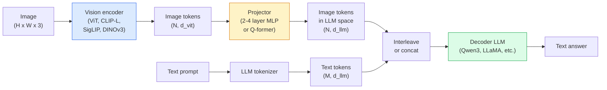

# Modelos de lenguaje de visión  El patrón ViT-MLP-LLM

> Un codificador de visión convierte una imagen en tokens. Un proyector MLP mapea esos tokens en el espacio de incorporación del LLM. Un modelo de lenguaje hace el resto. Ese patrón  ViT-MLP-LLM  es cada VLM de producción en 2026.

**Type:** Learn + Use
**Languages:** Python
**Prerequisites:** Phase 4 Lesson 14 (ViT), Phase 4 Lesson 18 (CLIP), Phase 7 Lesson 02 (Self-Attention)
**Time:** ~75 minutes

## Objetivos de aprendizaje

- En el artículo 6 del Reglamento (UE) n.o 1095/2013 se establece que los Estados miembros deben adoptar medidas de protección de los derechos humanos y de los derechos humanos.
- Comparar Qwen3-VL, InternVL3.5, LLaVA-Next y GLM-4.6V en el conteo de parámetros, longitud de contexto y rendimiento de referencia
- Explica DeepStack: por qué las características de ViT de varios niveles apretan mejor la alineación del lenguaje visual que una sola característica de última capa
- Medir la alucinación de VLM en la producción con la tasa de error transmodal (CMER) y actuar sobre la señal

## El problema

CLIP (Leyra de la Fase 4 18) le da un espacio de incorporación compartido para imágenes y texto, lo que es suficiente para la clasificación y recuperación de tomas cero. No puede responder "¿cuántos coches rojos hay en esta imagen?" porque CLIP no genera texto  solo obtiene puntos de similitud.

Modelos de lenguaje de visión (VLM)  Qwen3-VL, InternVL3.5, LLaVA-Next, GLM-4.6V  encierra un codificador de imagen de la familia CLIP a un modelo de lenguaje completo. El modelo ve una imagen más una pregunta y genera una respuesta. En 2026 los VLM de código abierto rivalizan o superan a GPT-5 y Gemini-2.5-Pro en benchmarks multimodal (MMMU, MMBench, DocVQA, ChartQA, MathVista, OSWorld).

El trio de piezas (ViT, proyector, LLM) es el estándar. Las diferencias entre los modelos son en qué ViT, qué proyector, qué LLM, los datos de entrenamiento y la receta de alineación. Una vez que entiendes el patrón, intercambiar cualquier componente es mecánico.

## El concepto

### La arquitectura ViT-MLP-LLM



1. **Vision encoder** un ViT pre-entrenado (CLIP-L/14, SigLIP, DINOv3 o una variante afinada).
2. **Projector** un módulo pequeño (2-4 capas MLP, o un Q-former) que mapea los tokens de visión en la dimensión de incorporación del LLM. Aquí es donde ocurre la mayor parte del ajuste fino.
3. **LLM** un modelo de lenguaje solo para decodificadores (Qwen3, Llama, Mistral, GLM, InternLM). Lea los tokens de visión + texto en secuencia, genera texto.

En la práctica, el codificador de visión y el LLM permanecen en su mayoría congelados mientras que el proyector entraña unos pocos miles de millones de parámetros de señal a bajo costo.

### Profundidad

La proyección de vainilla utiliza sólo la última capa de ViT. Proyecciones de DeepStack (Qwen3-VL) muestran características de múltiples profundidades de ViT y las apila. Las capas más profundas llevan semántica de alto nivel; las capas más bajas llevan información espacial y textual de granos finos.

### Tres etapas de formación

Los VLM modernos se entrenan en etapas:

1. **Alignment** congelar ViT y LLM. Entrenar sólo el proyector en pares de captura de imagen. enseña al proyector a mapear el espacio visual en el espacio del lenguaje.
2. **Pre-training** deshielo todo. Entrenamiento a gran escala de datos de imagen-texto entrelazados (500M+ pares). Construye el conocimiento visual del modelo.
3. **Instruction tuning** sintonización en triples curados (imagen, pregunta, respuesta). Enseña el comportamiento de conversación y los formatos de tareas. Esto es lo que convierte a un "LM consciente de la visión" en un asistente utilizable.

La mayoría de los ajustes de LoRA finalizan la etapa 3 con un conjunto de datos pequeño etiquetado.

### Comparación de la familia modelo (inicios de 2026)

| Model | Params | Vision encoder | LLM | Context | Strengths |
|-------|--------|----------------|-----|---------|-----------|
| Qwen3-VL-235B-A22B (MoE) | 235B (22B active) | custom ViT + DeepStack | Qwen3 | 256K | General SOTA, GUI agent |
| Qwen3-VL-30B-A3B (MoE) | 30B (3B active) | custom ViT + DeepStack | Qwen3 | 256K | Smaller MoE alternative |
| Qwen3-VL-8B (dense) | 8B | custom ViT | Qwen3 | 128K | Production dense default |
| InternVL3.5-38B | 38B | InternViT-6B | Qwen3 + GPT-OSS | 128K | Strong MMBench / MMVet |
| InternVL3.5-241B-A28B | 241B (28B active) | InternViT-6B | Qwen3 | 128K | Competitive with GPT-4o |
| LLaVA-Next 72B | 72B | SigLIP | Llama-3 | 32K | Open, easy to fine-tune |
| GLM-4.6V | ~70B | custom | GLM | 64K | Open-source, strong OCR |
| MiniCPM-V-2.6 | 8B | SigLIP | MiniCPM | 32K | Edge-friendly |

### Agentes visuales

Qwen3-VL-235B alcanza el máximo rendimiento mundial en OSWorld  un punto de referencia para **visual agents**El modelo ve una captura de pantalla, entiende la interfaz de usuario y emite acciones (clic, escribir, desplazar). Combinado con herramientas, cierra el bucle en las tareas comunes de escritorio. Esto es lo que la mayoría de las demostraciones de 2026 "AI PC" ejecutan bajo el capó.

### Capacidades de agente + variantes de RoPE

Los VLM deben saberlo .**when**Qwen3-VL evolucionó de T-RoPE (embedados de posición rotativa temporal) a **text-based time alignment** fichas de texto de timestamp explícito entrelazadas con los cuadros de vídeo. El modelo ve "`<timestamp 00:32>`"Framas, prompto" y puede razonar sobre las relaciones temporales.

### El problema de la alineación

El 12% de los pares de imágenes y texto en un conjunto de datos rastreados contienen descripciones no completamente basadas en la imagen. Un VLM entrenado en esto aprende silenciosamente a alucinar  fabricar objetos, leer mal números, inventar relaciones. En la producción este es el modo de falla dominante.

Skywork.ai presentó el **Cross-Modal Error Rate (CMER)**para rastrearlo:

```
CMER = fraction of outputs where the text confidence is high but the image-text similarity (via a CLIP-family checker) is low
```

El CMER alto significa que el modelo dice con confianza cosas no basadas en la imagen. Monitorear el CMER y tratarlo como un KPI de producción reduce la tasa de alucinación en ~ 35% en su implementación. El truco no es "fixar el modelo" sino "directar las salidas de CMER alta a la revisión humana".

### Ajuste fino con LoRA / QLoRA

El ajuste fino completo de un VLM 70B está fuera del alcance de la mayoría de los equipos. LoRA (ranqueo 16-64) en capas de atención + proyector, o QLoRA con pesos de base de 4 bits, se ajusta a un solo A100 / H100.$100-$5.000 en computación, 2-10 horas de entrenamiento.

### El razonamiento espacial es todavía débil

Las VLM actuales obtienen un puntaje de 50-60% en los puntos de referencia de razonamiento espacial (por arriba-abajo, izquierda-derecha, contar, distancia). Si su caso de uso depende de "qué objeto está encima de qué", valida fuertemente  el rendimiento de VLM genérico es inferior al humano.

```figure
v4-vlm-projector
```

## Construye el mismo

### Paso 1: El proyector

La parte que entrenarás con más frecuencia. 2-4 capas de MLP con GELU.

```python
import torch
import torch.nn as nn


class Projector(nn.Module):
    def __init__(self, vit_dim=768, llm_dim=4096, hidden=4096):
        super().__init__()
        self.net = nn.Sequential(
            nn.Linear(vit_dim, hidden),
            nn.GELU(),
            nn.Linear(hidden, llm_dim),
        )

    def forward(self, x):
        return self.net(x)
```

La entrada es una`(N_patches, d_vit)`Tensor simbólico.`(N_patches, d_llm)`El LLM trata cada fila de salida como sólo otra señal.

### Paso 2: Ensamblar el ViT-MLP-LLM de extremo a extremo

Esqueleto del pase hacia adelante para un VLM mínimo.`transformers`Esta es la disposición conceptual.

```python
class MinimalVLM(nn.Module):
    def __init__(self, vit, projector, llm, image_token_id):
        super().__init__()
        self.vit = vit
        self.projector = projector
        self.llm = llm
        self.image_token_id = image_token_id  # placeholder token in text prompt

    def forward(self, image, input_ids, attention_mask):
        # 1. vision features
        vision_tokens = self.vit(image)                     # (B, N_patches, d_vit)
        vision_embeds = self.projector(vision_tokens)       # (B, N_patches, d_llm)

        # 2. text embeddings
        text_embeds = self.llm.get_input_embeddings()(input_ids)  # (B, M, d_llm)

        # 3. replace image placeholder tokens with vision embeds
        merged = self._merge(text_embeds, vision_embeds, input_ids)

        # 4. run LLM
        return self.llm(inputs_embeds=merged, attention_mask=attention_mask)

    def _merge(self, text_embeds, vision_embeds, input_ids):
        out = text_embeds.clone()
        expected = vision_embeds.size(1)
        for b in range(input_ids.size(0)):
            positions = (input_ids[b] == self.image_token_id).nonzero(as_tuple=True)[0]
            if len(positions) != expected:
                raise ValueError(
                    f"batch item {b} has {len(positions)} image tokens but vision_embeds has {expected} patches."
                    " Every sample in the batch must be pre-padded to the same number of image placeholder tokens.")
            out[b, positions] = vision_embeds[b]
        return out
```

El `<image>`El token de titular de lugar en el texto se reemplaza por embebedidos de imagen reales  el mismo patrón LLaVA, Qwen-VL y InternVL uso.

### Paso 3: Computación de CMER

Un chequeo de tiempo de ejecución ligero.

```python
import torch.nn.functional as F


def cross_modal_error_rate(image_emb, text_emb, text_confidence, sim_threshold=0.25, conf_threshold=0.8):
    """
    image_emb, text_emb: embeddings of image and generated text (normalised internally)
    text_confidence:     mean per-token probability in [0, 1]
    Returns:             fraction of high-confidence outputs with low image-text alignment
    """
    image_emb = F.normalize(image_emb, dim=-1)
    text_emb = F.normalize(text_emb, dim=-1)
    sim = (image_emb * text_emb).sum(dim=-1)        # cosine similarity
    high_conf_low_sim = (text_confidence > conf_threshold) & (sim < sim_threshold)
    return high_conf_low_sim.float().mean().item()
```

Tratar el CMER como un KPI de producción. Monitorearlo por punto final, por tipo de respuesta, por cliente. El CMER creciente indica que el modelo está comenzando a alucinar sobre alguna distribución de entrada.

### Paso 4: Clasificador VLM de juguete (ejecutable)

Demostramos los trenes de proyectores. "Factrices ViT" falsas entran; un pequeño token de estilo LLM predice una clase.

```python
class ToyVLM(nn.Module):
    def __init__(self, vit_dim=32, llm_dim=64, num_classes=5):
        super().__init__()
        self.projector = Projector(vit_dim, llm_dim, hidden=64)
        self.head = nn.Linear(llm_dim, num_classes)

    def forward(self, vision_tokens):
        projected = self.projector(vision_tokens)
        pooled = projected.mean(dim=1)
        return self.head(pooled)
```

Uno puede colocar esto en pares sintéticos (feature, class) en menos de 200 pasos  suficiente para mostrar el patrón del proyector funciona.

## Usalo

Tres formas en que los equipos de producción utilizan los VLM en 2026:

- **Hosted API** OpenAI Vision, Antropic Claude Vision, Google Gemini Vision. Cero infra, riesgo de proveedor.
- **Open-source self-host** Qwen3-VL o InternVL3.5 vía `transformers`y `vllm`- Control total, mayor esfuerzo por adelantado.
- **Fine-tune on domain** carga Qwen2.5-VL-7B o LLaVA-1.6-7B, LoRA en ejemplos personalizados de 5k-50k, sirva con `vllm`o `TGI`¿ Qué ?

```python
from transformers import AutoProcessor, AutoModelForVision2Seq
import torch
from PIL import Image

model_id = "Qwen/Qwen3-VL-8B-Instruct"
processor = AutoProcessor.from_pretrained(model_id)
model = AutoModelForVision2Seq.from_pretrained(model_id, torch_dtype=torch.bfloat16, device_map="auto")

messages = [{
    "role": "user",
    "content": [
        {"type": "image", "image": Image.open("plot.png")},
        {"type": "text", "text": "What does this chart show?"},
    ],
}]
inputs = processor.apply_chat_template(messages, add_generation_prompt=True, tokenize=True, return_dict=True, return_tensors="pt").to("cuda")
generated = model.generate(**inputs, max_new_tokens=256)
answer = processor.decode(generated[0][inputs["input_ids"].shape[1]:], skip_special_tokens=True)
```

`apply_chat_template`Esconde el `<image>`Tokenización de los marcadores de lugar; el modelo maneja la fusión internamente.

## Envío

Esta lección produce:

- `outputs/prompt-vlm-selector.md` elige Qwen3-VL / InternVL3.5 / LLaVA-Next / API dada la precisión, latencia, longitud del contexto y presupuesto.
- `outputs/skill-cmer-monitor.md` emite el código para utilizar un punto final de producción VLM con tasa de error transmodal, tableros de control por punto final y umbrales de alerta.

## Los ejercicios

1. **(Easy)**ejecuta tres instrucciones ("qué es esto?", "cuenta los objetos", "describa la escena") a través de cualquier VLM abierto en cinco imágenes.
2. **(Medium)**Ajuste a la perfección Qwen2.5-VL-3B o LLaVA-1.6-7B con LoRA (rancamiento 16) en 500 imágenes de un dominio objetivo con encabezados. Compara la precisión de estilo MMBench con tiros cero y ajustes finos.
3. **(Hard)**Reemplazar el codificador de imagen del VLM con DINOv3 en lugar de su SigLIP/CLIP predeterminado. Reentren solo el proyector (LLM congelado + DINOv3 congelado).

## Términos clave

| Term | What people say | What it actually means |
|------|----------------|----------------------|
| ViT-MLP-LLM | "The VLM pattern" | Vision encoder + projector + language model; every 2026 VLM |
| Projector | "The bridge" | 2-4 layer MLP (or Q-former) that maps vision tokens into LLM embedding space |
| DeepStack | "Qwen3-VL feature trick" | Multi-level ViT features stacked rather than last-layer only |
| Image token | "<image> placeholder" | Special token in the text stream replaced by projected vision embeddings |
| CMER | "Hallucination KPI" | Cross-Modal Error Rate; high when text confidence is high but image-text similarity is low |
| Visual agent | "VLM that clicks" | VLM operating GUIs (OSWorld, mobile, web) with tool calls |
| Q-former | "Fixed-count token bridge" | BLIP-2 style projector producing a fixed number of visual query tokens |
| Alignment / pre-training / instruction tuning | "Three stages" | Standard VLM training pipeline |

## Leer más

- [Qwen3-VL Technical Report (arXiv 2511.21631)](https://arxiv.org/abs/2511.21631)
- [InternVL3.5 Advancing Open-Source Multimodal Models (arXiv 2508.18265)](https://arxiv.org/html/2508.18265v1)
- [LLaVA-Next series](https://llava-vl.github.io/blog/2024-05-10-llava-next-stronger-llms/)
- [BentoML: Best Open-Source VLMs 2026](https://www.bentoml.com/blog/multimodal-ai-a-guide-to-open-source-vision-language-models)
- [MMMU: Multi-discipline Multimodal Understanding benchmark](https://mmmu-benchmark.github.io/)
- [VLMs in manufacturing (Robotics Tomorrow, March 2026)](https://www.roboticstomorrow.com/story/2026/03/when-machines-learn-to-see-like-experts-the-rise-of-vision-language-models-in-manufacturing/26335/)
