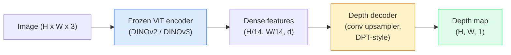

# Profundidad monocular y estimación de geometría

> Un mapa de profundidad es una imagen de un solo canal donde cada píxel es una distancia de la cámara. Predicirlo desde un marco RGB era imposible sin estéreo o LiDAR. En 2026 un codificador ViT congelado más una cabeza ligera se encuentra dentro de un pocos por ciento de la verdad de la tierra.

**Type:** Build + Use
**Languages:** Python
**Prerequisites:** Phase 4 Lesson 14 (ViT), Phase 4 Lesson 17 (Self-Supervised Vision), Phase 4 Lesson 07 (U-Net)
**Time:** ~60 minutes

## Objetivos de aprendizaje

- Distinguir la profundidad relativa y la profundidad métrica y el estado que resuelve cada modelo de producción (MiDaS, Marigold, Depth Anything V3, ZoeDepth)
- Utilice la profundidad cualquier cosa V3 (DINOv2 espina dorsal) para predecir la profundidad para imágenes individuales arbitrarias sin calibración
- Explicar por qué la profundidad monocular funciona en absoluto a partir de una sola imagen (indicios de perspectiva, gradientes de textura, antecedentes aprendidos) y lo que no puede recuperar (escala absoluta, geometría oculta)
- Elevar las detecciones 2D a puntos 3D utilizando un mapa de profundidad y las características de la cámara de agujero

## El problema

La profundidad es el eje que falta en la visión de computadora 2D. Dado RGB, sabes dónde aparecen las cosas en el plano de imagen; no sabes cuán lejos están. Los sensores de profundidad (estereo, LiDAR, tiempo de vuelo) resuelven esto directamente, pero son caros, frágiles y limitados en alcance.

Estimación de profundidad monocular  predicción de profundidad desde un solo marco RGB  utilizado para producir una salida borrosa e infiable. Para 2026 los grandes codificadores preentrenados cambiaron eso: Depth Anything V3 utiliza una columna vertebral DINOv2 congelada y produce mapas de profundidad que se generalizan en dominios interiores, exteriores, médicos y satélites. Marigold reformula la profundidad como un problema de difusión condicional. ZoeDepth regresa a distancias métricas reales.

La profundidad es también el puente entre la detección 2D y la comprensión 3D: multiplicar los píxeles de una caja detectada por la profundidad y elevar el objeto 2D en una nube de puntos 3D. Ese es el núcleo de cada sistema de oclusión AR, cada tubería de evitación de obstáculos y cada robot "recoger la taza".

## El concepto

### Profundidad relativa frente a la métrica

- **Relative depth** ordenado `z`"El pixel A está más cerca que el pixel B, pero la relación de distancias no está anclada a metros".
- **Metric depth** distancia absoluta en metros de la cámara. Requiere que el modelo haya aprendido la relación estadística entre las señales de imagen y la distancia real.

MiDaS y Depth Anything V3 producen profundidad relativa. Marigold produce profundidad relativa. ZoeDepth, UniDepth y Metric3D producen profundidad métrica. Los modelos métricos son sensibles a la intrínseca de la cámara; los modelos relativos no lo son.

### El patrón de codificación y decodificación



La profundidad de cualquier cosa V3 congela el codificador y entraña sólo el decodificador de estilo DPT. El codificador proporciona características ricas; el decodificador los interpola de nuevo a la resolución de la imagen y regresa profundidad.

### Por qué una sola imagen produce profundidad en absoluto

Una imagen 2D contiene muchas señales monoculares que se correlacionan con la profundidad:

- **Perspective** Las líneas paralelas en 3D convergen en 2D.
- **Texture gradient** las superficies lejanas tienen una textura más pequeña y densa.
- **Occlusion order** Los objetos más cercanos ocultan los más lejanos.
- **Size constancy** objetos conocidos (coches, humanos) dan una escala aproximada.
- **Atmospheric perspective** Los objetos distantes aparecen más nebulosos y más azules en escenas al aire libre.

Una ViT entrenada en miles de millones de imágenes internaliza estas señales. Con suficientes datos y una fuerte columna vertebral, la profundidad monocular alcanza una precisión razonable sin ninguna supervisión 3D explícita.

### ¿Qué profundidad monocular no puede hacer

- **Absolute metric scale**La red puede predecir "la taza está dos veces más lejos que la cuchara" sin saber si la taza está a 1 m o 10 m de distancia.
- **Occluded geometry** la parte posterior de una silla es invisible y no se puede deducir confiablemente.
- **Truly untextured / reflective surfaces**La red informa de profundidad plausible pero errónea.

### Profundidad Cualquier cosa V3 en 2026

- Vanilla DINOv2 ViT-L/14 como codificador (congelado).
- Descóderas de DPT.
- Formación en pares de imágenes de diferentes fuentes (no se necesita supervisión explícita de la profundidad más allá de la consistencia fotométrica).
- Prevé una geometría espacialmente consistente desde **an arbitrary number of visual inputs, with or without known camera poses**¿ Qué ?
- SOTA a través de la profundidad monocular, geometría de cualquier vista, renderización visual, estimación de la posición de la cámara.

Este es el modelo de entrega para llamar cuando necesites profundidad en 2026.

### Marigold  difusión para la profundidad

Marigold (Ke et al., CVPR 2024) reformula la estimación de profundidad como difusión condicional de imagen a imagen. Condicionamiento: RGB. Objetivo: mapa de profundidad. Utiliza una Red U-Net de difusión estable 2 preentrenada como columna vertebral. Los mapas de profundidad de salida son excepcionalmente nítidos en los límites de los objetos.

### Intrínsecas y la cámara de agujero de pincha

Para levantar un píxel `(u, v)`con profundidad `d`a un punto 3D `(X, Y, Z)`en las coordenadas de la cámara:

```
fx, fy, cx, cy = camera intrinsics
X = (u - cx) * d / fx
Y = (v - cy) * d / fy
Z = d
```

Los datos intrínsecos provienen de metadatos EXIF, un patrón de calibración o un estimador intrínseco monocular (Perspective Fields, UniDepth). Sin intrínsecos, todavía se puede renderizar una nube de puntos asumiendo un principio de 60 a 70 ° FOV y resolución moderada  utilizable para la visualización, no para la medición.

### Evaluación

Dos métricas estándar:

- **AbsRel**(error relativo absoluto): `mean(|d_pred - d_gt| / d_gt)`- Más bajo es mejor. 0,05-0,1 para modelos de producción.
- **delta < 1.25**(precisión del umbral): fracción de píxeles donde `max(d_pred/d_gt, d_gt/d_pred) < 1.25`Más alto es mejor. 0.9+ para SOTA.

Para la profundidad relativa (Depth Anything V3, MiDaS), la evaluación utiliza versiones invariantes de escala y cambio de ambas métricas.

```figure
depth-sweep
```

## Construye el mismo

### Paso 1: Metricas de profundidad

```python
import torch

def abs_rel_error(pred, target, mask=None):
    if mask is not None:
        pred = pred[mask]
        target = target[mask]
    return (torch.abs(pred - target) / target.clamp(min=1e-6)).mean().item()


def delta_accuracy(pred, target, threshold=1.25, mask=None):
    if mask is not None:
        pred = pred[mask]
        target = target[mask]
    ratio = torch.maximum(pred / target.clamp(min=1e-6), target / pred.clamp(min=1e-6))
    return (ratio < threshold).float().mean().item()
```

Siempre enmascarar los píxeles de profundidad inválidos (cero, NaN, saturados) antes de la evaluación.

### Paso 2: Alineación de escala y cambio

Para modelos de profundidad relativa, alinear la predicción con la verdad de la base antes de calcular las métricas.`a * pred + b = target`¿Qué es esto ?

```python
def align_scale_shift(pred, target, mask=None):
    if mask is not None:
        p = pred[mask]
        t = target[mask]
    else:
        p = pred.flatten()
        t = target.flatten()
    A = torch.stack([p, torch.ones_like(p)], dim=1)
    coeffs, *_ = torch.linalg.lstsq(A, t.unsqueeze(-1))
    a, b = coeffs[:2, 0]
    return a * pred + b
```

- ¿ Qué ?`align_scale_shift`antes de`abs_rel_error`al evaluar MiDaS/ Depth Anything.

### Paso 3: Eleva la profundidad a una nube de punto

```python
import numpy as np

def depth_to_point_cloud(depth, intrinsics):
    H, W = depth.shape
    fx, fy, cx, cy = intrinsics
    v, u = np.meshgrid(np.arange(H), np.arange(W), indexing="ij")
    z = depth
    x = (u - cx) * z / fx
    y = (v - cy) * z / fy
    return np.stack([x, y, z], axis=-1)


depth = np.random.uniform(0.5, 4.0, (240, 320))
intr = (320.0, 320.0, 160.0, 120.0)
pc = depth_to_point_cloud(depth, intr)
print(f"point cloud shape: {pc.shape}  (H, W, 3)")
```

Una función, cada aplicación levantada en 3D. Exporta la nube de puntos a`.ply`y abierto en MeshLab o CloudCompare.

### Paso 4: Prueba de humo con una escena de profundidad sintética

```python
def synthetic_depth(size=96):
    yy, xx = np.meshgrid(np.arange(size), np.arange(size), indexing="ij")
    # Floor: linear gradient from near (top) to far (bottom)
    depth = 1.0 + (yy / size) * 4.0
    # Box in the middle: closer
    mask = (np.abs(xx - size / 2) < size / 6) & (np.abs(yy - size * 0.6) < size / 6)
    depth[mask] = 2.0
    return depth.astype(np.float32)


gt = torch.from_numpy(synthetic_depth(96))
pred = gt + 0.3 * torch.randn_like(gt)  # simulated prediction
aligned = align_scale_shift(pred, gt)
print(f"before align  absRel = {abs_rel_error(pred, gt):.3f}")
print(f"after align   absRel = {abs_rel_error(aligned, gt):.3f}")
```

### Paso 5: Profundidad Cualquier uso V3 (referencia)

```python
import torch
from transformers import pipeline
from PIL import Image

pipe = pipeline(task="depth-estimation", model="LiheYoung/depth-anything-v2-large")

image = Image.open("street.jpg").convert("RGB")
out = pipe(image)
depth_np = np.array(out["depth"])
```

Tres líneas.`out["depth"]`Es una escala de gris PIL; convertido en numpy para matemáticas. para Depth Anything V3 específicamente, intercambiar el modelo id una vez que se publicó; la API no ha cambiado.

## Usalo

- **Depth Anything V3**(Meta AI / ByteDance, 2024-2026)  el modelo predeterminado para la profundidad relativa.
- **Marigold**(ETH, 2024)  Alta calidad visual, inferencia lenta.
- **UniDepth**(ETH, 2024)  profundidad métrica con estimación intrínseca de la cámara.
- **ZoeDepth**(Intel, 2023)  profundidad métrica; más antigua, todavía confiable.
- **MiDaS v3.1** herencia pero estable; buena base para la comparación.

Patrón típico de integración:

1. Llega el marco RGB.
2. El modelo de profundidad produce un mapa de profundidad.
3. El detector produce cajas.
4. Elevación de los centroides de la caja a través de la profundidad a 3D; fusionarse con la nube de punto si está disponible.
5. A raíz: oclusión de AR, planificación de la ruta, estimación del tamaño del objeto, reemplazo de estéreo.

Para el uso en tiempo real, Depth Anything V2 Small (INT8 cuantizado) alcanza ~ 30 fps en una GPU de consumo a 518x518.

## Envío

Esta lección produce:

- `outputs/prompt-depth-model-picker.md` escoge entre Depth Anything V3, Marigold, UniDepth, MiDaS dada la latencia, la necesidad métrica frente a la relativa y el tipo de escena.
- `outputs/skill-depth-to-pointcloud.md` una habilidad que construye nubes de puntos a partir de mapas de profundidad con el manejo intrínseco correcto y la exportación a`.ply`¿ Qué ?

## Los ejercicios

1. **(Easy)**Ejecutar Depth Anything V2 en cualquier 10 imágenes de su escritorio. Guardar profundidad como PNGs a escala de gris e inspeccionar. Identificar un objeto cuya profundidad prevista se ve incorrecta y explicar por qué las señales monoculares fallaron.
2. **(Medium)**Dado RGB + profundidad desde la profundidad cualquier V2, elevar a una nube de punto y renderizar con `open3d`. Comparar dos escenas (interior / exterior) y notar que parece más creíble.
3. **(Hard)**Tomar cinco pares de imágenes que difieren sólo por la posición de un objeto conocido (por ejemplo, la botella se movió 30 cm más cerca). Utilice UniDepth para predecir la profundidad métrica en ambos.

## Términos clave

| Term | What people say | What it actually means |
|------|----------------|----------------------|
| Monocular depth | "Single-image depth" | Depth estimation from one RGB frame, no stereo or LiDAR |
| Relative depth | "Ordered depth" | Ordered z-values without real-world units |
| Metric depth | "Absolute distance" | Depth in metres; requires calibration or a model trained with metric supervision |
| AbsRel | "Absolute relative error" | Mean of |d_pred - d_gt| / d_gt; standard depth metric |
| Delta accuracy | "delta < 1.25" | Fraction of pixels with prediction within 25% of ground truth |
| Pinhole camera | "fx, fy, cx, cy" | The camera model used to lift (u, v, d) to (X, Y, Z) |
| DPT | "Dense Prediction Transformer" | The conv-based decoder used on top of frozen ViT encoders for depth |
| DINOv2 backbone | "The reason it works" | Self-supervised features that generalise across domains without depth labels |

## Leer más

- [Depth Anything V3 paper page](https://depth-anything.github.io/) Profundidad monocular de SOTA con codificador DINOv2
- [Marigold (Ke et al., CVPR 2024)](https://marigoldmonodepth.github.io/) Estimación de profundidad basada en la difusión
- [UniDepth (Piccinelli et al., 2024)](https://arxiv.org/abs/2403.18913) profundidad métrica con intrínsecas
- [MiDaS v3.1 (Intel ISL)](https://github.com/isl-org/MiDaS) el límite de referencia de profundidad relativa canónica
- [DINOv3 blog post (Meta)](https://ai.meta.com/blog/dinov3-self-supervised-vision-model/) la familia de codificadores que eleva la precisión de profundidad
