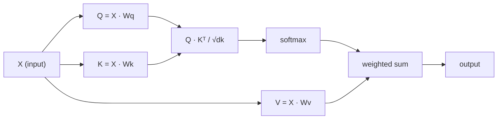

# La autoatención desde cero

> La atención es una tabla de búsqueda donde cada palabra pregunta "¿quién es importante para mí?" - y aprende la respuesta.

**Type:** Build
**Languages:** Python
**Prerequisites:** Phase 3 (Deep Learning Core), Phase 5 Lesson 10 (Sequence-to-Sequence)
**Time:** ~90 minutes

## Objetivos de aprendizaje

- Implementar la autoatención de producto punto escalada desde cero utilizando únicamente NumPy, incluidas las proyecciones de consulta/clave/valor y la suma ponderada por softmax
- Construye una capa de atención multi-cabeza que divide cabezas, calcula la atención paralela y concatenar los resultados
- Trazar cómo la matriz de atención capta las relaciones de tokens y explicar por qué la escalación por sqrt(d_k) evita la saturación de softmax
- Aplicar el enmascaramiento causal para convertir la atención bidireccional en la atención autoregresista (estilo de decodificador)

## El problema

RNNs procesan secuencias de un token a la vez. Para el momento en que alcanzas el token 50, la información del token 1 ha sido comprimida a través de 50 pasos de compresión. Las dependencias de largo alcance se aplastan en un estado oculto de tamaño fijo, un cuello de botella que ninguna cantidad de gate LSTM resuelve completamente.

El documento de atención Bahdanau de 2014 mostró la solución: deja que el decodificador mire hacia atrás en cada posición del codificador y decida cuáles son importantes para el paso actual. Pero todavía estaba conectado a un RNN. El artículo de 2017 "Attención es todo lo que necesitas" hizo una pregunta más aguda: ¿qué pasa si la atención es el único mecanismo?

La autoatención permite que cada posición de una secuencia atenda a cada otra posición en un solo paso paralelo.

## El concepto

### La analogía de búsqueda de bases de datos

Piensa en la atención como una búsqueda de base de datos suave:

```
Traditional database:
  Query: "capital of France"  -->  exact match  -->  "Paris"

Attention:
  Query: "capital of France"  -->  similarity to ALL keys  -->  weighted blend of ALL values
```

Cada token genera tres vectores:
- **Query (Q)**"¿Qué estoy buscando?"
- **Key (K)**"¿Qué tengo?"
- **Value (V)**: "¿Qué información puedo proporcionar si se selecciona?"

El producto de puntos entre una consulta y todas las teclas produce puntajes de atención. puntaje alto significa "esta clave coincide con mi consulta".

### Q, K, V Computación

Cada embedding de token se proyecta a través de tres matrices de peso aprendidas:

```
Input embeddings (sequence of n tokens, each d-dimensional):

  X = [x1, x2, x3, ..., xn]       shape: (n, d)

Three weight matrices:

  Wq  shape: (d, dk)
  Wk  shape: (d, dk)
  Wv  shape: (d, dv)

Projections:

  Q = X @ Wq    shape: (n, dk)      each token's query
  K = X @ Wk    shape: (n, dk)      each token's key
  V = X @ Wv    shape: (n, dv)      each token's value
```

Visualmente, por una señal:

```
             Wq
  x_i ------[*]------> q_i    "What am I looking for?"
       |
       |     Wk
       +----[*]------> k_i    "What do I contain?"
       |
       |     Wv
       +----[*]------> v_i    "What do I offer?"
```

### La Matriz de Atención

Una vez que tienes Q, K, V para todos los tokens, las puntuaciones de atención forman una matriz:

```
Scores = Q @ K^T    shape: (n, n)

              k1    k2    k3    k4    k5
        +-----+-----+-----+-----+-----+
   q1   | 2.1 | 0.3 | 0.1 | 0.8 | 0.2 |   <- how much q1 attends to each key
        +-----+-----+-----+-----+-----+
   q2   | 0.4 | 1.9 | 0.7 | 0.1 | 0.3 |
        +-----+-----+-----+-----+-----+
   q3   | 0.2 | 0.6 | 2.3 | 0.5 | 0.1 |
        +-----+-----+-----+-----+-----+
   q4   | 0.9 | 0.1 | 0.4 | 1.7 | 0.6 |
        +-----+-----+-----+-----+-----+
   q5   | 0.1 | 0.3 | 0.2 | 0.5 | 2.0 |
        +-----+-----+-----+-----+-----+

Each row: one token's attention over the entire sequence
```

Observe una consulta a la vez barrida las teclas: cada fila marca cada token, softmax convierte las puntuaciones en pesas, y el vector de contexto es la mezcla ponderada de valores.

```figure
attention-matrix
```

### ¿Por qué la escala?

Los productos de puntos crecen con la dimensión dk. Si dk = 64, los productos de puntos pueden estar en el rango de decenas, empujando la softmax a regiones donde los gradientes desaparecen.

```
Scaled scores = (Q @ K^T) / sqrt(dk)
```

Esto mantiene los valores en un rango en el que softmax produce gradientes útiles.

### Softmax convierte las puntuaciones en pesas

Softmax convierte las puntuaciones en bruto en una distribución de probabilidades en cada fila:

```
Raw scores for q1:   [2.1, 0.3, 0.1, 0.8, 0.2]
                            |
                         softmax
                            |
Attention weights:   [0.52, 0.09, 0.07, 0.14, 0.08]   (sums to ~1.0)
```

Ahora cada token tiene un conjunto de pesas que dicen cuánto atender a cada otro token.

### Sumas ponderadas de valores

La salida final para cada token es una suma ponderada de todos los vectores de valor:

```
output_i = sum( attention_weight[i][j] * v_j  for all j )

For token 1:
  output_1 = 0.52 * v1 + 0.09 * v2 + 0.07 * v3 + 0.14 * v4 + 0.08 * v5
```

### Línea de conducto completa



Formula en una línea:

```
Attention(Q, K, V) = softmax( Q @ K^T / sqrt(dk) ) @ V
```

```figure
softmax-attention-scaling
```

## Construye el mismo

### Paso 1: Softmax desde cero

Softmax convierte logits en probabilidades.

```python
import numpy as np

def softmax(x):
    shifted = x - np.max(x, axis=-1, keepdims=True)
    exp_x = np.exp(shifted)
    return exp_x / np.sum(exp_x, axis=-1, keepdims=True)

logits = np.array([2.0, 1.0, 0.1])
print(f"logits:  {logits}")
print(f"softmax: {softmax(logits)}")
print(f"sum:     {softmax(logits).sum():.4f}")
```

### Paso 2: Atención a punto del producto

La función central toma las matrices Q, K, V y devuelve la salida de atención más la matriz de peso.

```python
def scaled_dot_product_attention(Q, K, V):
    dk = Q.shape[-1]
    scores = Q @ K.T / np.sqrt(dk)
    weights = softmax(scores)
    output = weights @ V
    return output, weights
```

### Paso 3: Clase de autoatención con proyecciones aprendidas

Un módulo de autoatención completo con matrices de peso Wq, Wk, Wv iniciadas con escalación similar a Xavier.

```python
class SelfAttention:
    def __init__(self, d_model, dk, dv, seed=42):
        rng = np.random.default_rng(seed)
        scale = np.sqrt(2.0 / (d_model + dk))
        self.Wq = rng.normal(0, scale, (d_model, dk))
        self.Wk = rng.normal(0, scale, (d_model, dk))
        scale_v = np.sqrt(2.0 / (d_model + dv))
        self.Wv = rng.normal(0, scale_v, (d_model, dv))
        self.dk = dk

    def forward(self, X):
        Q = X @ self.Wq
        K = X @ self.Wk
        V = X @ self.Wv
        output, weights = scaled_dot_product_attention(Q, K, V)
        return output, weights
```

### Paso 4: ejecutarlo en una frase

Crear falsas incrustaciones para una oración y ver los pesos de atención.

```python
sentence = ["The", "cat", "sat", "on", "the", "mat"]
n_tokens = len(sentence)
d_model = 8
dk = 4
dv = 4

rng = np.random.default_rng(42)
X = rng.normal(0, 1, (n_tokens, d_model))

attn = SelfAttention(d_model, dk, dv, seed=42)
output, weights = attn.forward(X)

print("Attention weights (each row: where that token looks):\n")
print(f"{'':>6}", end="")
for token in sentence:
    print(f"{token:>6}", end="")
print()

for i, token in enumerate(sentence):
    print(f"{token:>6}", end="")
    for j in range(n_tokens):
        w = weights[i][j]
        print(f"{w:6.3f}", end="")
    print()
```

### Paso 5: Visualizar la atención con una mapa de calor ASCII

Mapa de los pesos de atención a los personajes para una visión rápida.

```python
def ascii_heatmap(weights, tokens, chars=" ░▒▓█"):
    n = len(tokens)
    print(f"\n{'':>6}", end="")
    for t in tokens:
        print(f"{t:>6}", end="")
    print()

    for i in range(n):
        print(f"{tokens[i]:>6}", end="")
        for j in range(n):
            level = int(weights[i][j] * (len(chars) - 1) / weights.max())
            level = min(level, len(chars) - 1)
            print(f"{'  ' + chars[level] + '   '}", end="")
        print()

ascii_heatmap(weights, sentence)
```

## Usalo

El de PyTorch.`nn.MultiheadAttention`hace exactamente lo que construimos, más la división multi-cabeza y la proyección de salida:

```python
import torch
import torch.nn as nn

d_model = 8
n_heads = 2
seq_len = 6

mha = nn.MultiheadAttention(embed_dim=d_model, num_heads=n_heads, batch_first=True)

X_torch = torch.randn(1, seq_len, d_model)

output, attn_weights = mha(X_torch, X_torch, X_torch)

print(f"Input shape:            {X_torch.shape}")
print(f"Output shape:           {output.shape}")
print(f"Attention weight shape: {attn_weights.shape}")
print(f"\nAttn weights (averaged over heads):")
print(attn_weights[0].detach().numpy().round(3))
```

La diferencia clave: la atención multi-cabeza ejecuta múltiples funciones de atención en paralelo, cada una con sus propias proyecciones Q, K, V de tamaño dk = d_modelo / n_cabezas, luego concatena los resultados. Esto permite que el modelo atienda a diferentes tipos de relación simultáneamente.

## Envío

Esta lección produce:
- `outputs/prompt-attention-explainer.md`- una solicitud para explicar la atención a través de la analogía de búsqueda de la base de datos

## Los ejercicios

1. Modificar`scaled_dot_product_attention`para aceptar una matriz de máscara opcional que establece ciertas posiciones a infinito negativo antes de softmax (es así como funciona el enmascaramiento causal/decodificador)
2. Implemente la atención multi-cabeza desde cero: divide Q, K, V en `n_heads`trozos, ejecutar la atención en cada uno, concatena, y proyectar a través de una matriz de peso final Wo
3. Tomar dos oraciones diferentes de la misma longitud, alimentarlas a través de la misma instancia de autoatención, y comparar sus patrones de atención. ¿Qué cambia? ¿Qué permanece igual?

## Términos clave

| Term | What people say | What it actually means |
|------|----------------|----------------------|
| Query (Q) | "The question vector" | A learned projection of the input that represents what information this token is looking for |
| Key (K) | "The label vector" | A learned projection that represents what information this token contains, matched against queries |
| Value (V) | "The content vector" | A learned projection carrying the actual information that gets aggregated based on attention scores |
| Scaled dot-product attention | "The attention formula" | softmax(QK^T / sqrt(dk)) @ V - scaling prevents softmax saturation in high dimensions |
| Self-attention | "The token looks at itself and others" | Attention where Q, K, V all come from the same sequence, letting every position attend to every other position |
| Attention weights | "How much focus" | A probability distribution over positions, produced by softmax over scaled dot products |
| Multi-head attention | "Parallel attention" | Running multiple attention functions with different projections, then concatenating results for richer representations |

## Leer más

- [Attention Is All You Need (Vaswani et al., 2017)](https://arxiv.org/abs/1706.03762)- el papel transformador original
- [The Illustrated Transformer (Jay Alammar)](https://jalammar.github.io/illustrated-transformer/)- mejor paseo visual de la arquitectura completa
- [The Annotated Transformer (Harvard NLP)](https://nlp.seas.harvard.edu/annotated-transformer/)- implementación línea por línea de PyTorch con explicaciones
