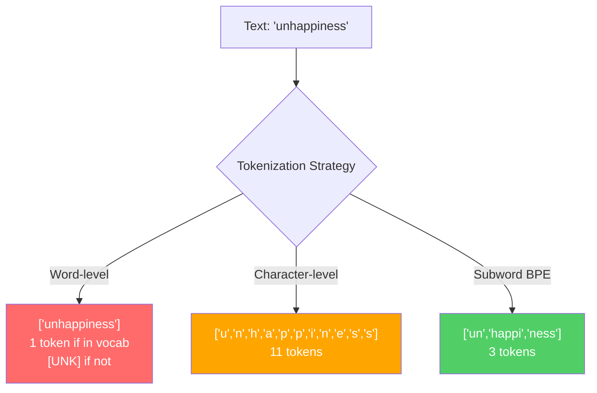
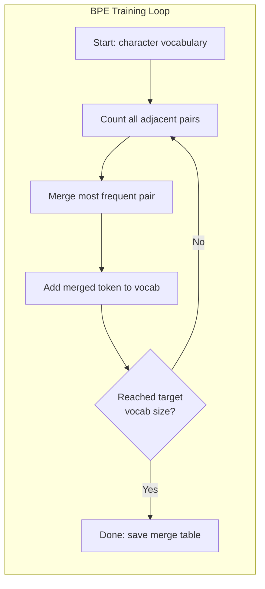
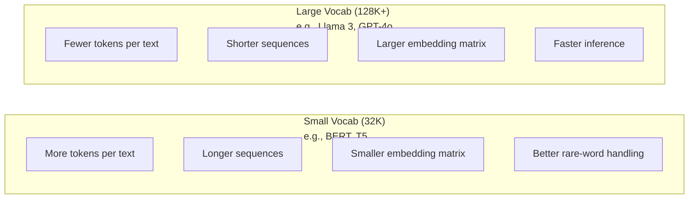

# Los tokenizers: BPE, WordPiece, SentencePiece

> El LLM no lee inglés, lee números enteros, el tokenizer decide si esos números enteros tienen significado o lo desperdician.

**Type:** Build
**Languages:** Python
**Prerequisites:** Phase 05 (NLP Foundations)
**Time:** ~90 minutes

## Objetivos de aprendizaje

- Implemente los algoritmos de tokenización BPE, WordPiece y Unigram desde cero y compare sus estrategias de fusión
- Explicar cómo el tamaño del vocabulario afecta la eficiencia del modelo: demasiado pequeño crea secuencias largas, desechos demasiado grandes incorporan parámetros
- Analiza los artefactos de tokenization en diferentes idiomas y códigos, identificando dónde se descomponen los tokenizers específicos
- Utilice las bibliotecas de tokens y frases para tokenizar el texto e inspeccionar las identidades de tokens resultantes

## El problema

Su LLM no lee inglés, no lee ningún idioma, lee números.

La brecha entre "Hello, mundo!" y [15496, 11, 995, 0] es el tokenizer. Cada palabra, cada espacio, cada marca de puntuación debe convertirse en un número entero antes de que un modelo pueda procesarlo. Esta conversión no es neutral.

Si se equivocan, su modelo desperdicia la capacidad de codificar palabras comunes con múltiples tokens. "Desafortunadamente" se convierte en cuatro tokens en lugar de uno. Su ventana de contexto de 128K se redujo un 75% para el texto pesado en palabras de múltiples sílabas. Si lo haces bien, la misma ventana de contexto tiene el doble de significado. La diferencia entre "este modelo maneja el código bien" y "este modelo se ahoga en Python" a menudo se reduce a cómo se entrenó el tokenizer.

Cada llamada de API que realice a GPT-4 o Claude tiene un precio por token. Cada token que su modelo genera costará calcular. Cuanto menos tokens se requieren para representar una salida, más rápido será la inferencia de extremo a extremo.

## El concepto

### Tres enfoques que fracasaron (y uno que ganó)

Hay tres maneras obvias de convertir texto en números. Dos de ellas no funcionan a escala.

**Word-level tokenization**El "gato" se divide en espacios y puntuación. "El gato se sentó" se convierte en ["El", "gato", "sat"]. Simple. Pero ¿qué pasa con "tokenization"? O "GPT-4o"? O una palabra compuesta alemana como "Geschwindigkeitsbegrenzung"?`[UNK]`El inglés solo tiene más de un millón de formas de palabras. Añade código, URL, notación científica y otras 100 lenguas y necesitas un vocabulario infinito.

**Character-level tokenization**"Hello" se convierte en ["h", "e", "l", "l", "o"]. El vocabulario es pequeño (algunas cientos de caracteres). Ningún símbolo desconocido nunca. Pero las secuencias se vuelven extremadamente largas. Una oración que sería de 10 símbolos de nivel de palabras se convierte en 50 símbolos de nivel de caracteres. El modelo debe aprender que "t", "h", "e" juntos significan "el" -- la capacidad de atención que quema sobre algo que un humano aprende a los tres años.

**Subword tokenization**Las palabras comunes permanecen completas: "el" es un símbolo. Las palabras raras se descomponen en piezas significativas: "insufetibilidad" se vuelve ["un", "happy", "ness"]. El vocabulario se mantiene manejable (30K a 128K tokens). Las secuencias se mantienen cortas. Los tokens desconocidos desaparecen esencialmente porque cualquier palabra se puede construir de piezas de subpalabra.

Cada LLM moderno utiliza tokenización de palabras. GPT-2, GPT-4, BERT, Llama 3, Claude. Todos ellos. La pregunta es qué algoritmo.



### BPE: codificación de pares de byte

BPE es un codicioso algoritmo de compresión reutilizado para tokenizar.

Comience con caracteres individuales, cuenta cada par adyacente en el cuerpo de entrenamiento, fusiona el par más frecuente en un nuevo token, repita hasta que alcances el tamaño de tu vocabulario objetivo.

```figure
tokenizer-bpe
```

Aquí está BPE corriendo en un pequeño corpus con las palabras "bajo", "bajo", y "más nuevo":

```
Corpus (with word frequencies):
  "lower"  x5
  "lowest" x2
  "newest" x6

Step 0 -- Start with characters:
  l o w e r       (x5)
  l o w e s t     (x2)
  n e w e s t     (x6)

Step 1 -- Count adjacent pairs:
  (e,s): 8    (s,t): 8    (l,o): 7    (o,w): 7
  (w,e): 13   (e,r): 5    (n,e): 6    ...

Step 2 -- Merge most frequent pair (w,e) -> "we":
  l o we r        (x5)
  l o we s t      (x2)
  n e we s t      (x6)

Step 3 -- Recount and merge (e,s) -> "es":
  l o we r        (x5)
  l o we s t      (x2)    <- 'es' only forms from 'e'+'s', not 'we'+'s'
  n e we s t      (x6)    <- wait, the 'e' before 'we' and 's' after 'we'

Actually tracking this precisely:
  After "we" merge, remaining pairs:
  (l,o): 7   (o,we): 7   (we,r): 5   (we,s): 8
  (s,t): 8   (n,e): 6    (e,we): 6

Step 3 -- Merge (we,s) -> "wes" or (s,t) -> "st" (tied at 8, pick first):
  Merge (we,s) -> "wes":
  l o we r        (x5)
  l o wes t       (x2)
  n e wes t       (x6)

Step 4 -- Merge (wes,t) -> "west":
  l o we r        (x5)
  l o west        (x2)
  n e west        (x6)

...continue until target vocab size reached.
```

Para codificar un nuevo texto, aplicar fusiones en el orden en que se aprendieron. El cuerpo de entrenamiento determina qué fusiones existen, y esa elección moldea permanentemente lo que el modelo ve.



### BPE de nivel byte (GPT-2, GPT-3, GPT-4)

El BPE estándar opera en caracteres Unicode. El BPE de nivel de byte opera en bytes crudos (0-255). Esto le da un vocabulario base de exactamente 256, maneja cualquier lenguaje o codificación, y nunca produce un token desconocido.

GPT-2 introdujo este enfoque. El vocabulario base cubre todos los bytes posibles. BPE se integra sobre eso. La biblioteca de tiktoken de OpenAI implementa BPE a nivel de byte con estos tamaños de vocabulario:

- GPT-2: 50,257 tokens
- GPT-3.5/GPT-4: ~100,256 tokens (codigo de base cl100k)
- GPT-4o: 200 019 tokens (codificación base o200k)

### El proyecto de ley de la UE

WordPiece se parece a BPE pero se fusiona de manera diferente. En lugar de frecuencia bruta, maximiza la probabilidad de los datos de entrenamiento:

```
BPE merge criterion:      count(A, B)
WordPiece merge criterion: count(AB) / (count(A) * count(B))
```

BPE pregunta: "¿Qué pareja aparece más a menudo?" WordPiece pregunta: "¿Qué pareja aparece juntos más a menudo de lo que se espera por casualidad?" Esta sutil diferencia produce diferentes vocabularios. WordPiece favorece las fusiones donde la coincidencia es sorprendente, no sólo frecuente.

WordPiece también utiliza un prefijo "##" para las subpalas de continuación:

```
"unhappiness" -> ["un", "##happi", "##ness"]
"embedding"   -> ["em", "##bed", "##ding"]
```

El prefijo "##" le dice que esta pieza continúa un token anterior. BERT utiliza WordPiece con un vocabulario de 30,522 tokens. Cada variante de BERT - DistilBERT, el tokenizer de RoBERTa es en realidad BPE, pero BERT en sí mismo es WordPiece.

### La frasePiece (Llama, T5)

SentencePiece trata la entrada como un flujo crudo de caracteres Unicode, incluyendo espacio blanco. No hay paso de pre-tokenización. No hay reglas específicas del idioma sobre los límites de palabras. Esto lo hace genuinamente agnóstico del idioma - funciona en chino, japonés, tailandés y otros idiomas donde los espacios no separan palabras.

SentencePiece admite dos algoritmos:
- **BPE mode**: la misma lógica de fusión que la BPE estándar, aplicada a las secuencias de caracteres en bruto
- **Unigram mode**El inverso de BPE - podar en lugar de fusionarse.

Llama 2 utiliza SentencePiece BPE con un vocabulario de 32.000 tokens. T5 utiliza SentencePiece Unigram con 32.000 tokens. Nota: Llama 3 cambió a un tokenizer BPE basado en byte-level basado en tiktoken con 128.256 tokens.

### Compromiso de tamaño del vocabulario

Esta es una verdadera decisión de ingeniería con consecuencias medibles.



Para un vocabulario de 128K con embebidos de 4.096 dimensiones, la matriz de embebido sola es de 128.000 x 4.096 = 524 millones de parámetros. Para un vocabulario de 32K, es de 131 millones de parámetros. Eso es una diferencia de parámetros de 400M de la elección del tokenizer sola.

Pero los vocabularios más grandes comprimen el texto de manera más agresiva. El mismo párrafo en inglés que toma 100 tokens con un vocabulario de 32K podría tomar 70 tokens con un vocabulario de 128K. Eso significa 30% menos pasees adelante durante la generación. Para un modelo que atiende millones de solicitudes, eso es una reducción directa en el costo de cálculo.

La tendencia es clara: el tamaño del vocabulario está creciendo. GPT-2 utilizó 50.257. GPT-4 utiliza ~100K. Llama 3 utiliza 128K. GPT-4o utiliza 200K.

| Model | Vocab Size | Tokenizer Type | Avg Tokens per English Word |
|-------|-----------|----------------|---------------------------|
| BERT | 30,522 | WordPiece | ~1.4 |
| GPT-2 | 50,257 | Byte-level BPE | ~1.3 |
| Llama 2 | 32,000 | SentencePiece BPE | ~1.4 |
| GPT-4 | ~100,256 | Byte-level BPE | ~1.2 |
| Llama 3 | 128,256 | Byte-level BPE (tiktoken) | ~1.1 |
| GPT-4o | 200,019 | Byte-level BPE | ~1.0 |

### El impuesto multilingüe

Los tokenizadores entrenados principalmente en inglés son brutales con otros idiomas. El texto coreano en el tokenizer de GPT-2 promedia 2-3 tokens por palabra. El chino puede ser peor. Esto significa que un usuario coreano tiene efectivamente una ventana de contexto que es la mitad del tamaño de un usuario inglés, pagando el mismo precio por una menor densidad de información.

Es por eso que Llama 3 cuadruplicó su vocabulario de 32K a 128K. Más tokens dedicados a escritos no ingleses significa una compresión más justa entre idiomas.

```figure
tokenizer-tradeoff
```

## Construye el mismo

### Paso 1: Tokenizaje de nivel de caracteres

Comience en la base. Un tokenizer de nivel de caracteres mapea cada carácter a su punto de código Unicode. No se necesita entrenamiento. No hay tokens desconocidos. Sólo un mapeo directo.

```python
class CharTokenizer:
    def encode(self, text):
        return [ord(c) for c in text]

    def decode(self, tokens):
        return "".join(chr(t) for t in tokens)
```

"hola" se convierte en [104, 101, 108, 108, 111]. Cada personaje es su propio símbolo. Esta es la línea de base en la que mejoramos.

### Paso 2: Tokenizaje BPE desde cero

La implementación real. Entrenamos en bytes crudos (como GPT-2), contamos pares, fusionamos los más frecuentes, y registramos cada fusión en orden.

```python
from collections import Counter

class BPETokenizer:
    def __init__(self):
        self.merges = {}
        self.vocab = {}

    def _get_pairs(self, tokens):
        pairs = Counter()
        for i in range(len(tokens) - 1):
            pairs[(tokens[i], tokens[i + 1])] += 1
        return pairs

    def _merge_pair(self, tokens, pair, new_token):
        merged = []
        i = 0
        while i < len(tokens):
            if i < len(tokens) - 1 and tokens[i] == pair[0] and tokens[i + 1] == pair[1]:
                merged.append(new_token)
                i += 2
            else:
                merged.append(tokens[i])
                i += 1
        return merged

    def train(self, text, num_merges):
        tokens = list(text.encode("utf-8"))
        self.vocab = {i: bytes([i]) for i in range(256)}

        for i in range(num_merges):
            pairs = self._get_pairs(tokens)
            if not pairs:
                break
            best_pair = max(pairs, key=pairs.get)
            new_token = 256 + i
            tokens = self._merge_pair(tokens, best_pair, new_token)
            self.merges[best_pair] = new_token
            self.vocab[new_token] = self.vocab[best_pair[0]] + self.vocab[best_pair[1]]

        return self

    def encode(self, text):
        tokens = list(text.encode("utf-8"))
        for pair, new_token in self.merges.items():
            tokens = self._merge_pair(tokens, pair, new_token)
        return tokens

    def decode(self, tokens):
        byte_sequence = b"".join(self.vocab[t] for t in tokens)
        return byte_sequence.decode("utf-8", errors="replace")
```

El bucle de entrenamiento es el núcleo de BPE: contar pares, fusionar el ganador, repetir.`num_merges`En las rondas, el vocabulario crece de 256 (byte base) a 256 + num_merges.

El codificación aplica fusiones en el orden exacto en que se aprendieron. Esto importa. Si la fusión 1 creó "th" y la fusión 5 creó "the", el codificación debe aplicar la fusión 1 primero para que "the" pueda formarse a partir de "th" + "e" en la fusión 5.

La decodificación es lo contrario: buscar cada ID de token en el vocabulario, concatenar los bytes, decodificar a UTF-8.

### Paso 3: Encodizar y Decodificar viaje de ida y vuelta

```python
corpus = (
    "The cat sat on the mat. The cat ate the rat. "
    "The dog sat on the log. The dog ate the frog. "
    "Natural language processing is the study of how computers "
    "understand and generate human language. "
    "Tokenization is the first step in any NLP pipeline."
)

tokenizer = BPETokenizer()
tokenizer.train(corpus, num_merges=40)

test_sentences = [
    "The cat sat on the mat.",
    "Natural language processing",
    "tokenization pipeline",
    "unhappiness",
]

for sentence in test_sentences:
    encoded = tokenizer.encode(sentence)
    decoded = tokenizer.decode(encoded)
    raw_bytes = len(sentence.encode("utf-8"))
    ratio = len(encoded) / raw_bytes
    print(f"'{sentence}'")
    print(f"  Tokens: {len(encoded)} (from {raw_bytes} bytes) -- ratio: {ratio:.2f}")
    print(f"  Roundtrip: {'PASS' if decoded == sentence else 'FAIL'}")
```

La relación de compresión le dice cuán eficaz es el tokenizer. Una relación de 0,50 significa que el tokenizer comprimió el texto a la mitad de los tokens que los bytes crudos. Más bajo es mejor. En el cuerpo de entrenamiento, la proporción será buena. En textos fuera de distribución como "insatisfacción" (que no aparece en el corpus), la proporción será peor - el tokenizer vuelve a codificar a nivel de caracteres para patrones invisibles.

### Paso 4: Compare con el tiktoken

```python
import tiktoken

enc = tiktoken.get_encoding("cl100k_base")

texts = [
    "The cat sat on the mat.",
    "unhappiness",
    "Hello, world!",
    "def fibonacci(n): return n if n < 2 else fibonacci(n-1) + fibonacci(n-2)",
    "Geschwindigkeitsbegrenzung",
]

for text in texts:
    our_tokens = tokenizer.encode(text)
    tiktoken_tokens = enc.encode(text)
    tiktoken_pieces = [enc.decode([t]) for t in tiktoken_tokens]
    print(f"'{text}'")
    print(f"  Our BPE:   {len(our_tokens)} tokens")
    print(f"  tiktoken:  {len(tiktoken_tokens)} tokens -> {tiktoken_pieces}")
```

Tiktoken utiliza el mismo algoritmo pero se entrenó en cientos de gigabytes de texto con 100.000 fusiones. El algoritmo es idéntico. La diferencia es los datos de entrenamiento y el número de fusiones. Su tokenizer entrenado en un párrafo con 40 fusiones no puede competir con las fusiones de tiktoken de 100K en un corpus masivo. Pero el mecanismo es el mismo.

### Paso 5: Análisis del vocabulario

```python
def analyze_vocabulary(tokenizer, test_texts):
    total_tokens = 0
    total_chars = 0
    token_usage = Counter()

    for text in test_texts:
        encoded = tokenizer.encode(text)
        total_tokens += len(encoded)
        total_chars += len(text)
        for t in encoded:
            token_usage[t] += 1

    print(f"Vocabulary size: {len(tokenizer.vocab)}")
    print(f"Total tokens across all texts: {total_tokens}")
    print(f"Total characters: {total_chars}")
    print(f"Avg tokens per character: {total_tokens / total_chars:.2f}")

    print(f"\nMost used tokens:")
    for token_id, count in token_usage.most_common(10):
        token_bytes = tokenizer.vocab[token_id]
        display = token_bytes.decode("utf-8", errors="replace")
        print(f"  Token {token_id:4d}: '{display}' (used {count} times)")

    unused = [t for t in tokenizer.vocab if t not in token_usage]
    print(f"\nUnused tokens: {len(unused)} out of {len(tokenizer.vocab)}")
```

Esto revela la distribución Zipf en su vocabulario. Algunos tokens dominan (espacios, "el", "e"). La mayoría de los tokens son raramente utilizados. Los tokenizadores de producción optimizan para esta distribución - patrones comunes obtienen IDs de tokens cortos, patrones raros obtienen representaciones más largas.

## Usalo

Su BPE de arañazo funciona.

### Tiktoken (OpenAI)

```python
import tiktoken

enc = tiktoken.get_encoding("cl100k_base")

text = "Tokenizers convert text to integers"
tokens = enc.encode(text)
print(f"Tokens: {tokens}")
print(f"Pieces: {[enc.decode([t]) for t in tokens]}")
print(f"Roundtrip: {enc.decode(tokens)}")
```

Tiktoken está escrito en Rust con enlaces de Python. codifica millones de tokens por segundo. El mismo algoritmo BPE, implementación de fuerza industrial.

### Embracing Face tokenizers

```python
from tokenizers import Tokenizer
from tokenizers.models import BPE
from tokenizers.trainers import BpeTrainer
from tokenizers.pre_tokenizers import ByteLevel

tokenizer = Tokenizer(BPE())
tokenizer.pre_tokenizer = ByteLevel()

trainer = BpeTrainer(vocab_size=1000, special_tokens=["<pad>", "<eos>", "<unk>"])
tokenizer.train(["corpus.txt"], trainer)

output = tokenizer.encode("The cat sat on the mat.")
print(f"Tokens: {output.tokens}")
print(f"IDs: {output.ids}")
```

La biblioteca de tokenizers de Hugging Face también es Rust bajo el capó. Entrena BPE en corpora a escala de gigabyte en segundos. Esto es lo que usas cuando entrenas tu propio modelo.

### Cargando el Tokenizer de Llama

```python
from transformers import AutoTokenizer

tokenizer = AutoTokenizer.from_pretrained("meta-llama/Llama-3.1-8B")

text = "Tokenizers are the unsung heroes of LLMs"
tokens = tokenizer.encode(text)
print(f"Token IDs: {tokens}")
print(f"Tokens: {tokenizer.convert_ids_to_tokens(tokens)}")
print(f"Vocab size: {tokenizer.vocab_size}")

multilingual = ["Hello world", "Hola mundo", "Bonjour le monde"]
for text in multilingual:
    ids = tokenizer.encode(text)
    print(f"'{text}' -> {len(ids)} tokens")
```

El vocabulario de 128K de Llama 3 comprime texto no inglés significativamente mejor que el vocabulario de 50K de GPT-2. Puedes verificar esto tú mismo - codificar la misma oración en varios idiomas y contar los tokens.

## Envío

Esta lección produce`outputs/prompt-tokenizer-analyzer.md`-- una solicitud reutilizable que analiza la eficiencia de tokenización para cualquier combinación de texto y modelo.

## Los ejercicios

1. Modifique el tokenizer BPE para imprimir el vocabulario en cada paso de fusión. Observe cómo "t" + "h" se convierte en "th", luego "th" + "e" se convierte en "the".

2. Añadir fichas especiales (`<pad>`¿ Qué ?`<eos>`¿ Qué ?`<unk>`) al tokenizador BPE. Asesíñales las identidades 0, 1, 2 y cambia todas las demás tokens en consecuencia. Implemente un paso de pre-tokenización que se divide en espacio blanco antes de ejecutar BPE.

3. Implemente el criterio de fusión de WordPiece (ratio de probabilidad en lugar de frecuencia). Entrenar tanto BPE como WordPiece en el mismo corpus con el mismo número de fusiones. Compara los vocabularios resultantes - ¿cuál produce subpalabras más significativas lingüísticamente?

4. Construye un índice de eficiencia de tokenizaje multilingüe. Tome 10 oraciones en inglés, español, chino, coreano y árabe. Tokenize cada una con un token (cl100k_base) y mide los tokens promedio por carácter. Cuantifique el "impuesto multilingüe" para cada idioma.

5. Entrenar su tokenizer BPE en un corpus más grande (descargar un artículo de Wikipedia). Aúna el número de fusiones para lograr una relación de compresión dentro del 10% de los tokens en ese mismo texto. Esto le obliga a entender la relación entre el tamaño del corpus, el conteo de fusiones y la calidad de compresión.

## Términos clave

| Term | What people say | What it actually means |
|------|----------------|----------------------|
| Token | "A word" | A unit in the model's vocabulary -- could be a character, subword, word, or multi-word chunk |
| BPE | "Some compression thing" | Byte Pair Encoding -- iteratively merge the most frequent adjacent pair of tokens until the target vocabulary size is reached |
| WordPiece | "BERT's tokenizer" | Like BPE but merges maximize the likelihood ratio count(AB)/(count(A)*count(B)) instead of raw frequency |
| SentencePiece | "A tokenizer library" | A language-agnostic tokenizer that operates on raw Unicode without pre-tokenization, supporting BPE and Unigram algorithms |
| Vocabulary size | "How many words it knows" | The total number of unique tokens: GPT-2 has 50,257, BERT has 30,522, Llama 3 has 128,256 |
| Fertility | "Not a tokenizer term" | Average number of tokens per word -- measures tokenizer efficiency across languages (1.0 is perfect, 3.0 means the model works three times harder) |
| Byte-level BPE | "GPT's tokenizer" | BPE operating on raw bytes (0-255) instead of Unicode characters, guaranteeing no unknown tokens for any input |
| Merge table | "The tokenizer file" | Ordered list of pair merges learned during training -- this IS the tokenizer, and order matters |
| Pre-tokenization | "Splitting on spaces" | Rules applied before subword tokenization: whitespace splitting, digit separation, punctuation handling |
| Compression ratio | "How efficient the tokenizer is" | Tokens produced divided by input bytes -- lower means better compression and faster inference |

## Leer más

- [Sennrich et al., 2016 -- "Neural Machine Translation of Rare Words with Subword Units"](https://arxiv.org/abs/1508.07909)-- el documento que introdujo BPE para la PNL, convirtiendo un algoritmo de compresión de 1994 en la base de la tokenización moderna
- [Kudo & Richardson, 2018 -- "SentencePiece: A simple and language independent subword tokenizer"](https://arxiv.org/abs/1808.06226)-- Tokenización lingüística-agnóstica que hizo prácticos los modelos multilingües
- [OpenAI tiktoken repository](https://github.com/openai/tiktoken)-- Implementación de BPE de producción en Rust con enlaces de Python, utilizado por GPT-3.5/4/4o
- [Hugging Face Tokenizers documentation](https://huggingface.co/docs/tokenizers)-- formación de tokenizadores de grado de producción con rendimiento Rust
