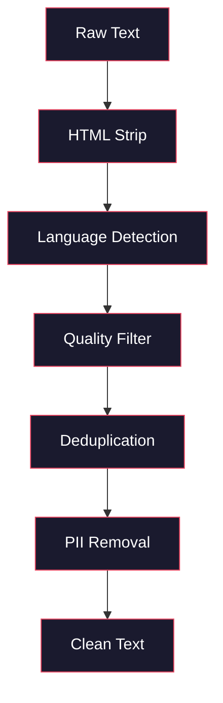
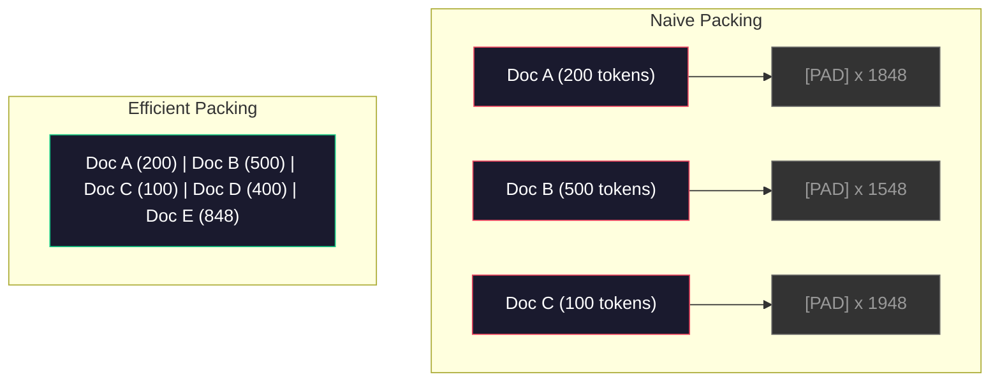

# Los canales de datos para la formación previa

> El modelo es un espejo que refleja los datos que le das, le das basura, refleja basura con fluidez perfecta.

**Type:** Build
**Languages:** Python
**Prerequisites:** Phase 10, Lessons 01-02 (Tokenizers, Building a Tokenizer)
**Time:** ~90 minutes

## Objetivos de aprendizaje

- Construir una tubería de datos de transmisión que tokeniza, trozos, mezcla y lotes de terabytes de texto sin cargarlo todo en la memoria
- Implementar filtros de calidad de datos (desduplicación, detección de lenguaje, filtración de contenido) utilizados en tuberías reales de pre-entrenamiento
- Crear secuencias de entrenamiento de longitud fija con máscaras de atención adecuadas y manejo de los límites de los documentos
- Descarga de la línea de perfil para garantizar que el cargador de datos siga el ritmo de entrenamiento de la GPU

## El problema

Tienes un tokenizer, ahora necesitas datos.

No un conjunto de datos. No un archivo CSV. Terabytes de texto, limpiados, deduplicados, filtrados por calidad, tokenizados en secuencias de longitud fija, y servidos en lotes aleatorios lo suficientemente rápido como para que su grupo de 8 GPU nunca espere al siguiente lote.

La mayoría de la gente piensa que entrenar un LLM es sobre la arquitectura del modelo. No lo es. Llama 3 usó 15.6 billones de tokens. GPT-3 usó 300 mil millones. DeepSeek-V2 usó 8.1 billones. La arquitectura en los tres es aproximadamente la misma: bloques de transformador apilados con capas de atención y retroalimentación. La diferencia en la calidad de salida proviene en gran parte de los datos.

El artículo de Chinchilla de DeepMind hizo esto con precisión. Para un presupuesto informático determinado, existe una relación óptima de parámetros del modelo con tokens de formación. Chinchilla mostró que la mayoría de los modelos en 2022 estaban dramáticamente poco capacitados -- tenían demasiados parámetros para la cantidad de datos que veían. Un modelo de parámetro 70B entrenado en 1,4 billones de tokens (Chinchilla-óptimo) superó a un modelo 280B entrenado en 300 mil millones de tokens (Gopher).

Su línea de datos determina si su modelo aprende el lenguaje o aprende el ruido.

## El concepto

### De dónde provienen los datos

Cada modelo de lenguaje grande se entrena en una mezcla de fuentes. La composición exacta es un secreto muy bien guardado para la mayoría de los laboratorios, pero sabemos lo suficiente para entender las categorías.

| Source | Size | Quality | Used By |
|--------|------|---------|---------|
| Common Crawl | ~250 TB raw | Low (needs heavy filtering) | GPT-3, Llama, most open models |
| Wikipedia | ~20 GB | High | Every major LLM |
| GitHub code | ~1 TB+ | Medium (lots of duplicates, dead code) | StarCoder, CodeLlama, DeepSeek-Coder |
| Books (BookCorpus, Pile) | ~100 GB | High | GPT-2, GPT-3, early models |
| Academic papers (arXiv, S2ORC) | ~100 GB | High for STEM | Llama, Galactica |
| StackOverflow, Reddit | ~100 GB | Medium | Llama, Falcon |
| Curated web (C4, RefinedWeb) | ~5 TB | Medium-High (pre-filtered) | T5, Falcon |

Llama 3 reveló su mezcla de datos: aproximadamente el 50% de datos web, el 25% de código, el 13% de libros y documentos académicos, el 8% de datos matemáticos y el 4% de datos web multilingües.

La proporción importa tanto como el tamaño total. Demasiados datos web y el modelo se convierte en un loro Reddit. Demasiado poco código y no puede programar. Demasiado poco matemáticas y no logra razonar.

### Limpieza de datos

Los datos de la web son sucios.

- Etiquetas HTML y JavaScript
- Cabezas de calderas, piezas, menús de navegación
- Páginas duplicadas (exactas y casi duplicadas)
- Spam generado por máquina
- Información de identificación personal (PII)
- Texto de baja calidad (listas de palabras clave, spam de SEO)
- Contenido no textual codificado como texto

La limpieza de esto no es opcional. Es la diferencia entre un modelo que genera párrafos coherentes y uno que saca etiquetas HTML mezcladas con listas de productos.



Cada paso elimina una categoría de ruido:

**HTML stripping:**Elimina todo el marcador. Guarde sólo el contenido de texto visible.`trafilatura`o `readability`extraer contenido de artículo mientras descartes navegación, anuncios y placa de calderas.

**Language detection:**Utilice el modelo de identificación de idioma de fastText (lid.176.bin) para clasificar cada documento. Filtra a sus idiomas objetivo. Un documento clasificado como inglés con menos de 0,8 confianza probablemente no sea inglés limpio.

**Quality filtering:**Aquí es donde se vuelve interesante. RefinedWeb (el conjunto de datos detrás de Falcon) utiliza un filtro basado en la perplejidad: entrenar un pequeño modelo de lenguaje en Wikipedia, luego calificar cada documento. Alta perplejidad significa que el documento es diferente a Wikipedia - probablemente spam, listas de palabras clave o contenido generado por máquina. Se eliminan los documentos con perplejidad por encima de un umbral.

**Deduplication:**El único paso de limpieza más impactante. Common Crawl contiene un enorme número de páginas duplicadas - disclaimer legal, avisos de cookies, términos de servicio.

**PII removal:**Nombres, direcciones de correo electrónico, números de teléfono, números de seguridad social, detección basada en Regex para PII estructurados, modelos NER para nombres en contexto.

### Deduplicación con MinHash

La deduplicación exacta es fácil: hash cada documento, eliminar duplicados. Pero los duplicados cercanos son el verdadero problema. Dos copias del mismo artículo de noticias con anuncios ligeramente diferentes alrededor de él son duplicados cercanos. El contenido es 95% idéntico, pero byte-for-byte difieren.

MinHash + Hashing sensitivo a la localidad (LSH) resuelve esto de manera eficiente.


La idea:

1. **Shingling:**Convertir cada documento en un conjunto de n-gramos (por ejemplo, 5 gramos de palabras o caracteres). "el zorro marrón rápido" con la barandillas de 3 palabras se convierte en {"el zorro marrón rápido", "zorro marrón rápido"}.

2. **MinHash:**Para cada conjunto de barandas de documento, computa los valores de hash k. Cada valor de hash es el hash mínimo en todos los barandas de un hash diferente. Esto crea una "firma" de tamaño fijo que se aproxima a la similitud de Jaccard entre cualquier dos documentos.

3. **LSH:**Grupar documentos en cubos basados en bandas de su firma MinHash. Los documentos en el mismo cubo son candidatos casi duplicados. Esto evita comparar cada par - sólo comparas candidatos.

4. **Verify:**Para cada par candidato, calcular la similitud exacta de Jaccard. Retire una copia si la similitud excede un umbral (normalmente 0,8).

El equipo de Llama informó que eliminó aproximadamente el 38% de sus datos web a través de la deduplicación.

### Envasado de secuencias

Su modelo espera secuencias de entrada de longitud fija. sus documentos son de longitud variable. algunos son 50 tokens. algunos son 50.000 tokens.

Abordaje ingenuo: empate cada documento a la longitud máxima de la secuencia. Esto desperdicia una enorme computación en tokens de empate que no contribuyen nada al aprendizaje.

Mejor enfoque: empaque varios documentos en una sola secuencia, separados por tokens de final de secuencia. Una secuencia de 2048 tokens puede contener tres documentos cortos concatenados con tokens [EOS] entre ellos.



La máscara de atención debe estar configurada correctamente. Los tokens del documento A no deben atender a los tokens del documento B dentro de la misma secuencia empaquetada. Esto requiere una máscara de atención de diagonal de bloque.

Los documentos largos se truncan o se dividen en trozos en los límites de la secuencia. El punto de división es importante: dividir a mitad de la oración obliga al modelo a ver pensamientos incompletos. Algunas tuberías alinean las divisiones a los límites del párrafo o la oración cuando sea posible.

### La ley de escala de Chinchilla

Para un presupuesto de cálculo fijo C (medido en FLOP), el tamaño óptimo del modelo N y el tamaño del conjunto de datos D son los siguientes:

```
N_opt ~ C^0.5
D_opt ~ C^0.5
```

En la práctica, esto significa que debe escalar el tamaño del modelo y el tamaño del conjunto de datos aproximadamente de manera igual. Un modelo con 10 veces más parámetros necesita aproximadamente 10 veces más tokens de entrenamiento para alcanzar la misma pérdida.

| Model | Parameters | Training Tokens | Chinchilla-Optimal? |
|-------|-----------|----------------|-------------------|
| GPT-3 | 175B | 300B | No (undertrained 3-4x) |
| Chinchilla | 70B | 1.4T | Yes (by design) |
| Llama 2 | 70B | 2T | Overtrained (intentionally) |
| Llama 3 | 70B | 15T | Heavily overtrained |

Llama 3 viola deliberadamente la ley de Chinchilla. Meta encontró que la sobreentrenamiento en más datos - mucho más allá de la relación computacional-óptima - produce mejores modelos para la inferencia. El costo adicional de la formación se paga una vez, pero el modelo más pequeño es más barato para servir para siempre. A veces se le llama el enfoque de escalación "inferencia-óptima", y se ha convertido en el estándar de la industria desde 2024.

```figure
l5-data-pipeline
```

## Construye el mismo

### Paso 1: Limpiar el texto

Descargar HTML, normalizar el espacio en blanco, eliminar el contenido no textual. Usaremos un texto de dominio público (Proyecto Gutenberg) como nuestro pequeño corpus.

```python
import re

def clean_text(text):
    text = re.sub(r"<[^>]+>", "", text)
    text = re.sub(r"http\S+", "", text)
    text = re.sub(r"[^\x20-\x7E\n]", "", text)
    text = re.sub(r"\n{3,}", "\n\n", text)
    text = re.sub(r" {2,}", " ", text)
    return text.strip()

def quality_filter(text, min_words=50, max_ratio_caps=0.3, max_ratio_special=0.1):
    words = text.split()
    if len(words) < min_words:
        return False
    caps_ratio = sum(1 for w in words if w.isupper()) / len(words)
    if caps_ratio > max_ratio_caps:
        return False
    special_chars = sum(1 for c in text if not c.isalnum() and not c.isspace())
    if special_chars / max(len(text), 1) > max_ratio_special:
        return False
    return True
```

El filtro de calidad capta spam de SEO (Todos los CAPS), ruido generado por máquina (alta proporción de caracteres especiales) y páginas de contenido (demasiado cortas).

### Paso 2: Desduplicación de MinHash

Implementar MinHash desde cero. No se requieren bibliotecas externas.`hashlib`¿ Qué ?

```python
import hashlib
from collections import defaultdict

def get_shingles(text, k=5):
    words = text.lower().split()
    if len(words) < k:
        return set()
    return {" ".join(words[i:i+k]) for i in range(len(words) - k + 1)}

def minhash_signature(shingles, num_hashes=128):
    signature = []
    for i in range(num_hashes):
        min_hash = float("inf")
        for shingle in shingles:
            h = int(hashlib.sha256(f"{i}:{shingle}".encode()).hexdigest(), 16)
            min_hash = min(min_hash, h)
        signature.append(min_hash)
    return signature

def lsh_buckets(signature, bands=16):
    rows_per_band = len(signature) // bands
    buckets = []
    for b in range(bands):
        start = b * rows_per_band
        band_data = tuple(signature[start:start + rows_per_band])
        bucket_hash = hashlib.md5(str(band_data).encode()).hexdigest()
        buckets.append((b, bucket_hash))
    return buckets

def deduplicate(documents, threshold=0.8, num_hashes=128, bands=16):
    signatures = []
    shingle_sets = []
    for doc in documents:
        shingles = get_shingles(doc)
        shingle_sets.append(shingles)
        signatures.append(minhash_signature(shingles, num_hashes))

    bucket_map = defaultdict(list)
    for doc_idx, sig in enumerate(signatures):
        for band_id, bucket_hash in lsh_buckets(sig, bands):
            bucket_map[(band_id, bucket_hash)].append(doc_idx)

    duplicate_pairs = set()
    for bucket_docs in bucket_map.values():
        if len(bucket_docs) < 2:
            continue
        for i in range(len(bucket_docs)):
            for j in range(i + 1, len(bucket_docs)):
                duplicate_pairs.add((bucket_docs[i], bucket_docs[j]))

    removed = set()
    for i, j in duplicate_pairs:
        if i in removed or j in removed:
            continue
        s1, s2 = shingle_sets[i], shingle_sets[j]
        if not s1 or not s2:
            continue
        jaccard = len(s1 & s2) / len(s1 | s2)
        if jaccard >= threshold:
            removed.add(j)

    return [doc for idx, doc in enumerate(documents) if idx not in removed], len(removed)
```

El `num_hashes=128`y `bands=16`Los parámetros controlan el tradeoff de recuperación de precisión. Más hashes dan estimaciones de similitud más precisas. Más bandas aumentan la recuperación (captura más duplicados) a costa de más falsos positivos. Estos valores funcionan bien para el texto web típico.

### Paso 3: Tokeniza y empaque las secuencias

Tome el texto limpio, deduplicado, lo tokenize, y empaque en secuencias de longitud fija para entrenamiento.

```python
def tokenize_corpus(documents, tokenizer):
    all_tokens = []
    for doc in documents:
        tokens = tokenizer.encode(doc)
        all_tokens.extend(tokens)
        all_tokens.append(tokenizer.eos_id)
    return all_tokens

def pack_sequences(token_ids, seq_length, pad_id=0):
    sequences = []
    attention_masks = []
    for i in range(0, len(token_ids), seq_length):
        seq = token_ids[i:i + seq_length]
        mask = [1] * len(seq)
        if len(seq) < seq_length:
            pad_count = seq_length - len(seq)
            seq = seq + [pad_id] * pad_count
            mask = mask + [0] * pad_count
        sequences.append(seq)
        attention_masks.append(mask)
    return sequences, attention_masks
```

### Paso 4: DataLoader para la formación

Produce lotes aleatorios de secuencias empaquetadas. Esto es lo que el ciclo de entrenamiento consume.

```python
import random

class PreTrainingDataLoader:
    def __init__(self, sequences, attention_masks, batch_size, shuffle=True):
        self.sequences = sequences
        self.attention_masks = attention_masks
        self.batch_size = batch_size
        self.shuffle = shuffle

    def __len__(self):
        return (len(self.sequences) + self.batch_size - 1) // self.batch_size

    def __iter__(self):
        indices = list(range(len(self.sequences)))
        if self.shuffle:
            random.shuffle(indices)
        for start in range(0, len(indices), self.batch_size):
            batch_idx = indices[start:start + self.batch_size]
            batch_seqs = [self.sequences[i] for i in batch_idx]
            batch_masks = [self.attention_masks[i] for i in batch_idx]
            yield batch_seqs, batch_masks
```

### Paso 5: Estadísticas de conjunto de datos

Computa los números que importan: tokens totales, tokens únicos, ratio de compresión, distribución de longitud del documento.

```python
from collections import Counter

def compute_statistics(documents, token_ids, sequences, tokenizer_vocab_size):
    total_chars = sum(len(d) for d in documents)
    total_tokens = len(token_ids)
    unique_tokens = len(set(token_ids))
    compression_ratio = total_chars / total_tokens

    doc_lengths = [len(d.split()) for d in documents]
    avg_doc_length = sum(doc_lengths) / max(len(doc_lengths), 1)
    max_doc_length = max(doc_lengths) if doc_lengths else 0
    min_doc_length = min(doc_lengths) if doc_lengths else 0

    token_counts = Counter(token_ids)
    top_tokens = token_counts.most_common(10)

    non_pad_tokens = sum(sum(1 for t in seq if t != 0) for seq in sequences)
    total_positions = sum(len(seq) for seq in sequences)
    utilization = non_pad_tokens / max(total_positions, 1)

    stats = {
        "total_documents": len(documents),
        "total_characters": total_chars,
        "total_tokens": total_tokens,
        "unique_tokens": unique_tokens,
        "vocab_utilization": unique_tokens / tokenizer_vocab_size,
        "compression_ratio": compression_ratio,
        "avg_doc_length_words": avg_doc_length,
        "max_doc_length_words": max_doc_length,
        "min_doc_length_words": min_doc_length,
        "num_sequences": len(sequences),
        "sequence_utilization": utilization,
        "top_10_tokens": top_tokens,
    }
    return stats
```

La relación de compresión le dice cuán eficiente es el tokenizer en este corpus. El texto en inglés generalmente se comprime a aproximadamente 3-4 caracteres por token. Si ves 1,5 caracteres por token, tu tokenizer se divide demasiado agresivamente. Si ves 8+, ha aprendido fusiones muy específicas de dominio.

La utilización de secuencias le dice cuánto de sus secuencias empaquetadas son datos reales frente a relleno. por debajo del 90% significa que su empaquetado es ineficiente - usted está desperdiciando computación en tokens de relleno.

## Usalo

### Comparar con los conjuntos de datos HuggingFace

Cargue el mismo corpus a través de la biblioteca de conjuntos de datos de HuggingFace y compare la velocidad de la tubería.

```python
from datasets import load_dataset
from transformers import AutoTokenizer

ds = load_dataset("wikitext", "wikitext-2-raw-v1", split="train")
tokenizer = AutoTokenizer.from_pretrained("meta-llama/Meta-Llama-3-8B")

import time

start = time.time()
tokenized = ds.map(
    lambda x: tokenizer(x["text"], truncation=True, max_length=2048),
    batched=True,
    num_proc=4,
)
hf_time = time.time() - start
total_tokens = sum(len(t) for t in tokenized["input_ids"])
print(f"HuggingFace: {total_tokens:,} tokens in {hf_time:.2f}s ({total_tokens/hf_time:,.0f} tokens/sec)")
```

La tubería HuggingFace utiliza tokenizers de Rust bajo el capó y procesamiento paralelo en 4 núcleos. Su tubería de Python pura será 10-50 veces más lenta. Esa brecha es por qué los equipos de producción usan tokenizers compilados. El algoritmo es el mismo. El lenguaje de implementación es la diferencia.

## Envío

Esta lección produce una invitación para validar y desactivar la calidad de los datos en las líneas de formación de LLM.`outputs/prompt-data-quality-checker.md`¿ Qué ?

## Los ejercicios

1. **Easy:**Añadir detección de lenguaje a la tubería de limpieza mediante un simple análisis heurístico (análisis de conjuntos de caracteres).
2. **Medium:**Implemente la deduplicación exacta utilizando hashes SHA-256 junto con la deduplicación cercana MinHash. Compara el número de duplicados capturados por cada método en un corpus raspado por la red.
3. **Hard:**Construye un filtro de calidad basado en la perplejidad. Entrenar un pequeño modelo de lenguaje de bigram en el texto de Wikipedia, calificar cada documento por perplejidad y eliminar el 20% inferior.

## Términos clave

| Term | What people say | What it actually means |
|------|----------------|----------------------|
| Common Crawl | "The internet" | A non-profit that crawls the web monthly -- ~250TB raw, the starting point for most LLM training data |
| MinHash | "Some hashing trick" | A technique to estimate Jaccard similarity between sets using fixed-size signatures -- enables near-duplicate detection at scale |
| LSH | "Locality-Sensitive Hashing" | A method to group similar items into the same bucket -- reduces pairwise comparisons from O(n^2) to near-linear |
| Sequence packing | "Concatenating documents" | Fitting multiple documents into fixed-length sequences with proper attention masks -- eliminates padding waste |
| Chinchilla scaling | "Train on more data" | For a fixed compute budget, optimal performance requires scaling model size and training tokens roughly equally |
| Fertility | "Tokens per word" | Average number of tokens per word -- 1.3 for English in GPT-4, higher for non-Latin scripts |
| Data mixing | "Choosing training data" | The ratio of code vs text vs math vs multilingual data -- no formula, requires experimentation |
| Perplexity filter | "Quality scoring" | Use a small language model to score documents -- high perplexity means the text is unlike clean reference data |
| Deduplication | "Removing copies" | Eliminating exact and near-duplicate documents -- typically removes 30-40% of raw web data |
| Attention mask | "Which tokens to look at" | A binary mask that prevents attention across document boundaries in packed sequences |

## Leer más

- [Hoffmann et al., 2022 -- Training Compute-Optimal Large Language Models (Chinchilla)](https://arxiv.org/abs/2203.15556)-- el documento que cambió la forma en que pensamos sobre la escala de datos
- [Penedo et al., 2023 -- The RefinedWeb Dataset for Falcon LLM](https://arxiv.org/abs/2306.01116)-- Cómo filtrar Common Crawl a alta calidad
- [Touvron et al., 2023 -- Llama 2: Open Foundation and Fine-Tuned Chat Models](https://arxiv.org/abs/2307.09288)-- detalles de la línea de datos para Llama 2
- [Lee et al., 2022 -- Deduplicating Training Data Makes Language Models Better](https://arxiv.org/abs/2107.06499)- ¿Por qué la deduplicación importa más de lo que piensas?
- [Broder, 1997 -- On the Resemblance and Containment of Documents](https://ieeexplore.ieee.org/document/666900)-- el papel original de MinHash
- [Meta, 2024 -- Llama 3 Technical Report](https://arxiv.org/abs/2407.21783)-- 15,6T tokens, ratio de mezcla de datos, filtración de la tubería
