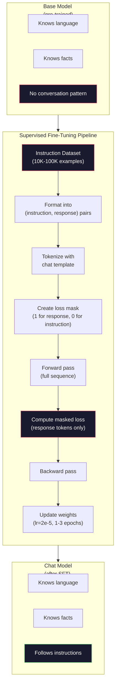

# El sistema de ajuste de instrucciones (SFT)

> Un modelo base predice el siguiente token. Eso es todo. No sigue instrucciones, responde preguntas o rechaza solicitudes dañinas. SFT es el puente entre un predictor de token y un asistente útil. Todos los modelos con los que has hablado - Claude, GPT, Llama Chat - han pasado por este paso.

**Type:** Build
**Languages:** Python (with numpy)
**Prerequisites:** Phase 10, Lesson 04 (Pre-Training a Mini GPT)
**Time:** ~90 minutes

## Objetivos de aprendizaje

- Implementar ajustes finos supervisados (SFT) que conviertan un modelo de lenguaje base en un asistente que siga instrucciones
- Formatar datos de capacitación utilizando plantillas de chat con funciones de sistema, usuario y asistente, y pérdida de máscaras en tokens no asistentes
- Explicar por qué es necesario el FFT: los modelos básicos continúan el texto en lugar de responder preguntas
- Evaluar la calidad de las FFT comparando las respuestas del modelo base con las de un modelo ajustado en un conjunto de instrucciones prolongado

## El problema

Usted entrenó un modelo en la Lección 04. Puede predecir el siguiente token dado una secuencia.

Ahora prueba esto: alimenta "Cuál es la capital de Francia?" Un modelo base no responde a "Paris". Continúa el patrón. Podría producir: "¿Cuál es la capital de Alemania? ¿Cuál es la capital de España?" porque aprendió de documentos que contienen listas de preguntas. O podría producir "es una pregunta que muchas personas hacen" porque es una continuación plausible del siguiente token. El modelo no tiene concepto de *respuesta*. Sólo sabe que continúa.

Esta es la brecha entre GPT-3 (modelo base, lanzado en junio de 2020) y ChatGPT (instrucción-ajustado, lanzado en noviembre de 2022). La misma arquitectura. La misma pre-entrenamiento. La diferencia es de 20.000 a 100.000 pares cuidadosamente elaborados (instrucción, respuesta) que enseñaron al modelo a seguir el patrón de conversación.

Stanford Alpaca demostró que no necesitas millones de ejemplos. En marzo de 2023, ajustaron el Llama 7B a sólo 52.000 pares de instrucciones y respuesta generadas por GPT-3.5.$600. The result was a chatbot that could follow instructions, answer questions, and hold conversations. Not as good as ChatGPT, but shockingly close for $600 y unas horas de entrenamiento.

El chat Llama 2 de Meta utilizó solo ~ 27.000 ejemplos de alta calidad para su etapa inicial de SFT. La clave: la calidad importa más que la cantidad. 27.000 ejemplos escritos por anotadores calificados superan 1 millón de ejemplos ruidosos raspados de Internet.

## El concepto

### Lo que realmente hace la FFT

Supervisado Fine-Tuning continúa el mismo ciclo de entrenamiento desde la pre-entrenamiento - pase hacia adelante, pérdida de computación, pase hacia atrás, actualización de pesos - pero con un tipo diferente de datos. En lugar de texto crudo, se entrenan en conversaciones estructuradas:

```json
{
  "system": "You are a helpful assistant.",
  "user": "What is the capital of France?",
  "assistant": "The capital of France is Paris."
}
```

El modelo ya sabe que París es la capital de Francia. Aprendió esto durante la pre-entrenamiento en Wikipedia, libros de texto y páginas web. SFT no enseña a la modelo nuevos hechos. Le enseña al modelo un nuevo *comportamiento*: cuando ves una pregunta, produce una respuesta. Cuando ves una instrucción, produce una finalización. Cuando ves una solicitud dañina, produce una negativa.

Piensa en esto de esta manera. El preentrenamiento da el conocimiento del modelo.

### Formatos de datos

Tres formatos dominan la industria. Cada uno codifica la misma información - quién dijo qué - con diferentes delimitadores.

**Alpaca Format**(Stanford, marzo 2023):

```json
{
  "instruction": "Summarize the following article in 3 sentences.",
  "input": "The European Central Bank raised interest rates...",
  "output": "The ECB increased rates by 25 basis points..."
}
```

Simple y ampliamente utilizado.`input`El campo es opcional, muchas instrucciones no necesitan contexto adicional. Stanford publicó 52.000 ejemplos en este formato, generados por GPT-3.5 por $600. Esto dio inicio al movimiento de ajuste de instrucciones de código abierto.

**ShareGPT Format**(Comunidad, 2023):

```json
{
  "conversations": [
    {"from": "system", "value": "You are a helpful assistant."},
    {"from": "human", "value": "What causes tides?"},
    {"from": "gpt", "value": "Tides are caused by the gravitational pull of the Moon..."},
    {"from": "human", "value": "How often do they occur?"},
    {"from": "gpt", "value": "Most coastal areas experience two high tides and two low tides per day..."}
  ]
}
```

Apoya las conversaciones de múltiples vueltas. El campo "de" utiliza "humano" y "gpt" por convención, independientemente del modelo real. Vicuna fue entrenado en 70.000 conversaciones ShareGPT arrancadas de transcripciones ChatGPT compartidas por los usuarios.

**ChatML Format**(OpenAI, utilizado por muchos modelos de código abierto):

```
<|im_start|>system
You are a helpful assistant.<|im_end|>
<|im_start|>user
What is the capital of France?<|im_end|>
<|im_start|>assistant
The capital of France is Paris.<|im_end|>
```

Utiliza fichas especiales (`<|im_start|>`¿ Qué ?`<|im_end|>`Los tokens se añaden al vocabulario del tokenizer durante el ajuste fino.

Los tres formatos logran lo mismo: dicen al modelo "esta es la instrucción, esta es la respuesta, aprende este patrón".

### Por qué funciona

El modelo ya conoce el lenguaje desde la formación previa. Ha visto miles de millones de ejemplos de preguntas seguidas de respuestas, instrucciones seguidas de completos y conversaciones entre personas.

El modelo de SFT concentra esta habilidad latente. En lugar de que el modelo necesite determinar desde el contexto si debe responder a una pregunta o continuar un documento, el SFT se entrena explícitamente en el patrón de conversación. Después de unos pocos miles de ejemplos, el modelo aprende: cuando ves el marcador de rol asistente, produce una respuesta útil.

Por eso 27,000 ejemplos son suficientes. No le enseñas al modelo de inglés. No le enseñas hechos sobre el mundo. Le enseñas un comportamiento simple: responder a las instrucciones. El conocimiento ya estaba ahí.

### La pérdida enmascarada

Este es el detalle técnico más importante en FTS, y la mayoría de los tutoriales lo omiten.

Durante la pre-entrenamiento, se calcula la pérdida en cada token. El modelo aprende a predecir cada token siguiente en la secuencia. Durante SFT, solo se calcula la pérdida en los tokens de *respuesta* . Los tokens de instrucción están allí para el contexto, pero el modelo no es penalizado por "predictar" incorrectamente.

¿Por qué? porque no quieres que el modelo aprenda a *generar* instrucciones. Quieres que aprenda a *responer* instrucciones. Si calculas pérdida en los tokens de instrucciones, estás entrenando al modelo para predecir "¿Cuál es la capital de Francia?" como si fuera el que hace la pregunta. Eso desperdicia la señal de gradiente y puede confundir al modelo sobre su papel.

En la práctica, se crea una máscara de pérdida: 1 para los tokens de respuesta, 0 para los tokens de instrucción. Multiplica la pérdida por token por esta máscara antes de promediar.

```
Tokens:    [SYS] You are helpful [USER] What is the capital? [ASST] Paris is the capital [EOS]
Loss mask:   0    0    0     0      0     0   0  0     0       1     1    1   1     1      1
```

Sólo los tokens después `[ASST]`El modelo ve la conversación completa durante el pase hacia adelante (necesita la instrucción para producir la respuesta correcta), pero solo actualiza sus pesos en función de lo bien que predijo la respuesta.

### Hiperparámetros de formación

La FTS utiliza hiperparámetros muy diferentes de los de pre-entrenamiento. No estás entrenando desde cero. Estás ajustando un modelo que ya funciona.

| Parameter | Pre-Training (Llama 2 7B) | SFT (Llama 2 Chat) |
|-----------|---------------------------|---------------------|
| Learning rate | 3e-4 (peak) | 2e-5 |
| Epochs | 1 (single pass over data) | 2 |
| Batch size | 4M tokens | 64 examples |
| Warmup steps | 2,000 | 0-100 |
| Weight decay | 0.1 | 0.0-0.1 |
| Data size | 2T tokens | 27,000 examples |

La tasa de aprendizaje es 15 veces menor para SFT. Esto es crítico. Una alta tasa de aprendizaje durante el ajuste fino destruye el conocimiento pre-entrenado. El modelo "olvida" lo que aprendió y se sobrepasa al pequeño conjunto de datos de ajuste fino. Esto es un olvido catastrófico.

Dos épocas significa que el modelo ve cada ejemplo de entrenamiento dos veces. Más de 3 épocas en un conjunto de datos pequeño conduce a la memorización - el modelo comienza a reproducir ejemplos de entrenamiento literalmente en lugar de generalizar.

### El olvido catastrófico

El ajuste fino puede destruir las capacidades generales. Entrenar demasiado tiempo en datos que siguen instrucciones y el modelo pierde su capacidad para escribir código, hacer matemáticas o producir texto creativo. Se vuelve muy bueno en el formato específico de sus datos de entrenamiento y terrible en todo lo demás.

Tres medidas de mitigación:

1. **Low learning rate.**1e-5 a 5e-5. Las actualizaciones más pequeñas significan menos destrucción de características pre-entrenadas.

2. **Short training.**De 1 a 3 épocas, detenerse antes de que el modelo se sobrepase.

3. **Mix in pre-training data.**Llama 2 Chat mezcla un pequeño porcentaje (2-5%) de datos crudos de pre-entrenamiento en el conjunto de datos SFT. Esto "recuerda" el modelo de sus capacidades generales mientras aprende el nuevo comportamiento de seguimiento de instrucciones.

### Números reales

La sintonización de un modelo 7B en 10.000 pares de instrucciones de alta calidad toma aproximadamente una hora en una sola GPU NVIDIA A100 de 80 GB.

- 10.000 ejemplos x 512 tokens promedio = 5,12M tokens
- 2 épocas = 10.24M tokens totales
- A100 de potencia para ajuste fino del modelo 7B: ~ 3.000 tokens/segundo
- 10.24M / 3.000 = ~ 3.400 segundos = ~ 57 minutos

Para nuestro mini GPT (4 capas, 128 dims), el entrenamiento es casi instantáneo.



```figure
loss-masking
```

## Construye el mismo

### Paso 1: Datos de instrucciones

Crear un conjunto de datos de instrucciones sintéticas. En producción, compañías como Scale AI y Anthropic emplean anotadores humanos para escribir estos. Los crearemos programáticamente para demostrar el formato.

```python
import numpy as np

INSTRUCTION_DATA = [
    {
        "instruction": "What is the capital of France?",
        "response": "The capital of France is Paris."
    },
    {
        "instruction": "Explain gravity in one sentence.",
        "response": "Gravity is the force that attracts objects with mass toward each other."
    },
    {
        "instruction": "Write a haiku about the ocean.",
        "response": "Waves crash on the shore, salt and foam beneath the sun, endless blue expanse."
    },
    {
        "instruction": "What is 15 multiplied by 7?",
        "response": "15 multiplied by 7 is 105."
    },
    {
        "instruction": "Name three programming languages.",
        "response": "Three programming languages are Python, Rust, and TypeScript."
    },
    {
        "instruction": "Summarize photosynthesis.",
        "response": "Photosynthesis converts sunlight, water, and carbon dioxide into glucose and oxygen."
    },
    {
        "instruction": "What year did World War II end?",
        "response": "World War II ended in 1945."
    },
    {
        "instruction": "Define machine learning.",
        "response": "Machine learning is a field where algorithms learn patterns from data to make predictions."
    },
]
```

Ocho ejemplos son pequeños. Stanford Alpaca utilizó 52.000, pero la mecánica es idéntica si tienes 8 o 52.000: tokenizar, máscara, pérdida de cálculo sólo en respuestas.

### Paso 2: Se puede marcar con la plantilla de chat

Convierta pares de instrucciones y respuestas en secuencias de símbolos con marcadores de rol especiales. Los marcadores indican al modelo dónde termina la instrucción y dónde comienza la respuesta.

```python
SPECIAL_TOKENS = {
    "INST_START": 253,
    "INST_END": 254,
    "RESP_START": 255,
}


def tokenize_instruction_pair(instruction, response, vocab_size=256):
    inst_tokens = list(instruction.encode("utf-8"))
    resp_tokens = list(response.encode("utf-8"))

    inst_tokens = [min(t, vocab_size - 4) for t in inst_tokens]
    resp_tokens = [min(t, vocab_size - 4) for t in resp_tokens]

    tokens = (
        [SPECIAL_TOKENS["INST_START"]]
        + inst_tokens
        + [SPECIAL_TOKENS["INST_END"]]
        + [SPECIAL_TOKENS["RESP_START"]]
        + resp_tokens
    )

    return tokens


def create_loss_mask(tokens):
    mask = np.zeros(len(tokens), dtype=np.float32)
    in_response = False

    for i, token in enumerate(tokens):
        if token == SPECIAL_TOKENS["RESP_START"]:
            in_response = True
            continue
        if in_response:
            mask[i] = 1.0

    return mask
```

La máscara de pérdida es todos los ceros para los tokens de instrucción y todos los para los tokens de respuesta.`RESP_START`El token en sí mismo obtiene una máscara de 0 porque es un delimitador, no parte del contenido de la respuesta.

### Paso 3: pérdida de entropía cruzada enmascarada

La entropía cruzada estándar, pero multiplicada por la máscara de pérdida.

```python
def masked_cross_entropy_loss(logits, targets, loss_mask):
    batch, seq_len, vocab_size = logits.shape
    logits_flat = logits.reshape(-1, vocab_size)
    targets_flat = targets.reshape(-1)
    mask_flat = loss_mask.reshape(-1)

    max_logits = logits_flat.max(axis=-1, keepdims=True)
    log_softmax = logits_flat - max_logits - np.log(
        np.exp(logits_flat - max_logits).sum(axis=-1, keepdims=True)
    )

    per_token_loss = -log_softmax[np.arange(len(targets_flat)), targets_flat]

    masked_loss = per_token_loss * mask_flat
    num_response_tokens = mask_flat.sum()
    if num_response_tokens == 0:
        return 0.0
    loss = masked_loss.sum() / num_response_tokens

    return loss
```

El denominador es `num_response_tokens`No , no .`seq_len`Si dividimos por la longitud total de la secuencia, las instrucciones más largas diluyen la señal de gradiente. Dividir por el recuento de tokens de respuesta asegura el mismo peso por token de respuesta independientemente de la longitud de la instrucción.

### Paso 4: Ciclo de formación de FFT

Reutilice el MiniGPT de la Lección 04. El bucle de entrenamiento se ve casi idéntico al de pre-entrenamiento, pero con formato de instrucción y pérdida enmascarada.

```python
import sys
import os
sys.path.insert(0, os.path.join(os.path.dirname(__file__), "..", "..", "04-pre-training-mini-gpt", "code"))
from main import MiniGPT, LayerNorm, FeedForward, MultiHeadAttention, TransformerBlock, Embedding


def sft_train(model, dataset, num_epochs=2, lr=2e-5, seq_len=64):
    formatted_data = []
    for example in dataset:
        tokens = tokenize_instruction_pair(example["instruction"], example["response"])
        mask = create_loss_mask(tokens)
        formatted_data.append((tokens, mask))

    print(f"SFT Training: {len(formatted_data)} examples, {num_epochs} epochs, lr={lr}")
    print(f"Total tokens: {sum(len(t) for t, _ in formatted_data):,}")
    print()

    losses = []

    for epoch in range(num_epochs):
        epoch_loss = 0.0
        num_batches = 0

        indices = np.random.permutation(len(formatted_data))

        for idx in indices:
            tokens, mask = formatted_data[idx]

            if len(tokens) < 3:
                continue
            if len(tokens) > seq_len:
                tokens = tokens[:seq_len]
                mask = mask[:seq_len]

            input_ids = np.array(tokens[:-1]).reshape(1, -1)
            target_ids = np.array(tokens[1:]).reshape(1, -1)
            loss_mask = np.array(mask[1:]).reshape(1, -1)

            logits = model.forward(input_ids)
            loss = masked_cross_entropy_loss(logits, target_ids, loss_mask)

            batch_size, s_len, v_size = logits.shape
            probs = np.exp(logits - logits.max(axis=-1, keepdims=True))
            probs = probs / probs.sum(axis=-1, keepdims=True)
            dlogits = probs.copy()
            dlogits[np.arange(batch_size)[:, None], np.arange(s_len), target_ids] -= 1.0

            mask_expanded = loss_mask[:, :, np.newaxis]
            num_resp = loss_mask.sum()
            if num_resp > 0:
                dlogits = dlogits * mask_expanded / num_resp

            for block in model.blocks:
                block.ffn.W1 -= lr * np.random.randn(*block.ffn.W1.shape) * 0.01
                block.ffn.W2 -= lr * np.random.randn(*block.ffn.W2.shape) * 0.01
                block.ffn.b1 -= lr * np.random.randn(*block.ffn.b1.shape) * 0.01
                block.ffn.b2 -= lr * np.random.randn(*block.ffn.b2.shape) * 0.01

            epoch_loss += loss
            num_batches += 1
            losses.append(loss)

        avg_loss = epoch_loss / max(num_batches, 1)
        print(f"Epoch {epoch + 1}/{num_epochs} | Avg Loss: {avg_loss:.4f}")

    return model, losses
```

La tasa de aprendizaje es 2e-5, que coincide con Llama 2 Chat. Comparar esto con el 3e-4 utilizado en el pre-entrenamiento - 15 veces más pequeño. El gradiente es enmascarado: los tokens de instrucción producen gradiente cero. Sólo los tokens de respuesta empujan los pesos.

### Paso 5: Comparación de modelo base vs SFT

El punto principal de la SFT es el cambio de comportamiento. Medirlo comprobando cómo el modelo responde a las entradas formateadas por instrucciones en comparación con las continuas de texto crudo.

```python
def generate_response(model, prompt_tokens, max_new_tokens=50, temperature=0.8):
    tokens = list(prompt_tokens)
    seq_len = model.embedding.pos_embed.shape[0]

    for _ in range(max_new_tokens):
        context = np.array(tokens[-seq_len:]).reshape(1, -1)
        logits = model.forward(context)
        next_logits = logits[0, -1, :]

        next_logits = next_logits / max(temperature, 1e-8)
        probs = np.exp(next_logits - next_logits.max())
        probs = probs / probs.sum()
        probs = np.clip(probs, 1e-10, 1.0)
        probs = probs / probs.sum()

        next_token = np.random.choice(len(probs), p=probs)
        tokens.append(int(next_token))

    return tokens


def evaluate_instruction_following(model, instructions):
    print("Evaluating instruction following:")
    print("-" * 50)

    for instruction in instructions:
        tokens = (
            [SPECIAL_TOKENS["INST_START"]]
            + [min(t, 252) for t in list(instruction.encode("utf-8"))]
            + [SPECIAL_TOKENS["INST_END"]]
            + [SPECIAL_TOKENS["RESP_START"]]
        )

        output = generate_response(model, tokens, max_new_tokens=30, temperature=0.6)
        response_start = len(tokens)
        response_tokens = output[response_start:]
        response_bytes = bytes([t for t in response_tokens if t < 128])
        response_text = response_bytes.decode("utf-8", errors="replace")

        print(f"  Q: {instruction}")
        print(f"  A: {response_text[:80]}")
        print()
```

En un modelo pequeño con 8 ejemplos, las respuestas no serán significativas. Eso es esperado. Lo importante es la *estructura*: el modelo aprende a producir salida después del marcador de respuesta en lugar de continuar generando más instrucciones.

### Paso 6: Cuida el olvido catastrófico

Comparar la capacidad de predicción de los tokens siguientes del modelo antes y después de SFT. Si SFT daña las capacidades generales, la pérdida en el texto bruto aumentará.

```python
def measure_forgetting(model, test_text, seq_len=64):
    tokens = np.array(list(test_text.encode("utf-8")[:512]))

    total_loss = 0.0
    num_windows = 0

    for start in range(0, len(tokens) - seq_len - 1, seq_len):
        input_ids = tokens[start:start + seq_len].reshape(1, -1)
        target_ids = tokens[start + 1:start + seq_len + 1].reshape(1, -1)

        logits = model.forward(input_ids)

        batch, s_len, vocab_size = logits.shape
        logits_flat = logits.reshape(-1, vocab_size)
        targets_flat = target_ids.reshape(-1)

        max_logits = logits_flat.max(axis=-1, keepdims=True)
        log_softmax = logits_flat - max_logits - np.log(
            np.exp(logits_flat - max_logits).sum(axis=-1, keepdims=True)
        )

        loss = -log_softmax[np.arange(len(targets_flat)), targets_flat].mean()
        total_loss += loss
        num_windows += 1

    return total_loss / max(num_windows, 1)
```

En el ajuste real, se rastrearía esta métrica durante todo el entrenamiento. Si la pérdida de texto bruto aumenta en más de 10-15%, su SFT es demasiado agresivo. Baja la tasa de aprendizaje o reduce el número de épocas.

## Usalo

### Demo de la línea de tuberías SFT completa

```python
if __name__ == "__main__":
    np.random.seed(42)

    test_text = """The transformer architecture processes sequences through self-attention.
Each layer applies multi-head attention followed by a feedforward network.
Residual connections and layer normalization stabilize deep networks.
The model learns to predict the next token given all previous tokens."""

    print("=" * 70)
    print("INSTRUCTION TUNING (SFT) DEMO")
    print("=" * 70)
    print()

    model = MiniGPT(
        vocab_size=256, embed_dim=128, num_heads=4,
        num_layers=4, max_seq_len=128, ff_dim=512
    )
    print(f"Model: {model.count_parameters():,} parameters")
    print(f"Config: 4 layers, 4 heads, 128 dims (mini GPT from Lesson 04)")
    print()

    print("PRE-SFT: Measuring base model loss on raw text")
    base_loss = measure_forgetting(model, test_text)
    print(f"  Base model loss: {base_loss:.4f}")
    print()

    print("=" * 70)
    print("SFT TRAINING")
    print("=" * 70)

    model, losses = sft_train(
        model, INSTRUCTION_DATA, num_epochs=3, lr=2e-5, seq_len=128
    )

    print()
    print("POST-SFT: Measuring fine-tuned model loss on raw text")
    sft_loss = measure_forgetting(model, test_text)
    print(f"  SFT model loss: {sft_loss:.4f}")
    print(f"  Change: {((sft_loss - base_loss) / base_loss * 100):+.1f}%")
    if abs(sft_loss - base_loss) / base_loss < 0.15:
        print("  Minimal forgetting (< 15% change)")
    else:
        print("  Significant forgetting detected")
    print()

    print("=" * 70)
    print("INSTRUCTION FOLLOWING EVALUATION")
    print("=" * 70)
    print()

    test_instructions = [
        "What is the capital of France?",
        "Name a programming language.",
        "Define gravity.",
    ]
    evaluate_instruction_following(model, test_instructions)

    print("=" * 70)
    print("DATA FORMAT EXAMPLES")
    print("=" * 70)
    print()

    for i, example in enumerate(INSTRUCTION_DATA[:3]):
        tokens = tokenize_instruction_pair(example["instruction"], example["response"])
        mask = create_loss_mask(tokens)
        resp_count = int(mask.sum())
        total_count = len(tokens)
        print(f"  Example {i + 1}: {total_count} tokens, {resp_count} response tokens ({resp_count/total_count:.0%} of sequence)")
        print(f"    Instruction: {example['instruction']}")
        print(f"    Response: {example['response']}")
        print()

    print("=" * 70)
    print("TRAINING LOSS CURVE")
    print("=" * 70)
    print()

    if losses:
        window = max(1, len(losses) // 5)
        for i in range(0, len(losses), window):
            chunk = losses[i:i + window]
            avg = sum(chunk) / len(chunk)
            print(f"  Steps {i:3d}-{i + len(chunk) - 1:3d}: avg loss = {avg:.4f}")
```

## Envío

Esta lección produce`outputs/prompt-sft-data-curator.md`-- un prompt que le ayuda a diseñar y curar conjuntos de datos de instrucciones para SFT. Dado una capacidad objetivo (generación de código, matemáticas, conversación), produce un plan de recopilación de datos con especificaciones de formato, criterios de calidad y requisitos de diversidad.

## Los ejercicios

1. Añadir soporte de sistema rápido. Modificar `tokenize_instruction_pair`Crear 5 ejemplos con diferentes instrucciones de sistema ("Eres un poeta", "Eres un tutor de matemáticas") y verificar que el modelo ve diferentes instrucciones de sistema durante el entrenamiento.

2. Implementar la mezcla de datos. Crear una función que toma un conjunto de datos SFT y un corpus de texto crudo, luego produce lotes de entrenamiento donde el 5% de los ejemplos son texto crudo (sin enmascaramiento) y el 95% son pares de instrucciones (mascarados). ejecutar 3 épocas y comparar métricas de olvido con el entrenamiento puro SFT.

3. Construir un puntuación de calidad de datos. Para cada par de instrucciones y respuestas, calcular: (a) longitud de respuesta en tokens, (b) relación instrucción-respuesta, (c) diversidad de vocabulario (tokens únicos / tokens totales). Filtrar ejemplos con longitud de respuesta < 10 tokens o diversidad < 0,3. Muestre cómo el filtrado afecta la pérdida final.

4. Implemente entrenamiento de conversación en múltiples vueltas. Extenda la tokenización para manejar conversaciones de 3 vueltas (usuario-asistente-usuario-asistente-usuario-asistente). La máscara de pérdida debe cubrir los tres vueltas de asistente. Verifique si la máscara es correcta imprimiendo la alineación de token-máscara para un ejemplo.

5. Compare las tasas de aprendizaje. Entrenar el mismo modelo tres veces con lr=1e-4, lr=2e-5, y lr=1e-6. trazar las curvas de pérdida. La carrera 1e-4 debe mostrar un descenso inicial rápido pero una pérdida final más alta (overfitting). La carrera 1e-6 apenas debe moverse. La carrera 2e-5 debe ser el punto dulce.

## Términos clave

| Term | What people say | What it actually means |
|------|----------------|----------------------|
| SFT | "Fine-tuning on conversations" | Supervised Fine-Tuning: continuing training on (instruction, response) pairs with loss computed only on response tokens |
| Instruction tuning | "Teaching the model to follow instructions" | Training on explicit instruction-response pairs so the base model learns the conversation pattern, not new knowledge |
| Loss masking | "Ignoring the prompt" | Setting loss to zero for instruction tokens so gradients only flow from response token predictions |
| ChatML | "Chat Markup Language" | A token format using `<\|im_start\|>` and `<\|im_end\|>` delimiters to mark speaker roles in conversation data |
| Alpaca format | "Stanford's format" | A JSON format with instruction/input/output fields, used for 52K GPT-3.5-generated examples that cost $600 |
| Catastrophic forgetting | "The model gets dumber" | Fine-tuning destroys pre-trained capabilities because gradient updates overwrite general knowledge with task-specific patterns |
| Weight tying | "Shared embeddings" | Using the same matrix for input token embeddings and output prediction head, saving parameters and improving coherence |
| Chat template | "How you format the prompt" | The specific token sequence (role markers, delimiters) that structures a conversation for the model |

## Leer más

- [Ouyang et al., 2022 -- "Training language models to follow instructions with human feedback" (InstructGPT)](https://arxiv.org/abs/2203.02155)-- el documento que introdujo el ajuste de instrucciones + RLHF en OpenAI
- [Taori et al., 2023 -- "Stanford Alpaca: An Instruction-following LLaMA Model"](https://github.com/tatsu-lab/stanford_alpaca)-- 52K ejemplos de instrucciones por $ 600, que demuestran que SFT funciona en pequeños conjuntos de datos
- [Touvron et al., 2023 -- "Llama 2: Open Foundation and Fine-Tuned Chat Models"](https://arxiv.org/abs/2307.09288)-- El oleoducto SFT + RLHF de Meta con ejemplos de alta calidad de 27K
- [Chiang et al., 2023 -- "Vicuna: An Open-Source Chatbot Impressing GPT-4"](https://lmsys.org/blog/2023-03-30-vicuna/)-- formación en 70K conversaciones ShareGPT
- [Zhou et al., 2023 -- "LIMA: Less Is More for Alignment"](https://arxiv.org/abs/2305.11206)-- demostrando que 1.000 ejemplos cuidadosamente seleccionados pueden coincidir con SFT en conjuntos de datos mucho más grandes
