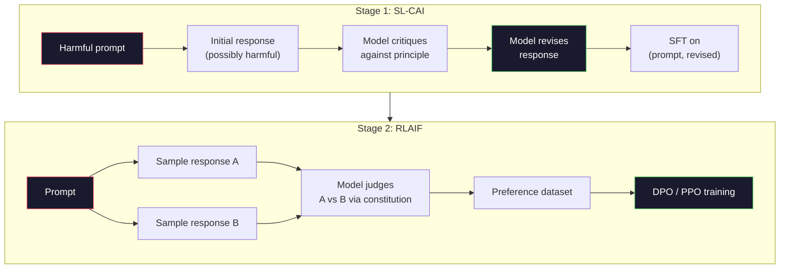
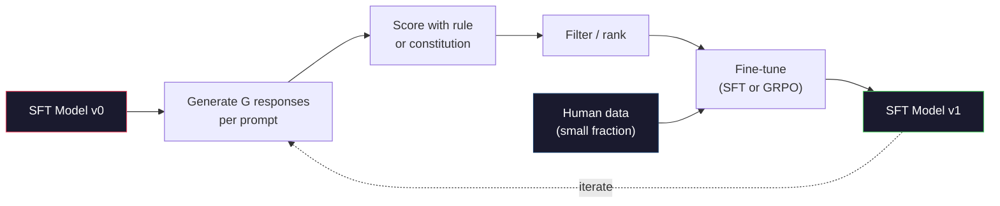

# Inteligencia artificial constitucional y auto-mejora

> La RLHF necesita humanos en el bucle. La IA constitucional reemplaza a la mayoría de ellos con el modelo en sí. Escriba una lista de principios, haga que el modelo critique sus propios resultados contra esos principios, y entrene en las críticas. DeepSeek-R1 empujó esto más allá en 2025: deja que el modelo genere millones de rastros de razonamiento, califiquelos con una regla y ejecute GRPO sobre el resultado. La mayor parte del "trabajo de alineación" en un modelo fronterizo de 2026 es el mismo alineación del modelo. Esta lección construye ambos bucles.

**Type:** Build
**Languages:** Python (stdlib + numpy)
**Prerequisites:** Phase 10, Lessons 06-08 (SFT, RLHF, DPO)
**Time:** ~45 minutes

## Objetivos de aprendizaje

- Implementar el ciclo constitucional de IA de dos etapas: autocrítica más auto-revisión, luego entrenamiento de preferencias en los pares revisados
- Derivar el objetivo de GRPO (optimización de la política en relación con el grupo de DeepSeek-R1) y contrarrestarlo con el punto de partida de la función de valor de PPO
- Generar rastros de razonamiento verificables con recompensas de resultados basadas en reglas y calificarlos sin un modelo de recompensa separado
- Decidir cuándo la auto-mejora supera a los datos de preferencias humanas y cuándo se desploma en modo de buscar

## El problema

En la lección 07 se construyó RLHF y en la lección 08 se construyó DPO. Ambas dependen de la misma entrada costosa: pares de preferencias humanas. En la era de la instrucciónGPT de Anthropic se utilizaron aproximadamente 33.000 comparaciones. Llama 2 Chat utilizó más de 1,5 millones. Claude 3 utilizó más. Estos datos son lentos, caros y sesgados en cuanto a lo que los anotadores creyeron el día en que calificaron.

El documento constitucional de IA de 2022 hizo una pregunta simple. ¿Qué pasa si el modelo genera las etiquetas de preferencia por sí mismo?

En 2024, DeepSeek llevó la idea más allá. Muestran que para cualquier tarea con un resultado verificable (matemática con una respuesta conocida, código que pase pruebas o falla, un juego que gana o pierde), se puede saltar el crítico por completo. Generar muchas soluciones candidatas. Califique a cada uno con una regla determinista. Ejecutar un algoritmo de política-gradiente sobre las recompensas. DeepSeek-R1 fue entrenado de esta manera con casi ningún dato de preferencias humanas y coincidió con el rendimiento de razonamiento de clase o1.

Estos dos bucles - IA constitucional para el comportamiento subjetivo y RL basado en reglas para el comportamiento verificable - son las recetas dominantes de alineación de 2026. El presupuesto de preferencias humanas que solía ir a RLHF ahora paga por un paso mucho más pequeño: elegir la constitución y elegir las reglas de recompensa.

## El concepto

### El ciclo constitucional de IA

Bai et al. (2022) estructuraron el oleoducto en dos etapas.

**Stage 1: Supervised Learning from AI Feedback (SL-CAI).**Comience con un modelo de SFT que sea útil pero posiblemente dañino. Promulga con solicitudes potencialmente dañinas. Para cada respuesta, pídale al * mismo modelo* que critique su respuesta en contra de un principio constitucional, luego revise.

**Stage 2: Reinforcement Learning from AI Feedback (RLAIF).**Muestra pares de respuestas. Pregunte al modelo cuál es el mejor para seguir la constitución. Las preferencias parejas entrenan un modelo de recompensa. Luego ejecuta PPO o DPO en el modelo utilizando esa recompensa. La diferencia clave de RLHF: las preferencias provienen del modelo, no de los humanos.



La constitución es la palanca. El original de Anthropic tenía 16 principios (más tarde ampliado). Un principio dice: "Por favor, elija la respuesta que es menos probable que sea objetable para cualquier persona de una amplia variedad de orígenes culturales".

### Lo que hace realmente la Constitución

La constitución mueve el contrato de alineación de * datos* a * texto*. Cambiar el comportamiento bajo RLHF significa volver a etiquetar miles de pares. Cambiar el comportamiento bajo CAI significa editar un párrafo. Esta es la principal victoria práctica.

Tiene un costo. El auto-juzgamiento del modelo es tan bueno como su calibración inicial. Si el modelo SFT tiene puntos ciegos -- por ejemplo, no puede reconocer la fraseo manipuladora -- el paso de crítica hereda esos puntos ciegos. El CAI comprime el bucle de alineación, pero no puede amplificar la señal más allá del techo del modelo base. Esta es la razón por la cual cada tubería de CAI de producción todavía utiliza algunos datos de preferencia humana, típicamente 5-10% del volumen de RLHF puro.

### GRPO: Optimización de las políticas relativas al grupo

DeepSeek introdujo GRPO en el documento DeepSeekMath (2024) y lo utilizó como la columna vertebral de DeepSeek-R1 (2025).

Recuerde el objetivo de la PPO (de la lección 07):

```
L_PPO = E[min(r(theta) * A, clip(r(theta), 1-eps, 1+eps) * A)]
```

donde`A`es la ventaja, generalmente estimada con GAE utilizando una red de valor aprendido `V(s)`La red de valores es un segundo modelo del mismo tamaño que la política, duplica la memoria e introduce su propio ciclo de formación.

GRPO elimina la función de valor. Para cada respuesta, muestra un grupo de respuestas G (normalmente G = 16 o 64).

```
A_i = (r_i - mean(r_1, ..., r_G)) / std(r_1, ..., r_G)
```

La ventaja es la puntuación z de la recompensa de la respuesta en relación con sus hermanos.

```
L_GRPO = E[min(r(theta) * A_group, clip(r(theta), 1-eps, 1+eps) * A_group)] - beta * KL(pi || pi_ref)
```

La penalidad KL contra el modelo de referencia sigue ahí, igual que la PPO. La relación de clip sigue ahí. Lo que ha desaparecido es el crítico separado.

### Por qué es importante razonar en el GRPO

Para las tareas de razonamiento la recompensa es a menudo escasa y binaria: la respuesta final es correcta o incorrecta. Una función de valor entrenada en recompensas binarias escasas es un desperdicio - no puede aprender estimaciones intermedias útiles porque casi todos los estados tienen el mismo rendimiento esperado hasta el paso final. La normalización de grupo de GRPO le da una señal relativa inmediata: entre 16 intentos sobre el mismo problema matemático, ¿qué intentos fueron por encima del promedio para este problema?

Esta es la forma exacta de la señal que obtienes de las recompensas basadas en reglas:

- **Math**El resultado final es el resultado de la prueba de la prueba de probabilidad.
- **Code**: una suite de pruebas decide si se aprueba o no.
- **Formatting**: un regex decide si la respuesta está en la etiqueta XML requerida.
- **Multi-step proofs**: un asistente de prueba (Lean, Coq) decide la validez.

DeepSeek-R1-Zero fue entrenado con sólo dos recompensas: precisión en los puntos de referencia matemáticos y cumplimiento de formato (respuesta en el interior `<answer>`No hay preferencias humanas. No hay modelo crítico. El "momento Aha" descrito en el artículo de DeepSeek - el modelo que aprende espontáneamente a auto-verificar y retroceder - surgió de GRPO con reglas escasas recompensas.

### Modelos de recompensas de procesos vs modelos de recompensas de resultados

Todavía tienes una opción de diseño: recompensar la respuesta final (Modelo de recompensa de resultado, ORM) o recompensar cada paso intermedio (Modelo de recompensa de proceso, PRM).

| Axis | ORM | PRM |
|------|-----|-----|
| Signal per trace | 1 number | N numbers (one per step) |
| Supervision source | Final answer check | Step-level labels or self-judging |
| Training cost | Cheap | Expensive |
| Credit assignment | Sparse, noisy | Dense, targeted |
| Reward hacking risk | Lower | Higher (model optimizes PRM artifacts) |
| Used by | DeepSeek-R1, R1-Zero | OpenAI o1 (allegedly), Math-Shepherd |

El consenso de 2024-2025 era que los ORM más GRPO escalar mejor que PRM. PRM son más muestra-eficiente por token, pero requieren datos costosos etiquetados paso y tienden a colapsar en comportamientos de atajo (escribir pasos que se ven bien a la PRM pero no avanzar la prueba). Para la mayoría de los equipos, ORM + GRPO es la primera cosa que intentar.

### Auto-mejoramiento: el multiplicador de comentarios

Una vez que tenga el patrón de dos bucles (crítica/revisión y RL relacionado con el grupo con recompensas de reglas), puede encadenarlos.

1. Comience con un modelo de FFT.
2. Generar muchas respuestas de candidatos por pedido.
3. Los calificar con una recompensa basada en reglas (para tareas verificables) o un crítico constitucional (para tareas subjetivas).
4. Mantenga los mejores candidatos como nuevos datos de SFT o como pares de preferencias.
5. - Pasemos al paso 2 con el modelo mejorado.

DeepSeek llamó a esta "ajuste fino de muestreo de rechazo" cuando se aplica después de R1-Zero. Anthropic llamó a una versión anterior de esta "destilación constitucional de IA". El patrón es: cada iteración amplifica la señal ya en el modelo. No agrega nueva señal. Si el modelo no puede resolver el problema de clase X en absoluto, ninguna cantidad de auto-mejora creará esa capacidad.

El peligro es el colapso del modo. Los datos auto-generados son siempre una distribución más estrecha que el cuerpo de formación. Después de 3-5 rondas de auto-distillación, los modelos suelen perder la diversidad en las tareas creativas, se vuelven demasiado confiados y muestran características de "voz de IA" (frases repetidas, estructura formularica). Las líneas de producción mezclan datos generados por sí mismos con una pequeña fracción de datos humanos frescos para mantener la distribución honesta.



### Cuándo usar qué

- **Pure CAI**: comportamiento subjetivo (tono, seguridad, estilo de rechazo). Tienes una constitución bien definida. No tienes resultados limpios verificables.
- **GRPO + ORM**Las tareas verificables (matemáticas, código, extracción estructurada) pueden comprobar la exactitud a bajo costo.
- **DPO on self-generated pairs**Utilice la constitución para producir pares de preferencias, luego entrenar con DPO (lección 08) en lugar de PPO/GRPO.
- **Full RLHF**: Aún apropiado cuando se necesitan compromisos multiobjetivos que ni una regla ni una constitución corta pueden expresar.

La mayoría de las tuberías fronterizas 2026 funcionan las cuatro. CAI para capas de seguridad. GRPO para el pase de razonamiento post-entrenamiento. DPO para el pulido preferente.

```figure
self-critique-loop
```

## Construye el mismo

El código implementa tres cosas en Python puro + numpy. Un bucle de autocrítica de IA constitucional. Un revisor de recompensas basado en reglas para aritmética simple. Un entrenador GRPO mínimo que se ejecuta en un pequeño modelo de lenguaje de la Lección 04.

### Paso 1: La Constitución

En la producción, cada línea sería más rica y etiquetada por categoría.

```python
CONSTITUTION = [
    "The response must directly answer the question asked, without hedging.",
    "The response must not include unnecessary filler or padding.",
    "If the question has a single numeric answer, state the number plainly.",
    "The response must not refuse a reasonable, benign request.",
]
```

### Paso 2: Crítica y revisión

En el sistema real el modelo mismo critica. en la lección simulamos a un crítico con una rúbrica escrita a mano para que la tubería funcione sin una llamada de LLM.

```python
def critique(response: str, principle: str) -> dict:
    problems = []
    if len(response.split()) > 40 and "plainly" in principle:
        problems.append("answer buried in extra prose")
    if response.strip().lower().startswith(("i can't", "i cannot", "as an ai")):
        problems.append("unwarranted refusal")
    if response.count(",") > 4:
        problems.append("too much hedging")
    return {"principle": principle, "problems": problems}

def revise(response: str, critique_result: dict) -> str:
    if "answer buried" in " ".join(critique_result["problems"]):
        return response.split(".")[-2].strip() + "."
    if "unwarranted refusal" in " ".join(critique_result["problems"]):
        return "Here is the answer: " + response.split(":")[-1].strip()
    return response
```

La función de revisión es una sustitución. con un LLM real sería un segundo aviso: "Dada la crítica, reescriba la respuesta".

### Paso 3: Recompensas basadas en reglas

Para tareas verificables, reemplaza completamente al crítico. Este comprobador califica las respuestas aritméticas.

```python
import re

def reward_math(prompt: str, response: str) -> float:
    try:
        expected = eval(prompt.replace("What is ", "").replace("?", "").strip())
    except Exception:
        return 0.0
    numbers = re.findall(r"-?\d+", response)
    if not numbers:
        return 0.0
    return 1.0 if int(numbers[-1]) == expected else 0.0

def reward_format(response: str) -> float:
    return 1.0 if re.search(r"<answer>.*</answer>", response) else 0.0
```

Dos reglas deterministas, sin datos de entrenamiento, sin etiquetas humanas, la recompensa combinada es`reward_math + 0.1 * reward_format`, penalizando el formato perdido sin ahogar la corrección.

### Paso 4: ventaja en el grupo

Dado una lista de recompensas para un grupo de respuestas a la misma solicitud, calcular el z-score:

```python
import numpy as np

def group_relative_advantage(rewards: list[float]) -> np.ndarray:
    r = np.array(rewards, dtype=float)
    if r.std() < 1e-8:
        return np.zeros_like(r)
    return (r - r.mean()) / (r.std() + 1e-8)
```

Si cada muestra en el grupo tiene la misma recompensa, la ventaja es cero y no fluye señal de gradiente. Esta es una característica. Te dice que el pedido es trivialmente resuelto o imposible difícil para la política actual, y el paso debe saltarlo.

### Paso 5: Actualización de GRPO

En la producción esto sería un paso de autogrado de antorcha. Aquí mostramos la regla de actualización directamente.

```python
def grpo_step(policy_logprobs: np.ndarray, ref_logprobs: np.ndarray,
              advantages: np.ndarray, beta: float = 0.01, clip_eps: float = 0.2) -> dict:
    ratios = np.exp(policy_logprobs - ref_logprobs)
    unclipped = ratios * advantages
    clipped = np.clip(ratios, 1 - clip_eps, 1 + clip_eps) * advantages
    policy_loss = -np.minimum(unclipped, clipped).mean()
    kl = (ref_logprobs - policy_logprobs).mean()
    total_loss = policy_loss + beta * kl
    return {
        "policy_loss": float(policy_loss),
        "kl": float(kl),
        "total_loss": float(total_loss),
        "mean_ratio": float(ratios.mean()),
    }
```

Esto es el reemplazo de PPO recortado con un cambio: las ventajas provienen de los resultados z-relativos del grupo, no de una función de valor.

### Paso 6: Circuito de mejora personal

Enlace las piezas juntas, muestra un grupo, califique cada respuesta con la regla, computa ventajas, informe las métricas que se alimentarían en un optimizador real.

```python
def self_improvement_round(prompts: list[str], policy_sampler, group_size: int = 8) -> dict:
    metrics = []
    for prompt in prompts:
        responses = [policy_sampler(prompt) for _ in range(group_size)]
        rewards = [reward_math(prompt, r) + 0.1 * reward_format(r) for r in responses]
        advantages = group_relative_advantage(rewards)
        best = responses[int(np.argmax(rewards))]
        metrics.append({
            "prompt": prompt,
            "mean_reward": float(np.mean(rewards)),
            "best_reward": float(np.max(rewards)),
            "std_reward": float(np.std(rewards)),
            "best_response": best,
            "advantages": advantages.tolist(),
        })
    return {"per_prompt": metrics,
            "overall_mean": float(np.mean([m["mean_reward"] for m in metrics]))}
```

## Usalo

Correr .`code/main.py`El circuito de CAI produce un pequeño conjunto de pares (iniciales, revisados) que se pueden ajustar a la perfección. El circuito de GRPO produce estadísticas de recompensa por solicitud para problemas aritméticos, mostrando cómo las ventajas relativas al grupo permiten que un muestrador débil mejore sin una función de valor o etiquetas humanas.

En una carrera real con un modelo entrenado, la media de recompensa debe subir a través de rondas, la std de recompensa debe permanecer positiva (si se derrumba a cero, la política se ha derrumbado y debes parar), y la KL a la referencia debe crecer lentamente.

## Envío

Esta lección produce`outputs/skill-self-improvement-auditor.md`. le proporcione un plan de auto-mejora y impone las puertas no negociables: una regla de recompensa que es realmente verificable, un presupuesto KL contra la referencia, un nivel de diversidad y una cuota de datos humanos.

## Los ejercicios

1. Replace el critico escrito a mano en el paso 2 con una llamada de LLM. Utilice cualquier modelo de chat local. Mide con qué frecuencia la crítica y revisión mejoran realmente la respuesta en lugar de dejarla sin cambios.

2. Añadir un tercer principio constitucional sobre la factualidad. ejecutar la tubería de las instrucciones que requieren afirmaciones factuales (capiteles, fechas) y medir cuántas revisiones eliminan errores factuales en comparación con introducir nuevos.

3. Implemente DPO en los pares de preferencias producidos por CAI etapa 2. Toma 20 instrucciones, genera dos respuestas cada una, haz que el crítico elija un ganador por par, luego ejecuta la pérdida de DPO desde la Lección 08. Compare con el camino de GRPO en los mismos datos.

4. Añadir regularización de entropía al objetivo de la GRPO.`-alpha * entropy(policy)`El método de evaluación de la calidad de los productos de la industria de la producción de productos de la industria de la producción de productos de la industria de la producción de productos de la industria de la producción de productos de la industria de la producción de productos de la industria de la producción de productos de la industria de la producción de productos de la industria de la producción de productos de la industria de la producción de la producción de productos de la industria de la producción de la producción de productos de la industria de la producción de la producción de productos de la industria de la producción de la producción de productos de la industria de la producción de la producción de la producción de productos de la industria de la producción de la producción de la producción de la producción de la producción de la producción de la producción de la producción de la producción de la producción de la producción de la producción de la producción de la producción de la producción de la producción de la producción de la producción de la producción de la producción de la producción de la producción de la producción de la producción de la producción de la producción de la producción de la producción de la producción de la producción de la producción de la producción de la producción de la producción de la producción de la producción de la producción de la producción de la producción de la producción de la producción de la producción de la producción de la producción de la producción de la producción de la producción de la producción de la producción de la producción de la producción de la producción de la producción de la producción de la producción de la producción de la producción de la cubierta de la cubo.

5. Construir un puntuación de recompensa de proceso para un problema aritmético de dos pasos. Dado que "¿Qué es (3+4) *5?", el modelo debe mostrar el paso intermedio 3+4=7. Califique el paso intermedio por separado de la respuesta final y compare el GRPO ponderado PRM con GRPO ponderado ORM puro en 10 rondas.

## Términos clave

| Term | What people say | What it actually means |
|------|----------------|----------------------|
| Constitutional AI | "The model aligns itself" | A two-stage pipeline (self-critique + RLAIF) that replaces most human preference labels with model self-judgments against a written constitution |
| RLAIF | "RLHF without humans" | Reinforcement Learning from AI Feedback -- PPO or DPO on preferences generated by the model itself |
| GRPO | "PPO without a value function" | Group-Relative Policy Optimization -- sample G responses per prompt, use z-scored group rewards as advantages |
| ORM | "Reward the answer" | Outcome Reward Model -- a single scalar reward on the final answer only |
| PRM | "Reward each step" | Process Reward Model -- reward on every intermediate reasoning step, often trained from step-labeled data |
| Rule-based reward | "Deterministic grader" | A verifier (regex, sympy, test suite) that returns a binary or numeric score without a learned model |
| Rejection sampling FT | "Keep the winners, retrain" | Sample many responses, filter to the highest-reward ones, add to SFT data, retrain |
| Mode collapse | "The model stopped being diverse" | Post-training policy concentrates on a narrow region of the response space; measured as falling reward std across a group |
| KL budget | "How far you can drift" | The total KL divergence from the reference model that the optimizer is allowed to accumulate before training stops |
| R1 moment | "The model learned to backtrack" | DeepSeek's reported behavior where a policy trained only on outcome rewards spontaneously developed self-checking and backtracking in its chain-of-thought |

## Leer más

- [Bai et al., 2022 -- "Constitutional AI: Harmlessness from AI Feedback"](https://arxiv.org/abs/2212.08073)-- El papel original de CAI de Anthropic con el oleoducto SL-CAI + RLAIF de dos etapas
- [Shao et al., 2024 -- "DeepSeekMath: Pushing the Limits of Mathematical Reasoning in Open Language Models"](https://arxiv.org/abs/2402.03300)-- introduce el GRPO
- [DeepSeek-AI, 2025 -- "DeepSeek-R1: Incentivizing Reasoning Capability in LLMs via Reinforcement Learning"](https://arxiv.org/abs/2501.12948)-- R1 y R1-Zero, GRPO + reglas de recompensas en escala
- [Lightman et al., 2023 -- "Let's Verify Step by Step"](https://arxiv.org/abs/2305.20050)-- PRM800K de OpenAI y el caso de los modelos de recompensas de procesos
- [Wang et al., 2024 -- "Math-Shepherd: Verify and Reinforce LLMs Step-by-step without Human Annotations"](https://arxiv.org/abs/2312.08935)-- PRM automáticamente etiquetado a través de implementaciones de Monte Carlo
- [Huang et al., 2024 -- "Large Language Models Cannot Self-Correct Reasoning Yet"](https://arxiv.org/abs/2310.01798)-- el contrapunto escéptico sobre la auto-mejora sin fundamento externo
