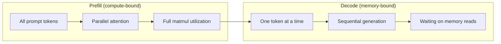
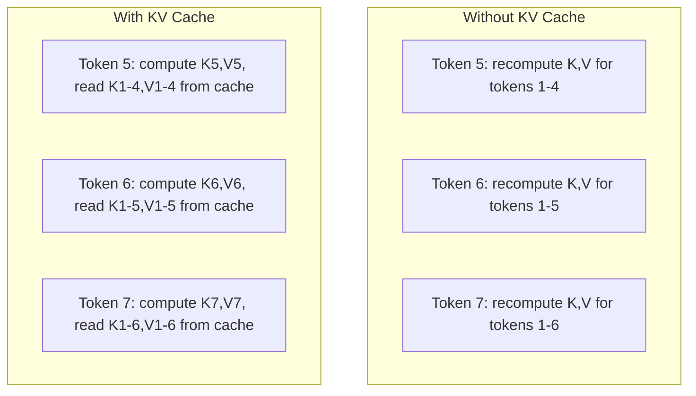
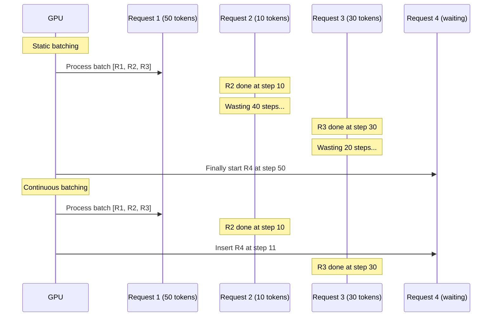
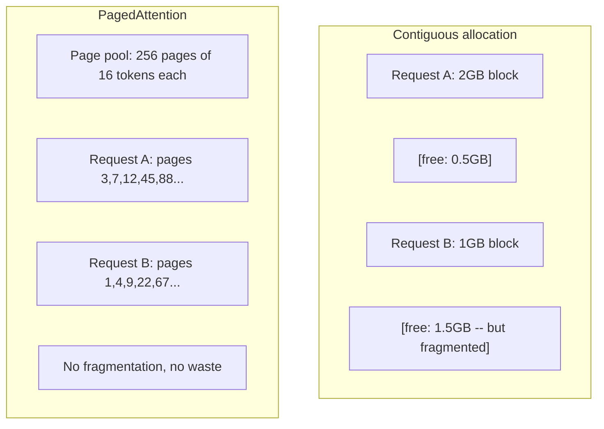
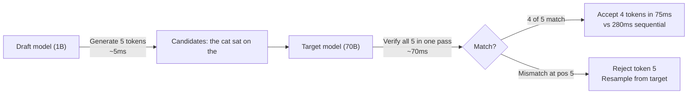

# Optimización de la inferencia

> Dos fases definen la inferencia LLM. Prefill procesa su pedido en paralelo -computado-limitado. Decodificar genera tokens uno a la vez -memoria-limitado. Cada optimización se dirige a uno o ambos.

**Type:** Build
**Languages:** Python
**Prerequisites:** Phase 10, Lessons 01-08 (Transformer architecture, attention)
**Time:** ~120 minutes

## Objetivos de aprendizaje

- Implementar KV-cache para eliminar el cálculo redundante durante la generación de tokens autoregresivos
- Explicar las fases de preempleo vs decodificación de la inferencia del LLM y por qué cada uno tiene diferentes cuellos de botella (computación vs memoria)
- Implementar conceptos de batch continuo y PagedAttention para maximizar la utilización de GPU bajo solicitudes simultáneas
- Comparar las técnicas de optimización de inferencias (cache de KV, descifrado especulativo, atención flash) y sus compensaciones de rendimiento/latencia

## El problema

Se despliega Llama 3 70B en GPUs 4xA100. Un solo usuario recibe ~50 tokens por segundo. Se siente rápido. Luego 100 usuarios alcanzan el punto final simultáneamente. La potencia baja a 3 tokens/segundo/usuario. Su factura de GPU de $25,000/mes está sirviendo respuestas más lentas que un tipo humano.

El modelo en sí no cambia entre 1 usuario y 100 usuarios. Los mismos pesos, la misma arquitectura, la misma matemática. Lo que cambia es la forma en que agendas el trabajo. La inferencia ingenua desperdicia más del 90% de la computación de GPU disponible. Un usuario que espera el token 47 mantiene un espacio completo abierto mientras el bus de memoria de la GPU se encuentra ocioso entre las matmulas. Mientras tanto, la solicitud de 2,000 tokens de un nuevo usuario podría llenar ese tiempo muerto con un cálculo útil.

Esto no es un problema de escala. Es un problema de programación. Las técnicas en esta lección - KV caching, batching continuo, PagedAttention, decodificación especulativa, prefijo caching - son lo que separa una$25k/month inference bill from a $5k/mes uno que sirve al mismo tráfico.

VLLM que sirve Llama 3 70B en 4xA100-80GB logra ~50 tokens/segundo/usuario a baja concurrencia, y sostiene 15-25 TPS/usuario a 100 solicitudes simultáneas a través de batches continuos y PagedAttention. Sin estas optimizaciones, el mismo hardware sirve 5 TPS/usuario en esa concurrencia.

## El concepto

### Preemplaje vs decodificación

Cada solicitud de inferencia LLM tiene dos fases distintas.

**Prefill**El proceso de procesamiento de la entrada de todo el prompt. Todos los tokens son conocidos, por lo que la atención se puede calcular en paralelo a través de la secuencia completa. Esta es una gran multiplicación de matriz - los núcleos de GPU se mantienen ocupados. El cuello de botella es calcular: cuántos FLOPS puede entregar su hardware por segundo. Un A100 hace 312 TFLOPS (BF16). Precargar para un prompt de 4.096 tokens en un modelo 70B toma ~ 400 ms en un solo A100.

**Decode**genera tokens de salida uno a la vez. Cada nuevo token atiende a todos los tokens anteriores, pero solo se produce un token por pase de avance. Las matrices de peso son del mismo tamaño que durante el preempleo, pero las estás multiplicando por un solo vector en lugar de una matriz. Los núcleos de la GPU terminan en microsecondas, luego esperan que llegue el próximo lote de pesas de la memoria. El cuello de botella es el ancho de banda de memoria: la velocidad con la que se puede transmitir los pesos de los modelos desde HBM a las unidades de cálculo. Un A100 tiene 2 TB/s de ancho de banda. Un modelo 70B en FP16 es de 140 GB. Una vez que se lee el modelo completo se tarda 70 segundos -- ese es el piso para un solo paso de decodificación.



El **ops:byte ratio**(también llamado intensidad aritmética) capta este tradeoff. mide cuántas operaciones se realizan por byte cargado de la memoria.

```
ops:byte ratio = FLOPs per token / bytes read from memory
```

Durante el preempleo con un lote de 4.096 tokens, se realizan ~ 4.096 operaciones de multiplicación acumulada por peso cargado. La proporción es alta - usted está limitado a la computación. Durante el decodificación con el tamaño del lote 1, se realiza ~ 1 operación por peso cargado. La proporción es baja - usted está limitado a la memoria.

La idea fundamental: *el decodificación está ligado a la memoria porque se lee todo el modelo para producir un solo token*. Cada optimización a continuación o reduce lo que se lee, aumenta el lote de tokens procesados por lectura, o evita las lecturas por completo.

### Cache de KV

Durante la atención, la consulta de cada token atende a los vectores de clave y valor de cada token anterior. Sin almacenamiento en caché, generar token N requiere recomputar la clave y las proyecciones de valor para todos los tokens N-1 anteriores. Se proyecta token 1 cuando se genera token 2, luego nuevamente para token 3, luego nuevamente para token 4.

El caché KV almacena las proyecciones de clave y valor de todos los tokens anteriores. Al generar el token N, solo se calcula la clave y el valor para el token N, y luego se concatenan con el caché K / V de los tokens 1 a N-1.



**Memory formula for KV cache:**

```
KV cache size = 2 * num_layers * num_kv_heads * head_dim * seq_len * bytes_per_param
```

Para Llama 3 70B (80 capas, 8 cabezas de KV con GQA, cabeza_dim=128, BF16):

```
per token: 2 * 80 * 8 * 128 * 2 bytes = 327,680 bytes = 320 KB
at 4,096 tokens: 320 KB * 4,096 = 1.28 GB
at 128K tokens: 320 KB * 131,072 = 40 GB
```

Una sola conversación de contexto de 128K para Llama 3 70B consume 40 GB de caché KV - la mitad de la memoria de A100. Con 100 usuarios simultáneos en tokens 4K cada uno, el caché KV solo requiere 128 GB. Esta es la razón por la que la gestión de caché KV es el desafío central de la optimización de inferencias.

### El batido continuo

El batch estático espera hasta que llegue un lote de N solicitudes, las procesa juntas y espera hasta que *todos* terminen antes de aceptar nuevas solicitudes. Si una solicitud necesita 500 tokens y otra necesita 10, la solicitud corta permanece ociosa durante 490 pasos de decodificación después de que termine.

El batch continuo (también llamado batch a nivel de iteración) inserta nuevas solicitudes en el batch tan pronto como se completa cualquier solicitud. El batch se reevalúa en cada paso de decodificación. Una solicitud que termina después de 10 tokens se reemplaza inmediatamente por una solicitud de espera.



La mejora de rendimiento depende de cuánto varían las longitudes de salida. Con longitudes uniformes, el batch continuo coincide con el batch estático. Con longitudes variables (el caso común), el batch continuo puede ofrecer un rendimiento 2-5 veces mayor porque las ranuras de GPU nunca se quedan vacías.

### Página Atención

El caché KV para cada solicitud es un bloque de memoria contiguo. A medida que las solicitudes llegan y salen, los fragmentos de memoria - exactamente como la fragmentación de RAM en los sistemas operativos. Una solicitud de token 4K necesita 1.28 GB contiguo. Incluso si tienes 2 GB de total libre, es posible que no tengas 1.28 GB *contiguo*. O pierdes memoria o rechazas la solicitud.

PagedAttention (de vLLM) aplica memoria virtual al estilo de OS al caché KV. En lugar de asignar un bloque contiguo por solicitud, asigna "páginas" de tamaño fijo (típicamente 16 tokens cada uno). Las páginas pueden estar en cualquier lugar de la memoria física de la GPU. Una tabla de página mapea las posiciones lógicas de la secuencia de cada solicitud a ubicaciones físicas de la página.



PagedAttention también permite **copy-on-write**Si 50 solicitudes comparten el mismo sistema de instrucciones, las páginas de caché KV para ese sistema de instrucciones se almacenan una vez y se hacen referencia por todas las 50 solicitudes. Sólo cuando una solicitud diverge (mensajes de usuario diferentes) obtiene sus propias páginas. Esto reduce el uso de memoria dramáticamente para aplicaciones con instrucciones de sistema compartidas.

vLLM informa de desperdicio de memoria casi cero (~4% vs ~60-80% en asignación ingenua) a través de PagedAttention.

### Descripción especulativa

El decodificación es lenta porque es secuencial, se genera un token, se lo devuelve, se genera el siguiente. Pero ¿qué pasa si se puede adivinar los próximos 5 tokens a bajo costo, y luego verificarlos todos a la vez?

La descifrado especulativo utiliza un pequeño, rápido **draft model**para generar tokens candidatos K. El gran **target model**Luego procesa todos los candidatos K en un solo pase hacia adelante (que se parece a un preempleo - paralelo, computacional, eficiente). Si el modelo objetivo está de acuerdo con las predicciones del modelo de borrador, aceptas todos los tokens K en el momento de un pase hacia adelante objetivo. Si no está de acuerdo en la posición j, aceptas tokens 1 a j-1 y desechas el resto.



El aceleramiento depende del **acceptance rate**Para un Llama 3 8B redactando para Llama 3 70B, las tasas de aceptación de 70-85% son típicas en el lenguaje natural. Esto se traduce en 2-3x de descodación de velocidad.

Tres enfoques para la descodificación especulativa:

| Method | Draft source | Acceptance rate | Overhead |
|--------|-------------|-----------------|----------|
| Draft-target (Leviathan et al.) | Separate small model | 70-85% | Draft model memory |
| EAGLE (Li et al.) | Lightweight head on target | 75-90% | ~1% extra parameters |
| N-gram lookup | Token n-gram table | 40-60% | Negligible |

**EAGLE**Entrena una pequeña cabeza autorregresista en la parte superior de los estados ocultos del modelo objetivo. Predece la incorporación del siguiente token utilizando las características de la segunda a última capa del modelo objetivo. Debido a que opera en las propias representaciones del modelo objetivo (no de un modelo separado), logra tasas de aceptación más altas con una memoria extra mínima. EAGLE-2 añade un árbol de proyección dinámico que ajusta el número de candidatos en función del contexto.

**N-gram speculative decoding**El proyecto de trabajo de la red neuronal de la red de datos de la red neuronal de la red de datos de la red neuronal de la red de datos de la red de datos de la red neuronal de la red de datos de la red de datos de la red de datos de la red de datos de la red neuronal de la red de datos de la red de datos de la red de datos de la red de datos de la red de datos de la red de datos de la red de datos de la red de datos de la red de datos de la red de datos de la red de datos de la red de datos de la red de datos de la red de datos de la red de datos de la red de datos de la red de datos de la red de datos de la red de datos de la red de datos de la red de datos de la red de datos de la red de datos de la red de datos de la red de datos de la red de datos de la red de datos de la red de datos de la red de datos de la red de datos de datos de la red de datos de datos de la red de datos de datos de la red de datos de datos de la red de datos de datos de datos de la red de datos de datos de datos de la red de datos de datos de datos de la red de datos de datos de datos de la red de datos de datos de datos de datos de la red de datos de datos de datos de datos de la red de datos de datos de datos de datos de la red de datos de datos de datos de la red de datos de datos de datos de Internet de la red de Internet de Internet de Internet de Internet de Internet de Internet de Internet de Internet de Internet de Internet de Internet de Internet de Internet de Internet de Internet de Internet de Internet de Internet de Internet de Internet de Internet de Internet de Internet de Internet de Internet de Internet de Internet de Internet de Internet de Internet de Internet de Internet de Internet de Internet de Internet de Internet de Internet de Internet de Internet de Internet de Internet de Internet de Internet de Internet de Internet de Internet de Internet de Internet de Internet de Internet de Internet de Internet de Internet de Internet de Internet de Internet de Internet de Internet de Internet de Internet de Internet de Internet de Internet de Internet de Internet de Internet de Internet de Internet de Internet de Internet de Internet de Internet de Internet de Internet de Internet de Internet de Internet de Internet de Internet de Internet de Internet de Internet de Internet de Internet de Internet de Internet de Internet de Internet

La descifrado especulativo es * matemáticamente exacto * - la distribución de salida es idéntica a la distribución del modelo objetivo. No es una aproximación. El paso de verificación asegura que cada token aceptado tiene exactamente la probabilidad que el modelo objetivo habría asignado.

### Prefijo Caching

Muchas solicitudes comparten el mismo prefijo. Un chatbot de sistema de solicitud. Un bloque de contexto RAG. Un conjunto de ejemplos de algunos disparos. Sin caché de prefijos, cada solicitud recalcula el caché KV para estos tokens compartidos desde cero.

El prefijo de caché almacena el caché KV para prefijos comunes y lo reutiliza en todas las solicitudes. Cuando una nueva solicitud llega con un prefijo conocido, el sistema copia (o hace referencias) a las entradas de KV almacenadas en caché y solo calcula el KV para el sufijo único.

Para un sistema de 2,000 tokens compartido en todas las solicitudes, el caching de prefijos elimina ~400 ms de prefill por solicitud. A 100 solicitudes/segundo, eso ahorra 40 segundos de computación de GPU por segundo, más de un GPU de trabajo.

RadixAttention de SGLang implementa el caché de prefijos con un árbol radix (trie) que indexa los prefijos por su contenido de token. Cualquier solicitud que coincida con un prefijo almacenado obtiene su caché KV de forma gratuita. El árbol permite coincidencias parciales de prefijos - si comparte 1,500 de los 2,000 tokens de prefijos con una entrada caché, reutiliza esos 1,500 y recompite solo 500.

### Motores de inflexión

Tres motores dominan la producción LLM sirviendo:

| Engine | Key innovation | Best for |
|--------|---------------|----------|
| vLLM | PagedAttention, continuous batching | General-purpose serving, highest compatibility |
| SGLang | RadixAttention (prefix caching), structured generation | Multi-turn chatbots, constrained decoding |
| TensorRT-LLM | NVIDIA kernel fusion, FP8 quantization | Maximum single-GPU throughput on NVIDIA hardware |

**vLLM**Es el punto de partida predeterminado. Suporta la gama más amplia de modelos, se ejecuta en cualquier proveedor de GPU (NVIDIA, AMD, Intel) y logra un alto rendimiento a través de PagedAttention + batching continuo. La API compatible con OpenAI significa que puede soltarlo como un reemplazo para cualquier llamada de API OpenAI.

**SGLang**Se basa en las mismas bases que vLLM, pero añade RadixAttention para el caching de prefijos y un lenguaje específico de dominio para programas de LLM estructurados. Si su carga de trabajo implica conversaciones de múltiples vueltas, uso de herramientas o decodificación limitada (salida de JSON, generación guiada por regex), SGLang a menudo supera a vLLM en 2-5 veces a través de la reutilización de prefijos.

**TensorRT-LLM**Compila modelos en núcleos GPU optimizados de NVIDIA. Combina operaciones (atención + lineal + activación en un núcleo), utiliza FP8 en GPU H100 y se integra con NVIDIA Triton Inference Server para su implementación en producción.

Números del mundo real para Llama 3 70B (4xA100-80GB, BF16):

| Metric | vLLM | SGLang | TensorRT-LLM |
|--------|------|--------|---------------|
| Throughput (1 user) | ~50 TPS | ~55 TPS | ~65 TPS |
| Throughput (100 users) | ~2,500 total TPS | ~3,200 total TPS | ~3,000 total TPS |
| Time to first token | ~400ms | ~300ms (prefix hit) | ~350ms |
| Max context | 128K | 128K | 128K |

### El marco de operaciones:byte

No se puede optimizar lo que no se mide. La relación ops:byte le dice si usted está limitado a la computación o a la memoria, lo que determina qué optimizaciones importan.

```
Compute roof: peak FLOPS of the GPU
Memory roof:  peak bandwidth * ops:byte ratio
```

Cuando ops:byte es bajo (decodificación, pequeños lotes), se golpea el techo de ancho de banda de memoria. Agregar más computación (horario más alto, más núcleos) no ayuda.

Cuando ops:byte es alto (preemplazo, grandes lotes), se golpea el techo de cálculo. La optimización del ancho de banda de memoria no ayuda. Se necesitan GPU más rápidas, fusión del núcleo o una precisión reducida para apretar más FLOPS.

| Scenario | ops:byte | Bound | Optimize with |
|----------|----------|-------|---------------|
| Prefill, batch=1 | ~4,096 | Compute | Kernel fusion, FP8 |
| Decode, batch=1 | ~1 | Memory | Quantization, KV compression |
| Decode, batch=32 | ~32 | Memory | Larger batch, continuous batching |
| Decode, batch=256 | ~256 | Transitioning | Both matter |
| Decode, batch=1024 | ~1,024 | Compute | Kernel fusion, tensor parallelism |

El punto de cruce en A100 es alrededor de ops:byte = 156 (312 TFLOPS / 2 TB/s). Por debajo de 156, está limitado a la memoria. Por encima de 156, está limitado a la computación.

```figure
context-window-slide
```

## Construye el mismo

### Paso 1: Cache de KV desde cero

Construimos una caché KV multi-head que almacena proyecciones de clave y valor por capa, por cabeza, y demuestra el patrón de crecimiento de la memoria.

```python
import numpy as np

class KVCache:
    def __init__(self, num_layers, num_heads, head_dim, max_seq_len, dtype=np.float16):
        self.num_layers = num_layers
        self.num_heads = num_heads
        self.head_dim = head_dim
        self.max_seq_len = max_seq_len
        self.dtype = dtype

        self.k_cache = np.zeros(
            (num_layers, num_heads, max_seq_len, head_dim), dtype=dtype
        )
        self.v_cache = np.zeros(
            (num_layers, num_heads, max_seq_len, head_dim), dtype=dtype
        )
        self.seq_len = 0

    def update(self, layer_idx, new_keys, new_values):
        num_new = new_keys.shape[1]
        end = self.seq_len + num_new
        self.k_cache[layer_idx, :, self.seq_len:end, :] = new_keys
        self.v_cache[layer_idx, :, self.seq_len:end, :] = new_values
        return (
            self.k_cache[layer_idx, :, :end, :],
            self.v_cache[layer_idx, :, :end, :]
        )

    def advance(self, num_tokens):
        self.seq_len += num_tokens

    def memory_bytes(self):
        return self.k_cache.nbytes + self.v_cache.nbytes

    def used_bytes(self):
        per_token = 2 * self.num_layers * self.num_heads * self.head_dim * np.dtype(self.dtype).itemsize
        return per_token * self.seq_len
```

### Paso 2: Atención con el caché KV

Una atención simplificada de múltiples cabezas que utiliza la caché KV para decodificar pasos.

```python
def scaled_dot_product_attention(query, keys, values):
    head_dim = query.shape[-1]
    scores = np.matmul(query, keys.transpose(0, 1, 3, 2)) / np.sqrt(head_dim)
    seq_len_q = scores.shape[-2]
    seq_len_k = scores.shape[-1]
    if seq_len_q > 1:
        mask = np.triu(np.ones((seq_len_q, seq_len_k), dtype=np.float32), k=seq_len_k - seq_len_q + 1)
        scores = scores + mask * (-1e9)
    max_scores = np.max(scores, axis=-1, keepdims=True)
    exp_scores = np.exp(scores - max_scores)
    attn_weights = exp_scores / np.sum(exp_scores, axis=-1, keepdims=True)
    return np.matmul(attn_weights, values)


class MultiHeadAttention:
    def __init__(self, d_model, num_heads):
        self.num_heads = num_heads
        self.head_dim = d_model // num_heads
        scale = np.sqrt(2.0 / d_model)
        self.W_q = np.random.randn(d_model, d_model).astype(np.float32) * scale
        self.W_k = np.random.randn(d_model, d_model).astype(np.float32) * scale
        self.W_v = np.random.randn(d_model, d_model).astype(np.float32) * scale
        self.W_o = np.random.randn(d_model, d_model).astype(np.float32) * scale

    def forward(self, x, kv_cache=None, layer_idx=0):
        batch, seq_len, d_model = x.shape
        Q = np.matmul(x, self.W_q).reshape(batch, seq_len, self.num_heads, self.head_dim).transpose(0, 2, 1, 3)
        K = np.matmul(x, self.W_k).reshape(batch, seq_len, self.num_heads, self.head_dim).transpose(0, 2, 1, 3)
        V = np.matmul(x, self.W_v).reshape(batch, seq_len, self.num_heads, self.head_dim).transpose(0, 2, 1, 3)

        if kv_cache is not None:
            K_full, V_full = kv_cache.update(layer_idx, K[0], V[0])
            K = K_full[np.newaxis, :, :, :]
            V = V_full[np.newaxis, :, :, :]
            if seq_len == 1:
                kv_cache.advance(1)

        attn_out = scaled_dot_product_attention(Q, K, V)
        attn_out = attn_out.transpose(0, 2, 1, 3).reshape(batch, -1, d_model)
        return np.matmul(attn_out, self.W_o)
```

### Paso 3: Simulador de batch continuo

Esto simula la diferencia de programación entre el lote estático y el lote continuo.

```python
import heapq

class Request:
    def __init__(self, request_id, prompt_tokens, output_tokens, arrival_step):
        self.request_id = request_id
        self.prompt_tokens = prompt_tokens
        self.output_tokens = output_tokens
        self.arrival_step = arrival_step
        self.tokens_generated = 0
        self.start_step = None
        self.end_step = None

    def is_done(self):
        return self.tokens_generated >= self.output_tokens


def simulate_static_batching(requests, batch_size):
    step = 0
    completed = []
    queue = list(requests)
    queue.sort(key=lambda r: r.arrival_step)

    while queue:
        batch = []
        while queue and len(batch) < batch_size:
            r = queue.pop(0)
            r.start_step = max(step, r.arrival_step)
            batch.append(r)

        if batch:
            step = max(step, max(r.start_step for r in batch))
            max_output = max(r.output_tokens for r in batch)
            for r in batch:
                r.tokens_generated = r.output_tokens
                r.end_step = step + max_output
            step += max_output
            completed.extend(batch)

    return completed


def simulate_continuous_batching(requests, batch_size):
    step = 0
    completed = []
    queue = sorted(requests, key=lambda r: r.arrival_step)
    queue_idx = 0
    active = []
    waiting = []

    while queue_idx < len(queue) or active or waiting:
        while queue_idx < len(queue) and queue[queue_idx].arrival_step <= step:
            waiting.append(queue[queue_idx])
            queue_idx += 1

        while waiting and len(active) < batch_size:
            r = waiting.pop(0)
            r.start_step = step
            active.append(r)

        if not active:
            if waiting:
                step += 1
                continue
            elif queue_idx < len(queue):
                step = queue[queue_idx].arrival_step
                continue
            else:
                break

        for r in active:
            r.tokens_generated += 1

        done = [r for r in active if r.is_done()]
        for r in done:
            r.end_step = step + 1
            completed.append(r)
        active = [r for r in active if not r.is_done()]

        step += 1

    return completed


def batching_stats(completed):
    latencies = [r.end_step - r.arrival_step for r in completed]
    total_time = max(r.end_step for r in completed) - min(r.arrival_step for r in completed)
    total_tokens = sum(r.output_tokens for r in completed)
    return {
        "avg_latency": np.mean(latencies),
        "p50_latency": np.median(latencies),
        "p99_latency": np.percentile(latencies, 99),
        "total_time": total_time,
        "throughput": total_tokens / total_time if total_time > 0 else 0,
    }
```

### Paso 4: Prefijo en caché

Una caché de prefijos basado en trie que almacena entradas KV para prefijos compartidos.

```python
class TrieNode:
    def __init__(self):
        self.children = {}
        self.kv_data = None
        self.hit_count = 0


class PrefixCache:
    def __init__(self, max_entries=1000):
        self.root = TrieNode()
        self.max_entries = max_entries
        self.total_entries = 0
        self.hits = 0
        self.misses = 0

    def _walk(self, token_ids):
        node = self.root
        depth = 0
        for tid in token_ids:
            if tid not in node.children:
                break
            node = node.children[tid]
            depth += 1
        return node, depth

    def lookup(self, token_ids):
        node, depth = self._walk(token_ids)
        if depth > 0:
            self.hits += 1
            current = self.root
            for tid in token_ids[:depth]:
                current = current.children[tid]
                current.hit_count += 1
            kv_entries = []
            current = self.root
            for tid in token_ids[:depth]:
                current = current.children[tid]
                if current.kv_data is not None:
                    kv_entries.append(current.kv_data)
            return depth, kv_entries
        self.misses += 1
        return 0, []

    def insert(self, token_ids, kv_per_token):
        node = self.root
        for i, tid in enumerate(token_ids):
            if tid not in node.children:
                if self.total_entries >= self.max_entries:
                    return i
                node.children[tid] = TrieNode()
                self.total_entries += 1
            node = node.children[tid]
            if i < len(kv_per_token):
                node.kv_data = kv_per_token[i]
        return len(token_ids)

    def hit_rate(self):
        total = self.hits + self.misses
        return self.hits / total if total > 0 else 0.0
```

### Paso 5: Simulador de descifrado especulativo

Simulamos la descifrado especulativo del proyecto objetivo con tasas de aceptación configurables.

```python
class DraftModel:
    def __init__(self, vocab_size, acceptance_rate=0.8):
        self.vocab_size = vocab_size
        self.acceptance_rate = acceptance_rate

    def generate(self, context, num_tokens):
        tokens = np.random.randint(0, self.vocab_size, size=num_tokens)
        return tokens

    def get_probs(self, context, token):
        probs = np.random.dirichlet(np.ones(self.vocab_size))
        return probs


class TargetModel:
    def __init__(self, vocab_size):
        self.vocab_size = vocab_size

    def get_probs(self, context, tokens=None):
        if tokens is not None:
            return [np.random.dirichlet(np.ones(self.vocab_size)) for _ in tokens]
        return np.random.dirichlet(np.ones(self.vocab_size))


def speculative_decode(draft_model, target_model, context, num_speculative=5,
                       draft_cost=1.0, target_cost=10.0, verify_cost=12.0):
    total_tokens = 0
    total_cost = 0.0
    accepted_counts = []
    context = list(context)

    max_tokens = 100

    while total_tokens < max_tokens:
        draft_tokens = draft_model.generate(context, num_speculative)
        total_cost += draft_cost * num_speculative

        target_probs = target_model.get_probs(context, draft_tokens)
        total_cost += verify_cost

        accepted = 0
        for i, token in enumerate(draft_tokens):
            draft_p = draft_model.get_probs(context + list(draft_tokens[:i]), token)
            target_p = target_probs[i]

            r = np.random.random()
            acceptance_prob = min(1.0, target_p[token] / (draft_p[token] + 1e-10))

            if r < draft_model.acceptance_rate:
                accepted += 1
                context.append(token)
                total_tokens += 1
            else:
                new_token = np.random.choice(draft_model.vocab_size, p=target_p)
                context.append(new_token)
                total_tokens += 1
                break

        accepted_counts.append(accepted)

        if accepted == num_speculative:
            bonus_probs = target_model.get_probs(context)
            bonus_token = np.random.choice(draft_model.vocab_size, p=bonus_probs)
            context.append(bonus_token)
            total_tokens += 1

    sequential_cost = total_tokens * target_cost
    return {
        "total_tokens": total_tokens,
        "speculative_cost": total_cost,
        "sequential_cost": sequential_cost,
        "speedup": sequential_cost / total_cost if total_cost > 0 else 1.0,
        "avg_accepted": np.mean(accepted_counts),
        "acceptance_rate": np.mean(accepted_counts) / num_speculative,
    }


def compare_speculation_strategies(vocab_size=1000, num_trials=20):
    results = {}

    for name, acceptance_rate, spec_tokens in [
        ("Draft-target (8B->70B)", 0.78, 5),
        ("EAGLE", 0.85, 6),
        ("N-gram", 0.50, 4),
        ("No speculation", 0.0, 0),
    ]:
        if spec_tokens == 0:
            results[name] = {
                "speedup": 1.0,
                "acceptance_rate": 0.0,
                "avg_accepted": 0.0,
            }
            continue

        trial_results = []
        for _ in range(num_trials):
            draft = DraftModel(vocab_size, acceptance_rate=acceptance_rate)
            target = TargetModel(vocab_size)
            context = list(np.random.randint(0, vocab_size, size=10))
            result = speculative_decode(draft, target, context, num_speculative=spec_tokens)
            trial_results.append(result)

        results[name] = {
            "speedup": np.mean([r["speedup"] for r in trial_results]),
            "acceptance_rate": np.mean([r["acceptance_rate"] for r in trial_results]),
            "avg_accepted": np.mean([r["avg_accepted"] for r in trial_results]),
        }

    return results
```

### Paso 6: Perfil de memoria de caché KV

Computa los requisitos de memoria caché KV para configuraciones reales de modelos.

```python
MODEL_CONFIGS = {
    "Llama-3-8B": {
        "num_layers": 32, "num_kv_heads": 8, "head_dim": 128,
        "model_params_b": 8, "gqa": True,
    },
    "Llama-3-70B": {
        "num_layers": 80, "num_kv_heads": 8, "head_dim": 128,
        "model_params_b": 70, "gqa": True,
    },
    "Llama-3-405B": {
        "num_layers": 126, "num_kv_heads": 8, "head_dim": 128,
        "model_params_b": 405, "gqa": True,
    },
    "Mistral-7B": {
        "num_layers": 32, "num_kv_heads": 8, "head_dim": 128,
        "model_params_b": 7, "gqa": True,
    },
    "GPT-4-est": {
        "num_layers": 120, "num_kv_heads": 96, "head_dim": 128,
        "model_params_b": 1800, "gqa": False,
    },
}


def kv_cache_memory(config, seq_len, dtype_bytes=2):
    per_token = 2 * config["num_layers"] * config["num_kv_heads"] * config["head_dim"] * dtype_bytes
    total = per_token * seq_len
    return {
        "per_token_bytes": per_token,
        "per_token_kb": per_token / 1024,
        "total_bytes": total,
        "total_mb": total / (1024 ** 2),
        "total_gb": total / (1024 ** 3),
    }


def memory_budget(config, gpu_memory_gb, model_dtype_bytes=2, kv_dtype_bytes=2):
    model_memory_gb = config["model_params_b"] * 1e9 * model_dtype_bytes / (1024 ** 3)
    overhead_gb = gpu_memory_gb * 0.1
    available_for_kv = gpu_memory_gb - model_memory_gb - overhead_gb

    if available_for_kv <= 0:
        return {"error": "Model does not fit in GPU memory", "model_memory_gb": model_memory_gb}

    per_token = 2 * config["num_layers"] * config["num_kv_heads"] * config["head_dim"] * kv_dtype_bytes
    max_tokens = int(available_for_kv * (1024 ** 3) / per_token)

    return {
        "gpu_memory_gb": gpu_memory_gb,
        "model_memory_gb": round(model_memory_gb, 1),
        "overhead_gb": round(overhead_gb, 1),
        "available_for_kv_gb": round(available_for_kv, 1),
        "max_total_tokens": max_tokens,
        "max_users_at_2k": max_tokens // 2048,
        "max_users_at_4k": max_tokens // 4096,
        "max_users_at_32k": max_tokens // 32768,
    }
```

## Usalo

Con VLLM:

```python
from vllm import LLM, SamplingParams

llm = LLM(
    model="meta-llama/Llama-3-70B-Instruct",
    tensor_parallel_size=4,
    enable_prefix_caching=True,
    max_model_len=8192,
    gpu_memory_utilization=0.9,
)

params = SamplingParams(temperature=0.7, max_tokens=256)
outputs = llm.generate(["Explain inference optimization in one paragraph."], params)
```

Con SGLang para caché de prefijos + salida estructurada:

```python
import sglang as sgl

@sgl.function
def classify(s, text):
    s += sgl.system("You are a classifier. Output JSON only.")
    s += sgl.user(f"Classify this text: {text}")
    s += sgl.assistant(sgl.gen("result", regex=r'\{"label": "(positive|negative|neutral)"\}'))

runtime = sgl.Runtime(model_path="meta-llama/Llama-3-70B-Instruct", tp_size=4)
sgl.set_default_backend(runtime)

results = classify.run_batch([
    {"text": "This product is amazing!"},
    {"text": "Terrible experience."},
    {"text": "It was okay I guess."},
])
```

Con TensorRT-LLM:

```python
import tensorrt_llm
from tensorrt_llm.runtime import ModelRunner

runner = ModelRunner.from_dir("./llama-70b-trt-engine/", rank=0)

outputs = runner.generate(
    batch_input_ids=[tokenizer.encode("Explain KV caching.")],
    max_new_tokens=256,
    temperature=0.7,
)
```

## Envío

Esta lección produce:
- `outputs/skill-inference-optimization.md`-- una habilidad para diagnosticar y optimizar la inferencia del LLM

## Los ejercicios

1. Modifique el perfilador de caché KV para comparar la cuantización de caché KV FP16 vs FP8 vs INT4 para Llama 3 70B en contexto 4K, compute el máximo de usuarios simultáneos para cada uno en 4xA100-80GB. La cuantización KV a INT4 debe ser aproximadamente 4 veces la capacidad del usuario.

2. Extenda el simulador de lotes continuos para rastrear la utilización de la GPU (fracción de ranuras de lotes llenas por paso). Utilización de la parcela a lo largo del tiempo tanto para el lotes estático como continuo con 50 solicitudes cuyas longitudes de salida siguen una distribución de Pareto (forma=1.5, escala=20).

3. Implementar una versión de la caché de KV de atención de consulta agrupada (GQA) donde `num_kv_heads < num_query_heads`. Llama 3 70B utiliza 64 cabezas de consulta pero sólo 8 cabezas de KV. Calcule el ahorro de memoria frente a la atención completa de múltiples cabezas (8 veces reducción en el tamaño de la caché de KV).

4. Construir una caché de prefijos que utilice el desalojo LRU. Establezca 500 entradas máximas y genere 1.000 solicitudes donde el 60% comparte uno de los 5 prefijos comunes. Medir la tasa de hits y comparar con la caché ilimitado. Con un buen desalojo, la tasa de hits debe permanecer por encima del 55%.

5. Extenda el simulador de descifrado especulativo para implementar la especulación basada en árboles (estilo EAGLE-2). En lugar de una sola cadena de tokens de proyecto K, genere un árbol de candidatos (por ejemplo, 2 ramas en cada uno de los 3 niveles = 8 candidatos de hoja). Compara el total de tokens aceptados por ronda de verificación vs especulación lineal.

## Términos clave

| Term | What people say | What it actually means |
|------|----------------|----------------------|
| Prefill | "Processing the prompt" | Computing attention over all input tokens in parallel -- compute-bound because the full matrix multiplication keeps GPU cores busy |
| Decode | "Generating tokens" | Producing one token per forward pass, reading the full model weights each time -- memory-bound because compute finishes before the next weights arrive |
| KV cache | "Caching attention states" | Storing the key and value projections for all previous tokens so they are not recomputed at each decode step -- trades memory for compute |
| Continuous batching | "Dynamic batching" | Inserting new requests into the running batch as soon as any request finishes, evaluated at every decode iteration rather than waiting for the whole batch |
| PagedAttention | "Virtual memory for KV cache" | Allocating KV cache in fixed-size pages instead of contiguous blocks, eliminating memory fragmentation and enabling copy-on-write for shared prefixes |
| Speculative decoding | "Draft and verify" | Using a fast draft model to propose multiple tokens, then verifying them all in one target model forward pass -- mathematically exact, 2-3x speedup |
| EAGLE | "Self-speculative decoding" | A speculative decoding variant that trains a lightweight head on the target model's own hidden states, achieving higher acceptance rates than a separate draft model |
| Prefix caching | "Reusing system prompt KV" | Storing computed KV cache entries for common prefixes (system prompts, few-shot examples) and reusing them across requests to skip redundant prefill |
| Ops:byte ratio | "Arithmetic intensity" | The ratio of compute operations to memory bytes read -- determines whether a workload is compute-bound (high ratio) or memory-bound (low ratio) |
| Time to first token | "TTFT" | Latency from receiving a request to producing the first output token -- dominated by prefill time for long prompts |

## Leer más

- Kwon et al., "Gestión eficiente de la memoria para el modelo de lenguaje grande que sirve con PagedAttention" (2023) -- el documento vLLM que introdujo la gestión de caché KV en páginas, ahora el estándar de la industria para la inferencia de servicio
- Leviathan et al., "Inferencia rápida de los transformadores a través de la descodificación especulativa" (2023) -- el documento fundacional que demuestra que la especulación de verificación de proyectos produce distribuciones exactas de modelos objetivo al tiempo que logra una velocidad de 2-3 veces
- Li et al., "EAGLE: El muestreo especulativo requiere una nueva incertidumbre de características" (2024) -- logra mayores tasas de aceptación mediante la formación de un jefe sobre las características propias del modelo objetivo en lugar de utilizar un modelo de borrador separado
- Zheng et al., "SGLang: Ejecución Eficiente de Programas de Modelo de Lenguaje Estructurado" (2024) -- introduce RadixAttention para el caching de prefijos y un modelo de programación para programas de LLM de múltiples llamadas
- Williams et al., "Roofline: Un modelo de rendimiento visual de visión para arquitecturas multicore" (2009) -- el papel original de tejado que formalizó el marco ops:byte para el razonamiento sobre cuellos de botella de computación vs memoria
