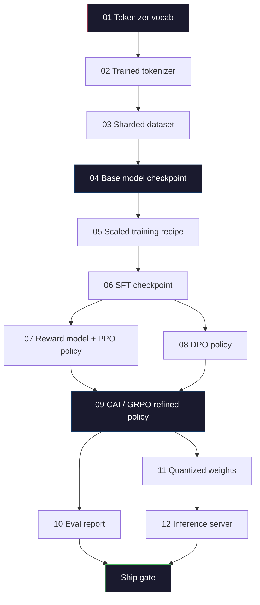
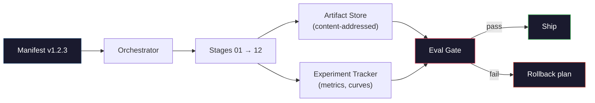

# Construir un oleoducto completo de LLM

> Todo desde las lecciones 01 a 12 es una etapa de una tubería. Esta lección es el andamio que convierte esas etapas en una sola carrera de extremo a extremo: tokenizar, pre-trein, escala, SFT, alinear, evaluar, cuantizar, servir. No entrenarás a un modelo 70B en una computadora portátil. Producirás la capa de orquestación, el manifiesto, la puerta de evaluación y el plan de retroceso que un equipo fronterizo de 2026 utiliza para decidir qué se envíe. Esta es la piedra angular.

**Type:** Build
**Languages:** Python (stdlib)
**Prerequisites:** All Phase 10 lessons 01-12
**Time:** ~120 minutes

## Objetivos de aprendizaje

- Componer las once lecciones anteriores (tokenizer, datos, pre-entrenamiento, escalado, SFT, RLHF, DPO, CAI, eval, cuantización, inferencia) en una única especificación de tubería reproducible
- Definir el contrato de artefacto entre etapas: lo que consume cada etapa, lo que produce y cómo la siguiente etapa verifica la entrada
- Construir un orquestrador que rastrear experimentos, hashes artefactos, y puertas de envío decisiones en los umbrales de evaluación
- Diseñar el plan de retroceso: qué artefactos son baratos para volver a usar, cuáles son caros y cuánto cuesta un puesto de control corrupto

## El problema

Las clases anteriores cada trabajo. Tokenizer entrenado. GPT pequeño pre-entrenado. Datos de SFT ensamblado. Modelo de recompensas entrenado. DPO ejecutado. Evalos medidos. Pesos cuantizados exportados. servidor de inferencia girado. Cada uno es una libreta. Cada uno tiene sus propias convenciones, sus propias vías de salida, su propia semilla.

Una carrera de entrenamiento fronterizo no es un cuaderno. Llama 3 405B tomó 30 millones de horas H100 en aproximadamente 54 días. DeepSeek-V3 usó alrededor de 2,8 millones de horas H800. Durante ese tiempo, un punto de control corrupto, una contaminación de datos, una regresión de evaluación puede costar a un equipo una semana de tiempo y un mes de presupuesto de GPU. La forma en que los equipos sobreviven a esto es a través de la higiene de la tubería: cada etapa tiene una entrada determinista, una salida determinista, un manifiesto, un hash y una puerta.

Esto es la piedra angular. No se ejecutará la tubería de extremo a extremo en una computadora portátil. Se escribirá el orquestrador que coordina las etapas, el manifiesto que describe la carrera, el verificador que se encarga de las decisiones de navegación, y el plan de repetición que permite a un tercero volver a ejecutar su trabajo desde un solo archivo. El código es pequeño; la disciplina es grande.

El patrón se extiende desde 100M hasta 1T sin cambios. Los mismos cuatro componentes - manifiesto, orquestrador, puerta de evaluación, almacén de artefactos - ejecutan Llama 3 y también ejecutan su hobby GPT. La diferencia es el tamaño de los números dentro de la configuración de cada etapa, no la forma de la tubería.

## El concepto

### Las doce etapas

Cada lección de la Fase 10 es una etapa. Aquí está el gráfico completo de dependencia.



Las etapas 07 y 08 pueden funcionar en paralelo. Todo lo demás es una dependencia dura. Un cambio en la etapa 02 (tokenizer) invalidará todos los artefactos en la corriente baja. Un cambio en la etapa 10 (eval) invalidará solo la decisión del barco.

### El Manifiesto

Un manifiesto es un archivo único que describe una ejecución completamente lo suficiente como para reproducirla. Nada que el oleoducto produzca debe depender del estado que no está en el manifiesto. Los campos son aburridos y obligatorios.

```
pipeline_version: 1.2.3
seed: 42
git_commit: a1b2c3d4
stages:
  01_tokenizer:
    recipe: bpe_32k
    input_hash: sha256:...
    output_hash: sha256:...
    wall_clock_sec: 3600
    cost_usd: 12
```

El hash de salida de la etapa N es el hash de entrada de la etapa N+1. Cualquier desviación y la tubería se detiene. Así es como se detecta la corrupción de datos temprano. También es cómo un compañero de equipo en un continente diferente verifica que su repetición produjo el mismo artefacto que el tuyo.

En la práctica los equipos utilizan un pequeño esquema YAML más un verificador manifest que difiere de la ejecución exitosa anterior.

### Tipografía de artefactos

La salida de cada etapa es un artefacto tipado, no un manto de directorio, no un picillo, sino un tipo con nombre con un esquema conocido.

| Stage | Artifact Type | Key Fields |
|-------|--------------|-----------|
| 01-02 | Tokenizer | vocab.json, merges.txt, config.json, hash |
| 03 | Dataset | shards[], row count, token count, dedup stats |
| 04-05 | Checkpoint | weights.safetensors, config.json, optimizer state, step count |
| 06 | SFT Model | checkpoint + SFT recipe + data mix |
| 07 | Reward Model | RM checkpoint + preference data hash |
| 08-09 | Policy | checkpoint + reference hash + beta + KL budget consumed |
| 10 | Eval Report | benchmark scores + regression diffs + eval data hash |
| 11 | Quantized Model | quantized weights + calibration data + accuracy delta vs FP16 |
| 12 | Server Spec | endpoint + model hash + config + observability hooks |

La mecanografía evita el modo de falla más común: el uso de una salida de etapa 08 como entrada de etapa 06, el envío de un modelo entrenado por DPO a través del camino SFT.

### La puerta de Eval

El envío no es "la capacitación terminada". El envío es "la capacitación terminada y la puerta de evaluación pasada". La puerta se define antes de que comience la carrera.

```
gates:
  mmlu:      >= baseline + 0.5   # no regression
  humaneval: >= baseline + 1.0
  truthfulqa: >= baseline         # no drop
  safety_refusal_rate: <= 0.05
  kl_from_reference: <= 25.0
  cost_total_usd: <= 50000
```

Cada puerta es un umbral numérico. No hay puertas "parecen buenas". No hay firmas subjetivas. Si cada puerta pasa, el artefacto se marca embarcable. Si alguna puerta falla, la carrera se mantiene en espera de una supervisión explícita por un revisor nombrado, que se registra en el manifiesto.

La mayoría de los desastres se detectan en dos puertas: una puerta de regresión (el nuevo modelo debe ser al menos tan bueno como el anterior en referencia) detecta errores de formación.

### El Orquestrador

Un pequeño código que lee el manifiesto, despacha etapas, rastrea artefactos y detiene cualquier violación de contrato. Esto no es Airflow. Esto no es Kubeflow. Para la higiene de tuberías quieres algo aburrido que has escrito.

El trabajo del orquestrador es estrecho:

1. Resolva el día de la fiesta del manifiesto.
2. Para cada etapa, compruebe si la salida esperada ya existe en el hash correcto (salte si es así).
3. Conduce el escenario, captura el estorbo, mide el reloj de la pared y el costo.
4. Verifique el hash de salida contra el hash de entrada esperado de la etapa descendente.
5. En caso de fallo, escriba un manifiesto parcial con la etapa exacta de fallo y salga no cero.

Eso es 200 líneas de Python.`code/main.py`En esta lección, bajo el capó, el oleoducto real usa`torchrun`o `ray`para ejecutar etapas individuales en grupos, pero el orquestrador mismo funciona en una sola caja.

### El seguimiento de experimentos y el almacenamiento de artefactos

Dos sistemas externos anclan el oleoducto.

**Experiment tracker (wandb, neptune, mlflow).**El rastreador es donde vas cuando necesitas comparar la carrera A con la carrera B tres semanas después. Los equipos casi siempre usan un rastreador alojado para esto. Escribir tu propio tiempo pierde que debería ir al entrenamiento.

**Artifact store (S3, R2, GCS).**Almacenamiento de objetos inmutables para puntos de control, conjuntos de datos, tokenizers, informes de evaluación. los artefactos se dirigen por hash, no por nombre de archivo.`latest.pt`es una pistola de pie;`ckpt-7b-step-20000-sha256:abc123.safetensors`es un contrato.

El orquestrador escribe a ambos, el rastreador es para los humanos que miran mapas, la tienda de artefactos es para la siguiente etapa buscando entradas.

### Costo

Una carrera fronteriza tiene un número de dólar adjunto.

**Pre-run estimate.**A partir del manifiesto, calcular los FLOPs esperados (para la pre-entrenamiento: 6 x parámetros x tokens), las horas esperadas de GPU (FLOPs / rendimiento máximo / utilización), y el costo en dólares a la tasa de alquiler actual.

**In-run tracking.**El reloj de la pared y el costo están registrados en el manifiesto. Después de cada etapa, se verifica el presupuesto restante. Si una etapa se supera, la puerta de la siguiente etapa se evalúa con el nuevo presupuesto restante. No se descubre que se queda sin dinero cuando llama el VC.

El costo reportado de Llama 3 fue $61M. DeepSeek-V3 reported $5.6M para la carrera principal de preentrenamiento. La proporción es principalmente eficiencia de hardware más mezcla de expertos -- pero el costo específico es visible porque ambos equipos lo rastrearon por etapa, no por carrera.

### Reproducibilidad vs. Determinismo

Estos no son los mismos. *Reproducible* significa el mismo manifiesto más el mismo código más la misma infraestructura produce un punto de control con métricas posteriores equivalentes. *Deterministic* significa salida idéntica a bits.

La formación moderna en LLM es reproducible pero no determinista. El orden reducido del entrenamiento distribuido, el no-determinismo del núcleo de GPU (cuBLAS, flash-attn) y el redondeo de precisión mixta se combinan para producir flotadores que difieren en el nivel 1e-5 entre las carreras. Esto está bien para las métricas finales, que no se mueven. Es fatal si se trata de deshacerse de diferencias de nivel de bits. La cura es registrar el hash de entrada de cada etapa, el hash de salida y las métricas de título -- si coinciden, la carrera se "reproduce" incluso si los pesos no son bit-identicos.



### Plan de retroceso

Antes de que comience la carrera, escriba lo que sucede en el fracaso de cada etapa.

- **Cheap to re-run**(horas): tokenizer, eval, cuantización, servidor de inferencias.
- **Medium**(días): SFT, DPO, CAI. Mantenga el modelo base; vuelva a ejecutar solo las etapas de alineación.
- **Expensive**El plan de retroceso aquí no es "re-run". Es "utilizar el último buen punto de control y volver a ejecutar las etapas más baratas de abajo con datos revisados".

Debido a que las dependencias de etapa se escriben y se hashan, el orquestrador puede calcular el conjunto de retroceso automáticamente: invalidar la etapa fallida más todos los descendientes. Un fracaso en la etapa 06 (SFT) invalidará 06, 07, 08, 09, 10, 11, 12.

### Recetas de producción observadas en 2026

La mayoría de los equipos fronterizos convergieron en el mismo esqueleto.

- Tokenizer: 128k BPE con fallback de byte. entrenado en una pequeña rebanada multilingüe equilibrada.
- Pre-entrenamiento: 10-20T tokens, principalmente web más código más sintético. Muon o AdamW optimizador. FSDP2 o DeepSpeed ZeRO-3.
- SFT: pares de instrucciones 500k-2M, humanos y sintéticos mezclados, con una reducción estricta en relación con el conjunto de eval.
- Alineación: DPO o CAI + GRPO. RLHF sólo cuando la señal de preferencia es demasiado multidimensional para DPO.
- Eval: MMLU-Pro, MATH, HumanEval+, GPQA, SWE-Bench Verified, LiveBench, más un conjunto privado que el público nunca ve.
- Cuantificación: GPTQ o AWQ de 4 bits para servir, evaluaciones de seguridad de 8 bits donde la precisión es importante.
- Servir: vLLM, TensorRT-LLM, o en casa. Batchamiento continuo. Descifrado especulativo.

Los números cambian cada seis meses.

```figure
beam-search
```

## Construye el mismo

El código de la lección es un orquestrador y un controlador de manifiesto, no doce guiones de entrenamiento. Cada etapa se simula con un marcador de lugar que produce un artefacto de salida con la forma y el hash correctos.

¿ Qué ?`code/main.py`Para la plena aplicación, las partes clave:

- `Manifest`Dataclass: versión de la tubería, semilla, comit de git, etapas, puertas.
- `Stage`Dataclass: nombre, tipo, entradas (hashes), salida (hash), reloj de pared, costo.
- `Orchestrator.run()`: resuelve el DAG, despachará las etapas, verificará los hashes, actualizará el manifiesto.
- `EvalGate.check()`: lee los umbrales, compara con el último informe de evaluación, devuelve el resultado de la evaluación.
- `ArtifactStore`(en memoria) poner/obtener por hash, simula S3.
- `CostTracker`: por etapa y acumulativa, paradas cuando se excede el límite máximo.

El oleoducto en `main.py`Se puede usar un sistema de evaluación para mostrar cómo se ve una carrera realizada. cambiar cada sistema de clasificación por el guión de entrenamiento real de la lección correspondiente y tienes el esqueleto que usa una línea de frontera real.

## Usalo

El flujo de trabajo canónico tiene tres comandos.

```
python code/main.py plan    # validate manifest, compute cost estimate, print DAG
python code/main.py run     # execute stages, writing to manifest.out.yaml
python code/main.py gate    # read manifest.out.yaml, apply eval gates, ship-or-hold
```

- ¿ Qué ?`plan`La mayoría de los errores de tubería aparecen a tiempo, los umbrales faltantes de puertas, hashes obsoletos, sobrepasos presupuestarios.`plan`Es libre.`run`ahorra dinero capturando insectos en el lado barato.

La producción de `gate`es cualquiera `SHIP`o `HOLD: <reason>`Una carrera realizada no es un fracaso; es un punto de decisión. Un revisor nombrado o anula (y se registra la anulación) o aprueba la retirada.

## Envío

Esta lección produce`outputs/skill-llm-pipeline-reviewer.md`. Le proporcione un manifiesto de la línea de tuberías y revisa todos los contratos: tipografía de etapas, cadena de hash, puertas, plan de retroceso, estimación de costes.

## Los ejercicios

1. Extenda el orquestrador para que se ejecute en paralelo las etapas 07 y 08.`concurrent.futures`Confirmar el registro final del manifiesto de las salidas de ambas etapas y que el hash de entrada de la etapa 09 es una combinación determinista de ambas.

2. Añadir una puerta de control de contaminación. Dado el hash del conjunto de datos eval y los fragmentos del conjunto de datos de entrenamiento, calcular la superposición (combinación exacta de cadenas o coincidencia de 13 gramos). La puerta falla si la superposición supera el 0,1%.

3. Implemente un estimador de costos desde los primeros principios. Para la etapa 04 (pre-entrenamiento), estimar FLOPs como 6 x parámetros x tokens, asumir 40% MFU (utilización de FLOPs modelo) en H100 a 989 TFLOPs BF16, a $2.50/GPU-hora. Informar la estimación para un modelo 7B entrenado en tokens 2T. Comparar con los números publicados Llama 2.

4. Construir un retroceso parcial. Simula un fallo en la etapa 09 (CAI), luego volver a ejecutar las etapas 09 a 12 dejando 01-08 almacenado en caché. El orquestrador debe detectar los artefactos almacenados en caché mediante hash y saltarlos. Medir el reloj de pared guardado en comparación con la re-ejecución completa.

5. Añadir observabilidad. Emite extensiones de OpenTelemetry para cada etapa, con atributos para parámetros, tokens vistos, pérdida y costo. Pipe las extensiones a un coleccionista local. El punto no son tablas de control; el punto es que la salud de cada etapa se puede rastrear a partir de un solo ID de rastro.

## Términos clave

| Term | What people say | What it actually means |
|------|----------------|----------------------|
| Manifest | "The recipe file" | YAML or JSON describing pipeline version, seed, per-stage config, and gate thresholds — sufficient to replay a run |
| Content-addressed | "By hash not name" | Artifacts stored by SHA-256 of their contents, so you can never confuse version A with version B |
| Eval gate | "The ship criteria" | Numeric thresholds on benchmark metrics and safety scores that must pass before an artifact is marked shippable |
| KL budget | "How far alignment drifted" | A cap on cumulative KL(policy || reference) across alignment stages, enforced as a gate |
| MFU | "How much of the GPU you used" | Model FLOPs Utilization — achieved FLOPs divided by theoretical peak. 40% is typical at 70B scale, 55% at 7B |
| Rollback plan | "What we do when it breaks" | Pre-written set of actions per stage on failure: re-run, fall back, retrain with revised inputs |
| Orchestrator | "The conductor" | The process that reads the manifest, dispatches stages, verifies hashes, halts on any contract violation |
| Artifact store | "Versioned S3 for weights" | Immutable content-addressed object store — single source of truth for checkpoints, datasets, eval reports |
| Reproducible | "Same metrics on replay" | Different bit-level weights but equivalent downstream metrics — the realistic target for distributed LLM training |
| Cost gate | "You cannot exceed X" | Pre-run cost estimate plus in-run tracker — the pipeline refuses to start if the estimate exceeds budget |

## Leer más

- [Dubey et al., 2024 -- "The Llama 3 Herd of Models"](https://arxiv.org/abs/2407.21783)-- la descripción pública más detallada de una línea de transporte fronteriza, incluidos los datos, la formación, la alineación, la evaluación
- [DeepSeek-AI, 2024 -- "DeepSeek-V3 Technical Report"](https://arxiv.org/abs/2412.19437)-- la primera línea de producción de eficiencia en aproximadamente 1/10 del coste de la formación de la clase Llama 3
- [Kaplan et al., 2020 -- "Scaling Laws for Neural Language Models"](https://arxiv.org/abs/2001.08361)-- la relación de escalación original computación-datos-parámetros
- [Hoffmann et al., 2022 -- "Training Compute-Optimal Large Language Models (Chinchilla)"](https://arxiv.org/abs/2203.15556)-- la corrección a Kaplan que recalibró los presupuestos de datos modernos
- [PyTorch FSDP2 documentation](https://pytorch.org/docs/stable/fsdp.html)-- el primitivo de formación distribuida que sustituye a FSDP1 en PyTorch 2.4+
- [Weights & Biases LLM Reports](https://wandb.ai/site/llms)-- manifiestos reales y resultados de experimentación para carreras de LLM de código abierto, útiles como plantillas plagiátiles
