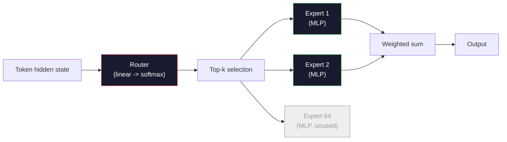

# Modelos abiertos: Accesos a la arquitectura

> Construiste un GPT-2 pequeño desde cero en la Lección 04. Los modelos de fronteras abiertas en 2026 son la misma familia con cinco o seis cambios concretos. RMSNorm en lugar de LayerNorm. SwiGLU en lugar de GELU. RoPE en lugar de posiciones aprendidas. GQA o MLA en lugar de MHA completo. Una mezcla de expertos a escala. Las matemáticas que ya sabes cubren el 95% de ellos. Esta lección lee Llama 3, DeepSeek-V3, Mixtral, Qwen y Gemma lado a lado y nombra la línea exacta donde cada arquitectura diverge.

**Type:** Learn
**Languages:** Python (stdlib)
**Prerequisites:** Phase 10, Lessons 04, 05, 12 (Pre-training, Scaling, Inference)
**Time:** ~45 minutes

## Objetivos de aprendizaje

- Lea la configuración.json de Llama 3, Mistral, Mixtral, Gemma 2, Qwen 2.5, y DeepSeek-V3 y explique cada campo
- Nombre el cambio arquitectónico específico que cada modelo hizo en comparación con GPT-2 Small y justifica desde los primeros principios
- Conto de parámetros de cálculo, tamaño de caché KV y memoria de activación para cualquier modelo abierto desde su configuración sola
- Elija el modelo abierto adecuado para un objetivo de implementación dado las restricciones de latencia, memoria y capacidad

## El problema

En la Lección 04 escribiste 350 líneas de numpy y tenías un modelo en forma de GPT-2. El informe técnico de Llama 3 405B tiene 200 páginas. Tu instinto es que estas son bestias diferentes. No lo son. Las 200 páginas describen el mismo objeto con cinco o seis modificaciones bien motivadas, más mil detalles de implementación sobre la escala. El esqueleto -- incrustación, bloques transformadores, atención, MLP, norma, cabeza -- no ha cambiado.

Esta lección es diferente. Para cada familia de modelos abiertos principales, enumeramos exactamente lo que cambió de GPT-2, por qué, y cuánto costó. Cuando hayas terminado puedes leer una nueva tarjeta de modelo y mentalmente traducirlo de nuevo a la línea de base de GPT-2.

La recompensa práctica es que cuando Meta lance Llama 5 o DeepSeek lanza V4, no necesitará un nuevo modelo mental. Verá la configuración, verá cuáles de los botones conocidos se movieron y sabrá cuáles son las implicaciones en el río abajo. Las arquitecturas 2026 son una caja de herramientas finita. Cada nuevo modelo elige un subconjunto diferente.

## El concepto

### El núcleo invariable

Todos los modelos abiertos autoregresivos comparten:

- Matriz de incorporación de tokens (vocab_size x hidden_dim).
- Una pila de bloques de decodificación N: norma, autoatención, residual, norma, MLP, residual.
- Norma final y cabeza lineal proyectada a vocab_size (a menudo gravada con embebidos).
- Máscara causal, la siguiente pérdida de entropía cruzada.

Esa es la forma, el resto son botones.

### Los seis nudos que realmente se mueven

En cada modelo abierto fronterizo 2024-2026, las mismas seis opciones de diseño se recogen una y otra vez:

1. **Normalization.**LayerNorm -> RMSNorm.
2. **Positional encoding.**Aprendió absoluto -> RoPE (más variantes: YaRN, NTK).
3. **Activation.**GELU -> SwiGLU (o GeGLU).
4. **Attention head sharing.**MHA -> GQA -> MQA -> MLA.
5. **Dense vs sparse MLP.**Densa -> Mezcla de expertos.
6. **Pre-norm placement.**La pre-norma se queda, la post-norma se ha ido.

Todo lo demás (hora de aprendizaje, mezcla de datos, tamaño de lote, longitud de contexto) se encuentra en la configuración de la formación, no en la arquitectura.

### Nodo 1: RMSNorm

LayerNorm restará la media, dividida por std, escalas y cambios.

```
RMSNorm(x) = x / sqrt(mean(x^2) + eps) * gamma
```

Ninguna subtracción media. Ningún sesgo. Un matmul menos por token. Zhang y Sennrich (2019) argumentaron que coincide con LayerNorm en la traducción automática mientras es un 10% más rápido.

Costo: nada. Beneficio: pequeña ganancia de rendimiento, código más simple.

### Nudo 2: RoPE

Las incorporaciones de posición aprendidas fueron una tabla de búsqueda de 1024 ranuras en GPT-2. El contexto 1025 está fuera del final de la tabla.

Embarcación de posición rotativa (RoPE, Su et al. 2021) inyecta posición girando cada vector Q y K en pares antes del producto de punto de atención. El ángulo de rotación es una función determinista de posición, por lo que no hay nada aprendido y nada de lo que quedarse sin. Con trucos de escala (interpolación consciente de NTK, YaRN), un modelo entrenado en contexto de 8k puede extenderse a 128k a la inferencia con una pérdida modesta de precisión.

```
q_rotated = rotate(q, angle(pos))
k_rotated = rotate(k, angle(pos))
score = q_rotated . k_rotated
```

Cada Llama, Mistral, Qwen, DeepSeek y Gemma utiliza RoPE. Gemma 2 utiliza un híbrido (RoPE en la mayoría de las capas, atención local de ventana corredera en otras).

### Noto 3: SwiGLU

La MLP de GPT-2 es `x -> gelu(xW1 + b1) -> (...)W2 + b2`. SwiGLU (Shazeer 2020) sustituye la activación por un producto cerrado:

```
SwiGLU(x) = (xW1) * sigmoid(xW1) * xV
```

Dos proyecciones en paralelo en lugar de una, cerradas por la activación Swish. Empiricamente más fuerte en la perplejidad por parámetro. Llama 2 lo adoptó, todos lo siguieron. El tamaño oculto del MLP se establece generalmente para que el número total de parámetros coincida con el MLP denso original: si se utilizó GPT-2 `ff_dim = 4 * hidden`, SwiGLU utiliza `ff_dim = (2/3) * 4 * hidden = 8/3 * hidden`¿ Qué ?

### Nudo 4: Cuidado compartido

Se utilizó el GPT-2 **Multi-Head Attention (MHA)**Cada cabeza tiene su propia proyección Q, K, V.

**Multi-Query Attention (MQA, Shazeer 2019)**El modelo de K-head tiene un K y un V en todas las cabezas. Cortar el cache de KV por num_heads, que es una reducción de 12 a 32 veces en un modelo típico.

**Grouped-Query Attention (GQA, Ainslie et al. 2023)**es el punto medio: los grupos G de cabezas Q comparten una K y una V. Llama 3 8B utiliza GQA con 32 cabezas Q y 8 cabezas KV (G=8), por lo que la caché KV se reduce 4x frente a la MHA completa.

**Multi-Head Latent Attention (MLA, DeepSeek 2024)**El sistema de búsqueda de datos de base de datos de base de datos de base de datos de base de datos de base de datos de base de datos de base de datos de base de datos de base de datos de base de datos de base de datos de base de datos de base de datos de base de datos de base de datos de base de datos de base de datos de base de datos de base de datos de base de datos de base de datos de base de datos de base de datos de base de datos de base de datos de base de datos de base de datos de base de datos de base de datos de base de datos de base de datos de base de datos de base de datos de base de datos de base de datos de base de datos de base de datos de base de datos de base de datos de base de datos de datos de base de datos de base de datos de datos de base de datos de base de datos de datos de base de datos de datos de base de datos de datos de base de datos de base de datos de datos de base de datos de datos de base de datos de datos de base de datos de datos de base de datos de datos de datos de base de datos de datos de datos de base de datos de datos de datos de datos de base de datos de datos de datos de datos de datos de base de datos de datos de datos de datos de datos de base de datos de datos de datos de datos de datos de datos de datos de datos de base de datos de datos de datos de datos de datos de datos de datos de datos de datos de base de datos de datos de datos de datos de datos de datos de datos de datos de datos de datos de datos de datos de datos de datos de datos de datos de datos de datos de base de datos de datos de datos de datos de datos de datos de datos de datos de datos de datos de datos de datos de datos de datos de datos de datos de datos de datos de datos de datos de datos de datos de datos de datos de datos de datos de datos de datos de datos de datos de datos de datos de datos de datos de datos de datos de datos de datos de datos de datos de datos de datos de datos de datos de datos de datos de datos de datos de datos de datos de datos de datos de datos de datos de datos de datos de datos de datos de datos de datos de datos de datos de datos de datos de datos de datos de datos de datos de datos de datos de datos de datos de datos de datos de datos de datos

| Scheme | KV Heads | KV Cache | Accuracy |
|--------|----------|----------|----------|
| MHA    | num_heads | full | best |
| GQA    | num_groups (G < num_heads) | num_heads / G reduction | near-MHA |
| MQA    | 1 | num_heads reduction | small hit |
| MLA    | latent, per-head decompression | smaller than MQA | near-MHA |

Para cualquier modelo por encima de los parámetros ~13B, GQA o MLA es efectivamente obligatorio.

### Nudo 5: Mezcla de expertos

Un MLP denso activa todos sus parámetros para cada token. Un MLP de MoE tiene expertos K por bloque y un router que elige los expertos top-k por token (generalmente top-2).

```
router_logits = xW_r
indices, weights = top_k(router_logits, k=2)
output = sum_i weights[i] * expert[indices[i]](x)
```

El atractivo: puede tener 64 expertos de tamaño 7B cada uno (por lo que el número total de parámetros es enorme) mientras que sólo ejecuta 2 de ellos por token (por lo que el cálculo por token coincide con un modelo 7B denso). Mixtral 8x7B tiene parámetros totales de 47B pero activa sólo 13B por token. DeepSeek-V3 tiene parámetros totales de 671B pero activa solo 37B por token.



Pros: el mismo cálculo, más parámetros, mejor capacidad. Los inconvenientes: la memoria experta todavía tiene que vivir en algún lugar (así que el servicio necesita más VRAM que un equivalente denso), el balanceo de carga del router es difícil, y el ajuste fino del router durante la alineación es su propia área de investigación.

### Nudo 6: Pre-norma permanece

El transformador original aplicaba la norma de capa después de cada subcapas. Cada modelo abierto desde GPT-2 lo coloca *antes* de cada subcapas.

### Diferencias modelo por modelo

Aquí está la mesa que hace todo este concreto.

| Model | Year | Total Params | Active Params | Norm | Activation | Position | Attention | MoE | Context |
|-------|------|-------------|---------------|------|-----------|----------|-----------|-----|---------|
| GPT-2 Small | 2019 | 124M | 124M | LayerNorm | GELU | Learned | MHA (12 heads) | no | 1k |
| Llama 3 8B | 2024 | 8B | 8B | RMSNorm | SwiGLU | RoPE | GQA (32/8) | no | 128k |
| Llama 3 70B | 2024 | 70B | 70B | RMSNorm | SwiGLU | RoPE | GQA (64/8) | no | 128k |
| Llama 3 405B | 2024 | 405B | 405B | RMSNorm | SwiGLU | RoPE | GQA (128/16) | no | 128k |
| Mistral 7B | 2023 | 7.2B | 7.2B | RMSNorm | SwiGLU | RoPE | GQA | no | 32k |
| Mixtral 8x7B | 2023 | 47B | 13B | RMSNorm | SwiGLU | RoPE | GQA | yes (8 experts, top-2) | 32k |
| Gemma 2 9B | 2024 | 9B | 9B | RMSNorm (pre+post) | GeGLU | RoPE + sliding | GQA | no | 8k |
| Qwen 2.5 72B | 2024 | 72B | 72B | RMSNorm | SwiGLU | RoPE (YaRN) | GQA (64/8) | no | 128k |
| DeepSeek V2 236B | 2024 | 236B | 21B | RMSNorm | SwiGLU | RoPE | MLA | yes (160 experts, top-6) | 128k |
| DeepSeek V3 | 2024 | 671B | 37B | RMSNorm | SwiGLU | RoPE | MLA | yes (256 experts, top-8) | 128k |

Escanear las columnas. RMSNorm es universal. SwiGLU o su primo GeGLU es universal. RoPE es universal. GQA es universal por encima de 7B excepto cuando se sustituye por MLA. MoE es el diferenciador en el extremo superior.

### Leyendo una config.json

Configuración de Llama 3 8B:

```
{
  "hidden_size": 4096,
  "intermediate_size": 14336,
  "num_hidden_layers": 32,
  "num_attention_heads": 32,
  "num_key_value_heads": 8,
  "max_position_embeddings": 131072,
  "rope_theta": 500000.0,
  "rms_norm_eps": 1e-5,
  "vocab_size": 128256
}
```

Cada campo corresponde a algo que ya ha implementado.

- `hidden_size`: dimensiones de incorporación.
- `intermediate_size`: tamaño MLP oculto (3.5x oculto -- matemáticas SwiGLU).
- `num_hidden_layers`: profundidad de pila.
- `num_attention_heads`Las cabezas de Q.
- `num_key_value_heads`: cabezas de KV (GQA).
- `max_position_embeddings`El curso de formación se desarrolla en el contexto de la formación.
- `rope_theta`La meta la escala de 10k a 500k para la extrapolación de contexto largo.
- `rms_norm_eps`: estabilidad numérica.
- `vocab_size`: fichas.

Solo de estos se calculan los parámetros totales, KV caché y memoria de activación máximo.`code/main.py`para las fórmulas exactas.

### Presupuesto de memoria de activación

Las activaciones dominan la memoria de entrenamiento por encima de unos pocos miles de millones de parámetros.

```
activation_mem ~ batch_size * seq_len * hidden_size * num_layers * bytes_per_element
```

Para Llama 3 8B en el lote 1, seq 8192, BF16, 32 capas, ocultas 4096: aproximadamente 8 GB sólo para las activaciones con control, 40 GB sin. Es por eso que la atención flash y la atención ring importan - reescriben el cálculo de la atención para que las activaciones encajen.

### Presupuesto de KV Cache

Para inferir en el contexto máximo:

```
kv_cache = 2 * num_layers * num_kv_heads * head_dim * max_seq_len * bytes_per_element
```

Llama 3 8B en contexto 128k, BF16, cabeza_dim = oculta / num_heads = 128:
`2 * 32 * 8 * 128 * 131072 * 2 = 17.2 GB`por secuencia.

Los pesos de 8B son 16 GB en BF16. La caché KV para una sola secuencia de 128k es mayor que los pesos. Esta es la presión de memoria que impulsa la investigación de cuantización de la caché GQA, MLA y KV.

### Cuando cada modelo gana

- **Single 80GB GPU, no MoE**Llama 3 8B, Mistral 7B, Gemma 2 9B. Fácil de servir, herramientas amplias.
- **Single node (8x80GB), big capacity**Llama 3 70B, Qwen 2.5 72B. Capacidad de apertura densa más alta.
- **Biggest open capability, accept MoE complexity**: DeepSeek V3, Mixtral 8x22B. Mejor capacidad por FLOP activo.
- **Long-context needs**: Llama 3 (128k con escala RoPE), DeepSeek (avantage MLA).
- **Low-latency serving**: Gemma 2 9B (ventana deslizante corta el cálculo de contexto largo).

```figure
rmsnorm-vs-layernorm
```

## Construye el mismo

El código de la lección es una calculadora. Dado cualquier config.json, imprime el conteo de parámetros por componente, el caché KV en contexto máximo, la relación SwiGLU MLP y un breve veredicto sobre la arquitectura (denso / GQA / MLA / MoE).

```python
config = {
    "hidden_size": 4096, "intermediate_size": 14336,
    "num_hidden_layers": 32, "num_attention_heads": 32,
    "num_key_value_heads": 8, "vocab_size": 128256,
    "max_position_embeddings": 131072,
}
```

El script recorre el campo de arquitectura por campo, calcula los parámetros para la incorporación, la atención (con reducción de GQA), MLP (con expansión SwiGLU), las normas de capas y la cabeza. Luego calcula el caché KV en la longitud del contexto indicada y imprime un resumen.

¿ Qué ?`code/main.py`para la ejecución.

## Usalo

ejecuta la calculadora en las configuraciones de Llama 3 8B, Mistral 7B, Mixtral 8x7B y DeepSeek V3 agrupadas en el guión. Compara las averías de parámetros. Observe que los modelos de MoE tienen un recuento total de parámetros que empequeñece a los modelos densos pero un recuento de parámetros activos que a menudo es menor. Observe que la caché KV de DeepSeek V3 es menor que la de Llama 3 405B a pesar de tener más parámetros totales - es decir, MLA en acción.

Luego conecte una configuración para cualquier modelo que tenga localmente, lea el resumen y decida si se ajusta a su GPU.

## Envío

Esta lección produce`outputs/skill-open-model-picker.md`. Dado un objetivo de implementación (tipo de GPU, VRAM, longitud de contexto, presupuesto de latencia) y un perfil de tarea (chat, código, razonamiento, contexto largo), recomienda un modelo abierto, un esquema de cuantificación de la Lección 11 y una pila de inferencias de la Lección 12, con razonamiento explícito sobre los seis botones arquitectónicos.

## Los ejercicios

1. Lea la configuración Qwen 2.5 72B de HuggingFace. Calcule los parámetros totales desde cero. Compara con el valor reportado por HF e identifique de dónde proviene cualquier delta (arrondamiento de la cabeza, factor de distribución de KV, etc.).

2. DeepSeek V3 utiliza 256 expertos con roteamiento de 8 principales. Calcule la proporción de expertos activados a expertos totales y compare con los 2 principales de 8 de Mixtral 8x7B. ¿Qué implica el cambio de poco (25%) a más denso poco (3%) sobre la capacidad por FLOP?

3. Compute la caché KV para Llama 3 405B en contexto 128k en FP8 y BF16. en FP8 es la mitad del número BF16. ¿Cuántas secuencias paralelas puede servir en un solo nodo 8xH100 (80 GB cada = 640 GB total, menos memoria de peso)?

4. Gemma 2 alterna capas de atención completa y de atención de ventana deslizante. Escribe las matemáticas para el caché KV cuando la mitad de las capas usan una ventana deslizante de 4096 tokens en lugar de contexto completo. ¿Cuánto memoria ahorra eso en 8k contexto total?

5. Encuentra un modelo abierto de fronteras reciente que se lanzó después de que se escribiera esta lección. Identifique cuál de los seis botones eligió y si introdujo un séptimo botón. El plan de estudios se sentirá obsoleto en el momento en que una nueva arquitectura se lance - el objetivo es actualizar tu mesa sin reconstruir tu modelo mental.

## Términos clave

| Term | What people say | What it actually means |
|------|----------------|----------------------|
| RMSNorm | "LayerNorm without the mean" | Normalize by root mean square only, with a learned scale — cheaper and comparable to LayerNorm |
| RoPE | "Rotary positions" | Rotate each Q and K vector in 2D pairs by an angle that depends on position — extrapolates beyond training length with scaling tricks |
| SwiGLU | "The new MLP activation" | Gated linear unit with Swish: `(xW1) * sigmoid(xW1) * xV` — standard in every 2024+ open model |
| GQA | "Middle ground attention" | Grouped-Query Attention: G groups of Q heads share one K and one V head — shrinks KV cache without MQA's accuracy hit |
| MLA | "DeepSeek's attention" | Multi-Head Latent Attention: compress K/V into a shared low-rank latent, decompress per head — smallest KV cache for large models |
| MoE | "Sparse experts" | Mixture of Experts: N MLPs per block, router picks top-k per token — huge total params, small active params |
| Top-k routing | "Pick k experts per token" | The router computes a score per expert and activates the k highest — typical k is 2 (Mixtral) to 8 (DeepSeek) |
| YaRN | "Stretch RoPE" | Yet another RoPE extension — interpolates rotary angles to extend context from 8k to 128k+ at inference time |
| Sliding-window attention | "Don't attend to everything" | Each token attends only to the last W tokens — caps attention cost at O(W) per token, used in Gemma 2 and early Mistral |
| Active params | "What runs per token" | For MoE models, the parameter count that sees a forward pass per token (much smaller than total params) — governs per-token FLOPs |

## Leer más

- [Dubey et al., 2024 -- "The Llama 3 Herd of Models"](https://arxiv.org/abs/2407.21783)-- la referencia arquitectónica y de formación para la densa familia Llama 3
- [DeepSeek-AI, 2024 -- "DeepSeek-V3 Technical Report"](https://arxiv.org/abs/2412.19437)-- MLA más balance de carga sin pérdidas auxiliares más 671B MoE
- [Jiang et al., 2024 -- "Mixtral of Experts"](https://arxiv.org/abs/2401.04088)-- el modelo de papel abierto canónico de la MOE
- [Su et al., 2021 -- "RoFormer: Enhanced Transformer with Rotary Position Embedding"](https://arxiv.org/abs/2104.09864)-- el papel RoPE
- [Shazeer, 2020 -- "GLU Variants Improve Transformer"](https://arxiv.org/abs/2002.05202)- SwiGLU, GeGLU, y amigos
- [Ainslie et al., 2023 -- "GQA: Training Generalized Multi-Query Transformer Models"](https://arxiv.org/abs/2305.13245)-- el documento de la GQA
- [Gemma 2 Team, 2024 -- "Gemma 2: Improving Open Language Models at a Practical Size"](https://arxiv.org/abs/2408.00118)-- híbrido de atención completa+deslizante, pre+post-norma
- [Qwen Team, 2024 -- "Qwen 2.5 Technical Report"](https://arxiv.org/abs/2412.15115)-- Extensión del contexto de la RNY y recetas de formación en largo contexto
