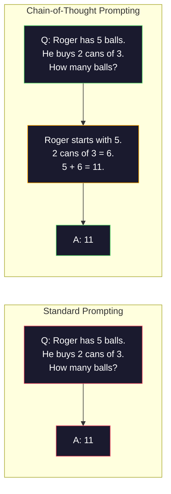
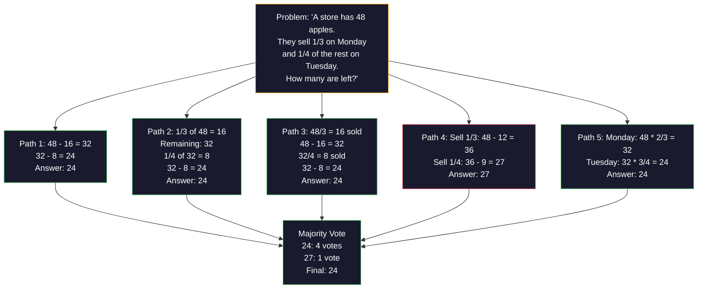
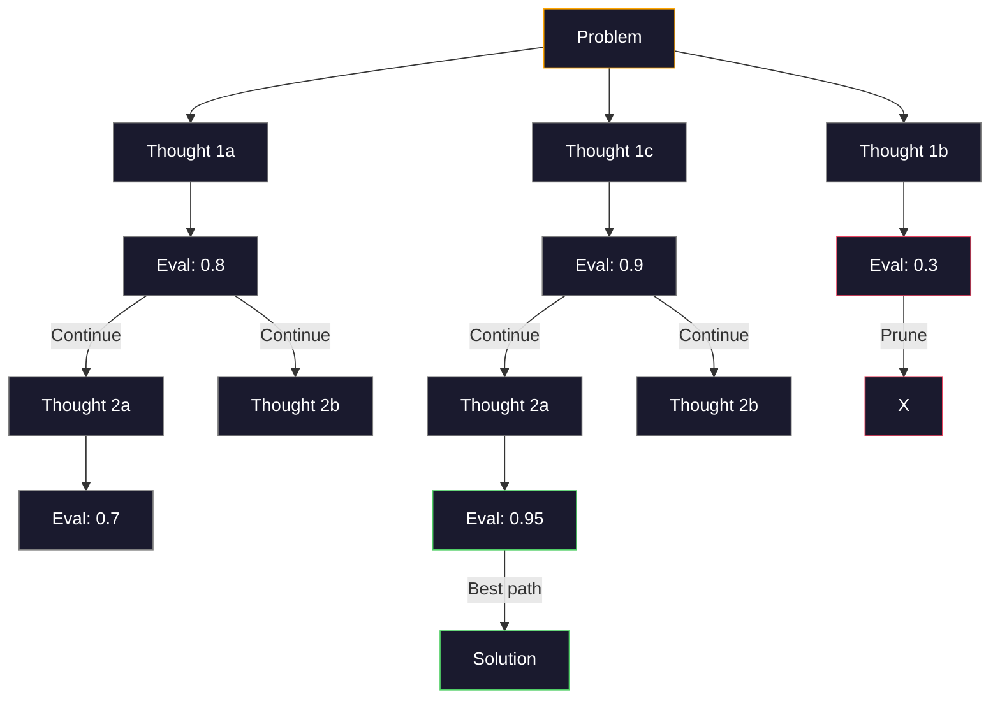

# Pocos disparos, cadena de pensamiento, árbol de pensamiento

> El decir a un modelo qué hacer es incitarlo. Mostrarle cómo pensar es ingeniería. La brecha entre el 78% y el 91% de precisión en el mismo modelo, la misma tarea, los mismos datos no es un mejor modelo. Es una mejor estrategia de razonamiento.

**Type:** Build
**Languages:** Python
**Prerequisites:** Lesson 11.01 (Prompt Engineering)
**Time:** ~45 minutes

## Objetivos de aprendizaje

- Implemente la solicitud de pocas tomas seleccionando y formateando demostraciones de ejemplos que maximizan la precisión de la tarea
- Aplicar el razonamiento de cadena de pensamiento (CoT) para mejorar la precisión en problemas de múltiples pasos como problemas de palabras matemáticas
- Construye un plan de pensamiento que explore múltiples caminos de razonamiento y seleccione el mejor
- Medir la mejora de precisión de la comparación entre cero disparos y pocos disparos y CoT en un punto de referencia estándar

## El problema

Si usted crea una aplicación de matemáticas. Su mensaje dice: "Soluciona este problema de palabra". GPT-5 tiene la razón en el 94% del tiempo en GSM8K, el estándar de referencia de matemáticas de la escuela primaria. Usted piensa que ya alcanzó su punto máximo.

Añadir cinco palabras -- "Pensemos paso a paso" -- y la precisión salta al 91%. Añadir algunos ejemplos de trabajo y llega al 95%. El mismo modelo. La misma temperatura. El mismo costo de API. La única diferencia es que le dio el papel de raspado al modelo.

Esto no es un hack. Es como funciona el razonamiento. Los humanos no resuelven problemas de múltiples pasos en un solo salto mental. Ni los transformadores. Cuando obligas a un modelo a generar tokens intermedios, esos tokens se convierten en parte del contexto del siguiente token. Cada paso de razonamiento alimenta al siguiente. El modelo calcula literalmente su camino a la respuesta.

Pero "pensar paso a paso" es el principio, no el final. ¿Qué pasa si tomas una muestra de cinco caminos de razonamiento y tomas un voto mayoritario? ¿Qué pasa si dejas que el modelo explore un árbol de posibilidades, evalúe y poda ramas? ¿Qué pasa si mezclas el razonamiento con el uso de herramientas?

## El concepto

### Cero-Shot vs Pocos-Shot: Cuando los ejemplos superan las instrucciones

La llamada de tiro cero le da al modelo una tarea y nada más.

Wei et al. (2022) midieron esto en 8 puntos de referencia. Para tareas simples como la clasificación de sentimiento, las tiradas cero y las tiradas pocas se realizan dentro del 2% de las demás. Para tareas complejas como la aritmética de múltiples pasos y el razonamiento simbólico, las tiradas pocas mejoraron la precisión en un 10-25%.

La intuición: los ejemplos son instrucciones comprimidas. En lugar de describir el formato de salida, lo muestras. En lugar de explicar el proceso de razonamiento, lo demuestras. El modelo de patrón coincide con los ejemplos de manera más confiable que interpreta instrucciones abstractas.


**When few-shot wins:**tareas sensibles al formato, clasificación, extracción estructurada, jerga específica de dominio, cualquier tarea en la que el modelo deba coincidir con un patrón específico.

**When zero-shot wins:**Las preguntas simples y factuales, tareas creativas donde los ejemplos limitan la creatividad, tareas donde encontrar buenos ejemplos es más difícil que escribir buenas instrucciones.

### Selección de ejemplos: Batidas aleatorias similares

No todos los ejemplos son iguales. Elegir ejemplos similares a la entrada objetivo supera la selección aleatoria en 5-15% en las tareas de clasificación (Liu et al., 2022).

1. **Semantic similarity**: escoger ejemplos más cercanos a la entrada en el espacio de incorporación
2. **Label diversity**: cubre todas las categorías de salida en sus ejemplos
3. **Difficulty matching**: coincide con el nivel de complejidad del problema objetivo

La cantidad óptima de ejemplos para la mayoría de las tareas es de 3-5. Bajo 3, el modelo no tiene suficiente señal para extraer el patrón.

### Cadena de pensamiento: dar modelos

La idea de la "cadena de pensamiento" (CoT) fue introducida por Wei et al. (2022) en Google Brain. La idea es simple: en lugar de pedirle al modelo la respuesta, pídale que muestre sus pasos de razonamiento primero.



Cada token generado por un transformador se convierte en contexto para el siguiente token. sin CoT, el modelo debe comprimir todo el razonamiento en el estado oculto de un solo paso hacia adelante.

**GSM8K benchmarks (grade-school math, 8.5K problems):**

| Model | Zero-Shot | Zero-Shot CoT | Few-Shot CoT |
|-------|-----------|---------------|--------------|
| GPT-4o | 78% | 91% | 95% |
| GPT-5 | 94% | 97% | 98% |
| o4-mini (reasoning) | 97% | — | — |
| Claude Opus 4.7 | 93% | 97% | 98% |
| Gemini 3 Pro | 92% | 96% | 98% |
| Llama 4 70B | 80% | 89% | 94% |
| DeepSeek-V3.1 | 89% | 94% | 96% |

**Note on reasoning models.**Los modelos como la serie o de OpenAI (o3, o4-mini) y DeepSeek-R1 ejecutan una cadena de pensamiento internamente antes de emitir su respuesta.

Dos sabores de CoT:

**Zero-shot CoT**Kojima et al. (2022) mostró que esta sola oración mejora la precisión en las tareas de aritmética, sentido común y razonamiento simbólico.

**Few-shot CoT**Es más eficaz que la CoT de tiro cero porque el modelo ve el formato exacto de razonamiento que usted espera.

**When CoT hurts**En el caso de las tareas de alto rendimiento y de baja complejidad, se considera un gasto perdido.

### Autoconsistencia: Muchos ejemplos, vota una vez

Wang et al. (2023) introdujo la autoconsistencia. La idea: un solo camino de CoT puede contener errores de razonamiento. Pero si muestra N caminos de razonamiento independientes (utilizando temperatura > 0) y toma el voto mayoritario en la respuesta final, los errores se anulan.



La autoconsistencia mejoró la precisión de GSM8K del 56,5% (Cot único) al 74,4% con N=40 en los experimentos originales PaLM 540B. En el caso de GPT-5, la mejora es pequeña (97% a 98%) porque la precisión de base ya está saturada. La técnica brilla más en modelos con una precisión de 60-85% de base de CoT -- el punto ideal donde los errores de un solo camino son frecuentes pero no sistemáticos. Para los modelos de razonamiento (series o, R1) la autoconsistencia se subsume por el muestreo interno incorporado.

El tradeoff: N muestras significa Nx el costo de API y la latencia. En la práctica, N=5 capta la mayor parte de los beneficios. N=3 es el mínimo para un voto significativo. N > 10 tiene rendimientos decrecientes para la mayoría de las tareas.

### Árbol de pensamiento: exploración de ramas

Yao et al. (2023) introdujo el Árbol de Pensamiento (ToT). Cuando el CoT sigue un camino de razonamiento lineal, el ToT explora múltiples ramas y evalúa las que son más prometedoras antes de continuar.



El TOT tiene tres componentes:

1. **Thought generation**: producen múltiples candidatos pasos siguientes
2. **State evaluation**: calificar a cada candidato (puede utilizar el propio LLM como evaluador)
3. **Search algorithm**: BFS o DFS a través del árbol, poda ramas de puntaje bajo

En el juego de 24 tareas (combinar 4 números usando la aritmética para hacer 24), GPT-4 con la solicitud estándar resuelve el 7,3% de los problemas. con CoT, el 4,0% (CoT realmente duele aquí porque el espacio de búsqueda es amplio). con ToT, el 74%.

Cada nodo del árbol requiere una llamada de LLM. Un árbol con factor 3 de ramificación y profundidad 3 requiere hasta 39 llamadas de LLM. Utilice sólo para problemas donde el espacio de búsqueda es grande pero evaluable: planificación, resolución de rompecabezas, resolución creativa de problemas con restricciones.

### Reacción: Pensamiento + acción

Yao et al. (2022) combinó rastros de razonamiento con acciones. El modelo alterna entre el pensamiento (generar razonamiento) y la acción (llamando herramientas, búsqueda, computación).

```mermaid
graph LR
    Q["Question:\nWhat is the\npopulation of the\ncountry where\nthe Eiffel Tower\nis located?"]
    T1["Thought: I need to\nfind which country\nhas the Eiffel Tower"]
    A1["Action: search\n'Eiffel Tower location'"]
    O1["Observation:\nParis, France"]
    T2["Thought: Now I need\nFrance's population"]
    A2["Action: search\n'France population 2024'"]
    O2["Observation:\n68.4 million"]
    T3["Thought: I have\nthe answer"]
    F["Answer:\n68.4 million"]

    Q --> T1 --> A1 --> O1 --> T2 --> A2 --> O2 --> T3 --> F

    style Q fill:#1a1a2e,stroke:#ffa500,color:#fff
    style T1 fill:#1a1a2e,stroke:#51cf66,color:#fff
    style A1 fill:#1a1a2e,stroke:#e94560,color:#fff
    style O1 fill:#1a1a2e,stroke:#808080,color:#fff
    style T2 fill:#1a1a2e,stroke:#51cf66,color:#fff
    style A2 fill:#1a1a2e,stroke:#e94560,color:#fff
    style O2 fill:#1a1a2e,stroke:#808080,color:#fff
    style T3 fill:#1a1a2e,stroke:#51cf66,color:#fff
    style F fill:#1a1a2e,stroke:#51cf66,color:#fff
```



ReAct supera a la CoT pura en tareas de conocimiento intenso porque puede fundamentar su razonamiento en datos reales. En HotpotQA (respuesta a preguntas de múltiples pasos), ReAct con GPT-4 logra un empate exacto del 35,1% frente al 29,4% para la CoT sola. El poder real es que los errores de razonamiento se corregen mediante observaciones - el modelo puede actualizar su plan a mediados de ejecución.

ReAct es la base de los agentes de IA modernos. Cada marco de agentes (LangChain, CrewAI, AutoGen) implementa alguna variante del bucle de Pensamiento-Acción-Observación.

### Prompting estructurado: etiquetas XML, delimitadores, encabezados

A medida que las instrucciones se complejan, la estructura evita que el modelo confunde las secciones.

**XML tags**(Funciona mejor con Claude, sólido en todas partes):
```
<context>
You are reviewing a pull request.
The codebase uses TypeScript and React.
</context>

<task>
Review the following diff for bugs, security issues, and style violations.
</task>

<diff>
{diff_content}
</diff>

<output_format>
List each issue with: file, line, severity (critical/warning/info), description.
</output_format>
```

**Markdown headers**(universal):
```
## Role
Senior security engineer at a fintech company.

## Task
Analyze this API endpoint for vulnerabilities.

## Input
{api_code}

## Rules
- Focus on OWASP Top 10
- Rate each finding: critical, high, medium, low
- Include remediation steps
```

**Delimiters**(minimal pero eficaz):
```
---INPUT---
{user_text}
---END INPUT---

---INSTRUCTIONS---
Summarize the above in 3 bullet points.
---END INSTRUCTIONS---
```

### Enlace rápido: descomposición secuencial

Algunas tareas son demasiado complejas para un solo pedido. La cadena de pedido las divide en pasos, donde la salida de un pedido se convierte en la entrada del siguiente.


La cadena de la velocidad de la señal de un solo momento por tres razones:

1. **Each step is simpler**: el modelo maneja una tarea enfocada en lugar de hacer malabares con todo
2. **Intermediate outputs are inspectable**: puede validar y corregir entre pasos
3. **Different steps can use different models**: utilizar un modelo barato para extraer, un caro para razonar

### Comparación de rendimiento

| Technique | Best For | GSM8K Accuracy (GPT-5) | API Calls | Token Overhead | Complexity |
|-----------|----------|------------------------|-----------|----------------|------------|
| Zero-Shot | Simple tasks | 94% | 1 | None | Trivial |
| Few-Shot | Format matching | 96% | 1 | 200-500 tokens | Low |
| Zero-Shot CoT | Quick reasoning boost | 97% | 1 | 50-200 tokens | Trivial |
| Few-Shot CoT | Maximum single-call accuracy | 98% | 1 | 300-600 tokens | Low |
| Self-Consistency (N=5) | High-stakes reasoning | 98.5% | 5 | 5x token cost | Medium |
| Reasoning model (o4-mini) | Drop-in CoT replacement | 97% | 1 | hidden (2-10x internal) | Trivial |
| Tree-of-Thought | Search/planning problems | N/A (74% on Game of 24) | 10-40+ | 10-40x token cost | High |
| ReAct | Knowledge-grounded reasoning | N/A (35.1% on HotpotQA) | 3-10+ | Variable | High |
| Prompt Chaining | Complex multi-step tasks | 96% (pipeline) | 2-5 | 2-5x token cost | Medium |

La técnica correcta depende de tres factores: el requisito de precisión, el presupuesto de latencia y la tolerancia al costo.

```figure
few-shot-curve
```

## Construye el mismo

Construiremos un solucionador de problemas matemáticos que combina la pregunta de pocos disparos, el razonamiento de cadena de pensamiento y la votación de autoconsistencia en una sola línea de tubería. Luego añadiremos el árbol de pensamiento para problemas difíciles.

La aplicación completa se realiza en `code/advanced_prompting.py`Aquí están los componentes clave.

### Paso 1: Ejemplo de la tienda de pocos disparos

El primer componente gestiona ejemplos de pocos disparos y selecciona los más relevantes para un problema determinado.

```python
GSM8K_EXAMPLES = [
    {
        "question": "Janet's ducks lay 16 eggs per day. She eats three for breakfast every morning and bakes muffins for her friends every day with four. She sells every egg at the farmers' market for $2. How much does she make every day at the farmers' market?",
        "reasoning": "Janet's ducks lay 16 eggs per day. She eats 3 and bakes 4, using 3 + 4 = 7 eggs. So she has 16 - 7 = 9 eggs left. She sells each for $2, so she makes 9 * 2 = $18 per day.",
        "answer": "18"
    },
    ...
]
```

Cada ejemplo tiene tres partes: la pregunta, la cadena de razonamiento y la respuesta final. La cadena de razonamiento es lo que transforma un ejemplo regular de pocos disparos en un ejemplo de pocos disparos de CoT.

### Paso 2: Construir una cadena de pensamiento

El constructor de preguntas conjunta un mensaje del sistema, ejemplos de pocos disparos con cadenas de razonamiento y la pregunta objetivo en una sola pregunta.

```python
def build_cot_prompt(question, examples, num_examples=3):
    system = (
        "You are a math problem solver. "
        "For each problem, show your step-by-step reasoning, "
        "then give the final numerical answer on the last line "
        "in the format: 'The answer is [number]'."
    )

    example_text = ""
    for ex in examples[:num_examples]:
        example_text += f"Q: {ex['question']}\n"
        example_text += f"A: {ex['reasoning']} The answer is {ex['answer']}.\n\n"

    user = f"{example_text}Q: {question}\nA:"
    return system, user
```

La restricción de formato ("La respuesta es [número]") es crítica.

### Paso 3: Votación de autoconsistencia

Muestre N caminos de razonamiento y tomar la respuesta mayoritaria.

```python
def self_consistency_solve(question, examples, client, model, n_samples=5):
    system, user = build_cot_prompt(question, examples)

    answers = []
    reasonings = []
    for _ in range(n_samples):
        response = client.chat.completions.create(
            model=model,
            messages=[
                {"role": "system", "content": system},
                {"role": "user", "content": user}
            ],
            temperature=0.7
        )
        text = response.choices[0].message.content
        reasonings.append(text)
        answer = extract_answer(text)
        if answer is not None:
            answers.append(answer)

    vote_counts = Counter(answers)
    best_answer = vote_counts.most_common(1)[0][0] if vote_counts else None
    confidence = vote_counts[best_answer] / len(answers) if best_answer else 0

    return best_answer, confidence, reasonings, vote_counts
```

La temperatura 0,7 es importante. A temperatura 0,0, todas las muestras de N serían idénticas, derrotando el propósito. Necesitas suficiente aleatoriedad para diversas vías de razonamiento pero no tanto que el modelo produzca gibberish.

### Paso 4: Resolver el árbol de pensamiento

Para los problemas en los que el razonamiento lineal falla, ToT explora múltiples enfoques y evalúa qué dirección es más prometedora.

```python
def tree_of_thought_solve(question, client, model, breadth=3, depth=3):
    thoughts = generate_initial_thoughts(question, client, model, breadth)
    scored = [(t, evaluate_thought(t, question, client, model)) for t in thoughts]
    scored.sort(key=lambda x: x[1], reverse=True)

    for current_depth in range(1, depth):
        next_thoughts = []
        for thought, score in scored[:2]:
            extensions = extend_thought(thought, question, client, model, breadth)
            for ext in extensions:
                ext_score = evaluate_thought(ext, question, client, model)
                next_thoughts.append((ext, ext_score))
        scored = sorted(next_thoughts, key=lambda x: x[1], reverse=True)

    best_thought = scored[0][0] if scored else ""
    return extract_answer(best_thought), best_thought
```

El evaluador es en sí mismo una convocatoria de LLM. Preguntas al modelo: "En una escala de 0.0 a 1.0, ¿qué tan prometedora es esta ruta de razonamiento para resolver el problema?" Esta es la idea clave de ToT - el modelo evalúa sus propias soluciones parciales.

### Paso 5: Línea completa

El oleoducto combina todas las técnicas con una estrategia de escalada.

```python
def solve_with_escalation(question, examples, client, model):
    system, user = build_cot_prompt(question, examples)
    single_response = call_llm(client, model, system, user, temperature=0.0)
    single_answer = extract_answer(single_response)

    sc_answer, confidence, _, _ = self_consistency_solve(
        question, examples, client, model, n_samples=5
    )

    if confidence >= 0.8:
        return sc_answer, "self_consistency", confidence

    tot_answer, _ = tree_of_thought_solve(question, client, model)
    return tot_answer, "tree_of_thought", None
```

La lógica de escalada: primero prueba barato (Cot único). Si la confianza en la autoconsistencia es inferior a 0.8 (menos de 4 de 5 muestras coinciden), escala a ToT. Esto equilibra el costo y la precisión - la mayoría de los problemas se resuelven a bajo costo, los problemas difíciles obtienen más computación.

## Usalo

### Las instrucciones de pocos disparos basadas en plantillas

LangChain proporciona soporte incorporado para plantillas rápidas y análisis de salida que simplifican los patrones de pocos disparos y CoT:

```python
from langchain_core.prompts import FewShotPromptTemplate, PromptTemplate
from langchain_openai import ChatOpenAI

example_prompt = PromptTemplate(
    input_variables=["question", "reasoning", "answer"],
    template="Q: {question}\nA: {reasoning} The answer is {answer}."
)

few_shot_prompt = FewShotPromptTemplate(
    examples=examples,
    example_prompt=example_prompt,
    suffix="Q: {input}\nA: Let's think step by step.",
    input_variables=["input"]
)

llm = ChatOpenAI(model="gpt-4o", temperature=0.7)
chain = few_shot_prompt | llm
result = chain.invoke({"input": "If a train travels 120 km in 2 hours..."})
```

LangChain también ha `ExampleSelector`clases para la selección de similitud semántica:

```python
from langchain_core.example_selectors import SemanticSimilarityExampleSelector
from langchain_openai import OpenAIEmbeddings

selector = SemanticSimilarityExampleSelector.from_examples(
    examples,
    OpenAIEmbeddings(),
    k=3
)
```

### Compilación de las instrucciones

DSPy trata las estrategias de solicitud como módulos optimizables. En lugar de elaborar instrucciones de CoT a mano, se define una firma y se permite a DSPy optimizar la solicitud:

```python
import dspy

dspy.configure(lm=dspy.LM("openai/gpt-4o", temperature=0.7))

class MathSolver(dspy.Module):
    def __init__(self):
        self.solve = dspy.ChainOfThought("question -> answer")

    def forward(self, question):
        return self.solve(question=question)

solver = MathSolver()
result = solver(question="Janet's ducks lay 16 eggs per day...")
```

Es un DSPy.`ChainOfThought`automáticamente añade rastros de razonamiento. `dspy.majority`Implementa la autoconsistencia:

```python
result = dspy.majority(
    [solver(question=q) for _ in range(5)],
    field="answer"
)
```

### Comparación: desde el rascón versus los marcos

| Feature | From-Scratch (this lesson) | LangChain | DSPy |
|---------|--------------------------|-----------|------|
| Control over prompt format | Full | Template-based | Automatic |
| Self-consistency | Manual voting | Manual | Built-in (`dspy.majority`) |
| Example selection | Custom logic | `ExampleSelector` | `dspy.BootstrapFewShot` |
| Tree-of-Thought | Custom tree search | Community chains | Not built-in |
| Prompt optimization | Manual iteration | Manual | Automatic compilation |
| Best for | Learning, custom pipelines | Standard workflows | Research, optimization |

## Envío

Esta lección produce dos artefactos.

**1. Reasoning Chain Prompt**(El artículo`outputs/prompt-reasoning-chain.md`): una plantilla de respuesta rápida para CoT de pocos disparos con autoconsistencia.

**2. CoT Pattern Selection Skill**(El artículo`outputs/skill-cot-patterns.md`): un marco de decisión para elegir la técnica de razonamiento adecuada en función del tipo de tarea, los requisitos de precisión y las limitaciones de costes.

## Los ejercicios

1. **Measure the gap**Tome 10 problemas GSM8K. resuelva cada uno con cero disparos, pocos disparos, cero disparos CoT, y pocos disparos CoT. Registra la precisión para cada uno. ¿Qué técnica da el mayor aumento en su modelo?

2. **Example selection experiment**Para los mismos 10 problemas, comparar la selección aleatoria de ejemplos con ejemplos similares seleccionados a mano.

3. **Self-consistency cost curve**Runs auto-consistencia con N=1, 3, 5, 7, 10 en 20 problemas GSM8K. Precisión de trama vs costo (tokens totales). ¿Dónde está la rodilla de la curva para su modelo?

4. **Build a ReAct loop**Cuando el modelo genera una expresión matemática, ejecuta con Python `eval()`Medir si el razonamiento basado en herramientas supera la TCC pura.

5. **ToT for creative tasks**: Adapta el solucionador de árbol de pensamiento para una tarea de escritura creativa: "Escribe una historia de 6 palabras que sea divertida y triste". Utilice el LLM como evaluador. ¿La exploración ramificada produce mejores resultados creativos que la generación de una sola vez?

## Términos clave

| Term | What people say | What it actually means |
|------|----------------|----------------------|
| Few-shot prompting | "Give it some examples" | Including input-output demonstrations in the prompt to anchor the model's output format and behavior |
| Chain-of-Thought | "Make it think step by step" | Eliciting intermediate reasoning tokens that extend the model's effective computation before producing a final answer |
| Self-Consistency | "Run it multiple times" | Sampling N diverse reasoning paths at temperature > 0 and selecting the most common final answer by majority vote |
| Tree-of-Thought | "Let it explore options" | Structured search over reasoning branches where each partial solution is evaluated and only promising paths are expanded |
| ReAct | "Thinking + tool use" | Interleaving reasoning traces with external actions (search, compute, API calls) in a Thought-Action-Observation loop |
| Prompt chaining | "Break it into steps" | Decomposing a complex task into sequential prompts where each output feeds the next input |
| Zero-shot CoT | "Just add 'think step by step'" | Appending a reasoning trigger phrase to a prompt without any examples, relying on the model's latent reasoning capability |

## Leer más

- [Chain-of-Thought Prompting Elicits Reasoning in Large Language Models](https://arxiv.org/abs/2201.11903)- Wei et al. 2022. El documento original de CoT de Google Brain. Lea las secciones 2-3 para los resultados principales.
- [Self-Consistency Improves Chain of Thought Reasoning in Language Models](https://arxiv.org/abs/2203.11171)- Wang et al. 2023. el documento de autoconsistencia. la tabla 1 tiene todos los números que necesita.
- [Tree of Thoughts: Deliberate Problem Solving with Large Language Models](https://arxiv.org/abs/2305.10601)El juego de 24 resultados en la sección 4 son el punto culminante.
- [ReAct: Synergizing Reasoning and Acting in Language Models](https://arxiv.org/abs/2210.03629)Yao et al. 2022. La base de los agentes de IA modernos. La sección 3 explica el ciclo de pensamiento-acción-observación.
- [Large Language Models are Zero-Shot Reasoners](https://arxiv.org/abs/2205.11916)-- Kojima et al. 2022. El documento "Pensemos paso a paso". Sorprendentemente eficaz por lo simple que es.
- [DSPy: Compiling Declarative Language Model Calls into Self-Improving Pipelines](https://arxiv.org/abs/2310.03714)-- Khattab et al. 2023. Trata de la solicitud como un problema de compilación. Lea si quiere ir más allá de la ingeniería manual de la solicitud.
- [OpenAI — Reasoning models guide](https://platform.openai.com/docs/guides/reasoning)-- guía del proveedor sobre cuándo la cadena de pensamiento se convierte en un modo interno de "razón" por token, en comparación con un truco de nivel inmediato.
- [Lightman et al., "Let's Verify Step by Step" (2023)](https://arxiv.org/abs/2305.20050)-- modelos de recompensas de proceso (PRM) que califican cada paso de una cadena; la señal de supervisión de razonamiento que logra recompensas solo por resultado.
- [Snell et al., "Scaling LLM Test-Time Compute Optimally" (2024)](https://arxiv.org/abs/2408.03314)-- estudio sistemático de longitud de CoT, muestreo de autoconsistencia y MCTS; donde "pensar paso a paso" se hace cuando la precisión importa más que la latencia.
