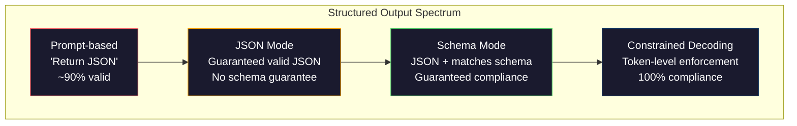
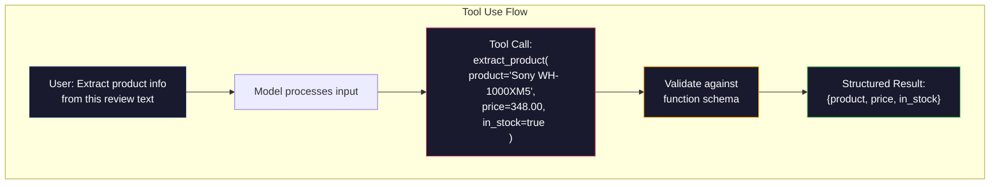

# Resultados estructurados: JSON, validación de esquema, decodificación restringida

> Su LLM devuelve una cadena. Su aplicación necesita JSON. Esa brecha ha estrellado más sistemas de producción que cualquier alucinación de modelo. La salida estructurada es el puente entre el lenguaje natural y los datos tipados. Haga lo correcto y su LLM se convierte en una API confiable. Haga lo incorrecto y está analizando el texto libre con regex a las 3 am.

**Type:** Build
**Languages:** Python
**Prerequisites:** Phase 10, Lessons 01-05 (LLMs from Scratch)
**Time:** ~90 minutes
**Related:**La fase 5 · 20 (Outputs estructurados y decodificación restringida) abarca la teoría de nivel de decodificador (procesadores de logit FSM/CFG, esquemas, XGrammar).`response_format`, uso de herramientas antropológicas, Instructor)  leer la Fase 5 · 20 primero si desea entender lo que está sucediendo debajo de la API.

## Objetivos de aprendizaje

- Implementar salidas con modo JSON y con restricciones de esquema utilizando los parámetros OpenAI y API Antropic
- Construir una capa de validación Pydantic que rechace las salidas de LLM malformadas y retempla con retroalimentación de errores
- Explicar cómo la decodificación limitada obliga a validar JSON a nivel de token sin procesamiento posterior
- Diseñar robustas instrucciones de extracción que conviertan de manera fiable el texto no estructurado en estructuras de datos tipografadas

## El problema

Le preguntas a un LLM: "Extrae el nombre del producto, el precio y la disponibilidad de este texto".

```
The product is the Sony WH-1000XM5 headphones, which cost $348.00 and are currently in stock.
```

Es una respuesta perfectamente correcta. También es completamente inútil para su aplicación.`{"product": "Sony WH-1000XM5", "price": 348.00, "in_stock": true}`Necesitas un objeto JSON con claves específicas, tipos específicos y restricciones de valor específicas. No necesitas una oración.

La solución ingenua: añadir "Responda en JSON" a su solicitud. Esto funciona el 90% del tiempo. El otro 10% del modelo envuelve el JSON en vallas de código de marca, o añade un preámbulo como "Aquí está el JSON:", o produce un JSON sintacticamente inválido porque cerró un bracket temprano. Su parser JSON se estrella. Su tubería se rompe. Añade el intento/excepto y un ciclo de retiro. El retraso a veces produce datos diferentes. Ahora tienes un problema de consistencia encima de un problema de análisis.

Este no es un problema de ingeniería inmediata. Es un problema de decodificación. El modelo genera tokens de izquierda a derecha. En cada posición, elige el siguiente token más probable de un vocabulario de 100K + opciones. La mayoría de esas opciones producirían JSON inválido en cualquier posición dada. Si el modelo acaba de emitir `{"price":`, el siguiente símbolo debe ser un dígito, una cita (para la cadena), `null`¿ Qué ?`true`¿ Qué ?`false`Sin restricciones, el modelo podría elegir una palabra en inglés perfectamente razonable que sea catastróficamente incorrecta sintácticamente.

## El concepto

### El espectro estructurado de producción

Hay cuatro niveles de control de salida estructurados, cada uno más fiable que el anterior.



**Prompt-based**("Responda en JSON válido"): no se ejecuta. El modelo generalmente cumple pero a veces no. Confiabilidad: ~90%. Modo de falla: vallas de marcado, texto de preámbulo, salida truncada, estructura incorrecta.

**JSON mode**La API garantiza que la salida es válida JSON.`response_format: { type: "json_object" }`La salida analizará sin errores. Pero puede que no coincida con el esquema esperado - claves adicionales, tipos equivocados, campos faltantes.

**Schema mode**En 2026 todos los principales proveedores soportan esto nativamente: OpenAI's `response_format: { type: "json_schema", json_schema: {...} }`(también como `tool_choice="required"`), el uso de herramientas de Anthropic con `input_schema`, y de los Géminis.`response_schema`¿ Qué es eso ?`response_mime_type: "application/json"`La salida tiene las claves, tipos y restricciones exactas que especificaste.

**Constrained decoding**En cada posición de token durante la generación, el decodificador enmascara todos los tokens que producirían una salida inválida. Si el esquema requiere un número y el modelo está a punto de emitir una letra, ese token se establece en probabilidad cero. El modelo solo puede producir tokens que conduzcan a una salida válida. Esto es lo que implementan el modo de salida estructurado de OpenAI y bibliotecas como Outlines y Guidance bajo el capó.

### Esquema JSON: el lenguaje del contrato

JSON Schema es la forma en que se le dice al modelo (o capa de validación) qué forma debe tener la salida.

```json
{
  "type": "object",
  "properties": {
    "product": { "type": "string" },
    "price": { "type": "number", "minimum": 0 },
    "in_stock": { "type": "boolean" },
    "categories": {
      "type": "array",
      "items": { "type": "string" }
    }
  },
  "required": ["product", "price", "in_stock"]
}
```

Este esquema dice: la salida debe ser un objeto con una cadena `product`, un número no negativo `price`, un booleano `in_stock`, y una matriz opcional de cuerdas `categories`Cualquier salida que no coincida se rechaza.

Los esquemas manejan los casos difíciles: objetos anidados, matrices con elementos tipados, enums (constrinir una cadena a valores específicos), coincidencia de patrones (regex en cadenas) y combinadores (oneOf, anyOf, allOf para salidas polimórficas).

### El patrón pidantico

En Python, no se escribe JSON Schema a mano. Se define un modelo Pydantic y se genera el esquema para usted.

```python
from pydantic import BaseModel

class Product(BaseModel):
    product: str
    price: float
    in_stock: bool
    categories: list[str] = []
```

Esto produce el mismo esquema JSON que anteriormente. La biblioteca Instructor (y el SDK de OpenAI) acepta los modelos Pydantic directamente: aprueba la clase de modelo, recupera una instancia validada. Si la salida del LLM no coincide, Instructor vuelve a intentar automáticamente.

### Llamadas de funciones / uso de herramientas

Una interfaz alternativa para el mismo problema. En lugar de pedir al modelo que produzca JSON directamente, se definen "herramientas" (funciones) con parámetros mecanografiados. El modelo emite una llamada de función con argumentos estructurados. OpenAI llama a esto "llamada de función".



El uso de herramientas es preferido cuando el modelo necesita elegir qué función llamar, no sólo rellenar parámetros. Si usted tiene 10 esquemas de extracción diferentes y el modelo debe elegir el correcto basado en la entrada, el uso de herramientas le da tanto la selección de esquema como la salida estructurada.

### Los modos comunes de fracaso

Incluso con la aplicación de esquemas, las salidas estructuradas pueden fallar de maneras sutiles.

**Hallucinated values**El modelo produce un modelo de datos de datos inventados.`{"price": 299.99}`Cuando el texto dice $348. la validación del esquema no puede captar esto -- el tipo es correcto, el valor es incorrecto.

**Enum confusion**: se limita un campo a `["in_stock", "out_of_stock", "preorder"]`. Las salidas del modelo `"available"`- semánticamente correcto, pero no en el conjunto permitido.

**Nested object depth**En el caso de los sistemas de anidación, el modelo puede perder la pista de su estructura en cada nivel.

**Array length**El modelo puede producir demasiados o muy pocos elementos en una matriz.`minItems`y `maxItems`pero no todos los proveedores los aplican a nivel de decodificación.

**Optional field omission**El modelo omite campos que son técnicamente opcionales pero semánticamente importantes para su caso de uso.`null`- Es decir, explícitamente.

```figure
mx-schema-funnel
```

## Construye el mismo

### Paso 1: Validador de esquema JSON

Construir un validador desde cero que compruebe si un objeto de Python coincide con un esquema JSON. Esto es lo que se ejecuta en el lado de salida para verificar el cumplimiento.

```python
import json

def validate_schema(data, schema):
    errors = []
    _validate(data, schema, "", errors)
    return errors

def _validate(data, schema, path, errors):
    schema_type = schema.get("type")

    if schema_type == "object":
        if not isinstance(data, dict):
            errors.append(f"{path}: expected object, got {type(data).__name__}")
            return
        for key in schema.get("required", []):
            if key not in data:
                errors.append(f"{path}.{key}: required field missing")
        properties = schema.get("properties", {})
        for key, value in data.items():
            if key in properties:
                _validate(value, properties[key], f"{path}.{key}", errors)

    elif schema_type == "array":
        if not isinstance(data, list):
            errors.append(f"{path}: expected array, got {type(data).__name__}")
            return
        min_items = schema.get("minItems", 0)
        max_items = schema.get("maxItems", float("inf"))
        if len(data) < min_items:
            errors.append(f"{path}: array has {len(data)} items, minimum is {min_items}")
        if len(data) > max_items:
            errors.append(f"{path}: array has {len(data)} items, maximum is {max_items}")
        items_schema = schema.get("items", {})
        for i, item in enumerate(data):
            _validate(item, items_schema, f"{path}[{i}]", errors)

    elif schema_type == "string":
        if not isinstance(data, str):
            errors.append(f"{path}: expected string, got {type(data).__name__}")
            return
        enum_values = schema.get("enum")
        if enum_values and data not in enum_values:
            errors.append(f"{path}: '{data}' not in allowed values {enum_values}")

    elif schema_type == "number":
        if not isinstance(data, (int, float)):
            errors.append(f"{path}: expected number, got {type(data).__name__}")
            return
        minimum = schema.get("minimum")
        maximum = schema.get("maximum")
        if minimum is not None and data < minimum:
            errors.append(f"{path}: {data} is less than minimum {minimum}")
        if maximum is not None and data > maximum:
            errors.append(f"{path}: {data} is greater than maximum {maximum}")

    elif schema_type == "boolean":
        if not isinstance(data, bool):
            errors.append(f"{path}: expected boolean, got {type(data).__name__}")

    elif schema_type == "integer":
        if not isinstance(data, int) or isinstance(data, bool):
            errors.append(f"{path}: expected integer, got {type(data).__name__}")
```

### Paso 2: Modelo de estilo pedántico a esquema

Construye un convertidor de clase a esquema mínimo. Define una clase Python y genere su esquema JSON automáticamente.

```python
class SchemaField:
    def __init__(self, field_type, required=True, default=None, enum=None, minimum=None, maximum=None):
        self.field_type = field_type
        self.required = required
        self.default = default
        self.enum = enum
        self.minimum = minimum
        self.maximum = maximum

def python_type_to_schema(field):
    type_map = {
        str: "string",
        int: "integer",
        float: "number",
        bool: "boolean",
    }

    schema = {}

    if field.field_type in type_map:
        schema["type"] = type_map[field.field_type]
    elif field.field_type == list:
        schema["type"] = "array"
        schema["items"] = {"type": "string"}
    elif isinstance(field.field_type, dict):
        schema = field.field_type

    if field.enum:
        schema["enum"] = field.enum
    if field.minimum is not None:
        schema["minimum"] = field.minimum
    if field.maximum is not None:
        schema["maximum"] = field.maximum

    return schema

def model_to_schema(name, fields):
    properties = {}
    required = []

    for field_name, field in fields.items():
        properties[field_name] = python_type_to_schema(field)
        if field.required:
            required.append(field_name)

    return {
        "type": "object",
        "properties": properties,
        "required": required,
    }
```

### Paso 3: Filtro de tokens restringido

Simula la decodificación restringida. Dado una cadena JSON parcial y un esquema, determine qué categorías de tokens son válidas en la posición actual.

```python
def next_valid_tokens(partial_json, schema):
    stripped = partial_json.strip()

    if not stripped:
        return ["{"]

    try:
        json.loads(stripped)
        return ["<EOS>"]
    except json.JSONDecodeError:
        pass

    last_char = stripped[-1] if stripped else ""

    if last_char == "{":
        return ['"', "}"]
    elif last_char == '"':
        if stripped.endswith('":'):
            return ['"', "0-9", "true", "false", "null", "[", "{"]
        return ["a-z", '"']
    elif last_char == ":":
        return [" ", '"', "0-9", "true", "false", "null", "[", "{"]
    elif last_char == ",":
        return [" ", '"', "{", "["]
    elif last_char in "0123456789":
        return ["0-9", ".", ",", "}", "]"]
    elif last_char == "}":
        return [",", "}", "]", "<EOS>"]
    elif last_char == "]":
        return [",", "}", "<EOS>"]
    elif last_char == "[":
        return ['"', "0-9", "true", "false", "null", "{", "[", "]"]
    else:
        return ["any"]

def demonstrate_constrained_decoding():
    partial_states = [
        '',
        '{',
        '{"product"',
        '{"product":',
        '{"product": "Sony"',
        '{"product": "Sony",',
        '{"product": "Sony", "price":',
        '{"product": "Sony", "price": 348',
        '{"product": "Sony", "price": 348}',
    ]

    print(f"{'Partial JSON':<45} {'Valid Next Tokens'}")
    print("-" * 80)
    for state in partial_states:
        valid = next_valid_tokens(state, {})
        display = state if state else "(empty)"
        print(f"{display:<45} {valid}")
```

### Paso 4: oleoducto de extracción

Combine todo en una línea de extracción: defina un esquema, simula un LLM produciendo una salida estructurada, valida la salida y maneja los retemplajes.

```python
def simulate_llm_extraction(text, schema, attempt=0):
    if "headphones" in text.lower() or "sony" in text.lower():
        if attempt == 0:
            return '{"product": "Sony WH-1000XM5", "price": 348.00, "in_stock": true, "categories": ["audio", "headphones"]}'
        return '{"product": "Sony WH-1000XM5", "price": 348.00, "in_stock": true}'

    if "laptop" in text.lower():
        return '{"product": "MacBook Pro 16", "price": 2499.00, "in_stock": false, "categories": ["computers"]}'

    return '{"product": "Unknown", "price": 0, "in_stock": false}'

def extract_with_retry(text, schema, max_retries=3):
    for attempt in range(max_retries):
        raw = simulate_llm_extraction(text, schema, attempt)

        try:
            data = json.loads(raw)
        except json.JSONDecodeError as e:
            print(f"  Attempt {attempt + 1}: JSON parse error -- {e}")
            continue

        errors = validate_schema(data, schema)
        if not errors:
            return data

        print(f"  Attempt {attempt + 1}: Schema validation errors -- {errors}")

    return None

product_schema = {
    "type": "object",
    "properties": {
        "product": {"type": "string"},
        "price": {"type": "number", "minimum": 0},
        "in_stock": {"type": "boolean"},
        "categories": {"type": "array", "items": {"type": "string"}},
    },
    "required": ["product", "price", "in_stock"],
}
```

### Paso 5: Cumple el oleoducto completo

```python
def run_demo():
    print("=" * 60)
    print("  Structured Output Pipeline Demo")
    print("=" * 60)

    print("\n--- Schema Definition ---")
    product_fields = {
        "product": SchemaField(str),
        "price": SchemaField(float, minimum=0),
        "in_stock": SchemaField(bool),
        "categories": SchemaField(list, required=False),
    }
    generated_schema = model_to_schema("Product", product_fields)
    print(json.dumps(generated_schema, indent=2))

    print("\n--- Schema Validation ---")
    test_cases = [
        ({"product": "Test", "price": 10.0, "in_stock": True}, "Valid object"),
        ({"product": "Test", "price": -5.0, "in_stock": True}, "Negative price"),
        ({"product": "Test", "in_stock": True}, "Missing price"),
        ({"product": "Test", "price": "ten", "in_stock": True}, "String as price"),
        ("not an object", "String instead of object"),
    ]

    for data, label in test_cases:
        errors = validate_schema(data, product_schema)
        status = "PASS" if not errors else f"FAIL: {errors}"
        print(f"  {label}: {status}")

    print("\n--- Constrained Decoding Simulation ---")
    demonstrate_constrained_decoding()

    print("\n--- Extraction Pipeline ---")
    texts = [
        "The Sony WH-1000XM5 headphones are priced at $348 and currently available.",
        "The new MacBook Pro 16-inch laptop costs $2499 but is sold out.",
        "This is a random sentence with no product info.",
    ]

    for text in texts:
        print(f"\n  Input: {text[:60]}...")
        result = extract_with_retry(text, product_schema)
        if result:
            print(f"  Output: {json.dumps(result)}")
        else:
            print(f"  Output: FAILED after retries")
```

## Usalo

### Resultados estructurados de OpenAI

```python
# from openai import OpenAI
# from pydantic import BaseModel
#
# client = OpenAI()
#
# class Product(BaseModel):
#     product: str
#     price: float
#     in_stock: bool
#
# response = client.beta.chat.completions.parse(
#     model="gpt-5-mini",
#     messages=[
#         {"role": "system", "content": "Extract product information."},
#         {"role": "user", "content": "Sony WH-1000XM5, $348, in stock"},
#     ],
#     response_format=Product,
# )
#
# product = response.choices[0].message.parsed
# print(product.product, product.price, product.in_stock)
```

El modo de salida estructurado de OpenAI utiliza decodificación limitada internamente. Cada token generado por el modelo está garantizado para producir una salida que coincida con el esquema Pydantic. No se necesitan retrasos. No se necesita validación. La restricción se introduce en el proceso de decodificación.

### El uso de herramientas antropológicas

```python
# import anthropic
#
# client = anthropic.Anthropic()
#
# response = client.messages.create(
#     model="claude-opus-4-7",
#     max_tokens=1024,
#     tools=[{
#         "name": "extract_product",
#         "description": "Extract product information from text",
#         "input_schema": {
#             "type": "object",
#             "properties": {
#                 "product": {"type": "string"},
#                 "price": {"type": "number"},
#                 "in_stock": {"type": "boolean"},
#             },
#             "required": ["product", "price", "in_stock"],
#         },
#     }],
#     messages=[{"role": "user", "content": "Extract: Sony WH-1000XM5, $348, in stock"}],
# )
```

Anthropic logra una salida estructurada a través del uso de herramientas. El modelo emite una llamada de herramienta con argumentos estructurados que coinciden con el input_schema.

### Biblioteca de instructores

```python
# pip install instructor
# import instructor
# from openai import OpenAI
# from pydantic import BaseModel
#
# client = instructor.from_openai(OpenAI())
#
# class Product(BaseModel):
#     product: str
#     price: float
#     in_stock: bool
#
# product = client.chat.completions.create(
#     model="gpt-5-mini",
#     response_model=Product,
#     messages=[{"role": "user", "content": "Sony WH-1000XM5, $348, in stock"}],
# )
```

El instructor envuelve cualquier cliente de LLM y agrega retries automáticas con validación. Si el primer intento falla en la validación, envía los errores de nuevo al modelo como contexto y le pide que arregle la salida. Esto funciona con cualquier proveedor, no solo OpenAI.

## Envío

Esta lección produce`outputs/prompt-structured-extractor.md`-- una plantilla de solicitud reutilizable que extrae datos estructurados de cualquier texto dado una definición de esquema.

También produce `outputs/skill-structured-outputs.md`-- un marco de decisión para elegir la estrategia de salida estructurada correcta basada en su proveedor, requisitos de fiabilidad y complejidad del esquema.

## Los ejercicios

1. Extensión del validador de esquema para soportar `oneOf`Esto maneja las salidas polimórficas, por ejemplo, un campo que puede ser o un`Product`o una `Service`objetos de diferentes formas.

2. Construir una herramienta de "discriminación de esquemas" que comparar dos esquemas e identifique los cambios de ruptura (retirados campos requeridos, tipos cambiados) frente a los cambios no de ruptura (campiones opcionales añadidos, restricciones relajadas).

3. Implemente un simulador de decodificación limitada más realista. Dado un esquema JSON y un vocabulario de 100 tokens (letras, dígitos, puntuación, palabras clave), pase por la generación paso a paso, enmascarando tokens inválidos en cada posición. Mide qué porcentaje del vocabulario es válido en cada paso.

4. Construye una suite de evaluaciones de extracción. Crea 50 descripciones de productos con salidas JSON etiquetadas a mano. ejecuta tu tubería de extracción en todas las 50 y mide la coincidencia exacta, la precisión a nivel de campo y el cumplimiento del tipo. Identifique qué campos son más difíciles de extraer correctamente.

5. Añadir "puntuaciones de confianza" a su pipeline de extracción. Para cada campo extraído, estimar cuán seguro es el modelo (basado en probabilidades de token, o ejecutando la extracción 3 veces y midiendo la consistencia).

## Términos clave

| Term | What people say | What it actually means |
|------|----------------|----------------------|
| JSON mode | "Returns JSON" | API flag that guarantees syntactically valid JSON output, but does not enforce any particular schema |
| Structured output | "Typed JSON" | Output that matches a specific JSON Schema with correct keys, types, and constraints |
| Constrained decoding | "Guided generation" | At each token position, mask out tokens that would produce invalid output -- guarantees 100% schema compliance |
| JSON Schema | "A JSON template" | A declarative language for describing the structure, types, and constraints of JSON data (used by OpenAPI, JSON Forms, etc.) |
| Pydantic | "Python dataclasses+" | Python library that defines data models with type validation, used by FastAPI and Instructor to generate JSON Schemas |
| Function calling | "Tool use" | LLM outputs a structured function invocation (name + typed arguments) instead of free text -- OpenAI and Anthropic both support this |
| Instructor | "Pydantic for LLMs" | Python library that wraps LLM clients to return validated Pydantic instances, with automatic retry on validation failure |
| Token masking | "Filtering the vocabulary" | Setting specific token probabilities to zero during generation so the model cannot produce them |
| Schema compliance | "Matches the shape" | The output has every required field, correct types, values within constraints, and no extra disallowed fields |
| Retry loop | "Try again until it works" | Send validation errors back to the model and ask it to fix the output -- Instructor does this automatically, up to a configurable max |

## Leer más

- [OpenAI Structured Outputs Guide](https://platform.openai.com/docs/guides/structured-outputs)-- documentación oficial para la decodificación limitada basada en esquema JSON en la API OpenAI
- [Willard & Louf, 2023 -- "Efficient Guided Generation for Large Language Models"](https://arxiv.org/abs/2307.09702)-- el documento Outlines, que describe cómo compilar esquemas JSON en máquinas de estado finito para restricciones a nivel de tokens
- [Instructor documentation](https://python.useinstructor.com/)-- la biblioteca estándar para obtener resultados estructurados de cualquier LLM con validación y retemplazos Pydantic
- [Anthropic Tool Use Guide](https://docs.anthropic.com/en/docs/tool-use)-- cómo Claude implementa la salida estructurada a través del uso de herramientas con JSON Schema input_schema
- [JSON Schema specification](https://json-schema.org/)-- la especificación completa para el lenguaje de esquema utilizado por cada sistema de salida estructurado principal
- [Outlines library](https://github.com/outlines-dev/outlines)-- generación limitada de código abierto utilizando regex y JSON Schema compilado a máquinas de estado finito
- [Dong et al., "XGrammar: Flexible and Efficient Structured Generation Engine for Large Language Models" (MLSys 2025)](https://arxiv.org/abs/2411.15100)-- el motor de gramática de última generación actual; compilación automática de empuje hacia abajo que enmascara los tokens a ~ 100 ns / token.
- [Beurer-Kellner et al., "Prompting Is Programming: A Query Language for Large Language Models" (LMQL)](https://arxiv.org/abs/2212.06094)-- el marco de papel LMQL decodificó restringido como un lenguaje de consulta con restricciones de tipo y valor.
- [Microsoft Guidance (framework docs)](https://github.com/guidance-ai/guidance)-- generación limitada basada en plantillas; complemento agnóstico del proveedor a Outlines y XGrammar.
