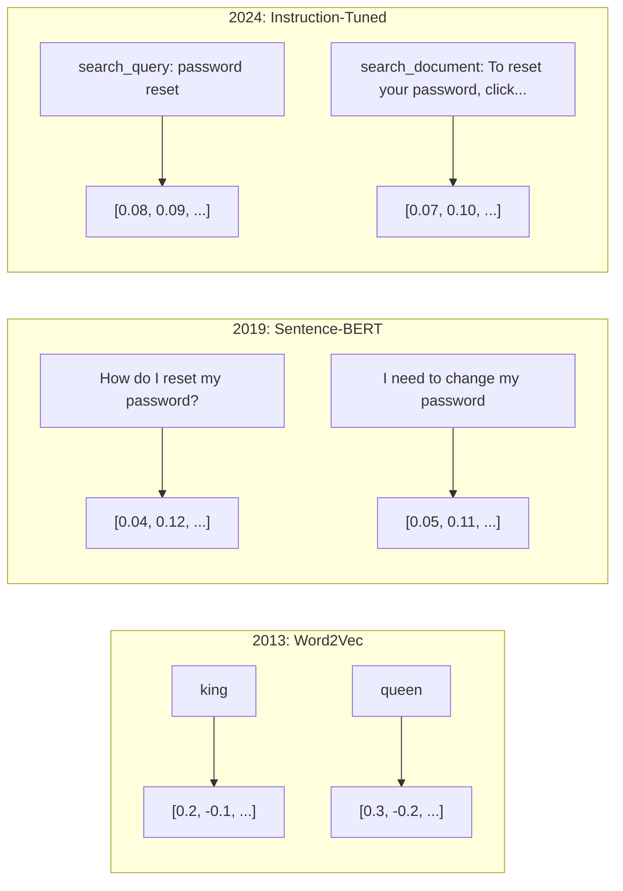
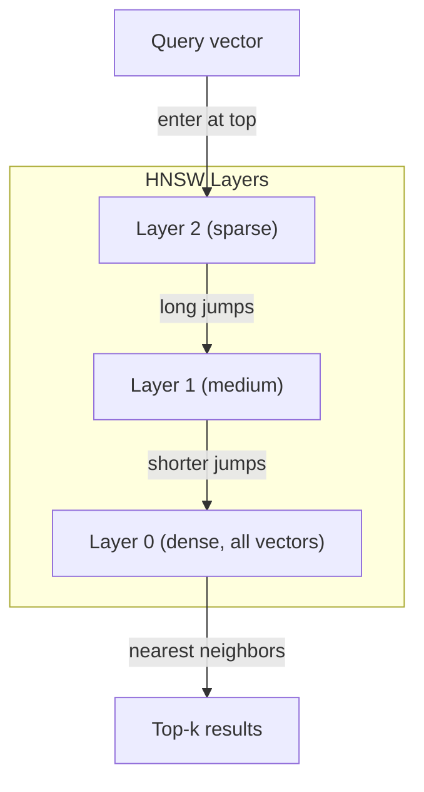

# Embedings y representaciones vectoriales

> El texto es discreto. Las matemáticas son continuas. Cada vez que pides a un LLM que encuentre documentos "similares", comparen significados o busquen más allá de palabras clave, estás confiando en un puente entre estos dos mundos. Ese puente es una incorporación. Si no entiendes las incorporaciones, no entiendes la IA moderna. Solo la usas.

**Type:** Build
**Languages:** Python
**Prerequisites:** Phase 11, Lesson 01 (Prompt Engineering)
**Time:** ~75 minutes
**Related:**La fase 5 · 22 (Inmersión profunda de modelos de incorporación) cubre densa vs. escasa vs. multi-vector, truncamiento de Matryoshka y selección de modelos por eje. Esta lección se centra en la línea de producción (vector DBs, HNSW, matemáticas de similitud).

## Objetivos de aprendizaje

- Generar embebedidos de texto utilizando proveedores de API y modelos de código abierto, y calcular la similitud cosina entre ellos
- Explica por qué las incorporaciones resuelven el problema de discrepancia de vocabulario que la búsqueda de palabras clave no puede manejar
- Construir un índice de búsqueda semántica que recupere documentos por significado en lugar de coincidencia exacta de palabras clave
- Evaluar la calidad de la incorporación utilizando los puntos de referencia de recuperación (precision@k, recall) y elegir el modelo de incorporación adecuado para su tarea

## El problema

Tienes 10.000 boletos de soporte. Un cliente escribe "mi pago no pasó". Necesitas encontrar boletos similares en el pasado. La búsqueda de palabras clave encuentra boletos que contienen "pagamiento" y "no pasó". Se pierde "transacción fallida", "carga fue rechazada", y "error de facturación". Estos boletos describen exactamente el mismo problema con palabras completamente diferentes.

El lenguaje humano tiene docenas de formas de decir lo mismo. La búsqueda de palabras clave trata cada palabra como un símbolo independiente sin significado. No puede saber que "rechazado" y "no pasó" se refieren al mismo concepto.

Necesitas una representación de texto donde el significado, no la ortografía, determina la similitud. Necesitas una manera de colocar "mi pago no pasó" y "la transacción se negó" cerca de uno en algún espacio matemático, mientras empujas "mi pago llegó a tiempo" lejos a pesar de compartir la palabra "pagamiento".

Esa representación es una incrustación.

## El concepto

### ¿Qué es un implante?

Una incorporación es un vector denso de números de puntos flotantes que representa el significado del texto. La palabra "densa" importa - cada dimensión lleva información, a diferencia de las representaciones escasas (bolsa de palabras, TF-IDF) donde la mayoría de las dimensiones son cero.

"El gato se sentó en la alfombra" se convierte en algo así como`[0.023, -0.041, 0.087, ..., 0.012]`- una lista de números de 768 a 3072 dependiendo del modelo. Estos números codifican el significado. Nunca los inspeccionas directamente. Los comparas.

### El avance de Word2Vec

En 2013, Tomas Mikolov y colegas de Google publicaron Word2Vec. La idea principal: entrenar una red neuronal para predecir una palabra de sus vecinos (o vecinos de una palabra), y los pesos de las capas ocultas se convierten en representaciones vectoriales significativas.

El famoso resultado:

```
king - man + woman = queen
```

La aritmética vectorial en las incorporaciones de palabras captura relaciones semánticas. La dirección de "hombre" a "mujer" es aproximadamente la misma que la dirección de "rey" a "reina".

Word2Vec produjo vectores de 300 dimensiones. Cada palabra obtuvo un vector independientemente del contexto. "Banco" en "banco del río" y "cuenta bancaria" tenían la misma incorporación. Esta limitación impulsó la próxima década de investigación.

### De las palabras a las frases

Las incorporaciones de palabras representan tokens únicos. Los sistemas de producción necesitan incorporar oraciones enteras, párrafos o documentos. Surgieron cuatro enfoques:

**Averaging**Tome la media de todos los vectores de palabras en la oración. Baratos, perdedores, sorprendentemente decentes para texto corto. pierde el orden de palabras por completo - "perro muerde al hombre" y "hombre muerde al perro" obtienen los mismos embebidos.

**CLS token**: los modelos de transformadores (BERT, 2018) producen una incorporación especial de token [CLS] que representa toda la entrada.

**Contrastive learning**El modelo de seguridad de la aplicación de la aplicación de la aplicación de la aplicación de la aplicación de la aplicación de la aplicación de la aplicación de la aplicación de la aplicación de la aplicación de la aplicación de la aplicación de la aplicación de la aplicación de la aplicación de la aplicación de la aplicación de la aplicación de la aplicación de la aplicación de la aplicación de la aplicación de la aplicación de la aplicación de la aplicación de la aplicación de la aplicación de la aplicación de la aplicación de la aplicación de la aplicación de la aplicación de la aplicación de la aplicación de la aplicación de la aplicación de la aplicación de la aplicación de la aplicación de la aplicación de la aplicación de la aplicación de la aplicación de la aplicación de la aplicación de la aplicación de la aplicación de la aplicación de la aplicación de la aplicación de la aplicación de la aplicación de la aplicación de la aplicación de la aplicación de la aplicación de la aplicación de la aplicación de la aplicación de la aplicación de la aplicación de la aplicación de la aplicación de la aplicación de la aplicación de la aplicación de la aplicación de la aplicación de la aplicación de la aplicación de la aplicación de la aplicación de la aplicación de la aplicación de la aplicación de la aplicación de la aplicación de la aplicación de la aplicación de la aplicación de la aplicación de la aplicación de la aplicación de la aplicación de la aplicación de la aplicación de la aplicación de la aplicación de la aplicación de la aplicación de la aplicación de la aplicación de la aplicación de la aplicación de la aplicación de la aplicación de la aplicación de la aplicación de la aplicación de la aplicación de la aplicación de la aplicación de la aplicación de la aplicación de la aplicación de la aplicación de la aplicación de la aplicación de la aplicación de la aplicación de la aplicación de la aplicación de la aplicación de la aplicación de la aplicación de la aplicación de la aplicación de la aplicación de la aplicación de la aplicación de la aplicación de la aplicación de la aplicación de la aplicación de la aplicación de la aplicación de la aplicación de la aplicación de la aplicación de la aplicación de la aplicación de la aplicación de la aplicación de la aplicación de la aplicación de la aplicación de la ley de la ley de la ley de la ley de la ley de la ley de la ley de la ley de la ley de la ley de la ley de la ley de la ley de la ley de 30 de 30 de 30 de 30 de 30 de junio de junio de junio de junio de junio de junio de de de de de de de de de de de de de de de de de de de de de de de de de de de de de de de

**Instruction-tuned embeddings**Los modelos como E5 y GTE aceptan un prefijo de tarea ("search_query:", "search_document:") que le dice al modelo qué tipo de incorporación producir. Esto permite que un modelo sirva a múltiples tareas.



### Modelos modernos de incorporación

El mercado se ha dividido en un puñado de opciones de producción (puntuaciones MTEB a principios de 2026, MTEB v2):

| Model | Provider | Dimensions | MTEB | Context | Cost / 1M tokens |
|-------|----------|-----------|------|---------|------------------|
| Gemini Embedding 2 | Google | 3072 (Matryoshka) | 67.7 (retrieval) | 8192 | $0.15 |
| embed-v4 | Cohere | 1024 (Matryoshka) | 65.2 | 128K | $0.12 |
| voyage-4 | Voyage AI | 1024/2048 (Matryoshka) | 66.8 | 32K | $0.12 |
| text-embedding-3-large | OpenAI | 3072 (Matryoshka) | 64.6 | 8192 | $0.13 |
| text-embedding-3-small | OpenAI | 1536 (Matryoshka) | 62.3 | 8192 | $0.02 |
| BGE-M3 | BAAI | 1024 (dense+sparse+ColBERT) | 63.0 multilingual | 8192 | Open-weight |
| Qwen3-Embedding | Alibaba | 4096 (Matryoshka) | 66.9 | 32K | Open-weight |
| Nomic-embed-v2 | Nomic | 768 (Matryoshka) | 63.1 | 8192 | Open-weight |

MTEB (Masivo texto de incorporación de referencia) v2 cubre más de 100 tareas en la recuperación, clasificación, agrupamiento, re-ranking y resumen. Más alto es mejor. Para 2026, los modelos de peso abierto (Qwen3-Embedding, BGE-M3) coinciden o superan a los modelos de alojamiento cerrado en la mayoría de los ejes. Gemini Embedding 2 conduce a la recuperación pura; Voyage/Cohere conduce a dominios específicos (finanzas, derecho, código). Siempre haga referencia a sus propias consultas antes de comprometerse.

### Metricas de similitud

Dadas dos vectores de incorporación, tres formas de medir su similitud:

**Cosine similarity**El cosino del ángulo entre dos vectores. Va desde -1 (oposto) hasta 1 (dirección idéntica). Ignora la magnitud - una oración de 10 palabras y un documento de 500 palabras pueden obtener 1,0 si apuntan a la misma dirección.

```
cosine_sim(a, b) = dot(a, b) / (||a|| * ||b||)
```

**Dot product**El producto interno bruto de dos vectores. Identico a la similitud cosínica cuando los vectores se normalizan (duración de la unidad). Más rápido para calcular.

```
dot(a, b) = sum(a_i * b_i)
```

**Euclidean (L2) distance**Es más pequeño = más similar. sensible a las diferencias de magnitud. Se utiliza cuando la posición absoluta en el espacio es importante, no sólo la dirección.

```
L2(a, b) = sqrt(sum((a_i - b_i)^2))
```

Cuándo utilizar:

| Metric | Use when | Avoid when |
|--------|----------|------------|
| Cosine similarity | Comparing texts of different lengths; most retrieval tasks | Magnitude carries information |
| Dot product | Embeddings are already normalized; maximum speed | Vectors have varying magnitudes |
| Euclidean distance | Clustering; spatial nearest-neighbor problems | Comparing documents of wildly different lengths |

### Las bases de datos vectoriales y HNSW

Una búsqueda de similitud de fuerza bruta compara la consulta con cada vector almacenado. En 1 millón de vectores con 1536 dimensiones, eso es 1.5 mil millones de operaciones de multiplicar adición por consulta. Demasiado lento.

Las bases de datos vectoriales resuelven esto con algoritmos de vecino más cercano aproximado (ANN). El algoritmo dominante es HNSW (Hierárquico mundo pequeño navegable):

1. Construir un gráfico de múltiples capas de vectores
2. Las capas superiores son escasas - conexiones de largo alcance entre grupos distantes
3. Las capas inferiores son densas - conexiones de granos finos entre vectores cercanos
4. La búsqueda comienza en la capa superior, descendiendo codiciosamente para refinar
5. Retorna resultados aproximados de top-k en tiempo O(log n) en lugar de O(n)

HNSW negocia una pequeña pérdida de precisión (generalmente 95-99% de recuperación) por ganancias masivas de velocidad.



Opciones de producción:

| Database | Type | Best for | Max scale |
|----------|------|----------|-----------|
| Pinecone | Managed SaaS | Zero-ops production | Billions |
| Weaviate | Open source | Self-hosted, hybrid search | 100M+ |
| Qdrant | Open source | High performance, filtering | 100M+ |
| ChromaDB | Embedded | Prototyping, local dev | 1M |
| pgvector | Postgres extension | Already using Postgres | 10M |
| FAISS | Library | In-process, research | 1B+ |

### Estrategias para deshacerse

Los documentos son demasiado largos para incorporarlos como vectores únicos. Un PDF de 50 páginas cubre docenas de temas -- su incorporación se convierte en un promedio de todo, similar a nada específico. Se dividen los documentos en trozos y se incrusta cada uno.

**Fixed-size chunking**Se puede calcular el valor de los tokens de la moneda de un banco de divisas de 50 tokens.

**Sentence-based chunking**Cada pieza es al menos una oración completa. Es mejor que un tamaño fijo porque nunca cortas un pensamiento a la mitad.

**Recursive chunking**Si todavía es demasiado grande, prueba los límites del párrafo. Luego los límites de la oración. Luego los límites de caracteres. Esto es el de LangChain `RecursiveCharacterTextSplitter`y funciona bien para corpora de formato mixto.

**Semantic chunking**Cuando la similitud de incorporación cae por debajo de un umbral, comience un nuevo pedazo.

| Strategy | Complexity | Quality | Best for |
|----------|-----------|---------|----------|
| Fixed-size | Low | Decent | Unstructured text, logs |
| Sentence-based | Low | Good | Articles, emails |
| Recursive | Medium | Good | Markdown, HTML, mixed docs |
| Semantic | High | Best | Critical retrieval quality |

El punto ideal para la mayoría de los sistemas: 256-512 trozos de tokens con 50 tokens superpuestos.

### Bi-Encoders vs Cross-Encoders

Un bi-encoder incorpora la consulta y los documentos de forma independiente, luego compara vectores. Rápido - se incrusta la consulta una vez y se compara con los documentos precomputados incrustados. Esto es lo que se utiliza para la recuperación.

Un codificador cruzado toma la consulta y un documento como una sola entrada y saca una puntuación de relevancia. Lento - procesa cada par de consulta-documento a través del modelo completo. Pero mucho más preciso porque puede participar en todas las preguntas y documentos tokens simultáneamente.

El patrón de producción: el bi-encoder recupera los 100 candidatos más importantes, el cross-encoder los re-rancaliza a los 10 mejores.


Modelos de recalificación: Cohere Rerank 3.5 ($ 2 por 1000 consultas), BGE-reranker-v2 (libre, de código abierto), Jina Reranker v2 (libre, de código abierto).

### Embedings de matryoshka

Los embeddings tradicionales son todo o nada. Un vector de 1536 dimensiones utiliza 1536 flotantes. No se puede truncar a 256 dimensiones sin volver a entrenar.

El modelo está entrenado de modo que las primeras dimensiones N capturen la información más importante, como una muñeca de anidación rusa. Truncando una matryoshka de 1536 d incrustada a 256 dimensiones pierde cierta precisión pero sigue siendo funcional.

La incorporación de texto de OpenAI de 3 pequeños y de texto de 3 grandes soportan la truncada de Matryoshka a través de la `dimensions`Para el sistema de datos, el requisito de 256 dimensiones en lugar de 1536 reduce el almacenamiento en 6 veces con una pérdida de precisión de aproximadamente 3-5% en los puntos de referencia MTEB.

### Cuantización binaria

Una incorporación de 1536 dimensiones almacenada como float32 utiliza 6.144 bytes. Multiplica por 10 millones de documentos: 61 GB solo para vectores.

La cuantización binaria convierte cada float en un solo bit: los valores positivos se convierten en 1, los valores negativos en 0. El almacenamiento cae de 6.144 bytes a 192 bytes, una reducción de 32 veces. La similitud se calcula utilizando la distancia de Hamming (contar bits diferentes), que las CPUs pueden hacer en una sola instrucción.

El golpe de precisión es de alrededor del 5-10% en la recuperación de recuperación. El patrón común: cuantización binaria para la búsqueda de primer paso sobre millones de vectores, luego volver a marcar el top-1000 con vectores de precisión completa. Esto te da un 95% + de precisión completa con 32 veces menos memoria.

```figure
cosine-similarity
```

## Construye el mismo

Construimos un motor de búsqueda semántica desde cero, sin base de datos vectorial, sin API externa de incorporación, Python puro con numpy para las matemáticas.

### Paso 1: Descargar el texto

```python
def chunk_text(text, chunk_size=200, overlap=50):
    words = text.split()
    chunks = []
    start = 0
    while start < len(words):
        end = start + chunk_size
        chunk = " ".join(words[start:end])
        chunks.append(chunk)
        start += chunk_size - overlap
    return chunks


def chunk_by_sentences(text, max_chunk_tokens=200):
    sentences = text.replace("\n", " ").split(".")
    sentences = [s.strip() + "." for s in sentences if s.strip()]
    chunks = []
    current_chunk = []
    current_length = 0
    for sentence in sentences:
        sentence_length = len(sentence.split())
        if current_length + sentence_length > max_chunk_tokens and current_chunk:
            chunks.append(" ".join(current_chunk))
            current_chunk = []
            current_length = 0
        current_chunk.append(sentence)
        current_length += sentence_length
    if current_chunk:
        chunks.append(" ".join(current_chunk))
    return chunks
```

### Paso 2: Construir los embeddings desde cero

Implementamos una simple incorporación densa utilizando TF-IDF con normalización L2. Esta no es una incorporación neuronal, pero sigue el mismo contrato: texto en, vector de tamaño fijo hacia fuera, textos similares producen vectores similares.

```python
import math
import numpy as np
from collections import Counter

class SimpleEmbedder:
    def __init__(self):
        self.vocab = []
        self.idf = []
        self.word_to_idx = {}

    def fit(self, documents):
        vocab_set = set()
        for doc in documents:
            vocab_set.update(doc.lower().split())
        self.vocab = sorted(vocab_set)
        self.word_to_idx = {w: i for i, w in enumerate(self.vocab)}
        n = len(documents)
        self.idf = np.zeros(len(self.vocab))
        for i, word in enumerate(self.vocab):
            doc_count = sum(1 for doc in documents if word in doc.lower().split())
            self.idf[i] = math.log((n + 1) / (doc_count + 1)) + 1

    def embed(self, text):
        words = text.lower().split()
        count = Counter(words)
        total = len(words) if words else 1
        vec = np.zeros(len(self.vocab))
        for word, freq in count.items():
            if word in self.word_to_idx:
                tf = freq / total
                vec[self.word_to_idx[word]] = tf * self.idf[self.word_to_idx[word]]
        norm = np.linalg.norm(vec)
        if norm > 0:
            vec = vec / norm
        return vec
```

### Paso 3: Funciones similares

```python
def cosine_similarity(a, b):
    dot = np.dot(a, b)
    norm_a = np.linalg.norm(a)
    norm_b = np.linalg.norm(b)
    if norm_a == 0 or norm_b == 0:
        return 0.0
    return float(dot / (norm_a * norm_b))


def dot_product(a, b):
    return float(np.dot(a, b))


def euclidean_distance(a, b):
    return float(np.linalg.norm(a - b))
```

### Paso 4: Indicador de vectores con búsqueda de fuerza bruta

```python
class VectorIndex:
    def __init__(self):
        self.vectors = []
        self.texts = []
        self.metadata = []

    def add(self, vector, text, meta=None):
        self.vectors.append(vector)
        self.texts.append(text)
        self.metadata.append(meta or {})

    def search(self, query_vector, top_k=5, metric="cosine"):
        scores = []
        for i, vec in enumerate(self.vectors):
            if metric == "cosine":
                score = cosine_similarity(query_vector, vec)
            elif metric == "dot":
                score = dot_product(query_vector, vec)
            elif metric == "euclidean":
                score = -euclidean_distance(query_vector, vec)
            else:
                raise ValueError(f"Unknown metric: {metric}")
            scores.append((i, score))
        scores.sort(key=lambda x: x[1], reverse=True)
        results = []
        for idx, score in scores[:top_k]:
            results.append({
                "text": self.texts[idx],
                "score": score,
                "metadata": self.metadata[idx],
                "index": idx
            })
        return results

    def size(self):
        return len(self.vectors)
```

### Paso 5: El motor de búsqueda semántica

```python
class SemanticSearchEngine:
    def __init__(self, chunk_size=200, overlap=50):
        self.embedder = SimpleEmbedder()
        self.index = VectorIndex()
        self.chunk_size = chunk_size
        self.overlap = overlap

    def index_documents(self, documents, source_names=None):
        all_chunks = []
        all_sources = []
        for i, doc in enumerate(documents):
            chunks = chunk_text(doc, self.chunk_size, self.overlap)
            all_chunks.extend(chunks)
            name = source_names[i] if source_names else f"doc_{i}"
            all_sources.extend([name] * len(chunks))
        self.embedder.fit(all_chunks)
        for chunk, source in zip(all_chunks, all_sources):
            vec = self.embedder.embed(chunk)
            self.index.add(vec, chunk, {"source": source})
        return len(all_chunks)

    def search(self, query, top_k=5, metric="cosine"):
        query_vec = self.embedder.embed(query)
        return self.index.search(query_vec, top_k, metric)

    def search_with_scores(self, query, top_k=5):
        results = self.search(query, top_k)
        return [
            {
                "text": r["text"][:200],
                "source": r["metadata"].get("source", "unknown"),
                "score": round(r["score"], 4)
            }
            for r in results
        ]
```

### Paso 6: Comparar las métricas de similitud

```python
def compare_metrics(engine, query, top_k=3):
    results = {}
    for metric in ["cosine", "dot", "euclidean"]:
        hits = engine.search(query, top_k=top_k, metric=metric)
        results[metric] = [
            {"score": round(h["score"], 4), "preview": h["text"][:80]}
            for h in hits
        ]
    return results
```

## Usalo

Con una API de producción integrada, la arquitectura se mantiene idéntica. Sólo el embebedder cambia:

```python
from openai import OpenAI

client = OpenAI()

def openai_embed(texts, model="text-embedding-3-small", dimensions=None):
    kwargs = {"model": model, "input": texts}
    if dimensions:
        kwargs["dimensions"] = dimensions
    response = client.embeddings.create(**kwargs)
    return [item.embedding for item in response.data]
```

Truncation de matrioshka con OpenAI - el mismo modelo, menos dimensiones, menor almacenamiento:

```python
full = openai_embed(["semantic search query"], dimensions=1536)
compact = openai_embed(["semantic search query"], dimensions=256)
```

El vector 256-d utiliza 6 veces menos almacenamiento. Para 10 millones de documentos, eso es 10 GB vs 61 GB. La pérdida de precisión es aproximadamente 3-5% en los puntos de referencia estándar.

Para el reordenamiento con Cohere:

```python
import cohere

co = cohere.ClientV2()

results = co.rerank(
    model="rerank-v3.5",
    query="What is the refund policy?",
    documents=["Full refund within 30 days...", "No refunds after 90 days..."],
    top_n=3
)
```

Para las incorporaciones locales sin dependencia de API:

```python
from sentence_transformers import SentenceTransformer

model = SentenceTransformer("BAAI/bge-small-en-v1.5")
embeddings = model.encode(["semantic search query", "another document"])
```

La clase VectorIndex de nuestra construcción funciona con cualquiera de estos. Cambiar la función de incorporación, mantener la lógica de búsqueda.

## Envío

Esta lección produce:
- `outputs/prompt-embedding-advisor.md`-- una instrucción para elegir modelos y estrategias de incorporación para casos de uso específicos
- `outputs/skill-embedding-patterns.md`-- una habilidad que enseña a los agentes cómo usar los incorporados de manera efectiva en la producción

## Los ejercicios

1. **Metric comparison**Las preguntas que se hacen en el caso de las que se encuentran en el estudio de la información de la información de la información de la información de la información de la información de la información de la información de la información de la información de la información de la información de la información de la información de la información de la información de la información de la información de la información de la información de la información de la información de la información de la información de la información de la información de la información de la información de la información de la información de la información de la información de la información de la información de la información de la información de la información de la información de la información de la información de la información de la información de la información de la información de la información de la información de la información de la información de la información de la información de la información de la información de la información de la información de la información de la información de la información de la información de la información de la información de la información de la información de la información de la información de la información de la información de la información de la información de la información de la información de la información de la información de la información de la información de la información de la información de la información de la información de la información de la información de la información de la información de la información de la información de la información de la información de la información de la información de la información de la información de la información de la información de la información de la información de la información de la información de la información de la información de la información de la información de la información de la información de la información de la información de la información de la información de la información de la información de la información de la información de la información de la información de la información de la información de la información de la que se trata.

2. **Chunk size experiment**En el caso de los documentos de muestra, indique los documentos de muestra con un tamaño de piezas de 50, 100, 200 y 500 palabras. Para cada una, ejecuta 5 consultas y registra el puntaje de similitud de primer lugar.

3. **Matryoshka simulation**Se puede medir el rendimiento de la recuperación de recuerdos en cada truncado, simulando el comportamiento de Matryoshka sin necesidad de un truco de entrenamiento real.

4. **Binary quantization**: tomar las incorporaciones del motor de búsqueda, convertirlas en binarias (1 si es positivo, 0 si es negativo), y implementar búsqueda de distancia de Hamming. Comparar los 10 primeros resultados con la similitud cosina de precisión completa. Medir el porcentaje de superposición.

5. **Sentence-based chunking**: sustituir el chunking de tamaño fijo por `chunk_by_sentences`¿Se mejoran los resultados si se respetan los límites de la frase?

## Términos clave

| Term | What people say | What it actually means |
|------|----------------|----------------------|
| Embedding | "Text to numbers" | A dense vector where geometric proximity encodes semantic similarity |
| Word2Vec | "The OG embedding" | 2013 model that learned word vectors by predicting context words; proved vector arithmetic encodes meaning |
| Cosine similarity | "How similar are two vectors" | Cosine of the angle between vectors; 1 = identical direction, 0 = orthogonal, -1 = opposite |
| HNSW | "Fast vector search" | Hierarchical Navigable Small World graph -- multi-layer structure enabling O(log n) approximate nearest neighbor search |
| Bi-encoder | "Embed separately, compare fast" | Encodes query and document independently into vectors; enables pre-computation and fast retrieval |
| Cross-encoder | "Slow but accurate reranker" | Processes query-document pair jointly through the full model; higher accuracy, no pre-computation |
| Matryoshka embeddings | "Truncatable vectors" | Embeddings trained so the first N dimensions capture the most important information, enabling variable-size storage |
| Binary quantization | "1-bit embeddings" | Converting float vectors to binary (sign bit only) for 32x storage reduction with Hamming distance search |
| Chunking | "Split docs for embedding" | Breaking documents into 256-512 token segments so each can be independently embedded and retrieved |
| Vector database | "Search engine for embeddings" | Data store optimized for storing vectors and performing approximate nearest neighbor search at scale |
| Contrastive learning | "Train by comparison" | Training approach that pushes similar pair embeddings together and dissimilar pair embeddings apart |
| MTEB | "The embedding benchmark" | Massive Text Embedding Benchmark -- 56 datasets across 8 tasks; standard for comparing embedding models |

## Leer más

- Mikolov et al., "Estimación Eficiente de las Representaciones de Palabras en el Espacio Vectorial" (2013) -- el documento Word2Vec que comenzó la revolución de incorporación con la analogía rey-reina
- Reimers & Gurevych, "Sentence-BERT: Embeddings of Sentences using Siamese BERT-Networks" (2019) -- cómo entrenar a los bi-encoders para la similitud a nivel de oración, la base de los modelos modernos de incorporación
- Kusupati et al., "Matryoshka Representation Learning" (2022) -- la técnica detrás de las incorporaciones de dimensiones variables que OpenAI adoptó para la incorporación de texto-3
- Malkov y Yashunin, "Eficiente y robusto vecino aproximado más cercano utilizando gráficos jerárquicos navegables del mundo pequeño" (2018) -- el documento HNSW, el algoritmo detrás de la mayoría de la búsqueda de vectores de producción
- Guía de incorporación de OpenAI (platform.openai.com/docs/guías/embeddings) -- referencia práctica para modelos de incorporación de texto-3, incluida la reducción de dimensiones Matryoshka
- Tabla de referencia MTEB (huggingface.co/spaces/mteb/leaderboard) - referencia en vivo que compara todos los modelos de incorporación en diferentes tareas y idiomas
- [Muennighoff et al., "MTEB: Massive Text Embedding Benchmark" (EACL 2023)](https://arxiv.org/abs/2210.07316)-- el índice de referencia que define las 8 categorías de tareas (clasificación, agrupamiento, clasificación de pares, re-ranqueamiento, recuperación, STS, resumen, minería de texto) que el tablero de clasificación informa; lea antes de confiar en cualquier puntuación de MTEB.
- [Sentence Transformers documentation](https://www.sbert.net/)-- referencia canónica para el bi-encoder vs. el cross-encoder, estrategias de agrupación, y la tubería de ingesta-dividida-entrega integrada RAG esta lección implementa.
