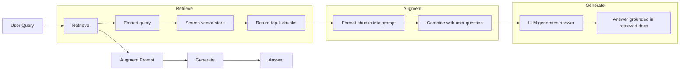
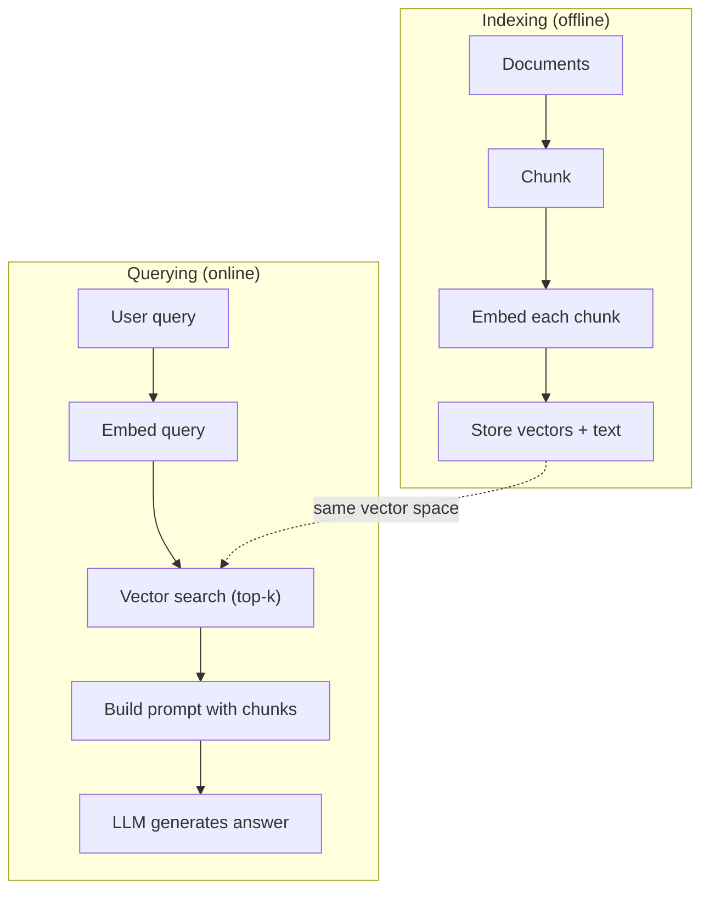

# RAG (Generación aumentada por recuperación)

> Su LLM sabe todo hasta su tiempo de formación. No sabe nada sobre los documentos de su empresa, su base de código o las notas de la reunión de la semana pasada. RAG resuelve esto recuperando documentos relevantes y llenándolos en el prompt. Es el patrón más implementado en la IA de producción. Si construye algo de este curso, construye un oleoducto RAG.

**Type:** Build
**Languages:** Python
**Prerequisites:** Phase 10 (LLMs from Scratch), Phase 11 Lessons 01-05
**Time:** ~90 minutes
**Related:**Fase 5 · 23 (Estrategias de descomposición para RAG) para los seis algoritmos de descomposición y cuando cada uno gana. Fase 5 · 22 (Diploja profunda de modelos de incorporación) para elegir el embedder. Fase 11 · 07 (RAG avanzado) para búsqueda híbrida, re-ranqueo y transformación de consultas.

## Objetivos de aprendizaje

- Construir una línea de RAG completa: carga de documentos, fragmentación, incorporación, almacenamiento vectorial, recuperación y generación
- Implementar búsqueda semántica utilizando una base de datos vectorial (ChromaDB, FAISS o Pinecone) con una indexación adecuada
- Explicar por qué se prefiere el RAG a la ajuste fino para aplicaciones basadas en el conocimiento (costos, frescura, atribución)
- Evaluar la calidad de los RAG utilizando métricas de recuperación (precisión, recuerdo) y métricas de generación (filialidad, relevancia)

## El problema

La política de reembolso de las empresas se encuentra en una wiki interna de 200 páginas, donde se dice que los clientes de las empresas reciben una ventana de 60 días con reembolsos por cuenta propia. La LLM nunca ha visto este documento. No puede saber en qué no fue entrenado.

El ajuste fino es una solución. Tome el LLM, entrenarlo en sus documentos internos y despliegue el modelo actualizado. Esto funciona pero tiene serios problemas. El ajuste fino cuesta miles de dólares en cálculo. El modelo se vuelve obsoleto en el momento en que cambia un documento. No tiene manera de saber de qué fuente se extrajo el modelo. Y si la compañía adquiere otra línea de productos el próximo mes, usted ajusta de nuevo.

RAG es la otra solución. Deja el modelo intacto. Cuando se le presente una pregunta, busque en su archivo de documentos pasajes relevantes, pégalos en el aviso antes de la pregunta y deje que el modelo responda utilizando esos pasajes como contexto. La tienda de documentos se puede actualizar en minutos. Puedes ver exactamente qué documentos fueron recuperados. El modelo en sí nunca cambia. Es por eso que RAG es el patrón dominante en la producción: es más barato, más fresco, más auditable y funciona con cualquier LLM.

## El concepto

### El patrón RAG

Todo el patrón se ajusta en cuatro pasos:



Encuesta -> Recuperar -> Aumentar el mensaje -> Generar. Cada sistema RAG sigue este patrón. Las diferencias entre los sistemas RAG de producción están en los detalles de cada paso: cómo se descompone, cómo se incrusta, cómo se busca y cómo se construye el mensaje.

### Por qué RAG es mejor que el ajuste fino

| Concern | Fine-tuning | RAG |
|---------|------------|-----|
| Cost | $1,000-$100,000+ per training run | $0.01-$0.10 per query (embedding + LLM) |
| Freshness | Stale until retrained | Updated in minutes by re-indexing docs |
| Auditability | Cannot trace answer to source | Can show exact retrieved passages |
| Hallucination | Still hallucinates freely | Grounded in retrieved documents |
| Data privacy | Training data baked into weights | Documents stay in your vector store |

El ajuste fino cambia los pesos del modelo de forma permanente. RAG cambia el contexto del modelo temporalmente. Para la mayoría de las aplicaciones, el contexto temporal es lo que se desea.

El único caso en el que el ajuste fino gana: cuando se necesita que el modelo adopte un estilo, tono o patrón de razonamiento específico que no se puede lograr solo mediante la solicitud.

### Incluir modelos

Un modelo de incorporación convierte el texto en un vector denso. Texto similar produce vectores que están cerca de uno al otro en este espacio de alta dimensión. "¿Cómo restablezco mi contraseña?" y "Necesito cambiar mi contraseña" producen vectores casi idénticos a pesar de compartir pocas palabras. "El gato se sentó en la alfombra" produce un vector muy diferente.

Modelos de incorporación comunes (alineación 2026  ver la fase 5 · 22 para un análisis completo):

| Model | Dimensions | Provider | Notes |
|-------|-----------|----------|-------|
| text-embedding-3-small | 1536 (Matryoshka) | OpenAI | Best price/performance for most use cases |
| text-embedding-3-large | 3072 (Matryoshka) | OpenAI | Higher accuracy, truncatable to 256/512/1024 |
| Gemini Embedding 2 | 3072 (Matryoshka) | Google | Top MTEB retrieval; 8K context |
| voyage-4 | 1024/2048 (Matryoshka) | Voyage AI | Domain variants (code, finance, law) |
| Cohere embed-v4 | 1024 (Matryoshka) | Cohere | Strong multilingual, 128K context |
| BGE-M3 | 1024 (dense + sparse + ColBERT) | BAAI (open-weight) | Three views from one model |
| Qwen3-Embedding | 4096 (Matryoshka) | Alibaba (open-weight) | Top open-weight retrieval score |
| all-MiniLM-L6-v2 | 384 | Open-weight (Sentence Transformers) | Prototyping baseline |

Para esta lección, construimos nuestra propia incorporación simple utilizando TF-IDF. No porque TF-IDF sea lo que los sistemas de producción utilizan, sino porque hace concreto el concepto: el texto entra, un vector sale, textos similares producen vectores similares.

### Similaridad vectorial

Dadas dos vectores, ¿cómo se mide la similitud?

**Cosine similarity**El cosino del ángulo entre dos vectores. varía de -1 (oposto) a 1 (identico). Ignora la magnitud, sólo se preocupa por la dirección. Esta es la opción predeterminada para RAG.

```
cosine_sim(a, b) = dot(a, b) / (||a|| * ||b||)
```

**Dot product**Los vectores más grandes obtienen puntajes más altos.

```
dot(a, b) = sum(a_i * b_i)
```

**L2 (Euclidean) distance**Distancia recta en el espacio vectorial. Distancia más pequeña = más similar.

```
L2(a, b) = sqrt(sum((a_i - b_i)^2))
```

La similitud cosínica es el estándar. maneja documentos de diferentes longitudes con gracia porque se normaliza en magnitud. Cuando alguien dice "busca vectorial", casi siempre se refieren a similitud cosínica.

### Estrategias para deshacerse

Los documentos son demasiado largos para incorporarlos como vectores únicos. Un PDF de 50 páginas puede producir una terrible incorporación porque contiene docenas de temas. En su lugar, se dividen los documentos en trozos y se embebebe cada trozo por separado.

**Fixed-size chunking**Una pieza de 512 tokens con 50 tokens superpuestas significa que la pieza 1 es tokens 0-511, la pieza 2 es tokens 462-973, etc. La superpuesta asegura que no se divide una oración en un límite desafortunado.

**Semantic chunking**El texto de la sección de la sección de referencia es un texto de la sección de referencia, que se divide en límites naturales.

**Recursive chunking**Si un apartado es todavía demasiado grande, divide en los límites de la oración. Este es el enfoque de LangChain RecursiveCharacterTextSplitter y funciona bien en la práctica.

El tamaño de la pieza importa más de lo que la gente piensa:

- Demasiados pequeños (64-128 tokens): cada pieza carece de contexto. "Aumentó un 15% el trimestre pasado" no significa nada sin saber a qué se refiere "lo".
- Demasiado grande (2048+ tokens): cada pieza cubre múltiples temas, diluyendo la relevancia. Cuando buscas datos de ingresos, obtienes un pieza que es el 10% sobre ingresos y el 90% sobre el personal.
- Sweet spot (256-512 tokens): contexto suficiente para ser autónomo, enfocado lo suficiente para ser relevante.

La mayoría de los sistemas RAG de producción utilizan 256-512 trozos de tokens con superposición de 50 tokens.

### Base de datos de vectores

Una vez que tienes las incorporaciones, necesitas un lugar donde almacenarlas y buscarlas.

| Database | Type | Best for |
|----------|------|----------|
| FAISS | Library (in-process) | Prototyping, small to medium datasets |
| Chroma | Lightweight DB | Local development, small deployments |
| Pinecone | Managed service | Production without ops overhead |
| Weaviate | Open source DB | Self-hosted production |
| pgvector | Postgres extension | Already using Postgres |
| Qdrant | Open source DB | High-performance self-hosted |

Para esta lección, construimos una simple almacenaje de vectores en memoria. Almacena vectores en una lista y hace búsqueda de similitud cosina de fuerza bruta. Esto es equivalente a FAISS con un índice plano. Escala hasta quizás 100.000 vectores antes de ralentizarse. Los sistemas de producción utilizan algoritmos de vecino más cercanos aproximados (ANN) como HNSW para buscar millones de vectores en milisegundos.

### El oleoducto completo



La fase de indexación se ejecuta una vez por documento (o cuando los documentos se actualizan). La fase de consulta se ejecuta en cada solicitud del usuario. En la producción, la indexación puede procesar millones de documentos en horas.

### Números reales

La mayoría de los sistemas RAG de producción utilizan estos parámetros:

- **k = 5 to 10**fragmentos recuperados por consulta
- **Chunk size = 256 to 512 tokens**con 50 tokens superpuestos
- **Context budget**: 2500 a 5.000 tokens de contenido recuperado por consulta
- **Total prompt**: ~ 8.000-16.000 tokens (invite del sistema + trozos recuperados + historial de conversaciones + consulta del usuario)
- **Embedding dimension**: 384-3072 dependiendo del modelo
- **Indexing throughput**: 100-1,000 documentos por segundo con API incrustados
- **Query latency**: 50-200 ms para la recuperación, 500-3000 ms para la generación

```figure
rag-chunking
```

## Construye el mismo

### Paso 1: Descomposición de documentos

```python
def chunk_text(text, chunk_size=200, overlap=50):
    words = text.split()
    chunks = []
    start = 0
    while start < len(words):
        end = start + chunk_size
        chunk = " ".join(words[start:end])
        chunks.append(chunk)
        start += chunk_size - overlap
    return chunks
```

### Paso 2: Embedings de TF-IDF

Construimos una función de incorporación simple. TF-IDF (Term Frequency-Inverse Document Frequency) no es una incorporación neuronal, sino que convierte el texto en vectores de una manera que captura la importancia de las palabras. Las palabras frecuentes en un documento obtienen un TF más alto. Las palabras raras en todo el corpus obtienen un IDF más alto. El producto da un vector donde las palabras importantes y distintivas tienen altos valores.

```python
import math
from collections import Counter

def build_vocabulary(documents):
    vocab = set()
    for doc in documents:
        vocab.update(doc.lower().split())
    return sorted(vocab)

def compute_tf(text, vocab):
    words = text.lower().split()
    count = Counter(words)
    total = len(words)
    return [count.get(word, 0) / total for word in vocab]

def compute_idf(documents, vocab):
    n = len(documents)
    idf = []
    for word in vocab:
        doc_count = sum(1 for doc in documents if word in doc.lower().split())
        idf.append(math.log((n + 1) / (doc_count + 1)) + 1)
    return idf

def tfidf_embed(text, vocab, idf):
    tf = compute_tf(text, vocab)
    return [t * i for t, i in zip(tf, idf)]
```

### Paso 3: Buscar similitudes cosinas

```python
def cosine_similarity(a, b):
    dot = sum(x * y for x, y in zip(a, b))
    norm_a = math.sqrt(sum(x * x for x in a))
    norm_b = math.sqrt(sum(x * x for x in b))
    if norm_a == 0 or norm_b == 0:
        return 0.0
    return dot / (norm_a * norm_b)

def search(query_embedding, stored_embeddings, top_k=5):
    scores = []
    for i, emb in enumerate(stored_embeddings):
        sim = cosine_similarity(query_embedding, emb)
        scores.append((i, sim))
    scores.sort(key=lambda x: x[1], reverse=True)
    return scores[:top_k]
```

### Paso 4: Construcción rápida

Aquí es donde ocurre el "aumentado" en RAG. Tome los trozos recuperados, formate los en un prompt, y pida al LLM que responda en función del contexto proporcionado.

```python
def build_rag_prompt(query, retrieved_chunks):
    context = "\n\n---\n\n".join(
        f"[Source {i+1}]\n{chunk}"
        for i, chunk in enumerate(retrieved_chunks)
    )
    return f"""Answer the question based ONLY on the following context.
If the context doesn't contain enough information, say "I don't have enough information to answer that."

Context:
{context}

Question: {query}

Answer:"""
```

### Paso 5: El oleoducto RAG completo

```python
class RAGPipeline:
    def __init__(self):
        self.chunks = []
        self.embeddings = []
        self.vocab = []
        self.idf = []

    def index(self, documents):
        all_chunks = []
        for doc in documents:
            all_chunks.extend(chunk_text(doc))
        self.chunks = all_chunks
        self.vocab = build_vocabulary(all_chunks)
        self.idf = compute_idf(all_chunks, self.vocab)
        self.embeddings = [
            tfidf_embed(chunk, self.vocab, self.idf)
            for chunk in all_chunks
        ]

    def query(self, question, top_k=5):
        query_emb = tfidf_embed(question, self.vocab, self.idf)
        results = search(query_emb, self.embeddings, top_k)
        retrieved = [(self.chunks[i], score) for i, score in results]
        prompt = build_rag_prompt(
            question, [chunk for chunk, _ in retrieved]
        )
        return prompt, retrieved
```

### Paso 6: Generación (simulada)

En la producción, aquí es donde se llama la API LLM. Para esta lección, simulamos la generación extrayendo la oración más relevante del contexto recuperado.

```python
def simple_generate(prompt, retrieved_chunks):
    query_words = set(prompt.lower().split("question:")[-1].split())
    best_sentence = ""
    best_score = 0
    for chunk in retrieved_chunks:
        for sentence in chunk.split("."):
            sentence = sentence.strip()
            if not sentence:
                continue
            words = set(sentence.lower().split())
            overlap = len(query_words & words)
            if overlap > best_score:
                best_score = overlap
                best_sentence = sentence
    return best_sentence if best_sentence else "I don't have enough information."
```

## Usalo

Con un modelo de incorporación real y LLM, el código apenas cambia:

```python
from openai import OpenAI

client = OpenAI()

def embed(text):
    response = client.embeddings.create(
        model="text-embedding-3-small",
        input=text
    )
    return response.data[0].embedding

def generate(prompt):
    response = client.chat.completions.create(
        model="gpt-4o-mini",
        messages=[{"role": "user", "content": prompt}],
        temperature=0
    )
    return response.choices[0].message.content
```

O con Anthropic:

```python
import anthropic

client = anthropic.Anthropic()

def generate(prompt):
    response = client.messages.create(
        model="claude-sonnet-5",
        max_tokens=1024,
        messages=[{"role": "user", "content": prompt}]
    )
    return response.content[0].text
```

El tubo es el mismo. Cambiar la función de incorporación. Cambiar la función de generación. La lógica de recuperación, el desglose, la construcción rápida - todo idéntico sin importar qué modelos utilices.

Para el almacenamiento de vectores a escala, reemplace la búsqueda de fuerza bruta por una base de datos vectorial adecuada:

```python
import chromadb

client = chromadb.Client()
collection = client.create_collection("my_docs")

collection.add(
    documents=chunks,
    ids=[f"chunk_{i}" for i in range(len(chunks))]
)

results = collection.query(
    query_texts=["What is the refund policy?"],
    n_results=5
)
```

Chroma maneja la incorporación internamente (utiliza todo MiniLM-L6-v2 por defecto) y almacena los vectores en una base de datos local.

## Envío

Esta lección produce:
- `outputs/prompt-rag-architect.md`-- una solicitud para el diseño de sistemas RAG para casos de uso específicos
- `outputs/skill-rag-pipeline.md`-- una habilidad que enseña a los agentes cómo construir y deshacerse de las tuberías RAG

## Los ejercicios

1. Los documentos de la muestra deben ser comparados con la calidad de recuperación de los documentos. TF-IDF debe tener un mejor rendimiento porque pesa más en palabras raras.

2. Experimenta con los tamaños de los fragmentos: prueba 50, 100, 200 y 500 palabras en el mismo conjunto de documentos. Para cada tamaño, ejecuta las mismas 5 consultas y cuenta cuántas devuelven un fragmento relevante en la parte superior-3.

3. Añadir metadatos a cada pieza (nombre del documento fuente, posición del pieza). Modificar la plantilla de solicitud para incluir la atribución de la fuente para que el LLM cite sus fuentes.

4. Implementar una evaluación simple: dado 10 pares de preguntas y respuestas, ejecutar cada pregunta a través de la tubería RAG, y medir qué porcentaje de trozos recuperados contienen la respuesta.

5. Construir un RAG de conversación consciente: mantener un historial de las últimas 3 exchanges e incluirlos en el aviso junto con los trozos recuperados. Prueba con preguntas de seguimiento como "¿Qué pasa con la empresa?" después de preguntar sobre los precios.

## Términos clave

| Term | What people say | What it actually means |
|------|----------------|----------------------|
| RAG | "AI that reads your docs" | Retrieve relevant documents, paste them into the prompt, and generate an answer grounded in those documents |
| Embedding | "Convert text to numbers" | A dense vector representation of text where similar meanings produce similar vectors |
| Vector database | "Search engine for AI" | A data store optimized for storing vectors and finding the nearest neighbors by similarity |
| Chunking | "Split docs into pieces" | Breaking documents into smaller segments (typically 256-512 tokens) so each can be embedded and retrieved independently |
| Cosine similarity | "How similar are two vectors" | The cosine of the angle between two vectors; 1 = identical direction, 0 = orthogonal, -1 = opposite |
| Top-k retrieval | "Get the k best matches" | Return the k most similar chunks to the query from the vector store |
| Context window | "How much text the LLM can see" | The maximum number of tokens the LLM can process in a single request; retrieved chunks must fit within this |
| Augmented generation | "Answer using given context" | Generating a response using retrieved documents as context rather than relying solely on trained knowledge |
| TF-IDF | "Word importance scoring" | Term Frequency times Inverse Document Frequency; weights words by how distinctive they are within a corpus |
| Indexing | "Preparing docs for search" | The offline process of chunking, embedding, and storing documents so they can be searched at query time |

## Leer más

- Lewis et al., "Generación de recuperación aumentada para tareas de PNL intensivas en conocimiento" (2020) -- el documento original de RAG de Facebook AI Research que formalizó el patrón de recuperación y luego generación
- Documentación RAG de Anthropic (docs.anthropic.com) - directrices prácticas para el tamaño de las piezas, la construcción rápida y la evaluación
- Centro de Aprendizaje Pinecone, "¿Qué es RAG?" - explicaciones visuales claras de la tubería RAG con consideraciones de producción
- Sentencia-BERT: Reimers & Gurevych (2019) -- el documento detrás de los modelos de incorporación de MiniLM, que muestra cómo entrenar los bi-encodadores para la similitud semántica
- [Karpukhin et al., "Dense Passage Retrieval for Open-Domain Question Answering" (EMNLP 2020)](https://arxiv.org/abs/2004.04906)-- el documento de DPR que demostró que la recuperación de bi-encoder denso supera a BM25 en el dominio abierto QA y establece el patrón para los modernos retrievers RAG.
- [LlamaIndex High-Level Concepts](https://docs.llamaindex.ai/en/stable/getting_started/concepts.html)-- los conceptos principales que se deben conocer al construir tuberías RAG: cargadores de datos, parseres de nodos, índices, retrievers, sintetizadores de respuesta.
- [LangChain RAG tutorial](https://python.langchain.com/docs/tutorials/rag/)-- el orquestrador de sabor opuesto; la visión de cadena de ejecutantes del mismo patrón de recuperación y luego generación.
