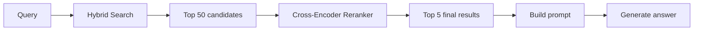
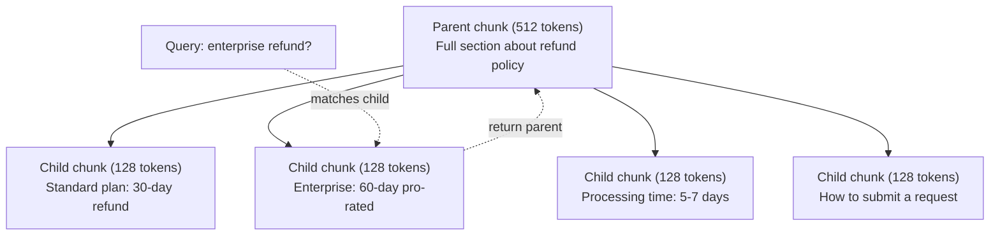
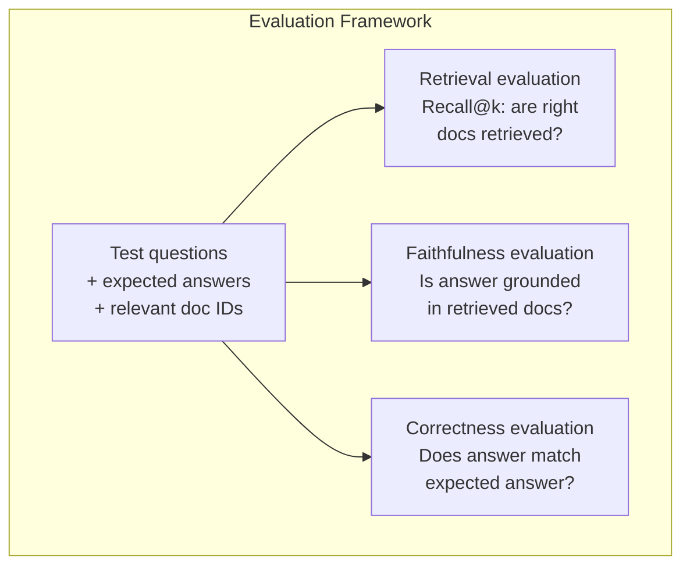

# RAG avanzado (Cumplimiento, Rencontre, búsqueda híbrida)

> RAG básico recupera los trozos más similares. Eso funciona para preguntas simples. Se desmorona para el razonamiento multi-hop, consultas ambigüas y corpora grandes. RAG avanzado es la diferencia entre una demostración que funciona en 10 documentos y un sistema que funciona en 10 millones.

**Type:** Build
**Languages:** Python
**Prerequisites:** Phase 11, Lesson 06 (RAG)
**Time:** ~90 minutes
**Related:**La fase 5 · 23 (Estrategias de descomposición para RAG) cubre los seis algoritmos de descomposición  recursiva, semántica, oración, documento padre, descomposición tardía, recuperación contextual  con puntos de referencia Vectara/antrópicos. Esta lección se basa en la parte superior: búsqueda híbrida, re-ranqueo, transformación de consultas.

## Objetivos de aprendizaje

- Implementar estrategias avanzadas de fragmentación (semántica, recursiva, padre-hijo) que preserven la estructura y el contexto del documento
- Construir una tubería de búsqueda híbrida que combine la combinación de palabras clave BM25 con búsqueda semántica vectorial y un reencoder cross-ranker
- Aplicar técnicas de transformación de consultas (HyDE, multi-query, step-back) para mejorar la recuperación de preguntas ambiguas o complejas
- Diagnóstico y reparación de fallas comunes de RAG: se recuperó un pedazo equivocado, respuesta no en contexto, desglose de razonamiento multi-hop

## El problema

Construiste una tubería básica de RAG en la Lección 06. Funciona para preguntas sencillas en un corpus pequeño.

**Ambiguous query**En la búsqueda semántica se encuentran fragmentos sobre la estrategia de ingresos, las proyecciones de ingresos y los pensamientos del director financiero sobre el crecimiento de los ingresos.$47.2M in Q3 2025" but uses the word "earnings" instead of "revenue." The embedding model thinks "revenue strategy" is closer to the query than "Q3 earnings were $47,2M".

**Multi-hop question**En el caso de los equipos de trabajo, el resultado de la evaluación de la satisfacción de los clientes es el siguiente: "¿Qué equipo mejoró más en su calificación de satisfacción de los clientes?" Esto requiere encontrar las calificaciones de satisfacción de cada equipo, compararlas e identificar el máximo.

**Large corpus problem**Tienes 2 millones de trozos. La respuesta correcta es en el trozo #1,847,293. Tu búsqueda de los primeros 5 tira los trozos #14, #89,201, #1,200,000, #44, y #901,333. Casi en el espacio de incorporación, pero ninguno contiene la respuesta. En esta escala, la búsqueda aproximada de vecino más cercano introduce suficiente error que los resultados relevantes se empujan fuera de la parte superior k.

RAG básico falla porque la similitud vectorial no es lo mismo que la relevancia. Un fragmento puede ser semánticamente similar a una consulta sin ser útil para responderla. Advanced RAG aborda esto con cuatro técnicas: búsqueda híbrida (agrega coincidencia de palabras clave), re-ranqueo (pone candidatos con más cuidado), transformación de consultas (correce la consulta antes de buscar) y mejor fragmentación (recuperar en la granularidad correcta).

## El concepto

### Busca híbrida: Semántica + Palabra clave

La búsqueda semántica (similaridad vectorial) es buena para entender el significado. "¿Cómo cancelar mi suscripción?" coincide con "Pasos para cancelar tu plan" aunque no comparten palabras. Pero se pierde coincidencias exactas. "Código de error E-4021" puede no coincidir con una pieza que contiene "E-4021" si el modelo de incorporación lo trata como ruido.

La búsqueda de palabras clave (BM25) es lo contrario. Excelente en coincidencias exactas. "E-4021" coincide perfectamente. Pero "cancelar mi suscripción" devuelve resultados cero si el documento dice "terminar su plan".

La búsqueda híbrida ejecuta ambas, luego fusiona los resultados.

**BM25**(Best Matching 25) es el algoritmo estándar de búsqueda de palabras clave. Ha sido la columna vertebral de los motores de búsqueda desde la década de 1990.

```
BM25(q, d) = sum over terms t in q:
    IDF(t) * (tf(t,d) * (k1 + 1)) / (tf(t,d) + k1 * (1 - b + b * |d| / avgdl))
```

Donde tf(t,d) es la frecuencia térmica de t en el documento d, IDF(t) es la frecuencia inversa del documento, \ \ \ \ \ \ \ \ \ \ \ \ \ \ \ \ \ \ \ \ \ \ \ \ \ \ \ \ \ \ \ \ \ \ \ \ \ \ \ \ \ \ \ \ \ \ \ \ \ \ \ \ \ \ \ \ \ \ \ \ \ \ \ \ \ \ \ \ \ \ \ \ \ \ \ \ \ \ \ \ \ \ \ \ \ \ \ \ \ \ \ \ \ \ \ \ \ \ \ \ \ \ \ \ \ \ \ \ \ \ \ \ \ \ \ \ \ \ \ \ \ \ \ \ \ \ \ \ \ \ \ \ \ \ \ \ \ \ \ \ \ \ \ \ \ \ \ \ \ \ \ \ \ \ \ \ \ \ \ \ \ \ \ \ \ \ \ \ \ \ \ \ \ \ \ \ \ \ \ \ \ \ \ \ \ \ \ \ \ \ \ \ \ \ \ \ \ \ \ \ \ \ \ \ \ \ \ \ \ \ \ \ \ \ \ \ \ \ \ \ \ \ \ \ \ \ \ \ \ \ \ \ \ \ \ \ \ \ \ \ \ \ \ \ \ \ \ \ \ \ \ \ \ \ \ \ \ \ \ \ \ \ \ \ \ \ \ \ \ \ \ \ \ \ \ \ \ \ \ \ \ \ \ \ \ \ \ \ \ \ \ \ \ \ \ \ \ \ \ \ \ \ \ \ \ \ \ \ \ \ \ \ \ \ \ \ \ \ \ \ \ \ \ \ \ \ \ \ \ \ \ \ \ \ \ \ \ \ \ \ \ \ \ \ \ \ \ \ \ \ \ \ \ \ \ \ \ \ \ \ \ \ \ \ \ \ \ \ \ \ \ \ \ \ \ \ \ \ \ \ \ \ \ \ \ \ \ \ \ \ \ \ \ \ \ \ \ \ \ \ \ \ \ \ \ \ \ \ \ \ \ \ \ \ \ \ \ \ \ \ \ \ \ \ \ \ \ \ \ \ \ \ \ \ \ \ \ \ \ \ \ \ \ \ \ \ \ \ \ \ \ \ \ \ \ \ \ \ \ \ \ \ \ \ \ \ \ \ \ \ \ \ \ \ \ \ \

En términos simples: BM25 califica más alto a los documentos cuando contienen términos de consulta (especialmente los raros), pero con rendimientos decrecientes para términos repetidos.

### Fusión recíproca de rango (RRF)

Hay dos listas clasificadas: una de búsqueda vectorial, otra de BM25. ¿Cómo se combinan?

```
RRF_score(d) = sum over rankings R:
    1 / (k + rank_R(d))
```

Donde k es una constante (típicamente 60) que impide que el resultado de primer rango domine.

Un documento clasificado #1 en búsqueda vectorial y #5 en BM25 obtiene: 1/(60+1) + 1/(60+5) = 0.0164 + 0.0154 = 0.0318

Un documento clasificado #3 en búsqueda vectorial y #2 en BM25 obtiene: 1/(60+3) + 1/(60+2) = 0.0159 + 0.0161 = 0.0320

RRF equilibra naturalmente las dos señales. Un documento que ocupa un puesto alto en ambas listas obtiene la mejor puntuación. Un documento que ocupa el puesto #1 en una lista pero está ausente de la otra obtiene una puntuación moderada. Esto es robusto porque utiliza rangos, no puntuaciones crudas, por lo que las diferencias en la distribución de puntuaciones entre los dos sistemas no importan.

### Reincorporación

La recuperación (ya sea vector, palabra clave o híbrido) es rápida pero imprecisa. Utiliza bi-encoders: la consulta y cada documento se incorporan de forma independiente, luego se comparan.

El ranking utiliza codificadores cruzados: la consulta y un documento candidato se alimentan juntos en un modelo que produce una puntuación de relevancia. El modelo ve ambos textos simultáneamente y puede capturar interacciones de granos finos entre ellos. Un codificador cruzado puede entender que "¿Cuáles fueron los ingresos del tercer trimestre?" es altamente relevante para un trozo que contiene "$47.2 millones en el tercer trimestre", incluso si un bi-encoder no logró la conexión.

El cambio: los codificadores cruzados son 100-1000 veces más lentos que los bi-encodadores porque procesan el par de documentos de consulta conjuntamente. No se pueden calcular previamente los puntajes de codificadores cruzados para un millón de documentos. La solución: recuperar un conjunto de candidatos más grande (top-50 de búsqueda híbrida), luego volver a clasificar con un codificador cruzado para obtener el top-5 final.



Modelos comunes de re-ranqueamiento (2026 lineup):
- Cohere Rerank 3.5: API gestionada, multilingüe, mejor ganancia de recuerdo en corpora mixtas
- Re-ranqueo de viaje-2.5: API administrada, menor latencia de las opciones alojadas
- Jina-Reranker-v2 Multilingüe: peso abierto, más de 100 idiomas
- bge-re-ranquer-v2-m3: peso abierto, línea de base fuerte
- código cruzado/ms-marco-MiniLM-L-6-v2: peso abierto, se ejecuta con CPU para la creación de prototipos
- ColBERTv2 / Jina-ColBERT-v2: retrasos de interacción re-ranqueadores multi-vector  O(tokens) no O(docs) en el momento de marcar

### Transformación de la consulta

A veces el problema no es la recuperación sino la consulta misma. "¿Qué fue eso del nuevo cambio de política?" es una terrible consulta de búsqueda. No contiene términos específicos. La incorporación es vaga. Ningún sistema de recuperación puede encontrar los documentos correctos de esto.

**Query rewriting**El LLM puede hacer esto:

```
User: "What was that thing about the new policy change?"
Rewritten: "Recent policy changes and updates"
```

**HyDE (Hypothetical Document Embeddings)**En lugar de buscar con la consulta, generar una respuesta hipotética, incrustar eso, y buscar documentos reales similares.

```
Query: "What is the refund policy for enterprise?"
Hypothetical answer: "Enterprise customers are eligible for a full refund
within 60 days of purchase. Refunds are pro-rated based on the remaining
subscription period and processed within 5-7 business days."
```

Embed la respuesta hipotética y búsqueda de documentos reales similares a ella. La intuición: la respuesta hipotética vive más cerca en el espacio de incorporación de la respuesta real que la pregunta original. Las preguntas y respuestas tienen diferentes estructuras lingüísticas. Al generar una respuesta hipotética, se rompe la brecha entre el "espacio de pregunta" y el "espacio de respuesta" en la incorporación.

HyDE agrega una llamada LLM antes de la recuperación. Esto aumenta la latencia en 500-2000ms. Vale la pena cuando la calidad de la recuperación es pobre en las consultas crudas.

### Los padres y los hijos se deshacen

El desmonte estándar obliga a un trade-off: pequeños trozos para una recuperación precisa, grandes trozos para un contexto suficiente.

Indice pequeños trozos (128 tokens) para la recuperación. Cuando se recupera un pequeño trozo, devuelve su trozo principal (512 tokens) para el prompt. El pequeño trozo coincide con la consulta con precisión. El trozo principal proporciona suficiente contexto para que el LLM genere una buena respuesta.



La consulta "reembolso de la empresa?" coincide con la parte menor C2 con precisión. Pero el prompt recibe la parte principal completa P, que incluye el contexto circundante sobre el tiempo de procesamiento y el proceso de presentación.

### Filtración de metadatos

Antes de ejecutar una búsqueda vectorial, filtre el corpus por metadatos: fecha, fuente, categoría, autor, idioma. Esto reduce el espacio de búsqueda y evita resultados irrelevantes.

"Qué cambió en la política de seguridad el mes pasado?" sólo debe buscar documentos de los últimos 30 días en la categoría de seguridad. Sin filtrar metadatos, buscas todo el corpus y puedes recuperar un documento de seguridad de 2 años que resulta semánticamente similar.

Los sistemas RAG de producción almacenan metadatos junto a cada pieza: documento fuente, fecha de creación, categoría, autor, versión.

### Evaluación

¿Cómo sabes si funciona?

**Retrieval relevance (Recall@k)**¿Cuál es el porcentaje de documentos relevantes que aparecen en los resultados de la sección 47?

**Faithfulness**Si los fragmentos recuperados dicen "ventana de reembolso de 60 días" y el modelo dice "ventana de reembolso de 90 días", eso es un fallo de fidelidad.

**Answer correctness**La respuesta generada coincide con la respuesta esperada.

Una simple verificación de fidelidad: tomar cada afirmación en la respuesta generada y verificar que aparece (en sustancia) en los trozos recuperados.



```figure
agentic-rag-loop
```

## Construye el mismo

### Paso 1: Implementación de la BM25

```python
import math
from collections import Counter

class BM25:
    def __init__(self, k1=1.2, b=0.75):
        self.k1 = k1
        self.b = b
        self.docs = []
        self.doc_lengths = []
        self.avg_dl = 0
        self.doc_freqs = {}
        self.n_docs = 0

    def index(self, documents):
        self.docs = documents
        self.n_docs = len(documents)
        self.doc_lengths = []
        self.doc_freqs = {}

        for doc in documents:
            words = doc.lower().split()
            self.doc_lengths.append(len(words))
            unique_words = set(words)
            for word in unique_words:
                self.doc_freqs[word] = self.doc_freqs.get(word, 0) + 1

        self.avg_dl = sum(self.doc_lengths) / self.n_docs if self.n_docs else 1

    def score(self, query, doc_idx):
        query_words = query.lower().split()
        doc_words = self.docs[doc_idx].lower().split()
        doc_len = self.doc_lengths[doc_idx]
        word_counts = Counter(doc_words)
        score = 0.0

        for term in query_words:
            if term not in word_counts:
                continue
            tf = word_counts[term]
            df = self.doc_freqs.get(term, 0)
            idf = math.log((self.n_docs - df + 0.5) / (df + 0.5) + 1)
            numerator = tf * (self.k1 + 1)
            denominator = tf + self.k1 * (1 - self.b + self.b * doc_len / self.avg_dl)
            score += idf * numerator / denominator

        return score

    def search(self, query, top_k=10):
        scores = [(i, self.score(query, i)) for i in range(self.n_docs)]
        scores.sort(key=lambda x: x[1], reverse=True)
        return scores[:top_k]
```

### Paso 2: Fusión recíproca de rango

```python
def reciprocal_rank_fusion(ranked_lists, k=60):
    scores = {}
    for ranked_list in ranked_lists:
        for rank, (doc_id, _) in enumerate(ranked_list):
            if doc_id not in scores:
                scores[doc_id] = 0.0
            scores[doc_id] += 1.0 / (k + rank + 1)
    fused = sorted(scores.items(), key=lambda x: x[1], reverse=True)
    return fused
```

### Paso 3: Pipeline híbrida de búsqueda

```python
def hybrid_search(query, chunks, vector_embeddings, vocab, idf, bm25_index, top_k=5, fusion_k=60):
    query_emb = tfidf_embed(query, vocab, idf)
    vector_results = search(query_emb, vector_embeddings, top_k=top_k * 3)
    bm25_results = bm25_index.search(query, top_k=top_k * 3)
    fused = reciprocal_rank_fusion([vector_results, bm25_results], k=fusion_k)
    return fused[:top_k]
```

### Paso 4: Reencaminar fácilmente

En la producción, usaría un modelo de codificación cruzada. Aquí construimos un reranker que califica la relevancia de la consulta-documento utilizando superposición de palabras, importancia de términos y combinación de frases.

```python
def rerank(query, candidates, chunks):
    query_words = set(query.lower().split())
    stop_words = {"the", "a", "an", "is", "are", "was", "were", "what", "how",
                  "why", "when", "where", "do", "does", "for", "of", "in", "to",
                  "and", "or", "on", "at", "by", "it", "its", "this", "that",
                  "with", "from", "be", "has", "have", "had", "not", "but"}
    query_terms = query_words - stop_words

    scored = []
    for doc_id, initial_score in candidates:
        chunk = chunks[doc_id].lower()
        chunk_words = set(chunk.split())

        term_overlap = len(query_terms & chunk_words)

        query_bigrams = set()
        q_list = [w for w in query.lower().split() if w not in stop_words]
        for i in range(len(q_list) - 1):
            query_bigrams.add(q_list[i] + " " + q_list[i + 1])
        bigram_matches = sum(1 for bg in query_bigrams if bg in chunk)

        position_boost = 0
        for term in query_terms:
            pos = chunk.find(term)
            if pos != -1 and pos < len(chunk) // 3:
                position_boost += 0.5

        rerank_score = (
            term_overlap * 1.0
            + bigram_matches * 2.0
            + position_boost
            + initial_score * 5.0
        )
        scored.append((doc_id, rerank_score))

    scored.sort(key=lambda x: x[1], reverse=True)
    return scored
```

### Paso 5: HyDE (Inmoblidaciones de documentos hipotéticos)

```python
def hyde_generate_hypothesis(query):
    templates = {
        "what": "The answer to '{query}' is as follows: Based on our documentation, {topic} involves specific policies and procedures that define how the process works.",
        "how": "To address '{query}': The process involves several steps. First, you need to initiate the request. Then, the system processes it according to the defined rules.",
        "default": "Regarding '{query}': Our records indicate specific details and policies related to this topic that provide a comprehensive answer."
    }
    query_lower = query.lower()
    if query_lower.startswith("what"):
        template = templates["what"]
    elif query_lower.startswith("how"):
        template = templates["how"]
    else:
        template = templates["default"]

    topic_words = [w for w in query.lower().split()
                   if w not in {"what", "is", "the", "how", "do", "does", "a", "an",
                                "for", "of", "to", "in", "on", "at", "by", "and", "or"}]
    topic = " ".join(topic_words) if topic_words else "this topic"

    return template.format(query=query, topic=topic)


def hyde_search(query, chunks, vector_embeddings, vocab, idf, top_k=5):
    hypothesis = hyde_generate_hypothesis(query)
    hypothesis_emb = tfidf_embed(hypothesis, vocab, idf)
    results = search(hypothesis_emb, vector_embeddings, top_k)
    return results, hypothesis
```

### Paso 6: Parentes y hijos

```python
def create_parent_child_chunks(text, parent_size=200, child_size=50):
    words = text.split()
    parents = []
    children = []
    child_to_parent = {}

    parent_idx = 0
    start = 0
    while start < len(words):
        parent_end = min(start + parent_size, len(words))
        parent_text = " ".join(words[start:parent_end])
        parents.append(parent_text)

        child_start = start
        while child_start < parent_end:
            child_end = min(child_start + child_size, parent_end)
            child_text = " ".join(words[child_start:child_end])
            child_idx = len(children)
            children.append(child_text)
            child_to_parent[child_idx] = parent_idx
            child_start += child_size

        parent_idx += 1
        start += parent_size

    return parents, children, child_to_parent
```

### Paso 7: Evaluación de la fidelidad

```python
def evaluate_faithfulness(answer, retrieved_chunks):
    answer_sentences = [s.strip() for s in answer.split(".") if len(s.strip()) > 10]
    if not answer_sentences:
        return 1.0, []

    grounded = 0
    ungrounded = []
    context = " ".join(retrieved_chunks).lower()

    for sentence in answer_sentences:
        words = set(sentence.lower().split())
        stop_words = {"the", "a", "an", "is", "are", "was", "were", "and", "or",
                      "to", "of", "in", "for", "on", "at", "by", "it", "this", "that"}
        content_words = words - stop_words
        if not content_words:
            grounded += 1
            continue

        matched = sum(1 for w in content_words if w in context)
        ratio = matched / len(content_words) if content_words else 0

        if ratio >= 0.5:
            grounded += 1
        else:
            ungrounded.append(sentence)

    score = grounded / len(answer_sentences) if answer_sentences else 1.0
    return score, ungrounded


def evaluate_retrieval_recall(queries_with_relevant, retrieval_fn, k=5):
    total_recall = 0.0
    results = []

    for query, relevant_indices in queries_with_relevant:
        retrieved = retrieval_fn(query, k)
        retrieved_indices = set(idx for idx, _ in retrieved)
        relevant_set = set(relevant_indices)
        hits = len(retrieved_indices & relevant_set)
        recall = hits / len(relevant_set) if relevant_set else 1.0
        total_recall += recall
        results.append({
            "query": query,
            "recall": recall,
            "hits": hits,
            "total_relevant": len(relevant_set)
        })

    avg_recall = total_recall / len(queries_with_relevant) if queries_with_relevant else 0
    return avg_recall, results
```

## Usalo

Con un verdadero codificador cruzado para el re-ranqueo:

```python
from sentence_transformers import CrossEncoder

reranker = CrossEncoder("cross-encoder/ms-marco-MiniLM-L-6-v2")

def rerank_with_cross_encoder(query, candidates, chunks, top_k=5):
    pairs = [(query, chunks[doc_id]) for doc_id, _ in candidates]
    scores = reranker.predict(pairs)
    scored = list(zip([doc_id for doc_id, _ in candidates], scores))
    scored.sort(key=lambda x: x[1], reverse=True)
    return scored[:top_k]
```

Con el re-ranqueador de Cohere:

```python
import cohere

co = cohere.Client()

def rerank_with_cohere(query, candidates, chunks, top_k=5):
    docs = [chunks[doc_id] for doc_id, _ in candidates]
    response = co.rerank(
        model="rerank-english-v3.0",
        query=query,
        documents=docs,
        top_n=top_k
    )
    return [(candidates[r.index][0], r.relevance_score) for r in response.results]
```

Para HyDE con una verdadera LLM:

```python
import anthropic

client = anthropic.Anthropic()

def hyde_with_llm(query):
    response = client.messages.create(
        model="claude-sonnet-5",
        max_tokens=256,
        messages=[{
            "role": "user",
            "content": f"Write a short paragraph that would be a good answer to this question. Do not say you don't know. Just write what the answer would look like.\n\nQuestion: {query}"
        }]
    )
    return response.content[0].text
```

Para la búsqueda híbrida de producción con Weaviate:

```python
import weaviate

client = weaviate.connect_to_local()

collection = client.collections.get("Documents")
response = collection.query.hybrid(
    query="enterprise refund policy",
    alpha=0.5,
    limit=10
)
```

El parámetro alfa controla el equilibrio: 0.0 = palabra clave pura (BM25), 1.0 = vector puro, 0.5 = peso igual.

## Envío

Esta lección produce:
- `outputs/prompt-advanced-rag-debugger.md`-- una solicitud para diagnosticar y solucionar problemas de calidad de RAG
- `outputs/skill-advanced-rag.md`-- una habilidad para construir RAG de producción con búsqueda híbrida y recalificación

## Los ejercicios

1. Compare BM25 vs búsqueda vectorial vs búsqueda híbrida en los documentos de muestra. Para cada una de las 5 consultas de prueba, registre cuál enfoque devuelve la pieza más relevante en la posición #1.

2. Implemente un filtro de metadatos. Añade un campo de "categoría" a cada documento (seguridad, facturación, API, producto). Antes de ejecutar la búsqueda vectorial, filtre los trozos solo a la categoría relevante. Prueba con "¿Qué cifrado se usa?" y verifique que solo busca los trozos de categoría de seguridad.

3. Construir una línea completa de HyDE utilizando la función generar simple de la lección 06. Comparar la calidad de recuperación (relevancia superior-3) entre la búsqueda de consultas directas y la búsqueda de HyDE en las 5 consultas de prueba. HyDE debe mejorar los resultados para consultas vagas.

4. Implemente la estrategia de fragmentación padre-hijo en los documentos de muestra. Utilice child_size=30 y parent_size=100. Busque con los trozos de niños pero devuelva los trozos de padres en el aviso. Compara las respuestas generadas para el fragmentación estándar con chunk_size=50.

5. Crear un conjunto de datos de evaluación: 10 preguntas con fragmentos de respuestas conocidos. Medir Recall@3, Recall@5, y Recall@10 para (a) solo la búsqueda vectorial, (b) solo BM25, (c) búsqueda híbrida, (d) híbrido + re-ranking. Trazar los resultados e identificar dónde re-ranking ayuda más.

## Términos clave

| Term | What people say | What it actually means |
|------|----------------|----------------------|
| BM25 | "Keyword search" | A probabilistic ranking algorithm that scores documents by term frequency, inverse document frequency, and document length normalization |
| Hybrid search | "Best of both worlds" | Running semantic (vector) and keyword (BM25) search in parallel, then merging results with rank fusion |
| Reciprocal Rank Fusion | "Merge ranked lists" | Combining multiple ranked lists by summing 1/(k + rank) for each document across all lists |
| Reranking | "Second pass scoring" | Using a more expensive cross-encoder model to re-score a candidate set from initial retrieval |
| Cross-encoder | "Joint query-document model" | A model that takes a query and document as a single input, producing a relevance score; more accurate than bi-encoders but too slow for full corpus search |
| Bi-encoder | "Independent embedding model" | A model that embeds queries and documents independently; fast because embeddings are precomputed, but less accurate than cross-encoders |
| HyDE | "Search with a fake answer" | Generate a hypothetical answer to the query, embed it, and search for real documents similar to it |
| Parent-child chunking | "Small search, big context" | Index small chunks for precise retrieval but return the larger parent chunk to provide sufficient context |
| Metadata filtering | "Narrow before searching" | Filtering documents by attributes (date, source, category) before running vector search to reduce the search space |
| Faithfulness | "Did it stay grounded" | Whether the generated answer is supported by the retrieved documents, as opposed to hallucinated from the model's training data |

## Leer más

- Robertson & Zaragoza, "El marco de relevancia probabilística: BM25 y más allá" (2009) - la referencia definitiva para BM25, explicando los fundamentos probabilísticos detrás de la fórmula
- Cormack et al., "Fusión de rango recíproco supera a Condorcet y métodos de aprendizaje de rango individual" (2009) -- el documento original de RRF que muestra que supera a los métodos de fusión más complejos
- Gao et al., "Creciso de recuperación densa de cero disparos sin etiquetas de relevancia" (2022) -- el documento de HyDE que demuestra que las incorporaciones de documentos hipotéticas mejoran la recuperación sin ningún dato de capacitación
- Nogueira & Cho, "Re-ranking de pasaje con BERT" (2019) -- mostró que el re-ranking de codificador cruzado en la parte superior de BM25 mejora significativamente la calidad de recuperación
- [Khattab et al., "DSPy: Compiling Declarative Language Model Calls into Self-Improving Pipelines" (2023)](https://arxiv.org/abs/2310.03714)-- trata la construcción rápida y la selección de peso como un problema de optimización sobre las tuberías de recuperación; lea esto para "programas LLM" en lugar de "LLM rápidos".
- [Edge et al., "From Local to Global: A Graph RAG Approach to Query-Focused Summarization" (Microsoft Research 2024)](https://arxiv.org/abs/2404.16130)-- Papel de GraphRAG: extracción de relaciones entre entidades + detección de la comunidad de Leiden para resumen centrado en la consulta; la distinción entre recuperación global y local.
- [Asai et al., "Self-RAG: Learning to Retrieve, Generate, and Critique through Self-Reflection" (ICLR 2024)](https://arxiv.org/abs/2310.11511)-- autoevaluación de RAG con tokens de reflexión; la frontera agencial pasado de recuperación estática-entonces-generación.
- [LangChain Query Construction blog](https://blog.langchain.dev/query-construction/)-- cómo traducir consultas de lenguaje natural en consultas de base de datos estructuradas (Text-to-SQL, Cypher) como un paso previo a la recuperación.
