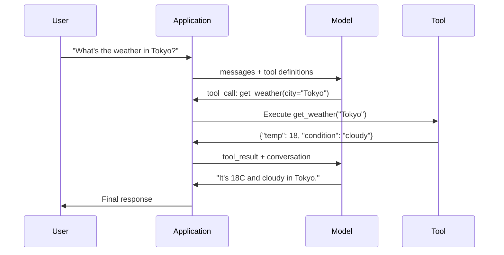

# Llamadas de funciones y uso de herramientas

> Los LLM no pueden hacer nada. Generan mensajes de texto. Esa es toda la capacidad. No pueden comprobar el clima, consultar una base de datos, enviar un correo electrónico, ejecutar un código o leer un archivo. Cada "agente de IA" que hayas visto es un LLM generando JSON que dice a qué función llamar y luego tu código realmente lo llama. El modelo es el cerebro. Las herramientas son las manos. La llamada de la función es el sistema nervioso que las conecta.

**Type:** Build
**Languages:** Python
**Prerequisites:** Phase 11 Lesson 03 (Structured Outputs)
**Time:** ~75 minutes
**Related:**Fase 11 · 14 (Modelo de Protocolo de Contexto)  cuando una herramienta se comparte entre hosts, se graduan de la llamada de funciones en línea a un servidor MCP. Esta lección cubre el caso en línea; MCP cubre el caso de protocolo.

## Objetivos de aprendizaje

- Implementar un bucle de llamadas de funciones: definir esquemas de herramientas, analizar el JSON de llamadas de herramientas del modelo, ejecutar funciones y devolver resultados
- Esquemas de herramientas de diseño con descripciones claras y parámetros tipografados que el modelo pueda invocar confiablemente
- Construir un bucle de agente de múltiples vueltas que enlace múltiples llamadas de función para responder consultas complejas
- Función de manejo que llama casos de borde: llamadas paralelas a herramientas, propagación de errores y prevención de bucles de herramientas infinitos

## El problema

Construye un chatbot y un usuario pregunta: "¿Cuál es el tiempo en Tokio ahora?"

El modelo responde: "No tengo acceso a datos meteorológicos en tiempo real, pero según la estación, es probable que Tokio esté alrededor de 15 grados centígrados... "

Es una alucinación vestida de una declaración de responsabilidad. El modelo no sabe el tiempo. Nunca lo hará. El tiempo cambia cada hora. Los datos de entrenamiento del modelo son de meses.

La respuesta correcta requiere llamar a la API OpenWeatherMap, obtener la temperatura actual y devolver el número real. El modelo no puede llamar a las API. Su código puede. La pieza que falta: un protocolo estructurado que permite al modelo decir "Necesito llamar a la API meteorológica con estos argumentos" y permite que su código la ejecute y devuelva el resultado.

El modelo de llamadas de función. El modelo de salida estructurado JSON que describe qué función para invocar con qué argumentos. Su aplicación ejecuta la función. El resultado vuelve a la conversación. El modelo utiliza el resultado para producir su respuesta final.

Sin la llamada de la función, LLM son enciclopedias.

## El concepto

### La función que llama el bucle

Cada interacción de uso de herramientas sigue el mismo ciclo de 5 pasos.



Paso 1: el usuario envía un mensaje. Paso 2: el modelo recibe el mensaje junto con las definiciones de herramientas (Esquema JSON que describe las funciones disponibles). Paso 3: en lugar de responder con texto, el modelo emite una llamada de herramienta, un objeto JSON estructurado con el nombre de la función y los argumentos. Paso 4: su código ejecuta la función y captura el resultado. Paso 5: el resultado vuelve al modelo, que ahora tiene datos reales para producir su respuesta final.

El modelo nunca ejecuta nada, sólo decide qué llamar y con qué argumentos.

### Definiciones de herramientas: el contrato de esquema JSON

Cada herramienta está definida por un esquema JSON que le dice al modelo lo que hace la función, qué argumentos necesita y qué tipos deben ser esos argumentos.

```json
{
  "type": "function",
  "function": {
    "name": "get_weather",
    "description": "Get current weather for a city. Returns temperature in Celsius and conditions.",
    "parameters": {
      "type": "object",
      "properties": {
        "city": {
          "type": "string",
          "description": "City name, e.g. 'Tokyo' or 'San Francisco'"
        },
        "units": {
          "type": "string",
          "enum": ["celsius", "fahrenheit"],
          "description": "Temperature units"
        }
      },
      "required": ["city"]
    }
  }
}
```

El `description`El modelo los lee para decidir cuándo y cómo usar la herramienta. Una descripción vaga como "tiene tiempo" produce una selección de herramientas peor que "Obtenga el tiempo actual para una ciudad. Retorna la temperatura en Celsius y condiciones".

### Comparación de proveedores

Cada proveedor principal admite llamadas de funciones, pero la superficie de la API es diferente.

| Provider | API Parameter | Tool Call Format | Parallel Calls | Forced Calling |
|----------|--------------|-----------------|---------------|----------------|
| OpenAI (GPT-5, o4) | `tools` | `tool_calls[].function` | Yes (multiple per turn) | `tool_choice="required"` |
| Anthropic (Claude 4.6/4.7) | `tools` | `content[].type="tool_use"` | Yes (multiple blocks) | `tool_choice={"type":"any"}` |
| Google (Gemini 3) | `function_declarations` | `functionCall` | Yes | `function_calling_config` |
| Open-weight (Llama 4, Qwen3, DeepSeek-V3) | Native `tools` on Llama 4; Hermes or ChatML on others | Mixed | Model-dependent | Prompt-based or `tool_choice` if supported |

Para 2026, los tres proveedores cerrados se han convergido en formatos basados en JSON-Schema casi idénticos.`tools`El formato Hermes (NousResearch) es el más común para los temas finos de terceros. Para las herramientas compartidas entre hosts, prefiere MCP (Fase 11 · 14) sobre la llamada de funciones en línea  el servidor es el mismo para todos ellos.

### Elegir las herramientas: automáticas, requeridas, específicas

Tú controlas cuando el modelo usa herramientas.

**Auto**(por defecto): el modelo decide si llama a una herramienta o responde directamente. "¿Qué es 2 + 2?" - responde directamente. "Cuál es el tiempo?" - llama a la herramienta.

**Required**El modelo debe llamar al menos a una herramienta. Utilice esto cuando sepa que la intención del usuario requiere una herramienta.

**Specific function**: obligar al modelo a llamar a una función particular. `tool_choice={"type":"function", "function": {"name": "get_weather"}}`Se puede usar para el enrutamiento cuando la lógica de aguas arriba ya determina qué herramienta es necesaria.

### Llamadas para funciones paralelas

GPT-4o y Claude pueden llamar a múltiples funciones en un solo giro. Un usuario pregunta: "¿Cuál es el tiempo en Tokio y Nueva York?" El modelo emite dos llamadas de herramienta simultáneamente:

```json
[
  {"name": "get_weather", "arguments": {"city": "Tokyo"}},
  {"name": "get_weather", "arguments": {"city": "New York"}}
]
```

Su código ejecuta ambos (idealmente simultáneamente), devuelve ambos resultados y el modelo sintetiza una sola respuesta. Esto reduce las viajes de ida y vuelta de 2 a 1. Para los agentes con 5-10 llamadas de herramientas por consulta, las llamadas paralelas reducen la latencia en 60-80%.

### Las salidas estructuradas vs. llamadas de función

La lección 03 abarcaba las salidas estructuradas.

**Structured outputs**El resultado es el producto final. Ejemplo: extraer información del producto de un texto como `{name, price, in_stock}`¿ Qué ?

**Function calling**El modelo declara la intención de ejecutar una acción.`get_weather(city="Tokyo")`-- el modelo está solicitando una acción, no produciendo la respuesta final.

Utilice salidas estructuradas cuando desee extraer datos. Utilice llamadas de funciones cuando desee que el modelo interactúe con sistemas externos.

### Seguridad: las reglas no negociables

La llamada de funciones es la capacidad más peligrosa que puedes dar a un LLM. El modelo elige qué ejecutar. Si tu conjunto de herramientas incluye consultas de base de datos, el modelo construye las consultas. Si incluye comandos shell, el modelo las escribe.

**Rule 1: Never pass model-generated SQL directly to a database.**El modelo puede y generará DROP TABLE, inyecciones UNION o consultas que devuelven cada fila. Siempre parametrizar. Siempre validar. Siempre utilizar una lista de permitidos de operaciones.

**Rule 2: Allowlist functions.**El modelo sólo puede llamar a las funciones que usted define explícitamente. Nunca construya una herramienta genérica "execute any function by name". Si tiene 50 funciones internas, exponga solo las 5 que el usuario necesita.

**Rule 3: Validate arguments.**El modelo podría pasar por un nombre de ciudad de `"; DROP TABLE users; --"`Validar todos los argumentos contra los tipos, rangos y formatos esperados antes de la ejecución.

**Rule 4: Sanitize tool results.**Si una herramienta devuelve datos sensibles (claves API, PII, errores internos), filtrelos antes de enviarlos de nuevo al modelo.

**Rule 5: Rate limit tool calls.**Un modelo en un bucle puede llamar a las herramientas cientos de veces. Establezca un máximo (10-20 llamadas por conversación es razonable). Rompa bucles infinitos.

### Tratamiento de errores

Las herramientas fallan, las API se detienen, las bases de datos se desactivan, los archivos no existen, el modelo necesita saber cuándo falla una herramienta y por qué.

Regresar errores como resultados de herramientas estructuradas, no excepciones:

```json
{
  "error": true,
  "message": "City 'Toky' not found. Did you mean 'Tokyo'?",
  "code": "CITY_NOT_FOUND"
}
```

Los modelos son buenos en autocorregirse de mensajes de error estructurados. Son mal en recuperarse de respuestas vacías o errores genéricos de "algo salió mal".

### MCP: Modelo de protocolo de contexto

MCP es el estándar abierto de Anthropic para la interoperabilidad de herramientas. En lugar de que cada aplicación defina sus propias herramientas, MCP proporciona un protocolo universal: las herramientas son servidas por servidores MCP, consumidas por clientes MCP (como Claude Code, Cursor o su aplicación).

Un servidor MCP puede exponer herramientas a cualquier cliente compatible. Un servidor MCP Postgres da acceso a cualquier base de datos de agentes compatible con MCP. Un servidor MCP GitHub da acceso al repositorio de cualquier agente. Las herramientas se definen una vez, se utilizan en todas partes.

MCP es para llamar a la función que HTTP es a la red. Estandariza la capa de transporte para que las herramientas se vuelvan portátiles.

```figure
mx-tool-call-loop
```

## Construye el mismo

### Paso 1: Definir el registro de herramientas

Construir un registro que almacene las definiciones de herramientas y sus implementaciones. Cada herramienta tiene una definición de JSON Schema (lo que el modelo ve) y una función Python (lo que su código ejecuta).

```python
import json
import math
import time
import hashlib


TOOL_REGISTRY = {}


def register_tool(name, description, parameters, function):
    TOOL_REGISTRY[name] = {
        "definition": {
            "type": "function",
            "function": {
                "name": name,
                "description": description,
                "parameters": parameters,
            },
        },
        "function": function,
    }
```

### Paso 2: Implementar 5 herramientas

Construye una calculadora, búsqueda del tiempo, simulador de búsqueda en la web, lector de archivos y ejecutor de código.

```python
def calculator(expression, precision=2):
    allowed = set("0123456789+-*/.() ")
    if not all(c in allowed for c in expression):
        return {"error": True, "message": f"Invalid characters in expression: {expression}"}
    try:
        result = eval(expression, {"__builtins__": {}}, {"math": math})
        return {"result": round(float(result), precision), "expression": expression}
    except Exception as e:
        return {"error": True, "message": str(e)}


WEATHER_DB = {
    "tokyo": {"temp_c": 18, "condition": "cloudy", "humidity": 72, "wind_kph": 14},
    "new york": {"temp_c": 22, "condition": "sunny", "humidity": 45, "wind_kph": 8},
    "london": {"temp_c": 12, "condition": "rainy", "humidity": 88, "wind_kph": 22},
    "san francisco": {"temp_c": 16, "condition": "foggy", "humidity": 80, "wind_kph": 18},
    "sydney": {"temp_c": 25, "condition": "sunny", "humidity": 55, "wind_kph": 10},
}


def get_weather(city, units="celsius"):
    key = city.lower().strip()
    if key not in WEATHER_DB:
        suggestions = [c for c in WEATHER_DB if c.startswith(key[:3])]
        return {
            "error": True,
            "message": f"City '{city}' not found.",
            "suggestions": suggestions,
            "code": "CITY_NOT_FOUND",
        }
    data = WEATHER_DB[key].copy()
    if units == "fahrenheit":
        data["temp_f"] = round(data["temp_c"] * 9 / 5 + 32, 1)
        del data["temp_c"]
    data["city"] = city
    return data


SEARCH_DB = {
    "python function calling": [
        {"title": "OpenAI Function Calling Guide", "url": "https://platform.openai.com/docs/guides/function-calling", "snippet": "Learn how to connect LLMs to external tools."},
        {"title": "Anthropic Tool Use", "url": "https://docs.anthropic.com/en/docs/tool-use", "snippet": "Claude can interact with external tools and APIs."},
    ],
    "MCP protocol": [
        {"title": "Model Context Protocol", "url": "https://modelcontextprotocol.io", "snippet": "An open standard for connecting AI models to data sources."},
    ],
    "weather API": [
        {"title": "OpenWeatherMap API", "url": "https://openweathermap.org/api", "snippet": "Free weather API with current, forecast, and historical data."},
    ],
}


def web_search(query, max_results=3):
    key = query.lower().strip()
    for db_key, results in SEARCH_DB.items():
        if db_key in key or key in db_key:
            return {"query": query, "results": results[:max_results], "total": len(results)}
    return {"query": query, "results": [], "total": 0}


FILE_SYSTEM = {
    "data/config.json": '{"model": "gpt-4o", "temperature": 0.7, "max_tokens": 4096}',
    "data/users.csv": "name,email,role\nAlice,alice@example.com,admin\nBob,bob@example.com,user",
    "README.md": "# My Project\nA tool-use agent built from scratch.",
}


def read_file(path):
    if ".." in path or path.startswith("/"):
        return {"error": True, "message": "Path traversal not allowed.", "code": "FORBIDDEN"}
    if path not in FILE_SYSTEM:
        available = list(FILE_SYSTEM.keys())
        return {"error": True, "message": f"File '{path}' not found.", "available_files": available, "code": "NOT_FOUND"}
    content = FILE_SYSTEM[path]
    return {"path": path, "content": content, "size_bytes": len(content), "lines": content.count("\n") + 1}


def run_code(code, language="python"):
    if language != "python":
        return {"error": True, "message": f"Language '{language}' not supported. Only 'python' is available."}
    forbidden = ["import os", "import sys", "import subprocess", "exec(", "eval(", "__import__", "open("]
    for pattern in forbidden:
        if pattern in code:
            return {"error": True, "message": f"Forbidden operation: {pattern}", "code": "SECURITY_VIOLATION"}
    try:
        local_vars = {}
        exec(code, {"__builtins__": {"print": print, "range": range, "len": len, "str": str, "int": int, "float": float, "list": list, "dict": dict, "sum": sum, "min": min, "max": max, "abs": abs, "round": round, "sorted": sorted, "enumerate": enumerate, "zip": zip, "map": map, "filter": filter, "math": math}}, local_vars)
        result = local_vars.get("result", None)
        return {"success": True, "result": result, "variables": {k: str(v) for k, v in local_vars.items() if not k.startswith("_")}}
    except Exception as e:
        return {"error": True, "message": f"{type(e).__name__}: {e}"}
```

### Paso 3: Registre todas las herramientas

```python
def register_all_tools():
    register_tool(
        "calculator", "Evaluate a mathematical expression. Supports +, -, *, /, parentheses, and decimals. Returns the numeric result.",
        {"type": "object", "properties": {"expression": {"type": "string", "description": "Math expression, e.g. '(10 + 5) * 3'"}, "precision": {"type": "integer", "description": "Decimal places in result", "default": 2}}, "required": ["expression"]},
        calculator,
    )
    register_tool(
        "get_weather", "Get current weather for a city. Returns temperature, condition, humidity, and wind speed.",
        {"type": "object", "properties": {"city": {"type": "string", "description": "City name, e.g. 'Tokyo' or 'San Francisco'"}, "units": {"type": "string", "enum": ["celsius", "fahrenheit"], "description": "Temperature units, defaults to celsius"}}, "required": ["city"]},
        get_weather,
    )
    register_tool(
        "web_search", "Search the web for information. Returns a list of results with title, URL, and snippet.",
        {"type": "object", "properties": {"query": {"type": "string", "description": "Search query"}, "max_results": {"type": "integer", "description": "Maximum results to return", "default": 3}}, "required": ["query"]},
        web_search,
    )
    register_tool(
        "read_file", "Read the contents of a file. Returns the file content, size, and line count.",
        {"type": "object", "properties": {"path": {"type": "string", "description": "Relative file path, e.g. 'data/config.json'"}}, "required": ["path"]},
        read_file,
    )
    register_tool(
        "run_code", "Execute Python code in a sandboxed environment. Set a 'result' variable to return output.",
        {"type": "object", "properties": {"code": {"type": "string", "description": "Python code to execute"}, "language": {"type": "string", "enum": ["python"], "description": "Programming language"}}, "required": ["code"]},
        run_code,
    )
```

### Paso 4: Construye la función llamada bucle

Este es el motor central. Simula el modelo decidiendo a qué herramienta llamar, ejecuta la herramienta y alimenta los resultados.

```python
def simulate_model_decision(user_message, tools, conversation_history):
    msg = user_message.lower()

    if any(word in msg for word in ["weather", "temperature", "forecast"]):
        cities = []
        for city in WEATHER_DB:
            if city in msg:
                cities.append(city)
        if not cities:
            for word in msg.split():
                if word.capitalize() in [c.title() for c in WEATHER_DB]:
                    cities.append(word)
        if not cities:
            cities = ["tokyo"]
        calls = []
        for city in cities:
            calls.append({"name": "get_weather", "arguments": {"city": city.title()}})
        return calls

    if any(word in msg for word in ["calculate", "compute", "math", "what is", "how much"]):
        for token in msg.split():
            if any(c in token for c in "+-*/"):
                return [{"name": "calculator", "arguments": {"expression": token}}]
        if "+" in msg or "-" in msg or "*" in msg or "/" in msg:
            expr = "".join(c for c in msg if c in "0123456789+-*/.() ")
            if expr.strip():
                return [{"name": "calculator", "arguments": {"expression": expr.strip()}}]
        return [{"name": "calculator", "arguments": {"expression": "0"}}]

    if any(word in msg for word in ["search", "find", "look up", "google"]):
        query = msg.replace("search for", "").replace("look up", "").replace("find", "").strip()
        return [{"name": "web_search", "arguments": {"query": query}}]

    if any(word in msg for word in ["read", "file", "open", "cat", "show"]):
        for path in FILE_SYSTEM:
            if path.split("/")[-1].split(".")[0] in msg:
                return [{"name": "read_file", "arguments": {"path": path}}]
        return [{"name": "read_file", "arguments": {"path": "README.md"}}]

    if any(word in msg for word in ["run", "execute", "code", "python"]):
        return [{"name": "run_code", "arguments": {"code": "result = 'Hello from the sandbox!'", "language": "python"}}]

    return []


def execute_tool_call(tool_call):
    name = tool_call["name"]
    args = tool_call["arguments"]

    if name not in TOOL_REGISTRY:
        return {"error": True, "message": f"Unknown tool: {name}", "code": "UNKNOWN_TOOL"}

    tool = TOOL_REGISTRY[name]
    func = tool["function"]
    start = time.time()

    try:
        result = func(**args)
    except TypeError as e:
        result = {"error": True, "message": f"Invalid arguments: {e}"}

    elapsed_ms = round((time.time() - start) * 1000, 2)
    return {"tool": name, "result": result, "execution_time_ms": elapsed_ms}


def run_function_calling_loop(user_message, max_iterations=5):
    conversation = [{"role": "user", "content": user_message}]
    tool_definitions = [t["definition"] for t in TOOL_REGISTRY.values()]
    all_tool_results = []

    for iteration in range(max_iterations):
        tool_calls = simulate_model_decision(user_message, tool_definitions, conversation)

        if not tool_calls:
            break

        results = []
        for call in tool_calls:
            result = execute_tool_call(call)
            results.append(result)

        conversation.append({"role": "assistant", "content": None, "tool_calls": tool_calls})

        for result in results:
            conversation.append({"role": "tool", "content": json.dumps(result["result"]), "tool_name": result["tool"]})

        all_tool_results.extend(results)
        break

    return {"conversation": conversation, "tool_results": all_tool_results, "iterations": iteration + 1 if tool_calls else 0}
```

### Paso 5: Validación de los argumentos

Construir un validador que compruebe los argumentos de llamada de herramienta contra el esquema JSON antes de la ejecución.

```python
def validate_tool_arguments(tool_name, arguments):
    if tool_name not in TOOL_REGISTRY:
        return [f"Unknown tool: {tool_name}"]

    schema = TOOL_REGISTRY[tool_name]["definition"]["function"]["parameters"]
    errors = []

    if not isinstance(arguments, dict):
        return [f"Arguments must be an object, got {type(arguments).__name__}"]

    for required_field in schema.get("required", []):
        if required_field not in arguments:
            errors.append(f"Missing required argument: {required_field}")

    properties = schema.get("properties", {})
    for arg_name, arg_value in arguments.items():
        if arg_name not in properties:
            errors.append(f"Unknown argument: {arg_name}")
            continue

        prop_schema = properties[arg_name]
        expected_type = prop_schema.get("type")

        type_checks = {"string": str, "integer": int, "number": (int, float), "boolean": bool, "array": list, "object": dict}
        if expected_type in type_checks:
            if not isinstance(arg_value, type_checks[expected_type]):
                errors.append(f"Argument '{arg_name}': expected {expected_type}, got {type(arg_value).__name__}")

        if "enum" in prop_schema and arg_value not in prop_schema["enum"]:
            errors.append(f"Argument '{arg_name}': '{arg_value}' not in {prop_schema['enum']}")

    return errors
```

### Paso 6: ejecutar la demostración

```python
def run_demo():
    register_all_tools()

    print("=" * 60)
    print("  Function Calling & Tool Use Demo")
    print("=" * 60)

    print("\n--- Registered Tools ---")
    for name, tool in TOOL_REGISTRY.items():
        desc = tool["definition"]["function"]["description"][:60]
        params = list(tool["definition"]["function"]["parameters"].get("properties", {}).keys())
        print(f"  {name}: {desc}...")
        print(f"    params: {params}")

    print(f"\n--- Argument Validation ---")
    validation_tests = [
        ("get_weather", {"city": "Tokyo"}, "Valid call"),
        ("get_weather", {}, "Missing required arg"),
        ("get_weather", {"city": "Tokyo", "units": "kelvin"}, "Invalid enum value"),
        ("calculator", {"expression": 123}, "Wrong type (int for string)"),
        ("unknown_tool", {"x": 1}, "Unknown tool"),
    ]
    for tool_name, args, label in validation_tests:
        errors = validate_tool_arguments(tool_name, args)
        status = "VALID" if not errors else f"ERRORS: {errors}"
        print(f"  {label}: {status}")

    print(f"\n--- Tool Execution ---")
    direct_tests = [
        {"name": "calculator", "arguments": {"expression": "(10 + 5) * 3 / 2"}},
        {"name": "get_weather", "arguments": {"city": "Tokyo"}},
        {"name": "get_weather", "arguments": {"city": "Mars"}},
        {"name": "web_search", "arguments": {"query": "python function calling"}},
        {"name": "read_file", "arguments": {"path": "data/config.json"}},
        {"name": "read_file", "arguments": {"path": "../etc/passwd"}},
        {"name": "run_code", "arguments": {"code": "result = sum(range(1, 101))"}},
        {"name": "run_code", "arguments": {"code": "import os; os.system('rm -rf /')"}},
    ]
    for call in direct_tests:
        result = execute_tool_call(call)
        print(f"\n  {call['name']}({json.dumps(call['arguments'])})")
        print(f"    -> {json.dumps(result['result'], indent=None)[:100]}")
        print(f"    time: {result['execution_time_ms']}ms")

    print(f"\n--- Full Function Calling Loop ---")
    test_queries = [
        "What's the weather in Tokyo?",
        "Calculate (100 + 250) * 0.15",
        "Search for MCP protocol",
        "Read the config file",
        "Run some Python code",
        "Tell me a joke",
    ]
    for query in test_queries:
        print(f"\n  User: {query}")
        result = run_function_calling_loop(query)
        if result["tool_results"]:
            for tr in result["tool_results"]:
                print(f"    Tool: {tr['tool']} ({tr['execution_time_ms']}ms)")
                print(f"    Result: {json.dumps(tr['result'], indent=None)[:90]}")
        else:
            print(f"    [No tool called -- direct response]")
        print(f"    Iterations: {result['iterations']}")

    print(f"\n--- Parallel Tool Calls ---")
    multi_city_query = "What's the weather in tokyo and london?"
    print(f"  User: {multi_city_query}")
    result = run_function_calling_loop(multi_city_query)
    print(f"  Tool calls made: {len(result['tool_results'])}")
    for tr in result["tool_results"]:
        city = tr["result"].get("city", "unknown")
        temp = tr["result"].get("temp_c", "N/A")
        print(f"    {city}: {temp}C, {tr['result'].get('condition', 'N/A')}")

    print(f"\n--- Security Checks ---")
    security_tests = [
        ("read_file", {"path": "../../etc/passwd"}),
        ("run_code", {"code": "import subprocess; subprocess.run(['ls'])"}),
        ("calculator", {"expression": "__import__('os').system('ls')"}),
    ]
    for tool_name, args in security_tests:
        result = execute_tool_call({"name": tool_name, "arguments": args})
        blocked = result["result"].get("error", False)
        print(f"  {tool_name}({list(args.values())[0][:40]}): {'BLOCKED' if blocked else 'ALLOWED'}")
```

## Usalo

### Llamada de la función OpenAI

```python
# from openai import OpenAI
#
# client = OpenAI()
#
# tools = [{
#     "type": "function",
#     "function": {
#         "name": "get_weather",
#         "description": "Get current weather for a city",
#         "parameters": {
#             "type": "object",
#             "properties": {
#                 "city": {"type": "string"},
#                 "units": {"type": "string", "enum": ["celsius", "fahrenheit"]}
#             },
#             "required": ["city"]
#         }
#     }
# }]
#
# response = client.chat.completions.create(
#     model="gpt-4o",
#     messages=[{"role": "user", "content": "Weather in Tokyo?"}],
#     tools=tools,
#     tool_choice="auto",
# )
#
# tool_call = response.choices[0].message.tool_calls[0]
# args = json.loads(tool_call.function.arguments)
# result = get_weather(**args)
#
# final = client.chat.completions.create(
#     model="gpt-4o",
#     messages=[
#         {"role": "user", "content": "Weather in Tokyo?"},
#         response.choices[0].message,
#         {"role": "tool", "tool_call_id": tool_call.id, "content": json.dumps(result)},
#     ],
# )
# print(final.choices[0].message.content)
```

OpenAI devuelve las llamadas de la herramienta como `response.choices[0].message.tool_calls`Cada llamada tiene un número .`id`el modelo utiliza esta identificación para hacer coincidir los resultados con las llamadas. GPT-4o puede devolver múltiples llamadas de herramientas en una sola respuesta - iteración y ejecución de todas ellas.

### El uso de herramientas antropológicas

```python
# import anthropic
#
# client = anthropic.Anthropic()
#
# response = client.messages.create(
#     model="claude-sonnet-5",
#     max_tokens=1024,
#     tools=[{
#         "name": "get_weather",
#         "description": "Get current weather for a city",
#         "input_schema": {
#             "type": "object",
#             "properties": {
#                 "city": {"type": "string"},
#                 "units": {"type": "string", "enum": ["celsius", "fahrenheit"]}
#             },
#             "required": ["city"]
#         }
#     }],
#     messages=[{"role": "user", "content": "Weather in Tokyo?"}],
# )
#
# tool_block = next(b for b in response.content if b.type == "tool_use")
# result = get_weather(**tool_block.input)
#
# final = client.messages.create(
#     model="claude-sonnet-5",
#     max_tokens=1024,
#     tools=[...],
#     messages=[
#         {"role": "user", "content": "Weather in Tokyo?"},
#         {"role": "assistant", "content": response.content},
#         {"role": "user", "content": [{"type": "tool_result", "tool_use_id": tool_block.id, "content": json.dumps(result)}]},
#     ],
# )
```

Antropic devuelve las llamadas de la herramienta como bloques de contenido con `type: "tool_use"`. El resultado de la herramienta entra en un mensaje del usuario con `type: "tool_result"`. Observe la diferencia clave: usos antropológicos `input_schema`para las definiciones de parámetros de herramientas, mientras que OpenAI utiliza `parameters`¿ Qué ?

### Integración de los PMP

```python
# MCP servers expose tools over a standardized protocol.
# Any MCP-compatible client can discover and call these tools.
#
# Example: connecting to a Postgres MCP server
#
# from mcp import ClientSession, StdioServerParameters
# from mcp.client.stdio import stdio_client
#
# server_params = StdioServerParameters(
#     command="npx",
#     args=["-y", "@modelcontextprotocol/server-postgres", "postgresql://localhost/mydb"],
# )
#
# async with stdio_client(server_params) as (read, write):
#     async with ClientSession(read, write) as session:
#         await session.initialize()
#         tools = await session.list_tools()
#         result = await session.call_tool("query", {"sql": "SELECT count(*) FROM users"})
```

MCP desacopla la implementación de herramientas del consumo de herramientas. El servidor Postgres conoce SQL. El servidor GitHub conoce la API. Su agente solo descubre y llama a las herramientas - no necesita código específico de proveedor para cada integración.

## Envío

Esta lección produce`outputs/prompt-tool-designer.md`-- una plantilla de solicitud reutilizable para diseñar definiciones de herramientas. Darle una descripción de lo que desea que haga una herramienta, y produce la definición completa de JSON Schema con descripciones, tipos y restricciones.

También produce `outputs/skill-function-calling-patterns.md`-- un marco de decisión para la implementación de funciones de llamada en producción, que cubra el diseño de herramientas, el manejo de errores, la seguridad y los patrones específicos del proveedor.

## Los ejercicios

1. **Add a 6th tool: database query.**Implemente una herramienta SQL simulada con una tabla en memoria. La herramienta acepta un nombre de tabla y condiciones de filtro (no SQL crudo). Valida que el nombre de tabla está en una lista de permisos y que los operadores de filtro están restringidos a `=`¿ Qué ?`>`¿ Qué ?`<`¿ Qué ?`>=`¿ Qué ?`<=`. Regresa las filas correspondientes como JSON.

2. **Implement retry with error feedback.**Cuando una llamada de herramienta falla (por ejemplo, la ciudad no se encuentra), envíe el mensaje de error de nuevo a la función de decisión del modelo y déjalo corregir sus argumentos.

3. **Build a multi-step agent.**Algunas consultas requieren llamadas de herramientas de cadena: "Lea el archivo de configuración y dime qué modelo está configurado, luego busca en la web el precio de ese modelo". Implemente un bucle que se ejecuta hasta que el modelo decida que no se necesitan más herramientas, pasando los resultados acumulados en cada paso de decisión. Limite a 10 iteraciones para evitar bucles infinitos.

4. **Measure tool selection accuracy.**Crea 30 consultas de prueba con nombres de herramientas esperados. ejecuta la función de decisión en las 30 y mide el porcentaje de tiempo que selecciona la herramienta correcta. Identifique qué consultas causan más confusión entre las herramientas.

5. **Implement tool call caching.**Si se llama la misma herramienta con argumentos idénticos dentro de 60 segundos, devuelva el resultado almacenado en caché en lugar de volver a ejecutarlo.`(tool_name, frozenset(args.items()))`Mide las tasas de caché en una conversación con 20 consultas.

## Términos clave

| Term | What people say | What it actually means |
|------|----------------|----------------------|
| Function calling | "Tool use" | The model outputs structured JSON describing a function to invoke with specific arguments -- your code executes it, not the model |
| Tool definition | "Function schema" | A JSON Schema object describing a tool's name, purpose, parameters, and types -- the model reads this to decide when and how to use the tool |
| Tool choice | "Calling mode" | Controls whether the model must call a tool (required), may call a tool (auto), or must call a specific tool (named) |
| Parallel calling | "Multi-tool" | The model outputs multiple tool calls in a single turn, reducing round trips -- GPT-4o and Claude both support this |
| Tool result | "Function output" | The return value from executing a tool, sent back to the model as a message so it can use real data in its response |
| Argument validation | "Input checking" | Verifying that model-generated arguments match the expected types, ranges, and constraints before executing the tool |
| MCP | "Tool protocol" | Model Context Protocol -- Anthropic's open standard for exposing tools via servers that any compatible client can discover and call |
| Agent loop | "ReAct loop" | The iterative cycle of model-decides-tool, code-executes-tool, result-feeds-back until the model has enough information to respond |
| Tool poisoning | "Prompt injection via tools" | An attack where tool results contain instructions that manipulate the model's behavior -- sanitize all tool outputs |
| Rate limiting | "Call budget" | Setting a maximum number of tool calls per conversation to prevent infinite loops and runaway API costs |

## Leer más

- [OpenAI Function Calling Guide](https://platform.openai.com/docs/guides/function-calling)-- la referencia definitiva para el uso de herramientas con GPT-4o, incluidas las llamadas paralelas, las llamadas forzadas y los argumentos estructurados
- [Anthropic Tool Use Guide](https://docs.anthropic.com/en/docs/tool-use)-- La aplicación de la herramienta de Claude utiliza con input_schema, respuestas multi-herramienta y configuración de herramienta_choice
- [Model Context Protocol Specification](https://modelcontextprotocol.io)-- el estándar abierto de interoperabilidad de herramientas en aplicaciones de IA, con arquitectura de servidor/cliente
- [Schick et al., 2023 -- "Toolformer: Language Models Can Teach Themselves to Use Tools"](https://arxiv.org/abs/2302.04761)-- el documento de base sobre la formación de los LLM para decidir cuándo y cómo llamar a las herramientas externas
- [Patil et al., 2023 -- "Gorilla: Large Language Model Connected with Massive APIs"](https://arxiv.org/abs/2305.15334)-- ajuste delgado de los LLM para llamadas precisas de API en 1.645 API con reducción de alucinaciones
- [Berkeley Function Calling Leaderboard](https://gorilla.cs.berkeley.edu/leaderboard.html)-- referencia en tiempo real comparando la función de llamada de precisión en GPT-4o, Claude, Gemini y modelos abiertos
- [Yao et al., "ReAct: Synergizing Reasoning and Acting in Language Models" (ICLR 2023)](https://arxiv.org/abs/2210.03629)-- el bucle de Pensamiento-Acción-Observación que es el bucle de agente externo alrededor de cada llamada de herramienta; donde termina esta lección, la Fase 14 comienza.
- [Anthropic — Building effective agents (Dec 2024)](https://www.anthropic.com/research/building-effective-agents)-- cinco patrones composibles (cadena de la rapidez, enrutamiento, paralelación, orquestación-trabajadores, evaluador-optimizador) construidos a partir de la primitiva de uso de herramientas únicas.
