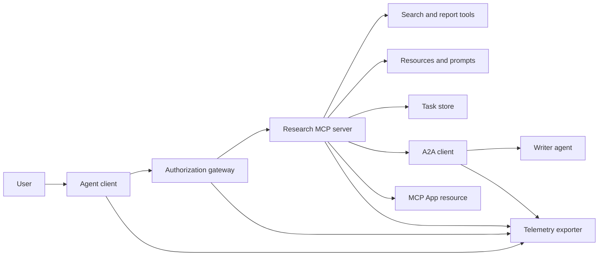
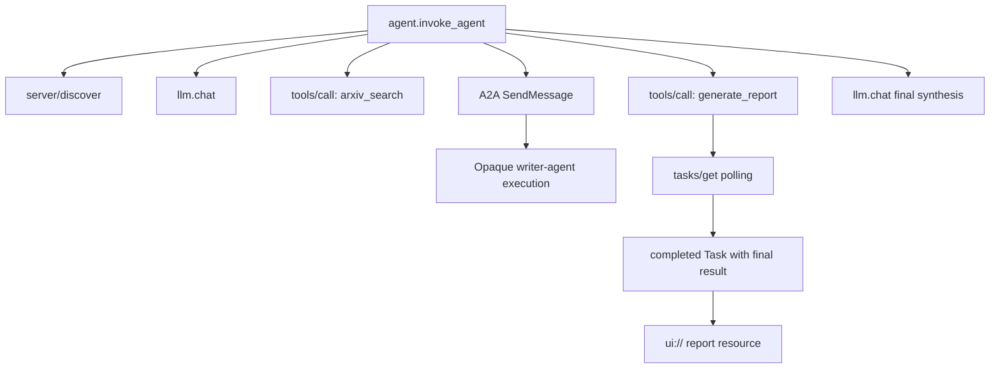
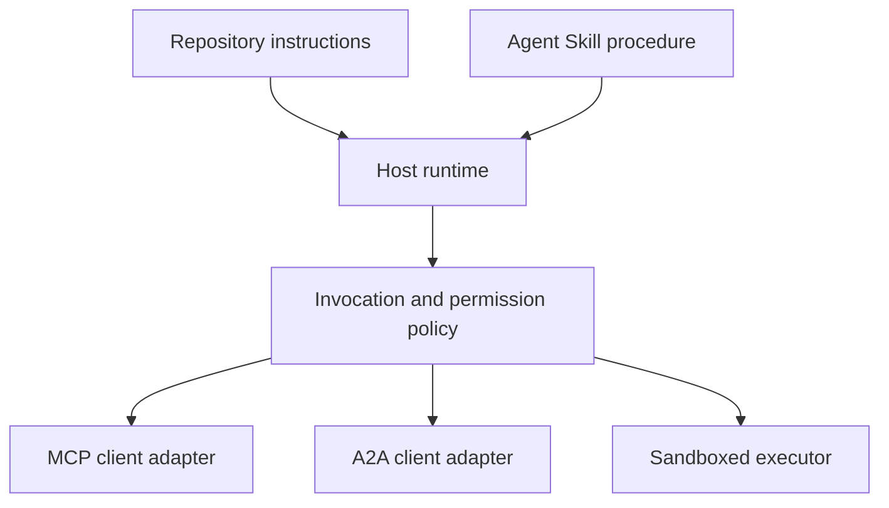

# Capstone: Ecosistema de herramientas sin estatus

> Un sistema de agente de producción es un conjunto de límites, no una pila de características. Esta piedra angular separa una simulación legible en el proceso de los clientes de protocolo, servidor de autorización, sandbox y exportador de telemetría que una implementación real aún necesita.

**Type:** Build
**Languages:** Python (stdlib, in-process simulation)
**Prerequisites:** Phase 13 · 01 through 22, using MCP revision `2026-07-28`
**Time:** ~120 minutes

## Objetivos de aprendizaje

- Componer llamadas de herramientas, resultados en forma de tarea, trabajo delegado, recursos de UI, política de autorización y registros de seguimiento en un solo flujo.
- Llevar la versión de protocolo, la identidad del cliente y las capacidades en cada solicitud de MCP en lugar de depender de una sesión de conexión.
- Descubra un servidor antes de usarlo y realice un largo trabajo a través de la extensión oficial de tareas.
- Distinguir una simulación en forma de protocolo de una implementación de MCP, A2A, OAuth o OpenTelemetry.
- Mapa de cada límite simulado en el componente de producción que debe sustituirlo.
- Mantenga .`AGENTS.md`, una habilidad de agente, adaptadores de tiempo de ejecución, herramientas y políticas de seguridad en sus funciones correctas.
- Explicar qué afirmaciones pueden verificarse a partir de la salida local y cuáles necesitan pruebas de integración en vivo.

## El problema

Diseñar un sistema de investigación e información. Un usuario pide documentos sobre los protocolos de agentes. El sistema busca un catálogo de papel, delega resumen, genera un informe, devuelve un recurso de interfaz de usuario y registra el camino a través del sistema.

Esa sentencia oculta varios contratos independientes:

- un esquema de herramientas orientado a un modelo;
- un envase de solicitud sin estatus y un contrato de descubrimiento del servidor;
- una decisión de entrada para el actor, el alcance y la identidad de la herramienta;
- un contrato de operación de larga duración;
- un protocolo de delegación;
- un puente entre el host y la aplicación;
- la propagación y exportación de rastros;
- un procedimiento operativo reutilizable.

`code/main.py`Mantenga esos límites visibles con funciones y diccionarios ordinarios de Python. No abre un transporte, se comunica con arXiv, no realiza OAuth, no llama a un servidor A2A, no hace renderizar una aplicación MCP o no exporta telemetría. Esto hace que el flujo de control sea fácil de inspeccionar sin presentar una simulación como un servicio conforme.

## El concepto

### Arquitectura de objetivo



La arquitectura es una composición conceptual de patrones de protocolo público.

### Traza del objetivo



En una implementación real, cada salto propaga el contexto de la pista. Los nombres y atributos de la pista deben seguir las convenciones semánticas de OpenTelemetry apoyadas por la versión de instrumentación elegida.

### Superficies de protocolo corriente

Utilice los nombres de métodos definidos por el protocolo actual, no los nombres recordados de un borrador anterior:

| Boundary | Current surface | What the capstone simulates |
|---|---|---|
| MCP discovery | Mandatory `server/discover` | A direct function returning versions, capabilities, and server identity |
| MCP request context | Version, capabilities, and client identity in every `params._meta` | Fresh request metadata passed to every simulated call |
| MCP tool call | `tools/call` | Direct Python function dispatch |
| MCP task polling | `io.modelcontextprotocol/tasks` with `tasks/get` | A working handle followed by a completed task carrying its final result |
| A2A delegation | `SendMessage` in gRPC and JSON-RPC; `POST /message:send` in HTTP+JSON | One nested span with no remote call or artificial delay |
| MCP App calling a server tool | `app.callServerTool({ name, arguments })` | An HTML string with no live bridge |
| OAuth authorization | Authorization server, protected-resource metadata, audience and scope validation | Static token lookup and scope membership |
| OpenTelemetry | SDK, propagator, exporter, and collector or backend | In-memory span dictionaries |

Los nombres de protocolo son solo la primera capa. Las pruebas de producción deben ejercer la serialización, fallos de autenticación, cancelación, tiempos de salida, retemplazos y compatibilidad de versiones en todo el cable real.

### El MCP sin estatus cambia el límite de integración

Revisión `2026-07-28`elimina las sesiones de protocolo y el `initialize`- ¿ Qué ?`notifications/initialized`Apetece la mano.`Mcp-Session-Id`Cada solicitud tiene estos espacios de nombres .`_meta`campos:

```json
{
  "io.modelcontextprotocol/protocolVersion": "2026-07-28",
  "io.modelcontextprotocol/clientCapabilities": {
    "extensions": {
      "io.modelcontextprotocol/tasks": {}
    }
  },
  "io.modelcontextprotocol/clientInfo": {
    "name": "capstone-client",
    "version": "1.0.0"
  }
}
```

El servidor debe implementar `server/discover`. Uso de resultados ordinarios `resultType: "complete"`; un manil de tarea utiliza `resultType: "task"`Cada resultado debe identificar el servidor en `_meta.io.modelcontextprotocol/serverInfo`¿ Qué ?

La extensión de tareas tiene `tasks/get`¿ Qué ?`tasks/update`, y `tasks/cancel`Una herramienta puede regresar primero .`resultType: "task"`¿ Qué es ?`tasks/get`El mismo regresa.`resultType: "complete"`, y el completado `Task`El resultado final de la investigación es el resultado final.`tasks/result`y `tasks/list`Los métodos no forman parte de la extensión actual.`io.modelcontextprotocol/tasks`En la misma solicitud que puede recibir un manejo de tarea. Si no lo hace, el servidor devuelve `-32021`con`requiredCapabilities`en forma de objeto de capacidad de cliente faltante, incluido `extensions.io.modelcontextprotocol/tasks`¿ Qué ?

### Posición de seguridad

El despliegue previsto utiliza la defensa en profundidad:

- Autorización de OAuth con PKCE cuando el tipo de cliente lo requiera;
- la vinculación de recursos y audiencias para tokens de acceso emitidos;
- la puerta de enlace RBAC que compruebe la herramienta y el alcance solicitados;
- las credenciales upstream que se conserven fuera del contexto visible del modelo;
- un manifiesto de descripción de las herramientas fijado o revisado;
- una revisión de la regla de dos en relación con entradas no fiables, datos sensibles y acciones consecuentes;
- una caja de arena de ejecución cuyo sistema de archivos, proceso, red, credenciales y límites de recursos se imponen fuera de la habilidad.

La demostración sólo implementa fichas estáticas, comprobantes de alcance y hashes de descripción. Es útil para el flujo de políticas, no para la validación de seguridad.

### Las habilidades son procedimientos, no transporte

Una habilidad de agente puede decir al tiempo de ejecución cómo realizar el flujo de trabajo de investigación, qué herramientas contrata esperar, qué evidencia guardar y cuándo detener. No puede hacer que exista un servidor MCP, establecer compatibilidad A2A, conceder ámbitos de trabajo o crear una caja de arena.



Envía el directorio completo de habilidades cuando el procedimiento hace referencia a archivos de acompañamiento. El artefacto plano en esta piedra angular más antigua es un plan de curso, no evidencia de que un anfitrión conserva un paquete portátil.

### Los metadatos del artefacto del curso son un adaptador local

El catálogo del curso y el instalador reconocen archivos planos con nombres `skill-*.md`, pero es una convención de repositorio en lugar del contrato portátil del paquete de habilidades de agente. su parser frontmatter mínimo sólo lee teclas de nivel superior. esta lección mantiene los campos de identidad portátiles y los campos de catálogo de cursos en el mismo nivel:

```yaml
---
name: ecosystem-blueprint
description: Produce a full Phase 13 ecosystem architecture for a product need.
version: "1.0.0"
phase: "13"
lesson: "23"
tags: [mcp, capstone, ecosystem, architecture, a2a, otel]
---
```

`name`y `description`son los campos de identidad portátiles. `version`¿ Qué ?`phase`¿ Qué ?`lesson`, y `tags`Las aplicaciones de programación de cursos de formación y de formación de estudiantes de formación en el curso de formación de formación de formación de formación de formación de formación de formación de formación de formación de formación de formación de formación de formación de formación de formación de formación de formación de formación de formación de formación de formación de formación de formación de formación de formación de formación de formación de formación de formación de formación de formación de formación de formación de formación de formación de formación de formación de formación de formación de formación de formación de formación de formación de formación de formación de formación de formación de formación de formación de formación de formación de formación de formación de formación de formación de formación de formación de formación de formación de formación de formación de formación de formación de formación de formación de formación de formación de formación de formación de formación de formación de formación de formación de formación de formación de formación de formación de formación de formación de formación de formación de formación de formación de formación de formación de formación de formación de formación de formación de formación de formación de formación de formación de formación de formación de formación de formación de formación de formación de formación de formación de formación de formación de formación de formación de formación de formación de formación de formación de formación de formación de formación de formación de formación de formación de formación de formación de formación de formación de formación de formación de formación de formación de formación de formación de formación de formación de formación de formación de formación de formación de formación de formación de formación de formación de formación de formación de formación de formación de formación de formación de formación de formación de formación de formación de formación de formación de formación de formación de formación de formación de formación de formación de formación de formación de formación de formación de formación de formación de formación de formación de formación de formación de formación de formación de formación de formación de formación de formación de formación de formación de formación de formación de formación de formación de formación de formación de formación de formación de formación en formación en formación en formación en formación en formación en formación en formación en formación en formación en formación en formación en formación en formación en formación en formación en formación en formación en formación en formación en formación en formación en formación en formación en formación en formación en formación en formación en formación en formación en formación en formación en formación en formación en formación en formación en formación en formación en formación en formación en formación en formación en formación en formación en formación en formación en formación en formación en formación en formación en formación en formación en formación en formación en formación en formación en formación en formación en formación en formación en formación en formación en formación en formación en formación en formación`tags`como una lista en línea así `--tag capstone`puede coincidir con ella.

Una habilidad portátil de directorio puede utilizar la opción `metadata`mapa para datos de extensión de cadena. Eso no hace `metadata`Si este archivo plano anida`version`o `tags`abajo `metadata`El parser mínimo omite esas teclas incrustadas, el catálogo registra una versión vacía y el filtro de etiquetas no puede encontrar el artefacto.

### Simulación frente a producción

| Layer | `code/main.py` | Production replacement | Required evidence |
|---|---|---|---|
| Discovery | `server_discover()` plus static `TOOLS` | `server/discover` followed by cache-aware `tools/list` | Wire transcript, deterministic order, and schema validation |
| Authentication | Token-keyed dictionary | OAuth authorization and resource server validation | Issuer, audience, scope, expiry, and failure tests |
| Authorization | Scope membership | Gateway policy bound to actor, tool, target, and tenant | Allow and deny audit cases |
| Search | Static paper fixtures | Search API or MCP server | Source provenance, ranking, and error tests |
| Tasks | Local handle plus immediate `tasks/get` | Durable `io.modelcontextprotocol/tasks` store with `tasks/get`, `tasks/update`, `tasks/cancel`, and TTL | State-transition, input, cancellation, and recovery tests |
| Delegation | Sleep plus nested span | A2A client and remote Agent Card | Contract, timeout, retry, and opacity tests |
| App | HTML string and URI | MCP Apps resource and `App` bridge | CSP, permissions, tool-call, and browser tests |
| Telemetry | In-memory list | OTel SDK and exporter | Collector receipt and trace-parent assertions |
| Sandbox | None | Host-enforced isolated executor | Escape, egress, secret, and resource-limit tests |

Esta tabla es el límite de transmisión. Una ejecución local verde valida la simulación sólo.

### Mapa de la fase 13

| Lessons | Contribution |
|---|---|
| 01-05 | Tool interfaces, calls, schemas, structured results, and deterministic validation |
| 06-14 | Stateless MCP request envelopes, discovery, transports, resources, prompts, extensions, and Apps |
| 15-18 | Poisoning defenses, OAuth, gateways, registries, and production authentication |
| 19 | A2A message and task delegation |
| 20 | OpenTelemetry GenAI trace design |
| 21 | Model-provider routing |
| 22 | Portable skill contract and runtime boundary |

```figure
t3-capstone-chain
```

## Construye el mismo

Ejecutar el arnés en proceso:

```bash
cd phases/13-tools-and-protocols/23-capstone-tool-ecosystem
python3 code/main.py
```

Inspectar cinco cosas:

1. `server/discover`publicidad revisión `2026-07-28`y la extensión de tareas.
2. Alice puede leer y generar un informe, mientras que la llamada escrita de Bob es rechazada.
3. Cada espacio local en una carrera de orquesta compartió un identificador de rastro y registra identificadores de espacio parental.
4. El informe comienza como un manual de tareas. `tasks/get`devuelve una tarea completada cuyo resultado final contiene texto y una `ui://`de referencia.
5. El escritor delegado permanece opaco porque el orquestrador registra sólo el espacio límite.
6. Ninguna salida afirma que se produjo una conexión de red, intercambio de OAuth, exportación de colector, renderización del navegador o ejecución de sandbox.

El guión se ejecuta dos veces, por lo que produce dos rastros raíz. Las entradas de auditoría son locales de proceso y se restablecen en la siguiente ejecución.

## Usalo

Promover una capa a la vez:

1. Reemplazar`server_discover()`y la lista de herramientas estáticas con real `server/discover`y `tools/list`Envía la versión, la identidad y las capacidades en cada solicitud.
2. Reemplazar las fichas estáticas con un servidor de autorización y validación de recursos protegidos.
3. Implementar el `io.modelcontextprotocol/tasks`extensión y prueba `tasks/get`¿ Qué ?`tasks/update`¿ Qué ?`tasks/cancel`, tiempo de espera, TTL, y reiniciar la recuperación.`tasks/result`o `tasks/list`¿ Qué ?
4. Reemplaza el archivo de delegación con un cliente A2A que resuelve una tarjeta de agente y envía un mensaje.
5. Construir la aplicación con el SDK oficial y llamar a las herramientas del servidor a través de `app.callServerTool`¿ Qué ?
6. Exporta a un colector de ensayos y afirma la paternidad en el receptor.
7. Ejecutar la herramienta y la ejecución del guión dentro del contrato de la caja de arena de la Lección 26.
8. Envasar el procedimiento como un paquete completo de directorios y pasar la puerta de liberación de la Lección 27.

Cada promoción necesita una prueba de integración que cruce el nuevo límite.

## Envío

Esta lección produce`outputs/skill-ecosystem-blueprint.md`El archivo de archivo de archivo de archivo de archivo de archivo de archivo de archivo de archivo de archivo de archivo de archivo de archivo de archivo de archivo de archivo de archivo de archivo de archivo de archivo de archivo de archivo de archivo de archivo de archivo de archivo de archivo de archivo de archivo de archivo de archivo de archivo de archivo de archivo de archivo de archivo de archivo de archivo de archivo de archivo de archivo de archivo de archivo de archivo de archivo de archivo de archivo de archivo de archivo de archivo de archivo de archivo de archivo de archivo de archivo de archivo de archivo de archivo de archivo de archivo de archivo de archivo de archivo de archivo de archivo de archivo de archivo de archivo de archivo de archivo de archivo de archivo de archivo de archivo de archivo de archivo de archivo de archivo de archivo de archivo de archivo de archivo de archivo de archivo de archivo de archivo de archivo de archivo de archivo de archivo de archivo de archivo de archivo de archivo de archivo de archivo de archivo de archivo de archivo de archivo de archivo de archivo de archivo de archivo de archivo de archivo de archivo de archivo de archivo de archivo de archivo de archivo de archivo de archivo de archivo de archivo de archivo de archivo de archivo de archivo de archivo de archivo de archivo de archivo de archivo de archivo de archivo de archivo de archivo de archivo de archivo de archivo de archivo de archivo de archivo de archivo de archivo de archivo de archivo de archivo de archivo de archivo de archivo de archivo de archivo de archivo de archivo de archivo de archivo de archivo de archivo de archivo de archivo de archivo de archivo de archivo de archivo de archivo de archivo de archivo de archivo de archivo de archivo de archivo de archivo de archivo de archivo de archivo de archivo de archivo

Debido a que no es un paquete de directorios, no puede llevar referencias, scripts, activos o fijos de evaluación.

## Los ejercicios

1. - ¿ Qué ?`code/main.py`- hechos separados comprobados por la producción de las afirmaciones de producción que aún necesitan pruebas de integración.
2. Añadir un segundo backend estático y definir la regla de colisión para dos herramientas con el mismo nombre. Luego reemplazar ambas listas con real `tools/list`llamadas.
3. Reemplaza el guión de escritores con un servidor de prueba A2A. Graba la tarjeta de agente, la solicitud de mensaje, el camino de tiempo y el artefacto devuelto.
4. Agregue un almacén de tareas que sobreviva a un reinicio del proceso.`tasks/get`, respeto .`pollIntervalMs`, y leer el resultado final de la tarea completada sin `tasks/result`¿ Qué ?
5. Construir una aplicación de MCP mínima y verificar `app.callServerTool`en un navegador con un CSP restringido y permisos explícitos.
6. Exportar las extensiones simuladas a través de un SDK OTel a un coleccionista local. Afirmar recibo, identificadores de rastro, parentaje y estado de error.
7. Escriba .`AGENTS.md`para las normas de mantenimiento de todo el repositorio y un paquete de competencias separado para el procedimiento de investigación reutilizable.

## Términos clave

| Term | What people say | What it actually means |
|---|---|---|
| Capstone | "Everything wired together" | A staged integration whose simulated and live boundaries remain explicit |
| Protocol-shaped simulation | "It is basically MCP" | Local data and calls that resemble a protocol without implementing its wire contract |
| Tasks extension | "Long tool call" | An optional `io.modelcontextprotocol/tasks` lifecycle with durable identity, polling, client input, final result, and cancellation semantics |
| Opacity boundary | "The other agent handles it" | The caller sees the declared interface and artifacts, not private reasoning or internal state |
| Runtime adapter | "Skill integration" | Host code that maps portable procedure to discovery, invocation, tools, policy, and context |
| Integration evidence | "It passed" | A transcript, artifact, or receiver-side observation proving the real boundary was crossed |

## Leer más

- [MCP specification 2026-07-28](https://modelcontextprotocol.io/specification/2026-07-28)para las solicitudes, descubrimientos, herramientas, autorizaciones y comportamiento de transporte sin estatus.
- [MCP 2026-07-28 key changes](https://modelcontextprotocol.io/specification/2026-07-28/changelog)para la eliminación de sesiones, metadatos por solicitud, MRTR, extensiones y deprecaciones.
- [MCP Tasks extension](https://tasks.extensions.modelcontextprotocol.io/specification/draft/tasks)por`tasks/get`¿ Qué ?`tasks/update`¿ Qué ?`tasks/cancel`, y los resultados finales de las tareas terminales.
- [MCP Apps SDK](https://github.com/modelcontextprotocol/ext-apps/blob/main/docs/overview.md)por`App`y `app.callServerTool`¿ Qué ?
- [A2A protocol](https://a2a-protocol.org/latest/)para las tarjetas de agente, la entrega de mensajes, tareas, artefactos y obligaciones de transporte.
- [OpenTelemetry GenAI semantic conventions](https://opentelemetry.io/docs/specs/semconv/gen-ai/)para las convenciones de rastro y atributo.
- [Agent Skills specification](https://agentskills.io/specification)para el contrato de paquete portátil utilizado por la capa de procedimiento.
