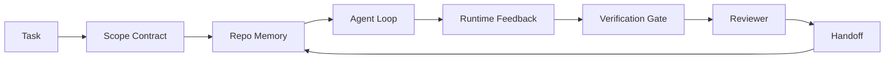

# Ingeniería de trabajo de agentes: por qué los modelos capaces siguen fallando

> Un modelo capaz no es suficiente. Los agentes confiables necesitan un banco de trabajo: instrucciones, estado, alcance, retroalimentación, verificación, revisión y entrega.

**Type:** Learn + Build
**Languages:** Python (stdlib)
**Prerequisites:** Phase 14 · 01 (Agent Loop), Phase 14 · 26 (Failure Modes)
**Time:** ~45 minutes

## Objetivos de aprendizaje

- Capacidad de modelo separada de la fiabilidad de ejecución.
- Nombre las siete superficies de trabajo que deciden si un agente navega.
- Compare una carrera de solo tiempo con una carrera guiada por un banco de trabajo en una pequeña tarea de repo.
- Produce un informe de modo de falla que mapee cada superficie perdida con el síntoma que causó.

## El problema

Se deja un modelo fronterizo en un repo real y se le pide que añada validación de entrada. Se abren cuatro archivos, se escribe código plausible, se declara el éxito y se detiene. Se ejecutan las pruebas. Dos fallan. Se toca un tercer archivo que no tenía nada que ver con la validación. No hay registro de lo que el agente asumió, lo que intentó primero, o lo que queda para hacer.

El modelo no estaba equivocado acerca de Python, estaba equivocado acerca del trabajo, no tenía idea de lo que se contaba como hecho, dónde se le permitía escribir, qué pruebas eran autorizadas, o cómo se suponía que la próxima sesión se retomaría.

No es un error de modelo, es un error de escritorio, la superficie alrededor del agente carece de las piezas que conviertan una generación de un solo disparo en ingeniería fiable y reutilizable.

## El concepto

Un escritorio es el entorno operativo que envuelve el modelo durante una tarea.

| Surface | What it carries | Failure when missing |
|---------|-----------------|----------------------|
| Instructions | Startup rules, forbidden actions, definition of done | Agent guesses what shipping means |
| State | Current task, touched files, blockers, next action | Each session restarts from zero |
| Scope | Allowed files, forbidden files, acceptance criteria | Edits leak into unrelated code |
| Feedback | Real command output captured into the loop | Agent declares success on a 400 |
| Verification | Tests, lint, smoke run, scope check | "Looks good" reaches main |
| Review | A second pass with a different role | Builder marks own homework |
| Handoff | What changed, why, what is left | Next session re-discovers everything |

El banco de trabajo es independiente del modelo. Puedes cambiar el modelo y mantener las superficies. No puedes cambiar las superficies y mantener la fiabilidad.



El bucle se cierra en el archivo de estado, no en el historial de chat.

### En el trabajo de la mesa de trabajo frente a la ingeniería rápida

El impulso le dice al modelo lo que desea en este turno. Un escritorio le dice al modelo cómo hacer el trabajo a través de los turnos y a través de las sesiones. La mayoría de las historias de fallas de agentes son fallos en el escritorio usando ropa de ingeniería de impulso.

### En el marco de trabajo

Un framework le da un tiempo de ejecución (LangGraph, AutoGen, Agents SDK). Un banco de trabajo le da al agente un lugar para trabajar dentro de ese tiempo de ejecución. Necesitas ambos. Esta mini-track es sobre el segundo.

### Razonamiento de las primitivas, no de las taxonomias de los vendedores

Hay mucho escrito sobre "ingeniería de arnés" ahora mismo. Addy Osmani, OpenAI, Anthropic, LangChain, Martin Fowler, MongoDB, HumanLayer, Augment Code, Thoughtworks, la lista impresionante de walkinglabs, y un ritmo constante de Medium y Hacker News, todo lo están llevando. No están de acuerdo en los límites de lo que es un arnés, lo que está en el alcance, y qué vocabulario usar. No necesitamos escoger un lado. Las siete superficies son una capa de UX; debajo de cada banco de trabajo hay el mismo conjunto de sistemas distribuidos primitivos que sostienen cualquier backend confiable.

Deshacerse de la etiqueta del agente por un momento. Un ejecutor de agente es un cálculo que cruza el tiempo, los procesos y las máquinas. Para hacer que sea confiable se necesitan los mismos primitivos que cualquier sistema de producción necesita.

| Primitive | What it is | What it carries for an agent |
|-----------|------------|------------------------------|
| Function | Typed handler. Pure where possible. Owns its inputs and outputs. | A tool call, a rule check, a verification step, a model invocation |
| Worker | Long-lived process that owns one or more functions and a lifecycle | The builder, the reviewer, the verifier, an MCP server |
| Trigger | Event source that invokes a function | Agent loop tick, HTTP request, queue message, cron, file change, hook |
| Runtime | The boundary that decides what runs where, with what timeouts and resources | Claude Code's process, LangGraph's runtime, a worker container |
| HTTP / RPC | The wire between caller and worker | Tool-call protocol, MCP request, model API |
| Queue | Durable buffer between trigger and worker; back-pressure, retry, idempotency | The task board, the feedback log, the review inbox |
| Session persistence | State that survives crashes, restarts, model swaps | `agent_state.json`, checkpoints, KV stores, the repo itself |
| Authorization policy | Who can call what function with which scope | Allowed/forbidden files, approval boundaries, MCP capability lists |

Ahora, mapear las siete superficies de escritorio en esas primitivas.

- **Instructions** política + metadatos de función. reglas son controles (funciones).`AGENTS.md`) es la política vinculada al inicio del tiempo de ejecución.
- **State** Persistencia de sesión. Un almacén con teclado lee el tiempo de ejecución en cada paso. archivo, KV o DB; la semántica de persistencia importa, el backend de almacenamiento no.
- **Scope** Política de autorización por tarea. los globos permitidos/prohibidos son un ACL. Las aprobaciones requeridas son una red de permisos.
- **Feedback** registro de invocación escrito en una cola. Cada llamada de shell es un registro, duradero, reproducible.
- **Verification** una función. Determinista sobre entradas.
- **Review** un trabajador separado con derecho de lectura únicamente de los artefactos de construcción y de escritura únicamente de los informes de revisión.
- **Handoff** un registro duradero emitido por un gatillo de final de sesión.

El bucle de agente en sí mismo es un trabajador que consume eventos (mensaje del usuario, resultado de la herramienta, marca el tiempo), llama a funciones (el modelo, luego las herramientas que el modelo elige), escribe registros (estado, retroalimentación) y emite disparadores (verificación, revisión, entrega).

### Modelos en circulación, traducidos a primitivos

Cada patrón popular de arnés se reduce a los ocho primitivos.

| Vendor or community pattern | What it actually is |
|------------------------------|--------------------|
| Ralph Loop (Claude Code, Codex, agentic_harness book) — re-inject original intent into a fresh context window when the agent tries to stop early | A trigger that re-enqueues a task with a clean context; session persistence carries the goal forward |
| Plan / Execute / Verify (PEV) | Three workers, one per role, communicating via state and a queue between phases |
| Harness-compute separation (OpenAI Agents SDK, April 2026) — split control plane from execution plane | Restating control-plane / data-plane. Predates the agent label by decades |
| Open Agent Passport (OAP, March 2026) — sign and audit every tool call against a declarative policy before execution | An authorization policy enforced by a pre-action worker, with a signed audit queue |
| Guides and Sensors (Birgitta Böckeler / Thoughtworks) — feedforward rules + feedback observability | Authorization policy + verification functions + observability traces |
| Progressive compaction, 5-stage (Claude Code reverse engineering, April 2026) | A state-management worker that runs cron-like over session persistence to keep it within a budget |
| Hooks / middleware (LangChain, Claude Code) — intercept model and tool calls | Triggers + functions wrapped around the runtime's invocation path |
| Skills as Markdown with progressive disclosure (Anthropic, Flue) | A function registry where the function metadata is loaded into context just-in-time |
| Sandbox agents (Codex, Sandcastle, Vercel Sandbox) | The compute plane: a runtime with isolated filesystem, network, and lifecycle |
| MCP servers | Workers exposing functions over a stable RPC, with capability lists as authorization |

Cada entrada en esa tabla es la comunidad de agentes llegando a un primitivo que ya tenía un nombre en sistemas distribuidos y dándole uno nuevo. Etiquetas útiles para el marketing; no útiles como vocabulario de ingeniería.

### Lo que dicen los recibos

La afirmación de que el modelo es más inteligente tiene números detrás de él ahora.

- Terminal Bench 2.0  el mismo modelo, cambio de arnés movió a un agente codificador de fuera de los 30 primeros a la posición cinco (LangChain, *Anatomía de un agente Arnés*).
- Vercel  eliminó el 80% de las herramientas de su agente; la tasa de éxito aumentó del 80% al 100% (MongoDB).
- Harvey  agentes legales más que duplicaron la precisión solo a través de la optimización del arnés (MongoDB).
- El 88% de los proyectos de agentes de IA de empresas no llegan a la producción. Los fallos se agrupan en torno al tiempo de ejecución, no en el razonamiento (preprints.org, *Harness Engineering for Language Agents*, marzo 2026).
- Un estudio de referencia de 2025 en tres marcos de código abierto populares informó de ~50% de finalización de tareas; WebAgent de contexto largo se desplomó del 40-50% a menos del 10% en condiciones de contexto largo, principalmente por bucles infinitos y pérdida de metas (cubrió ampliamente en las escrituras de 2026).

El resultado no es que el arnés gane para siempre. Los modelos absorben los trucos de arnés con el tiempo. El resultado es que hoy en día, la ingeniería de carga se centra en torno al modelo, no en su interior, y los primitivos que llevan esa carga son los que cada sistema de producción siempre ha necesitado.

### Donde las escrituras de los vendedores se detienen

Esta es la parte en la que no necesitas ser educado.

- LangChain *Anatomy of an Agent Harness* enumera once componentes  instrucciones, herramientas, ganchos, cajas de arena, orquestación, memoria, habilidades, sub-subgencios y un "bucle tonto" de tiempo de ejecución. No nombra filas, trabajadores como unidad de implementación, semántica de activación, persistencia de sesión como una preocupación separada o política de autorización. Trata al arnés como un objeto que configuras, no como un sistema que despliegas.
- Addy Osmani's *Agent Harness Engineering* aterriza el marco `Agent = Model + Harness`y el patrón de ratchet, pero no dice de qué se construye un arnés.
- Anthropic y OpenAI van más profundo en las superficies pero permanecen dentro de sus propios tiempos de ejecución. El anuncio de "separación de arnés-computación" en el APRIL 2026 Agents SDK es la primera pieza de proveedor que respalda explícitamente la división de control-plano / plano de datos. Esa es una idea primitiva, no una nueva.
- El libro de arneses agentes trata el arneses como un objeto de configuración (Jaymin West *Agentic Engineering*, capítulo 6) y la línea más fuerte en él es "el arneses es el límite de seguridad primario en un sistema agente". Eso es sólo política de autorización, reiterado.
- Los hilos de Hacker News siguen llegando al mismo lugar. El hilo de abril de 2026 *El arnés del agente pertenece fuera de la caja de arena* sostiene que el arnés debe estar "más como un hipervisor que se sienta fuera de todo y autoriza el acceso basado en el contexto y el usuario".

No es necesario estar en desacuerdo con ninguno de estos elementos para notar la brecha. Están escribiendo descripciones de UX de un sistema que ya existe. Estamos escribiendo el sistema. Cuando el sistema se construye correctamente, las siete superficies caen de las primitivas. Cuando se construye mal, no hay cantidad de `AGENTS.md`Polish arregla la cola que falta.

Así que cuando escuches "ingeniería de arnés" en otro lugar, traduce a primitivos. Las instrucciones y las reglas son políticas y funciones. El andamio es el tiempo de ejecución. Las barandillas son la autorización + verificación. Los ganchos son los gatilladores. La memoria es la persistencia de la sesión. El Ralph Loop está en orden. Los subagentes son trabajadores. Las cajas de arena son aviones de computación. El vocabulario cambia; la ingeniería no. El banco de trabajo es la UX de cara a un agente; el arnés, en el sentido que sobrevive al siguiente reframe del proveedor, es funciones, trabajadores, disparadores, tiempos de ejecución, colas, persistencia y política conectadas correctamente.

```figure
wb-seven-surfaces
```

## Construye el mismo

`code/main.py`El guión cuenta qué superficies faltan en la ejecución fallida y imprime un informe de modo de falla.

La tarea de repo es pequeña a propósito: añadir validación de entrada a un procesador de estilo FastAPI de un archivo y escribir una prueba de aprobación.

- ¿Qué quieres decir ?

```
python3 code/main.py
```

Resultado: un registro de las dos carreras, un `failure_modes.json`Resumiendo la carrera de inmediato y un veredicto de una sola línea para la carrera de trabajo.

El agente es un pequeño recinto basado en reglas; el punto es las superficies, no el modelo.

## Usalo

Tres lugares de la mesa de trabajo superficies ya existen en la naturaleza, incluso si nadie los llama así:

- **Claude Code, Codex, Cursor.** `AGENTS.md`y `CLAUDE.md`Las instrucciones son la superficie, los comandos son el alcance, los ganchos son la verificación.
- **LangGraph, OpenAI Agents SDK.**Los puestos de control y las tiendas de sesiones son la superficie del estado.
- **CI on a real repo.**Las pruebas, el reviso de tipo y el reviso de la letra son la verificación.

La ingeniería de trabajo es la disciplina de hacer que esas superficies sean explícitas y reutilizables, en lugar de dejar que cada equipo las redescubra.

## Envío

`outputs/skill-workbench-audit.md`Es una habilidad portátil que audita un repo existente para las siete superficies de escritorio y informes que faltan, que son parciales y que son saludables.

## Los ejercicios

1. Seleccione un repo donde ya esté ejecutando un agente.
2. Extenderse`main.py`Así que la ejecución de inmediato también produce una falsa afirmación de "éxito".
3. Añade una octava superficie para su propio producto.
4. Re-exercer el guión con un agente de estub que alucina una escritura de archivo adicional. ¿Qué superficie lo capta primero?
5. Mapa de los cinco modos de falla recurrentes de la industria desde la fase 14 · 26 en las siete superficies. ¿Qué modo está diseñado para absorber cada superficie?

## Términos clave

| Term | What people say | What it actually means |
|------|----------------|------------------------|
| Workbench | "The setup" | Engineered surfaces around the model that make work reliable |
| Surface | "A doc" or "a script" | A named, machine-readable input the agent reads or writes every turn |
| System of record | "The notes" | The file the agent treats as truth when chat history is gone |
| Definition of done | "Acceptance" | An objective, file-backed checklist the agent cannot fake |
| Workbench audit | "Repo readiness check" | A pass over the seven surfaces that flags missing pieces before work begins |

## Leer más

Las personas que se encuentran en la zona de trabajo de la empresa deben tener en cuenta que el proyecto de trabajo de la empresa es un proyecto de investigación y que el objetivo de la empresa es mejorar la calidad de vida de la empresa.

Enmarcamientos de los proveedores:

- [Addy Osmani, Agent Harness Engineering](https://addyosmani.com/blog/agent-harness-engineering/)¿ Qué es esto ?`Agent = Model + Harness`y el patrón de ratchets; delgado en la infraestructura
- [LangChain, The Anatomy of an Agent Harness](https://blog.langchain.com/the-anatomy-of-an-agent-harness/) once componentes: instrucciones, herramientas, ganchos, orquestación, cajas de arena, memoria, habilidades, sub-gentes, tiempo de ejecución; omite colas, despliegue, authz
- [OpenAI, Harness engineering: leveraging Codex in an agent-first world](https://openai.com/index/harness-engineering/) La visión del equipo del Codex de las superficies alrededor de su tiempo de ejecución
- [OpenAI, Unrolling the Codex agent loop](https://openai.com/index/unrolling-the-codex-agent-loop/) el bucle de agente reducido a un `while`en llamadas de funciones
- [Anthropic, Effective harnesses for long-running agents](https://www.anthropic.com/engineering/effective-harnesses-for-long-running-agents) superficies de largo horizonte dentro de un tiempo de ejecución específico
- [Anthropic, Harness design for long-running application development](https://www.anthropic.com/engineering/harness-design-long-running-apps) notas de diseño aplicadas
- [LangChain Deep Agents harness capabilities](https://docs.langchain.com/oss/python/deepagents/harness) Superficie de configuración de tiempo de ejecución

Piezas de practicantes con detalles utilizables:

- [Martin Fowler / Birgitta Böckeler, Harness engineering for coding agent users](https://martinfowler.com/articles/harness-engineering.html) guías (feedforward) + sensores (feedback); el marco de la teoría de control más limpio
- [HumanLayer, Skill Issue: Harness Engineering for Coding Agents](https://www.humanlayer.dev/blog/skill-issue-harness-engineering-for-coding-agents)"No es un problema de modelo, es un problema de configuración"
- [MongoDB, The Agent Harness: Why the LLM Is the Smallest Part of Your Agent System](https://www.mongodb.com/company/blog/technical/agent-harness-why-llm-is-smallest-part-of-your-agent-system) recibos: Vercel del 80% al 100%, precisión Harvey 2x, Terminal Bench Top 30 al Top 5
- [Augment Code, Harness Engineering for AI Coding Agents](https://www.augmentcode.com/guides/harness-engineering-ai-coding-agents) la restricción de la primera marcha
- [Sequoia podcast, Harrison Chase on Context Engineering Long-Horizon Agents](https://sequoiacap.com/podcast/context-engineering-our-way-to-long-horizon-agents-langchains-harrison-chase/) Preocupación por el tiempo de ejecución respecto a las preocupaciones del modelo

Libros, documentos y implementaciones de referencia:

- [Jaymin West, Agentic Engineering — Chapter 6: Harnesses](https://www.jayminwest.com/agentic-engineering-book/6-harnesses) tratamiento de longitud de libro, trata el arnés como el límite de seguridad primario
- [preprints.org, Harness Engineering for Language Agents (March 2026)](https://www.preprints.org/manuscript/202603.1756) Enmarcamiento académico como control / agencia / tiempo de ejecución
- [walkinglabs/awesome-harness-engineering](https://github.com/walkinglabs/awesome-harness-engineering) Lista de lectura seleccionada en todo contexto, evaluación, observabilidad, orquestación
- [ai-boost/awesome-harness-engineering](https://github.com/ai-boost/awesome-harness-engineering) lista de selección alternativa (herramientas, evaluaciones, memoria, MCP, permisos)
- [andrewgarst/agentic_harness](https://github.com/andrewgarst/agentic_harness) Implementación de referencia lista para producción con memoria y suite de eval con respaldo de Redis
- [HKUDS/OpenHarness](https://github.com/HKUDS/OpenHarness) Arnes de agente abierto con agente personal incorporado

Hacker News vale la pena leer por los desacuerdos, no por el consenso:

- [HN: Effective harnesses for long-running agents](https://news.ycombinator.com/item?id=46081704)
- [HN: Improving 15 LLMs at Coding in One Afternoon. Only the Harness Changed](https://news.ycombinator.com/item?id=46988596)
- [HN: The agent harness belongs outside the sandbox](https://news.ycombinator.com/item?id=47990675) argumenta por la autorización como avión separado

Referencias cruzadas dentro de este plan de estudios:

- Fase 14 · 23  Convenciones de la GenAI de OpenTelemetry: la capa de observabilidad en la que la literatura de los sensores apunta a
- Fase 14 · 26  Catálogo de modos de falla las siete superficies están diseñadas para absorber
- Fase 14 · 27  Defensa de inyección rápida que se sitúa en la política de autorización primitiva
- Fase 14 · 29  Tiempos de ejecución de producción (cuota, evento, cron): donde los primitivos de esta lección viven en despliegue
