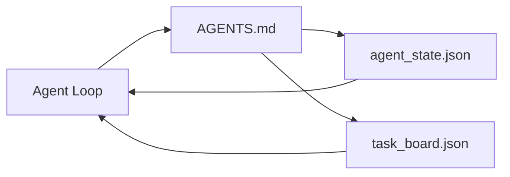

# El trabajo de agente mínimo

> El banco de trabajo más pequeño y útil es de tres archivos: un router de instrucciones raíz, un archivo de estado y un tablero de tareas. Todo lo demás está en capas arriba. Si un repo no puede llevar estos tres, ningún modelo lo guardará.

**Type:** Build
**Languages:** Python (stdlib)
**Prerequisites:** Phase 14 · 31 (Why Capable Models Still Fail)
**Time:** ~45 minutes

## Objetivos de aprendizaje

- Definir los tres archivos que forman el banco de trabajo mínimo viable.
- Explica por qué un router de raíz corto supera a un monolitico largo `AGENTS.md`¿ Qué ?
- Construye un archivo de estado que el agente pueda leer en cada turno y escribir al final.
- Construir un tablero de tareas que sobreviva a la sesión de trabajo sin historial de chat.

## El problema

La mayoría de los equipos se acercan a un escritorio escribiendo una línea de 3000 .`AGENTS.md`El modelo lo carga, ignora las partes que no puede resumir, y todavía falla en las mismas superficies en las que siempre falló.

Necesitas lo contrario. Un pequeño archivo raíz que envía al agente a archivos más profundos solo cuando sea relevante. Estado duradero el agente lee antes de actuar y escribe después. Una tabla de tareas que dice lo que está en vuelo, lo que está bloqueado y lo que está arriba después.

Tres archivos, cada uno con un trabajo, cada uno lo suficientemente legible para evolucionar a un sistema real más tarde.

## El concepto



### Agentes.md es un router, no un manual

Un buen .`AGENTS.md`Es corto, señala al agente a:

- El archivo del estado (donde estás).
- El tablero de tareas (lo que queda).
- Las reglas más profundas (en`docs/agent-rules.md`¿Qué es lo que se hace?
- El comando de verificación (cómo saber que funciona).

Cualquier cosa más larga se enciende en documentos más profundos, cargados sólo cuando sea necesario.

### agent_state.json es el sistema de registro

El estado lleva: la identificación de tarea activa, los archivos tocados, las suposiciones hechas, los bloqueadores y la siguiente acción. El agente lo lee en cada turno. La siguiente sesión lo lee en lugar de reproducir el chat.

El estado vive en un archivo porque el historial de chat no es fiable las sesiones mueren las conversaciones se recortan el archivo no lo hace

### task_board.json es la cola

El tablero de tareas lleva a cabo cada tarea con estado `todo | in_progress | done | blocked`Es la cola que el agente saca cuando el estado está vacío, y la cola que se lee cuando se quiere saber si el agente está en el camino correcto.

Una tarea en el tablero tiene una identificación, un objetivo, un propietario (`builder`¿ Qué ?`reviewer`, o`human`La tabla es pequeña a propósito: cuando se hace más allá de una pantalla, se tiene un problema de planificación, no un problema de tabla.

### Tres archivos es el piso, no el techo.

Las lecciones posteriores añaden contratos de alcance, corredores de retroalimentación, puertas de verificación, listas de verificación de revisores y paquetes de entrega.

```figure
wb-three-files
```

## Construye el mismo

`code/main.py`escribe el banco de trabajo mínimo en un repo vacío y demuestra que un solo agente vuelve que:

1. Leemos`agent_state.json`¿ Qué ?
2. Retira la siguiente tarea de `task_board.json`si el estado está vacío.
3. Toca un solo archivo dentro del alcance.
4. Escribe el estado actualizado.

- ¿Qué quieres decir ?

```
python3 code/main.py
```

El guión crea`workdir/`Junto a sí mismo, pone los tres archivos, ejecuta un giro, e imprime la diferencia.

## Usalo

Dentro de los productos de agentes de producción, los mismos tres archivos aparecen bajo diferentes nombres:

- **Claude Code:** `AGENTS.md`o `CLAUDE.md`para el router, `.claude/state.json`- Tiendas de estilo para el estado, ganchos para la junta.
- **Codex / Cursor:**reglas del espacio de trabajo para el router, memoria de sesión para estado, tareas en cola en la barra lateral de chat para la placa.
- **Custom Python agent:**Los mismos archivos que acabas de escribir.

Los nombres cambian, pero la forma no.

## Modelos de producción en la naturaleza

El banco de trabajo mínimo sobrevive al contacto con monorepos reales cuando se colocan tres patrones en capas encima.

**Nested `AGENTS.md` with nearest-wins precedence.**Naves de OpenAI 88 `AGENTS.md`Los archivos de la base de datos de la base de datos de la base de datos de la base de datos de la base de datos de la base de datos de la base de datos de la base de datos de la base de datos de la base de datos de la base de datos de la base de datos de la base de datos de la base de datos de la base de datos de la base de datos de la base de datos de la base de datos de la base de datos de la base de datos de la base de datos de la base de datos de datos de la base de datos de datos de la base de datos de datos de la base de datos de datos de la base de datos de datos de la base de datos de datos de la base de datos de datos de la base de datos de datos de la base de datos de datos de datos de la base de datos de datos de datos de datos de la base de datos de datos de datos de datos de datos de datos de datos de datos de datos de datos de datos de datos de datos de datos de datos de datos de datos de datos de datos de datos de datos de datos de datos de datos de datos de datos de datos de datos de datos de datos de datos de datos de datos de datos de datos de datos de datos de datos de datos de datos de datos de datos de datos de datos de datos de datos de datos de datos de datos de datos de datos de datos de datos de datos de datos de datos de datos de datos de datos de datos de datos de datos de datos de datos de datos de datos de datos de datos de datos de datos de datos de datos de datos de datos de datos de datos de datos de datos de datos de datos de datos de datos de datos de datos de datos de datos de datos de datos de datos de datos de datos de datos de datos de datos de datos de datos de datos de datos de datos de datos de datos de datos de datos de datos de datos de datos de datos de datos de datos de datos de datos de datos de datos de datos de datos de datos de datos de datos de datos de datos de datos de datos de datos de datos de datos de datos de datos de datos de datos de datos de datos de datos de datos de datos de datos de datos de datos de datos de datos de datos de datos de datos de datos de datos de datos de datos de datos de datos de datos de datos de datos de datos de datos de datos de datos de datos de datos de datos de datos de datos de datos de`AGENTS.md`Los archivos de subdirectorio amplían el archivo raíz.`AGENTS.override.md`El método de superposición es específico para el código y se evita para el trabajo transversal.`AGENTS.md`Los archivos dan un salto de calidad equivalente a la actualización de Haiku a Opus; los peores hacen que la salida sea peor que ningún archivo en absoluto.

**Anti-patterns to refuse, even when they look like coverage.**Las instrucciones contradictorias dejan caer silenciosamente el agente del modo interactivo al modo codicioso (ICLR 2026 AMBIG-SWE: 48,8% → 28% de tasa de resolución); número las prioridades en lugar de apilarlas. Reglas de estilo no verificables (" Siga la Guía de Estilo de Python de Google ") sin comando de ejecución permiten al agente inventar el cumplimiento; empareje cada regla de estilo con el comando de lint exacto. Liderar con estilo en lugar de comandos sepulta el camino de verificación; comandos primero, estilo último. Escribir para humanos en lugar de agentes desperdicia el presupuesto contextual; la concisión es una característica.

**Cross-tool symlinks.**Un único archivo raíz con enlaces simbólicos (`ln -s AGENTS.md CLAUDE.md`¿ Qué ?`ln -s AGENTS.md .github/copilot-instructions.md`¿ Qué ?`ln -s AGENTS.md .cursorrules`) mantiene a todos los agentes de codificación en la misma fuente de verdad.`nx ai-setup`automatiza esto a través de Claude Code, Cursor, Copilot, Gemini, Codex y OpenCode desde una sola configuración.

## Envío

`outputs/skill-minimal-workbench.md`genera el banco de trabajo de tres archivos para cualquier nuevo repo: un `AGENTS.md`el router está conectado al proyecto, un `agent_state.json`con las teclas correctas, y un `task_board.json`Se ha sembrado con el actual retraso.

## Los ejercicios

1. Añadir un`last_run`tiempo de la marca de tiempo`agent_state.json`- Rechazar la ejecución si el archivo tiene más de 24 horas, a menos que el operador lo confirme.
2. Añadir un`priority`campo a la tabla de tareas y cambiar el tirador para siempre elegir la mayor prioridad `todo`¿ Qué ?
3. Migración `task_board.json`a JSON Lines para que cada tarea sea una línea y las diferencias estén limpias en el control de versión.
4. Escriba un`lint_workbench.py`que falla si `AGENTS.md`es más de 80 líneas o hace referencia a un archivo que no existe.
5. Decida cuál de los tres archivos le haría más daño perderlo.

## Términos clave

| Term | What people say | What it actually means |
|------|----------------|------------------------|
| Router | `AGENTS.md` | Short root file that points the agent at deeper docs and files |
| State file | "The notes" | Machine-readable record of where the agent is, written every turn |
| Task board | "The backlog" | JSON queue of work with status, owner, acceptance |
| System of record | "Source of truth" | The file the workbench treats as authoritative when chat is gone |

## Leer más

- [agents.md — the open spec](https://agents.md/) adoptado por Cursor, Codex, Claude Code, Copilot, Gemini, OpenCode
- [Augment Code, A good AGENTS.md is a model upgrade. A bad one is worse than no docs at all](https://www.augmentcode.com/blog/how-to-write-good-agents-dot-md-files) saltos de calidad medidos
- [Blake Crosley, AGENTS.md Patterns: What Actually Changes Agent Behavior](https://blakecrosley.com/blog/agents-md-patterns) lo que funciona empíricamente, lo que no
- [Datadog Frontend, Steering AI Agents in Monorepos with AGENTS.md](https://dev.to/datadog-frontend-dev/steering-ai-agents-in-monorepos-with-agentsmd-13g0) la prioridad en la práctica
- [Nx Blog, Teach Your AI Agent How to Work in a Monorepo](https://nx.dev/blog/nx-ai-agent-skills) Generación de un solo recurso en seis herramientas
- [The Prompt Shelf, AGENTS.md Best Practices: Structure, Scope, and Real Examples](https://thepromptshelf.dev/blog/agents-md-best-practices/) sección ordenando que sobrevive revisión
- [Anthropic, Claude Code subagents](https://code.claude.com/docs/en/sub-agents)
- Fase 14 · 31  los modos de falla que este mínimo absorbe
- Fase 14 · 34  el esquema de estado duradero esta lección prevé
