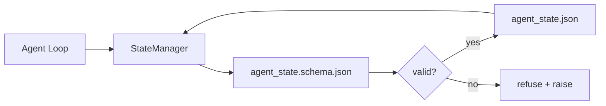

# Memoria de repos y estado duradero

> El historial de chat es volátil. El repo es duradero. El banco de trabajo almacenan el estado del agente en archivos versionados para que la próxima sesión, el siguiente agente y el siguiente revisor lean todas de la misma fuente de verdad.

**Type:** Build
**Languages:** Python (stdlib + `jsonschema` optional)
**Prerequisites:** Phase 14 · 32 (Minimal Workbench)
**Time:** ~60 minutes

## Objetivos de aprendizaje

- Defina lo que pertenece a la memoria de repo y lo que pertenece al historial de chat.
- Autor de JSON Schemas para `agent_state.json`y `task_board.json`¿ Qué ?
- Construir un administrador de estado que cargue, valida, muta y persiste estado de forma atómica.
- Utilice el esquema para rechazar las malas escrituras antes de que corrompan el escritorio.

## El problema

El agente termina una sesión. El chat se cierra. La siguiente sesión se abre y pregunta dónde empezar. El modelo dice "dejenme revisar los archivos", lee notas obsoletas y vuelve a hacer el trabajo que ya estaba terminado. O peor, vuelve a escribir un archivo terminado porque nadie le dijo que el archivo estaba terminado.

El banco de trabajo es la memoria de repo: el estado vive en los archivos JSON en el repo, escrito bajo un esquema, persistió de forma atómica, diferente en la revisión de código.

## El concepto



### Lo que pertenece a la memoria repo

| Belongs | Does not belong |
|---------|-----------------|
| Active task id | Raw chat transcripts |
| Touched files this session | Token-level reasoning traces |
| Assumptions the agent made | "The user seemed frustrated" |
| Open blockers | Sampled completions |
| Next action | Vendor-specific model ids |

La prueba es la durabilidad: ¿sería útil en tres meses en una repetición de CI? si sí, repo. si no, telemetría.

### Estado del primer esquema

Sin él, cada agente inventa nuevos campos, cada revisor aprende una nueva forma, y cada script de CI tiene que hacer caso especial a versiones anteriores.

El esquema incluye:

- Necesitas llaves.
- Se permite`status`los valores.
- Valores prohibidos (por ejemplo `null`para matrices).
- Constrangimientos de patrón (identificación de tareas coincide `T-\d{3,}`¿Qué es lo que se hace?
- Campo de versión para migraciones.

### Atomic escribe

El archivo del estado es la fuente de la verdad; un archivo medio escrito es peor que ningún archivo.

### Migraciones

Cuando el esquema cambie, envíe un script de migración junto al golpe de esquema.`schema_version`campo; el administrador se niega a cargar un archivo desde una versión que no puede migrar.

```figure
wb-state-persist
```

## Construye el mismo

`code/main.py`los instrumentos:

- `agent_state.schema.json`y `task_board.schema.json`¿ Qué ?
- Un validador de sólo stdlib (subconjunto de JSON Schema: requerido, tipo, enum, patrón, elementos).
- `StateManager.load`¿ Qué ?`StateManager.update`¿ Qué ?`StateManager.commit`con el tiempo atómico y el renombre escribe.
- Una demostración que muta el estado, persiste, se recarga y prueba el viaje de ida y vuelta.

- ¿Qué quieres decir ?

```
python3 code/main.py
```

El guión dice:`workdir/agent_state.json`y `workdir/task_board.json`, los muta en dos vueltas, e imprime el estado validado en cada paso.

## Modelos de producción en la naturaleza

Cuatro patrones convierten el mínimo de la lección en algo que un monorepo multi-agente puede sobrevivir.

**Atomic temp-and-rename is not optional.**Un informe de errores del proyecto Hive de marzo de 2026 documenta el modo de falla de manera limpia: `state.json`fue escrito a través de `write_text()`Partial escribe a la izquierda sesiones que se reanudan contra el estado corrupto sin señal.`tempfile.mkstemp`en el mismo directorio que el objetivo, escriba, `fsync`¿ Qué ?`os.replace`Esta lección es una de las mejores de las que podemos aprender.`atomic_write`hace exactamente eso.

**Idempotency keys on every non-idempotent tool call.**Si un agente se estrella después de llamar a una herramienta pero antes de marcar el resultado, la recuperación vuelve a intentar la llamada a la herramienta. Seguro para las lecturas; peligroso para correos electrónicos, inserciones de DB, cargas de archivos. El patrón: registrar cada ID de llamada de la herramienta antes de la ejecución en un `pending_calls.jsonl`En el nuevo intento, compruebe la identificación; si está presente, omita la llamada y utiliza el resultado almacenado en caché. Anthropic y LangChain lo llaman en la guía de 2026; el puntero de control de LangGraph persiste en espera de escritos por la misma razón.

**Separate large artifacts from state.**No almacenes CSV, transcripciones largas o archivos generados en `agent_state.json`. Guarde el artefacto como un archivo separado (o cargue al almacenamiento de objetos) y mantenga solo el camino en estado. Los puntos de control se mantienen pequeños y rápidos; los artefactos crecen de forma independiente.

**Event sourcing for audit, snapshots for resume.**Aplicar a un registro de eventos (`state.events.jsonl`) en cada mutación; de forma periódica, una instantánea de `state.json`Resume lee el instantáneo, luego reproduce cualquier evento después de la timestamp de la instantánea. Esto cuesta más disco pero le permite reproducir las decisiones del agente literalmente  esencial cuando se deparan ejecuciones de horizonte largo. La misma forma que utiliza Postgres internamente para WAL.

**Schema migrations or refuse to load.**El `schema_version`Cuando el administrador carga un archivo en una versión desconocida, se niega a leer. Envía un script de migración junto al golpe de esquema; `tools/migrate_state.py`funciona de forma idempotente en cada startup.

## Usalo

En producción:

- **LangGraph checkpointers.**El punto de control persiste en el estado del gráfico a SQLite, Postgres o un backend personalizado. El esquema que enseña esta lección es lo que se alcanza cuando el punto de control muere y se necesita leer el estado a mano.
- **Letta memory blocks.**Bloques persistentes con esquemas estructurados (fase 14 · 08).
- **OpenAI Agents SDK session store.**El archivo de estado en esta lección es el archivo de fondo local.

## Envío

`outputs/skill-state-schema.md`genera un par de esquemas JSON específicos para el proyecto (estado + tablero), un Python `StateManager`cableado a escrituras atómicas, y un andamio de migración para que el siguiente golpe de esquema no rompa el escritorio.

## Los ejercicios

1. Añadir un`last_human_touch`Rechazar cualquier agente escribir dentro de cinco segundos de una edición humana.
2. Extensión del validador para soportar `oneOf`Así que una tarea puede ser una tarea de construcción o una tarea de revisión con diferentes campos requeridos.
3. Añadir un`schema_version`campo y escribir la migración de v1 a v2 (renombrar `blockers`¿ Qué ?`risks`¿Qué es lo que se hace?
4. Mover el backend de almacenamiento de un archivo local a SQLite.`StateManager`La API es idéntica.
5. ¿Qué pasa y cómo te salva el cambio de nombre atómico?

## Términos clave

| Term | What people say | What it actually means |
|------|----------------|------------------------|
| Repo memory | "Notes file" | State stored in tracked files in the repo, under schema |
| Schema-first | "Validate inputs" | Define the contract before the writer, refuse drift |
| Atomic write | "Just rename" | Write to temp, fsync, rename, so partial failures cannot corrupt |
| Migration | "Schema bump" | A script that turns vN state into v(N+1) state |
| System of record | "Source of truth" | The artifact the workbench treats as authoritative |

## Leer más

- [JSON Schema specification](https://json-schema.org/specification.html)
- [LangGraph checkpointers](https://langchain-ai.github.io/langgraph/concepts/persistence/)
- [Letta memory blocks](https://docs.letta.com/concepts/memory)
- [Fast.io, AI Agent State Checkpointing: A Practical Guide](https://fast.io/resources/ai-agent-state-checkpointing/) Control de esquemas con idempotencia
- [Fast.io, AI Agent Workflow State Persistence: Best Practices 2026](https://fast.io/resources/ai-agent-workflow-state-persistence/) control de concurrencia, TTL, abastecimiento de eventos
- [Hive Issue #6263 — non-atomic state.json writes silently ignored](https://github.com/aden-hive/hive/issues/6263) el modo de fallo en un proyecto real
- [eunomia, Checkpoint/Restore Systems: Evolution, Techniques, Applications](https://eunomia.dev/blog/2025/05/11/checkpointrestore-systems-evolution-techniques-and-applications-in-ai-agents/) Primitivas de CR de la historia del sistema operativo aplicadas a agentes
- [Indium, 7 State Persistence Strategies for Long-Running AI Agents in 2026](https://www.indium.tech/blog/7-state-persistence-strategies-ai-agents-2026/)
- [Microsoft Agent Framework, Compaction](https://learn.microsoft.com/en-us/agent-framework/agents/conversations/compaction) Gerente de los puntos de control del vendedor
- Fase 14 · 08  Bloques de memoria y cálculo del tiempo de sueño
- Fase 14 · 32  el mínimo de tres archivos esta lección esquema
- Fase 14 · 40  paquetes de entrega leídos desde el mismo esquema
