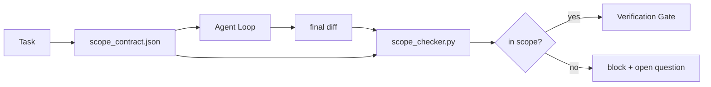

# Los contratos de alcance y los límites de tareas

> El modelo no sabe dónde termina el trabajo. Un contrato de alcance es un archivo por tarea que dice dónde comienza el trabajo, dónde termina y cómo regresar si se derrama. El contrato se convierte en un cheque.

**Type:** Build
**Languages:** Python (stdlib)
**Prerequisites:** Phase 14 · 32 (Minimal Workbench), Phase 14 · 33 (Rules as Constraints)
**Time:** ~50 minutes

## Objetivos de aprendizaje

- Escriba un contrato de alcance que un agente lea al inicio de la tarea y un verificador lea al final de la tarea.
- Especifique archivos permitidos, archivos prohibidos, criterios de aceptación, plan de retroceso y límites de aprobación.
- Implementar un verificador de alcance que compare una diferencia con el contrato y señale las violaciones.
- Haga que el alcance sea visible, automático y revisable.

## El problema

Los agentes se arrastran. La tarea es "correcer el error de inicio de sesión". La diferencia afecta a la ruta de inicio de sesión, el ayudante de correo electrónico, el controlador de base de datos, el README y el guión de liberación. Cada toque tenía una razón plausible en el momento. Juntos son un cambio diferente al que se revisó.

El modo de falla de alcance es el más poco monitoreado en el trabajo de los agentes porque el agente narra cada paso de buena fe. La corrección no es una solicitud más estricta. La corrección es un contrato en el disco que dice lo prometido y un cheque que compara el resultado con la promesa.

## El concepto



### Lo que entra en un contrato de alcance

| Field | Purpose |
|-------|---------|
| `task_id` | Links to the task on the board |
| `goal` | One sentence the reviewer can verify |
| `allowed_files` | Globs the agent may write |
| `forbidden_files` | Globs the agent must not touch even by accident |
| `acceptance_criteria` | Test commands or assertion lines that prove done |
| `rollback_plan` | One paragraph the operator can execute if a halt is required |
| `approvals_required` | Actions outside scope that need explicit human sign-off |

Un contrato sin`forbidden_files`El espacio negativo es la mitad del contrato.

### Globo, no caminos crudos

Los archivos de repos real se mueven.`app/**/*.py`¿ Qué ?`tests/test_signup*.py`) de modo que un refactor entre sesiones no invalidará el contrato.

### El rollback es parte del alcance

Una lista de cómo revertir obliga al autor del contrato a pensar en lo que podría salir mal.

### El control de alcance es un control de diferencia

El agente escribe una diferencia. El verificador lee la diferencia, los globos permitidos, los globos prohibidos, y una lista de cualquier comando de aceptación que se ejecutó.

### Dos altitudes de alcance: la lista de características y el contrato de tareas

El contrato de alcance limita una tarea. No vincula el proyecto. Un agente puede permanecer perfectamente dentro de un contrato para la fijación de inicio de sesión y, sin embargo, en el siguiente turno, decidir que el proyecto también necesita una página de configuración, un cambio de modo oscuro y una reescritura del router.

Esa segunda altitud necesita su propio primitivo: una`feature_list.json`El agente lee al inicio de la sesión. Es el archivo de proyecto como un archivo ordenado legible por máquina. El agente elige exactamente una característica cuya `status`¿ Es verdad ?`todo`, escribe su `id`"Una característica a la vez" deja de ser una línea en el prompt el agente puede racionalizar pasado y se convierte en un valor que lee fuera del disco y un cheque de la puerta se aplica.

```json
{
  "project": "knowledge-base",
  "active": "import-pdf",
  "features": [
    { "id": "import-pdf",   "status": "in_progress", "goal": "import a PDF into the library",        "done_when": "pytest tests/test_import.py && a sample PDF appears in the library view" },
    { "id": "full-text-search", "status": "todo",     "goal": "search document text and rank hits",   "done_when": "query returns ranked results with snippets" },
    { "id": "cite-answers", "status": "todo",         "goal": "answers carry source citations",        "done_when": "every answer renders at least one clickable citation" }
  ]
}
```

| Field | Purpose |
|-------|---------|
| `active` | The single feature the current session may touch; empty means pick one and set it |
| `features[].id` | Stable slug the scope contract's `task_id` points at |
| `features[].status` | `todo`, `in_progress`, `done`, `blocked`; only one `in_progress` at a time |
| `features[].goal` | One sentence the reviewer can verify |
| `features[].done_when` | The acceptance line that flips `in_progress` to `done` |

Dos reglas hacen que la lista sea cargadora en lugar de decorativa.`in_progress`" es en sí mismo una verificación de inicio (fase 14 · 33): si la lista muestra dos, la sesión se niega a comenzar hasta que un humano la resuelva. En segundo lugar, la lista de características es un archivo, no un mensaje de chat, porque el chat se desplaza fuera de contexto y el archivo persiste a través de las sesiones y entre los agentes. La entrega (fase 14 · 40) escribe el estado de la función terminada de nuevo a `done`Así que la siguiente sesión se abre a una tabla precisa en lugar de volver a derivar lo que queda.

El contrato y la lista se componen por menor privilegio, la misma fusión descrita a continuación: el contrato de tarea `allowed_files`debe sentarse dentro de lo que toca la característica activa, nunca fuera de ella.

```figure
wb-scope-bounce
```

## Construye el mismo

`code/main.py`los instrumentos:

- `scope_contract.json`esquema (subconjunto de JSON Schema, matrices glob).
- Un parser que convierte una lista de archivos tocados más una lista de comandos de ejecución en un `RunSummary`¿ Qué ?
- ¿ Qué es esto ?`scope_check`que regresa .`(violations, in_scope, off_scope)`contra el contrato.
- Dos demostraciones: una que se mantiene en el alcance, otra que se escapa.

- ¿Qué quieres decir ?

```
python3 code/main.py
```

Resultado: el contrato, las dos carreras, los veredictos por carrera, y un salvo `scope_report.json`¿ Qué ?

## Modelos de producción en la naturaleza

Un profesional que realiza "specsmaxxing" (contratos de alcance en YAML antes de invocar al agente) informa que la tasa de agujeros de conejo cayó del 52% al 21% en tres semanas sin cambiar al agente.

**Violation budgets, not binary failures.** `agent-guardrails`(la puerta de fusión de OSS utilizada por Claude Code, Cursor, Windsurf, Codex a través de MCP)`violationBudget`Por tarea: se presentan como advertencias pequeñas escasez de alcance dentro del presupuesto; sólo cuando se excede el presupuesto se rechaza la puerta de fusión.`violationSeverity: "error" | "warning"`El presupuesto es la diferencia entre una puerta que se envía y una puerta que se deshabilita por el equipo que la odiaba.

**Severity asymmetry by path family.**Off-scope escribe a `docs/**`Por lo general .`warn`; fuera de alcance escribe a `scripts/**`¿ Qué ?`migrations/**`¿ Qué ?`config/prod/**`siempre son`block`Esta asimetría debe vivir en el contrato, no en el tiempo de ejecución, porque es específica del proyecto y cambia por tarea.

**Time and network budgets next to file budgets.**¿ Qué es esto ?`time_budget_minutes`El campo limita el reloj de pared; el tiempo de ejecución se niega a seguir pasando sin una nueva aprobación.`network_egress`Allowlist en nombres de host evita que el agente golpee silenciosamente una API externa que no formaba parte de la tarea.

**Multi-contract merge semantics (least privilege).**Cuando se aplican dos contratos de ámbito de aplicación (por ejemplo, un contrato de proyecto en general más uno específico de tarea), la fusión es: **intersect** `allowed_files`(ambos contratos deben permitir el camino),**union** `forbidden_files`(o puede prohibir), `time_budget_minutes`es el más restrictivo (min), `approvals_required`se acumula. `network_egress`¿ Es verdad ?`None`por no haber sido ejecutado, `[]`por negar todo,`[...]`como una lista de permisos; en fase de fusión, `None`Se puede decir que el contrato se desvía al otro lado, dos listas se cruzan, y negar-todo se mantiene negar-todo.

## Usalo

Modelos de producción:

- **Claude Code slash commands.**¿ Qué es esto ?`/scope`El comando escribe el contrato y lo pinsa como contexto de sesión.
- **GitHub PRs.**Empuje el contrato como un archivo JSON en el cuerpo de relaciones públicas o como un artefacto registrado. CI ejecuta el comprobador de alcance contra la diferencia de fusión.
- **LangGraph interrupts.**Una violación de alcance provoca una interrupción; el manipulador pregunta al humano si el contrato necesita crecer o si el agente necesita retirarse.

El contrato viaja con la tarea.`outputs/scope/closed/`¿ Qué ?

## Envío

`outputs/skill-scope-contract.md`genera un contrato de alcance para una descripción de tarea y un verificador global que se ejecuta en CI en cada agente diferencial.

## Los ejercicios

1. Añadir un`network_egress`el listado de campos permitió hosts externos. rechazar ejecuciones que tocan otros hosts.
2. Extenda el control para que falle suavemente en `docs/**`y duro en`scripts/**`Justifica la asimetría.
3. Hacer derivar el contrato `allowed_files`de un `goal`¿Qué pasa con el primer caso de borde?
4. Añadir un`time_budget_minutes`y se niegan a continuar una vez que el reloj de la pared lo superen.
5. ¿Cuál es la semántica correcta de fusión cuando ambas se aplican?

## Términos clave

| Term | What people say | What it actually means |
|------|----------------|------------------------|
| Scope contract | "The task brief" | Per-task JSON listing allowed/forbidden files, acceptance, rollback |
| Scope creep | "It also touched..." | Files outside the contract changed in the same task |
| Rollback plan | "We can revert" | The one-paragraph operator runbook for halting |
| Approval boundary | "Needs sign-off" | An action listed in the contract as requiring explicit human approval |
| Diff check | "Path audit" | Comparing touched files against the contract globs |

## Leer más

- [LangGraph human-in-the-loop interrupts](https://langchain-ai.github.io/langgraph/concepts/human_in_the_loop/)
- [OpenAI Agents SDK tool approval policies](https://platform.openai.com/docs/guides/agents-sdk)
- [logi-cmd/agent-guardrails — merge gates and scope validation](https://github.com/logi-cmd/agent-guardrails) Presupuestos de violación, niveles de gravedad
- [Dev|Journal, Preventing AI Agent Configuration Drift with Agent Contract Testing](https://earezki.com/ai-news/2026-05-05-i-built-a-tiny-ci-tool-to-keep-ai-agent-configs-from-drifting-in-my-repo/)¿ Qué es esto ?`--strict`modo sin depósitos externos
- [Agentic Coding Is Not a Trap (production logs)](https://dev.to/jtorchia/agentic-coding-is-not-a-trap-i-answered-the-viral-hn-post-with-my-own-production-logs-33d9) recibos de especmaxxing: 52% → 21%
- [OpenCode permission globs](https://opencode.ai/docs/agents/) alcance de las autorizaciones de granos finos
- [Knostic, AI Coding Agent Security: Threat Models and Protection Strategies](https://www.knostic.ai/blog/ai-coding-agent-security) alcance como parte del menor privilegio
- [Augment Code, AI Spec Template](https://www.augmentcode.com/guides/ai-spec-template) Sistema de límites de tres niveles (debe/demanda/nunca)
- Fase 14 · 27  Defensa de inyección rápida que se empareja con cerraduras de alcance
- Fase 14 · 33  la regla establecida en este contrato se especializa por tarea
- Fase 14 · 38  la puerta de verificación el verificador informa en
