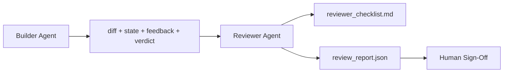

# Agente de la revisión: Constructor separado de Marker

> El agente que escribió el código no puede clasificarlo. Un revisor es un segundo bucle con un sistema diferente, un objetivo diferente y acceso solo a lectura a todo lo que el constructor produjo. La brecha entre el constructor y el revisor es donde vive la mayor fiabilidad.

**Type:** Build
**Languages:** Python (stdlib)
**Prerequisites:** Phase 14 · 38 (Verification Gate)
**Time:** ~55 minutes

## Objetivos de aprendizaje

- Explique por qué el mismo agente no puede revisar confiablemente su propio trabajo.
- Construir un bucle de agente de revisión que consuma artefactos de los constructores y emite un informe de revisión estructurado.
- Autor de una rubrica de revisores que califica dimensiones específicas, no vibraciones.
- Envía al revisor al escritorio para que el paso de revisión humana comience con un artefacto real.

## El problema

Se le pide al agente que arregle un error. Edita cuatro archivos, ejecuta las pruebas y los informes realizados. La puerta de verificación (fase 14 · 38) confirma la aceptación ejecutada y el alcance retenido.`passed: true`Dos días después descubres que la solución resolvió la mitad equivocada del error.

La aceptación es necesaria, no suficiente. El revisor hace las preguntas que la aceptación no puede hacer: ¿resolvió el problema correctamente? ¿amplió el alcance sin señalarlo? ¿documentó supuestos que debieron ser cuestionados? ¿Dejó el banco de trabajo en un estado que la próxima sesión puede recoger?

## El concepto



### Rubrico de revisores

Cinco dimensiones, cada una con un puntaje de 0 a 2.

| Dimension | Question |
|-----------|----------|
| Problem fit | Did the change solve the task as stated, not a nearby task? |
| Scope discipline | Were edits confined to the contract or was the contract grown deliberately? |
| Assumptions | Are all hidden assumptions written down somewhere reviewable? |
| Verification quality | Does the acceptance command actually prove the goal, or did it prove a weaker version? |
| Handoff readiness | Could the next session pick up cleanly from the current state? |

Un total de 10 es un fracaso suave, un fracaso bajo 5 es un fracaso duro.

### El revisor es un papel separado, no un modelo separado

El revisor puede ejecutarse con el mismo modelo que el constructor. La disciplina es la separación de roles: diferente sistema de respuesta, diferentes entradas, sin acceso de escritura a la diferencia. El cambio de postura es el cambio de señal.

### El revisor no puede editar la diferencia

El revisor lee la diferencia, el estado, la retroalimentación, el veredicto. Escribe un informe. No corrige la diferencia. Si el informe dice "correce esto", el siguiente turno de constructor hace la corrección; el revisor vuelve a la revisión.

### Rubrico de revisor frente a puerta de verificación

La puerta (fase 14 · 38) verifica los hechos deterministas: si se ha realizado la aceptación, si se han aprobado las reglas, si el alcance se aplica.

```figure
wb-builder-marker
```

## Construye el mismo

`code/main.py`los instrumentos:

- ¿ Qué es esto ?`ReviewerInputs`la clase de datos que agrupa los artefactos que lee el revisor.
- Un punteador de rubrica con una función por dimensión. Cada función es determinista y de grado de stub para la lección; las implementaciones reales llamarían un LLM.
- ¿ Qué es esto ?`review_report.json`El texto de la propuesta de directiva se refiere a la aplicación de la Directiva de la Comisión sobre la protección de las personas con discapacidad.`pass`¿ Qué ?`soft_fail`¿ Qué ?`hard_fail`¿Qué es lo que se hace?
- Dos casos de demostración: un cambio limpio y un cambio de "pruebas correctas, problema equivocado".

- ¿Qué quieres decir ?

```
python3 code/main.py
```

Producción: dos informes de revisión escritos en disco y una tabla de puntuaciones dimensionadas de la consola.

## Modelos de producción en la naturaleza

Los recibos: El sistema de revisión de código de IA de Cloudflare de abril de 2026 realizó 131.246 recensiones en 48,095 solicitudes de fusión en 5,169 repos en 30 días. La revisión mediana se completó en 3 minutos y 39 segundos. Hasta siete revisores especializados (seguridad, rendimiento, calidad del código, documentos, gestión de la liberación, cumplimiento, Código de Ingeniería) se ejecutaron en paralelo bajo un Coordinador de Revisión que deduplicó los hallazgos y juzgó la gravedad. Modelo de nivel superior reservado exclusivamente para el coordinador; los especialistas corrían en niveles más baratos.

Cuatro patrones hacen que esto funcione a escala.

**Specialist pool, not one big reviewer.**Una vez que la base de código tiene superficies de seguridad críticas, de rendimiento crítico y de documentos, se divide en especialistas con instrucciones más pequeñas. El coordinador hace la deduplicación; los especialistas nunca ejecutan la rubrica completa. Se escapa la separación de nivel de modelo: especialistas baratos, coordinador caro.

**Bias mitigation as design requirement, not optimization.**Los jueces de LLM muestran cuatro sesgos confiables (Adnan Masood, abril 2026): sesgo de posición (GPT-4 ~40% inconsistente en (A,B) vs (B,A) orden), sesgo de verbosidad (~15% de inflación de puntaje hacia resultados más largos), autopreferencia (los jueces prefieren resultados de la misma familia de modelos), autoridad (juzgan referencias de tasa excesiva a autores conocidos). Mitigations: evaluar ambos ordenes y sólo contar las victorias consistentes; utilizar escalas de 1 a 4 que premien explícitamente la concisión; rotar jueces a través de las familias de modelos; desprenderse de los nombres de los autores antes de marcar.

**Calibration set, not vibes.**Un conjunto histórico de 10 a 20 tareas con veredictos correctos conocidos. Ejecutar al revisor sobre él en cada cambio inmediato. Si el acuerdo con el registro histórico cae por debajo del 80%, la rúbrica necesita revisión antes de que el revisor envíe. Esto es lo que cada equipo finalmente redescubre; mejor comenzar con él.

**Hybrid norm with the gate.**La puerta de verificación (fase 14 · 38) maneja las verificaciones deterministas (hacía la aceptación, las pruebas pasaron, el alcance se mantuvo). El revisor maneja las verificaciones semánticas (si este era el trabajo correcto, se documentaban los supuestos, es la entrega utilizable). La guía de Anthropic 2026 es explícita en esta división: no pida al revisor que repita lo que la puerta ya prueba.

## Usalo

Modelos de producción:

- **Claude Code subagents.**Un subagente de revisores corre después de que el constructor cierra una tarea.
- **OpenAI Agents SDK handoffs.**El constructor entrega a la revisora la tarea terminada.
- **Two-model pairing.**El constructor se basa en un modelo más rápido y más barato.

El revisor es el segundo par de ojos que crece cuando los humanos no pueden hacer cada revisión por sí mismos.

## Envío

`outputs/skill-reviewer-agent.md`genera una rúbrica de revisor específica del proyecto, un material de agente de revisor conectado a los artefactos del constructor, y una integración con la puerta de verificación para que la revisión humana comience con un informe escrito en lugar de una página en blanco.

## Los ejercicios

1. Añadir una sexta dimensión específica a su dominio de producto.
2. ¿Cuál de las dos instrucciones del sistema (terse, verbose) produce un informe que es más probable que lea un ser humano?
3. Añadir un`confidence`El informe se rechaza cuando la confianza en la dimensión más baja es inferior a 0,6.
4. Construir un conjunto de calibración: 10 tareas históricas cerradas con veredictos correctos conocidos.
5. Añadir una oferta de "solicitar más pruebas": el revisor puede pedirle al constructor una prueba específica antes de marcar. ¿Cuál es la retroalimentación correcta para que esto no sea una bucle?

## Términos clave

| Term | What people say | What it actually means |
|------|----------------|------------------------|
| Reviewer rubric | "Checklist" | Five-dimension 0-2 scoring with a written question per dimension |
| Soft fail | "Needs revisions" | Total below 7; builder gets findings to address |
| Hard fail | "Reject" | Total below 5 or any dimension at 0; halt and surface to human |
| Role separation | "Different prompt" | Same model can be both roles; the discipline is inputs and posture |
| Confidence floor | "Don't ship low-signal reports" | Refuse to emit a verdict when the rubric is uncertain |

## Leer más

- [OpenAI Agents SDK handoffs](https://openai.github.io/openai-agents-python/handoffs/)
- [Anthropic Claude Code subagents](https://code.claude.com/docs/en/sub-agents)
- [Cloudflare, Orchestrating AI Code Review at Scale](https://blog.cloudflare.com/ai-code-review/) 7 especialistas + arquitectura coordinadora, 131 mil carreras / 30 días
- [Agent-as-a-Judge: Evaluating Agents with Agents (OpenReview / ICLR)](https://openreview.net/forum?id=DeVm3YUnpj) Indicador de referencia de DevAI, 366 requisitos de solución jerárquica
- [Adnan Masood, Rubric-Based Evaluations and LLM-as-a-Judge: Methodologies, Biases, Empirical Validation](https://medium.com/@adnanmasood/rubric-based-evals-llm-as-a-judge-methodologies-and-empirical-validation-in-domain-context-71936b989e80) los 4 prejuicios y mitigations
- [MLflow, LLM-as-a-Judge Evaluation](https://mlflow.org/llm-as-a-judge) herramientas de producción para constructor/evaluador separado
- [LangChain, How to Calibrate LLM-as-a-Judge with Human Corrections](https://www.langchain.com/articles/llm-as-a-judge) Flujo de trabajo de calibración
- [Evidently AI, LLM-as-a-judge: a complete guide](https://www.evidentlyai.com/llm-guide/llm-as-a-judge)
- [Arize, LLM as a Judge — Primer and Pre-Built Evaluators](https://arize.com/llm-as-a-judge/)
- Fase 14 · 05  Auto-refinado y crítico (linia de base de auto-revisas de un solo agente)
- Fase 14 · 30  Desarrollo de agente Eval-driven (generador de conjunto de calibración)
- Fase 14 · 38  la puerta de verificación que el revisor lee
- Fase 14 · 40  el paquete de entrega que el informe del revisor alimenta
