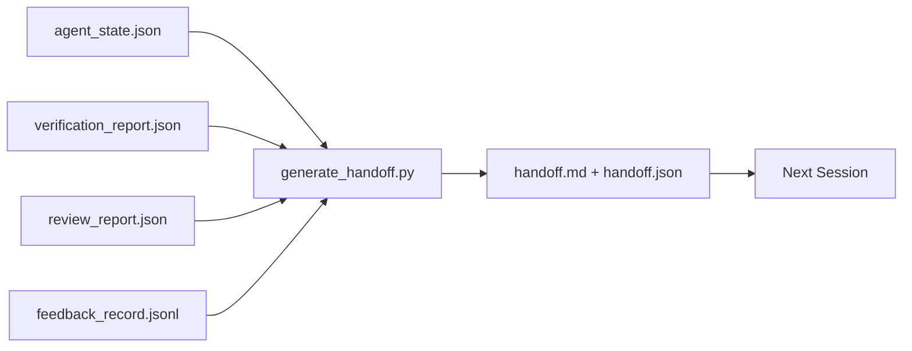

# Transmisión de varias sesiones

> El paquete de entrega es el artefacto que convierte "el agente trabajó durante una hora" en "la próxima sesión es productiva en el primer minuto".

**Type:** Build
**Languages:** Python (stdlib)
**Prerequisites:** Phase 14 · 34 (Repo Memory), Phase 14 · 38 (Verification), Phase 14 · 39 (Reviewer)
**Time:** ~50 minutes

## Objetivos de aprendizaje

- Identifique los siete campos que cada paquete de entrega necesita.
- Generar una transmisión de los artefactos del escritorio sin prosa escrita a mano.
- Trim grandes registros de retroalimentación en un resumen de tamaño de entrega.
- Haga que la primera acción de la próxima sesión sea determinista.

## El problema

El agente dice: "Gran, hemos progresado". La siguiente sesión se abre. El siguiente agente pregunta: "¿Dónde terminamos?" La respuesta del primer agente se ha ido. El siguiente agente redescubre, vuelve a ejecutar los mismos comandos, vuelve a hacer a los humanos las mismas preguntas, y quema treinta minutos recuperando los últimos treinta segundos de la sesión anterior.

El costo de una mala entrega se paga en cada sesión durante la vida de la tarea. La corrección es un paquete generado automáticamente al final de la sesión: qué cambió, por qué, qué se intentó, qué falló, qué queda, qué hacer primero la próxima vez.

## El concepto



### Siete campos que cada entrega lleva

| Field | Question it answers |
|-------|---------------------|
| `summary` | One paragraph of what was done |
| `changed_files` | The diff at a glance |
| `commands_run` | What was actually executed |
| `failed_attempts` | What was tried and why it did not work |
| `open_risks` | What could bite next session, with severity |
| `next_action` | The first concrete step next session takes |
| `verdict_pointer` | Path to the verification + review reports |

El `next_action`El campo es el que lleva la carga.`next_action`Es un informe de estado, no una entrega.

### Las entregas se generan, no se escriben

Una entrega escrita a mano es una entrega que se saltan en un día duro. El generador lee los artefactos del escritorio y emite el paquete. El trabajo del agente es dejar el escritorio en un estado que el generador pueda resumir, no escribir el resumen.

### Dos formas: legibles por el hombre y legibles por la máquina

`handoff.md`es lo que el humano lee. `handoff.json`Si se desvían, el JSON gana.

### Recortes de registro de retroalimentación

El completo`feedback_record.jsonl`La entrega lleva sólo la última K más cada entrada con una salida no cero. La siguiente sesión carga el registro completo si es necesario, pero el paquete se mantiene pequeño.

### Deja un estado limpio

Una entrega describe el trabajo. Un estado limpio hace que el trabajo sea reiniciable. No son lo mismo.`handoff.md`El siguiente agente pasa sus primeros diez minutos limpiando después del último en lugar de construir, y el costo compone cada sesión para la vida de la tarea.

Así que la sesión no termina cuando la función funciona. Se termina cuando el banco de trabajo está en un estado que el generador puede resumir y la próxima sesión puede confiar. La limpieza es su propia fase, se ejecuta antes de la entrega, y es un cheque, no un hábito, porque un hábito es lo que se saltan en un día difícil.

| Check | Clean means | Dirty blocks because |
|-------|-------------|----------------------|
| Working tree | Every change committed or explicitly stashed with a note | A half-applied diff looks like intentional work to the next agent |
| Temp artifacts | No `*.tmp`, scratch dirs, debug prints, or commented-out blocks left behind | Stray files pollute the diff and the next agent's mental model |
| Tests | Green, or red with the failure named in `open_risks` | A silent red test is a trap the next session steps in |
| Feature board | `feature_list.json` status reflects reality (Phase 14 · 36) | A stale board sends the next session to work that is already done |
| Branch | On the expected branch, no detached HEAD, no orphan branches | Wrong branch means the next session's first commit lands in the wrong place |

La fase de limpieza emite una`clean_state.json`Una lista vacía es la condición previa que el generador de entrega afirma antes de escribir un paquete. Una entrega construida en un árbol sucio no es una entrega, es un desorden reenviado. Los dos artefactos pareja: limpieza prueba que el escritorio es seguro de salir, la entrega prueba que la próxima sesión sabe dónde comenzar.

```figure
wb-handoff-packet
```

## Construye el mismo

`code/main.py`los instrumentos:

- Un cargador que reúne estado, veredicto, revisión y retroalimentación en un solo `WorkbenchSnapshot`¿ Qué ?
- ¿ Qué es esto ?`generate_handoff(snapshot) -> (markdown, payload)`La función.
- Un filtro que selecciona las últimas entradas de retroalimentación K más todas las salidas no cero.
- Una demostración que escribe`handoff.md`y `handoff.json`junto al guión.

- ¿Qué quieres decir ?

```
python3 code/main.py
```

Fuente: un cuerpo impreso de entrega, más ambos archivos en disco.

## Modelos de producción en la naturaleza

Codex CLI, Claude Code y OpenCode envían cada uno una historia de compactación diferente; el paquete de entrega estructurado se encuentra encima de los tres.

**Compaction strategies vary; the packet schema does not.**El POST /v1/respuestas/compact del Codex CLI es un blob AES opaco del lado del servidor (camino rápido para los modelos OpenAI); el fallback es un "resumen de la oferta" local añadido como un `_summary`Claude Code ejecuta una compactación progresiva de cinco etapas en 95% del contexto. OpenCode hace un mensaje de ocultamiento basado en sello de tiempo más un resumen de LLM de 5 títulos. Tres mecanismos diferentes, la misma necesidad: serializar lo que sobrevive a la compresión en un artefacto portátil. El paquete es ese artefacto.

**Fresh-session handoff is not compaction.**La compactación prolonga una sesión; la entrega cierra una limpiamente y comienza la siguiente. El marco de la edición de Hermes #20372 (abril 2026) es correcto: cuando la compresión en el lugar comienza a degradarse, el agente debe escribir una entrega compacta, terminar la sesión y reanudar en un contexto nuevo. El paquete es lo que hace que esa transición sea barata. El error es seguir comprimiendo hasta que la calidad se desploma; la solución es presupuestar una entrega temprana y limpia.

**One active handoff per branch and topic.**La coordinación multiagente se rompe más en las entregas obsoletas que en la producción de mal modelo.`branch`¿ Qué ?`last_known_good_commit`, y un `status`de `active | superseded | archived`Las entregas estatales se archivan; sólo la activa impulsa la siguiente sesión. Esta es la diferencia entre las entregas como notas y las entregas como estado.

**Wrap up before 50-75% context, not at the wall.**El manual de juego de patrones escrito a mano (CLAUDE.md + HANDOVER.md) informa los mejores resultados cuando la sesión termina en un presupuesto de contexto del 50-75% en lugar del 95%. El generador de paquetes se ejecuta limpio antes de que los artefactos de compresión contaminen el estado de origen. Es barato escribir mientras el contexto está intacto; caro cuando el modelo ya está perdiendo su lugar.

## Usalo

Modelos de producción:

- **Session-end hook.**El tiempo de ejecución enciende el generador cuando el usuario cierra el chat.`outputs/handoff/<session_id>/`¿ Qué ?
- **PR template.**El generador también es un organismo de relaciones públicas.
- **Cross-agent handoff.**Construir con un producto (Código Claude), continuar con otro (Código).

El paquete es pequeño, regular y barato de producir.

## Envío

`outputs/skill-handoff-generator.md`produce un generador sintonizado con los caminos de artefactos de un proyecto, un gancho de final de sesión que lo ejecuta, y un `handoff.json`El siguiente agente lee el esquema en el inicio.

## Los ejercicios

1. Añadir un`assumptions_to_validate`campo que aparece en cada suposición que el constructor registró pero el revisor no anotó más de 1.
2. Trim el resumen de retroalimentación de manera diferente para las carreras fallidas versus las pasadas.
3. Incluye una lista de "preguntas para el ser humano". ¿Cuál es el umbral para que una pregunta se incluya en el paquete versus en un mensaje de chat?
4. Haga que el generador sea idempotente: ejecutarlo dos veces produce el mismo paquete. ¿Qué necesita ser estable para que se mantenga?
5. Añadir una sección "Precedentes de la próxima sesión" que enumere exactamente los artefactos que la próxima sesión debe cargar antes de actuar.

## Términos clave

| Term | What people say | What it actually means |
|------|----------------|------------------------|
| Handoff packet | "Session summary" | Generated artifact carrying the seven fields, both markdown and JSON |
| Next action | "What to do first" | The one concrete step that starts the next session |
| Feedback trim | "Log summary" | Last K records plus every non-zero exit |
| Status report | "What we did" | A document missing `next_action`; useful, but not a handoff |
| Verdict pointer | "Receipt" | Path to the verification + review reports for traceability |

## Leer más

- [Anthropic, Effective harnesses for long-running agents](https://www.anthropic.com/engineering/effective-harnesses-for-long-running-agents)
- [OpenAI Agents SDK handoffs](https://openai.github.io/openai-agents-python/handoffs/)
- [Codex Blog, Codex CLI Context Compaction: Architecture, Configuration, Managing Long Sessions](https://codex.danielvaughan.com/2026/03/31/codex-cli-context-compaction-architecture/) POST /v1/respuestas/compacto y retroceso local
- [Justin3go, Shedding Heavy Memories: Context Compaction in Codex, Claude Code, OpenCode](https://justin3go.com/en/posts/2026/04/09-context-compaction-in-codex-claude-code-and-opencode) Comparación de compactación entre tres proveedores
- [JD Hodges, Claude Handoff Prompt: How to Keep Context Across Sessions (2026)](https://www.jdhodges.com/blog/ai-session-handoffs-keep-context-across-conversations/) CLAUDE.md + HANDOVER.md, presupuesto de contexto del 50 al 75%
- [Mervin Praison, Managing Handoffs in Multi-Agent Coding Sessions: Fresh Context Without Losing Continuity](https://mer.vin/2026/04/managing-handoffs-in-multi-agent-coding-sessions-fresh-context-without-losing-continuity/) Enmarcamiento de sistemas distribuidos
- [Hermes Issue #20372 — automatic fresh-session handoff when compression becomes risky](https://github.com/NousResearch/hermes-agent/issues/20372)
- [Hermes Issue #499 — Context Compaction Quality Overhaul](https://github.com/NousResearch/hermes-agent/issues/499) Propuestas orientadas a la entrega en el Codex CLI
- [Microsoft Agent Framework, Compaction](https://learn.microsoft.com/en-us/agent-framework/agents/conversations/compaction)
- [OpenCode, Context Management and Compaction](https://deepwiki.com/sst/opencode/2.4-context-management-and-compaction)
- [LangChain, Context Engineering for Agents](https://www.langchain.com/blog/context-engineering-for-agents)
- Fase 14 · 34  el archivo de estado que el generador lee
- Fase 14 · 38  el veredicto de verificación los paquetes apuntan a
- Fase 14 · 39  el informe del revisor en conjunto con el paquete
