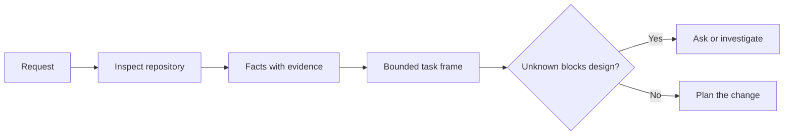

# Enmarca la tarea antes de que el agente escriba código

> Un agente de codificación puede implementar una tarea clara rápidamente. También puede implementar una tarea poco clara rápidamente. La velocidad es la misma. El costo no es.

**Type:** Learn + Build
**Languages:** Python (stdlib)
**Prerequisites:** Phase 14 lessons 31 and 36
**Time:** ~60 minutes

## Objetivos de aprendizaje

- Convierta una solicitud en un marco de tareas limitado antes de editar.
- Separar los hechos de los repositorios de las suposiciones y las preguntas abiertas.
- Definir los caminos permitidos, los caminos prohibidos y la evidencia de aceptación.
- Decida cuándo el reconocimiento es suficiente para comenzar el trabajo.

## El costoso fracaso

 Añadir protección de correo electrónico duplicado suena específico. No lo es. ¿Es la singularidad parte de la API, servicio de dominio o base de datos? ¿Es la comparación sensible a los casos? ¿Qué forma de error ya es pública? ¿Es permitida una migración? ¿Qué prueba prueba demuestra el comportamiento?

Un agente capaz llenará esos vacíos con opciones plausibles. Ese es el caso peligroso porque la implementación puede ser limpia, probada y aún incompatible con el sistema.

La primera unidad de trabajo de agente de codificación no es, por lo tanto, una edición, sino un marco de tareas respaldado por pruebas de repositorio.

## El marco de tareas

Un marco útil tiene seis campos:

| Field | Question |
|---|---|
| Goal | What observable behavior must change? |
| Repository facts | What did you verify in code, tests, config, or history? |
| Allowed paths | Where may the change land? |
| Forbidden paths | What must remain untouched? |
| Acceptance evidence | Which commands or observations prove the goal? |
| Unknowns | Which decisions still need evidence or human judgment? |

Los datos necesitan recibos. La API utiliza 409 para duplicados no es un hecho hasta que puedas señalar la prueba o el procesador existente. Un camino de archivo y una línea son suficientes. Un resultado de comando es mejor cuando el comportamiento importa.



## El reconocimiento es una búsqueda de limitaciones

No lea todo el repositorio. Busque las superficies que restringen el cambio:

1. El comportamiento actual y su llamador.
2. El más cercano de los ensayos existentes.
3. El contrato público o la forma serializada.
4. Las instrucciones del proyecto que rigen el camino.
5. Los comandos de construcción y verificación.
6. Cambios similares completados que revelan patrones locales.

Dejar de tomar decisiones cuando cada decisión planeada está respaldada por pruebas, delegada explícitamente o lista como desconocida.

## Lo desconocido no es un fracaso

Un desconocido es una brecha controlada. Una suposición es una respuesta no controlada a esa brecha.

Clasifique cada desconocido:

- **Discoverable:**el repositorio o el sistema de ejecución pueden responderlo.
- **Decidable:**el contrato de tarea otorga al agente la autoridad para elegir.
- **Human:**la elección cambia el comportamiento del producto, el costo, el riesgo o la compatibilidad pública.
- **Deferred:**La elección está fuera de esta franja y pertenece a los no objetivos.

El agente debe continuar a través de los desconocidos descubrebles y delegados.

## Acceptar antes de la aplicación

Escriba la prueba antes del parche.

- un comando de ensayo de unidad o integración enfocado;
- un viaje en el navegador con un puerto de visión denominado y el estado esperado;
- una solicitud electrónica y un contrato de respuesta exacta;
- una medición de rendimiento con un umbral;
- una verificación del alcance que confirme que no se ha modificado ningún archivo no relacionado.

Cumplir las pruebas no es un plan de prueba.

## Construye el mismo

El laboratorio crea una`TaskFrame`, valida sus límites y pruebas, y escribe `outputs/task-frame.md`¿ Qué ?

Corre desde este directorio de lecciones:

```bash
python3 code/main.py
python3 -m unittest discover code/tests -v
```

Descompone el ejemplo de cuatro maneras: elimine el objetivo, elimine un recibo de hechos, superpone un camino permitido y prohibido y elimine el comando de aceptación. El validador debe rechazar cada marco por una razón diferente.

## Usalo en un verdadero depósito

Antes de pedirle a un agente que edite:

1. Escribe el objetivo como un comportamiento, no un cambio de archivo.
2. Registra dos o tres hechos con pruebas exactas.
3. Nombre el conjunto de rutas más pequeño permitido.
4. Nombre el espacio negativo explícitamente.
5. Escriba el comando o observación que cierra la tarea.
6. Enumera las decisiones que aún no has tomado.

El marco debe encajar en una pantalla. Si no puede, la tarea puede contener múltiples cambios verificables de forma independiente.

## Los ejercicios

1. Enmarca un error real de uno de tus repositorios sin proponer una solución.
2. Encuentra una afirmación en el marco que sea en realidad una suposición y reemplazala con evidencia.
3. Añadir un humano desconocido cuya respuesta cambiaría el contrato público.
4. Divide un camino amplio permitido en el conjunto de seguridad más pequeño.
5. Añadir un recibo de alcance a la prueba de aceptación.

## Leer más

- [Nuseibeh and Easterbrook, Requirements Engineering: A Roadmap](https://www.cs.toronto.edu/~sme/papers/2000/ICSE2000.pdf), para anclar la aplicación a los objetivos del mundo real y las limitaciones en evolución.
- [Yang et al., SWE-agent: Agent-Computer Interfaces Enable Automated Software Engineering](https://arxiv.org/abs/2405.15793), para demostrar que la interfaz alrededor de un agente codificador cambia su eficacia.

## Lo que guardas

Mantenga .`outputs/task-frame.md`Es la entrada a la siguiente lección, donde el marco se convierte en un plan de ejecución respaldado por la evidencia.
