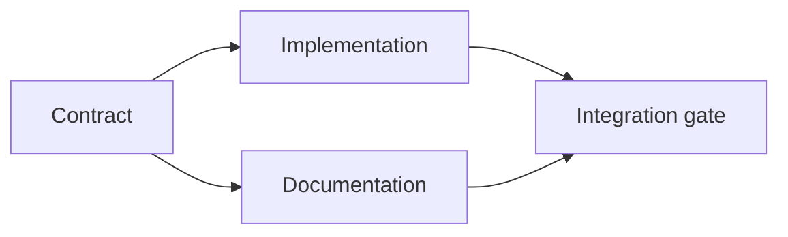

# Construye un plan de ejecución basado en pruebas

> Un plan no es una lista de tareas más bonita, es un gráfico de dependencia en el que cada cambio tiene una razón y cada nodo terminal tiene una prueba.

**Type:** Learn + Build
**Languages:** Python (stdlib)
**Prerequisites:** Phase 14 lesson 43
**Time:** ~65 minutes

## Objetivos de aprendizaje

- Convierta un marco de tarea en elementos de trabajo con evidencia y prueba.
- El ordenamiento de modelos como dependencias en lugar de secuencia de prosa.
- Detectar hechos faltantes, dependencias desconocidas y ciclos antes de editar.
- Específicos que pueden correr juntos y otros que deben esperar.

## Por qué fracasan los planes de los agentes

Los planes débiles repiten la solicitud en el tiempo futuro:

1. Actualice la API.
2. Añadir pruebas.
3. Actualizar la documentación.

Nada en esa lista dice lo que se encontró, por qué esos archivos son correctos, qué contrato cambia primero, o qué puede suceder simultáneamente.

Un plan sólido establece cinco compromisos para cada elemento de trabajo:

| Commitment | Purpose |
|---|---|
| Identifier | Stable reference for dependencies and handoff |
| Change | The smallest behavior or contract change |
| Evidence | Repository facts that justify the change |
| Dependencies | Work that must be true first |
| Proof | The exact check that closes the item |

## Planifique el contrato antes de su ejecución

Cuando varias superficies dependen del mismo comportamiento, definen el comportamiento primero. Las pruebas, la implementación, la documentación y la integración pueden compartir un contrato en lugar de inventar cuatro versiones.



El gráfico expone la concurrencia segura. La implementación y la documentación pueden proceder juntos después de que se fije el contrato.

## La evidencia cambia el plan

La evidencia de los repositorios no es decoración, debe ser capaz de cambiar la obra:

- Un ayudante existente elimina una nueva abstracción planeada.
- Una prueba de compatibilidad obliga a una migración.
- Una restricción de implementación traslada un cambio de esquema a otra tarea.
- Un tipo de respuesta pública cambia el orden de ejecución y documentación.

Si la evidencia no puede cambiar el plan, probablemente no sea evidencia para esa decisión.

## Diseño para interrupciones

Las sesiones de agente de codificación terminan inesperadamente.

- cuál artículo está completo;
- que prueba se ha presentado;
- los objetos que hayan cambiado;
- las dependencias que se desbloquean ahora;
- ¿Cuál es el próximo elemento seguro?

No codifique el estado sólo en las casillas de verificación dentro de un chat.

## Validación del plan

Rechazar el plan antes de su ejecución cuando:

- se duplicará un identificador;
- un artículo de trabajo no tiene pruebas;
- un artículo de trabajo no tiene prueba;
- una dependencia nombra un elemento desconocido;
- el gráfico contiene un ciclo;
- la primera acción irreversible se produce antes de que se resuelva la incertidumbre pertinente.

Las primeras cinco verificaciones son mecánicas, la última requiere juicio y debe ser expresamente convocada.

## Construye el mismo

`code/main.py`Modela los elementos de trabajo, valida sus recibos, calcula las ondas de ejecución con una clasificación topológica y escribe `outputs/evidence-plan.json`¿ Qué ?

- ¿Qué quieres decir ?

```bash
python3 code/main.py
python3 -m unittest discover code/tests -v
```

El ejemplo produce tres ondas. La definición de contrato se ejecuta primero. La implementación y la documentación se ejecutan juntos. La puerta de integración se ejecuta después.

## Usalo con un agente de codificación

Pídale al agente que produzca el plan antes de cambiar los archivos.

1. Cada reclamo de camino y comportamiento tiene un recibo de depósito.
2. Cada artículo tiene una prueba clara de finalización.
3. El gráfico retrasa el trabajo costoso o irreversible hasta que se resuelva la incertidumbre de la que depende.

Aprueba el plan, no una vaga promesa de ser cuidadoso.

## Los ejercicios

1. Añadir un elemento de migración que requiera la aprobación humana explícita.
2. Crea un ciclo y explica el desacuerdo oculto de producto detrás de él.
3. Divide un elemento que tiene dos comandos de prueba.
4. Añadir un elemento de trabajo que puede ejecutarse en la segunda ola sin tocar ninguna de las ramas existentes.
5. Render el plan como Markdown mientras se mantiene JSON como la fuente de la verdad.

## Leer más

- [Nuseibeh and Easterbrook, Requirements Engineering: A Roadmap](https://www.cs.toronto.edu/~sme/papers/2000/ICSE2000.pdf), para la relación iterativa entre objetivos, especificaciones, acuerdo y evolución.
- [Barry Boehm, A Spiral Model of Software Development and Enhancement](https://dl.acm.org/doi/10.1145/12944.12948), para ordenar el desarrollo en torno a la resolución de riesgos en lugar de una secuencia lineal fija.

## Lo que guardas

Mantenga .`outputs/evidence-plan.json`Se convierte en el contrato de delegación en la próxima lección.
