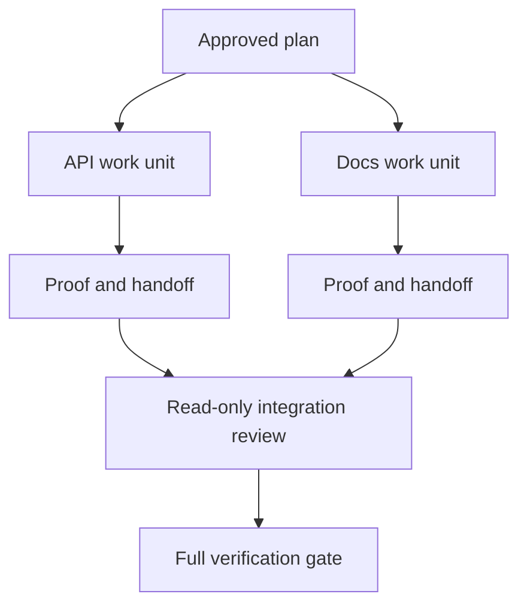

# El agente delegado trabaja con contratos de aislamiento y fusiones

> Los agentes paralelos ahorran tiempo en la pared sólo cuando el trabajo es independiente, de lo contrario convierte una tarea clara en un problema de coordinación con una tasa de fallo más rápida.

**Type:** Learn + Build
**Languages:** Python (stdlib)
**Prerequisites:** Phase 14 lessons 39 and 44
**Time:** ~70 minutes

## Objetivos de aprendizaje

- Decidir si la delegación está justificada por una independencia real.
- Dar a cada trabajador la propiedad exclusiva del archivo y la prueba explícita.
- Las ondas de ejecución de la computación de dependencias.
- Diseñar un contrato de fusión para combinar el trabajo de los agentes de forma segura.

## La prueba de paralelismo

No delegue porque hay más agentes disponibles. Delegue cuando al menos uno de estos es cierto:

- dos investigaciones pueden responder de forma independiente a diferentes incógnitas;
- dos implementaciones poseen expedientes y contratos distintos;
- un revisor podrá inspeccionar un artefacto terminado sin modificarlo;
- un control externo lento puede ejecutarse mientras se continúa el trabajo local.

Mantenga el trabajo en serie cuando los agentes necesitan los mismos archivos, la misma decisión no resuelta o el mismo entorno mutante.

## Una unidad de trabajo es un contrato

Cada unidad delegada necesita:

| Field | Meaning |
|---|---|
| Goal | One observable result |
| Owner | One accountable worker |
| Paths | Exclusive write ownership |
| Dependencies | Completed units required before starting |
| Proof | Exact evidence returned to the integrator |
| Handoff | Files changed, decisions made, remaining risk |

Hermanejar el backend no es una unidad de trabajo. Implementar el control de duplicados `app/accounts.py`y probarlo con la prueba de cuenta enfocada es.

## El aislamiento tiene tres capas

1. **Filesystem isolation:**Los árboles de trabajo o cajas de arena separados impiden las modificaciones compartidas accidentalmente.
2. **Ownership isolation:**Los contratos impiden que dos trabajadores editen intencionalmente el mismo camino.
3. **State isolation:**Los registros y las salidas separados impiden que un trabajador sobreescribes la evidencia de otro trabajador.

El aislamiento del sistema de archivos no resuelve la propiedad. Dos árboles de trabajo limpios pueden producir diseños contradictorios. El contrato de fusión debe resolver las interfaces compartidas antes de que comience el trabajo.



## El integrador no reconstruye la obra

El integrador deberá:

1. confirmar que cada entrega coincide con su ámbito de aplicación asignado;
2. leer la prueba de salida, no sólo el resumen del trabajador;
3. combinar cambios en el orden de dependencia;
4. ejecutar la puerta transversal completa de la unidad;
5. rechazar la expansión oculta del alcance;
6. registrar conflictos como nuevas decisiones, no como modificaciones silenciosas.

Si la integración requiere reescribir la mayor parte del resultado de un trabajador, la descomposición original fue incorrecta.

## Los papeles de los humanos y los agentes

La delegación no elimina el juicio humano. El humano todavía posee opciones que cambian el comportamiento público, el riesgo, la autoridad o el costo irreversible.

Se trata de una autonomía calibrada: el sistema otorga libertad cuando las pruebas y el retroceso son fuertes, y requiere un punto de control cuando las consecuencias son altas.

## Construye el mismo

El laboratorio verifica la superposición de trayectorias, valida las dependencias, calcula ondas de ejecución seguras y escribe `outputs/delegation-plan.json`¿ Qué ?

- ¿Qué quieres decir ?

```bash
python3 code/main.py
python3 -m unittest discover code/tests -v
```

Cambiar la unidad de doc para poseer `app/`El plan debe bloquearse porque esa ruta matriz se superpone a la unidad de API.

## Los ejercicios

1. Descompone un cambio real en dos unidades de trabajo independientes y un integrador.
2. Encuentra una división paralela propuesta que sólo parezca independiente.
3. Añadir un trabajador de investigación que sólo pueda leer y cuya salida sea una tabla de hechos.
4. Añadir una puerta de fusión que compruebe el conjunto final de archivos cambiados contra todos los contratos unitarios.
5. Define una regla de cancelación para un trabajador cuya dependencia se vuelve inválida.

## Leer más

- [Reid Smith, The Contract Net Protocol](https://doi.org/10.1109/TC.1980.1675516), para un tratamiento formal temprano de la asignación de tareas distribuidas y la presentación de informes de resultados.
- [Eric Horvitz, Principles of Mixed-Initiative User Interfaces](https://dl.acm.org/doi/10.1145/302979.303030), para decidir cuándo la automatización debe actuar y cuándo debe devolver el control a una persona.

## Lo que guardas

Mantenga .`outputs/delegation-plan.json`En él se registra por qué la división es segura, quién es el dueño de cada camino y qué pruebas debe recibir la integración.
