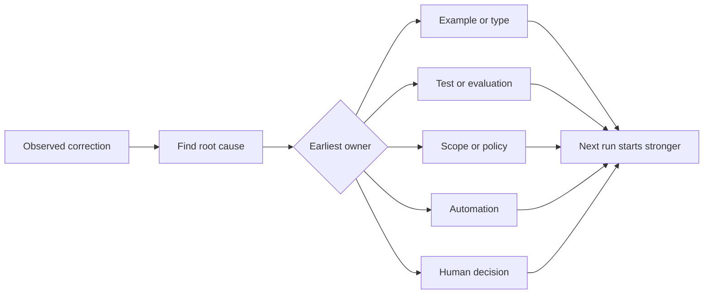

# Convierte cada corrección de agente en una mejora del sistema

> Una corrección que sólo se encuentra en el chat corrige una ejecución. Una corrección promovida a una prueba, límite, ejemplo o herramienta mejora cada ejecución posterior.

**Type:** Learn + Build
**Languages:** Python (stdlib)
**Prerequisites:** Phase 14 lessons 37 to 41
**Time:** ~65 minutes

## Objetivos de aprendizaje

- Convierta las correcciones de agente en controles duraderos.
- Coloque cada control en la capa más temprana que pueda prevenir la recurrencia.
- Desdobla las lecciones repetidas con huellas dactilares estables.
- Retirar controles que ya no protegen un riesgo real.

## Las correcciones son evidencia

Cuando le dices a un agente que no edite ese archivo, has aprendido que el límite de alcance no era ejecutable. Cuando dices que esta forma de salida está equivocada, has aprendido que faltó un ejemplo o prueba. Cuando la configuración falla de nuevo, has aprendido que el conocimiento del entorno pertenece a la automatización.

Trata la corrección como una observación sobre el sistema de trabajo, no como un error de escritura.

## Promoverse a la capa más temprana eficaz

Utilice este orden:

| Recurring failure | Durable destination |
|---|---|
| Wrong result or regression | Test or evaluation |
| Off-scope or unsafe action | Scope or permission policy |
| Repeated setup or command mistake | Automation or tool |
| Repeated output-format mistake | Canonical example plus validator |
| Ambiguous local convention | Instruction with a scenario check |
| Product disagreement | Human decision record |

Un tipo que evita un estado inválido es más fuerte que un comentario de revisión que lo capta después. Una prueba enfocada es más fuerte que un párrafo que pide al agente que recuerde.



## El registro de Ratchet

Captura:

- síntoma;
- la causa raíz;
- consecuencia;
- el número de recurrencias;
- el control elegido;
- la verificación para el control;
- el propietario;
- fecha para revisarlo o retirarlo.

No promueva cada preferencia única, sino que se promueve una corrección cuando la recurrencia o la consecuencia justifiquen una complejidad permanente.

## Causa y síntoma separados

El agente editado README es un síntoma.

- la tarea permitió la raíz del repositorio;
- los documentos se consideraron implícitamente seguros;
- la ejecución y documentación del plan en conjunto;
- dos trabajadores tenían propiedad superpuesta.

Cada causa pertenece a un control diferente, y una regla que simplemente repite el síntoma fallará en el siguiente caso ligeramente diferente.

## Los controles también se desmoronan

Los controles antiguos pueden entrar en conflicto, inflar el contexto y codificar un sistema que ya no existe.

- la arquitectura subyacente cambió;
- se sustituye por un control ejecutable más fuerte;
- el fallo no se ha repetido en una ventana significativa;
- El control crea más fricción que el riesgo que evita.

El objetivo no es el archivo de instrucciones más largo, sino el sistema más pequeño que preserva el juicio ganado con dificultad.

## Construye el mismo

El laboratorio clasifica las correcciones, las promueve en controles, duplica las huellas dactilares y escribe.`outputs/feedback-ratchet.json`¿ Qué ?

- ¿Qué quieres decir ?

```bash
python3 code/main.py
python3 -m unittest discover code/tests -v
```

Añadir dos correcciones con diferentes formulaciones con la misma causa. Mejorar la normalización hasta que se desmoronan en un control sin colapsar fallas no relacionadas.

## Los ejercicios

1. Toma cinco correcciones de una sesión reciente de codificación y clasifica sus verdaderos propietarios.
2. Sustituye una regla en prosa por una prueba ejecutable.
3. Añadir una ponderación de consecuencias para que una primera aparición grave pueda ser promovida inmediatamente.
4. Añadir un propietario y fecha de jubilación a la salida del laboratorio.
5. Revise una instrucción de agente existente y borra sólo después de demostrar que existe un control más fuerte.

## Leer más

- [Basili, Caldiera, and Rombach, The Goal Question Metric Approach](https://www.cs.toronto.edu/~sme/CSC444F/handouts/GQM-paper.pdf), para convertir los objetivos en preguntas y mediciones operativas.
- [Shinn et al., Reflexion](https://arxiv.org/abs/2303.11366), para utilizar rastros de retroalimentación para mejorar las decisiones posteriores sin cambiar los pesos del modelo.
- [Madaan et al., Self-Refine](https://arxiv.org/abs/2303.17651), para la retroalimentación iterativa y revisión dentro de un bucle de tareas.

## Lo que guardas

Mantenga .`outputs/feedback-ratchet.json`Es el final duradero del camino de la ingeniería asistida por agentes y la entrada a futuras modificaciones en el banco de trabajo.
