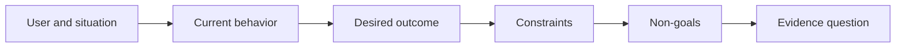

# Definir el resultado antes de elegir el resultado

> La aplicación rápida aumenta la pena por elegir el problema equivocado.

**Type:** Learn + Build
**Languages:** Python (stdlib)
**Prerequisites:** None
**Time:** ~60 minutes

## Objetivos de aprendizaje

- Escriba un marco de resultado sin nombrar una solución.
- Identifique al usuario, la situación, el comportamiento actual y el cambio deseado.
- Hacer explícitas las restricciones y los no objetivos.
- Detectar una fuga de solución antes de que se endurezca en el alcance.

## El resultado no es el resultado

Construir un asistente de incidentes nombra una salida. No dice quién la necesita, qué mejora o qué debe permanecer seguro.

Un marco de resultados dice:

> Cuando llega una alerta de producción, el ingeniero en llamada identifica el servicio fallido y una próxima acción segura en un plazo de dos minutos, mientras que el diagnóstico permanece solo de lectura y auditable.

Esa frase puede ser satisfecha por un software, un libro de ejecución, una reparación de datos o un cambio más pequeño de interfaz.

## El marco de seis partes

| Part | Question |
|---|---|
| User | Who experiences the problem directly? |
| Situation | When and where does it occur? |
| Current behavior | What happens today, including workarounds? |
| Desired outcome | What observable state should improve? |
| Constraints | Which safety, policy, cost, or compatibility limits are fixed? |
| Non-goals | What tempting adjacent work is excluded? |



## Encontrar una solución

Las declaraciones de resultados filtran soluciones cuando contienen una forma de producto, interfaz, elección de modelo, marco o arquitectura que no se ha obtenido por evidencia.

- Los usuarios reciben un resumen semanal de IA filtra el resumen y la cadencia.
- Los usuarios entienden los cambios de cuentas antes de que la aprobación indique el resultado.
- Deploye una base de datos vectorial filtraciones de infraestructura.
- La evidencia de políticas pertinentes está disponible durante la revisión afirma una capacidad.

Las restricciones pueden nombrar la tecnología cuando la compatibilidad realmente la arregla.

## Las restricciones protegen el resultado

Las restricciones no son detalles de implementación, son parte del objetivo del mundo real:

- No hay producción que escriba durante el diagnóstico;
- la respuesta dentro del presupuesto de tiempo de incidente;
- los eventos de auditoría existentes siguen siendo autorizados;
- no hay nueva dependencia del tiempo de ejecución;
- El comportamiento de accesibilidad se mantiene intacto.

Una construcción que alcanza el resultado violando una restricción no ha alcanzado el resultado.

## Los objetivos no crean límites

Los objetivos no útiles impiden que una pieza útil se convierta en una plataforma.

- no se realizará ninguna reparación automática;
- no hay nuevo sistema de enrutamiento de alerta;
- no sustituir al comandante incidente;
- No hay análisis históricos en esta rebanada.

## Construye el mismo

El laboratorio valida una`OutcomeFrame`y escribe.`outputs/outcome-frame.json`¿ Qué ?

```bash
python3 code/main.py
python3 -m unittest discover code/tests -v
```

Reemplazar el resultado deseado con utilizar el asistente de incidente. El validador debe señalar que la salida propuesta se filtró en el resultado.

## Los ejercicios

1. Reescriba una solicitud de características de su backlog como un marco de resultado.
2. Añadir una restricción que cambie las soluciones que siguen siendo posibles.
3. Añadir dos no objetivos que mantengan la primera rebanada pequeña.
4. Identifique la observación más temprana que contradija el resultado deseado.
5. Escriba tres resultados diferentes que podrían satisfacer el mismo resultado.

## Leer más

- [Nuseibeh and Easterbrook, Requirements Engineering: A Roadmap](https://www.cs.toronto.edu/~sme/papers/2000/ICSE2000.pdf), para tratar los objetivos del mundo real como el anclaje para el trabajo del software.
- [Dardenne, van Lamsweerde, and Fickas, Goal-Directed Requirements Acquisition](https://doi.org/10.1016/0167-6423(93)90021-G), para refinar los objetivos de alto nivel en restricciones y requisitos operativos.

## Lo que guardas

Mantenga .`outputs/outcome-frame.json`La siguiente lección lo prueba con el flujo de trabajo que la gente realiza.
