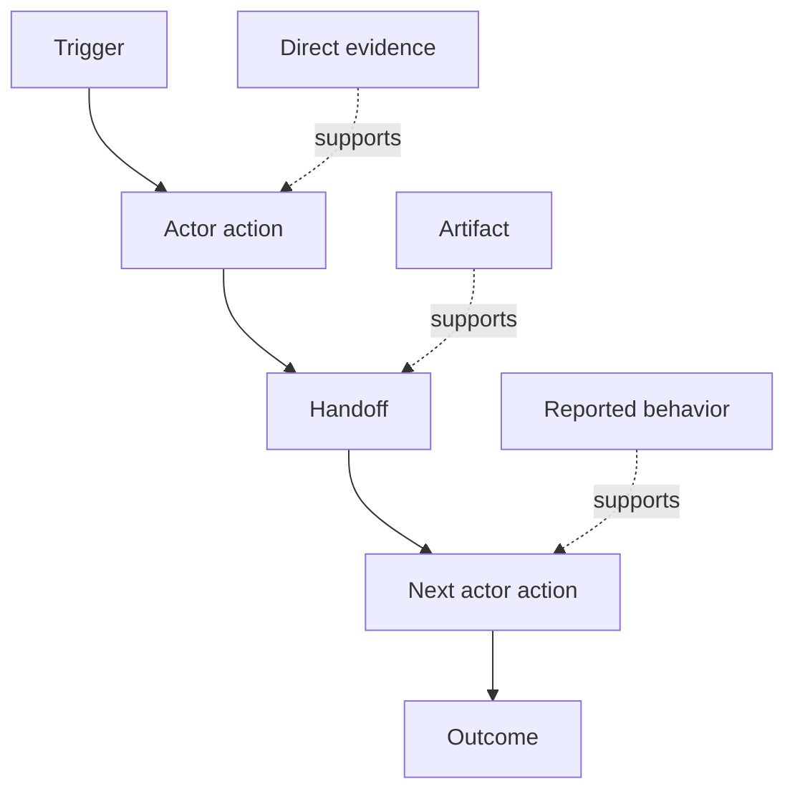

# Descubra el flujo de trabajo que realmente realizan las personas

> Los requisitos no están esperando en una reunión para ser recogidos, sino que están dispersos en acciones, soluciones, registros y desacuerdos.

**Type:** Learn + Build
**Languages:** Python (stdlib)
**Prerequisites:** Phase 14 lesson 47
**Time:** ~70 minutes

## Objetivos de aprendizaje

- Modela el flujo de trabajo actual como acciones ordenadas con evidencia.
- Separar la observación directa del comportamiento informado o inferido.
- Busca fricción, entregues, autoridad y estado oculto.
- Mantenga visibles las afirmaciones inciertas en lugar de convertirlas en requisitos.

## Comience con el sistema actual

No empieces preguntando qué características quieren las personas, comienza reconstruyendo lo que sucede ahora.

Para cada paso, registra:

| Field | Example |
|---|---|
| Actor | On-call engineer |
| Trigger | Production alert arrives |
| Action | Opens alert, then searches dashboards |
| Input | Alert payload and deployment record |
| Output | Candidate service and owner |
| Friction | Context switching across three tools |
| Authority | Incident commander approves a write |
| Evidence | Screen recording, incident log, runbook |

El flujo de trabajo es más grande que la pantalla, incluye la espera, copiar y pegar, canales laterales, aprobación, recuperación de errores y los pasos que la gente ha dejado de notar.

## La evidencia es fuerte

Utilice una escalera de pruebas simple:

1. **Direct behavior:**observación, rastreo, registro o evento del sistema.
2. **Artifact:**billete, libreta de ejecución, registro, formulario o salida completada.
3. **Reported behavior:**una persona describe lo que hacen.
4. **Inference:**El equipo concluye lo que probablemente sucederá.

Los cuatro pueden ser útiles. Sólo los dos primeros prueban el comportamiento actual directamente. Etiquetar el resto para que la confianza no se infle silenciosamente.



## Busca cuatro cosas

- **Friction:**esfuerzo repetido, retraso, reingreso o recuperación.
- **Hidden state:**hechos que se llevan en memoria, en conversación o en notas personales.
- **Authority:**la persona o sistema que permitió efectuar un cambio consecuente.
- **Exceptions:**el caso en que el flujo de trabajo normal deje de ser normal.

Las características de la IA a menudo fallan en las ofertas y excepciones porque el camino feliz era el único camino que se formaba.

## No rechace las diferencias

Los usuarios pueden realizar diferentes flujos de trabajo por buenas razones.

- diferentes funciones;
- diferentes niveles de riesgo;
- el proceso existente y actual;
- las diferencias de conocimientos;
- Un verdadero desacuerdo político.

Un flujo de trabajo promedio no puede describir a nadie.

## Construye el mismo

El laboratorio almacena evidencia en cada paso del flujo de trabajo, valida orden y confianza, calcula la relación entre evidencia directa y escribe `outputs/workflow-evidence.json`¿ Qué ?

```bash
python3 code/main.py
python3 -m unittest discover code/tests -v
```

Añadir un camino excepcional en el que el registro de despliegue está ausente. Mantenga el orden principal intacto y registra dónde comienza la rama.

## Los ejercicios

1. Reconstruir un flujo de trabajo de un registro sin entrevistar a nadie.
2. Entrevistar a un usuario y marcar cada afirmación que aún carezca de pruebas directas.
3. Añadir un límite de autoridad y un paso de recuperación de fallas.
4. Modelo de dos variantes de flujo de trabajo sin fusionarlas.
5. Identifique una característica propuesta que elimine un paso visible pero deje el trabajo oculto intacto.

## Leer más

- [Nuseibeh and Easterbrook, Requirements Engineering: A Roadmap](https://www.cs.toronto.edu/~sme/papers/2000/ICSE2000.pdf), especialmente su tratamiento de la elicitación como interpretación, modelado y validación en lugar de una simple captura.
- [Gotel and Finkelstein, An Analysis of the Requirements Traceability Problem](https://doi.org/10.1109/ICRE.1994.292398), por la dificultad de preservar la relación entre los requisitos y sus fuentes.

## Lo que guardas

Mantenga .`outputs/workflow-evidence.json`Convierte la fricción y la incertidumbre observadas en un mapa de suposiciones en la siguiente lección.
