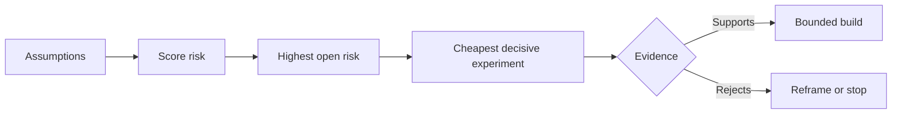

# Mapa de las suposiciones y resuelve primero las más peligrosas

> Un mapa de ruta oculta la incertidumbre dentro de las características.

**Type:** Learn + Build
**Languages:** Python (stdlib)
**Prerequisites:** Phase 14 lesson 48
**Time:** ~65 minutes

## Objetivos de aprendizaje

- Convierta el trabajo propuesto en suposiciones explícitas.
- El impacto, la incertidumbre e irreversibilidad de la puntuación por separado.
- Elige el siguiente experimento por riesgo, no por entusiasmo.
- Replace las suposiciones probadas por pruebas y decisiones.

## Cada edificio contiene apuestas

Una herramienta de incidente puede depender de que todas estas cosas sean ciertas:

- el contexto de la alerta contiene suficiente información para identificar un servicio;
- los ingenieros confían en una recomendación que no se derivan ellos mismos;
- el tiempo de respuesta deseado es importante para el funcionamiento;
- los datos requeridos podrán ser accesibles sin autoridad insegura;
- el flujo de trabajo ocurre con suficiente frecuencia como para justificar el mantenimiento.

Estas no son tareas de implementación, sino condiciones para que la construcción sea valiosa, utilizable, viable y segura.

## Clasificaciones de suposiciones

| Class | Question |
|---|---|
| Value | Will the outcome matter enough? |
| Usability | Can the user understand and act on it? |
| Feasibility | Can the system produce it with available data and constraints? |
| Viability | Can the organization sustain cost, ownership, and operation? |
| Safety | Can it fail without unacceptable consequence? |

Escriba suposiciones como declaraciones falsificables. La característica es útil no puede ser probada. Ocho de cada diez ingenieros en llamada identifican el servicio correcto más rápido con el resultado de sólo lectura puede.

## El riesgo no es un número

El laboratorio utiliza tres dimensiones de uno a cinco:

- **Impact:**daños si la suposición es falsa.
- **Uncertainty:**debilidad de las pruebas actuales.
- **Irreversibility:**el coste del aprendizaje después del compromiso.

El resultado de la prueba multiplica el impacto y la incertidumbre, luego añade irreversibilidad. La fórmula no es universal. Su propósito es obligar al equipo a declarar por qué un desconocido debe resolverse antes que otro.



## Diseñe un experimento, no un ritual de confirmación

Una prueba útil tiene:

- una afirmación que pueda ser falsa;
- una población o una muestra realista;
- un resultado observable;
- un umbral decidido antes del resultado;
- una decisión siguiente por el paso, el fracaso y pruebas ambigüas.

Evite las pruebas que sólo demuestren que el equipo puede construir la idea.

## La reversibilidad cambia el orden

Las opciones de alta consecuencia e irreversibles necesitan pruebas anteriores. Una reproducción de sólo lectura puede preceder a una integración de producción. Un adaptador temporal puede preceder a una migración de datos. Una recomendación aprobada por el hombre puede preceder a una acción automática.

La forma de la construcción debe seguir la forma de la incertidumbre.

## Construye el mismo

El laboratorio clasifica las suposiciones, distingue las pruebas de las afirmaciones abiertas, selecciona el riesgo abierto más alto y escribe `outputs/assumption-map.json`¿ Qué ?

```bash
python3 code/main.py
python3 -m unittest discover code/tests -v
```

Cambia la evidencia sobre la suposición de mayor riesgo y observa cómo cambia el próximo experimento.

## Los ejercicios

1. Escribe cinco suposiciones para una característica que quieres construir.
2. Añadir una suposición de seguridad que la lista de características omitió.
3. Definir un umbral que le haga detener la construcción.
4. Sustituye un experimento grande por un test decisivo más barato.
5. Comparar el ranking de riesgos con la prioridad de la hoja de ruta y explicar la discrepancia.

## Leer más

- [Barry Boehm, A Spiral Model of Software Development and Enhancement](https://dl.acm.org/doi/10.1145/12944.12948), para un ciclo de desarrollo basado en el riesgo que resuelva la incertidumbre antes de un compromiso más profundo.
- [Dardenne, van Lamsweerde, and Fickas, Goal-Directed Requirements Acquisition](https://doi.org/10.1016/0167-6423(93)90021-G), para refinar los objetivos y superar los obstáculos y las limitaciones.

## Lo que guardas

Mantenga .`outputs/assumption-map.json`La siguiente lección la utiliza para elegir la parte más pequeña que pueda producir pruebas decisivas.
