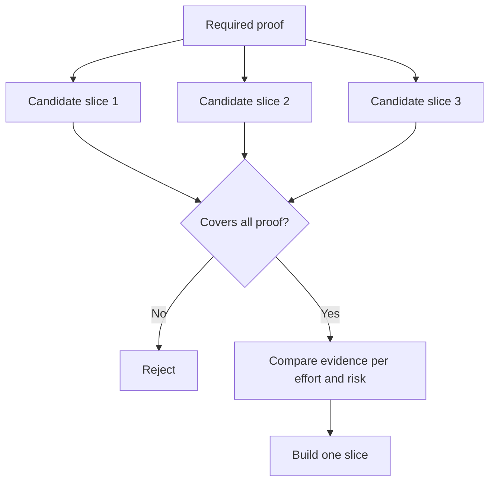

# Elige la parte más pequeña que pueda cambiar la decisión

> Una pequeña construcción que no puede cambiar la próxima decisión es simplemente incompleta.

**Type:** Learn + Build
**Languages:** Python (stdlib)
**Prerequisites:** Phase 14 lesson 49
**Time:** ~65 minutes

## Objetivos de aprendizaje

- Defina una rebanada por las suposiciones que prueba.
- Equilibrar el valor de los resultados, la reducción de la incertidumbre, el esfuerzo y la consecuencia.
- Prefiero pruebas revertibles a la producción prematura.
- Rechazar las recetas que omiten la parte arriesgada del flujo de trabajo.

## Los medios verticales de la evidencia de extremo a extremo

Una parte útil cruza el flujo de trabajo real mínimo necesario para observar un resultado. Puede ser estrecho en usuarios, datos, duración y capacidad. No debe ser estrecho eliminando la incertidumbre exacta que necesita para probar.

Ejemplos:

- Una repetición de sólo lectura en diez incidentes reales prueba la identificación del servicio y la confianza del operador.
- Un panel pulido sobre datos sintéticos puede comprobar la comprensión, pero no la viabilidad de los datos.
- Un automediador de producción prueba todo a la vez con consecuencias inaceptables.

## Defina primero las pruebas requeridas

Tomar los supuestos abiertos de mayor riesgo y convertirlos en un conjunto de pruebas requeridos.

Luego, comparar las rebanas elegibles en:

| Dimension | Direction |
|---|---|
| Outcome value | More is better |
| Uncertainty reduced | More is better |
| Effort | Less is better |
| Consequence | Less is better |
| Reversibility | More is better |

La puntuación del laboratorio es intencionalmente simple. La puerta de elegibilidad importa más que la aritmética.



## Minimos falsos comunes

- **The UI-only minimum:**elimina los datos y la incertidumbre operativa.
- **The infrastructure-only minimum:**prueba una posibilidad técnica sin valor para el usuario.
- **The happy-path minimum:**omite la excepción que genera más riesgos.
- **The demo minimum:**produce un artefacto persuasivo pero no una medición repetible.
- **The platform minimum:**construye maquinaria reutilizable antes de que un flujo de trabajo lo gane.

## Añadir una regla de parada

Antes de la implementación, escriba lo que sucede si la rodaja falla:

- abandonar el resultado;
- cambiar el usuario objetivo o la situación;
- probar un mecanismo diferente;
- recoger mejores pruebas;
- más estrecha autoridad.

Si cada resultado conduce a la construcción, la rebanada no es un experimento.

## Construye el mismo

El laboratorio filtra a los candidatos por la prueba requerida, califica las rebanadas elegibles y escribe `outputs/slice-decision.json`¿ Qué ?

```bash
python3 code/main.py
python3 -m unittest discover code/tests -v
```

Añadir un candidato más barato que demuestre una sola suposición requerida.

## Los ejercicios

1. Diseñar tres rodajas para el mismo resultado en diferentes niveles de consecuencia.
2. Indique la prueba requerida antes de marcarlas.
3. Eliminar una capacidad mientras se conservan las pruebas decisivas.
4. Añade una regla de parada para un piloto fallido.
5. Identifique un componente de plataforma reutilizable que deba esperar hasta que haya terminado la roda.

## Leer más

- [Barry Boehm, A Spiral Model of Software Development and Enhancement](https://dl.acm.org/doi/10.1145/12944.12948), para adaptar cada ciclo de desarrollo a los riesgos que debe resolver.
- [Lenarduzzi and Taibi, MVP Explained: A Systematic Mapping Study on the Definitions of Minimal Viable Product](https://arxiv.org/abs/1609.07592), por la ambigüedad en torno a minimum y viable en la práctica de productos de software.

## Lo que guardas

Mantenga .`outputs/slice-decision.json`Registra por qué esta rebanada es la más pequeña que puede cambiar la decisión.
