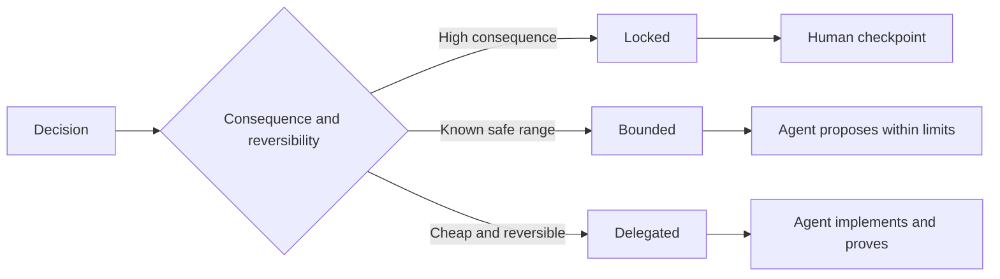

# Escriba especificaciones que preserven el juicio

> Una especificación útil fija invariantes y pruebas dejando abiertas opciones de implementación reversibles. Es un límite de decisión, no un guión.

**Type:** Learn + Build
**Languages:** Python (stdlib)
**Prerequisites:** Phase 14 lesson 50
**Time:** ~75 minutes

## Objetivos de aprendizaje

- Resultados separados, invariantes, ejemplos, no objetivos y prueba.
- Marque las decisiones como cerradas, limitadas o delegadas.
- Preserva el juicio de los agentes donde las opciones son baratas y reversibles.
- Requerir puestos de control humanos donde las consecuencias o el comportamiento público cambie.

## Dos extremos malos

Una tarea subespecificada le pide a un agente que adivine el sistema.

El medio útil es un contrato ejecutable:

| Surface | Purpose |
|---|---|
| Outcome | The observable result |
| Invariants | Conditions that must always remain true |
| Examples | Concrete cases that reveal intent |
| Non-goals | Adjacent behavior intentionally excluded |
| Decision policy | Which choices are locked, bounded, or delegated |
| Proof | Evidence required before completion |

## Tres modos de decisión

- **Locked:**El agente no debe elegir: uso para la compatibilidad pública, autoridad, seguridad, coste irreversible o compromiso de producto.
- **Bounded:**El agente puede elegir dentro de límites explícitos. Uso para presupuestos de búsqueda, recuentos de retemplaje, dependencias permitidas, o una familia de interfaz conocida.
- **Delegated:**El agente es dueño de la elección y debe explicarla.



## Especifique el comportamiento mediante ejemplos

Los ejemplos comprimen mejor la intención que los adjetivos. Helpful, robust, y production-ready no son ejecutables. Un pequeño conjunto de ejemplos normales, ventajas, fallas y prohibidos da algo concreto tanto al constructor como al verificador.

Los ejemplos no reemplazan a las invariantes.

## La prueba debe coincidir con la afirmación

- Una prueba de unidad demuestra un contrato de función local.
- Una prueba de cable prueba la serialización y el comportamiento de transporte.
- Un viaje en el navegador demuestra una ruta de interfaz.
- Un conjunto de repeticiones prueba el comportamiento sobre casos representativos.
- Un registro de auditoría prueba que se cumplen los límites de autoridad.

No acepte una capa inferior como prueba de una afirmación de capa superior.

## Preserva deliberadamente lo desconocido

Una especificación puede decir que la aplicación puede elegir cualquier fuente de lectura única que recaiga dentro del presupuesto temporal. Eso no es vaguedad.

Las especificaciones deben evolucionar cuando las pruebas cambian. Preserva la razón detrás de las opciones bloqueadas y limitadas para que equipos posteriores puedan revisarlas sin arqueología.

## Construye el mismo

El laboratorio valida cada superficie del contrato, verifica los modos de decisión y escribe.`outputs/executable-specification.json`¿ Qué ?

```bash
python3 code/main.py
python3 -m unittest discover code/tests -v
```

Mover la decisión de escribir la producción de bloqueado a delegado. Explicar por qué el esquema acepta el valor pero el riesgo del producto no.

## Los ejercicios

1. Convierta un boleto de atrasos en las seis superficies de especificaciones.
2. Reemplazar las tres instrucciones de implementación por una invariante y dos ejemplos.
3. Marque cada decisión y justifique cada elección bloqueada o limitada.
4. Añadir un recibo de prueba para cada invariante.
5. Eliminar una restricción que no tenga evidencia o razonamiento para el riesgo.

## Leer más

- [Nuseibeh and Easterbrook, Requirements Engineering: A Roadmap](https://www.cs.toronto.edu/~sme/papers/2000/ICSE2000.pdf), para la relación entre objetivos, especificaciones precisas, validación, acuerdo y evolución.
- [Zave and Jackson, Four Dark Corners of Requirements Engineering](https://doi.org/10.1145/267895.267896), para la separación de supuestos, requisitos y especificaciones ambientales.
- [Gotel and Finkelstein, An Analysis of the Requirements Traceability Problem](https://doi.org/10.1109/ICRE.1994.292398), para preservar por qué existe un requisito y de dónde proviene.

## Lo que guardas

Mantenga .`outputs/executable-specification.json`Se convierte en el contrato que comparten los agentes de codificación y los revisores humanos.
