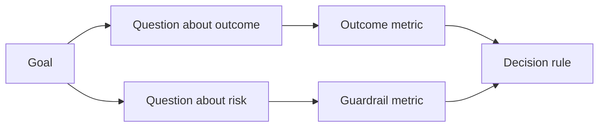

# Diseñar métricas de éxito antes de que exista el resultado

> La medición debe responder a una decisión, no decorar un tablero.

**Type:** Learn + Build
**Languages:** Python (stdlib)
**Prerequisites:** Phase 14 lessons 47 and 51
**Time:** ~70 minutes

## Objetivos de aprendizaje

- Derivar preguntas y métricas de un objetivo final.
- Definir los umbrales, ventanas, fuentes y direcciones antes de observar los resultados.
- Combine las métricas de resultado con barandillas y contra-metricas.
- La prueba de evaluación coincide con la decisión que debe apoyar la construcción.

## Objetivo, pregunta, métrica

Comience con un objetivo:

> Reducir el tiempo para identificar el servicio afectado sin aumentar las acciones inseguras.

Las preguntas derivadas:

- ¿Cuán rápido se identifica el servicio correcto?
- ¿Con qué frecuencia es correcto el servicio identificado?
- ¿El diagnóstico sigue siendo sólo para lectura?
- ¿Aumenta el flujo de trabajo la descarga de alertas o la carga de trabajo del operador?

Luego elija métricas que funcionen esas preguntas.



## Un métrico necesita un contrato

Cada métrica necesita:

| Field | Example |
|---|---|
| Name | `median_identification_seconds` |
| Direction | at most |
| Threshold | 120 |
| Window | ten incident replays |
| Source | replay event log |
| Population | on-call engineers in the pilot |
| Kind | outcome or guardrail |

Sin fuente y ventana, un número no puede reproducirse.

## Resultados, vigilancia y contramedicina

- **Outcome metric:**¿ mejoró el estado deseado?
- **Guardrail:**¿se mantiene una restricción fija?
- **Counter-metric:**¿El cambio de mejoras local costó o dañó en otro lugar?

La precisión, las escrituras de producción, la carga de trabajo del operador y las alertas perdidas protegen contra un resultado rápido pero inseguro.

## Evidencia fuera de línea y en línea

Una repetición fuera de línea es útil para la repetibilidad y la cobertura de bordes. Un piloto limitado es útil para el comportamiento real, la confianza y los efectos del flujo de trabajo. Ninguno de los dos sustituye al otro.

Utilice la evidencia más barata que pueda responder a la decisión actual.

## Decida antes de medir

Escriba el paso, el fracaso y los caminos ambigüos antes de ver los resultados.

Ejemplo:

- Pasar: velocidad de servicio correcta de al menos 0,9 y tiempo medio de 120 segundos como máximo;
- fallas: cualquier tasa de corrección o de escritura de producción inferior a 0,75;
- ambiguo: pequeña mejora con amplia variación, que requiere un conjunto de reproducción más grande.

## Construye el mismo

El laboratorio valida un plan de medición, evalúa los umbrales inclusivos, registra los valores faltantes y escribe `outputs/measurement-report.json`¿ Qué ?

```bash
python3 code/main.py
python3 -m unittest discover code/tests -v
```

Elimine la métrica de barandillas y observa por qué el plan se vuelve inválido incluso cuando las métricas de resultado permanecen.

## Los ejercicios

1. Derivar tres preguntas de un objetivo final.
2. Añadir una contra-metrica que captura el costo trasladado a otro papel.
3. Defina la fuente, población y ventana para cada métrica.
4. Escriba decisiones pasadas, fallidas y ambigüas antes de generar valores.
5. Identifique una métrica que sea fácil de recoger pero que no pueda cambiar la decisión.

## Leer más

- [Basili, Software Modeling and Measurement: The Goal/Question/Metric Paradigm](https://drum.lib.umd.edu/items/8119803a-362b-42ec-b6ce-2311713e7236), para derivar las mediciones operativas de objetivos explícitos.
- [Basili, Caldiera, and Rombach, The Goal Question Metric Approach](https://www.cs.toronto.edu/~sme/CSC444F/handouts/GQM-paper.pdf), para la aplicación del método como sistema de retroalimentación y mejora.

## Lo que guardas

Mantenga .`outputs/measurement-report.json`. Definirá la puerta de prueba para el prototipo, piloto o etapa de producción.
